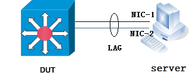
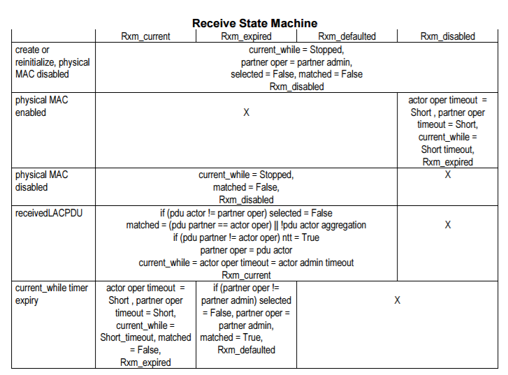
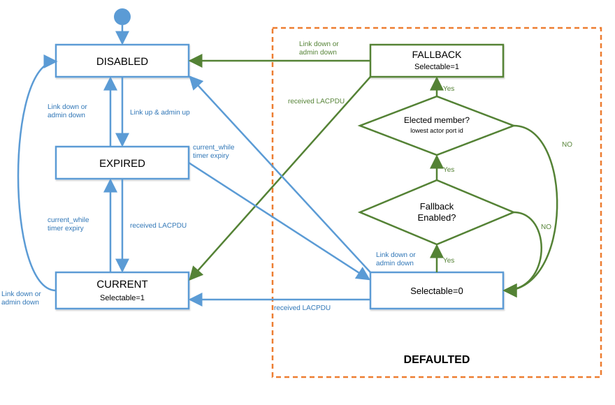
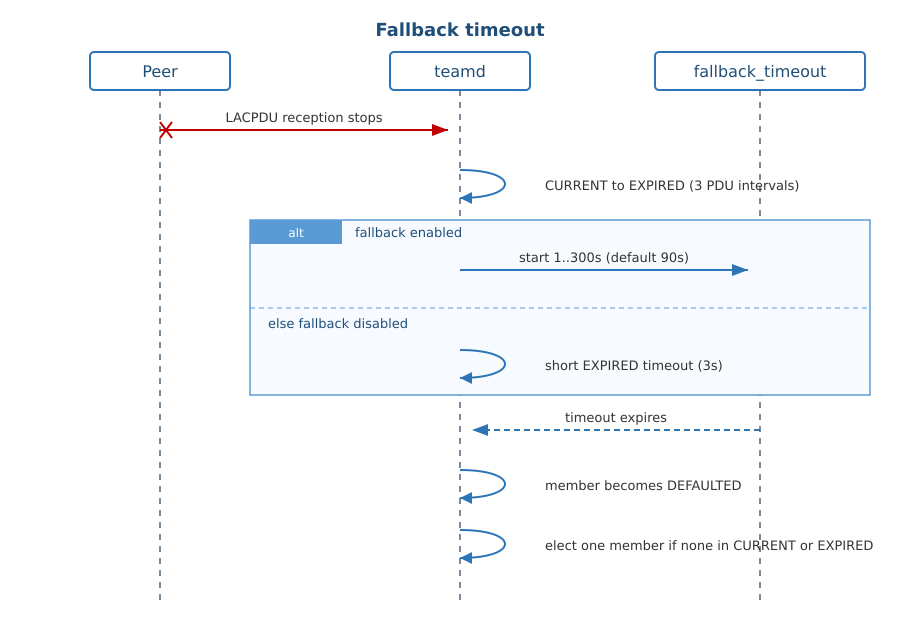

# Introduction
## Overview

The LACP Fallback Feature allows an active LACP interface to establish a Link
Aggregation (LAG) before it receives LACP PDUs from its peer.

This feature is useful in environments where customers have Preboot Execution
Environment (PXE) Servers connected with a LACP Port Channel to the switch.
Since PXE images are very small, many operating systems are unable to leverage
LACP during the preboot process.  The server’s NICs do not have the
capability to run LACP without the assistance of a fully functional OS; during
the PXE process, they are unaware of the other NIC and don't have a method to
form a LACP connection. Both the NIC's on the server will be active and are
sourcing frames from their respective MAC addresses during the initial boot
process.  Simply keeping both ports in the LAG active will not solve the
problem because packets sourced from the MAC address of NIC-1 can be returned
to the port on which NIC-2 is attached, which will cause NIC-2 to drop the
packets (due to MAC mismatch).



With the LACP fallback feature, the switch allows the server to bring up the
LAG (before receiving any LACP PDUs from the server) and keeps a single port
active until it receive the LACP PDUs from the server. The wait before that
fallback port is activated is configurable per LAG. This allows the PXE boot
server to establish a connection over one Ethernet port, download its boot
image and then continue the booting process. When the server boot process is
complete, the server fully forms an LACP port-channel.

## Requirements

- LACP fallback feature can be enabled / disabled per LAG.
- Only one member port will be selected as active per LAG during fallback mode.
- The member port will be moved out of the fallback state if it receives any
  LACP PDU from its peer.
- Fallback timeout can be configured per LAG.
- During fallback, min_links may be overruled to preserve connectivity.
- Interoperability with other devices running standard 802.3ad LACP protocol.
- The LACP runner behavior is not changed if fallback feature is disabled.

## Assumptions

- The LACP fallback feature is implemented on top of the open source libteam
  (https://github.com/jpirko/libteam) adopted by SONiC
- The server is supposed to use only the member port in fallback mode to
  communicate with switch during the fallback mode.
- APPL_DB and SAI are not aware of fallback election state. teammgr maps
  PORTCHANNEL config into teamd when the PortChannel is created. tlm_teamd
  copies teamd runner.fallback and runner.fallback_timeout into STATE_DB.

## Limitations

LACP fallback mode may also kick in during the normal LACP negotiation process
due to the timing, which might cause some unexpected traffic loss. For example,
if the LACP PDUs sent by peer are dropped completely, local member port with
fallback enabled may still enter fallback mode, which might end up with data
traffic loss.

# Background

LACP fallback feature is implemented on the receiver side to establish a LAG
before it receives LACP PDUs from its peer. So this section presents a formal
description of the standard LACP Receive Machine.

## Receive Machine States and Timer
The receive machine has four states:
- Rxm\_current
- Rxm\_expired
- Rxm\_defaulted
- Rxm\_disabled

One timer: Current while timer that is started in the Rxm\_current and
Rxm\_expired states with two timeout: Short timeout (3s) and Long timeout
(90s) depending on the value of the Actor's Operational Status LACP\_Timeout,
as transmitted in LACPDUs.


## Receive Machine Events
The following events can occur:
- Participant created or reinitialized
- Received LACP PDU
- Physical MAC enabled
- Physical MAC disabled
- Current while timer expiry

The physical MAC disabled event indicates that either or both of the physical
MAC transmission or reception for the physical port associated with the actor
have become non-operational. The received LACPDU event only occurs if both
physical transmission and reception are operational, so far as the actor is
aware.



# LACP Fallback Design

With the standard rx state machine described above, the member port will be put
into defaulted state if the member port never receives LACP PDUs from remote
end. And the member port is not selectable in defaulted state, thus the member
port cannot be aggregated to the LAG.

In order to support LACP fallback feature, we need to make the port selectable
in defaulted state if fallback is enabled. Hence we'd like to introduce the
fallback mode in defaulted state.



- Fallback Mode:

In this mode, the port selected bit is being set, which means the port is
selectable and can be aggregated into the LAG. If that member receives an
LACP PDU, it moves to CURRENT and LACP negotiation with the peer restarts.

- Fallback Eligible:

This checks whether LACP fallback feature is configured on this LAG. One and
only one member port can be put into fallback mode per LAG. And the server is
supposed to use only the member port in fallback mode to communicate with
switch.

When fallback is enabled, teamd elects exactly one DEFAULTED member:

- If any member is CURRENT or EXPIRED, election result is none (fallback does
  not displace a live or recovering partner).
- Among DEFAULTED members, elect the lowest actor port id.
- After each port state change, election is recomputed. If the elected member
  changes, aggregator membership is re-evaluated so the previous member is
  released and the new one is selected.

With fallback active, teamd can keep LAG carrier up on the elected member even
if enabled members are below configured min_links.

To summarize, in the defaulted state, we have
```
If member port is configured with fallback enable
    AND it is the elected fallback member
	Selectable = 1
Else
	Selectable = 0
```

## Fallback timeout

If fallback is enabled, fallback_timeout controls how long a member stays in
EXPIRED before transitioning to DEFAULTED. Range is 1..300 seconds; default is
90 seconds. teammgr maps PORTCHANNEL config to teamd runner settings when the
PortChannel is created: if fallback is false, fallback_timeout is not sent and
teamd runtime is 0; if fallback is true and timeout is unset, the default is
used; if fallback is true and timeout is set, the configured value is sent.



# LACP Fallback Config
## JSON Config

teamd is configured using JSON config string. This can be passed to teamd
either on the command line or in a file. JSON format was chosen because it's
easy to specify (and parse) hierarchic configurations using it.

Example teamd config (teamd1.conf):
```
{
        "device":"team0",
        "runner":
        {
                "name":"lacp",
                "active": true,
                "fast_rate": true,
                "fallback": true,
                "fallback_timeout": 120,
                "tx_hash": ["eth", "ipv4"]
        },
        "link_watch":{"name":"ethtool"},
        "ports":
        {
                "Ethernet30":{},
                "Ethernet31":{},
                "Ethernet32":{}
        }
}
```

## CLI / YANG

Config CLI:

```
config portchannel add <portchannel_name> --fallback true --fallback-timeout <1-300>
```

YANG:

```
leaf fallback {
    description "Enable LACP fallback feature";
    type stypes:boolean_type;
}
leaf fallback_timeout {
    when "current()/../fallback = 'true' or current()/../fallback = 'True'";
    description "LACP fallback timeout in seconds; applies only when fallback is enabled.";
    type uint16 {
        range 1..300;
    }
    default 90;
}
```

Show CLI:

```
show portchannel
```

```
$ show portchannel
NAME             MIN LINKS  MODE    DESCRIPTION      MTU  ADMIN STATUS    LACP KEY    TPID    FALLBACK    FALLBACK TIMEOUT    FAST RATE
-------------  -----------  ------  -------------  -----  --------------  ----------  ------  ----------  ------------------  -----------
PortChannel10            2  N/A     N/A             9100  up              auto        N/A     true        120                 true
```

The following show commands relevant for LACP are also supported:

```
	Teamshow
	Teamdctl teamdevname state
```

## CONFIG_DB

Table: PORTCHANNEL

| Field | Type/Range | Behavior |
| ----- | ---------- | -------- |
| fallback | boolean | Enable LACP fallback |
| fallback_timeout | 1..300 (seconds) | Valid only when fallback is true. Absent when CLI omits --fallback-timeout; teamd then uses the default. |

Example:

```
{
  "PORTCHANNEL": {
    "PortChannel10": {
      "admin_status": "up",
      "min_links": "2",
      "fallback": "true",
      "fallback_timeout": "120",
      "fast_rate": "true"
    }
  }
}
```

## STATE_DB

LAG_TABLE fields populated from the teamd runner:

| Field | Behavior |
| ----- | -------- |
| runner.fallback | true or false |
| runner.fallback_timeout | 0 when fallback is false; configured value, or the default when fallback is true and unset |

## Minigraph Config

```
<PortChannelInterfaces>
  <PortChannel>
    <Name>PortChannel01</Name>
    <AttachTo>Ethernet0</AttachTo>
    <Fallback>true</Fallback>
    <SubInterface/>
  </PortChannel>
</PortChannelInterfaces>
```

fallback_timeout is not a minigraph field; unset timeout uses the default.

# References

- SONiC Configuration Management
- Open Source libteam https://github.com/jpirko/libteam
- IEEE 802.3ad Standard for LACP http://www.ieee802.org/3/ad/public/mar99/seaman_1_0399.pdf
