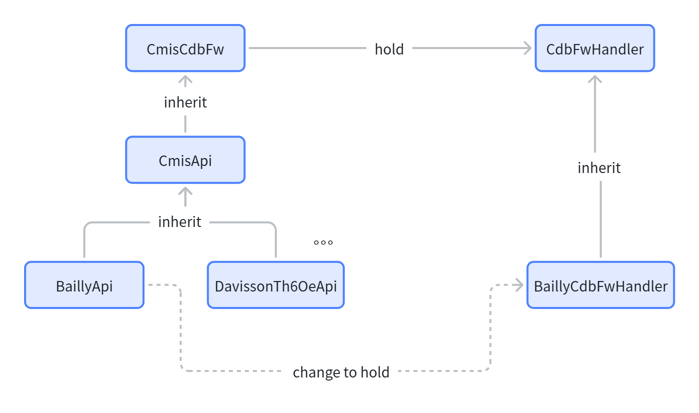

`class BaillyApi(CmisApi):class BaillyApi(CmisApi):`

# HLD: CPO Firmware Upgrade CMIS Bailly API

## Table of Contents
- [HLD: CPO Firmware Upgrade CMIS Bailly API](#hld-cpo-firmware-upgrade-cmis-bailly-api)
  - [Table of Contents](#table-of-contents)
  - [1. Revision](#1-revision)
  - [2. Scope](#2-scope)
  - [3. Background \& Class Hierarchy](#3-background--class-hierarchy)
    - [3.1 Original Community Class Structure](#31-original-community-class-structure)
    - [3.2 CPO Extension Architecture Adjustment](#32-cpo-extension-architecture-adjustment)
    - [3.3. Class Inheritance Design](#33-class-inheritance-design)
  - [4. CDB Opcode Reuse \& Override Rule](#4-cdb-opcode-reuse--override-rule)
    - [4.1 Default Reuse Rule](#41-default-reuse-rule)
    - [4.2 Example Implementation of BaillyCdbFwHandler](#42-example-implementation-of-baillycdbfwhandler)
  - [5. Full CDB Command Call Flow (Unchanged Upper Layer)](#5-full-cdb-command-call-flow-unchanged-upper-layer)
  - [6. Core Design Benefits](#6-core-design-benefits)
  - [7. Open Items](#7-open-items)
  - [8. Summary](#8-summary)


## 1. Revision

| Rev | Date       | Author      | Change Description                                                                                                                                                                     |
| --- | ---------- | ----------- | -------------------------------------------------------------------------------------------------------------------------------------------------------------------------------------- |
| 0.1 | 2026-08-02 | KroosMicas  | Initial version: Focus on extending base`CdbFwHandler` via inheritance for CPO; reuse standard 0x0100/0101/0102/0104/0107/0109/010A CDB commands, override only differentiated logic |

## 2. Scope

This HLD only covers the CDB firmware handler extension design inside CPO firmware upgrade stack, **excludes CLI layer**.
Core design principle:

1. Reuse community base `CdbFwHandler` as parent class for all standard CDB firmware opcodes (0x0100,0x0101,0x0102,0x0104,0x0107,0x0109,0x010A).
2. Vendor implements `BaillyCdbFwHandler(CdbFwHandler)` subclass: reuse parent methods by default; override individual opcode functions only when Bailly CPO hardware has special processing logic.
3. Inheritance chain: `CmisCdbFw` → `CmisApi(CmisCdbFw, XcvrApi)` → `BaillyApi(CmisApi)`.
4. `BaillyApi` overrides the `cdb_fw_hdlr` property inherited from `CmisCdbFw`, so `self._cdb_fw_hdlr` will be instantiated as `BaillyCdbFwHandler` instead of base `CdbFwHandler`.
5. All upper-layer firmware flow logic inside `CmisCdbFw` remains unchanged, transparent to caller.

## 3. Background & Class Hierarchy

### 3.1 Original Community Class Structure

```python
# Base CDB firmware handler with all 7 standard CDB firmware opcodes
class CdbFwHandler:
    def get_fw_status(self):       # 0x0100
    def start_fw_download(self):   # 0x0101
    def abort_fw_download(self):   # 0x0102
    def write_lpl_block(self):     # 0x0103 LPL
    def write_epl_block(self):     # 0x0104 EPL
    def complete_fw_download(self):# 0x0107
    def run_fw_image(self):        # 0x0109
    def commit_fw_image(self):     # 0x010A

# CDB firmware capability wrapper, provides high-level upgrade APIs
class CmisCdbFw:
    @property
    def cdb_fw_hdlr(self):
        if self._cdb_fw_hdlr is None:
            self._cdb_fw_hdlr = self._create_cdb_fw_handler()
        return self._cdb_fw_hdlr

    def _create_cdb_fw_handler(self):
        # Default: create standard base handler
        return CdbFwHandler(self.xcvr_eeprom.reader, self.xcvr_eeprom.writer, self._cdb_mem_map)

# Unified CMIS transceiver API, inherits CmisCdbFw to get all CDB firmware methods
class CmisApi(CmisCdbFw, XcvrApi):
    pass
```

- `CmisCdbFw` is the upper API layer, all firmware operations forward to `self._cdb_fw_hdlr`;
- Base `CdbFwHandler` implements standard CMIS CDB firmware command logic for common pluggable modules;
- CPO hardware (MCU/OE/ELS partitioned firmware) has customized CDB processing logic for partial opcodes, so inheritance extension is introduced.

### 3.2 CPO Extension Architecture Adjustment

```Python
# Step1: Vendor custom CDB handler inheriting base community handler
class BaillyCdbFwHandler(CdbFwHandler):
    def __init__(self, reader, writer, cdb_map):
        super().__init__(reader, writer, cdb_map)

    # Reuse parent implementation for consistent opcodes (no override needed)
    # Override single opcode method only if Bailly hardware has different logic
    def write_epl_block(self, address, data):
        # Example: OE firmware strip 4-byte header, vendor custom logic
        stripped = data[4:]
        return super().write_epl_block(address, stripped)

# Step2: Bailly transceiver API inherits standard CmisApi
class BaillyApi(CmisApi):
    # Override cdb_fw_hdlr property from parent CmisCdbFw
    @property
    def cdb_fw_hdlr(self):
        if not self._init_cdb_fw_handler:
            return None
        if self._cdb_fw_hdlr is None:
            # Instantiate vendor-specific BaillyCdbFwHandler instead of base CdbFwHandler
            self._cdb_fw_hdlr = BaillyCdbFwHandler(
                self.xcvr_eeprom.reader,
                self.xcvr_eeprom.writer,
                self._cdb_mem_map,
            )
        return self._cdb_fw_hdlr
```

### 3.3. Class Inheritance Design



* `CmisApi` inherits `CmisCdbFw`, so it owns the original `cdb_fw_hdlr` property and all high-level firmware APIs (`module_fw_download`, `module_fw_run`, etc.).
* `BaillyApi` inherits `CmisApi`, and overrides the `cdb_fw_hdlr` property.
* When any firmware API inside `CmisCdbFw` accesses `self.cdb_fw_hdlr`, it will resolve to the overridden property in `BaillyApi`, returning `BaillyCdbFwHandler` instance.
* No changes required to `CmisCdbFw`, `CmisApi`, or any upper calling logic; vendor differentiation is fully encapsulated in `BaillyApi` + `BaillyCdbFwHandler`.

## 4. CDB Opcode Reuse & Override Rule

### 4.1 Default Reuse Rule

For each of the seven CDB firmware commands:

1. If CPO hardware processing logic is consistent with standard CMIS, **do not override method**, directly inherit & call parent `CdbFwHandler` implementation;
2. If CPO has different register offset, payload format, partition routing, handshake sequence for an opcode, override the corresponding function inside `BaillyCdbFwHandler`.

Mapping between CDB opcode and base handler method:

| CDB Opcode | Base CdbFwHandler Method | Reuse Policy                                                                          |
| ---------- | ------------------------ | ------------------------------------------------------------------------------------- |
| 0x0100     | get_fw_status()          | Default reuse parent; override only if CPO status register layout differs             |
| 0x0101     | start_fw_download()      | Default reuse parent; override if CPO needs partition index routing at download start |
| 0x0102     | abort_fw_download()      | Default reuse parent; override only if CPO abort cleanup flow changes                 |
| 0x0104     | write_epl_block()        | Default reuse parent; override for OE/ELS special payload header stripping logic      |
| 0x0107     | complete_fw_download()   | Default reuse parent; override if CPO adds extra partition CRC validation             |
| 0x0109     | run_fw_image()           | Default reuse parent; override if CPO partition reset mode differs                    |
| 0x010A     | commit_fw_image()        | Default reuse parent; override if CPO persistent storage logic differs                |

### 4.2 Example Implementation of BaillyCdbFwHandler

```python
class BaillyCdbFwHandler(CdbFwHandler):
    def __init__(self, reader, writer, cdb_map):
        super().__init__(reader, writer, cdb_map)

    # Case 1: No override, directly use parent logic (0x0100 example)
    # def get_fw_status(self):
    #     return super().get_fw_status()

    # Case 2: Override when CPO has differentiated logic (0x0104 block write example)
    def write_epl_block(self, address, data):
        # Bailly OE firmware needs strip 4-byte start address header, customized logic
        stripped_data = data[4:]
        return super().write_epl_block(address, stripped_data)

    # Case 3: Override start download to inject CPO partition ID (0x0101)
    def start_fw_download(self, filepath):
        # Inject CPO partition info before parent download initialization
        # Todo
        return super().start_fw_download(filepath)
```

## 5. Full CDB Command Call Flow (Unchanged Upper Layer)

All high-level firmware functions are defined in `CmisCdbFw`, and directly call `self.cdb_fw_hdlr` without modification.

When the transceiver instance is `BaillyApi`, `self.cdb_fw_hdlr` points to `BaillyCdbFwHandler`:

```
BaillyApi (inherits CmisApi → CmisCdbFw)
        ↓
Call CmisCdbFw.module_fw_download()
        ↓
Access self.cdb_fw_hdlr (resolved from BaillyApi overridden property → BaillyCdbFwHandler instance)
        ↓
self.cdb_fw_hdlr.start_fw_download()    # 0x0101
self.cdb_fw_hdlr.write_epl_block()     # 0x0104 (uses overridden vendor logic if defined)
self.cdb_fw_hdlr.complete_fw_download()# 0x0107

Call CmisCdbFw.module_fw_run()
        ↓
self.cdb_fw_hdlr.run_fw_image()        # 0x0109

Call CmisCdbFw.module_fw_commit()
        ↓
self.cdb_fw_hdlr.commit_fw_image()     # 0x010A

Status query / Recovery flow
        ↓
self.cdb_fw_hdlr.get_fw_status()       # 0x0100
self.cdb_fw_hdlr.abort_fw_download()   # 0x0102
```

## 6. Core Design Benefits

1. Zero modification to community shared classes (`CmisCdbFw`, `CmisApi`, `CdbFwHandler`). All vendor custom logic is isolated in vendor proprietary subclass files.
2. Upper layer caller logic fully transparent: no branch judgment for CPO hardware, unified API invocation path.
3. Fine-grained extension capability: only override individual opcode methods with hardware differences, maximize reuse of standard CMIS CDB command logic.
4. Clean inheritance hierarchy compliant with existing SONiC transceiver class extension pattern: vendor-specific XcvrApi inherits standard CmisApi.
5. Override point is centralized in `BaillyApi.cdb_fw_hdlr` property, uniformly switching the underlying CDB handler instance without scattered factory code changes.

## 7. Open Items

If any

## 8. Summary

* Class inheritance chain: `CdbFwHandler` (base) → `BaillyCdbFwHandler` (vendor custom handler); `CmisCdbFw` → `CmisApi(CmisCdbFw, XcvrApi)` → `BaillyApi(CmisApi)`.
* `BaillyApi` overrides the inherited `cdb_fw_hdlr` property, so `self._cdb_fw_hdlr` is instantiated as `BaillyCdbFwHandler` instead of standard base handler.
* Seven core CDB firmware opcodes reuse parent `CdbFwHandler` implementation by default; vendor only overrides individual opcode functions with hardware-specific logic.
* All high-level firmware upgrade APIs inside `CmisCdbFw` remain unchanged, fully transparent to upper-layer business logic.
