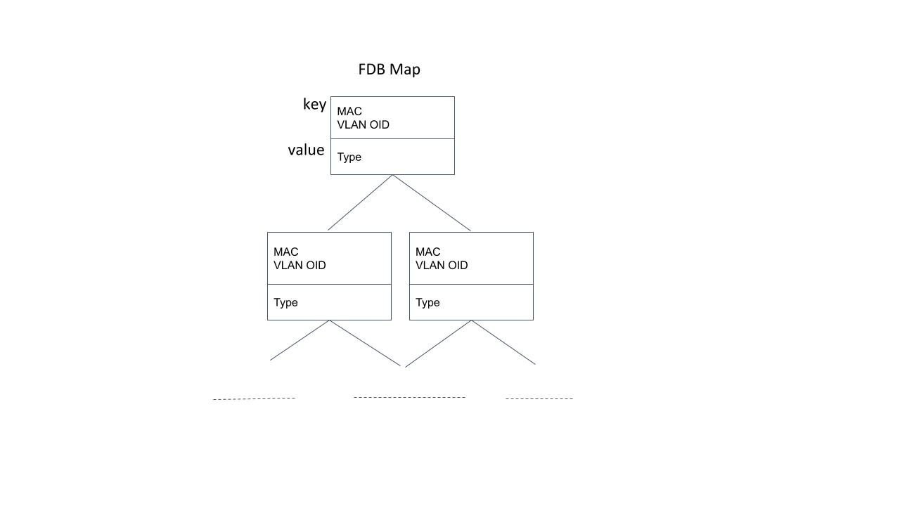
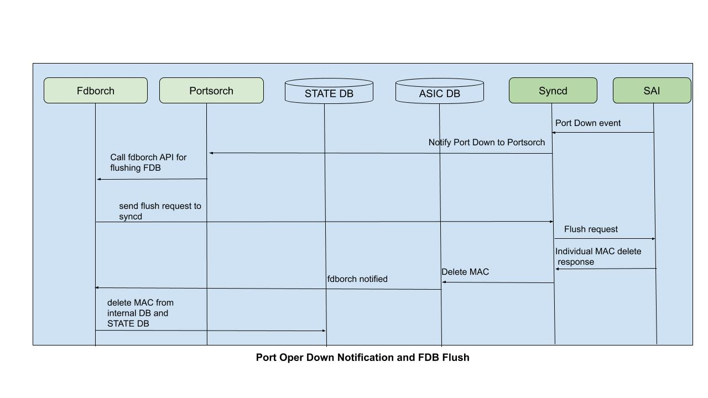
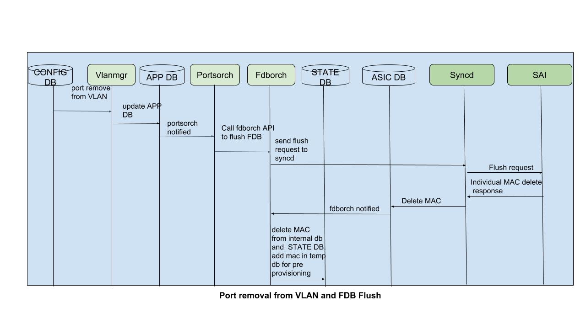
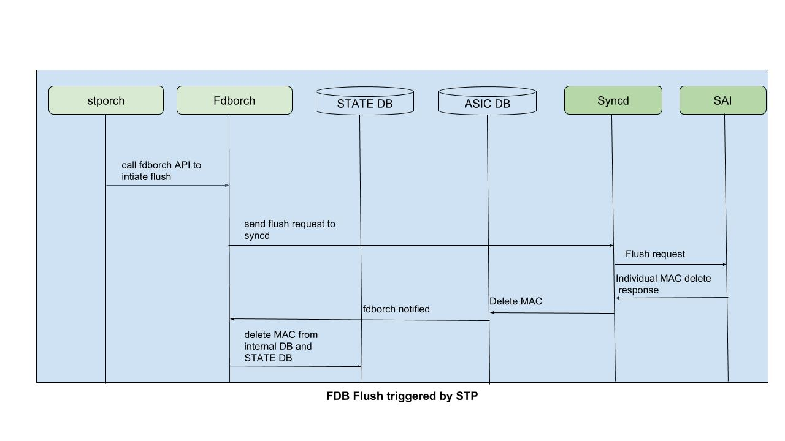

# Layer 2 Forwarding Enhancements
#### Rev 1.0

# Table of Contents
  * [List of Tables](#list-of-tables)
  * [Revision](#revision)
  * [About This Manual](#about-this-manual)
  * [Scope](#scope)
  * [Definition/Abbreviation](#definitionabbreviation)
  * [1. Requirements Overview](#1-requirement-overview)
	  * [1.1 Functional Requirements](#11-functional-requirements)
	  * [1.2 Configuration and Management Requirements](#12-configuration-and-management-requirements)
	  * [1.3 Scalability Requirements](#13-scalability-requirements)
	  * [1.4 Warm Boot Requirements](#14-warm-boot-requirements)
  * [2. Functionality](#2-functionality)
	  * [2.1 Functional Description](#21-functional-description)
  * [3. Design](#3-design)
	  * [3.1 Overview](#31-overview)
	  * [3.2 DB Changes](#32-db-changes)
		  * [3.2.1 CONFIG DB](#321-config-db)
	  * [3.3 Switch State Service Design](#33-switch-state-service-design)
		  * [3.3.1 Orchestration Agent](#331-orchestration-agent)
		  * [3.3.2 Other Process](#332-other-process)
	  * [3.4 Syncd](#34-syncd)
	  * [3.5 SAI](#35-sai)
	  * [3.6 CLI](#36-cli)
		  * [3.6.1 Configuration Commands](#361-configuration-commands)
		  * [3.6.2 Show Commands](#362-show-commands)
  * [4. Flow Diagrams](#4-flow-diagrams)
  * [5. Serviceability and Debug](#5-serviceability-and-debug)
  * [6. Warm Boot Support](#6-warm-boot-support)
  * [7. Scalability](#7-scalability)
  * [8. Unit Test](#8-unit-test)
	

# List of Tables
[Table 1: Abbreviations](#table-1-abbreviations)

# Revision
| Rev |     Date    |       Author       | Change Description                         |
|:---:|:-----------:|:------------------:|--------------------------------------------|
| 1.0 | 04/30/2019  |   Anil Pandey      | Added detailed requirements                |
|     |             |                    | Added detailed Unit Test cases             |
| 0.3 | 04/29/2019  |   Pankaj Jain      | Modified static-mac and aging commands     |
| 0.2 | 04/26/2019  |   Anil Pandey      | Merged VLAN Range FS contents              |
| 0.1 | 04/11/2019  |   Anil Pandey      | Initial version                            |

# About this Manual
This document provides general information about the Layer 2 Forwarding Enhancements feature implementation in SONiC.
# Scope
This document describes the high level design of Layer 2 Forwarding Enhancements feature. 

# Definition/Abbreviation
### Table 1: Abbreviations
| **Term**                 | **Meaning**                         |
|--------------------------|-------------------------------------|
|   FDB                    |  Forwarding Database                |

# 1 Requirement Overview
## 1.1 Functional Requirements

 1. FDB Flush Support
	 - FDB entries should be flushed per Port when the operational state of the port goes down. Only dynamic entries should be flushed.
	 - FDB entries should be flushed per Port per VLAN when a port is removed from a VLAN. Both dynamic and static entries should be flushed. Static FDB configuration should not be removed.
	 - FDB entries should be flushed per Port or per Port per VLAN when triggered by Layer 2 Protocol upon topology change. Only dynamic entries should be flushed.
	 - FDB entries should be flushed per Portchannel when the admin or operational status of the Portchannel goes down.
	 - FDB entry should be removed from FDB_TABLE in STATE_DB and ASIC_SB and internal orchagent FDB data structure and Hardware.
	
2. Handle MAC move event generated by hardware.
	- Existing FDB entry should be replaced with one having new Port in ASIC_DB and STATE_DB when a MAC move event is received.
	
3. Configuration CLI for FDB aging time.
	- The FDB aging time should be configurable in hardware to a desired value from CLI.
	- There should be an option to disable aging by setting the aging time to 0.
	- The default FDB aging time should be set to 600 seconds. 
	
4. Configuration CLI for Static FDB entry.
	- A Static FDB entry should be configurable in hardware from CLI.
	- Static FDB entry should be set in CONFIG_DB and APP_DB even if the port is not member of VLAN.
	- Static FDB entry should be added in saved FDB in Orchagent if port is not member of VLAN.
	- Static FDB entry should be added in saved FDB in Orchagent after the entry is deleted due to FDB flush when port is removed from VLAN.
	- Static FDB entry should be added in STATE_DB.
	
5. Should have per Port, per VLAN and  per Port per VLAN FDB clear options in CLI command "sonic-clear fdb".

6. VLAN range CLI support
	- Should be able to create a range of VLANs in a single CLI command.
	- Should be able to delete a range of VLANs in a single CLI command.
	- Should be able to add a port to a range of VLANs in a single CLI command.
	- Should be able to delete a port from a range of VLANs in a single CLI command.

## 1.2 Configuration and Management Requirements
- New CLI is added for configuring FDB aging time.
- New CLI is added to display current FDB aging time.
- New CLI is added for add/delete of Static FDB entry.
- Existing CLI 'sonic-clear fdb' is extended to clear FDB per port or per VLAN or per Port per VLAN.
- Existing CLI tree is extended to include support for keyword 'range' in each of the VLAN create and delete and VLAN member create and delete commands.

## 1.3 Scalability Requirements
- Up to 4094 VLAN will be supported.
- VLAN range commands are invalidated for VLANs that fall outside the range 1 through 4094
  (Aforementioned range should be configurable and valid).

## 1.4 Warm Boot Requirements
Warm boot support already exists.

# 2 Functionality

## 2.2 Functional Description
**1. FDB Flush suport**
- When a port operational state goes down, all dynamic FDB entries  will be flushed on the port.  The entries will be removed from FDB_TABLE in ASIC_DB, STATE_DB and Hardware and Orchagent data structures. Portchannel admin or operational state down will also be handled similarly.
- When a port is removed from VLAN, all static and dynamic FDB entries  will be flushed on the (port,VLAN). Static FDB entries will still be preserved in the FDB_TABLE in CONFIG_DB and APP_DB. When port is added back to VLAN, Orchagent will reprogram the FDB entries. 
- Spanning Tree Protocol  to flush dynamic FDB entries either on a Port or on (Port,VLAN) when topology change occurs. API will be provided in Orchagent for L2 protocol component to flush FDB entries accordingly.
  

**2. Handle MAC move events.**
- MAC move event generated by some hardware (e.g. DNX) is currently not handled in SAI and SONiC. Will add support in Orchagent for moving the FDB entry to new port upon receipt of such event. 
  

**3. Configuration for FDB aging time.**
- CLI configuration  to be added to change the FDB aging time. By default, the aging time in hardware is 0 and set to 600 seconds in SONiC. It can be changed to a desired value if CLI is available. Currently, it can be done only by setting in APP_DB. The configuration range will be  0-1,000,000 seconds. Setting aging time to 0 will disable aging.
  

**4. Configuration for static FDB entry.**
- Currently, static FDB can only be added only by setting in APP_DB. CLI configuration will be added for this.
- If a dynamic FDB already exists with the same (MAC, VLAN), it will be replaced with the static entry.
- If the port is not member of VLAN, the static entry will be present in CONFIG_DB and APP_DB. It will also be saved in the orchagent saved FDB until the port is added to the VLAN.
  

**5. FDB clear options for per port and per VLAN ans per Port per VLAN clear.**

 - Currently, "sonic-clear fdb" command has only the option "ALL" supported. Will add options for "PORT" and "VLAN" to clear FDB entries either on a port or on a VLAN or on PORT and VLAN. Only dynamic FDB will be cleared.

 **6. VLAN Range CLI.**
- In current SONiC release, support for VLAN commands through CLI is limited to creating and deleting a single VLAN and adding/removing a port to/from a single VLAN. Support for VLAN range will be added in CLI to enable administrator to create and delete a range of VLANs and add/remove a port to/from a range of VLANs.
- When a large number of interfaces are made members of a huge set of VLANs, deletion of VLANs takes significant time due to the reason mentioned in [Scalability](#7-scalability) section.
-  In SONiC, VLAN operations are performed either through config_db.json file or through CLI commands. In config_db.json file, administrator is required to update the desired VLAN and/or member port in each VLAN as per the JSON file format. This process is overburdening when it is required to manually add/delete VLANs in bulk and add/delete ports to/from VLANs in bulk. Administrator can perform the same operations through CLI commands which, though, is easy, becomes extremely taxing when multiple commands need to be executed to perform bulk operations, like creating/deleting 4094 VLANs and associating/removing ports from each of these VLANs through CLI commands that provide an option to enter only one VLAN.
 - Administrator's task is greatly simplified with provision for VLAN range configuration. And time taken to perform the operations is drastically reduced.

# 3 Design
## 3.1 Overview
Code changes are confined to the components marked in RED.

	**Overview of components involved:**

For FDB flush and FDB aging and Static FDB commands, the design is described in details in the SWSS section.
Overview of changes for VLAN range support is provided below. 

**VLAN Range Support:**

VLAN Range Support: For each of the new commands, a loop is iterated to run though the two configured parameters, first vlan-id and last vlan-id, (as specified in commands listed in section 3.6.2) and CONFIG_DB is updated through a single push operation using redisDB pipelining mechanism. Pipeline mechanism ensures the DB is updated very quick.

Range command issued takes only two VLAN identifiers as arguments. List of VLANs are not configurable. For example, 'config vlan range add 2 10' is allowed and valid, but 'config vlan range add 2 10,3 100' is not valid.

For VLAN range creation, VLAN existence for each VLAN identifier is checked in CONFIG_DB through GET operation prior to adding the redisDB SET to the pipeline. If few VLANs are already created and 'range create' command issued involves such VLANs, a message of severity 'warning' is logged, if the option '-w' is provided while configuring, and non-existent VLANs are created.

For VLAN range deletion, existence of each VLAN is checked and delete operations are added to pipeline and executed at once after iterating through the entire range. For all non-existent VLANs, a single warning message is logged (if the optional argument, '-w', is enabled) after pipeline execution is completed. 

For VLAN member range creation and deletion, similar logic is added. 

VLAN and port identifier validation are added as part of the logic added in the functions for the new commands.

## 3.2 DB Changes
### 3.2.1 CONFIG DB
**FDB table for Static MAC**

FDB_TABLE will be set in CONFIG_DB to store static MAC configuration.

**SWITCH table for Aging time configuration**

SWITCH_TABLE will be set in CONFIG_DB to store FDB aging time configuration.

## 3.3 Switch State Service Design
### 3.3.1 Orchestration Agent

**Data Structure changes**

The internal FDB data structure  will be enhanced to store the FDB type (static/dynamic). Currently, FDB is stored as c++ set. It will be changed to c++ map to store (key, value), where key is (MAC, bv_id) and value is FDB type.
FDB type is needed to add Static FDB to saved FDB after flush.

	**FDB Data structure in Orchagent:**

In current Sonic implementation, when a FDB event is received with VLAN SAI object ID, the VLAN ID is retrieved by traversing through all the ports and VLANs in the orchagent DB and finding the one that matches the object ID. Also, the Port details are retrieved by traversing all the port and VLANs. This approach is inefficient as it may traverse through the number of VLANs configured for each FDB learn event. Worst case time is O(M*N) where M is the number of MAC events and N is the number of entries in port data structure.

A new  unordered_map containing a mapping between SAI object ID (can be either Port object ID or Bridge Port object ID or VLAN object ID) and Name (port or VLAN alias) will be added which can be looked up in O(1) time. The Port or VLAN alias retrieved from this will be looked up in the Port data structure.

	**Object ID to alias mapping.**

**Changes for FDB flush.**
When a FDB flush request is received, Orchagent will send a bulk flush request to syncd. Individual FDB delete response from SAI will be used to delete FDB entries in ASIC_DB, STATE_DB and orchagent data structure. The delete response will be received as AGED event to syncd, which will delete the entry in ASIC_DB and notify Orchagent.

When a port operational status goes down, portsorch will call fdborch API to trigger FDB flush. Only dynamic FDB will be flushed.

When a port is removed from VLAN, portsorch will call fdborch API to trigger FDB flush. Both static and dynamic FDB will be flushed. Also, the static FDB will be added to the temporary DB in orchagent when delete response is received, so that it can programmed back when port is added back to VLAN.

When Spanning tree state changes, protocol component within orchagent will call fdborch API to flush FDB by either per Port or per Port per VLAN. Only dynamic FDB will be flushed.

	**FDB Flush due to Port operational state down:**

	**FDB Flush due to Port removal from VLAN:**

	**FDB Flush due to spanning tree state change:**

**Changes for handling MAC move events.**
Hardware can generate a single MAC move event instead of generating 2 events (del-old mac and add-new mac). Orchagent code changes will be done to replace the existing FDB entry with the new port in STATE_DB. 

**Changes for FDB aging time configuration.**
A new CLI commands will be added for configuring the FDB aging time.
FDB aging time configuration will be set in the SWITCH table in CONFIG_DB. Vlanmgr will populate it in the APP_DB. Orchagent will get notified and handling will be SwitchOrch. SwitchOrch will call sai_redis API to send request to syncd via ASIC_DB.

**Changes for Static FDB configuration.**
New CLI will be added for configuring Static FDB entry. It will be set in the FDB_TABLE in CONFIG_DB. Vlanmgr will handle the CONIG_DB changes, do necessary validations and then populate in APP_DB. FdbOrch already has all the necessary handling for Static FDB changes from APP_DB.
When a port is removed from VLAN, the corresponding Static FDB entries will also be flushed from all databases except APP_DB and CONFIG_DB.  Flushed static FDB will be stored in the saved FDB in orchagent for retrieval and programming later when port is added back to VLAN.
If a dynamic FDB is already learnt and a static FDB is configured with same (MAC, VLAN), the existing dynamic FDB entry will be replaced with the static entry.

### 3.3.2 Other Process 
**Vlanmgr changes**

Vlanmgr will handle Aging time configuration changes from SWITCH table in CONFIG_DB. It will set the new aging time in SWITCH_TABLE in APP_DB, which will be processed by SwitchOrch.

Vlanmgr will handle Static FDB configuration from FDB table in CONFIG_DB. It will do validation and then set the static FDB in FDB_TABLE in APP_DB, which will be processed by FdbOrch.

## 3.4 SyncD
No change.

## 3.5 SAI
No changes are being made in SAI. The following SAI attributes are used by the changes being made to SONiC:

1. SAI_FDB_FLUSH_ATTR_BRIDGE_PORT_ID
2. SAI_FDB_FLUSH_ATTR_BV_ID
3. SAI_FDB_FLUSH_ATTR_ENTRY_TYPE
4. SAI_FDB_ENTRY_ATTR_TYPE
5. SA_FDB_EVENT_MOVE
6. SAI_SWITCH_ATTR_FDB_AGING_TIME

## 3.6 CLI

### 3.6.1 Configuration Commands
**FDB Aging time configuration**

root@sonic:/# config mac aging-time <value>
- To set the mac aging time to a value.

**Static MAC configuration**

root@sonic:/# config mac add 00:10:3a:2b:05:67 100 Ethernet2
- To add a static mac on vlan 100 and port Ethernet2.

root@sonic:/# config mac del 00:10:3a:2b:05:67 100
- To delete a static mac on vlan 100.

**VLAN Range configuration**

root@sonic:/# config vlan range add <-w, optional argument>

root@sonic:/# config vlan range del <-w, optional argument>

root@sonic:/# config vlan member range add <interface_id> <-w, optional argument>

root@sonic:/# config vlan member range del <interface_id> <-w, optional argument>

### 3.6.2 Show Commands

root@sonic:/# show mac aging-time
- To display the current configured mac aging time.

# 4 Flow Diagrams
Flow diagrams are provided in the [Design](#3-design) section.

# 5 Serviceability and Debug
Debug counters will be added for all operations and events related to L2 forwarding like the following:
In Orchagent:
- Number of FDB learn/aged events received from ASIC_DB.
- Number of FDB add/delete request received from APP_DB.
- Number vlan add/delete received from APP_DB.
- Number of FDB entries inserted in the saved FDB database.
- Number of FDB add/delete requests sent to syncd.
- Counters for various failure conditions.

NOTICE/INFO level logs will be added for major operations and events in vlanmgr and orchagent.

Logic is added in the functions for VLAN range commands to append warning messages to a list and are displayed if the optional argument is provided. Iteration in the loops is not intentionally broken, if an existing/non-existing VLAN is trying to be operated upon, to ensure configuration for other VLANs goes through successfully.

# 6 Warm Boot Support

No change.

# 7 Scalability

If the number of VLANs in the range commands is high, the time it takes to perform the operation increases, though it is significantly lower compared to the same operation being performed using existing commands.

# 8 Unit Test

**Data structure changes**

1. Verify that FDB internal map is updated properly when a FDB entry is added/deleted in hardware or when a static FDB entry is added/deleted.

2. Verify that SAI Object ID to port/VLAN name mapping table is updated properly when a port/port-channel or VLAN is added/removed

**FDB flush**

3. Verify that dynamic fdb entries are flushed in hardware, orchagent data structure and other DBs when a port/portchannel operational state goes down.

4. Verify that dynamic fdb entries are flushed in hardware, orchagent data structure and other DBs when a port/portchannel admin state goes down.

5. Verify that FDB entries are added back properly when the port comes back operationally up.

6. Verify that both static and dynamic fdb entries are flushed in hardware, orchagent data structure, STATE_DB and ASIC_DB when a port is removed from VLAN.

7. Verify that the flushed static FDB entries are stored in saved FDB in orchagent.

8. Verify that FDB entries are added back properly when the port is added back to the vlan.

9. Verify that dynamic fdb entries are flushed in hardware, orchagent data structure and other DBs when 'sonic-clear fdb all" command is issued.

10. Verify that dynamic fdb entries on a port are flushed in hardware, orchagent data structure and other DBs when 'sonic-clear fdb port" command is issued.

11. Verify that dynamic fdb entries on a VLAN are flushed in hardware, orchagent data structure and other DBs when 'sonic-clear fdb vlan" command is issued.

12. Verify that mac are learnt properly again after flush due to 'sonic-clear' command.

13. Send traffic from same MAC, VLAN to a different port and verify that mac is updated in hardware, ASIC_DB, STATE_DB and orchagent data structure.

**FDB Aging time configuration**

14. Set FDB aging time from CLI and verify that FDB entries age out after that interval.

15. Verify that FDB aging time takes effect after configuration is saved and switch is rebooted.

**Static FDB entry configuration**

16. Verify that Static FDB entry configured from CLI is added in hardware and all other DBs.

18. Verify that if port is not member of VLAN, Static FDB entry is added in CONFIG_DB, APP_DB and saved FDB in orchagent.

19. Verify that Static FDB entry is effective after configuration is saved and switch is rebooted..

**Warm restart**

20. Verify that Aging time and static MAC configuration are re-applied after switch, swss docker, syncd and orchagent warm reboot.

21. Verify that FDb entries are synchronized after Orchagent unplanned reboot if the reboot happens while FDB flush is in progress.

**Scale test**

22. Verify 8K FDB entry learning. All entries should be added to various DBs, hardware and Orchagent data structure.

23. Verify 8K FDB entry aging. All entries should be deleted from various DBs, hardware and Orchagent data structures.

24. Verify 8K FDB entry flush per port, per VLAN and per port per VLAN.

26. Learn 8K FDB entries on 4094 VLANs and verify the above cases.

**VLAN Range:**

27. Validate VLAN identifier in VLAN range commands.
28. Check log messages (when '-w' option is provided) for overlapping and non-existent VLANs provided in VLAN range commands. Any conflicting configuration (for example: portchannel having an IP address configured being configured to participate in a VLAN) results in warning messages. Messages are grouped and displayed after the execution of the commands.
29. Validate the port data provided in VLAN member range command.
30. Validate the traffic flow after the VLANs are created and member ports are added.
31. Ensure the ports removed from the VLANs are excluded from the hardware by sending matching traffic flows.
32. Ensure the deletion of range of VLANs is successful.
33. Create a range of VLANs and save the configuration. Check for the existence of VLANs after reload operation.
34. Remove few VLANs randomly after executing the command to create a range of VLANs. Check for the existence of the rest of the VLANs.

<!--stackedit_data:
eyJoaXN0b3J5IjpbMTU1NzM0MzYwNywtNjE4MzIyOCwxNzAzNj
A2MTgsNTM1ODQ1MzAyLC05ODY2MzQyOTQsNDgwMDM4OCwtMTcw
MjYxNDMwOSwxODM5ODM3MDAsLTI1OTg4MTg0NCwtMTYyMzczNz
cxOCw4Mzk1NTMwNiwyMDAxNzMyMjc4LDcxOTU1MTkwMCwtNjEw
MzI0Mzk0LDE1MzA1MDA2MDgsMzU4Nzg3NjE3LDQ3NzIyNzI2Ni
wtMTk2MDMyNTE0OSwtMTQwOTUzNDYyNCwtMjA4NjI2MjIzOV19

-->
