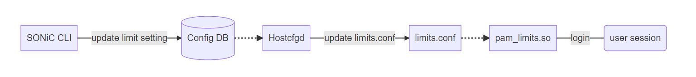
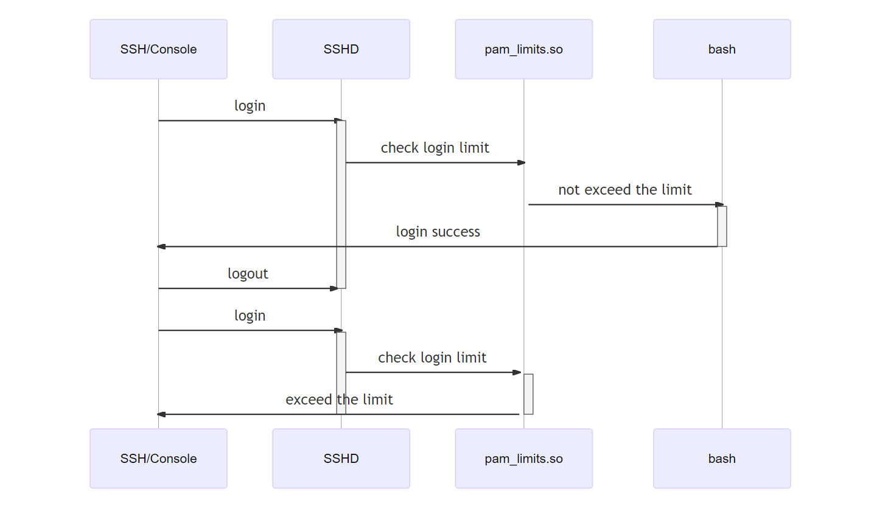

# SONiC Limit user login session

# Table of Contents
- [Table of Contents](#table-of-contents)
- [About this Manual](#about-this-manual)
- [1 Functional Requirements](#1-functional-requirement)
  * [1.1 Limit the login session per user/group/system](#11-limit-the-login-session-per-user/group/system)
  * [1.3 Default limitation](#13-default-limitation)
- [2 Configuration and Management Requirements](#2-configuration-and-management-requirements)
  * [2.1 SONiC CLI](#21-sonic-cli)
  * [2.2 Config DB](#22-config-db)
- [3 Design](#design)
  * [3.1 Login Limit Implementation](#31-login-limit-implementation)
  * [3.2 Default login session limitation Implementation](#32-default-login-session-limitation-Implementation)
  * [3.3 ConfigDB Schema](#33-configdb-schema)
  * [3.4 CLI](#34-cli)
- [4 Error handling](#error-handling)
- [5 Serviceability and Debug](#serviceability-and-debug)
- [6 Unit Test](#unit-test)
  * [6.1 Login session enable/disable test](#61-login-session-enable-disable-test)
  * [6.2 Max login session test](#62-max-login-session-test)
- [8 References](#references)


# About this Manual
This document provides a detailed description on the new features for:
 - Limit the number of logins per user/group/system.
 - Default limit user login session by device information.
 - Design a scalable framework of config command and ConfigDB to support more resource type, for example limit user CPU/memory by cgroup and systemd user.slices.

## SONiC memory issue solved by this feature.
 - Please reference "SONiC memory issue solved by this feature" section in [SONiC OOM daemon](../oomd/SONiC OOM daemon.md)

# 1 Functional Requirement
## 1.1 Limit the login session per user/group/system
 - Can set max login session count per user/group/system.
 - When exceed maximum login count, login failed with error message.

## 1.2 Default limitation
- Default login session by device hardware and software information.
- For customer, they may have pipelines to initialize device configuration, because this feature add new commands, the pipeline may need update. The default limitation is designed to cover most case to minimize the customer side change.

# 2 Configuration and Management Requirements
## 2.1 SONiC CLI
 - Manage login session or memory  limit settings
```
    config limit login { enable | disable }
    config limit login { add | del } {user | group | global} <name> <number>
```
 - Show limit
```
    show limit login
```

## 2.2 Config DB
 - Login limit are fully configurable by config DB.

# 3 Design
 - Design diagram:



## 3.1 Login limit Implementation
 - Enable PAM plugin pam_limits.so to support login limit.
 - When login limit exceed, pam_limits.so will terminate login session with error message.



 #### Other solution for Linux login session limit

|                   | How                                                | Pros                                                         | Cons                       |
| ----------------- | -------------------------------------------------- | ------------------------------------------------------------ | -------------------------- |
| PAM limit         | Change PAM setting file: /etc/security/limits.conf | Support per-user/per-group/global limit. Only need change config file. |                            |
| Bash login script | Call script when user login                        |                                                              | Need develop new script.   |
| SSHD config       | Change SSHD setting file: /etc/sshd_config         |                                                              | Only support global limit. |

- SONiC will create new user when domain user login, PAM limit support config limit to a non-existing user.


## 3.2 Default login session limitation Implementation
- Max login sessions per-user: 3

## 3.3 ConfigDB Schema
 - Limit enable table:
```
; Key
name                   = 1*32VCHAR         ; setting name, format is "limit_enable_" + resource type
; Attributes
resource_type          = LIST(1*32VCHAR)   ; Limit resource type, now only support (login)
enable                 = Boolean           ; Enable status, true for enable.
```

 - Limit setting table:
```
; Key
policy_name            = 1*32VCHAR         ; policy name, format is resource type + limit scope
; Attributes
resource_type          = LIST(1*32VCHAR)   ; Limit resource type, now only support (login)
scope                  = LIST(1*32VCHAR)   ; Limit scope, now only support (global, group, user)
value                  = Number  ; limit value, for login this is max login session count, for memory this is memory side in byte.
```
 - Yang model: [sonic-system-limit.yang](./sonic-system-limit.yang)


## 3.4 CLI

 - Add following command to set/remove limit setting.
```
    // enable/disable login limit
    config limit login {enable | disable}
    
    // set global login limit
    config limit login add global <max session count>

    // remove global login limit
    config limit login del global

    // add group login limit
    config limit login add group <group name> <max session count>

    // remove group login limit
    config limit login del group <group name>

    // add user login limit
    config limit login add user <user name> <max session count>

    // remove user login limit
    config limit login del user <user name>
```

 - Add following command to show limit setting.
```
    // show login limit setting
    show limit login
```

# 4 Error handling
 - pam_limits.so will return errors as per [PAM](#pam) respectively.

# 5 Serviceability and Debug
 - pam_limits.so can be debugged by enabling the debug flag in PAM config file.

# 6 Unit Test

## 6.1 Login session enable/disable test

  - Enable login session limit and check the login session limit config updated correctly:
  ```
      Verify the config in /set/security/limits.conf updated correctly.
      Verify the device can't login when login session reach the max global login session count. 
      Verify the device can't login with same user count when login session reach the max per-user login session count. 
  ```

  - Disable login session limit and check the login session limit config updated correctly:
  ```
      Verify the config config command failed with warning message.
      Verify the device can login more login sessions coording to the max global login session count. 
      Verify the device can login with same user count when login session reach the max per-user login session count. 
  ```

## 6.2 Max login session test
  - Config global max login session count and check the login session limit config updated correctly:
  ```
      Verify the config in /set/security/limits.conf updated correctly.
      Verify the device can't login when login session reach the max global login session count. 
  ```

  - Config per-user max login session count and check the login session limit config updated correctly:
  ```
      Verify the config in /set/security/limits.conf updated correctly.
      Verify the device can't login with same user count when login session reach the max per-user login session count. 
  ```


# 7 References
## pam_limits.so
https://man7.org/linux/man-pages/man8/pam_limits.8.html

