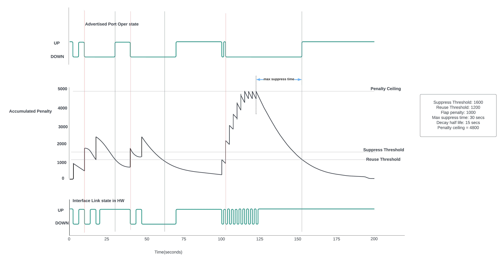

# Link Event Damping HLD #

##  Table of Contents

- [Revision](#revision)
- [Scope](#scope)
- [Definitions/Abbreviations](#definitionsabbreviations)
- [Overview](#overview)
- [Requirements](#requirements)
- [Architecture Design](#architecture-design)
- [High-Level Design](#high-level-design)
    - [Link Event damping on Netdev Interface](#link-event-damping-on-netdev-interface)
    - [Algorithm for Link Event Damping](#algorithm-for-link-event-damping)
        - [Link Event Damping Example](#link-event-damping-example)
- [SAI API](#sai-api)
- [SAIREDIS API](#sairedis-api)
- [Configuration and management](#configuration-and-management)
    - [CLI Enhancements](#cli-enhancements)
    - [YANG Model Enhancements](#yang-model-enhancements)
    - [Config DB Enhancements](#config-db-enhancements)
- [Warmboot and Fastboot Design Impact](#warmboot-and-fastboot-design-impact)
- [Restrictions/Limitations](#restrictionslimitations)
- [Testing Requirements/Design](#testing-requirementsdesign)
    - [Unit Test cases](#unit-test-cases)
    - [System Test cases](#system-test-cases)
- [Open/Action items](#openaction-items)
- [References](#references)

### Revision

|  Rev |  Date      |      Author                      | Change Description |
|----- |------------|----------------------------------| ------------------ |
|  0.1 | 07/25/2022 |   Ashish Singh, Mike Beresford   | Phase 1 Design     |

### Scope

This document described the requirements, architecture, and configuration details of the link event damping feature in SONiC based switches.

### Definitions/Abbreviations

| Definitions/Abbreviation  | Description                       |
|---------------------------|-----------------------------------|
| WCMP                      | Weighted Cost MultiPath           |
| OA                        | Orch Agent                        |
| NOS                       | Network Operating System          |
| SAI                       | Switch Abstraction Interface      |


### Overview

Today in SONiC, link up and down transition events generated for an interface at the ASIC layer are propagated up through the switch software stack that can adversely affect the routing protocols in the network - internally to the switch this can trigger actions like WCMP group member pruning and externally these events can trigger route/traffic balancing recalculation. Link flap events are generally low rate, but in some circumstances (dirty/misaligned optic or faulty cable being the most common), the link may repeatedly transition from up to down and back up (“flap”) as the SerDes is able to lock then unlock on a marginal signal. This can generate a large number of link transition ASIC events and may cause excessive load to the applications or frequent broadcasts. Link event damping in SONiC is a proposal to optionally suppress link up and/or down events to prevent link status changes from being propagated to the applications based on link event damping configuration for the interface. Link event damping is a common practice in most NOS.

### Requirements

Link event damping feature has following functional requirements:
- Link event damping should suppress link up and/or down transition events and prevent them from propagating to applications.
- Link event damping configuration must be configurable.
- Feature must be configurable per logical port interface.
- Damping link up/down events on one interface must not affect any other interface.
- Interface link up and link down events must be treated separately.
- If an interface is configured to a valid link event damping configuration, damping should be applied immediately on that interface.
- Lack of link event damping configuration or invalid link event damping configuration should be interpreted as link event damping disabled on that interface.
- Host interface’s operational state update should be consistent with post damping behavior of the physical interface’s link event.
- If a damping timer is running and a link DOWN event occurs, this should reset the timer.
    - For example, if damping is active on an interface and the damping timer is running and before the timer expires another DOWN link event is observed, it will reset the damping timer.
- A frequently flapping interface is expected to be held down for a longer duration as compared to an interface with lesser flaps.
- A count of the number of pre and post damping state transitions per interface
  must be maintained and saved to COUNTERS DB. Following counters will be
  updated/valid only for interfaces that have valid link event damping config.
    - Pre-damping transitions: number of link events received.
    - Post-damping transitions: number of link events advertised to application post damping.
    - Pre-damping UP transitions: number of link UP events received.
    - Pre-damping DOWN transitions: number of link DOWN events received.
    - Post-damping UP transitions: number of link UP events advertised to application post damping.
    - Post-damping DOWN transitions: number of link DOWN events advertised to application post damping.
    - Periodic update as opposed to updating the database on every link transition.


### Architecture Design

Today in SONiC when physical interface’s link up/down event notifications are triggered by the vendor SAI layer, a callback from SAI goes into SyncD and SyncD generates notification in ASIC DB. All the consumers (practically speaking PortsOrch) listen to this notification and update the state for upstream consumers.


In this proposal, implementation of link event damping will be in the SyncD where it will hook into the port state change notification callback from vendor SAI to SyncD and intercept the notifications. In SyncD, this will provide an entry point for proposed implementation. Link event damping implementation will be in the main selectable loop of the SyncD thread.

Future systems could implement damping in the SAI adapter or hardware-based link event damping. In that case Orch Agent could decide which of the implementations to use. Based on this proposal, OA can use host interface operational state update mode to decide which implementation to use.


### High-Level Design

As mentioned in the previous section, the proposal is to implement link event damping in the SyncD where it can hook into the port state change notification callback from the vendor SAI.


In this design, link-event damping related configurations will be pushed to CONFIG DB per logical interface.

To push these per interface configuration down to the stack, Orch Agent will receive the per-interface link event config update/change notifications and will send it to Syncd using port object API. This approach requires adding new SAI redis port attributes to `sai_redis_port_attr_t` for link event damping.

SyncD will monitor these configs, consume them and apply them on the appropriate interface. Syncd will maintain a link event damper for each interface and apply the required damping before sending the interface state change notification to any consumers.

When an interface is removed, SyncD will remove the corresponding link event damper by monitoring the `SAI_COMMON_API_REMOVE` for `SAI_OBJECT_TYPE_PORT` object type.

#### Link Event damping on Netdev Interface

When a physical interface’s link state changes, its corresponding netdev host interface is expected to change its operational state too. Orch Agent in SONiC uses hostif API to set the host interface’s oper status using SAI attribute `SAI_HOSTIF_ATTR_OPER_STATUS` when it receives operation state update for physical interface. By effect of this proposal OA receives only the post-damped advertised link state; the netdev host interface’s operational state too will be damped accordingly.

#### Algorithm for Link Event Damping

Following algorithm uses a penalty-based additive increase exponential decrease approach. In this approach, each interface accumulates a penalty such that each link down (UP->DOWN) event costs a penalty of configured penalty value. Value of the current accumulated penalty decides when to activate damping and start suppressing the link events on an interface and how long an interface needs to be held down when damping is active.

**Configuration parameters:**

This approach requires following link event damping configuration:

- **Link-event-damping-algorithm**: Link event damping algorithm
    - This proposal currently proposes only following algorithms:
        - link event damping algorithm is disabled. When the link event damping algorithm is disabled, link event damping functionality will be disabled.
        - Additive increase exponential decrease based damping algorithm.
- **max-suppress-time**: Maximum time an interface can remain damped since the last link down event no matter how unstable it was prior to this period of stability. In a damped state, link events on the interface will not be advertised.
    - This parameter is configured in seconds.
    - Expected value for this configuration is > 0.
    - A value of 0 indicates config is disabled.
- **decay-half-life**: The amount of time after which an interface’s accumulated penalty is decreased by half if it were stable.
    - This parameter is configured in seconds.
    - decay-half-time should not be more than max-suppress-time.
    - Expected value for this configuration is > 0.
    - A value of 0 indicates config is disabled.
- **suppress-threshold**: A threshold when exceeded by accumulated penalty activates the damping on an interface.
    - This parameter is unitless.
    - Expected value for this configuration is > 0.
    - A value of 0 indicates config is disabled.
- **reuse-threshold**: When the accumulated penalty decays to/below this threshold, the interface is not damped anymore. If the last damped event was a link UP event, it will be advertised to applications immediately. New link events are advertised to applications after this.
    - This parameter is unitless.
    - reuse-threshold should not be more than suppress-threshold.
    - Expected value for this configuration is > 0.
    - A value of 0 indicates config is disabled.
- **flap-penalty**: A penalty incurred by each link down event.
    - This parameter is unitless.
    - By default it is 1000 - a penalty of 1000 is chosen arbitrarily.
    - A value of 0 indicates config is disabled.

All of the above mentioned config parameters are treated together as a unit and will be transmitted to syncd by OA via sairedis struct and will be applied at the same time in syncd.

**Non-configuration parameters:**

These parameters are important to facilitate the link event damping functionality but they are not configurable.

- **accumulated-penalty**: A per interface variable to accumulate penalty on the interface due to link down (up->down) events. When the interface goes down, the accumulated penalty increases by configured flap-penalty for each up->down event until the penalty ceiling is reached - penalty does not increase for up(down->up) events. The penalty decreases exponentially with a rate such that the penalty halves each time in decay-half-time duration.
- **penalty-ceiling**: To ensure an interface is not damped for more than max-suppress-time since the last DOWN event on the interface, the accumulated penalty of an interface is limited to a ceiling. The ceiling is calculated using formula ($2^\frac{max-suppress-time}{decay-half-life} \times {reuse-threshold}$). It is not configurable.
- **damping-timer**: A per interface timer that accounts the amount of time an interface maybe suppressed when damping is active on the interface.Time(in micro seconds) for this timer is the time it takes to decay current accumulated penalty after a DOWN event to reuse-threshold. This formula can be expressed as:

    $t = -(decay-half-life) \times log_2 (\frac{reuse-threshold} {accumulated-penalty})$

**Few important things to note:**
- If multiple link flaps occur close to each other, the interface’s operational state remains down for a longer duration as compared to if only one or two flaps occurred.
- When damping is active on a port, the suppress (damping) timer gets reset on each link down event.
- Only link down events increment the accumulated penalty. Link up (down->up) event does not impact penalty.
- Each interface starts with an initial penalty of 0 and accumulates a penalty on each down event.
- Accumulated penalty is always decaying, even on a highly unstable link with very small time between link DOWN events.


**Exponential decay is defined by the following equation:**

    $N_t = N_0 \times 2^\frac{-t} {t_1/2}$


Where:

$N_0$ is the initial quantity - accumulated penalty from the last link-down event.

$N_t$ is the remaining accumulated after time t.

$t_{1/2}$ is the decay-half-life.

##### Link Event Damping Example

This example is created with *suppress-threshold = 1600, reuse-threshold=1200, decay-half-life=15sec, max-suppress-time=30sec, penalty=1000*. With this configurations and ceiling formula - ($2^\frac{max-suppress-time}{decay-half-life} \times {reuse-threshold}$),  penalty ceiling = 4800



At t =0, the interface is UP and damping is not active on the interface, so the accumulated penalty is starting with 0 and the operational state is advertised as UP.
- t = 3: link-down event received
    - Accumulated penalty is increased by 1000 and now it is set to 1000.
    - Accumulated penalty(=1000) is less than the suppress threshold (=1600), so the damping is not started on the interface.
    - Since damping is not active, the link-down event is not suppressed and advertised to the application. Operational state is set as DOWN.
- t = 7: link-up event received
    - Due to decay since the last DOWN event at t=3, the current accumulated penalty is 831.
    - Since the damping is not active, the link-up event is not suppressed and advertised to the application. Operational state is set as UP.
- t = 10: link-down event received
    - The current accumulated penalty is 723 after decay since the last DOWN event at t=3 and link-down event increments it by 1000.
    - The accumulated penalty is now 1723, which is greater than the suppress threshold (=1600), so the damping starts on the port.
    - Since the damping became active just now, this link-down event is not suppressed and advertised to the applications. Operational state is set as DOWN.
- t = 14: link-up event
    - After decay since the last DOWN event at t=10, the current accumulated penalty is 1432, which is above the reuse threshold (=1200).
    - Since the damping is active on the interface, the link-up event is suppressed and not advertised to applications. The operational state stays DOWN.
- t = 17: link-down event received
    - The current accumulated penalty is 1247 after decay and the link-down event increments it by 1000. The accumulated penalty is now 2247.
    - Since damping is already active and the accumulated penalty is above the reuse threshold (=1200), damping remains active and the link-down event is suppressed. The operational state stays DOWN.
- t = 20: link-up event received
    - After decay since the last DOWN event at t=17, the current accumulated penalty is 1956, which is above the reuse threshold (=1200).
    - Since the damping is active on the interface, the link-up event is suppressed and not advertised to applications. The operational state stays DOWN.
- t = 31: accumulated penalty decays below the reuse threshold (=1200)
    - The accumulated penalty decays below the reuse threshold(=1200), so the damping on the interface stops.
    - Since the interface is no longer damped and the current damped link-event is UP, the link-up event is advertised to applications. The operational state is set as UP.
- t = 40: link-down event received
    - The current accumulated penalty is 776 after decay and the link-down event increments it by 1000. The accumulated penalty is now 1776.
    - The accumulated penalty is now 1776, which is greater than the suppress threshold (=1600), so the damping starts on the interface.
    - Since the damping became active just now, this link-down event is not suppressed and advertised to the applications. Operational state is set as DOWN.
- t = 44: link-up event received
    - After decay since the last DOWN event at t=40, the current accumulated penalty is 1476, which is above the reuse threshold (=1200).
    - Since the damping is active on the interface, the link-up event is suppressed and not advertised to applications. The operational state stays DOWN.
- t = 46: link-down event received
    - The current accumulated penalty is 1346 after decay and the link-down event increments it by 1000. The accumulated penalty is now 2346.
    - Since damping is already active and the accumulated penalty is above the reuse threshold (=1200), damping remains active and the link-down event is suppressed. The operational state stays DOWN.
- t = 61: accumulated penalty decays below the reuse threshold (=1200)
    - The accumulated penalty decays below the reuse threshold(=1200), so the damping on the interface stops.
    - Since the interface is no longer damped but the current damped link-event is DOWN and the advertised state is link-down too, no link-up event is advertised to applications. The operational state stays DOWN.
- t = 70: link-down event received
    - The accumulated penalty has decayed to 774.
    - Since damping is not active on the interface, link-up event is advertised to applications immediately. The operational state is set as UP.
- t = 100 to 124: Multiple link-up and link-down events
    - As seen for previous link-down events, the accumulated penalty increments by 1000 on every link-down event.
    - When the link-down event is received at t=100, the current accumulated penalty is decayed to 193 and it increases to 1193. Link-down event is not suppressed as the accumulated penalty is less than the suppress threshold(=1600), and advertised to application. Operational state is set as DOWN.
    - At t=102: link-up event, since damping is not active, link-up event is advertised immediately to applications. Operational state is set as UP.
    - At t=105: link-down event, the current accumulated penalty is decayed to 1088 and it increases to 2088 and the new accumulated penalty of 2088 goes above the suppress threshold (=1600), so the damping starts again on the interface. Link-down event is advertised to applications and the operational state is set as DOWN.
    - Subsequent link state events are not advertised as accumulated penalty remains above reuse threshold.
    - The operational state stays DOWN after t = 105.
    - At t = 115, the accumulated penalty increment to a maximum ceiling of 4800.
- t = 124: final link event of link-up received
    - The current accumulated penalty is 4376 after decay
    - Since damping is active on the interface, the link-up event is suppressed. The operational state stays DOWN.
- t = 152: accumulated penalty decays below the reuse threshold (=1200)
    - The accumulated penalty decays below the reuse threshold(=1200), so the damping on the interface stops.
    - Since the interface is no longer damped and the current damped link-event is UP, the link-up event is advertised to applications. The operational state is set as UP.


### SAI API

Feature requires the host interface’s operational state update to be consistent with post damping behavior of the physical interface’s link event. In this proposal we are expecting the host interface’s operational state to be updated by OA application using hostif SAI API when it receives the post damping advertisement of physical interface link event.

Following SAI API changes are proposed to program the modes to update the host interface operational state:

**File: saiswitch.h**
```
typedef enum _sai_switch_attr_t
{
.
.
    /**
     * @brief Set hostif operational status update mode.
     *
     * This will set layer responsible for updating the operational status of
     * hostif.
     *
     * @type sai_switch_hostif_oper_status_update_mode_t
     * @flags CREATE_AND_SET
     * @default SAI_SWITCH_HOSTIF_OPER_STATUS_UPDATE_MODE_APPLICATION
     */
    SAI_SWITCH_ATTR_HOSTIF_OPER_STATUS_UPDATE_MODE,
.
.
} sai_switch_attr_t;

```
where `sai_switch_hostif_oper_status_update_mode_t` is defined as:

```
/**
 * @brief Attribute data for SAI_SWITCH_ATTR_HOSTIF_OPER_STATUS_UPDATE_MODE.
 */
typedef enum _sai_switch_hostif_oper_status_update_mode_t
{
    /**
     * In this mode, operational status of hostif must be updated by application
     * using hostif API with SAI_HOSTIF_ATTR_OPER_STATUS attribute. SAI adapter
     * should not update the hostif operational status internally.
     */


    SAI_SWITCH_HOSTIF_OPER_STATUS_UPDATE_MODE_APPLICATION = 0,
    /**
     * In this mode, operational status of hostif is updated internally by SAI
     * adapter. Update of hostif operational status by application using hostif
     * API with SAI_HOSTIF_ATTR_OPER_STATUS is ignored.
     */
    SAI_SWITCH_HOSTIF_OPER_STATUS_UPDATE_MODE_SAI_ADAPTER = 1,
} sai_switch_hostif_oper_status_update_mode_t;
```

For this proposal, we require vendor SAI to be running in `SAI_SWITCH_HOSTIF_OPER_STATUS_UPDATE_MODE_APPLICATION` mode to ensure update of hostif operational state is consistent with post damping behavior of the physical interface’s link event. If vendor SAI is running in non application mode or on a platform that doesn’t support `SAI_SWITCH_HOSTIF_OPER_STATUS_UPDATE_MODE_APPLICATION` mode, the feature will not be enabled.

### SAIREDIS API

Following SAI redis port attributes are proposed to configure the link event damping configurations using port SAI API:

**File: sairedis.h**
```
/**
 * @brief Link event damping algorithms.
 */
typedef enum _sai_link_event_damping_algorithm_t
{
    /** Link event damping algorithm disabled */
    SAI_LINK_EVENT_DAMPING_ALGORITHM_DISABLED = 0,

    /** Additive increase exponential decrease based link event damping algorithm */
    SAI_LINK_EVENT_DAMPING_ALGORITHM_AIED = 1,

} sai_link_event_damping_algorithm_t;


typedef struct _sai_redis_link_event_damping_algo_aied_config_t
{

  /** Max link event damping suppression time. */
  sai_uint32_t max_suppress_time;

  /** Link event damping suppress threshold. */
  sai_uint32_t suppress_threshold;

  /** Link event damping reuse threshold. */
  sai_uint32_t reuse_threshold;

  /** Link event damping decay half time duration. */
  sai_uint32_t decay_half_life;

  /** Link event flap penalty. */
  sai_uint32_t flap_penalty;

} sai_redis_link_event_damping_algo_aied_config_t;


typedef enum _sai_redis_port_attr_t
{
    /**
     * @brief Link event damping algorithm.
     *
     * @type sai_link_event_damping_algorithm_t
     * @flags CREATE_AND_SET
     * @default SAI_LINK_EVENT_DAMPING_ALGORITHM_DISABLED
     */
    SAI_REDIS_PORT_ATTR_LINK_EVENT_DAMPING_ALGORITHM = SAI_PORT_ATTR_CUSTOM_RANGE_START,

    /**
     * @brief Link event damping AIED configuration.
     *
     * @type sai_redis_link_event_damping_algo_aied_config_t
     * @flags CREATE_AND_SET
     * @validonly SAI_REDIS_PORT_ATTR_LINK_EVENT_DAMPING_ALGORITHM = SAI_LINK_EVENT_DAMPING_ALGORITHM_AIED
     * @default internal
     */
    SAI_REDIS_PORT_ATTR_LINK_EVENT_DAMPING_ALGO_AIED_CONFIG,

} sai_redis_port_attr_t;

```

### Configuration and management

Link event damping related configurations are to be pushed via CONFIG DB for each interface. CONFIG DB has a port table for each interface and link event damping configuration will be added to the same table. Proposed link event damping configuration will add 6 fields in the CONFIG DB port table for each interface.

The lack of link event damping configuration or invalid link event damping configuration should be interpreted as link event damping disabled on that interface.


#### CLI Enhancements

The CLI tool should provide the ability to configure the link event damping configurations.
- Configure link event damping config with algorithm = aied, max suppress time = 40 secs, decay half life time = 30 secs, suppress threshold = 1500, reuse threshold = 1300, and link flap penalty = 1000:
   ```sudo config interface link_event_damping_algorithm max-suppress-time decay-half-life suppress-threshold reuse-threshold flap-penalty Ethernet0 “aied” 40 30 1500 1300 1000```
- Disable link event damping algorithm:
  ```sudo config interface link_event_damping_algorithm Ethernet0 “disabled”```


#### YANG model Enhancements

The port yang model needs to update according to the config DB schema change. The yang model changes of new fields are described below:
```
leaf max_suppress_time {
  type uint32;
  default 0;
}

leaf decay_half_life {
  type uint32;
  default 0;
}

leaf suppress_threshold {
  type uint32;
  default 0;
}

leaf reuse_threshold {
  type uint32;
  default 0;
}

leaf flap_penalty {
  type uint32;
  default 0;
}

leaf link_event_damping_algorithm {
  type string;
  default "disabled";
}
```
These new yang leaves will be added to sonic-port.yang.

#### Config DB Enhancements

As mentioned above, the proposed link event damping configuration will add 6 fields in the config DB PORT table for each interface.

```
; Defines information for port configuration
key                         = PORT|port_name   ; configuration of the port
; field                     = value
...
max_suppress_time           = uint32         ; max_suppress_time configuration
decay_half_life             = uint32         ; decay_half_life configuration
suppress_threshold          = uint32         ; suppress_threshold configuration
reuse_threshold             = uint32.        ; reuse_threshold configuration
flap_penalty                = uint32         ; flap_penalty configuration
link_event_damping_algorithm= string         ; link_event_damping_algorithm configuration
```

- Config DB schema with link event damping config (max suppress time = 40 seconds and flap penalty = 2000) in PORT table:
```
{
    "PORT": {
         "Ethernet0": {
            "max_suppress_time" : "5000",
            "flap_penalty" : "2000"
        }
    }
}
```
- Config DB schema with disabled link event damping config may have an invalid entry in PORT table as following or may not have an entry present in PORT table at all:
```
{
    "PORT": {
         "Ethernet0": {
            "max_suppress_time" : "0",
            "reuse_threshold" : "0"
        }
    }
}

```


### Warmboot and Fastboot Design Impact

There is no impact on warmboot or fastboot design.

### Restrictions/Limitations

N/A

### Testing Requirements/Design

#### Unit Test cases
TBD

#### System Test cases

TBD

### Open/Action items

N/A

### References
- Reference for proposed algorithm:
    - [Damping algorithm](https://techhub.hpe.com/eginfolib/networking/docs/switches/5980/5200-3921_l2-lan_cg/content/499036550.htm#:~:text=About%20dampening,events%20protects%20the%20system%20resources.)
    - [Document from Nokia](https://infocenter.nokia.com/public/7750SR217R1A/index.jsp?topic=%2Fcom.nokia.Interface_Configuration_Guide_21.7.R1%2Fexponential_por-d10e9752.html)
    - [Document from Cisco](https://www.cisco.com/c/en/us/td/docs/switches/datacenter/nexus3548/sw/interfaces/602_a1_1/b_N3548_Interfaces_Config_602_A1_1/b_N3548_Interfaces_Config_602_A1_1_chapter_0111.pdf)
    - [Document from Juniper](https://www.juniper.net/documentation/us/en/software/junos/interfaces-fundamentals-evo/interfaces-fundamentals/topics/topic-map/interfaces-damping-physical.html#id_hlf_p3q_rrb)
