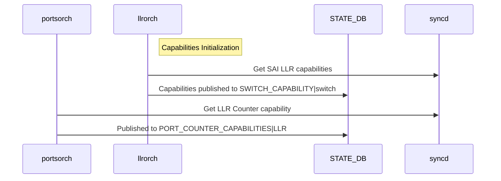
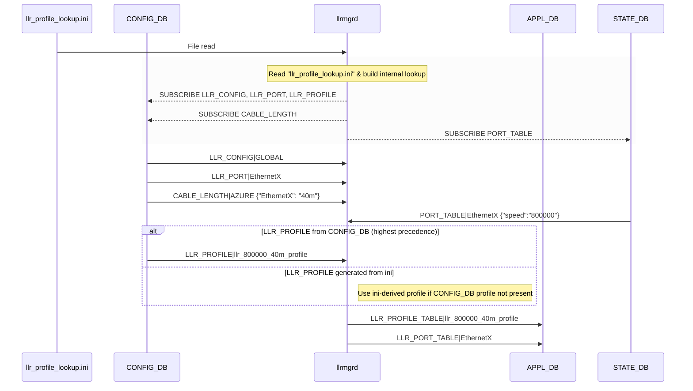
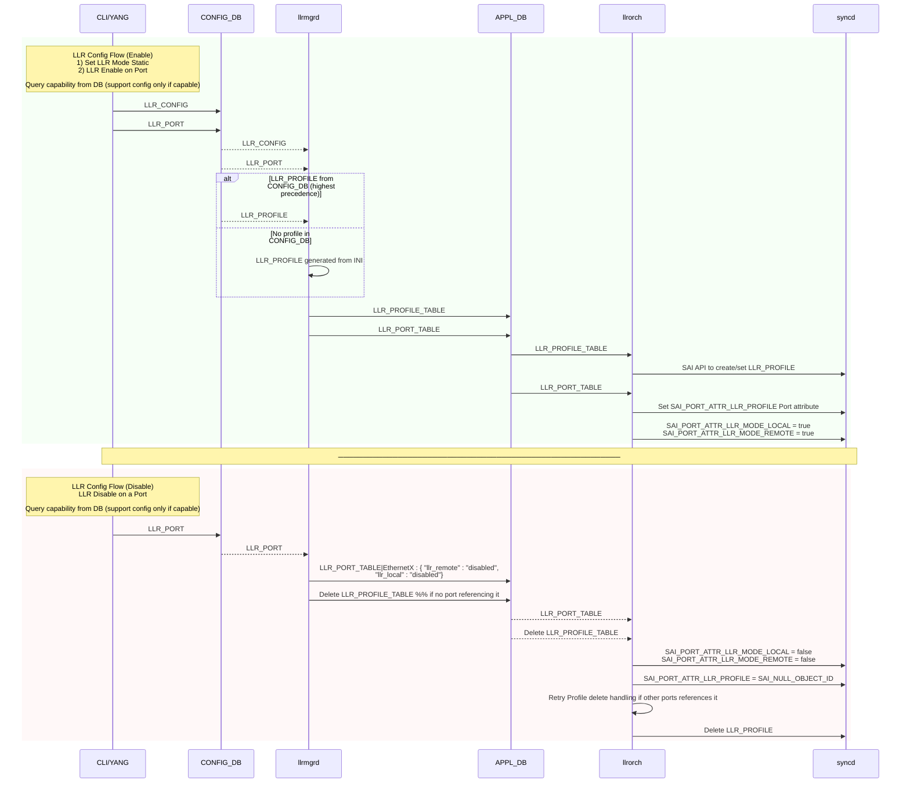
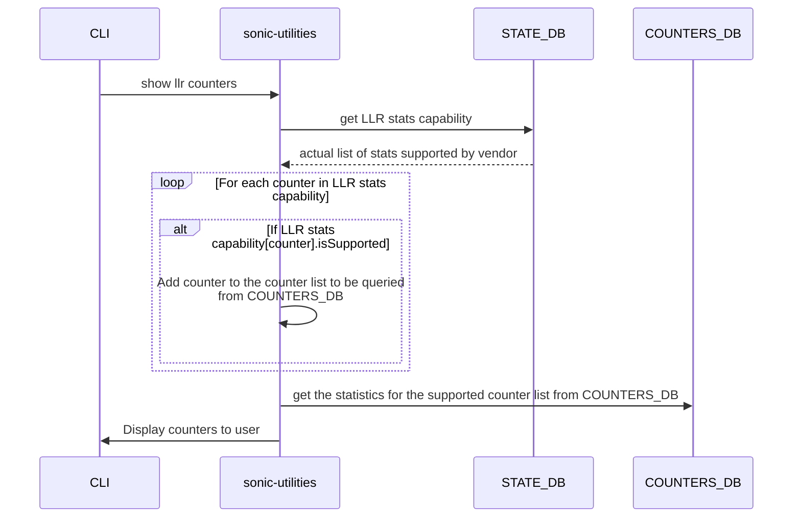

# SONiC Link Layer Retry

## High Level Design document

## Table of contents

- [Revision](#revision)
- [About this manual](#about-this-manual)
- [Abbreviations](#abbreviations)
- [List of Figures](#list-of-figures)
- [1 Introduction](#1-introduction)
  - [1.1 Feature Overview](#11-feature-overview)
  - [1.2 Requirements](#12-requirements)
    - [1.2.1 Phase I](#121-phase-i)
      - [1.2.1.1 Configuration and Management Requirements](#1211-configuration-and-management-requirements)
      - [1.2.1.2 Scalability Requirement](#1212-scalability-requirement)
      - [1.2.1.3 Warmboot Requirement](#1213-warmboot-requirement)
    - [1.2.2 Phase II](#122-phase-ii)
      - [1.2.2.1 Configuration and Management Requirements](#1221-configuration-and-management-requirements)
- [2 Design](#2-design)
  - [2.1 LLR High Level Flow](#21-llr-high-level-flow)
    - [2.1.1 Key Functionalities of LLR Orchestration](#211-key-functionalities-of-llr-orchestration)
    - [2.1.2 LLR Orchagent Initialization](#212-llr-orchagent-initialization)
    - [2.1.3 llrmgrd](#213-llrmgrd)
      - [2.1.3.1 llr\_profile\_lookup.ini Format](#2131-llr_profile_lookupini-format)
    - [2.1.4 llrorch](#214-llrorch)
    - [2.1.5 FlexCounter Orch](#215-flexcounter-orch)
  - [2.2 SAI API](#22-sai-api)
  - [2.3 DB schema](#23-db-schema)
    - [2.3.1 CONFIG\_DB](#231-config_db)
      - [2.3.1.1 New Table LLR\_CONFIG](#2311-new-table-llr_config)
      - [2.3.1.2 New Table LLR\_PORT](#2312-new-table-llr_port)
      - [2.3.1.3 New Table LLR\_PROFILE](#2313-new-table-llr_profile)
      - [2.3.1.4 Extend existing Table FLEX\_COUNTER\_TABLE to poll LLR port counters](#2314-extend-existing-table-flex_counter_table-to-poll-llr-port-counters)
      - [2.3.1.5 Configuration Sample](#2315-configuration-sample)
    - [2.3.2 APPL\_DB](#232-appl_db)
      - [2.3.2.1 LLR\_PORT\_TABLE](#2321-llr_port_table)
      - [2.3.2.2 LLR\_PROFILE\_TABLE](#2322-llr_profile_table)
    - [2.3.3 STATE\_DB](#233-state_db)
      - [2.3.3.1 LLR capabilities](#2331-llr-capabilities)
      - [2.3.3.2 LLR Port Counter CAPABILITY](#2332-llr-port-counter-capability)
    - [2.3.4 FLEX\_COUNTER\_DB](#234-flex_counter_db)
    - [2.3.5 COUNTERS\_DB](#235-counters_db)
  - [2.4 CLI](#24-cli)
    - [2.4.1 LLR Configuration Commands](#241-llr-configuration-commands)
      - [2.4.1.1 LLR Configuration Mode Command](#2411-llr-configuration-mode-command)
      - [2.4.1.2 LLR Port Configuration Commands](#2412-llr-port-configuration-commands)
      - [2.4.1.3 LLR Flex Counter Commands](#2413-llr-flex-counter-commands)
    - [2.4.2 LLR Show Commands](#242-llr-show-commands)
    - [2.4.3 LLR Counter Show Commands](#243-llr-counter-show-commands)
  - [2.5 YANG model](#25-yang-model)
  - [2.6 Warm/Fast boot](#26-warmfast-boot)
- [3 Test plan](#3-test-plan)
  - [3.1 Unit tests](#31-unit-tests)
    - [3.1.1 Unit Tests and Code Coverage](#311-unit-tests-and-code-coverage)

## Revision

| Rev | Date      | Author                       | Description        |
|:---:|:---------:|:---------------------------: |--------------------|
| 0.1 |06/Nov/25  | Ravi Minnikanti **(Marvell)**<br>Gnanapriya S **(Marvell)**| Initial version   |

## About this manual

This document presents the design of the UE-LLR feature for SONiC. It details the feature’s requirements, design scope, hardware capability considerations, software architecture, and the impact on associated modules.

## Abbreviations

| Term  | Meaning                                   |
|:------|:------------------------------------------|
| CRC   | Cyclic Redundancy Check                   |
| CtlOS | Control Ordered Set                       |
| FEC   | Forward Error Correction                  |
| PCS   | Physical Coding Sublayer                  |
| LLDP  | Link Layer Discovery Protocol             |
| LLR   | Link Layer Retry                          |
| OA    | Orchestration agent                       |
| UE    | Ultra Ethernet                            |
| UEC   | Ultra Ethernet Consortium                 |
| VS    | Virtual Switch                            |

## List of Figures

[Figure 1: LLR High Level Flow](#figure-1-llr-high-level-flow)  
[Figure 2: LLR Orchagent Init Flow](#figure-2-llr-orchagent-init-flow)  
[Figure 3: LLR Manager Flow](#figure-3-llr-manager-flow)  
[Figure 4: LLR Configuration Flow](#figure-4-llr-configuration-flow)  
[Figure 5: LLR CLI Counter Flow](#figure-5-llr-cli-counter-flow)  

# 1 Introduction

## 1.1 Feature Overview

In modern high-speed networks, transient link issues such as CRC errors or uncorrectable FEC errors can result in packet drops. These dropped packets are typically discarded silently by network switches, without any notification to either the sender or receiver, making the loss both invisible and difficult to recover promptly.

Traditionally, recovery from such losses is managed by end-to-end protocols like TCP, which rely on mechanisms such as fast retransmit or timeout-based recovery. However, timeout-based recovery introduces significant latency, which can severely impact the performance of latency-sensitive applications.

Link Layer Retry (LLR) is introduced to address this challenge by enabling local retransmission of lost frames due to link errors at the data link layer, reducing reliance on higher-layer retransmission and significantly lowering end-to-end latency. This mechanism enhances link reliability and complements existing error recovery strategies in loss-sensitive networks.

LLR works based on the following principles:
- Frame Tracking: It uses sequence numbers and acknowledgments to monitor the exchange of frames with the link partner.
- Retransmission Strategy: Upon detecting frame loss, it employs a Go-Back-N retransmission approach to resend the affected frames.

LLR is particularly important in modern data center fabrics and high-speed Ethernet environments, where ultra-low latency and high reliability are critical.

LLR is standardized in UE SPEC v1.0. This design follows SAI conceptual model described in https://github.com/opencomputeproject/SAI/pull/2225

## 1.2 Requirements

### 1.2.1 Phase I
#### 1.2.1.1 Configuration and Management Requirements

1. **Configuration Mode**: Support for configuring LLR mode (`static`). In `static` mode, per-port configuration from CONFIG_DB drives LLR enablement.
2. **Per-Interface Control**: Enable or disable LLR individually on each physical ports (LLR feature operates only on ASIC physical ports).
3. **LLR Profile Generation and Assignment**: LLR profiles can be generated and assigned to ports through two mechanisms:
    1. Vendor-defined configuration file: Profiles are created through vendor‑specific INI files in the HWSKU and are automatically assigned to LLR enabled ports based on operational speed and cable length.
    2. User-defined configuration via CONFIG_DB: Operators can define custom LLR profiles in CONFIG_DB and manually assign them to ports. User-defined profiles take precedence over vendor-defined profiles.
4. **Port-Level Counters**: Offer detailed LLR counters at the port level for enhanced visibility and debugging.
5. **Show Commands**: Provide CLI commands to display:
   - LLR configuration mode
   - Per-port LLR configuration status
   - LLR profiles associated with ports
   - LLR statistics associated with ports
6. **Config Commands**: Provide CLI commands to configure:
   - LLR mode `static`
   - Per-port LLR Rx/Tx enable/disable (only applicable when mode is `static`)
   - Extend `counterpoll` to enable/disable and polling interval configuration
   - Extend `sonic-clear` command to support LLR counter clearing

#### 1.2.1.2 Scalability Requirement

- **Physical Port Scale**: The LLR feature operates only on physical ports and must be supported across all physical ports in the system.

#### 1.2.1.3 Warmboot Requirement

- The LLR feature must support planned system warmboot.

### 1.2.2 Phase II

#### 1.2.2.1 Configuration and Management Requirements
1. **Configuration Mode**: Support for LLR in **dynamic mode**, enabling capability negotiation via LLDP.
2. **Administrator-Initiated Exit from FLUSH State**: The LLR transmitter (TX) can be moved out of the FLUSH state through manual intervention by an administrator, based on configuration.

# 2 Design

## 2.1 LLR High Level Flow

### 2.1.1 Key Functionalities of LLR Orchestration

An LLR manager daemon (llrmgrd) and an LLR orchestration component (llrorch) within orchagent have been introduced to enable the feature.

- llrmgrd: Manages LLR configuration mode and per-port LLR configuration and profiles, auto‑generates profiles from the vendor lookup file if provided, updates APPL_DB with appropriate LLR profile and port configurations.
- llrorch: A new orchagent component that listens to LLR tables in APPL_DB, handles creation, update and removal of SAI LLR profile objects and applies profile bindings and LLR TX/RX enables to ports through syncd/SAI.
- LLR ini file: A vendor-specific configuration file called `llr_profile_lookup.ini` used by llrmgrd to generate LLR profiles. Optionally user-defined profiles can be created via CONFIG_DB, which take precedence over ini file profiles.
- LLR stats: FlexCounter support for LLR statistics at the port level.

###### Figure 1: LLR High Level Flow


### 2.1.2 LLR Orchagent Initialization

The following is the initialization flow for LLR support in orchagent:

1. llrorch queries the vendor SAI for LLR capabilities information and updates SWITCH_CAPABILITIES table in STATE_DB with LLR capabilities.
2. Retrieved capabilities are referenced when applying LLR Profile configurations to ensure compatibility with the underlying hardware.
3. PortsOrch queries the vendor SAI for LLR port statistics capabilities and updates STATE_DB with the supported counters. This information is used to determine which counters to enable and display in the CLI.
3. Subscribes to LLR tables in APPL_DB to receive updates.
4. LLR on ports is disabled by default and must be explicitly enabled via configuration.

###### Figure 2: LLR Orchagent Init Flow


### 2.1.3 llrmgrd

`llrmgrd` operates as a daemon within the swss Docker container and is initiated by supervisord, like other swss services.
  - `llrmgrd` reads from a vendor-supplied ini file named `llr_profile_lookup.ini` located in the HWSKU directory to generate LLR profile parameters based on port operating speed and cable length.
  - A WARN log is generated if the `llr_profile_lookup.ini` file is missing or inaccessible.
  - Each generated profile is assigned a unique name in the format `llr_<speed>_<cable_len>_profile`.
  - Additionally, user-defined profiles can be created and assigned to ports via CONFIG_DB, which take precedence over ini file generated profiles. This allows operators to customize LLR behavior beyond the vendor defaults.
  - `llrmgrd` subscribes to LLR_CONFIG, LLR_PORT and LLR_PROFILE tables in CONFIG_DB to receive LLR mode, per-port LLR configuration and user-defined profile updates and propagates the relevant LLR configuration to APPL_DB.
      - If the LLR mode is set to `static`, per-port LLR configuration is driven by the `LLR_PORT` entries in CONFIG_DB.
  - `llrmgrd` subscribes to CABLE_LENGTH table in CONFIG_DB for port cable length information. For operational speed updates, it subscribes to the PORT_TABLE in STATE_DB.

###### Figure 3: LLR Manager Flow


#### 2.1.3.1 llr_profile_lookup.ini Format

`llr_profile_lookup.ini` is a vendor‑supplied, tabular (whitespace‑separated) configuration file consumed only by `llrmgrd`. Its purpose is to provide vendor specific LLR profile parameter values per operating port speed, cable length combination.

Key characteristics:
* Comment lines start with `#` are ignored.
* The FIRST TWO columns are mandatory and positional: `speed` and `cable`
* `outstanding_frames` and `outstanding_bytes` are mandatory columns and must be present to generate a valid profile.
* Remaining columns are optional and may appear in ANY order; only columns present in the header are parsed. Missing columns mean the vendor does not support / does not set those fields (they are omitted from the generated profile).
* A dash (`-`) can be used in a cell to explicitly mark an unsupported / unset value for a header column that is otherwise present.
* The first non‑empty, non‑comment line itself is the header (no leading `#`). It must start with `speed cable`. Parser map column index to field name using this header, allowing flexible ordering and omission.

Field names in `llr_profile_lookup.ini` maps to `LLR_PROFILE` table fields. A short alias is used in place of the long name in the `llr_profile_lookup.ini` header to improve readability. Aliases are only an input convenience.

Profile fields to ini header mapping:
```
max_outstanding_frames      <-> outstanding_frames (number of frames)
max_outstanding_bytes       <-> outstanding_bytes (bytes)
max_replay_timer            <-> replay_timer (ns)
max_replay_count            <-> replay_count (count)
pcs_lost_timeout            <-> pcs_lost_timeout (ns)
data_age_timeout            <-> data_age_timeout (ns)
ctlos_spacing_bytes         <-> ctlos_spacing (bytes)
init_action                 <-> init_action (best_effort | block | discard)
flush_action                <-> flush_action (best_effort | block | discard)
```

A sample llr_profile_lookup.ini file can be found at `doc/llr/llr_profile_lookup.ini.sample`.

Sample file snippet:
```
speed    cable  outstanding_frames outstanding_bytes replay_timer replay_count pcs_lost_timeout data_age_timer ctlos_spacing init_action   flush_action
200000    5m      61                31184             5000         3            50000            20000          2048          best_effort   block
200000    40m     71                35952             5500         3            55000            24000          2048          best_effort   block
400000    5m      115               58768             5000         3            50000            20000          2048          best_effort   best_effort
400000    40m     133               67760             5500         3            55000            24000          2048          best_effort   discard
```

Vendors may omit any unsupported field other than the `outstanding_frames` and `outstanding_bytes` by removing the column from the header; llrmgrd will skip setting that field in DB table. This flexible format allows heterogeneous hardware capabilities without requiring code changes.

### 2.1.4 llrorch

`llrorch` applies LLR configurations received from APPL_DB to SAI, only if vendor support is confirmed through a capability query.

  1. During initialization, query the vendor capabilities once and write them to `SWITCH_CAPABILITY|switch` table (STATE_DB).
  2. `llrorch` subscribes to LLR tables in APPL_DB and then pushes the configuration to ASIC_DB to configure SAI.
  3. For each APPL_DB, LLR_PROFILE_TABLE and LLR_PORT_TABLE event: create/update/remove the corresponding SAI LLR profile object and bind/unbind it to the port.
  4. Support for administrator-initiated Exit from FLUSH State(reinit_on_flush == FALSE) is not included in Phase I. As a result, llrorch will always set the attribute SAI_PORT_LLR_PROFILE_ATTR_RE_INIT_ON_FLUSH to TRUE when creating the SAI LLR profile object, if the attribute is supported by the vendor SAI.

###### Figure 4: LLR Configuration Flow



### 2.1.5 FlexCounter Orch

LLR per-port statistics support is achieved using the existing Flex Counter framework. A new flex counter group named LLR is introduced for this purpose.

High-level flow:

1. During initialization, portsorch in orchagent queries the vendor SAI for LLR port statistics capabilities.
2. portsorch writes the reported per-counter capability information into STATE_DB.
3. For each port with LLR enabled (per CONFIG_DB) portsorch evaluates the capability set:
    - If at least one LLR statistic attribute is supported, portsorch programs the supported statistic IDs to enable LLR counters.
4. The flex counter thread in syncd polls SAI at the configured interval and updates LLR counters to COUNTERS_DB.
5. The CLI (show llr counters / show llr counters detailed) consults STATE_DB to determine which counters are supported and displays only those; unsupported counters are shown as N/A.

## 2.2 SAI API
The following table lists the SAI APIs used and their relevant attributes.

**SAI attributes which shall be used for Link Layer Retry:**

**SAI Port-LLR-profile Attributes:**

| API              | Function                              | Attribute                                              |
|:-----------------|:--------------------------------------|:-------------------------------------------------------|
| PORT_LLR_PROFILE | sai_create_port_llr_profile_fn        | SAI_PORT_LLR_PROFILE_ATTR_OUTSTANDING_FRAMES_MAX       |
|                  | sai_remove_port_llr_profile_fn        | SAI_PORT_LLR_PROFILE_ATTR_OUTSTANDING_BYTES_MAX        |
|                  | sai_set_port_llr_profile_attribute_fn | SAI_PORT_LLR_PROFILE_ATTR_REPLAY_TIMER_MAX             |
|                  | sai_get_port_llr_profile_attribute_fn | SAI_PORT_LLR_PROFILE_ATTR_REPLAY_COUNT_MAX             |
|                  | sai_query_attribute_capability        | SAI_PORT_LLR_PROFILE_ATTR_PCS_LOST_TIMEOUT             |
|                  |                                       | SAI_PORT_LLR_PROFILE_ATTR_DATA_AGE_TIMEOUT             |
|                  |                                       | SAI_PORT_LLR_PROFILE_ATTR_INIT_LLR_FRAME_ACTION        |
|                  |                                       | SAI_PORT_LLR_PROFILE_ATTR_FLUSH_LLR_FRAME_ACTION       |
|                  |                                       | SAI_PORT_LLR_PROFILE_ATTR_RE_INIT_ON_FLUSH (only TRUE) |
|                  |                                       | SAI_PORT_LLR_PROFILE_ATTR_CTLOS_TARGET_SPACING         |

**SAI Port Attributes:**
                                                                      
| API    | Function                         | Attribute                                              |
|:-------|:---------------------------------|:-------------------------------------------------------|
| PORT   | sai_set_port_attribute_fn        | SAI_PORT_ATTR_LLR_MODE_LOCAL                           |
|        | sai_get_port_attribute_fn        | SAI_PORT_ATTR_LLR_MODE_REMOTE                          |
|        | sai_query_attribute_capability   | SAI_PORT_ATTR_LLR_PROFILE                              |                               

**SAI LLR statistics Attributes per port:**

| API    | Function                         | Attribute                                              |
|:-------|:---------------------------------|:-------------------------------------------------------|
| PORT   | sai_get_port_stats_fn            | SAI_PORT_STAT_LLR_TX_INIT_CTL_OS                       |
|        | sai_query_stats_capability       | SAI_PORT_STAT_LLR_TX_INIT_ECHO_CTL_OS                  |
|        |                                  | SAI_PORT_STAT_LLR_TX_ACK_CTL_OS                        |
|        |                                  | SAI_PORT_STAT_LLR_TX_NACK_CTL_OS                       |
|        |                                  | SAI_PORT_STAT_LLR_TX_DISCARD                           |
|        |                                  | SAI_PORT_STAT_LLR_TX_OK                                |
|        |                                  | SAI_PORT_STAT_LLR_TX_POISONED                          |
|        |                                  | SAI_PORT_STAT_LLR_TX_REPLAY                            |
|        |                                  | SAI_PORT_STAT_LLR_RX_INIT_CTL_OS                       |
|        |                                  | SAI_PORT_STAT_LLR_RX_INIT_ECHO_CTL_OS                  |
|        |                                  | SAI_PORT_STAT_LLR_RX_ACK_CTL_OS                        |
|        |                                  | SAI_PORT_STAT_LLR_RX_NACK_CTL_OS                       |
|        |                                  | SAI_PORT_STAT_LLR_RX_ACK_NACK_SEQ_ERROR                |
|        |                                  | SAI_PORT_STAT_LLR_RX_OK                                |
|        |                                  | SAI_PORT_STAT_LLR_RX_POISONED                          |
|        |                                  | SAI_PORT_STAT_LLR_RX_BAD                               |
|        |                                  | SAI_PORT_STAT_LLR_RX_EXPECTED_SEQ_GOOD                 |
|        |                                  | SAI_PORT_STAT_LLR_RX_EXPECTED_SEQ_POISONED             |
|        |                                  | SAI_PORT_STAT_LLR_RX_EXPECTED_SEQ_BAD                  |
|        |                                  | SAI_PORT_STAT_LLR_RX_MISSING_SEQ                       |
|        |                                  | SAI_PORT_STAT_LLR_RX_DUPLICATE_SEQ                     |
|        |                                  | SAI_PORT_STAT_LLR_RX_REPLAY                            |

## 2.3 DB schema

### 2.3.1 CONFIG_DB

#### 2.3.1.1 New Table LLR_CONFIG
```abnf
; defines schema for LLR configuration

key                  = LLR_CONFIG | GLOBAL       ; LLR configuration table

; field              = value
mode                 = "static"  / "dynamic"     ; LLR configuration mode
                                                 ; - "static" : Use statically configured per-port enable
                                                 ;              Per-port LLR_PORT entries in CONFIG_DB drive APPL_DB
                                                 ; - "dynamic": LLDP based LLR negotiation.
                                                 ;              

```

#### 2.3.1.2 New Table LLR_PORT
```abnf
; defines schema for LLR Port configuration attributes
key                   = LLR_PORT | ifname       ; Interface name (Ethernet only). Must be unique

; field               = value
llr_local             = "enabled" / "disabled"  ; enable LLR reception on the port
                                                ; Default: "disabled" (Applicable when mode == "static")
llr_remote            = "enabled" / "disabled"  ; enable LLR transmission on the port
                                                ; Default: "disabled" (Applicable when mode == "static")
profile               = 1*64VCHAR               ; LLR Profile name bound to the port

```

#### 2.3.1.3 New Table LLR_PROFILE
```abnf
; defines schema for LLR profile configuration attributes

key                       = LLR_PROFILE | profile_name  ; User-defined profile. Takes precedence over INI-generated
                                                        ; profiles when assigned to a port.
                                                        ; Must be unique

; field                   = value
max_outstanding_frames    = 1*6DIGIT                    ; Replay buffer size (frames) max unacknowledged
                                                        ; frames. Range 0..524288
max_outstanding_bytes     = 1*10DIGIT                   ; Replay buffer size (bytes) max unacknowledged bytes.
                                                        ; Range 0..4294967295.
max_replay_count          = 1*3DIGIT                    ; Max replays. Range 1..255.
                                                        ; Default: 1
max_replay_timer          = 1*5DIGIT                    ; Maximum replay timer (ns) delay before
                                                        ; retransmission trigger. Range 0..65535.
                                                        ; Default: 0
pcs_lost_timeout          = 1*10DIGIT                   ; Maximum PCS lost status duration (ns).
                                                        ; Range 0..4290000000.
                                                        ; Default: 0
data_age_timeout          = 1*10DIGIT                   ; Maximum age a frame may reside in replay buffer (ns).
                                                        ; Range 0..4290000000.
                                                        ; Default: 0
ctlos_spacing_bytes       = 1*5DIGIT                    ; Target spacing between CtlOS msgs (ACK/NACK).
                                                        ; Range 400..16384.
                                                        ; Default: 2048

init_action               = "discard" /                 ; TX behavior in INIT state.
                            "block" /                   ; Default: "best_effort"
                            "best_effort" 

flush_action              = "discard" /                 ; TX behavior in FLUSH state.
                            "block" /                   ; Default: "best_effort"
                            "best_effort"

```

#### 2.3.1.4 Extend existing Table FLEX_COUNTER_TABLE to poll LLR port counters
```abnf
; defines schema for LLR Port STAT counter configuration attributes
key                   = FLEX_COUNTER_TABLE | countername  ; Flex counter name. Must be unique
                                                          ; countername == LLR for LLR counter

; field                   = value
FLEX_COUNTER_STATUS       = "enable" / "disable"          ; Flex counter status for LLR Port counters
FLEX_COUNTER_DELAY_STATUS = "true" / "false"              ; Flex counter delay status
POLL_INTERVAL             = 1*10DIGIT                     ; Flex counter polling interval

```

#### 2.3.1.5 Configuration Sample

**LLR_CONFIG Table**
```json
{
  "LLR_CONFIG|GLOBAL": {
    "value": {
      "mode": "static"
    }
  }
}
```

**LLR_PORT Table**
```json
{
  "LLR_PORT|Ethernet0": {
    "value": {
      "llr_local": "enabled",
      "llr_remote": "enabled",
      "profile": "llr_800000_40m_profile"
    }
  }
}
```

**LLR_PROFILE Table**
```json
{
  "LLR_PROFILE|llr_800000_40m_profile": {
    "value": {
      "max_outstanding_frames": "264",
      "max_outstanding_bytes": "135000",
      "max_replay_count": "3",
      "max_replay_timer": "5000",
      "pcs_lost_timeout": "50000",
      "data_age_timeout": "20000",
      "ctlos_spacing_bytes": "2048",
      "init_action": "best_effort",
      "flush_action": "best_effort"
    }
  }
}
```

**FLEX_COUNTER_TABLE (LLR)**
```json
{
  "FLEX_COUNTER_TABLE|LLR": {
    "value": {
      "FLEX_COUNTER_STATUS": "enable",
      "FLEX_COUNTER_DELAY_STATUS": "false",
      "POLL_INTERVAL": "10000"
    }
  }
}
```

### 2.3.2 APPL_DB

`llrmgrd` writes LLR configuration to APPL_DB. For LLR_PORT_TABLE, the configuration is propagated from CONFIG_DB `LLR_PORT` entries. For LLR_PROFILE_TABLE, if the port has a user-defined profile assigned in CONFIG_DB `LLR_PROFILE`, that profile is used; otherwise, the INI-generated profile for the port's (speed, cable length) is used directly. APPL_DB tables mirror the structure of their corresponding CONFIG_DB tables, with only the table names changed. `llrorch` subscribes to these APPL_DB tables.

#### 2.3.2.1 LLR_PORT_TABLE

**Sample JSON:**
```json
{
  "LLR_PORT_TABLE:Ethernet0": {
    "llr_local": "enabled",
    "llr_remote": "enabled",
    "profile": "llr_800000_40m_profile"
  }
}
```

#### 2.3.2.2 LLR_PROFILE_TABLE

**Sample JSON:**
```json
{
  "LLR_PROFILE_TABLE:llr_800000_40m_profile": {
    "max_outstanding_frames": "264",
    "max_outstanding_bytes": "135000",
    "max_replay_count": "3",
    "max_replay_timer": "5000",
    "pcs_lost_timeout": "50000",
    "data_age_timeout": "20000",
    "ctlos_spacing_bytes": "2048",
    "init_action": "best_effort",
    "flush_action": "best_effort"
  }
}
```

### 2.3.3 STATE_DB

#### 2.3.3.1 LLR capabilities
LLR capability is published in the existing STATE_DB table `SWITCH_CAPABILITY|switch`.

**Schema:**
```abnf
key                     = SWITCH_CAPABILITY | switch    ; must be unique

; field                 = value
LLR_CAPABLE             = "true" / "false"           ; specifies whether switch supports LLR feature
LLR_SUPPORTED_PROFILE_ATTRIBUTES = "1*VCHAR"         ; comma-separated list of supported LLR profile attributes.
```

**Sample JSON:**
```json
"SWITCH_CAPABILITY|switch": {
  "value": {
    "LLR_CAPABLE": "true",
    "LLR_SUPPORTED_PROFILE_ATTRIBUTES": "OUTSTANDING_BYTES_MAX, OUTSTANDING_FRAMES_MAX, REPLAY_TIMER_MAX, REPLAY_COUNT_MAX, PCS_LOST_TIMEOUT, DATA_AGE_TIMEOUT, CTLOS_TARGET_SPACING"
    ...
  }
}
```

#### 2.3.3.2 LLR Port Counter CAPABILITY

```abnf
; LLR counter capabilities uses existing PORT_COUNTER_CAPABILITIES table
; Key pattern:
key                     = PORT_COUNTER_CAPABILITIES | LLR
; field                 = value
"LLR Counter field"       = "true" / "false"           ; specifies whether specific LLR port counter is supported
```

**Sample JSON:**

```json
"PORT_COUNTER_CAPABILITIES|LLR": {
  "value": {
    "LLR_TX_INIT_CTL_OS": "true",
    "LLR_TX_INIT_ECHO_CTL_OS": "true",
    "LLR_TX_ACK_CTL_OS": "true",
    "LLR_TX_NACK_CTL_OS": "true",
    "LLR_TX_DISCARD": "true",
    "LLR_TX_OK": "true",
    "LLR_TX_POISONED": "true",
    "LLR_TX_REPLAY": "true",
    "LLR_RX_INIT_CTL_OS": "true",
    "LLR_RX_INIT_ECHO_CTL_OS": "true",
    "LLR_RX_ACK_CTL_OS": "true",
    "LLR_RX_NACK_CTL_OS": "true",
    "LLR_RX_ACK_NACK_SEQ_ERROR": "true",
    "LLR_RX_OK": "true",
    "LLR_RX_POISONED": "true",
    "LLR_RX_BAD": "true",
    "LLR_RX_EXPECTED_SEQ_GOOD": "true",
    "LLR_RX_EXPECTED_SEQ_POISONED": "true",
    "LLR_RX_EXPECTED_SEQ_BAD": "true",
    "LLR_RX_MISSING_SEQ": "true",
    "LLR_RX_DUPLICATE_SEQ": "true",
    "LLR_RX_REPLAY": "true"
  }
}
```

### 2.3.4 FLEX_COUNTER_DB

LLR per-port statistics configuration is stored in FLEX_COUNTER_DB with the PORT_COUNTER_ID_LIST specifying which LLR counters to collect.
This Port counter list only includes the counters that are supported by vendor SAI as determined by the capability query during portsorch initialization.
Below is an existing schema in FLEX_COUNTER_DB extended to include LLR port counters configuration.

```abnf
; defines schema for LLR Port counter configuration in FLEX_COUNTER_DB
key                       = FLEX_COUNTER_TABLE:LLR_PORT_STAT_COUNTER:oid:<port_oid>

; field                   = value
PORT_COUNTER_ID_LIST      = "SAI_PORT_STAT_LLR_TX_INIT_CTL_OS,
                             SAI_PORT_STAT_LLR_TX_INIT_ECHO_CTL_OS,
                             SAI_PORT_STAT_LLR_TX_ACK_CTL_OS,
                             SAI_PORT_STAT_LLR_TX_NACK_CTL_OS,
                             SAI_PORT_STAT_LLR_TX_DISCARD,
                             SAI_PORT_STAT_LLR_TX_OK,
                             SAI_PORT_STAT_LLR_TX_POISONED,
                             SAI_PORT_STAT_LLR_TX_REPLAY,
                             SAI_PORT_STAT_LLR_RX_INIT_CTL_OS,
                             SAI_PORT_STAT_LLR_RX_INIT_ECHO_CTL_OS,
                             SAI_PORT_STAT_LLR_RX_ACK_CTL_OS,
                             SAI_PORT_STAT_LLR_RX_NACK_CTL_OS,
                             SAI_PORT_STAT_LLR_RX_ACK_NACK_SEQ_ERROR,
                             SAI_PORT_STAT_LLR_RX_OK,
                             SAI_PORT_STAT_LLR_RX_POISONED,
                             SAI_PORT_STAT_LLR_RX_BAD,
                             SAI_PORT_STAT_LLR_RX_EXPECTED_SEQ_GOOD,
                             SAI_PORT_STAT_LLR_RX_EXPECTED_SEQ_POISONED,
                             SAI_PORT_STAT_LLR_RX_EXPECTED_SEQ_BAD,
                             SAI_PORT_STAT_LLR_RX_MISSING_SEQ,
                             SAI_PORT_STAT_LLR_RX_DUPLICATE_SEQ,
                             SAI_PORT_STAT_LLR_RX_REPLAY"
```

**Sample FLEX_COUNTER_DB Entry:**
```json
{
  "FLEX_COUNTER_TABLE:LLR_PORT_STAT_COUNTER:oid:0x1000000000009": {
    "type": "hash",
    "value": {
      "PORT_COUNTER_ID_LIST": "SAI_PORT_STAT_LLR_TX_INIT_CTL_OS,SAI_PORT_STAT_LLR_TX_INIT_ECHO_CTL_OS,SAI_PORT_STAT_LLR_TX_ACK_CTL_OS,SAI_PORT_STAT_LLR_TX_NACK_CTL_OS,SAI_PORT_STAT_LLR_TX_DISCARD,SAI_PORT_STAT_LLR_TX_OK,SAI_PORT_STAT_LLR_TX_POISONED,SAI_PORT_STAT_LLR_TX_REPLAY,SAI_PORT_STAT_LLR_RX_INIT_CTL_OS,SAI_PORT_STAT_LLR_RX_INIT_ECHO_CTL_OS,SAI_PORT_STAT_LLR_RX_ACK_CTL_OS,SAI_PORT_STAT_LLR_RX_NACK_CTL_OS,SAI_PORT_STAT_LLR_RX_ACK_NACK_SEQ_ERROR,SAI_PORT_STAT_LLR_RX_OK,SAI_PORT_STAT_LLR_RX_POISONED,SAI_PORT_STAT_LLR_RX_BAD,SAI_PORT_STAT_LLR_RX_EXPECTED_SEQ_GOOD,SAI_PORT_STAT_LLR_RX_EXPECTED_SEQ_POISONED,SAI_PORT_STAT_LLR_RX_EXPECTED_SEQ_BAD,SAI_PORT_STAT_LLR_RX_MISSING_SEQ,SAI_PORT_STAT_LLR_RX_DUPLICATE_SEQ,SAI_PORT_STAT_LLR_RX_REPLAY"
    }
  }
}
```

### 2.3.5 COUNTERS_DB

LLR per-port statistics are stored in the existing COUNTERS_DB Port Counters table.

## 2.4 CLI

**LLR CLI Commands**
```
 - show llr 
 - show llr interface [interface-name]
 - show llr profile [profile-name]
 - show llr counters [interface-name]
 - show llr counters detailed [interface-name]

 - config llr mode static
 - config llr interface local-state <interface-name> {enabled|disabled} // only applicable when mode == static
 - config llr interface remote-state <interface-name> {enabled|disabled} // only applicable when mode == static

 - counterpoll llr enable
 - counterpoll llr interval 1000

 - sonic-clear llr counters
 - sonic-clear llr counters interface <interface-name>
```

### 2.4.1 LLR Configuration Commands

All LLR configuration commands check LLR capability in STATE_DB `SWITCH_CAPABILITY|switch` table. If the switch does not support LLR, configuration commands will be rejected with an appropriate error message.

#### 2.4.1.1 LLR Configuration Mode Command
The following command configures the LLR mode. In `static` mode, per-port LLR configuration from CONFIG_DB is used.

**LLR Config Mode**:
```bash
## config llr mode <static>

config
|--- llr
  |--- mode <static>
```
#### 2.4.1.2 LLR Port Configuration Commands
The following commands allow enabling/disabling LLR local and LLR remote separately on a port. As per the UE SPEC, llr_local is set when LLDP negotiation determines that both ends of a link support LLR, and llr_remote is set when negotiation receives indication from the remote end of the link that its llr_local has been set to ON.

In static mode, handling llr_local and llr_remote enablement sequence across the link parts is the responsibility of the network administrator.

**Enable/Disable LLR per Port**:
```bash
## config llr interface local-state <interface-name> {enabled|disabled}
## config llr interface remote-state <interface-name> {enabled|disabled}

config
|--- llr
  |--- interface
    |--- local-state <interface-name> {enabled|disabled}
    |--- remote-state <interface-name> {enabled|disabled}
```

#### 2.4.1.3 LLR Flex Counter Commands
**The following command updates LLR Flex counter configuration:**
```bash
counterpoll llr enable
counterpoll llr interval 1000
```

### 2.4.2 LLR Show Commands

All the show commands information is retrieved from APPL_DB tables.

```bash
## show llr 
  LLR Config Mode :    Static
```

```bash
## show llr interface

LLR Interface Configuration
----------------------------

PORT          LLR Local    LLR Remote    LLR Profile
----------    ----------   -----------   ------------------------------
Ethernet1     enabled      disabled      llr_800000_40m_profile
Ethernet2     enabled      enabled       llr_800000_40m_profile
Ethernet3     enabled      enabled       llr_100000_100m_profile
```

```bash
## show llr profile llr_800000_40m_profile
+---------------------------------------+--------------+
| LLR Profile: llr_800000_40m_profile                  |
+=======================================+==============+
| Maximum Outstanding Frames            | 264          |
+---------------------------------------+--------------+
| Maximum Outstanding Bytes             | 135000       |
+---------------------------------------+--------------+
| Maximum Replay Count                  | 3            |
+---------------------------------------+--------------+
| Maximum Replay Timer(ns)              | 5000         |
+---------------------------------------+--------------+
| PCS Lost Status Timeout(ns)           | 50000        |
+---------------------------------------+--------------+
| Data Age Timeout(ns)                  | 20000        |
+---------------------------------------+--------------+
| CTLOS Spacing Bytes                   | 2048         |
+---------------------------------------+--------------+
| Init Action                           | best_effort  |
+---------------------------------------+--------------+
| Flush Action                          | best_effort  |
+---------------------------------------+--------------+

```
```bash
## The following command shows llr counter configuration:

## counterpoll show
Type          Interval (in ms)    Status
------------  ------------------  --------
LLR_STAT      10000               enable
```

### 2.4.3 LLR Counter Show Commands

###### Figure 5: LLR CLI Counter Flow



```bash
## The following command shows LLR counter statistics:

## show llr counters

## show llr counters Ethernet0

Port Rx    STATUS   RX_INIT  RX_INIT_ECHO    RX_ACK     RX_NACK      RX_OK      RX_BAD        RX_POISONED    RX_REPLAY    
---------  -------  -------  ------------    ------     -------      -----      ------        -----------    ---------  
Ethernet0  Enable         1             1     15000           0      35000         0                  0            0     

Port Tx    STATUS   TX_INIT  TX_INIT_ECHO    TX_ACK     TX_NACK      TX_OK      TX_DISCARD    TX_POISONED    TX_REPLAY    
---------  -------  -------  ------------    ------     -------      -----      ----------    -----------    ---------  
Ethernet0  Enable         1             1     15000           0      35000           0              0            0     

```

```bash
# show llr counters detailed Ethernet0

LLR Counters - Ethernet0
-----------------------
LLR_INIT      CtrlOS Transmitted ............................. 1
LLR_INIT_ECHO CtrlOS Transmitted ............................. 1
LLR_ACK       CtrlOS Transmitted ............................. 35000
LLR_NACK      CtrlOS Transmitted ............................. 0

LLR Frames Transmitted OK .................................... 35000
LLR Frames Transmitted as poisoned ........................... 0
LLR Frames Discarded at Transmit ............................. 0
LLR Tx Replay Triggered Count ................................ 0

LLR_INIT      CtrlOS Received ................................ 1
LLR_INIT_ECHO CtrlOS Received ................................ 1
LLR_ACK       CtrlOS Received ................................ 15000
LLR_NACK      CtrlOS Received ................................ 0
LLR_ACK/NACK  CtrlOS Received with SeqNum error .............. 0

LLR Frames Received OK ....................................... 35000
LLR Frames Received as Poisoned .............................. 0
LLR Frames Received as Bad ................................... 0
LLR Rx Replay Detect Count ................................... 0

LLR Frames Received OK with expected seq num ................. 0
LLR Frames Received Poisoned with expected seq num ........... 0
LLR Frames Received Bad with expected seq num ................ 0

LLR Frames Received with Unexpected seq num .................. 0
LLR Frames Received with Duplicate seq num ................... 0

```

```bash
##The following command clear LLR counter per specific interface or for all interfaces: 
#sonic-clear llr counters
#sonic-clear llr counters interface <interface-name>
```
## 2.5 YANG model

Existing YANG model `sonic-port.yang` will be extended with a new schema in order to provide support for LLR.

New typedef `port_llr_frame_action` will be added to `sonic-types.yang`.

**Skeleton code:**
```yang
module sonic-types {
  ...
    typedef port_llr_frame_action {
        type enumeration {
            enum discard;
            enum block;
            enum best_effort;
        }
        description
            "Action for LLR TX Frame: discard, block, or best_effort.";
    }
    ...
} /* end of module sonic-types */
```

**Skeleton code:**
```yang
module sonic-llr-port {
  yang-version 1.1;

  namespace "http://github.com/sonic-net/sonic-llr-port";
  prefix llr-port;

  revision 2025-11-06 {
    description
      "Initial Revision";
  }

  container sonic-llr-port {

    container LLR_PORT {

      list PORT_LIST {

        key "port";

        leaf port {
          type leafref {
            path /port:sonic-port/port:PORT/port:PORT_LIST/port:name;
          }
        }

        leaf llr_local {
          type stypes:admin_mode;
          default disabled;
          description "Enable LLR local on the port.";
        }

        leaf llr_remote {
          type stypes:admin_mode;
          default disabled;
          description "Enable LLR remote on the port.";
        }

        leaf llr_profile {
          type leafref {
            path "/llr-profile:sonic-llr-profile/llr-profile:LLR_PROFILE/llr-profile:LLR_PROFILE_LIST/llr-profile:name";
          }
          description
            "LLR Profile configuration to be applied for the port's LLR mechanism when LLR capabilities are exchanged.";
        }

      } /* end of list PORT_LIST */

    } /* end of container LLR_PORT */

  } /* end of container sonic-llr-port */

} /* end of module sonic-llr-port */
```

New YANG model `sonic-llr-profile.yang` will be added in order to provide support for LLR Port.

**Skeleton code:**
```yang

module sonic-llr {
  yang-version 1.1;

  namespace "http://github.com/sonic-net/sonic-llr";
  prefix llr;

  import sonic-types {
    prefix stypes;
  }

  revision 2025-11-06 {
    description
      "Initial revision.";
  }

  description
    "YANG model for global Link Layer Retry configuration.";

  container sonic-llr {
    description
      "Top-level container for LLR global configuration.";

    container LLR_CONFIG {
      description
        "LLR global configuration.";

      container GLOBAL {
        description
          "Global LLR mode settings.";

        leaf mode {
          mandatory true;
          type enumeration {
            enum static;
            enum dynamic;
          }
          description "LLR configuration mode. 'static': per-port LLR configuration from CONFIG_DB is used. 'dynamic': LLDP negotiation drives per-port LLR enables";
        }
      }
      /* end of container GLOBAL */
    }
    /* end of container LLR_CONFIG */
  }
  /* end of container sonic-llr */
}
/* end of module sonic-llr */

module sonic-llr-profile {

  yang-version 1.1;

  namespace "http://github.com/sonic-net/sonic-llr-profile";
  prefix llr-profile;

  import sonic-types {
    prefix stypes;
  }

  description "LLR Profile YANG Module for SONiC OS";

  revision 2025-11-06 {
    description
      "Initial Revision";
  }

  container sonic-llr-profile {

    container LLR_PROFILE {
      list LLR_PROFILE_LIST {
        key "name";

        leaf name {
          type string;
          description "LLR Profile name.";
        }

        leaf max_outstanding_frames {
          mandatory true;
          type uint32 {
            range "0..524288";
          }
          description "Replay buffer size (frames) maximum unacknowledged frames at sender.";
        }

        leaf max_outstanding_bytes {
          mandatory true;
          type uint32;
          description "Replay buffer size (bytes) maximum unacknowledged bytes at sender.";
        }

        leaf max_replay_count {
          type uint8 {
            range "1..255";
          }
          default 1;
          description "Maximum number of times a replay is performed.";
        }

        leaf max_replay_timer {
          type uint32 {
            range "0..65535";
          }
          default 0;
          description "Maximum Replay Timer value in nanoseconds. This timer holds the time delay, before initiating replay from sender, post timer expiry, LLR initiates replay of unacknowledged frames";
        }

        leaf pcs_lost_timeout {
          type uint32 {
            range "0..4290000000";
          }
          default 0;
          description "Maximum value for Port PCS lost status timer in nanoseconds. This value represents maximum duration for a port PCS status can be lost, post timer expiry, LLR state transitions into FLUSH state. Support for non-zero values is optional depending on platform implementation.";
        }

        leaf data_age_timeout {
          type uint32 {
            range "0..4290000000";
          }
          default 0;
          description "Maximum value for data age timeout in nanoseconds. This value represents the maximum time that data can reside in the replay buffer. Post timer expiry, LLR declares the replay data is too old and invalid for retransmission";
        }

        leaf ctlos_spacing_bytes {
          type uint16 {
            range "400..16384";
          }
          default 2048;
          description "Target spacing (bytes) between control ordered set messages.";
        }

        leaf init_action {
          type stypes:port_llr_frame_action;
          default "best_effort";
          description "TX frame action in INIT state.";
        }

        leaf flush_action {
          type stypes:port_llr_frame_action;
          default "best_effort";
          description "TX frame action in FLUSH state.";
        }

      }
      /* end of list LLR_PROFILE_LIST */
    }
    /* end of container LLR_PROFILE */
  }
  /* end of top level container */
}
/* end of module sonic-llr-profile */
```

The sonic-flex_counter.yang will be updated with new containers to reflect the proposed CONFIG_DB changes as shown below,

**Skeleton code:**
```yang
container FLEX_COUNTER_TABLE {
  ...
  container LLR {
      leaf FLEX_COUNTER_STATUS {
          type flex_status;
      }
      leaf FLEX_COUNTER_DELAY_STATUS {
          type flex_delay_status;
      }
      leaf POLL_INTERVAL {
          type poll_interval;
      }
  }
}
```

## 2.6 Warm/Fast boot

No special handling is required for warmboot or fastboot.

# 3 Test plan

## 3.1 Unit tests

### 3.1.1 Unit Tests and Code Coverage

Unit Tests and code coverage will be implemented for below components:
- CLI (sonic-utilities)
- llrmgrd
- llrorch

**LLR Unit Tests on VS**

1. Enable LLR on a single interface (static mode)
    - Verify that a new LLR_PROFILE_TABLE entry is created in APPL_DB with the INI‑derived profile values corresponding to the expected speed and cable length.
    - Verify that LLR_PORT_TABLE|<ifname> in APPL_DB references the expected LLR profile name.
    - Verify that the LLR profile object is created in ASIC_DB with the correct attribute values.
    - Verify that the corresponding port entry in ASIC_DB is updated to reference the newly created LLR profile object.

2. Disable LLR on the interface
    - Verify that the corresponding entry is removed from the LLR_PROFILE_TABLE in APPL_DB.
    - Verify that LLR_PORT_TABLE|<ifname> in APPL_DB is updated with llr_local and llr_remote set to disabled.
    - Verify in ASIC_DB that both llr_local and llr_remote are set to false.
    - Verify that the LLR profile object is removed from ASIC_DB.

3. Verify profile switch on port cable‑length and operational‑speed changes
    - Change the cable length of port in CONFIG_DB and change the operational speed on a port with LLR enabled.
    - Verify that LLR_PROFILE_TABLE in APPL_DB is updated with the correct profile name and attribute values derived from the INI profile.
    - Verify that LLR_PORT_TABLE|<ifname> in APPL_DB references the new profile name.
    - Verify that the LLR profile object in ASIC_DB reflects the expected attribute values for the new profile.
    - Verify that the port entry in ASIC_DB is updated to reference the newly created LLR profile object.

4. Verify published capabilities
    - Verify that STATE_DB SWITCH_CAPABILITY|switch contains LLR_CAPABLE set to true.
    - Verify that STATE_DB SWITCH_CAPABILITY|switch contains LLR_SUPPORTED_PROFILE_ATTRIBUTES with the expected list of supported LLR profile attributes.
    - Verify that STATE_DB PORT_COUNTER_CAPABILITIES|LLR contains the expected list of supported LLR counters.

5. Verify CONFIG_DB LLR profile precedence over INI‑generated profile
    - Add a user‑defined LLR_PROFILE|<profile_name> entry to CONFIG_DB with custom attribute values.
    - Assign this profile to the port using LLR_PORT|<ifname> profile = <profile_name> in CONFIG_DB.
    - Verify that LLR_PROFILE_TABLE in APPL_DB is updated with the user‑defined profile attributes instead of the INI‑generated values.
    - Verify that LLR_PORT_TABLE|<ifname> in APPL_DB references the user‑defined profile name.
    - Clear the profile assignment on port and remove the `LLR_PROFILE|<profile_name>` entry from CONFIG_DB.
    - Verify that LLR_PROFILE_TABLE in APPL_DB falls back to the INI-generated profile for that port's (speed, cable length).
    - Verify that LLR_PORT_TABLE|<ifname> in APPL_DB references the INI-generated profile name.


<!-- /TOC -->
