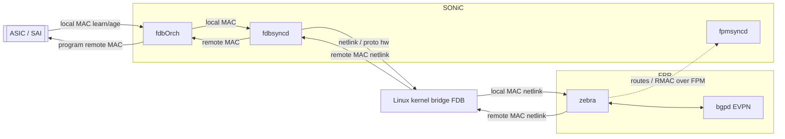
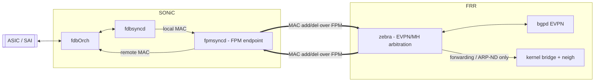

# MAC Learning Synchronization over the FPM Channel HLD

## Table of Contents

- [Revision](#revision)
- [Scope](#scope)
- [Definitions/Abbreviations](#definitionsabbreviations)
- [Overview](#overview)
- [Requirements](#requirements)
- [Architecture Design](#architecture-design)
- [High-Level Design](#high-level-design)
- [SAI API](#sai-api)
- [Configuration and management](#configuration-and-management)
- [Warmboot and Fastboot Design Impact](#warmboot-and-fastboot-design-impact)
- [Memory Consumption](#memory-consumption)
- [Restrictions/Limitations](#restrictionslimitations)
- [Testing Requirements/Design](#testing-requirementsdesign)
- [Open/Action items](#openaction-items)

### Revision

| Rev | Date       | Author            | Change Description |
|:---:|:----------:|:------------------|:-------------------|
| 1.0 | 08/31/2026 | Patrice Brissette (Cisco), Tamer Ahmed (Microsoft) | Initial version |

### Scope

This document describes a high-level design for synchronizing MAC (bridge FDB) state between
SONiC and FRRouting (FRR) over the **FPM channel** instead of the Linux kernel / netlink path.
The scope is EVPN-VXLAN with Multihoming (MH), where a MAC can be learned locally in hardware and,
at the same time, remotely through BGP EVPN.

The document covers the motivation, the target architecture, the affected SONiC and FRR components,
and the behavioral impact (configuration, warm/fast reboot, scale). It intentionally stays at a
high level: numeric identifiers and field-level encoding are left to the implementation PRs. The
HLD still defines the required message **semantics** — direction, local vs remote source, replay
generation, and end-of-replay signaling — because those are architectural contracts, not
implementation details.

### Definitions/Abbreviations

| Term | Definition |
|------|------------|
| FDB | Forwarding Database (MAC table) |
| FPM | Forwarding Plane Manager — netlink-over-TCP channel between FRR and SONiC |
| fdbOrch | SONiC orchagent component that owns the ASIC FDB via SAI |
| fdbsyncd | SONiC daemon syncing FDB state between STATE_DB/APPL_DB and the kernel |
| fpmsyncd | SONiC daemon that terminates the FPM channel from FRR |
| zebra | FRR routing/dataplane manager daemon |
| dplane_fpm_sonic | SONiC-specific zebra FPM dataplane plugin (FPM client) loaded by SONiC, derived from upstream `dplane_fpm_nl` |
| EVPN | Ethernet VPN |
| MH | EVPN Multihoming |
| RT-2 | EVPN Route Type 2 (MAC/IP advertisement) |
| VTEP | VXLAN Tunnel Endpoint |
| VNI | VXLAN Network Identifier |
| SAI | Switch Abstraction Interface |
| RMAC | Router MAC (L3VNI) |

### Overview

In SONiC today, MAC learning is hardware-driven. The ASIC reports learned/aged MACs through SAI to
**fdbOrch**, which records them and hands local MACs to **fdbsyncd**. fdbsyncd mirrors them into the
Linux kernel bridge FDB, and FRR **zebra** learns them from the kernel through netlink. Remote MACs
learned from BGP EVPN travel the opposite way: zebra programs them into the kernel bridge, fdbsyncd
picks them up from netlink, and fdbOrch installs them into the ASIC.

This works, but it uses the Linux kernel as an **inter-process message bus** for MAC state, on top
of its legitimate roles (local slow-path forwarding and ARP/ND resolution). That was fine when a
MAC had a single source. With **EVPN Multihoming, one `(VLAN, MAC)` can have two sources at once**:
a local hardware entry and a remote BGP EVPN entry.

zebra can represent this multi-source state, and this design extends fdbOrch internally to track the
same per-source contributions without changing the STATE/APP DB contract. The **kernel bridge FDB can
only hold one effective entry per MAC**, so forcing two sources through it creates races and churn.

A concrete example: zebra holds a MAC that is both BGP-EVPN-learned and locally learned. The BGP
route is withdrawn, so zebra deletes the MAC through the kernel. The kernel removes the single
entry even though the MAC is still present in hardware, and SONiC must then detect this and
re-install the local MAC — unnecessary churn and a race window.

Two distinct kernel-side mechanisms are involved, and it is important to separate them:

- **External-learn MAC model (`--kernel-mac-ext-learn`).** zebra installs MACs as externally learned
  and suppresses the kernel's own MAC learning/aging, so hardware and the EVPN control plane — not
  the kernel — drive the MAC state machine. This model is correct and is **retained** by this design.
- **Self-notification filtering (the out-of-tree dependency).** To use the kernel as a *relay*,
  a protocol tag (`proto hw` / `RTPROT_HW`) is added so zebra and fdbsyncd can ignore the netlink
  notifications caused by their own writes. This part is a **SONiC-specific kernel patch** whose
  upstreaming is uncertain, and it exists only because MAC state is bounced through the kernel.

**This design moves MAC add/delete/update synchronization off the kernel and onto the FPM channel**,
which SONiC already uses between zebra and fpmsyncd for routes, nexthop groups, and RMACs. Ownership
is split cleanly:

- **fdbOrch becomes authoritative for per-source local MAC state.** It tracks the
  local (ASIC-learned) and control-plane (BGP-EVPN-learned) contributions to a MAC
  independently, instead of collapsing them into a single origin. 
- **zebra owns the EVPN/MH multi-source arbitration** and remains the only writer of the kernel
  bridge FDB — but now only for the kernel's own forwarding/ARP-ND needs, never as a relay.

The result removes the race conditions, eliminates the dependency on the kernel patch (the
`proto hw`/`RTPROT_HW` self-notification tag is no longer needed once SONiC stops snooping the
kernel), and aligns MAC synchronization with the existing SONiC/FRR FPM architecture.

### Requirements

**Functional**

- Local (hardware-learned) MAC add/move/age events are delivered from SONiC to zebra **without**
  using the kernel bridge FDB as a synchronization bus.
- Remote (BGP EVPN RT-2) MAC add/withdraw events are delivered from zebra to SONiC **without** using
  the kernel bridge FDB as a synchronization bus.
- zebra maintains authoritative EVPN/MH arbitration, tracking the local and remote sources
  independently and deriving one effective result.
- fdbOrch tracks the local and control-plane contributions to a MAC independently, so that losing
  one source re-derives the effective ASIC entry from the surviving source without a control-plane
  round-trip. 
- The kernel bridge FDB and neighbor tables remain correct for local forwarding and ARP/ND.
- The design does not require the SONiC-specific `proto hw` / `RTPROT_HW` kernel patch for
  SONiC↔zebra MAC synchronization.

**Non-functional**

- Reuse the existing FPM transport (zebra `dplane_fpm_sonic` ↔ SONiC `fpmsyncd`); do not introduce a
  new channel.
- Backward compatible: when the feature is disabled, behavior is identical to today.
- Warm restart / fast reboot and FPM reconnect reconcile MAC state without persistent divergence.
- Scale to platform L2 FDB capacity and MAC-move rates without unbounded churn.

**Out of scope**

- L3VNI RMAC delivery over FPM (already implemented).
- EVPN Type-5 / IP-prefix routes (already over FPM).
- Changes to ASIC/SAI FDB learning or aging behavior.

### Architecture Design

The current architecture routes MAC synchronization through the kernel bridge FDB:



Both directions of MAC state relay through the kernel: local MACs go
`ASIC → fdbOrch → fdbsyncd → kernel → zebra`, and remote EVPN MACs go the reverse way
`zebra → kernel → fdbsyncd → fdbOrch → ASIC`. The FPM channel (dotted) already exists for routing
state, but MAC synchronization runs through the kernel.

The proposed architecture keeps the FPM channel as the single control path for MAC state and
reduces the kernel to a pure forwarding/ARP-ND consumer:



**Key architectural decisions:**

- **fpmsyncd is the single SONiC-side FPM endpoint** for MAC messages in both directions. fdbsyncd
  does not open its own FPM connection; it hands local MACs to fpmsyncd, which owns the FPM socket.
  This keeps one connection, one reconnect/replay domain, and reuses existing FPM plumbing.
- **zebra is the arbitration point.** It combines the local source (from SONiC over FPM) and the
  remote source (from BGP EVPN) into one effective decision, and programs the kernel only from that
  decision. Because SONiC no longer snoops kernel FDB events in this mode, there is no self-echo to
  filter — which is exactly what removes the need for the `proto hw` kernel patch.
- **fdbOrch keeps its own per-source view of the ASIC entry.** zebra's arbitration decides what is
  advertised and what the kernel holds; fdbOrch's per-source state decides what the ASIC holds when
  one contribution disappears. The two are complementary: without per-source state in fdbOrch, every
  local age-out of a still-remote MAC would require a round-trip through zebra, which is one of the
  churn sources this design sets out to remove.

### High-Level Design

**Implementation.** 

*FDB synchronization over FPM.* Delivers the transport and the mode switch with no EVPN
semantics: the fpmsyncd inbound MAC dispatch, the fdbsyncd handoff and removal of the kernel
mirroring/snoop and `proto hw` tagging, the `dplane_fpm_sonic` inbound MAC path, the configuration
and CLI/YANG plumbing, the generation and end-of-replay reconciliation, and warm/fast reboot
integration. 

- **Feature type.** Built-in SONiC feature; changes are confined to fdbOrch/fdbsyncd/fpmsyncd
  (sonic-swss) and to the SONiC zebra FPM plugin (FRRouting). No new containers.
- **Repositories changed.** `sonic-swss` (fdbsyncd, fpmsyncd; fdbOrch required changes) and 
  `FRRouting/frr` (zebra `dplane_fpm_sonic` and EVPN MAC handling). SONiC
  loads `dplane_fpm_sonic`, not the upstream `dplane_fpm_nl`. In the SONiC build the plugin sources
  live outside the FRR tree, in `src/sonic-frr/dplane_fpm_sonic/`, and are copied into `frr/zebra/`
  at build time, so the plugin body is edited there directly rather than through the
  `src/sonic-frr/patch` series. Only edits to pristine upstream FRR files go through that series.
- **DB and schema.** `STATE_FDB_TABLE` (local MACs) and `APP_VXLAN_FDB_TABLE` (remote MACs) keep
  their existing schema, so the DB contract with downstream orchs is unchanged. A new `CONFIG_DB` table `FDB_SYNC|global` carries the feature toggle (see Configuration and management). An internal handoff channel between fdbsyncd and fpmsyncd is added for local-MAC egress; its exact form (an APPL_DB table versus a direct IPC) is an implementation choice.

**MAC event flows (summary).**

- *Hardware learns a MAC:* fdbOrch records it and notifies fdbsyncd via `STATE_FDB_TABLE`; fdbsyncd
  hands it to fpmsyncd; fpmsyncd sends it to zebra over FPM. zebra marks the MAC local, runs its
  EVPN/MH logic, and advertises RT-2.
- *Hardware ages a MAC:* the same path carries the delete toward zebra to clear the local source.
  fdbOrch clears only the local contribution; if a control-plane contribution is still present in its
  per-source state, it re-derives the effective entry and reprograms the MAC in the ASIC as a synced
  (remote/EVPN-advertised) entry — no round-trip through zebra and no delete/re-install churn. zebra
  independently drops its local source and keeps the MAC as remote-only.
- *BGP EVPN adds a MAC:* zebra sends it over FPM to fpmsyncd, which writes `APP_VXLAN_FDB_TABLE`;
  fdbOrch installs it in the ASIC.
- *BGP EVPN withdraws a MAC:* zebra recomputes the effective entry. If the MAC is still local, the
  local ASIC entry is untouched — the withdraw only removes the remote contribution.
- *Both sources present:* zebra holds both independently and, when the effective result
  changes, pushes it to SONiC (over FPM, so fdbOrch updates the ASIC entry) and to the kernel (for
  local forwarding / ARP-ND), collapsing intermediate flaps into one downstream update. This is the
  case the single-source kernel FDB cannot represent, and is the core motivation for the design.

**Component responsibilities.**

- **fdbOrch** holds the local and control-plane contributions
  concurrently and derives the ASIC entry from them, so that removing one contribution falls back
  to the other instead of deleting the MAC. Its ownership of SAI FDB learning/aging and its
  STATE/APP DB contract are unchanged, and the existing origin precedence remains the
  tie-break when both sources are present.
- **fdbsyncd** stops mirroring local MACs into the kernel bridge (and stops the compensating
  re-install logic and the `proto hw` probing) when the feature is enabled. Instead it forwards
  local MAC changes to fpmsyncd. Its kernel FDB snoop is disabled in this mode so zebra's derived
  kernel writes are not looped back.
- **fpmsyncd** gains MAC handling on the FPM channel it already owns: it encodes local MACs toward
  zebra and decodes remote MACs from zebra into `APP_VXLAN_FDB_TABLE`.
- **zebra** gains an inbound MAC path on its SONiC FPM plugin, `dplane_fpm_sonic` (today the plugin
  mainly sends and only reads route-notify replies). It keeps its existing EVPN MAC state machine
  and simply swaps the local-MAC ingress from the kernel to FPM, and the SONiC-facing egress from
  kernel-snooped netlink to FPM.

**Message format.** MAC messages reuse the standard `AF_BRIDGE` bridge-FDB netlink format already
produced by zebra for RMAC replay, carried inside the existing FPM framing — so no new FPM message
container is required. The netlink *encoding* already exists in zebra; the *consumption* on the
SONiC side (fpmsyncd) and the *inbound* handling in zebra are the new pieces.

**Message disambiguation.** MAC messages are carried as `RTM_NEWNEIGH` / `RTM_DELNEIGH`, which is
the same message type used for IP neighbours. Receivers on both ends dispatch on the message type
first and then on `ndmsg.ndm_family`:

- `ndm_family == AF_BRIDGE` → bridge FDB entry, handled by the MAC path described here.
- any other family → IP neighbour, handled by the existing neighbour path.

Within the MAC path, direction alone determines the source: a message received by zebra on the FPM
socket is a local (ASIC-learned) MAC, and a message received by fpmsyncd is a remote
(EVPN-advertised) MAC. No kernel protocol tag is needed, and the receiver never has to infer the
source from the entry's attributes. On the SONiC side this is a new dispatch case: `FpmLink`
currently classifies only route, traffic-filter and `RTM_FPM_*` messages, and anything else falls
through to a handler that is not registered for `RTM_NEWNEIGH` today.

**Allocated private FPM message types.** SONiC and its SONiC-specific FRR integration already share
a private message-type range for EVPN-MH state, defined in `sonic-swss/fpmsyncd/fpm/fpm.h` and
`sonic-frr/frr/zebra/kernel_netlink.h`. The implementation allocates any new MAC replay/control
identifiers from this existing SONiC private range rather than introducing another range:

| Message type | Purpose |
|---|---|
| `RTM_FPM_ADD_EVPN_SHL` / `RTM_FPM_DEL_EVPN_SHL` | Split Horizon List |
| `RTM_FPM_ADD_EVPN_DF` / `RTM_FPM_DEL_EVPN_DF` | Designated Forwarder role |
| `RTM_FPM_ADD_EVPN_ES_BACKUP_NHG` / `RTM_FPM_DEL_EVPN_ES_BACKUP_NHG` | Ethernet Segment backup next-hop group |

MAC messages themselves do **not** consume a value from this range — they use the standard
`RTM_NEWNEIGH` / `RTM_DELNEIGH` types. The per-message replay generation is carried as a
SONiC-private FPM-only attribute on those MAC messages, for example a nested attribute named
`NDA_FPM_PRIVATE` containing a `generation_id` TLV. This private attribute is interpreted only by
the FPM raw decode paths in `fpmsyncd` and `dplane_fpm_sonic`; it is never sent to the kernel and
must not be parsed through generic `rtnl_neigh_parse` / libnl neighbor APIs.

The end-of-replay markers do consume values from the existing SONiC private FPM message-type range.
Any marker identifiers this design adds for reconnect reconciliation must be allocated from the same
SONiC private range, defined consistently in both headers, and kept aligned with the values already
used for EVPN-MH FPM messages.

**Reconnect reconciliation (required mechanism).** Each direction (local: SONiC→zebra; remote:
zebra→SONiC) is a versioned stream. On every (re)connect the sender opens a new *generation*,
stamps that generation on every `RTM_NEWNEIGH` / `RTM_DELNEIGH` MAC message using the private
FPM-only generation attribute described above, replays its full MAC set, and closes the replay with
an explicit private `RTM_FPM_*` *end-of-replay* marker carrying that generation.

**RMAC replay ownership.** zebra already owns an L3VNI RMAC replay on the FPM channel: on reconnect
it walks its L3VNI RMAC tables and re-enqueues each RMAC, tracking what it has sent so entries are
not duplicated. That mechanism is retained unchanged and remains the single owner of RMAC state, so
RMACs stay outside the two MAC streams defined here:

- SONiC never sources RMACs. fdbOrch is not an owner of RMAC state, so the local (SONiC→zebra)
  stream carries only L2 MACs learned from the ASIC and must not replay RMACs back to zebra.
- The remote-stream mark-and-sweep is scoped to L2 MAC entries. A generation sweep must never
  remove RMAC-derived state, which is reconciled by zebra's own RMAC replay on the same reconnect.

This keeps one replay mechanism per class of state and avoids two reconcilers competing over the
same entries after an FPM flap.

**Self-describing remote messages (required).** Remote-direction MAC messages MUST carry the VNI and
VLAN so fpmsyncd builds the `APP_VXLAN_FDB_TABLE` key (`Vlan<id>:<mac>`) and fields directly, with
no dependency on a VXLAN link cache. zebra already emits the VNI on RMAC messages; this is extended
to the L2 MAC cases (remote-unicast and ES-multipath encodings), which is the only related item to
confirm during implementation.

**Linux dependency.** The kernel keeps only its functional roles: local slow-path bridging and
ARP/ND resolution. zebra writes the effective MAC into the bridge FDB as a *derived output* of its
arbitration, not as a relay. As today, those entries are installed as externally learned
(`NTF_EXT_LEARNED`) with kernel aging suppressed — the MAC learning/aging state machine remains
driven **outside** the kernel (by hardware and the EVPN control plane), and that model is unchanged
by this design. What this design removes is only the SONiC-specific self-notification filtering: the
`proto hw`/`RTPROT_HW` kernel patch is no longer required, because SONiC no longer snoops the kernel
FDB and there is therefore no self-echo to filter.

**Serviceability.** Existing FDB show/debug tooling continues to work because the DB schema is
unchanged. FPM status/counters already exist on both ends and are extended to cover MAC messages.

### SAI API

No new or modified SAI APIs are required. The design reuses the existing SAI FDB object and FDB
event notifications already consumed by fdbOrch (learn/age/move/flush, static/dynamic entry types,
endpoint-IP and next-hop-group destinations for remote MACs). Silicon vendors need no additional
SAI support for this feature.

### Configuration and management

Enabling FPM-based MAC synchronization involves **two complementary knobs** that control different
things:

- **SONiC transport (new CLI):** a new global (per-switch) SONiC configuration tells SWSS to use the
  FPM channel instead of the kernel/netlink path for MAC synchronization.
- **FRR MAC-model (`--kernel-mac-ext-learn`, existing):** still required, and orthogonal to the
  transport. It puts zebra in external-learn mode, i.e. the mode where the **kernel does not drive
  the MAC learning/aging state machine** (hardware and the EVPN control plane do). This design does
  not change that model; it only changes how MAC state is carried between SONiC and zebra.

Both must be set for FPM mode. The new SONiC knob is gated and defaults to today's behavior, so the
feature can be enabled per device and rolled back safely.

**CONFIG_DB schema.** A dedicated single-instance table (rather than overloading `DEVICE_METADATA`):

```
FDB_SYNC|global
    mac_sync_mode = kernel | fpm      # default: kernel
```

**CLI (sonic-utilities).**

```
config fdb mac-sync-mode <kernel|fpm>     # write FDB_SYNC|global:mac_sync_mode
show fdb mac-sync-mode                    # display current mode
```

Example:

```
admin@sonic:~$ config fdb mac-sync-mode fpm
admin@sonic:~$ show fdb mac-sync-mode
MAC sync mode: fpm  (FDB synchronized to FRR over FPM)
```

**YANG.** A new `sonic-fdb-sync` model defines the `FDB_SYNC` container with a single
`mac_sync_mode` enumeration leaf (`kernel` | `fpm`, default `kernel`).

**Propagation.**

- **SONiC:** fdbsyncd and fpmsyncd subscribe to `CONFIG_DB` `FDB_SYNC|global`. On `fpm`, fdbsyncd
  stops the kernel bridge mirroring and snoop and hands local MACs to fpmsyncd (which sends/receives
  MAC updates over FPM); on `kernel` it reverts to today's netlink behavior.
- **FRR:** zebra runs with `--kernel-mac-ext-learn` (external-learn MAC model). The FRR config layer
  (bgpcfgd/templates) additionally enables MAC delivery over FPM (a zebra FPM option paralleling the
  existing `fpm use-next-hop-groups`) so the MAC updates flow on the FPM channel rather than through
  the kernel.

Both ends must agree before the kernel relay is disabled; if either side does not have the feature
enabled, the system falls back to the kernel path to avoid a black hole. Existing FDB and FPM
show/status commands remain valid and are unchanged by this feature.

### Warmboot and Fastboot Design Impact

The design integrates with the existing warm-start/reconciliation machinery. fdbsyncd and fpmsyncd
already buffer changes during warm start, and fpmsyncd already has EOIU/hold-timer reconciliation
for FPM state; MAC synchronization reuses these so tables are reconciled rather than flushed across
a warm boot. On FPM reconnect, each direction replays its full MAC set and marks completion, and
stale entries are swept afterwards. Because the ASIC retains hardware MACs and `STATE_FDB_TABLE` is
persisted, local MACs are re-derived after a restart; remote MACs are held until zebra replays them,
never flushed on disconnect alone. During fast reboot the ASIC keeps forwarding and synchronization
is restored on reconnect. Existing warmboot/fastboot behavior for other features is unaffected.

### Memory Consumption

Negligible and bounded by the existing FDB scale. No new per-MAC persistent tables are introduced
beyond the existing STATE/APP DB entries; the only additions are transient FPM message buffers
(already present) and, if chosen, a short-lived internal handoff table between fdbsyncd and fpmsyncd.
Memory scales linearly with the number of MACs, comparable to the current kernel-based path, and
typically lower because the duplicate kernel-echo/re-install churn is removed.

### Restrictions/Limitations

- The primary target — and the focus of the requirements, flows, and tests in this HLD — is
  EVPN-VXLAN Multihoming with hardware-based MAC learning.
- The FPM-based method is intended to generalize to **all FDB modes** (e.g. MCLAG, single-homing,
  non-EVPN) using the same path, and the design does not preclude an all-FDB deployment. Extending
  coverage to those modes — in particular MCLAG coexistence — still needs validation and is tracked
  in Open/Action items, so it is a design goal here, not a validated claim.
- Requires matching support on both SONiC and FRR; mixed versions fall back to the kernel path.
- The zebra inbound-MAC-over-FPM handling is new FRR work. It lands in `dplane_fpm_sonic`, which is
  SONiC-specific and carried in the SONiC FRR patch series rather than upstream FRR, so it does not
  depend on upstream acceptance. Any change that reaches common zebra EVPN code outside the plugin
  does need to be upstreamed.

### Testing Requirements/Design

**Unit tests**

- fdbsyncd: verify that, in FPM mode, a local MAC add/delete produces the handoff to fpmsyncd and no
  kernel `bridge fdb`/`proto hw` operations; verify `kernel` mode is byte-identical to today.
- fpmsyncd: verify local MAC egress produces an FPM MAC message, and inbound FPM MAC messages produce
  `APP_VXLAN_FDB_TABLE` writes; verify `AF_BRIDGE` versus IP-neighbour dispatch; verify end-of-replay
  reconciliation and that RMAC-derived state is never swept. An ES-backed MAC carrying `NDA_NH_ID` and no
  `NDA_DST` is written with `nexthop_group` and no `remote_vtep`, and a nexthop group id of zero is
  not treated as a group; a MAC arriving against a port that carries an ESI, with neither
  attribute, is written with `ifname`, while the same message on a port without an ESI is still
  discarded as the bridge-side duplicate. `fpm` mode issues no `bridge` command for a local MAC
  refresh, while `kernel` mode still does.
- zebra: verify the new inbound FPM MAC handler updates the EVPN MAC state and triggers RT-2.
- fdbOrch: existing FDB unit tests (local learn/age, local+remote coexistence, remote withdrawal) must
  pass unchanged, proving the DB contract is stable. A local learn over an existing EVPN-advertised MAC must retain the control-plane contribution rather than replacing it; a local age-out must fall back to the remote contribution without deleting the ASIC entry; a remote withdraw with the MAC still local
  must leave the local entry untouched.

**Integration / system tests**

- Reuse the FPM-based EVPN-MH topotest already added in the FRR work (no kernel
  dependency) to cover hardware add, age/delete, RT-2 add/withdraw, and the local+remote combined
  cases; SONiC VS tests for MH failover.

**Robustness / scale**

- Reconnect/warm-reboot: restart the FPM connection and daemons; confirm full
  reconciliation with no stale or missing entries.
- Race regression: BGP withdraw while a MAC is still local must not remove the local ASIC
  entry.
- Scale: fill the L2 FDB to platform capacity and exercise MH failover across many MACs;
  confirm fewer operations than the kernel baseline.

