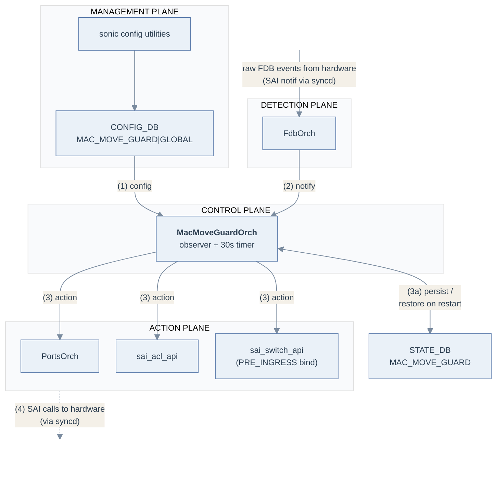
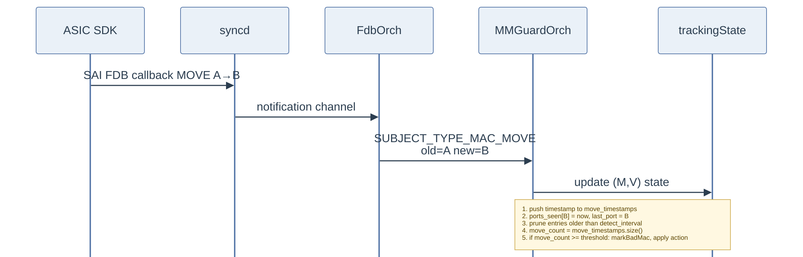
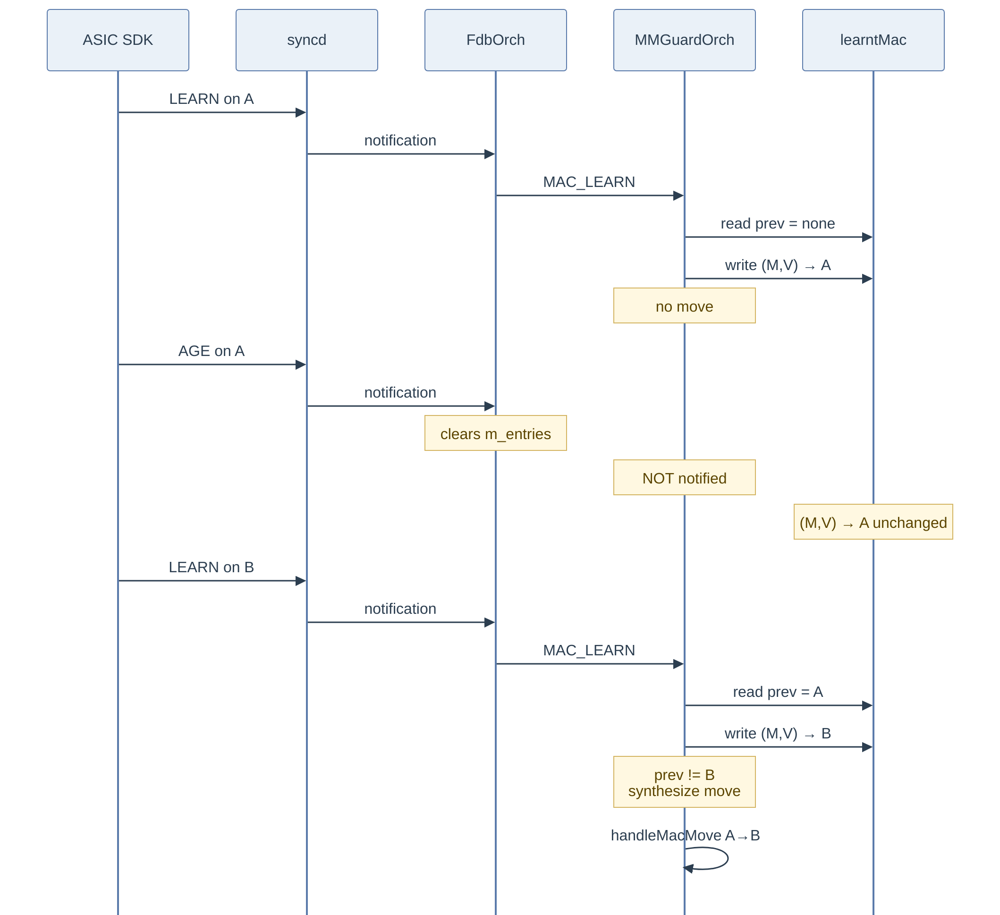
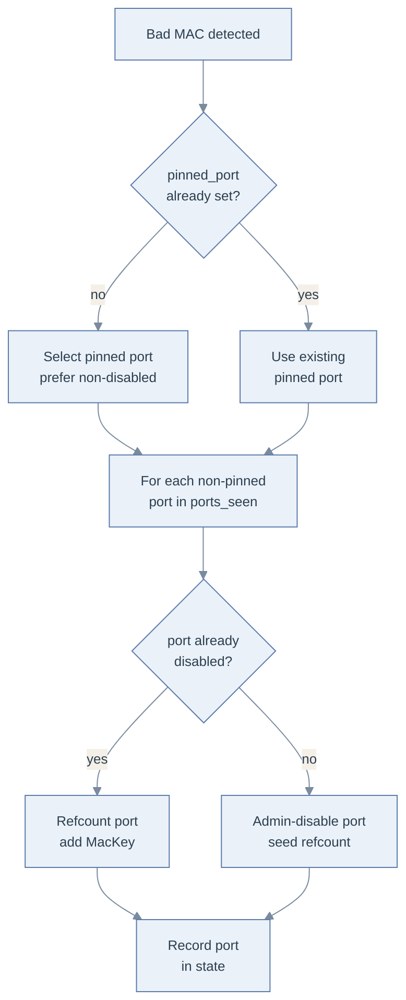
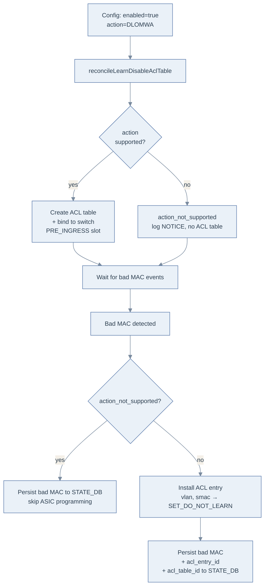
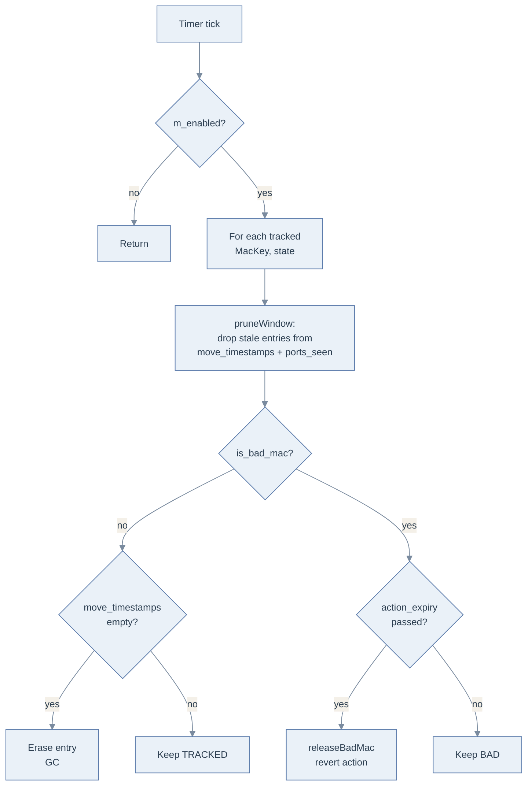
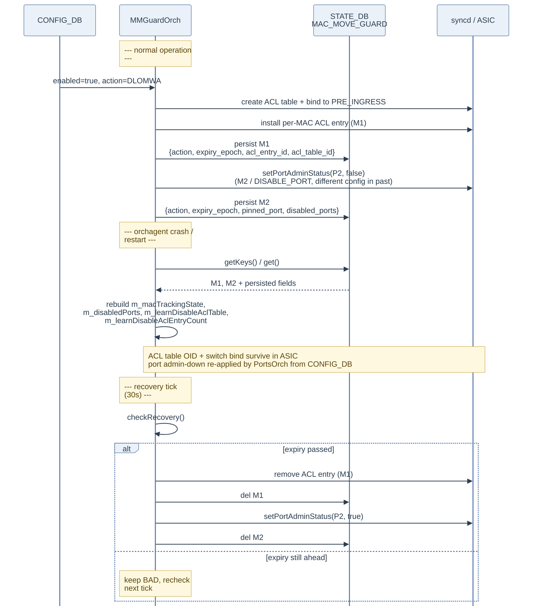

# SONiC MAC Move Guard High Level Design

## Table of Contents

- [1. Revision](#1-revision)
- [2. Scope](#2-scope)
- [3. Definitions/Abbreviations](#3-definitionsabbreviations)
- [4. Overview](#4-overview)
  - [4.1 Detection](#41-detection)
  - [4.2 Mitigation actions](#42-mitigation-actions)
  - [4.3 Mitigation duration](#43-mitigation-duration)
- [5. Requirements](#5-requirements)
- [6. Module Design](#6-module-design)
  - [6.1 Overall design](#61-overall-design)
  - [6.2 Configuration and control flow](#62-configuration-and-control-flow)
    - [6.2.1 Detection: native SAI MAC move](#621-detection-native-sai-mac-move)
    - [6.2.2 Detection: synthesized move from AGED + LEARNED](#622-detection-synthesized-move-from-aged--learned)
    - [6.2.3 Mitigation: DISABLE_PORT](#623-mitigation-disable_port)
    - [6.2.4 Mitigation: DISABLE_LEARN_ON_MAC_WITH_ACL](#624-mitigation-disable_learn_on_mac_with_acl)
    - [6.2.5 Recovery](#625-recovery)
    - [6.2.6 Orchagent restart handling](#626-orchagent-restart-handling)
  - [6.3 Data structures](#63-data-structures)
  - [6.4 SWSS and syncd changes](#64-swss-and-syncd-changes)
- [7. Configuration and Management](#7-configuration-and-management)
  - [7.1 CONFIG_DB](#71-config_db)
  - [7.2 DB and Schema changes](#72-db-and-schema-changes)
  - [7.3 YANG model](#73-yang-model)
  - [7.4 CLI examples](#74-cli-examples)
- [8. Warmboot](#8-warmboot)
- [9. Memory Consumption](#9-memory-consumption)
- [10. Restrictions/Limitations](#10-restrictionslimitations)
- [11. Testing Requirements](#11-testing-requirements)
  - [11.1 Unit tests (one-liners)](#111-unit-tests-one-liners)
  - [11.2 System tests](#112-system-tests)
- [12. Open/Action items](#12-openaction-items)

## 1. Revision
Rev | Date | Author | Change Description
----|------|--------|-------------------
|v0.1|2026-05-25|Sudheer Y R(Nexthop)|Initial version of MAC Move Guard HLD

## 2. Scope
This document describes the high level design of the MAC Move Guard feature in SONiC. MAC Move Guard detects abnormally high rates of MAC address moves between Layer-2 ports within a VLAN/bridge domain and applies a configurable mitigation action against the offending MAC, for a period of configured interval. The feature is implemented entirely inside `orchagent` as a new orchestrator (`MacMoveGuardOrch`) that subscribes to FDB events emitted by `FdbOrch` and drives `PortsOrch` / SAI FDB / SAI VLAN / SAI Bridge APIs to apply mitigation.

## 3. Definitions/Abbreviations
Definitions/Abbreviation|Description
------------------------|-----------
MAC Move | An FDB event where a previously-learned MAC address is re-learned on a different bridge port within the same VLAN
Bad MAC | A (VLAN, MAC) whose number of moves within `detect_interval` has exceeded the configured `threshold`
Pinned port | The one port to which a bad MAC stays anchored under the `DISABLE_PORT` action; all other ports the MAC was bouncing on are admin-disabled
Detect interval | Sliding window (seconds) over which moves are counted
Action interval | Time (seconds) the mitigation action stays in effect before recovery
`bv_id` | SAI bridge-vlan OID identifying the L2 broadcast domain a MAC belongs to
`MacKey` | Tuple of (`MacAddress`, `bv_id`) — uniquely identifies a tracked MAC
FDB | Forwarding DataBase (the bridge MAC address table)
SAI | Switch Abstraction Interface
FSM | Finite State Machine

## 4. Overview
In a stable L2 network, a host's MAC is normally seen on a single bridge port. Pathological conditions — L2 forwarding loops, a misbehaving host, or a duplicated MAC across two endpoints — cause the same MAC to bounce between two or more ports at very high rates. The data plane "MAC move storm" that results is harmful in several ways: the CPU is saturated by FDB notifications, forwarding to the affected MAC becomes effectively random because the FDB entry is overwritten constantly, and it can mask the real source of the problem by spreading the impact across many ports.

MAC Move Guard provides a contained, automatic mitigation that is split into: detection and mitigation for a user specified amount of time.

### 4.1 Detection
Per (VLAN, MAC), the orchestrator maintains a sliding window of move timestamps. On each move event it prunes entries older than `detect_interval` and re-derives the move count. When the count exceeds `threshold`, the MAC enters the **Bad MAC** state.

Two FDB-event paths feed detection:
1. **Native** SAI MAC move (`SAI_FDB_EVENT_MOVE`) is delivered as-is through `SUBJECT_TYPE_MAC_MOVE`.
2. **Synthesized** move — for SDKs that only emit `AGED` then `LEARNED` instead of a native MOVE, the orch reconstructs the MOVE from a residual cache entry on the LEARN path.

### 4.2 Mitigation actions
Two mitigation actions are supported. They are mutually exclusive — only one is in effect at a time, configured by the `action` field in CONFIG_DB.

SAI Action | Effect on the bad MAC
-----------|----------------------
`DISABLE_PORT` | Pin the MAC to one selected port; admin-disable every other port it was bouncing on
`DISABLE_LEARN_ON_MAC_WITH_ACL` | Install a pre-ingress ACL entry matching `(vlan, smac)` with `SAI_ACL_ACTION_TYPE_SET_DO_NOT_LEARN` so the bad MAC stops being (re)learned while forwarding continues via the existing FDB entry

If the orchestrator cannot program `DISABLE_LEARN_ON_MAC_WITH_ACL`, it is flagged `action_not_supported`: configuration is still accepted and bad MACs are still tracked and persisted to STATE_DB, but no ACL table or entry is programmed.

### 4.3 Mitigation duration
A `SelectableTimer` fires every 30 s. For every bad MAC whose `action_expiry_time` has passed, the orchestrator reverses the action that was applied (re-enable the port for `DISABLE_PORT`, remove the per-MAC ACL entry for `DISABLE_LEARN_ON_MAC_WITH_ACL`). Action state is reference-counted, so a shared target (e.g. a port disabled because two bad MACs were both bouncing on it) is reverted only when the last bad MAC releases it. Both the bad-MAC identity and its recovery context are mirrored to STATE_DB so the recovery can complete even if `orchagent` restarts in the middle of the action interval (see [§6.2.6](#626-orchagent-restart-handling)).

## 5. Requirements
- Detect MAC moves on a per (VLAN, MAC) basis using a sliding-window threshold
- Support two mitigation actions: `DISABLE_PORT` and `DISABLE_LEARN_ON_MAC_WITH_ACL`
- Mitigation stays for a configurable action interval
- CONFIG_DB-driven configuration via a single `GLOBAL` row, validated by a new YANG model
- Persist bad-MAC identities and recovery context in STATE_DB so an `orchagent` restart cleanly completes (or aborts) any in-flight mitigation
- Flag `DISABLE_LEARN_ON_MAC_WITH_ACL` as `action_not_supported` when it cannot be programmed; continue to track bad MACs but skip ACL programming

## 6. Module Design
### 6.1 Overall design
- Management framework writes the `MAC_MOVE_GUARD|GLOBAL` row to CONFIG_DB using the YANG model in [§7.3](#73-yang-model)
- `MacMoveGuardOrch` (new) in orchagent subscribes to the `MAC_MOVE_GUARD` table and configures itself
- `MacMoveGuardOrch` attaches as an `Observer` on `FdbOrch` and consumes `SUBJECT_TYPE_MAC_LEARN` / `SUBJECT_TYPE_MAC_MOVE`
- Mitigation is applied by calling `PortsOrch::setPortAdminStatusByAlias()` (for `DISABLE_PORT`) and `sai_acl_api` directly (for `DISABLE_LEARN_ON_MAC_WITH_ACL`, which uses a single pre-ingress ACL table bound to `SAI_SWITCH_ATTR_PRE_INGRESS_ACL`)
- Bad-MAC identities and their recovery context are mirrored to STATE_DB (`MAC_MOVE_GUARD`) so the orchestrator can reconstruct in-flight mitigation across a restart (see [§6.2.6](#626-orchagent-restart-handling))
- A 30 s `SelectableTimer` is used to apply the mitigation action for the configured duration, and to manage the MAC state
- syncd / SAI: no changes

The picture below groups the relationships by *role*. The numbered arrows describe the lifetime of one bad-MAC episode.



`MacMoveGuardOrch` holds:
- maps: `m_macTrackingState`, `m_disabledPorts`, `m_learntMac`
- ACL state: `m_learnDisableAclTable`, `m_learnDisableAclEntryCount`, `m_aclSetDoNotLearnSupported`
- STATE_DB handle: `m_stateBadMacTable` (`MAC_MOVE_GUARD` table)
- timer: `m_recoveryTimer` (30 s)
- handlers: `handleMacLearn()`, `handleMacMove()`, `checkRecovery()`, `restoreBadMacState()`

**Numbered flows (one bad-MAC episode):**
1) Administrator writes `MAC_MOVE_GUARD|GLOBAL` to CONFIG_DB; `MacMoveGuardOrch::doTask(Consumer&)` consumes it and (when `action=DISABLE_LEARN_ON_MAC_WITH_ACL`) reconciles the pre-ingress ACL table lifecycle
2) FDB events originate in the ASIC; the SDK invokes the SAI FDB-event callback registered by `syncd`, which forwards the event on the swss notification channel where `FdbOrch::handleSaiFdbEvent()` consumes it and emits `SUBJECT_TYPE_MAC_LEARN` / `SUBJECT_TYPE_MAC_MOVE` to `MacMoveGuardOrch::update()`
3) On threshold breach `MacMoveGuardOrch` either calls `PortsOrch::setPortAdminStatusByAlias()` (`DISABLE_PORT`) or installs a per-MAC pre-ingress ACL entry via `sai_acl_api` (`DISABLE_LEARN_ON_MAC_WITH_ACL`); in both cases the bad-MAC identity and recovery context are mirrored to STATE_DB (3a)
4) These SAI calls reach the hardware via `syncd` and reshape what the SDK will emit next: a disabled port emits no further LEARNs; a MAC matched by a `SET_DO_NOT_LEARN` ACL entry stops being (re)learned while existing forwarding continues

**Recovery timer (out-of-band).** A 30-second `SelectableTimer` inside `MacMoveGuardOrch` drives `checkRecovery()`. On each tick it iterates `m_macTrackingState`, prunes each MAC's sliding window, garbage-collects quiet non-bad MACs from the map, and for any bad MAC whose `action_expiry_time` has elapsed invokes `releaseBadMac()` to revert the applied SAI action. The timer is not on the data path — it is purely housekeeping.

### 6.2 Configuration and control flow

#### 6.2.1 Detection: native SAI MAC move
The SDK does **not** call `FdbOrch` directly. FDB events originate in the ASIC; the SDK invokes the SAI FDB-event callback that `syncd` registered at boot. `syncd` forwards the event onto the swss notification channel, where `FdbOrch::handleSaiFdbEvent()` decodes it and emits the appropriate observer notification (`SUBJECT_TYPE_MAC_MOVE` for a native move). `MacMoveGuardOrch::handleMacMove()` processes that notification:

<div align="center">



</div>

1) ASIC SDK invokes the SAI FDB-event callback for `SAI_FDB_EVENT_MOVE`; `syncd` posts the event onto the swss notification channel
2) `FdbOrch::handleSaiFdbEvent()` consumes the notification and emits `SUBJECT_TYPE_MAC_MOVE` to attached observers
3) `MacMoveGuardOrch::handleMacMove()` updates `m_macTrackingState[(M,V)]`: pushes the move timestamp, records the new port in `ports_seen` / `last_port`, prunes entries older than `detect_interval`, recomputes `move_count`, and if it reaches `threshold` calls `markBadMac()` to apply the configured action

#### 6.2.2 Detection: synthesized move from AGED + LEARNED
Some SDKs report a port change as `AGED` on the old port followed by `LEARNED` on the new port, with no native MOVE. The orchestrator never erases `m_learntMac` on AGE; that residual entry is what allows a later LEARN on a different port to be recognized as a move.

<div align="center">



</div>

1) First `LEARN` on `A`: `handleMacLearn()` finds `m_learntMac[(M,V)]` empty, sets it to `A`, returns (not a move)
2) `AGE` on `A`: `MacMoveGuardOrch` is **not** subscribed to AGE; `m_learntMac[(M,V)] = A` is intentionally retained
3) Subsequent `LEARN` on `B`: `handleMacLearn()` reads `prev = A`, writes `B`, and synthesizes a `MacMoveNotification{old:A, new:B}` which it forwards to `handleMacMove()` — joining the same code path as the native MOVE in [§6.2.1](#621-detection-native-sai-mac-move)

#### 6.2.3 Mitigation: DISABLE_PORT
The MAC is pinned to one port; all other ports it appeared on within the detection window are admin-disabled. Port disable is reference-counted so a port shared by multiple bad MACs is only re-enabled when the last bad MAC is released.

<div align="center">



</div>

1) Administrator configures `action=DISABLE_PORT` in `MAC_MOVE_GUARD|GLOBAL`
2) On threshold breach, `markBadMac()` selects a pinned port — preferring a port not currently disabled by any other bad MAC (to maximize ports kept UP)
3) Every other port the MAC was just bouncing on is admin-disabled via `PortsOrch::setPortAdminStatusByAlias(port, false)`
4) `m_disabledPorts[port].insert(MacKey)` adds the bad MAC to the port's reference set; the SAI admin-down call is issued only on the first insertion
5) On recovery (`action_expiry_time` reached), `releaseBadMac()` decrements each port's ref-count and re-enables ports whose count reaches zero

#### 6.2.4 Mitigation: DISABLE_LEARN_ON_MAC_WITH_ACL
The orchestrator suppresses re-learning of the bad MAC by installing a per-MAC pre-ingress ACL entry that matches `(vlan, smac)` and applies `SAI_ACL_ACTION_TYPE_SET_DO_NOT_LEARN`. The existing FDB entry continues to forward traffic to/from the MAC; only the FDB churn source — repeated LEARN events on alternating ports — is gated.

A **single ACL table** at the `PRE_INGRESS` stage holds one entry per bad MAC. Its lifecycle is tied strictly to CONFIG_DB: the table is created when the feature is enabled with `action=DISABLE_LEARN_ON_MAC_WITH_ACL` and destroyed when the configuration leaves that state. The table is bound directly to `SAI_SWITCH_ATTR_PRE_INGRESS_ACL` (SwitchOrch's bind helper does not cover the PRE_INGRESS stage).

Compared with `DISABLE_PORT`, this action is **non-disruptive to in-flight forwarding**: the port stays admin-up, existing FDB entries continue to forward, only the offender's relearn is silenced.

<div align="center">



</div>

1) Administrator configures `enabled=true, action=DISABLE_LEARN_ON_MAC_WITH_ACL` in `MAC_MOVE_GUARD|GLOBAL`
2) `doTask` snapshots the previous `(enabled, action)` and calls `reconcileLearnDisableAclTable()`. On a transition **into** `(enabled, DLOMWA)` the orch creates the pre-ingress ACL table and binds it to `SAI_SWITCH_ATTR_PRE_INGRESS_ACL`. If the action cannot be programmed it is flagged `action_not_supported` (NOTICE log, no table created). On a transition **out of** `(enabled, DLOMWA)` (action change or disable), every installed entry is removed and the table is destroyed
3) On threshold breach, `markBadMac()` installs one entry per bad MAC into the ACL table (skipped silently when the action is `action_not_supported` and no table exists); `state.learn_disable_acl_entry_id` is recorded and `m_learnDisableAclEntryCount` is incremented
4) `persistBadMac()` writes the entry id, the ACL table OID, and the action expiry epoch to STATE_DB so the entry can be cleaned up after an `orchagent` restart
5) On recovery, `releaseBadMac()` removes the ACL entry, decrements `m_learnDisableAclEntryCount`, and drops the STATE_DB row. The ACL table is **not** torn down per-entry; it stays for the lifetime of the configuration

#### 6.2.5 Recovery
A 30 s `SelectableTimer` drives `checkRecovery()`. For each bad MAC whose `action_expiry_time` has elapsed, `releaseBadMac()` dispatches on the configured action and reverts the SAI state. Non-bad MACs whose `move_timestamps` deque is empty (i.e. no moves in the last detection window) are garbage-collected.

<div align="center">



</div>

1) Timer fires every `RECOVERY_CHECK_INTERVAL_SECS` (30 s)
2) If the feature is disabled, return immediately
3) For each tracked MAC, prune the sliding window first to keep `move_count` and `ports_seen` current
4) For non-bad MACs whose `move_timestamps` deque is now empty, erase the tracking entry (memory GC)
5) For bad MACs whose `action_expiry_time` has passed, call `releaseBadMac()` to revert the action and transition the MAC back to TRACKED

#### 6.2.6 Orchagent restart handling
A bad MAC's mitigation is in effect for the configured `action_interval` (default 600 s, max 24 h). If `orchagent` restarts during that interval, two pieces of hardware state survive in the ASIC:

- For `DISABLE_PORT`: the `SAI_PORT_ATTR_ADMIN_STATE=false` written via `PortsOrch::setPortAdminStatusByAlias()` is persisted in CONFIG_DB (`PORT|<alias>:admin_status`) and re-applied by `PortsOrch` on every start.
- For `DISABLE_LEARN_ON_MAC_WITH_ACL`: the pre-ingress ACL table, its switch binding, and every per-MAC entry survive in the ASIC because they were written through `syncd` — but the OIDs and the per-bad-MAC association are lost from `MacMoveGuardOrch`'s in-memory state.

Without persistence, both would leak: the disabled ports would stay down forever, and the orphaned ACL entries would silently keep suppressing learning for the offending MACs. To prevent this, every bad MAC is mirrored to STATE_DB under `MAC_MOVE_GUARD|<bv_id_hex>:<mac>` at the moment of detection (`persistBadMac()`) and dropped at the moment of recovery (`removeBadMacFromState()`). The constructor calls `restoreBadMacState()` to rebuild the in-memory tracking state from STATE_DB; the next `checkRecovery()` tick then resumes the recovery timeline against the persisted absolute expiry, either continuing the action until the original deadline or — if the deadline has already passed — reverting immediately.

Persisted fields per bad MAC:

Field | Used by | Purpose
------|---------|--------
`action` | both | Determines which case in `releaseBadMac()` to dispatch
`action_expiry_epoch` | both | Wall-clock epoch (seconds); on restore, `(epoch - now)` becomes the remaining steady-clock interval, clamped to 0
`pinned_port` | `DISABLE_PORT` | Re-populated into `state.pinned_port`
`disabled_ports` | `DISABLE_PORT` | Comma-separated alias list; re-populates `state.disabled_ports` and `m_disabledPorts[port].insert(key)` so per-port ref-counts are rebuilt
`acl_entry_id` | `DISABLE_LEARN_ON_MAC_WITH_ACL` | The SAI ACL entry OID to remove on recovery
`acl_table_id` | `DISABLE_LEARN_ON_MAC_WITH_ACL` | The ACL table OID; the first restored entry adopts it into `m_learnDisableAclTable`; subsequent entries cross-check it and warn on mismatch

<div align="center">



</div>

Edge cases and invariants:

- **Action transitions across restart**: if CONFIG_DB now specifies a different `action` than what was persisted, `restoreBadMac()` honours the **persisted** action when reverting (since that's what was actually programmed in the ASIC). New violations after the restart use the new action.
- **Feature disabled across restart**: `restoreBadMacState()` runs unconditionally in the constructor, before CONFIG_DB has been processed. The first `doTask()` then sees `enabled=false` (or a missing row) and `clearAllState()` reverts every restored entry — guaranteeing no leak even when the operator disables the feature while bad MACs are in effect.

### 6.3 Data structures

```c++
struct MacKey {
    MacAddress mac;
    sai_object_id_t bv_id;       // SAI bridge-vlan OID
};

// Hash functor for MacKey, used by std::unordered_map. Packs the 6 MAC bytes
// into a uint64 and combines with bv_id using a boost-style mixing step.
struct MacKeyHash {
    std::size_t operator()(const MacKey &k) const noexcept;
};

struct MacMoveTrackingState {
    std::deque<steady_clock::time_point> move_timestamps;
    std::map<std::string, steady_clock::time_point> ports_seen;
    size_t move_count = 0;
    bool is_bad_mac = false;
    MacMoveGuardAction action = MacMoveGuardAction::DISABLE_PORT;       // sticky: action used when this MAC was marked bad
    steady_clock::time_point action_expiry_time;
    std::string pinned_port;                                            // DISABLE_PORT
    std::set<std::string> disabled_ports;                               // DISABLE_PORT
    std::string last_port;
    sai_object_id_t learn_disable_acl_entry_id = SAI_NULL_OBJECT_ID;    // DISABLE_LEARN_ON_MAC_WITH_ACL
};

struct LearntMacEntry {
    std::string port;
    steady_clock::time_point last_seen;     // for pruning stale entries
};
```

Per-orch maps:

Map | Type | Purpose
----|------|--------
`m_macTrackingState` | `std::map<MacKey, MacMoveTrackingState>`                            | Per-MAC sliding window + bad-MAC state
`m_disabledPorts`    | `std::map<std::string, std::set<MacKey>>`                           | Reference count for `DISABLE_PORT`: port alias → bad MACs holding it down
`m_learntMac`        | `std::unordered_map<MacKey, LearntMacEntry, MacKeyHash>`            | Last-known port per (VLAN, MAC); used to synthesize MOVE from AGED+LEARNED SDKs (see [§6.2.2](#622-detection-synthesized-move-from-aged--learned)). Pruned by `pruneLearntMacCache()` after one detection window of silence

`DISABLE_LEARN_ON_MAC_WITH_ACL` state (one per orch instance):

Field | Type | Purpose
------|------|--------
`m_learnDisableAclTable`       | `sai_object_id_t` | OID of the pre-ingress ACL table; `SAI_NULL_OBJECT_ID` when the action is not configured or is `action_not_supported`
`m_learnDisableAclEntryCount`  | `size_t`          | Number of installed per-MAC entries; used as a safety guard before destroying the table
`m_aclSetDoNotLearnSupported`  | `int`             | Cached `action_not_supported` flag (−1 not queried, 0 not supported, 1 supported)

STATE_DB handle:

Field | Type | Purpose
------|------|--------
`m_stateBadMacTable` | `unique_ptr<swss::Table>` | `MAC_MOVE_GUARD` table in STATE_DB used by `persistBadMac()` / `removeBadMacFromState()` / `restoreBadMacState()` (see [§6.2.6](#626-orchagent-restart-handling))

### 6.4 SWSS and syncd changes
- New `MacMoveGuardOrch`: consumes the `MAC_MOVE_GUARD` CONFIG_DB table, attaches as an `Observer` on `FdbOrch`, owns its own 30 s `SelectableTimer`, persists bad-MAC state to STATE_DB, and drives `PortsOrch` + `sai_acl_api` directly
- `FdbOrch`: two new notification subjects, `SUBJECT_TYPE_MAC_LEARN` and `SUBJECT_TYPE_MAC_MOVE`, emitted from the existing `SAI_FDB_EVENT_LEARNED` and `SAI_FDB_EVENT_MOVE` handlers. No change to FDB programming or aging behavior
- STATE_DB: new `MAC_MOVE_GUARD` table, one row per bad MAC keyed by `<bv_id_hex>:<mac>`; schema documented in [§6.2.6](#626-orchagent-restart-handling)
- syncd / SAI: no changes

## 7. Configuration and Management
### 7.1 CONFIG_DB
Configure MAC Move Guard by creating the single `MAC_MOVE_GUARD|GLOBAL` row:
```
"MAC_MOVE_GUARD": {
  "GLOBAL": {
    "enabled": "true",
    "threshold": "1000",
    "detect_interval": "5",
    "action_interval": "600",
    "action": "DISABLE_PORT"
  }
}
```

### 7.2 DB and Schema changes

```
; Defines schema for MAC Move Guard configuration attributes
key                 = MAC_MOVE_GUARD:GLOBAL          ; only the GLOBAL key is permitted
; field             = value
ENABLED             = "true" / "false"               ; default false
THRESHOLD           = 1*10DIGIT                      ; max moves in detect_interval (default 1000)
DETECT_INTERVAL     = 1*4DIGIT                       ; seconds, 1..3600 (default 5)
ACTION_INTERVAL     = 1*5DIGIT                       ; seconds, 120..86400 (default 600)
ACTION              = action_value                   ; default DISABLE_PORT

; value annotations
action_value        = "DISABLE_PORT" / "DISABLE_LEARN_ON_MAC_WITH_ACL"
```

In addition, `MacMoveGuardOrch` maintains a STATE_DB table for bad-MAC recovery across `orchagent` restarts (see [§6.2.6](#626-orchagent-restart-handling)). This table is written and read only by `orchagent` and is not part of the user-configurable surface:

```
; STATE_DB MAC_MOVE_GUARD table — one row per bad MAC
key                 = MAC_MOVE_GUARD:<bv_id_hex>:<mac>   ; bv_id as 0x… hex, mac as colon-separated bytes
; field             = value
action              = "DISABLE_PORT" / "DISABLE_LEARN_ON_MAC_WITH_ACL"
action_expiry_epoch = 1*DIGIT                            ; wall-clock seconds since epoch
pinned_port         = port_alias                         ; DISABLE_PORT only
disabled_ports     = port_alias *("," port_alias)        ; DISABLE_PORT only, comma-separated
acl_entry_id        = "0x" 1*HEXDIG                      ; DISABLE_LEARN_ON_MAC_WITH_ACL only
acl_table_id        = "0x" 1*HEXDIG                      ; DISABLE_LEARN_ON_MAC_WITH_ACL only (table OID, redundant per row)
```

> Note: Refer to swss-schema.md for general BNF conventions used across SONiC documents.

### 7.3 YANG model
The CONFIG_DB schema is backed by a YANG module added under `src/sonic-yang-models/yang-models/sonic-mac-move-guard.yang`.

```yang
module sonic-mac-move-guard {

    yang-version 1.1;

    namespace "http://github.com/sonic-net/sonic-mac-move-guard";
    prefix mmg;

    organization
        "SONiC";

    contact
        "SONiC";

    description
        "MAC Move Guard - detect and mitigate excessive (VLAN, MAC)
         moves on the local FDB.";

    revision 2026-05-15 {
        description "Initial revision.";
    }

    typedef mac-move-guard-action {
        type enumeration {
            enum DISABLE_PORT;
            enum DISABLE_LEARN_ON_MAC_WITH_ACL;
        }
        default DISABLE_PORT;
    }

    container sonic-mac-move-guard {

        container MAC_MOVE_GUARD {

            description
                "MAC Move Guard configuration.
                 Only the GLOBAL key is permitted.";

            list MAC_MOVE_GUARD_LIST {
                key "name";
                max-elements 1;

                leaf name {
                    type enumeration { enum GLOBAL; }
                }

                leaf enabled {
                    type boolean;
                    default false;
                }

                leaf threshold {
                    type uint32 { range "1..max"; }
                    default 1000;
                }

                leaf detect_interval {
                    type uint32 { range "1..3600"; }
                    units "seconds";
                    default 5;
                }

                leaf action_interval {
                    type uint32 { range "120..86400"; }
                    units "seconds";
                    default 600;
                }

                leaf action {
                    type mac-move-guard-action;
                    default DISABLE_PORT;
                }
            }
        }
    }
}
```

Notes:
- `max-elements 1` enforces the "only `GLOBAL`" constraint, mirroring the orch's runtime check
- Range constraints keep sonic config utilities from accepting nonsensical values such as zero or negative seconds
- Defaults are aligned with the orch's in-class defaults (`m_threshold = 1000`, `m_durationSeconds = 5`, `m_recoverySeconds = 600`, `m_action = DISABLE_PORT`)
- Adding a new action means adding an `enum` value to `mac-move-guard-action` and a `case` in `MacMoveGuardOrch::doTask()`

### 7.4 CLI examples
No new CLI commands are introduced. Configuration is applied through sonic config utilities, which validate the input against the YANG model in [§7.3](#73-yang-model) before writing CONFIG_DB.

Enable with the port-shut action:
```bash
cat <<'EOF' > /tmp/mac-move-guard.json
{
    "MAC_MOVE_GUARD": {
        "GLOBAL": {
            "enabled": "true",
            "threshold": "5000",
            "detect_interval": "5",
            "action_interval": "120",
            "action": "DISABLE_PORT"
        }
    }
}
EOF
sonic-cfggen -j /tmp/mac-move-guard.json --write-to-db
```

Switch to per-MAC learn-disable via pre-ingress ACL (non-disruptive to forwarding; flagged `action_not_supported` when the action cannot be programmed):
```bash
sonic-cfggen -a '{"MAC_MOVE_GUARD": {"GLOBAL": {"action": "DISABLE_LEARN_ON_MAC_WITH_ACL"}}}' --write-to-db
```

Disable the feature (reverts every in-flight action):
```bash
sonic-cfggen -a '{"MAC_MOVE_GUARD": {"GLOBAL": {"enabled": "false"}}}' --write-to-db
```

Persist across reboot:
```bash
config save -y
```

Operational visibility is provided through orchagent syslog at NOTICE level, including bad-MAC detection, port admin-down/up transitions, ACL table/entry creation and removal for `DISABLE_LEARN_ON_MAC_WITH_ACL`, `action_not_supported` reporting, STATE_DB restore on startup, and action-interval expiry.

## 8. Warmboot
- Warmboot is not supported
- Stateful `orchagent` restart is supported: STATE_DB rows survive the restart, the pre-ingress ACL table / per-MAC entries remain installed in the ASIC, and `restoreBadMacState()` rebuilds the in-memory bookkeeping so in-flight mitigation completes against the original deadline (see [§6.2.6](#626-orchagent-restart-handling))

## 9. Memory Consumption
- Minimal control-plane state in orchagent
- `m_macTrackingState` and `m_learntMac` are bounded in steady state by the SDK's MAC-table size. Quiet MACs are garbage-collected from `m_macTrackingState` by `checkRecovery()` after one detection-interval of silence, and `m_learntMac` entries are pruned by `pruneLearntMacCache()` on the same schedule
- `m_disabledPorts` and the per-bad-MAC ACL entry count (`m_learnDisableAclEntryCount`) are bounded by the number of bad MACs currently in effect
- STATE_DB footprint: one row per bad MAC (≤ a few hundred bytes per row); bounded by the same population
- No growth when feature disabled

## 10. Restrictions/Limitations
- **`DISABLE_PORT` is disruptive.** Every port the bad MAC was bouncing on (except the pinned one) is admin-disabled; all unrelated traffic on those ports is dropped until the action interval expires
- **No `show` commands yet.** Operational visibility today is via orchagent syslog and STATE_DB inspection; a `show mac-move-guard` CLI is not provided
- **Warmboot is not supported** (see [§8](#8-warmboot))

## 11. Testing Requirements
### 11.1 Unit tests (one-liners)
The mock-based gtest suite lives at `sonic-swss:tests/mock_tests/macmoveguardorch/macmoveguardorch_ut.cpp`. It covers (at minimum):

1) Threshold trips at exactly N=`threshold` MOVE events within `detect_interval`; bad MAC FSM enters BAD_MAC
2) Threshold trips identically when moves are synthesized from alternating LEARN events on two ports for the same MAC
3) Sliding window: `threshold-1` moves, sleep > `detect_interval`, `threshold-1` more moves — MAC stays TRACKED
4) `DISABLE_PORT` pinning: with two bad MACs sharing two ports, exactly one port is admin-disabled and reference-counted correctly
5) `DISABLE_PORT` recovery: after `action_interval`, port is re-enabled; if a second bad MAC still requires it, the port stays down
6) `DISABLE_LEARN_ON_MAC_WITH_ACL` supported: enabling the feature with this action creates the ACL table and binds it to `SAI_SWITCH_ATTR_PRE_INGRESS_ACL`
7) `DISABLE_LEARN_ON_MAC_WITH_ACL` flagged `action_not_supported`: no ACL table is created, NOTICE is logged once, but bad MAC detection still persists rows to STATE_DB
8) `DISABLE_LEARN_ON_MAC_WITH_ACL` entry lifecycle: on bad-MAC detection a per-MAC ACL entry is installed with `SET_DO_NOT_LEARN`; on recovery the entry is removed; the ACL table is not torn down until the action changes or the feature is disabled
9) Action transition: switching from `DISABLE_PORT` to `DISABLE_LEARN_ON_MAC_WITH_ACL` (and vice versa) tears down all entries created by the previous action's bad MACs and creates/destroys the ACL table accordingly via `reconcileLearnDisableAclTable()`
10) Feature disable cleanup: all disabled ports re-enabled, all ACL entries removed, ACL table destroyed and unbound from `SAI_SWITCH_ATTR_PRE_INGRESS_ACL`, all STATE_DB rows dropped before maps are cleared
11) GC of quiet MACs: after one detection interval of silence, tracking entry is erased
12) Config rejection: non-`GLOBAL` keys are dropped with WARN; bad `action` value falls back to `DISABLE_PORT` with WARN; invalid integer values logged at ERROR without crashing
13) YANG validation: sonic config utilities reject out-of-range `detect_interval`, invalid `action`, and non-`GLOBAL` keys before they reach CONFIG_DB
14) Restart restore — `DISABLE_PORT`: pre-populate STATE_DB with a bad-MAC row (action, expiry epoch in the future, pinned_port, disabled_ports), construct the orch, verify `m_disabledPorts` ref-counts and `m_macTrackingState` entry are rebuilt; advance time past expiry and verify `checkRecovery()` re-enables the port and drops the STATE_DB row
15) Restart restore — `DISABLE_LEARN_ON_MAC_WITH_ACL`: pre-populate STATE_DB with multiple bad-MAC rows sharing the same `acl_table_id`, verify the first row adopts `m_learnDisableAclTable` and subsequent rows are consistency-checked; on recovery the per-MAC ACL entries are removed via `sai_acl_api`
16) Restart restore — expired action: persisted `action_expiry_epoch` already in the past — restored state has a clamped (0 s) remaining interval, next `checkRecovery()` tick reverts the action immediately
17) Restart restore — feature now disabled: STATE_DB has bad-MAC rows but CONFIG_DB has `enabled=false` — `clearAllState()` (triggered by the first `doTask`) reverts every restored entry and drops the rows
18) Restart restore — malformed STATE_DB key/value: row is dropped from STATE_DB with a WARN; no exception escapes the constructor

### 11.2 System tests
System tests live under `sonic-mgmt:tests/fdb/`. Both tests below drive a PTF-side MAC-move storm that rotates a small pool of source MACs between two VLAN-member ports on the DUT so each MAC crosses the per-MAC threshold within the detect interval.

1) **DISABLE_PORT** — configure MAC Move Guard with `action=DISABLE_PORT` and a short action interval.
   - Start the storm on two VLAN-member ports; assert that exactly one of the two DUT-side ports transitions to oper-down within a generous timeout.
   - Stop the storm and assert the disabled port returns to oper-up after the action interval elapses.
   - Teardown: delete the CONFIG_DB row, force any guard-disabled port back to admin-up, and flush the FDB.

2) **DISABLE_LEARN_ON_MAC_WITH_ACL** — configure with `action=DISABLE_LEARN_ON_MAC_WITH_ACL` and a long action interval so the bad MAC cannot age out while assertions run.
   - Wait until at least one bad MAC is published to `STATE_DB:MAC_MOVE_GUARD` with `action=DISABLE_LEARN_ON_MAC_WITH_ACL`, a non-null ACL entry OID, and an ACL table OID.
   - Verify the ACL table exists in ASIC_DB with stage `SAI_ACL_STAGE_PRE_INGRESS`, match fields `SRC_MAC` and `OUTER_VLAN_ID` enabled, and `SAI_ACL_ACTION_TYPE_SET_DO_NOT_LEARN` in the action-type list.
   - Verify the per-MAC ACL entry exists in ASIC_DB, references the ACL table OID, matches the bad MAC and VLAN, and has the `SET_DO_NOT_LEARN` action.
   - With the storm still running, disable rsyslog rate-limiting in the swss container, poll orchagent syslog for further "BAD MAC ... continues to move" lines for the tracked MAC, and require that no new matching line appears for a sustained quiescence window — proof that the ACL entry has taken effect.
   - Stop the storm, reapply CONFIG_DB with a short action interval, and assert that both the ASIC_DB ACL entry and the STATE_DB bad-MAC row are removed within the new interval plus a grace period.
   - Teardown: delete the CONFIG_DB row, restore rsyslog rate-limiting, remove the dedicated VLAN and its members, and flush the FDB.

## 12. Open/Action items
- `show mac-move-guard` CLI backed by STATE_DB counters (total bad MACs, total disabled ports, total ACL entries, per-MAC history)
- Warm-restart fidelity: integrate STATE_DB persistence into the swss warm-restart save/restore sequence so bad-MAC mitigation completes seamlessly across a planned warm reboot
