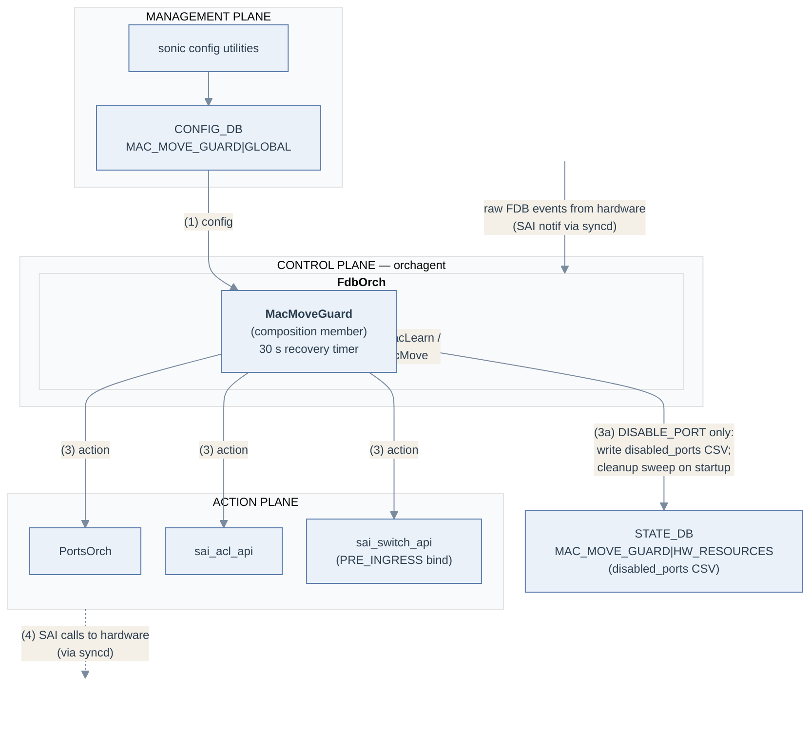
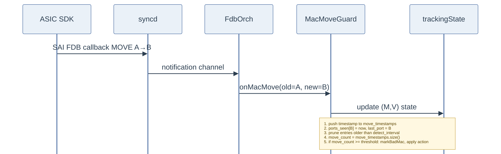
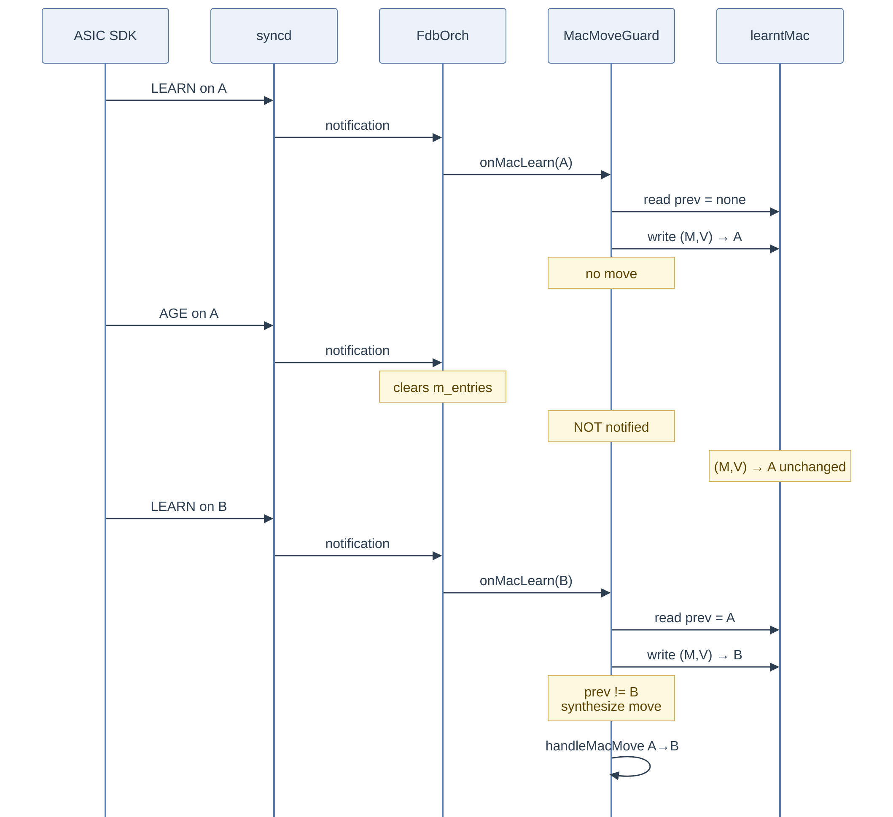
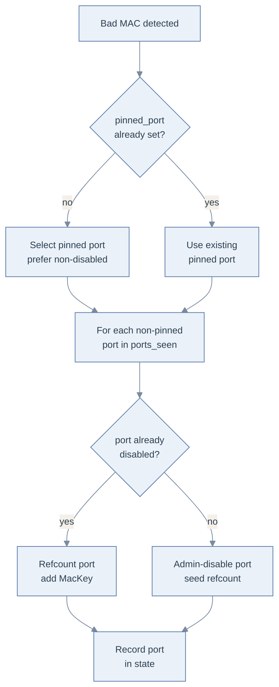
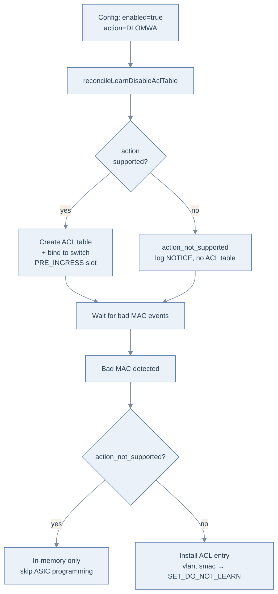
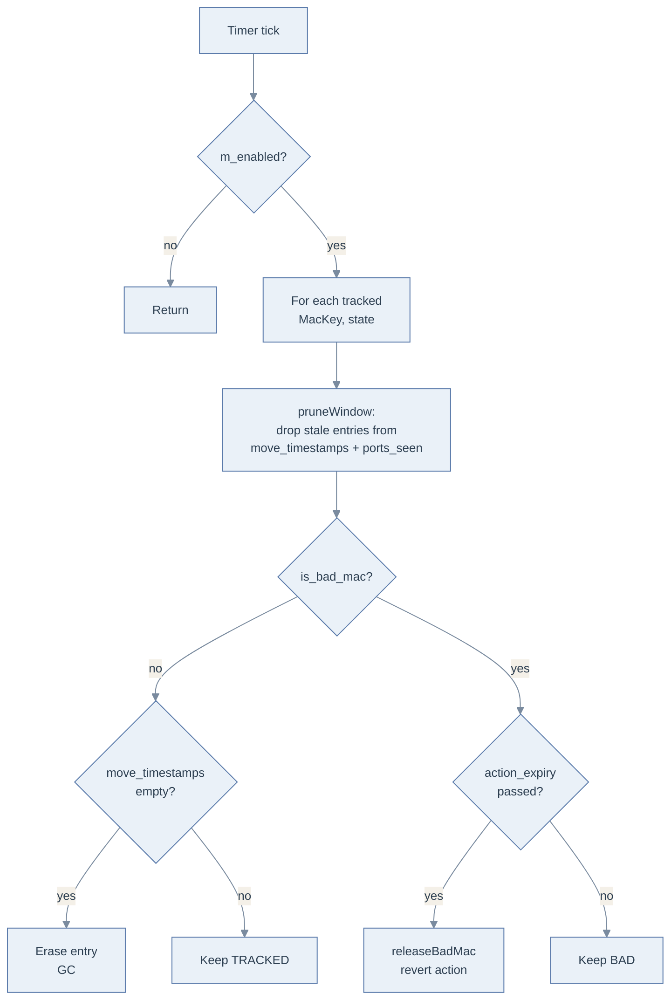
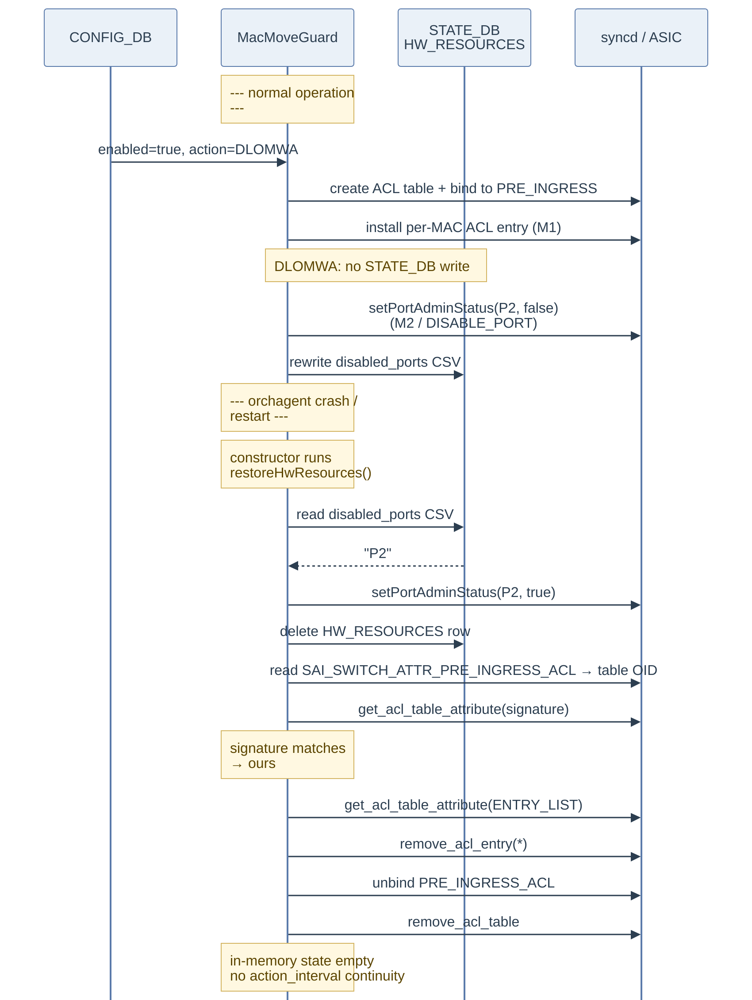

# SONiC MAC Move Guard High Level Design

## Table of Contents

- [1. Revision](#1-revision)
- [2. Scope](#2-scope)
- [3. Definitions/Abbreviations](#3-definitionsabbreviations)
- [4. Overview](#4-overview)
  - [4.1 Detection](#41-detection)
  - [4.2 Mitigation actions](#42-mitigation-actions)
  - [4.3 Mitigation duration](#43-mitigation-duration)
- [5. Requirements](#5-requirements)
- [6. Module Design](#6-module-design)
  - [6.1 Overall design](#61-overall-design)
  - [6.2 Configuration and control flow](#62-configuration-and-control-flow)
    - [6.2.1 Detection: native SAI MAC move](#621-detection-native-sai-mac-move)
    - [6.2.2 Detection: synthesized move from AGED + LEARNED](#622-detection-synthesized-move-from-aged--learned)
    - [6.2.3 Mitigation: DISABLE_PORT](#623-mitigation-disable_port)
    - [6.2.4 Mitigation: DISABLE_LEARN_ON_MAC_WITH_ACL](#624-mitigation-disable_learn_on_mac_with_acl)
    - [6.2.5 Recovery](#625-recovery)
    - [6.2.6 Orchagent restart handling](#626-orchagent-restart-handling)
  - [6.3 Data structures](#63-data-structures)
  - [6.4 SWSS and syncd changes](#64-swss-and-syncd-changes)
  - [6.5 Interaction with Notification Dedup](#65-interaction-with-notification-dedup)
- [7. Configuration and Management](#7-configuration-and-management)
  - [7.1 CONFIG_DB](#71-config_db)
  - [7.2 DB and Schema changes](#72-db-and-schema-changes)
  - [7.3 YANG model](#73-yang-model)
  - [7.4 CLI examples](#74-cli-examples)
- [8. Warmboot](#8-warmboot)
- [9. Memory Consumption](#9-memory-consumption)
- [10. Restrictions/Limitations](#10-restrictionslimitations)
- [11. Testing Requirements](#11-testing-requirements)
  - [11.1 Unit tests (one-liners)](#111-unit-tests-one-liners)
  - [11.2 System tests](#112-system-tests)
- [12. Open/Action items](#12-openaction-items)

## 1. Revision
Rev | Date | Author | Change Description
----|------|--------|-------------------
|v0.1|2026-05-25|Sudheer Y R(Nexthop)|Initial version of MAC Move Guard HLD
|v0.2|2026-05-27|Sudheer Y R(Nexthop)|Folded MacMoveGuardOrch into FdbOrch as a composition member; simplified orchagent-restart handling to a cleanup-on-startup sweep with minimal STATE_DB footprint

## 2. Scope
This document describes the high level design of the MAC Move Guard feature in SONiC. MAC Move Guard detects abnormally high rates of MAC address moves between Layer-2 ports within a VLAN/bridge domain and applies a configurable mitigation action against the offending MAC, for a period of configured interval. The feature is implemented entirely inside `orchagent` as a new helper class `MacMoveGuard` that lives in [`macmoveguard.{h,cpp}`](orchagent/macmoveguard.h) and is owned by `FdbOrch` via composition. `FdbOrch` calls into the guard inline when it emits MAC learn/move updates; the guard drives `PortsOrch` / `sai_acl_api` / `sai_switch_api` to apply mitigation.

## 3. Definitions/Abbreviations
Definitions/Abbreviation|Description
------------------------|-----------
MAC Move | An FDB event where a previously-learned MAC address is re-learned on a different bridge port within the same VLAN
Bad MAC | A (VLAN, MAC) whose number of moves within `detect_interval` has exceeded the configured `threshold`
Pinned port | The one port to which a bad MAC stays anchored under the `DISABLE_PORT` action; all other ports the MAC was bouncing on are admin-disabled
Detect interval | Sliding window (seconds) over which moves are counted
Action interval | Time (seconds) the mitigation action stays in effect before recovery
`bv_id` | SAI bridge-vlan OID identifying the L2 broadcast domain a MAC belongs to
`MacKey` | Tuple of (`MacAddress`, `bv_id`) — uniquely identifies a tracked MAC
FDB | Forwarding DataBase (the bridge MAC address table)
SAI | Switch Abstraction Interface
FSM | Finite State Machine

## 4. Overview
In a stable L2 network, a host's MAC is normally seen on a single bridge port. Pathological conditions — L2 forwarding loops, a misbehaving host, or a duplicated MAC across two endpoints — cause the same MAC to bounce between two or more ports at very high rates. The data plane "MAC move storm" that results is harmful in several ways: the CPU is saturated by FDB notifications, forwarding to the affected MAC becomes effectively random because the FDB entry is overwritten constantly, and it can mask the real source of the problem by spreading the impact across many ports.

MAC Move Guard provides a contained, automatic mitigation that is split into: detection and mitigation for a user specified amount of time.

### 4.1 Detection
Per (VLAN, MAC), the orchestrator maintains a sliding window of move timestamps. On each move event it prunes entries older than `detect_interval` and re-derives the move count. When the count exceeds `threshold`, the MAC enters the **Bad MAC** state.

Two FDB-event paths feed detection:
1. **Native** SAI MAC move (`SAI_FDB_EVENT_MOVE`) is delivered as-is: `FdbOrch` calls `m_macMoveGuard->onMacMove(...)` with both old and new ports.
2. **Synthesized** move — for SDKs that only emit `AGED` then `LEARNED` instead of a native MOVE, the guard reconstructs the MOVE from a residual cache entry on the LEARN path (`FdbOrch` calls `m_macMoveGuard->onMacLearn(...)` for every learn event).

### 4.2 Mitigation actions
Two mitigation actions are supported. They are mutually exclusive — only one is in effect at a time, configured by the `action` field in CONFIG_DB.

SAI Action | Effect on the bad MAC
-----------|----------------------
`DISABLE_PORT` | Pin the MAC to one selected port; admin-disable every other port it was bouncing on
`DISABLE_LEARN_ON_MAC_WITH_ACL` | Install a pre-ingress ACL entry matching `(vlan, smac)` with `SAI_ACL_ACTION_TYPE_SET_DO_NOT_LEARN` so the bad MAC stops being (re)learned while forwarding continues via the existing FDB entry

If the orchestrator cannot program `DISABLE_LEARN_ON_MAC_WITH_ACL`, it is flagged `action_not_supported`: configuration is still accepted and bad MACs are still tracked in memory, but no ACL table or entry is programmed. The DLOMWA action writes nothing to STATE_DB regardless of platform support.

### 4.3 Mitigation duration
A `SelectableTimer` fires every 30 s. For every bad MAC whose `action_expiry_time` has passed, the guard reverses the action that was applied (re-enable the port for `DISABLE_PORT`, remove the per-MAC ACL entry for `DISABLE_LEARN_ON_MAC_WITH_ACL`). Action state is reference-counted, so a shared target (e.g. a port disabled because two bad MACs were both bouncing on it) is reverted only when the last bad MAC releases it. The `action_interval` countdown lives only in memory — if `orchagent` restarts mid-interval, the guard does not attempt to resume the countdown. Instead it reverts any hardware state it left behind on startup (see [§6.2.6](#626-orchagent-restart-handling)); if the offending MAC is still flapping, it will re-trip the threshold and the mitigation will be re-applied.

## 5. Requirements
### Phase-1: Local MAC move support
- Detect MAC moves on a per (VLAN, MAC) basis using a sliding-window threshold
- Support two mitigation actions: `DISABLE_PORT` and `DISABLE_LEARN_ON_MAC_WITH_ACL`
- Mitigation stays for a configurable action interval
- CONFIG_DB-driven configuration via a single `GLOBAL` row, validated by a new YANG model
- On `orchagent` restart, revert any hardware state left behind from a previous run (admin-disabled ports and the pre-ingress ACL table) so it does not leak; the in-flight `action_interval` is not preserved across the restart
- Flag `DISABLE_LEARN_ON_MAC_WITH_ACL` as `action_not_supported` when it cannot be programmed; continue to track bad MACs but skip ACL programming

### Phase-2: EVPN MAC move support
- Detect EVPN-driven MAC mobility in addition to local data-plane moves, and apply the same mitigation actions

## 6. Module Design
### 6.1 Overall design
- Management framework writes the `MAC_MOVE_GUARD|GLOBAL` row to CONFIG_DB using the YANG model in [§7.3](#73-yang-model)
- `MacMoveGuard` is owned by `FdbOrch` via composition (`std::unique_ptr<MacMoveGuard> m_macMoveGuard`). It registers its `MAC_MOVE_GUARD` config-table `Consumer` and its recovery `SelectableTimer` with `FdbOrch`'s executor list; `FdbOrch::doTask(Consumer&)` and `FdbOrch::doTask(SelectableTimer&)` route those tasks back to the guard
- `FdbOrch` invokes `m_macMoveGuard->onMacLearn(...)` and `onMacMove(...)` inline as part of emitting MAC-update notifications — there is no observer indirection
- Mitigation is applied by calling `PortsOrch::setPortAdminStatusByAlias()` (for `DISABLE_PORT`) and `sai_acl_api` directly (for `DISABLE_LEARN_ON_MAC_WITH_ACL`, which uses a single pre-ingress ACL table bound to `SAI_SWITCH_ATTR_PRE_INGRESS_ACL`)
- Only the `DISABLE_PORT` action leaves a STATE_DB footprint: a single row (`MAC_MOVE_GUARD|HW_RESOURCES`) holding a CSV of admin-disabled port aliases. DLOMWA writes nothing — its pre-ingress ACL table is rediscovered on restart by signature-matching the table bound to `SAI_SWITCH_ATTR_PRE_INGRESS_ACL`. The guard's constructor runs a one-shot cleanup sweep that reverts any such hardware state (see [§6.2.6](#626-orchagent-restart-handling))
- A 30 s `SelectableTimer` is used to apply the mitigation action for the configured duration, and to manage the MAC state
- syncd / SAI: no changes

The picture below groups the relationships by *role*. The numbered arrows describe the lifetime of one bad-MAC episode.



`MacMoveGuard` holds:
- maps: `m_macTrackingState`, `m_disabledPorts`, `m_learntMac`
- ACL state: `m_learnDisableAclTable`, `m_learnDisableAclEntryCount`, `m_aclSetDoNotLearnSupported`
- STATE_DB handle: `m_stateTable` (`MAC_MOVE_GUARD` table, used only for the single `HW_RESOURCES` row holding the disabled-ports CSV)
- timer: `m_recoveryTimer` (30 s) — owned by an `ExecutableTimer` registered on the parent `FdbOrch`
- public entrypoints called from `FdbOrch`: `onMacLearn()`, `onMacMove()`, `doConfigTask()`, `doRecoveryTimerTask()`
- internal handlers: `handleMacLearn()`, `handleMacMove()`, `checkRecovery()`, `restoreHwResources()`

**Numbered flows (one bad-MAC episode):**
1) Administrator writes `MAC_MOVE_GUARD|GLOBAL` to CONFIG_DB; the executor that `MacMoveGuard` registered on `FdbOrch` drains the consumer, `FdbOrch::doTask(Consumer&)` recognises the `MAC_MOVE_GUARD` table name and forwards it to `m_macMoveGuard->doConfigTask()`; on `action=DISABLE_LEARN_ON_MAC_WITH_ACL` the guard reconciles the pre-ingress ACL table lifecycle
2) FDB events originate in the ASIC; the SDK invokes the SAI FDB-event callback registered by `syncd`, which forwards the event on the swss notification channel where `FdbOrch::handleSaiFdbEvent()` consumes it. For learn and move events, `FdbOrch` calls `m_macMoveGuard->onMacLearn()` / `onMacMove()` inline
3) On threshold breach `MacMoveGuard` either calls `PortsOrch::setPortAdminStatusByAlias()` (`DISABLE_PORT`) or installs a per-MAC pre-ingress ACL entry via `sai_acl_api` (`DISABLE_LEARN_ON_MAC_WITH_ACL`); for `DISABLE_PORT` the updated set of admin-disabled ports is rewritten to the single STATE_DB row (3a). DLOMWA writes nothing to STATE_DB
4) These SAI calls reach the hardware via `syncd` and reshape what the SDK will emit next: a disabled port emits no further LEARNs; a MAC matched by a `SET_DO_NOT_LEARN` ACL entry stops being (re)learned while existing forwarding continues

**Recovery timer (out-of-band).** A 30-second `SelectableTimer` registered by `MacMoveGuard` on its parent `FdbOrch` drives `checkRecovery()` (via `FdbOrch::doTask(SelectableTimer&)` → `m_macMoveGuard->doRecoveryTimerTask()`). On each tick the guard iterates `m_macTrackingState`, prunes each MAC's sliding window, garbage-collects quiet non-bad MACs from the map, and for any bad MAC whose `action_expiry_time` has elapsed invokes `releaseBadMac()` to revert the applied SAI action. The timer is not on the data path — it is purely housekeeping.

### 6.2 Configuration and control flow

#### 6.2.1 Detection: native SAI MAC move
The SDK does **not** call `FdbOrch` directly. FDB events originate in the ASIC; the SDK invokes the SAI FDB-event callback that `syncd` registered at boot. `syncd` forwards the event onto the swss notification channel, where `FdbOrch::handleSaiFdbEvent()` decodes it. For a native MOVE event, `FdbOrch` calls `m_macMoveGuard->onMacMove(...)` inline with both old and new ports, and `MacMoveGuard::handleMacMove()` processes it:

<div align="center">



</div>

1) ASIC SDK invokes the SAI FDB-event callback for `SAI_FDB_EVENT_MOVE`; `syncd` posts the event onto the swss notification channel
2) `FdbOrch::handleSaiFdbEvent()` consumes the notification and calls `m_macMoveGuard->onMacMove(...)` inline
3) `MacMoveGuard::handleMacMove()` updates `m_macTrackingState[(M,V)]`: pushes the move timestamp, records the new port in `ports_seen` / `last_port`, prunes entries older than `detect_interval`, recomputes `move_count`, and if it reaches `threshold` calls `markBadMac()` to apply the configured action

#### 6.2.2 Detection: synthesized move from AGED + LEARNED
Some SDKs report a port change as `AGED` on the old port followed by `LEARNED` on the new port, with no native MOVE. The guard never erases `m_learntMac` on AGE; that residual entry is what allows a later LEARN on a different port to be recognized as a move.

<div align="center">



</div>

1) First `LEARN` on `A`: `handleMacLearn()` finds `m_learntMac[(M,V)]` empty, sets it to `A`, returns (not a move)
2) `AGE` on `A`: `MacMoveGuard` is **not** invoked on AGE; `m_learntMac[(M,V)] = A` is intentionally retained
3) Subsequent `LEARN` on `B`: `handleMacLearn()` reads `prev = A`, writes `B`, and synthesizes a `MacMoveNotification{old:A, new:B}` which it forwards to `handleMacMove()` — joining the same code path as the native MOVE in [§6.2.1](#621-detection-native-sai-mac-move)

#### 6.2.3 Mitigation: DISABLE_PORT
The MAC is pinned to one port; all other ports it appeared on within the detection window are admin-disabled. Port disable is reference-counted so a port shared by multiple bad MACs is only re-enabled when the last bad MAC is released.

<div align="center">



</div>

1) Administrator configures `action=DISABLE_PORT` in `MAC_MOVE_GUARD|GLOBAL`
2) On threshold breach, `markBadMac()` selects a pinned port — preferring a port not currently disabled by any other bad MAC (to maximize ports kept UP)
3) Every other port the MAC was just bouncing on is admin-disabled via `PortsOrch::setPortAdminStatusByAlias(port, false)`
4) `m_disabledPorts[port].insert(MacKey)` adds the bad MAC to the port's reference set; the SAI admin-down call is issued only on the first insertion
5) On recovery (`action_expiry_time` reached), `releaseBadMac()` decrements each port's ref-count and re-enables ports whose count reaches zero

#### 6.2.4 Mitigation: DISABLE_LEARN_ON_MAC_WITH_ACL
The orchestrator suppresses re-learning of the bad MAC by installing a per-MAC pre-ingress ACL entry that matches `(vlan, smac)` and applies `SAI_ACL_ACTION_TYPE_SET_DO_NOT_LEARN`. The existing FDB entry continues to forward traffic to/from the MAC; only the FDB churn source — repeated LEARN events on alternating ports — is gated.

A **single ACL table** at the `PRE_INGRESS` stage holds one entry per bad MAC. Its lifecycle is tied strictly to CONFIG_DB: the table is created when the feature is enabled with `action=DISABLE_LEARN_ON_MAC_WITH_ACL` and destroyed when the configuration leaves that state. The table is bound directly to `SAI_SWITCH_ATTR_PRE_INGRESS_ACL` (SwitchOrch's bind helper does not cover the PRE_INGRESS stage).

Compared with `DISABLE_PORT`, this action is **non-disruptive to in-flight forwarding**: the port stays admin-up, existing FDB entries continue to forward, only the offender's relearn is silenced.

<div align="center">



</div>

1) Administrator configures `enabled=true, action=DISABLE_LEARN_ON_MAC_WITH_ACL` in `MAC_MOVE_GUARD|GLOBAL`
2) `doConfigTask` snapshots the previous `(enabled, action)` and calls `reconcileLearnDisableAclTable()`. On a transition **into** `(enabled, DLOMWA)` the guard creates the pre-ingress ACL table and binds it to `SAI_SWITCH_ATTR_PRE_INGRESS_ACL`. If the action cannot be programmed it is flagged `action_not_supported` (NOTICE log, no table created). On a transition **out of** `(enabled, DLOMWA)` (action change or disable), every installed entry is removed and the table is destroyed
3) On threshold breach, `markBadMac()` installs one entry per bad MAC into the ACL table (skipped silently when the action is `action_not_supported` and no table exists); `state.learn_disable_acl_entry_id` is recorded and `m_learnDisableAclEntryCount` is incremented
4) Nothing is written to STATE_DB. The ACL table + entries live only in the ASIC; the in-memory bookkeeping (`m_learnDisableAclTable`, per-MAC entry OIDs, refcount) is enough to revert during normal operation. After an `orchagent` restart the in-memory state is lost, and the cleanup sweep ([§6.2.6](#626-orchagent-restart-handling)) re-discovers the table by signature-matching whatever is bound to `SAI_SWITCH_ATTR_PRE_INGRESS_ACL` and tears it down wholesale
5) On recovery, `releaseBadMac()` removes the ACL entry and decrements `m_learnDisableAclEntryCount`. The ACL table is **not** torn down per-entry; it stays for the lifetime of the configuration

#### 6.2.5 Recovery
A 30 s `SelectableTimer` drives `checkRecovery()`. For each bad MAC whose `action_expiry_time` has elapsed, `releaseBadMac()` dispatches on the configured action and reverts the SAI state. Non-bad MACs whose `move_timestamps` deque is empty (i.e. no moves in the last detection window) are garbage-collected.

<div align="center">



</div>

1) Timer fires every `RECOVERY_CHECK_INTERVAL_SECS` (30 s)
2) If the feature is disabled, return immediately
3) For each tracked MAC, prune the sliding window first to keep `move_count` and `ports_seen` current
4) For non-bad MACs whose `move_timestamps` deque is now empty, erase the tracking entry (memory GC)
5) For bad MACs whose `action_expiry_time` has passed, call `releaseBadMac()` to revert the action and transition the MAC back to TRACKED

#### 6.2.6 Orchagent restart handling
A bad MAC's mitigation is in effect for the configured `action_interval` (default 600 s, max 24 h). If `orchagent` restarts during that interval, two pieces of hardware state can survive in the ASIC:

- For `DISABLE_PORT`: `SAI_PORT_ATTR_ADMIN_STATE=false` written via `PortsOrch::setPortAdminStatusByAlias()` stays applied in the ASIC.
- For `DISABLE_LEARN_ON_MAC_WITH_ACL`: the pre-ingress ACL table, its switch binding, and every per-MAC entry survive in the ASIC because they were written through `syncd`.

If these were left alone they would leak: the disabled ports would stay down forever and the orphaned ACL entries would silently keep suppressing learning. To prevent the leak the guard runs a **one-shot cleanup sweep** in its constructor (`restoreHwResources()`) that reverts both kinds of hardware state. There is no replay of in-memory bad-MAC tracking and no attempt to preserve the `action_interval` countdown — the trade-off is that a still-flapping MAC will re-trip the threshold after the restart and the mitigation will be re-applied.

**Cleanup sweep, step by step:**

1. **DISABLE_PORT** — read the single STATE_DB row `MAC_MOVE_GUARD|HW_RESOURCES`. Its `disabled_ports` field is a comma-separated list of port aliases the guard admin-disabled in the previous run. Re-enable each via `PortsOrch::setPortAdminStatusByAlias(port, true)` and then delete the row.
2. **DISABLE_LEARN_ON_MAC_WITH_ACL** — read `SAI_SWITCH_ATTR_PRE_INGRESS_ACL`. If non-null, fetch the bound table's attributes via `sai_acl_api->get_acl_table_attribute()` and check the **signature**: `SAI_ACL_TABLE_ATTR_ACL_STAGE == SAI_ACL_STAGE_PRE_INGRESS`, `SAI_ACL_TABLE_ATTR_FIELD_SRC_MAC == true`, `SAI_ACL_TABLE_ATTR_FIELD_OUTER_VLAN_ID == true`, and `SAI_ACL_TABLE_ATTR_ACL_ACTION_TYPE_LIST == [SAI_ACL_ACTION_TYPE_SET_DO_NOT_LEARN]`. If all four match, treat it as ours, enumerate the table's entries via `SAI_ACL_TABLE_ATTR_ENTRY_LIST`, delete each entry, unbind the switch attr, and delete the table. If the signature does not match, leave the table alone — another feature owns it.

After the sweep the guard starts with empty `m_macTrackingState`, empty `m_disabledPorts`, and `m_learnDisableAclTable == SAI_NULL_OBJECT_ID`. Normal CONFIG_DB processing then proceeds — if `action=DISABLE_LEARN_ON_MAC_WITH_ACL` is configured, `reconcileLearnDisableAclTable()` will create a fresh table and bind it; per-MAC entries are installed when MACs subsequently trip the threshold.

The single STATE_DB row used by the cleanup sweep:

Field | Used by | Purpose
------|---------|--------
`disabled_ports` | `DISABLE_PORT` | Comma-separated alias list of currently admin-disabled ports. Rewritten on every `markBadMac()` / `releaseBadMac()` that adds or removes a port. Absent (row deleted) when no ports are guard-disabled.

DLOMWA writes nothing to STATE_DB; the cleanup sweep rediscovers its table by ASIC-side signature match.

<div align="center">



</div>

Edge cases and invariants:

- **Foreign pre-ingress ACL table**: if a different feature has bound a table to the pre-ingress slot, its signature will not match ours and the cleanup sweep leaves it alone. (The guard's normal-path `ensureLearnDisableAclTable()` also refuses to overwrite a non-null binding, so the two features cannot coexist on the pre-ingress slot regardless.)
- **Stale rows from an older schema**: STATE_DB rows written by the previous (per-bad-MAC) schema have keys other than `HW_RESOURCES`; the cleanup sweep ignores them. They are not actively cleaned, but they are not consulted either.
- **Feature disabled across restart**: the cleanup sweep runs unconditionally in the constructor before CONFIG_DB is processed, so disabled ports are re-enabled and the stale ACL table is torn down regardless of what CONFIG_DB now says. There is no need for `clearAllState()` to do any post-restart work.

### 6.3 Data structures

```c++
struct MacKey {
    MacAddress mac;
    sai_object_id_t bv_id;       // SAI bridge-vlan OID
};

// Hash functor for MacKey, used by std::unordered_map. Packs the 6 MAC bytes
// into a uint64 and combines with bv_id using a boost-style mixing step.
struct MacKeyHash {
    std::size_t operator()(const MacKey &k) const noexcept;
};

struct MacMoveTrackingState {
    std::deque<steady_clock::time_point> move_timestamps;
    std::map<std::string, steady_clock::time_point> ports_seen;
    size_t move_count = 0;
    bool is_bad_mac = false;
    MacMoveGuardAction action = MacMoveGuardAction::DISABLE_PORT;       // sticky: action used when this MAC was marked bad
    steady_clock::time_point action_expiry_time;
    std::string pinned_port;                                            // DISABLE_PORT
    std::set<std::string> disabled_ports;                               // DISABLE_PORT
    std::string last_port;
    sai_object_id_t learn_disable_acl_entry_id = SAI_NULL_OBJECT_ID;    // DISABLE_LEARN_ON_MAC_WITH_ACL
};

struct LearntMacEntry {
    std::string port;
    steady_clock::time_point last_seen;     // for pruning stale entries
};
```

Per-orch maps:

Map | Type | Purpose
----|------|--------
`m_macTrackingState` | `std::map<MacKey, MacMoveTrackingState>`                            | Per-MAC sliding window + bad-MAC state
`m_disabledPorts`    | `std::map<std::string, std::set<MacKey>>`                           | Reference count for `DISABLE_PORT`: port alias → bad MACs holding it down
`m_learntMac`        | `std::unordered_map<MacKey, LearntMacEntry, MacKeyHash>`            | Last-known port per (VLAN, MAC); used to synthesize MOVE from AGED+LEARNED SDKs (see [§6.2.2](#622-detection-synthesized-move-from-aged--learned)). Pruned by `pruneLearntMacCache()` after one detection window of silence

`DISABLE_LEARN_ON_MAC_WITH_ACL` state (one per orch instance):

Field | Type | Purpose
------|------|--------
`m_learnDisableAclTable`       | `sai_object_id_t` | OID of the pre-ingress ACL table; `SAI_NULL_OBJECT_ID` when the action is not configured or is `action_not_supported`
`m_learnDisableAclEntryCount`  | `size_t`          | Number of installed per-MAC entries; used as a safety guard before destroying the table
`m_aclSetDoNotLearnSupported`  | `int`             | Cached `action_not_supported` flag (−1 not queried, 0 not supported, 1 supported)

STATE_DB handle:

Field | Type | Purpose
------|------|--------
`m_stateTable` | `unique_ptr<swss::Table>` | `MAC_MOVE_GUARD` table in STATE_DB. Used only to write a single row keyed `HW_RESOURCES` with a `disabled_ports` CSV (rewritten when the set of admin-disabled ports changes, deleted when empty). The constructor calls `restoreHwResources()` once to revert any leftover hardware state (see [§6.2.6](#626-orchagent-restart-handling))

### 6.4 SWSS and syncd changes
- `MacMoveGuard` (new) added in [`orchagent/macmoveguard.{h,cpp}`](orchagent/macmoveguard.h). It is owned by `FdbOrch` via composition (`std::unique_ptr<MacMoveGuard> m_macMoveGuard`); it does not inherit from `Orch` or `Observer`. It registers its `MAC_MOVE_GUARD` config-table `Consumer` and recovery `SelectableTimer` with the parent `FdbOrch`'s executor list (via `Orch::addExecutor`, reached through a `friend class MacMoveGuard;` declaration on `FdbOrch`)
- `FdbOrch` constructor takes one new required parameter (`DBConnector* configDb`) so it can construct the guard; it is wired in [`orchdaemon.cpp`](orchagent/orchdaemon.cpp) where `gFdbOrch` is built. STATE_DB access reuses the existing `TableConnector` already passed to `FdbOrch`. `FdbOrch::doTask(Consumer&)` and `FdbOrch::doTask(SelectableTimer&)` route the guard's tasks back via `m_macMoveGuard->doConfigTask()` / `doRecoveryTimerTask()`. `FdbOrch`'s `SAI_FDB_EVENT_LEARNED` / `SAI_FDB_EVENT_MOVE` handlers call `m_macMoveGuard->onMacLearn(...)` / `onMacMove(...)` inline. The previous standalone `MacMoveGuardOrch` Orch and the `SUBJECT_TYPE_MAC_LEARN` / `SUBJECT_TYPE_MAC_MOVE` observer subjects are removed
- STATE_DB: new `MAC_MOVE_GUARD` table, at most one row (`HW_RESOURCES`) holding a `disabled_ports` CSV; absent when no ports are guard-disabled. Schema documented in [§7.2](#72-db-and-schema-changes)
- syncd / SAI: no changes

### 6.5 Interaction with Notification Dedup
A separate SONiC effort ([sonic-net/SONiC#2334](https://github.com/sonic-net/SONiC/pull/2334)) introduces a Notification Dedup mechanism that coalesces repeated SAI notifications — including FDB events — at the syncd / swss layer and publishes aggregated counters for the dedup'd events. When that feature is deployed alongside MAC Move Guard, the two form a layered defence:

- Notification Dedup absorbs the storm at the notification layer: repeated FDB events for the same `(VLAN, MAC)` are collapsed, lowering control-plane CPU during a MAC-move storm.
- MAC Move Guard reacts to the dedup'd event stream; once `threshold` is crossed, its mitigation action (port admin-down or `SET_DO_NOT_LEARN` ACL) halts the data-plane source of the storm. With the source quieted, the dedup counter rate falls to zero on its own.

**Tuning recommendation.** With Notification Dedup enabled, the per-MAC event rate that reaches `FdbOrch` (and therefore the guard) is a coalesced count, not the raw hardware rate. The operator should configure a **lower `threshold` over a larger `detect_interval`** in this case — for example `threshold ≈ 50` with `detect_interval ≈ 10s` instead of the defaults. The lower per-window count is appropriate because each surviving event already represents many hardware-level events. The longer window gives Notification Dedup a representative aggregate to act on. The net effect is that MMG trips earlier on a representative sample of the storm and applies mitigation at the hardware level *before* the storm has had time to broaden — which is precisely what minimizes both control-plane load and forwarding disruption. The exact values depend on the dedup window and counter semantics defined in the Notification Dedup HLD.

## 7. Configuration and Management
### 7.1 CONFIG_DB
Configure MAC Move Guard by creating the single `MAC_MOVE_GUARD|GLOBAL` row:
```
"MAC_MOVE_GUARD": {
  "GLOBAL": {
    "enabled": "true",
    "threshold": "1000",
    "detect_interval": "5",
    "action_interval": "600",
    "action": "DISABLE_PORT"
  }
}
```

### 7.2 DB and Schema changes

```
; Defines schema for MAC Move Guard configuration attributes
key                 = MAC_MOVE_GUARD:GLOBAL          ; only the GLOBAL key is permitted
; field             = value
ENABLED             = "true" / "false"               ; default false
THRESHOLD           = 1*10DIGIT                      ; max moves in detect_interval (default 1000)
DETECT_INTERVAL     = 1*4DIGIT                       ; seconds, 1..3600 (default 5)
ACTION_INTERVAL     = 1*5DIGIT                       ; seconds, 120..86400 (default 600)
ACTION              = action_value                   ; default DISABLE_PORT

; value annotations
action_value        = "DISABLE_PORT" / "DISABLE_LEARN_ON_MAC_WITH_ACL"
```

In addition, `MacMoveGuard` maintains a STATE_DB table used **only** for the cleanup-on-restart sweep (see [§6.2.6](#626-orchagent-restart-handling)). It holds at most a single row that records the ports currently admin-disabled by the guard. DLOMWA writes nothing — its pre-ingress ACL table is rediscovered on restart by signature-matching the table bound to `SAI_SWITCH_ATTR_PRE_INGRESS_ACL`. This table is written and read only by `orchagent` and is not part of the user-configurable surface:

```
; STATE_DB MAC_MOVE_GUARD table — at most one row, key fixed to HW_RESOURCES
key                 = MAC_MOVE_GUARD:HW_RESOURCES
; field             = value
disabled_ports      = port_alias *("," port_alias)        ; comma-separated; field/row absent when empty
```

> Note: Refer to swss-schema.md for general BNF conventions used across SONiC documents.

### 7.3 YANG model
The CONFIG_DB schema is backed by a YANG module added under `src/sonic-yang-models/yang-models/sonic-mac-move-guard.yang`.

```yang
module sonic-mac-move-guard {

    yang-version 1.1;

    namespace "http://github.com/sonic-net/sonic-mac-move-guard";
    prefix mmg;

    organization
        "SONiC";

    contact
        "SONiC";

    description
        "MAC Move Guard - detect and mitigate excessive (VLAN, MAC)
         moves on the local FDB.";

    revision 2026-05-15 {
        description "Initial revision.";
    }

    typedef mac-move-guard-action {
        type enumeration {
            enum DISABLE_PORT;
            enum DISABLE_LEARN_ON_MAC_WITH_ACL;
        }
        default DISABLE_PORT;
    }

    container sonic-mac-move-guard {

        container MAC_MOVE_GUARD {

            description
                "MAC Move Guard configuration.
                 Only the GLOBAL key is permitted.";

            list MAC_MOVE_GUARD_LIST {
                key "name";
                max-elements 1;

                leaf name {
                    type enumeration { enum GLOBAL; }
                }

                leaf enabled {
                    type boolean;
                    default false;
                }

                leaf threshold {
                    type uint32 { range "1..max"; }
                    default 1000;
                }

                leaf detect_interval {
                    type uint32 { range "1..3600"; }
                    units "seconds";
                    default 5;
                }

                leaf action_interval {
                    type uint32 { range "120..86400"; }
                    units "seconds";
                    default 600;
                }

                leaf action {
                    type mac-move-guard-action;
                    default DISABLE_PORT;
                }
            }
        }
    }
}
```

Notes:
- `max-elements 1` enforces the "only `GLOBAL`" constraint, mirroring the orch's runtime check
- Range constraints keep sonic config utilities from accepting nonsensical values such as zero or negative seconds
- Defaults are aligned with the orch's in-class defaults (`m_threshold = 1000`, `m_durationSeconds = 5`, `m_recoverySeconds = 600`, `m_action = DISABLE_PORT`)
- Adding a new action means adding an `enum` value to `mac-move-guard-action` and a `case` in `MacMoveGuard::doConfigTask()`

### 7.4 CLI examples
No new CLI commands are introduced. Configuration is applied through sonic config utilities, which validate the input against the YANG model in [§7.3](#73-yang-model) before writing CONFIG_DB.

Enable with the port-shut action:
```bash
cat <<'EOF' > /tmp/mac-move-guard.json
{
    "MAC_MOVE_GUARD": {
        "GLOBAL": {
            "enabled": "true",
            "threshold": "5000",
            "detect_interval": "5",
            "action_interval": "120",
            "action": "DISABLE_PORT"
        }
    }
}
EOF
sonic-cfggen -j /tmp/mac-move-guard.json --write-to-db
```

Switch to per-MAC learn-disable via pre-ingress ACL (non-disruptive to forwarding; flagged `action_not_supported` when the action cannot be programmed):
```bash
sonic-cfggen -a '{"MAC_MOVE_GUARD": {"GLOBAL": {"action": "DISABLE_LEARN_ON_MAC_WITH_ACL"}}}' --write-to-db
```

Disable the feature (reverts every in-flight action):
```bash
sonic-cfggen -a '{"MAC_MOVE_GUARD": {"GLOBAL": {"enabled": "false"}}}' --write-to-db
```

Persist across reboot:
```bash
config save -y
```

Operational visibility is provided through orchagent syslog at NOTICE level, including bad-MAC detection, port admin-down/up transitions, ACL table/entry creation and removal for `DISABLE_LEARN_ON_MAC_WITH_ACL`, `action_not_supported` reporting, restart cleanup actions (port re-enable, stale ACL table tear-down), and action-interval expiry.

## 8. Warmboot
- Warmboot is not supported
- `orchagent` restart is supported via a one-shot cleanup sweep: any leftover hardware state from the previous run (admin-disabled ports listed in STATE_DB, plus the pre-ingress ACL table identified by signature match) is reverted in the `MacMoveGuard` constructor. The `action_interval` countdown is not preserved across the restart; a still-flapping MAC will re-trip the threshold and the mitigation will be re-applied (see [§6.2.6](#626-orchagent-restart-handling))

## 9. Memory Consumption
- Minimal control-plane state in orchagent
- `m_macTrackingState` and `m_learntMac` are bounded in steady state by the SDK's MAC-table size. Quiet MACs are garbage-collected from `m_macTrackingState` by `checkRecovery()` after one detection-interval of silence, and `m_learntMac` entries are pruned by `pruneLearntMacCache()` on the same schedule
- `m_disabledPorts` and the per-bad-MAC ACL entry count (`m_learnDisableAclEntryCount`) are bounded by the number of bad MACs currently in effect
- STATE_DB footprint: at most a single row (`MAC_MOVE_GUARD|HW_RESOURCES`) with a `disabled_ports` CSV; zero rows when no ports are guard-disabled. DLOMWA leaves no STATE_DB footprint
- No growth when feature disabled

## 10. Restrictions/Limitations
- **`DISABLE_PORT` is disruptive.** Every port the bad MAC was bouncing on (except the pinned one) is admin-disabled; all unrelated traffic on those ports is dropped until the action interval expires
- **`DISABLE_LEARN_ON_MAC_WITH_ACL` scale is bounded by ACL entry capacity.** Each bad MAC consumes one entry in the pre-ingress ACL table. The maximum number of MACs that can be simultaneously disabled is therefore capped by the number of ACL entries the platform supports at the `PRE_INGRESS` stage (which is itself shared with any other PRE_INGRESS consumer). Beyond that cap, additional bad MACs cannot be programmed and the guard logs an ERROR
- **No `show` commands yet.** Operational visibility today is via orchagent syslog and STATE_DB inspection; a `show mac-move-guard` CLI is not provided
- **Warmboot is not supported** (see [§8](#8-warmboot))

## 11. Testing Requirements
### 11.1 Unit tests (one-liners)
The mock-based gtest suite lives at `sonic-swss:tests/mock_tests/macmoveguard/macmoveguard_ut.cpp`. It covers (at minimum):

1) Threshold trips at exactly N=`threshold` MOVE events within `detect_interval`; bad MAC FSM enters BAD_MAC
2) Threshold trips identically when moves are synthesized from alternating LEARN events on two ports for the same MAC
3) Sliding window: `threshold-1` moves, sleep > `detect_interval`, `threshold-1` more moves — MAC stays TRACKED
4) `DISABLE_PORT` pinning: with two bad MACs sharing two ports, exactly one port is admin-disabled and reference-counted correctly
5) `DISABLE_PORT` recovery: after `action_interval`, port is re-enabled; if a second bad MAC still requires it, the port stays down
6) `DISABLE_LEARN_ON_MAC_WITH_ACL` supported: enabling the feature with this action creates the ACL table and binds it to `SAI_SWITCH_ATTR_PRE_INGRESS_ACL`
7) `DISABLE_LEARN_ON_MAC_WITH_ACL` flagged `action_not_supported`: no ACL table is created, NOTICE is logged once, bad-MAC detection still runs in memory; nothing is written to STATE_DB
8) `DISABLE_LEARN_ON_MAC_WITH_ACL` entry lifecycle: on bad-MAC detection a per-MAC ACL entry is installed with `SET_DO_NOT_LEARN`; on recovery the entry is removed; the ACL table is not torn down until the action changes or the feature is disabled
9) Action transition: switching from `DISABLE_PORT` to `DISABLE_LEARN_ON_MAC_WITH_ACL` (and vice versa) tears down all entries created by the previous action's bad MACs and creates/destroys the ACL table accordingly via `reconcileLearnDisableAclTable()`
10) Feature disable cleanup: all disabled ports re-enabled, all ACL entries removed, ACL table destroyed and unbound from `SAI_SWITCH_ATTR_PRE_INGRESS_ACL`, the STATE_DB `HW_RESOURCES` row is dropped, all in-memory maps are cleared
11) GC of quiet MACs: after one detection interval of silence, tracking entry is erased
12) Config rejection: non-`GLOBAL` keys are dropped with WARN; bad `action` value falls back to `DISABLE_PORT` with WARN; invalid integer values logged at ERROR without crashing
13) YANG validation: sonic config utilities reject out-of-range `detect_interval`, invalid `action`, and non-`GLOBAL` keys before they reach CONFIG_DB
14) Restart cleanup — `DISABLE_PORT`: pre-populate `MAC_MOVE_GUARD|HW_RESOURCES` with a `disabled_ports` CSV and mark those ports admin-down in the SAI mock; constructing the guard re-enables each port, clears the STATE_DB row, and leaves all in-memory bad-MAC tracking empty
15) Restart cleanup — pre-ingress ACL table: pre-stage a bound pre-ingress ACL table with our signature (`stage=PRE_INGRESS`, `FIELD_SRC_MAC=true`, `FIELD_OUTER_VLAN_ID=true`, `action_list=[SET_DO_NOT_LEARN]`) and a few entries; constructing the guard enumerates the entry list, deletes each entry, unbinds the switch attr, and deletes the table
16) Restart cleanup — foreign ACL table left alone: a pre-ingress table whose signature does not match (e.g. different action type) is **not** touched
17) Restart cleanup — stale schema tolerance: a STATE_DB row left over from the older per-bad-MAC schema is ignored; the constructor does not throw and starts with empty in-memory state

### 11.2 System tests
System tests live under `sonic-mgmt:tests/fdb/`. Both tests below drive a PTF-side MAC-move storm that rotates a small pool of source MACs between two VLAN-member ports on the DUT so each MAC crosses the per-MAC threshold within the detect interval.

1) **DISABLE_PORT** — configure MAC Move Guard with `action=DISABLE_PORT` and a short action interval.
   - Start the storm on two VLAN-member ports; assert that exactly one of the two DUT-side ports transitions to oper-down within a generous timeout.
   - Stop the storm and assert the disabled port returns to oper-up after the action interval elapses.
   - Teardown: delete the CONFIG_DB row, force any guard-disabled port back to admin-up, and flush the FDB.

2) **DISABLE_LEARN_ON_MAC_WITH_ACL** — configure with `action=DISABLE_LEARN_ON_MAC_WITH_ACL` and a long action interval so the bad MAC cannot age out while assertions run. (DLOMWA leaves no STATE_DB footprint; verification is done entirely via ASIC_DB and syslog.)
   - Wait until the pre-ingress ACL table appears in ASIC_DB and `SAI_SWITCH_ATTR_PRE_INGRESS_ACL` points at it; capture the table OID. Verify the table has stage `SAI_ACL_STAGE_PRE_INGRESS`, match fields `SRC_MAC` and `OUTER_VLAN_ID` enabled, and `SAI_ACL_ACTION_TYPE_SET_DO_NOT_LEARN` in the action-type list.
   - Wait until at least one ACL entry whose `SAI_ACL_ENTRY_ATTR_TABLE_ID` points at that table OID appears in ASIC_DB. Parse the entry's `SAI_ACL_ENTRY_ATTR_FIELD_SRC_MAC` to extract the tracked MAC, and verify `SAI_ACL_ENTRY_ATTR_FIELD_OUTER_VLAN_ID` matches the storm VLAN and the entry has the `SET_DO_NOT_LEARN` action.
   - With the storm still running, disable rsyslog rate-limiting in the swss container, poll orchagent syslog for further "BAD MAC ... continues to move" lines for the tracked MAC, and require that no new matching line appears for a sustained quiescence window — proof that the ACL entry has taken effect.
   - Stop the storm, reapply CONFIG_DB with a short action interval, and assert that the ASIC_DB ACL entry is removed within the new interval plus a grace period.
   - Teardown: delete the CONFIG_DB row, restore rsyslog rate-limiting, remove the dedicated VLAN and its members, and flush the FDB.

## 12. Open/Action items
- `show mac-move-guard` CLI for operational visibility (bad MACs currently tracked, ports admin-disabled by the guard, installed ACL entries)
- **Support EVPN MAC moves.** Today the guard only sees local data-plane learning / move events delivered through `SAI_FDB_EVENT_LEARNED` / `SAI_FDB_EVENT_MOVE`. EVPN-driven MAC mobility is invisible to the guard. Extend detection to cover this path.
- **Drive detection off Notification Dedup counters.** Once Notification Dedup ([sonic-net/SONiC#2334](https://github.com/sonic-net/SONiC/pull/2334)) is in place, consume its aggregated counters (in place of, or in addition to, the raw SAI FDB event stream) so detection is based on the canonical dedup'd rate rather than each orch maintaining its own sliding window. See [§6.5](#65-interaction-with-notification-dedup).
