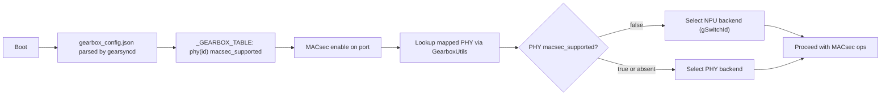

# SONiC HLD: Deterministic MACsec backend selection for gearbox ports

#### Rev 0.1

## Table of Content
- [Revision](#revision)
- [Scope](#scope)

- [Overview](#overview)
- [Requirements](#requirements)
- [High-Level Design](#high-level-design)
  - [Data Model](#data-model)
  - [Behavior](#behavior)
  - [Component Changes](#component-changes)
- [Configuration and management](#configuration-and-management)
- [Warmboot and Fastboot Design Impact](#warmboot-and-fastboot-design-impact)
- [Backward Compatibility](#backward-compatibility)
- [Testing Requirements/Design](#testing-requirementsdesign)

### Revision

| Rev | Date    | Author/s                                 | Change Description |
|:---:|:-------:|:----------------------------------------:|:-------------------|
| 0.1 | 09/2025 | Senthil Krishnamurthy, Rajshekhar Biradar| Initial draft      |

### Overview
On gearbox ports, creating MACsec on the PHY switch fails (SAI_STATUS_NOT_IMPLEMENTED) if gearbox PHY does not have the MACsec engine. This HLD introduces a platform capability flag in the gearbox config to determine, per PHY, whether MACsec is supported (applies to all ports mapped to that PHY). MACsec orchestration will:
- Use PHY switch by default on gearbox ports
- Use NPU/global switch only when the platform marks the PHY as not supporting MACsec


## Background / Problem
- PortsOrch ties gearbox ports to a PHY `switch_id`. Legacy MACsec orchestration created MACsec objects on that PHY, causing failures on platforms where PHY SAI lacks MACsec.
- Effects: errors from gbsyncd (NOT_IMPLEMENTED), and potential instability in orchagent.

## Scope
- Platforms with external PHY/gearbox
- Components: gearsyncd, swss (GearboxUtils, PortsOrch), MACsecOrch
- No changes to wpa_supplicant driver behavior

### Requirements
- Prevent MACsec operations on unsupported PHY SAIs
- Drive behavior from a single source of truth in the platform gearbox configuration
- Preserve existing behavior by default (PHY MACsec unless explicitly disabled)

## High-Level Design

#### Data Model
Add per-PHY capability in gearbox configuration:
- Field name: `macsec_supported` (boolean)
- Location: top-level HWSKU `gearbox_config.json` under each `phys` item
- Default semantics: if field is absent, treat as `true` (assume PHY supports MACsec) to preserve existing behavior

Propagation to runtime DB:
- gearsyncd (GearboxParser) forwards `macsec_supported` from `phys` into APP_DB `_GEARBOX_TABLE:phy:<id>` alongside other PHY attributes
- GearboxUtils loads it via `loadPhyMap()` into `gearbox_phy_t` for lookup by MACsecOrch

Example snippet (HWSKU `gearbox_config.json`; note optional `macsec_supported` on PHY):
```json
{
  "phys": [{
    "phy_id": 1,
    "name": "phy1",
    "config_file": "/usr/share/sonic/hwsku/phy1_config.json",
    "phy_access": "mdio",
    "bus_id": 0,
    "context_id": 1,
    "macsec_ipg": 12,
    "macsec_supported": false,
    "hwinfo": "mdio0_0_0/0"
  }],
  "interfaces": [
    { "name": "Ethernet0", "index": 1, "phy_id": 1, "system_lanes": [0,1,2,3], "line_lanes": [4,5,6,7] }
  ]
}
```

#### Behavior
For each port:
- If `macsec_supported == false`: use NPU/global switch for MACsec
- If `macsec_supported == true` OR field is absent: use PHY switch for MACsec (default, preserves existing behavior)

No runtime fallback. If PHY SAI does not implement MACsec and the field is true/absent, the operation fails and is logged.

#### Component Changes

### A) gearsyncd (JSON path only)
Extend `GearboxParser` to accept optional `macsec_supported` in each `phys` item and write it into `_GEARBOX_TABLE` alongside other PHY attributes.

File: `src/sonic-swss/gearsyncd/gearboxparser.cpp`
Minimal addition inside the `phys` loop:
```cpp
if (phy.find("macsec_supported") != phy.end()) {
    val = phy["macsec_supported"];
    attrs.emplace_back("macsec_supported", val.get<bool>() ? "true" : "false");
}
```

### B) GearboxUtils (orchagent/lib)
Extend `gearbox_phy_t` to include `macsec_supported` (default true if absent). Parse the field in `loadPhyMap()`.

Files: `src/sonic-swss/lib/gearboxutils.h`, `src/sonic-swss/lib/gearboxutils.cpp`
Minimal additions:
```cpp
// gearboxutils.h
typedef struct {
    int phy_id;
    std::string phy_oid;
    std::string name;
    std::string lib_name;
    std::string firmware;
    std::string firmware_major_version;
    std::string sai_init_config_file;
    std::string config_file;
    std::string access;
    std::string hwinfo;
    uint32_t address;
    uint32_t bus_id;
    uint32_t context_id;
    uint32_t macsec_ipg;
    bool macsec_supported; // new, default true
} gearbox_phy_t;

// gearboxutils.cpp (in loadPhyMap value loop)
bool cap = true; // default
for (auto &fv : ovalues) {
    if (fv.first == "macsec_supported") cap = (fv.second == "true");
}
phy.macsec_supported = cap;
```

### C) MACsec orchestration (orchagent)
Decide backend per port using the associated PHY capability from GearboxUtils:
- If the mapped PHY has `macsec_supported == false` → use `gSwitchId` and NPU front-panel port OID
- Otherwise (true or absent) → use PHY switch (default)


File: `src/sonic-swss/orchagent/macsecorch.cpp`
Decision skeleton:
```cpp
bool use_phy = true; // default preserves existing behavior
if (phy && (phy->macsec_supported == false))
{
    SWSS_LOG_NOTICE("MACsec: %s -> backend=NPU (phy marked unsupported)", port_name.c_str());
    use_phy = false;
}
return use_phy ? usePhy() : useNpu();
```

#### Control Flow
1) Boot:
   - gearsyncd consumes gearbox_config.json and writes `_GEARBOX_TABLE` with `macsec_supported` per PHY (if present).
2) MACsec enable on port:
   - MACsecOrch reads the mapped PHY capability via GearboxUtils → chooses backend (PHY if supported/absent; NPU only if explicitly `false`).


Control flow diagram:


#### Error Handling
- Missing `macsec_supported`: treat as supported; select PHY; NOTICE log if needed.
- Missing `_GEARBOX_TABLE`: default to PHY (preserve existing behavior); NOTICE log.
- SAI NOT_IMPLEMENTED on PHY: no fallback; operation fails; ERROR log.

## Configuration and management
- No CLI knobs added; platform owners annotate HWSKU gearbox_config.json (per-PHY) with optional macsec_supported
- gearsyncd consumes gearbox_config.json; writes _GEARBOX_TABLE (phy:<id>) with macsec_supported
- MACsecOrch selects backend per port using the mapped PHY capability; no runtime probing/fallback

## Warmboot and Fastboot Design Impact
- No change; backend selection is deterministic and re-derived on restart

## Backward Compatibility
- Field is optional; absent implies PHY behavior (preserves existing default)
- No operator knobs added; no change to APP/CONFIG schema semantics
- Rolling upgrades safe

## Testing Requirements/Design
- DVS integration tests:
  - Seed _GEARBOX_TABLE with and without macsec_supported; enable MACsec; verify backend selection and NOTICE logs
  - Verify MACsec objects created in ASIC_DB (NPU) when unsupported; and in GB_ASIC_DB only when PHY supports and SAI implements
- Unit tests:
  - GearboxUtils: parse macsec_supported from APP_DB entries
- Existing tests (tests/test_macsec.py) continue to pass
