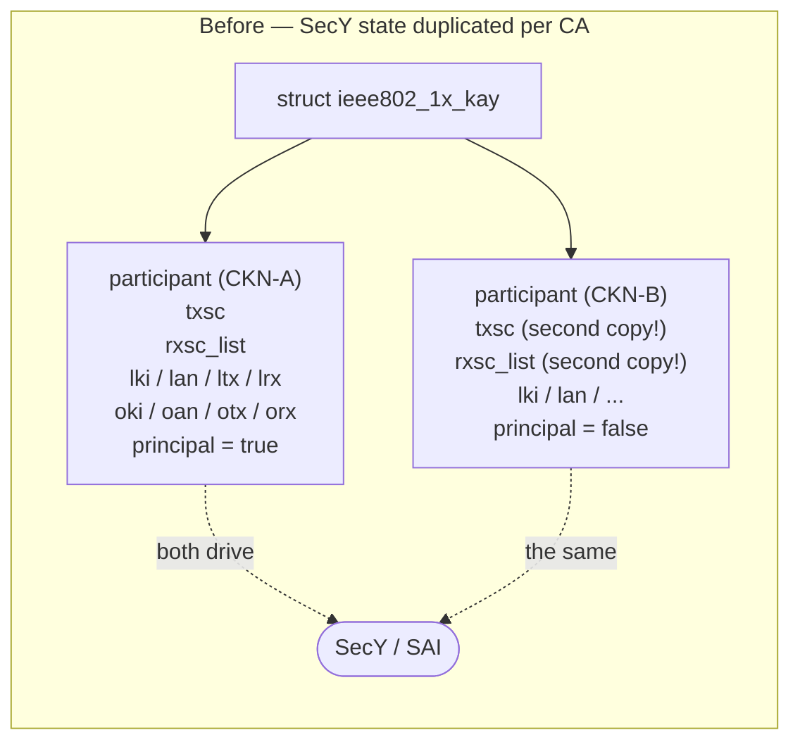
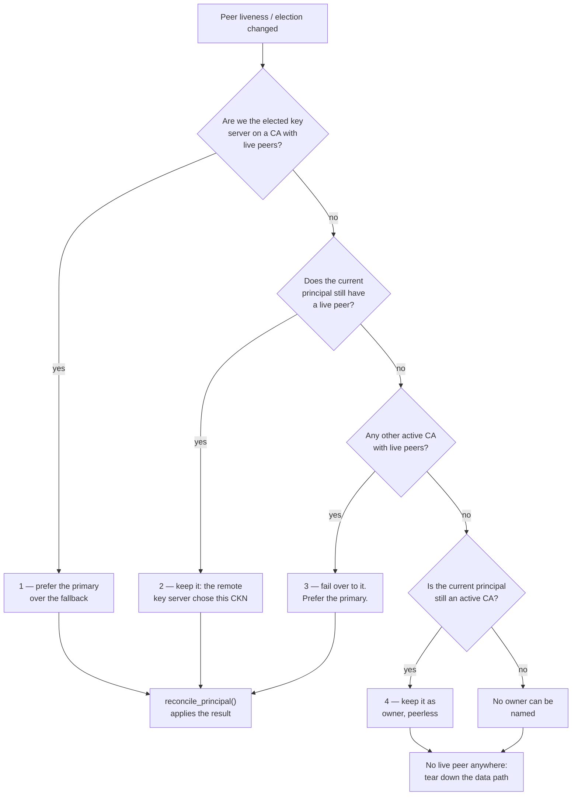
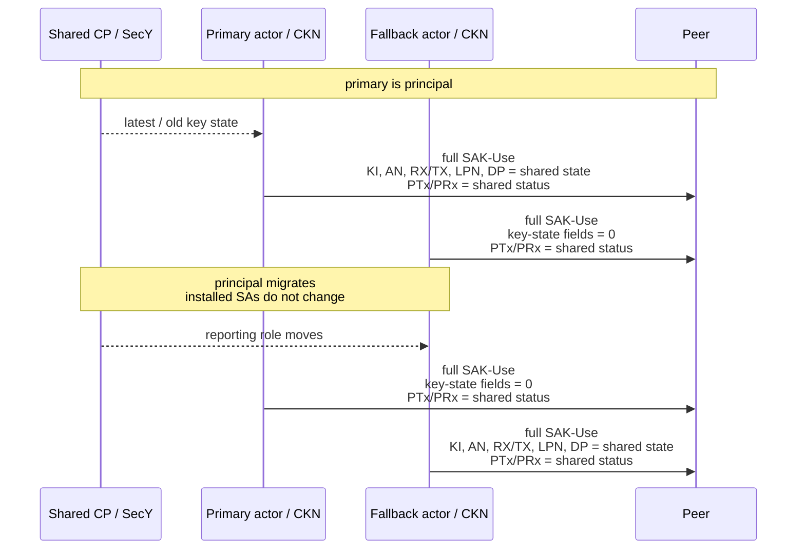
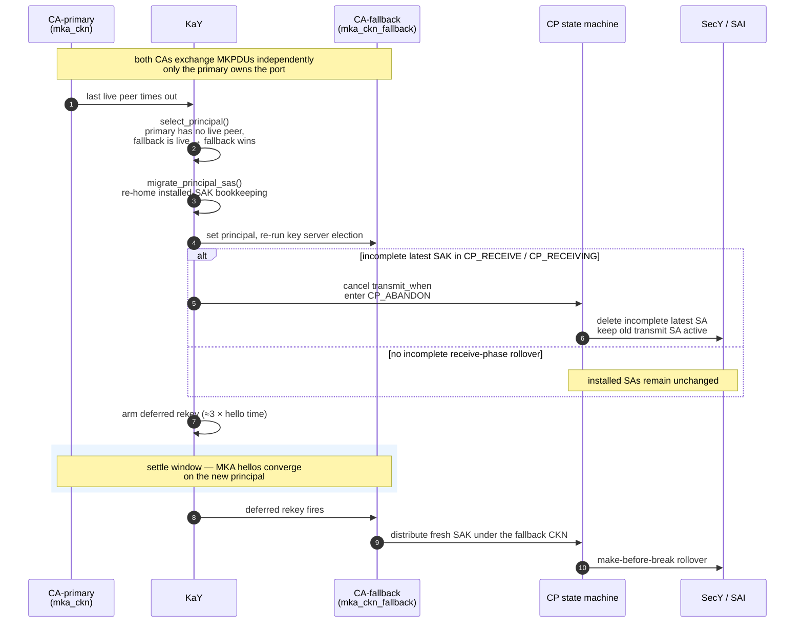
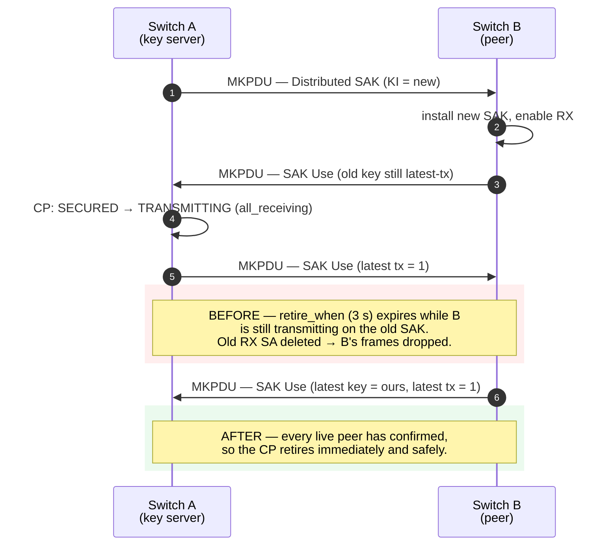

<!-- omit in toc -->
# MACsec Fallback CAK — wpa_supplicant High Level Design

***Revision***

|  Rev  | Date | Author       | Change Description |
| :---: | :--: | :----------- | ------------------ |
|  0.1  |      | Liam Kearney | Initial version    |
|  0.2  | 2026-09-09 | Liam Kearney | Clarify interoperability assumptions, multi-actor SAK Use, interrupted rollover state, AN selection, and emergency revocation |

<!-- omit in toc -->
## Table of Contents

- [About this Manual](#about-this-manual)
- [Scope](#scope)
- [Abbreviations](#abbreviations)
- [1 Requirements](#1-requirements)
- [2 Background](#2-background)
  - [2.1 The single-CA assumption](#21-the-single-ca-assumption)
- [3 Design](#3-design)
  - [3.1 Per-port SecY state moves to the KaY](#31-per-port-secy-state-moves-to-the-kay)
  - [3.2 Principal CA selection](#32-principal-ca-selection)
  - [3.3 Hitless failover](#33-hitless-failover)
    - [3.3.1 Hitless preconditions and interoperability](#331-hitless-preconditions-and-interoperability)
  - [3.4 Deferred post-promotion rekey](#34-deferred-post-promotion-rekey)
  - [3.5 SAK rollover hardening](#35-sak-rollover-hardening)
- [4 Configuration](#4-configuration)
  - [4.1 wpa_supplicant network block parameters](#41-wpa_supplicant-network-block-parameters)
  - [4.2 Control interface](#42-control-interface)
- [5 Interaction with MACsecMgr](#5-interaction-with-macsecmgr)
- [6 Backward compatibility](#6-backward-compatibility)
- [7 Test plan](#7-test-plan)

## About this Manual

This document describes the `wpa_supplicant` changes required to support a
**fallback Connectivity Association Key (CAK)** on a SONiC MACsec port, together
with the MKA robustness fixes that make key rollover hitless in the presence of
more than one Connectivity Association (CA).

It is a companion to the existing
[MACsec SONiC HLD](https://github.com/sonic-net/SONiC/blob/master/doc/macsec/MACsec_hld.md)
and fills in the section marked *TODO* at
[3.4.1.1 Primary/Fallback decision](https://github.com/sonic-net/SONiC/blob/master/doc/macsec/MACsec_hld.md#3411-primaryfallback-decision).
It delivers **Phase III** of that document's functional requirements:

> *Primary and Fallback secure Connectivity Association Key can be supported
> simultaneously.*

## Scope

**In scope** — changes inside `wpa_supplicant` / the MKA `KaY` implementation
(`src/pae/`, `wpa_supplicant/`).

**Out of scope** — CONFIG\_DB schema (the `MACSEC_PROFILE` table already carries
optional `fallback_cak` / `fallback_ckn`), the MACsecMgr hot-rotation workflow,
the SONiC MACsec plugin, MACsecOrch, and SAI. Static fallback configuration only
requires MACsecMgr to map the existing fields to the new supplicant parameters.
Applying a primary CAK update to an already-running port requires the
delete-then-add orchestration summarized in §5 and is specified separately.

## Abbreviations

| Abbreviation | Description                                              |
| ------------ | -------------------------------------------------------- |
| CA           | Secure Connectivity Association                          |
| CAK / CKN    | Connectivity Association Key / CA Key Name               |
| CP           | Controlled Port state machine (IEEE Std 802.1X-2020 §12.4) |
| KaY          | MACsec Key Agreement Entity                              |
| KI / KN      | Key Identifier / Key Number                              |
| MKA          | MACsec Key Agreement protocol                            |
| MKPDU        | MKA Protocol Data Unit                                   |
| MI / MN      | Member Identifier / Message Number                       |
| PN / LPN     | Packet Number / Lowest Packet Number                     |
| SAK          | Secure Association Key                                   |
| SC / SA      | Secure Channel / Secure Association                      |
| SecY         | MACsec Security Entity                                   |

## 1 Requirements

1. A port may be configured with a **primary** and an optional **fallback** CAK,
   both active simultaneously. The two CKNs must differ — the CKN is what
   identifies a CA in an MKPDU — though the CAKs may be the same.
2. If the primary CA fails — typically a key mismatch after a one-sided key
   rotation, or the peer losing the primary CAK — the port **must fail over to
   the fallback CA without dropping traffic**, subject to the interoperability
   preconditions in §3.3.1.
3. The primary CA has **priority** over the fallback: whenever the primary has a
   live peer and we are key server on it, that is where SAKs are distributed.
   An in-flight rekey keeps its current CP/SecY state across the ownership
   change; a fresh rekey under the incoming CA is deferred (§3.4).
4. Both ends must converge on the **same** CA. When one coherent key server
   drives the port, it distributes on its selected CA and the non-key-server
   follows the CKN carrying the Distributed SAK. Operators must configure
   key-server priority consistently across both CAs (§3.2).
5. The feature must be **opt-in**. With only a primary CAK configured, behaviour
   is unchanged.
6. A CAK must be replaceable **at runtime**, without restarting the supplicant
   or bouncing the link. This is hitless only with a valid fallback to carry the
   port across the rotation (§4.2.1).
7. A port carries **exactly one primary CA**, enforced by the supplicant. Adding
   a second primary is rejected rather than silently changing which CA owns the
   port.

A fallback-only configuration works in the supplicant, but SONiC does not expose
it — MACsecMgr always programs a primary.

## 2 Background

### 2.1 The single-CA assumption

MKA permits a port to hold several CAs at once. Upstream `wpa_supplicant`
models this — `struct ieee802_1x_kay` owns a list of participants, one per CKN —
but only ever runs one in practice. The **first** participant created claims the
Controlled Port and the SecY, and nothing re-evaluates that choice.

The reason is that per-port state was stored **per participant**:




Consequences of the old layout:

- Two participants each believed they owned the transmit SC, so the second one
  to act would delete or overwrite SAs installed by the first.
- Receive SCs for the same peer SCI were created and destroyed independently.
- There was no notion of *which* CA should own the port, so a dead primary CAK
  took the link down even with a healthy fallback configured.

## 3 Design

### 3.1 Per-port SecY state moves to the KaY

The transmit SC, the receive SCs and the installed-key bookkeeping (the latest
and old key identifiers with their association numbers and tx/rx flags) describe
the **port's SecY**, not any one CA. They are hoisted onto `struct
ieee802_1x_kay`:

| State | New owner | Lifetime |
| ----- | --------- | -------- |
| `txsc` | `kay->txsc` | Created by the first participant, torn down with the last |
| `rxsc_list` | `kay->rxsc_list` | Shared; `struct receive_sc` gains a **refcount**, so a peer SCI reachable through two CAs has exactly one receive SC |
| `lki/lan/ltx/lrx`, `oki/oan/otx/orx` | `kay->…` | One installed-key view per port |
| principal flag | `kay->principal_participant` | A single pointer, reachable via `get`/`is`/`set` accessors |

This is a **pure refactor** — with one participant the hoisted state has exactly
the same lifetime and values as before — but it is the precondition for
everything that follows.

### 3.2 Principal CA selection

`ieee802_1x_kay_select_principal()` answers one question: *which CA owns the
Controlled Port?* It makes the whole decision and returns the CA that should own
the port; `ieee802_1x_kay_reconcile_principal()` applies the result — migrating
the installed-SAK bookkeeping (§3.3), moving the principal and arming the
deferred rekey (§3.4), or tearing the port down if no CA is returned.

It is re-evaluated whenever **peer liveness** changes — a CA gaining its first
live peer, or losing its last — or when key server election changes. A peer is
live once both ends have exchanged MKPDUs under the same CAK.

Selection is four ordered rules, first match wins:

1. **We are key server on a CA with live peers** — that CA, primary preferred.
2. **We are not key server** — the CA we are receiving SAKs on, i.e. the
   incumbent, while it still has live peers.
3. **Otherwise** — any active CA with live peers, primary preferred.
4. **Otherwise** — whatever is currently set, while it is still active.



Selection is not key server election: election happens independently inside
each CA and is an input here. As key server we choose, and we prefer the
primary; as a non-key-server we follow a validated Distributed SAK on the CA
chosen by the remote key server.

SONiC advertises the same port-level key-server priority and SCI on both CAs.
When the same two actors are live and configured consistently, both per-CA
elections therefore reach the same result. That result is not guaranteed by the
protocol when CA membership differs transiently or a peer advertises different
parameters per CKN. Consistent key-server priority configuration is an operator
requirement: the hitless design assumes one coherent key server drives the port
across both CAs. If the endpoints become key server on different CAs, each can
select a different principal and the no-oscillation guarantee no longer applies.

"Active" is close to "configured": the flag is set once a CA sends or processes
an MKPDU and cleared only when the CA is deleted or deactivated. It is not a
liveness signal — a CA that has lost every peer is still active.

Rules 3 and 4 are a floor: an owner is named whenever any CA remains, so a later
SAK lookup or re-homing always resolves. Owning the port is not the same as
carrying traffic, though — rules 1 to 3 all require a live peer, so a rule 4
owner has none. When no CA on the port has a live peer the data path is torn
down as upstream does: the SAs are deleted and the controlled port is blocked,
while the owner pointer is retained. The returning peer re-elects and the port
re-secures on a freshly distributed SAK.

Three safety rules complete the picture:

- A `Distributed SAK` is validated **entirely within the receiving CA** before it
  is allowed to touch the CP. A valid `Distributed SAK` is authoritative and
  can make a fallback participant the principal; only after validation and
  principal selection can its key material be applied to the shared CP and
  SecY.
- Only the **principal** key server distributes SAKs. An explicit
  `macsec_rekey` request is rejected when the principal is not key server,
  rather than returning success for a request that cannot be acted on locally.
- Once a SAK is in use, every live actor sends a full 40-byte SAK-Use body
  (IEEE Std 802.1X-2020 §9.10.1). Only the principal sends nonzero latest/old
  key state; a standby clears those fields and reports only the shared PTx/PRx
  status (IEEE Std 802.1X-2020 §12.2).



On receive, only the **principal participant** decodes and acts on SAK-Use key
state. A non-principal participant treats the presence of SAK-Use as liveness
only; its KI, AN, RX/TX, LPN, and delay-protect fields cannot advance or retire
the shared CP state. Within the principal, normal MKA validation still applies:
a local key server correlates peer SAK-Use with the SAK it distributed, while a
principal non-key-server processes SAK-Use from its elected key server.

This receive-side principal gate is independent of `Distributed SAK`
processing. A valid `Distributed SAK` received and validated within a fallback
CA can promote that participant to principal, after which it can install the
distributed key and process SAK-Use for convergence.

### 3.3 Hitless failover

The promotion itself must preserve the active datapath. Control plane and data
plane are decoupled, so changing the principal does not normally select an old
or new SAK again. The exception is an incomplete receive-phase rollover: if the
latest SAK is installed but not transmitting while the old SAK is still
transmitting, carrying its `transmit_when` across the principal change could
enable that latest SAK after the CA that distributed it has been removed. The
CP therefore cancels the inherited timer and enters `CP_ABANDON`.

What moves is **bookkeeping** — every installed `data_key`, together with the
current `new_key` and `to_use_sak` state, is re-homed from the outgoing
participant to the incoming one. Migration does not recreate or disable the
active SAK. In the incomplete receive-phase case, the existing `CP_ABANDON`
transition deletes only the incomplete latest SAK and leaves the old transmit
SA active. The retained SAK is not redistributed under the new CAK; its
reference moves so the incoming principal can manage its subsequent rollover
and retirement.

The SAK-Use reporting role swaps before the next MKPDU, as shown above; the
active SAs and shared current SAK do not change.

The SA that remains active depends on how far the CP had progressed when the
outgoing CA was removed:

| CP phase | State preserved across promotion |
| -------- | -------------------------------- |
| Before `CP_RECEIVE` | Only the pre-existing/current SA carries traffic. |
| `CP_RECEIVE` / `CP_RECEIVING` | If the old SAK is transmitting and the latest SAK is not, cancel the inherited `transmit_when` and enter `CP_ABANDON`. The incomplete latest SAK is deleted and the old transmit SA remains active. |
| `CP_TRANSMIT` / `CP_TRANSMITTING` | The new transmit SA remains active; the old receive SA remains until retirement. |
| `CP_ABANDON` | The incomplete latest SAK is deleted and the old SA remains. |
| `CP_RETIRE` | The old SAK is deleted and the latest SAK becomes the retained old/current SAK. |

Distribution under the deleted CA stops. If the incoming principal is the local
key server, it distributes a fresh SAK under its own CKN after the settle window
(§3.4). This is a new ordinary rollover from the retained active SAK. Other CP
phases continue from their preserved state above.



#### 3.3.1 Hitless preconditions and interoperability

The design preserves traffic when all of the following are true:

1. Both endpoints retain at least one **common active SAK** throughout the
   principal change. This need not be the old SAK if both endpoints have already
   switched to the latest one.
2. The fallback CA already has a live peer. If no CA has a live peer, the
   controlled port is intentionally torn down.
3. One coherent key server drives both CAs, as described in §3.2.
4. The physical peer and elected key server use a stable SCI across the two CAs.
5. A remote key server assigns an AN that permits make-before-break operation on
   the receiving hardware.

On a local principal change during `CP_RECEIVE` or `CP_RECEIVING`, §3.3
preserves the first condition by abandoning an incomplete latest SAK rather than
allowing its inherited `transmit_when` to enable it after its distributing CA
has been removed.

When SONiC is key server, §3.5.1 retains the old receive SA until every live peer
reports transmission on the latest SAK, subject to a bounded failsafe. When
SONiC is non-key-server it cannot impose that retention policy on a third-party
key server; interoperability depends on that implementation also preserving a
common SAK during rollover.

SONiC raises its key-server priority to `0` when hardware supports fewer than
four SAs per SC, so it normally controls AN allocation. This is not a guarantee
of election: a priority tie, SCI tie-break, or an obliged remote key server can
still leave SONiC as non-key-server. The safe allocator in §3.5.4 protects the
local key-server path. In the non-key-server path SONiC follows the Distributed
AN selected by the peer, so constrained-SA interoperability must be validated
against the peer key server.

The KaY can represent more than one receive SC, keyed by peer SCI. That is not
equivalent to hitless failover across a peer SCI change. A change in elected
key-server SCI signals `chgdServer` to the CP, which transitions through
`CP_CHANGE` and removes the existing SAs. The zero-loss fallback path therefore
assumes a stable peer/key-server SCI across the primary and fallback CAs.

### 3.4 Deferred post-promotion rekey

An immediate rekey does not inherently break the datapath: the inherited SAK
remains active and ordinary rollover is make-before-break. As a robustness
measure, automatic rekey is deferred by **≈3 hello times** so both endpoints
can observe the new principal before another rollover begins. This **settle
window** is approximately 6 seconds with the default 2-second hello interval.

The window only delays the start of rekey. Once rekey begins, the ordinary CP
rollover applies, including the peer-confirmation gate in §3.5.1.

Arming is **non-resetting**, so a burst of ownership swaps collapses into a
single rekey instead of each swap pushing the timer out. A `principal_changed`
flag distinguishes *"armed, still owned by the same CA"* from *"ownership moved
again"* — in the latter case the settle window restarts for the new owner. An
ordinary rekey that lands first cancels the deferral, so the port never rotates
twice.

This settle window is an availability-oriented policy for planned or operational
rotation. It deliberately continues using the inherited SAK while MKA
converges. If a CAK is suspected to be compromised, any SAK derived through it
must also be treated as potentially compromised, so extending its use after the
operator acts is a security tradeoff. The hot-rotation workflow in this design
does not provide immediate revocation; an emergency policy must choose between
accepting the settle window or tearing down/rekeying immediately with possible
traffic interruption. The settle window is fixed at three hello times in this
change.

### 3.5 SAK rollover hardening

Running two CAs on one port exposed four latent defects in the rollover path,
plus two smaller lifecycle bugs. The rollover fixes are useful independently of
fallback CAKs and also harden the single-CA case.

#### 3.5.1 Retire the old SA only once every peer has moved

`CP_TRANSMITTING` leaves for `CP_RETIRE` purely on a timer, so the old receive SA
is torn down whether or not a peer is still transmitting on it. A peer that has
not finished rotating has its frames dropped.

The key server now tracks, per live peer, whether that peer has advanced its
transmit to our latest SAK — its SAK-Use body advertises *latest-key tx* for a
latest key matching ours. Once **every** live peer confirms, the CP retires
immediately, which is both safe and faster than the timer.



`retire_when` is demoted to a failsafe for a peer that stays live but never
confirms. On the key server it is lengthened to **20 s** so it can never cut off
a slow-but-progressing peer mid-rotation — precisely the loss this change
exists to prevent. A non key server cannot observe the gate and keeps the stock
timer.

#### 3.5.2 Coalesce the deferred CP step

`ieee802_1x_cp_sm_step()` cancelled any queued step callback and registered a new
one. Since `ieee802_1x_cp_step_run()` already loops until `CP_state` is stable, a
single pending callback covers every change accumulated until it runs — so the
cancel served no purpose, and was actively harmful: a burst of `sm_step()` calls
perpetually pushed the 0 s timeout back and could starve an already-latched
`all_receiving` until the ~6 s `transmit_when` failsafe fired. Multiple CAs make
such bursts routine.

The CP now tracks whether a step is already queued and coalesces onto it. The
flag is latched only after `eloop_register_timeout()` succeeds, so a failed
registration lets the next `sm_step()` retry rather than wedging the machine.

#### 3.5.3 Advertise a stable lowest PN

`ieee802_1x_mka_get_lpn()` uses the PN sampled on the previous hello to provide
the lookback described by IEEE Std 802.1X-2020 §9. Sampling once per actor would
shorten that lookback and make it depend on actor order. Only the principal now
samples and advertises LPN; standby actors send a full SAK-Use body with LPN and
the other key-state fields zero.

#### 3.5.4 Select an AN that does not replace a live SA

IEEE Std 802.1X-2020 §9.9 requires the key server to assign ANs in sequence,
beginning with the first AN after the last SAK in use. A free-running
`dist_an` counter preserves sequence but loses the required starting point after
an abandoned distribution or principal change.

That drift is destructive: IEEE Std 802.1AE-2018 §§10.7.13 and 10.7.22 require
creation of a receive or transmit SA to delete any prior SA at the same AN. An
incorrectly reused AN can therefore delete the SA that is still carrying
traffic.

`ieee802_1x_kay_select_dist_an()` chooses explicitly:

1. Start after the most recently installed local SAK.
2. Skip ANs occupied by the local latest and old SAs
   (`lki/lan` and `oki/oan`).
3. Prefer an AN that no live peer reports in SAK Use.
4. If necessary, reuse an AN reported only by a peer; otherwise a peer that
   never converges could block rekey indefinitely.
5. If every local slot is occupied, choose the AN that CP is about to release:
   the old AN after transmit has moved to the latest SAK, or the incomplete
   latest AN while transmit remains on the old SAK.

The scan is bounded by the hardware's configured maximum SAs per SC and by the
two-bit AN field.

#### 3.5.5 Two smaller fixes

- **Transmit SC leak.** `ieee802_1x_kay_create_mka()` creates the transmit SC in
  the SecY before deriving the KEK and ICK. If either derivation failed, the
  error path freed only the local structure, leaking the SC installed in the
  driver.
- **SAK Use from a not-yet-live peer.** A peer can add us to its live peer list
  and start advertising SAK Use before we have promoted it to live. This was
  treated as an error and discarded the whole MKPDU; because a SAK Use arriving
  without a Distributed SAK triggers a local MI reset, both ends would reset
  their MI in response to each other and the CA never converged. It is now
  treated as the timing transient it is: logged at debug level, that parameter
  set ignored, and processed normally once the peer reaches LIVE.

## 4 Configuration

### 4.1 wpa_supplicant network block parameters

This change adds two optional `wpa_supplicant` `network={}` parameters,
alongside the existing `mka_cak` / `mka_ckn`. These are not new `CONFIG_DB`
fields. The corresponding `fallback_cak` / `fallback_ckn` fields already exist
in the `MACSEC_PROFILE` table.

| wpa_supplicant parameter | Format | Description |
| ------------------------ | ------ | ----------- |
| `mka_cak_fallback` | 32 or 64 hex digits | Fallback Connectivity Association Key |
| `mka_ckn_fallback` | up to 64 hex digits | Fallback CAK Name |

```conf
network={
	key_mgmt=NONE
	eapol_flags=0
	macsec_policy=1
	mka_cak=0123456789ABCDEF0123456789ABCDEF
	mka_ckn=6162636465666768696A6B6C6D6E6F707172737475767778797A303132333435
	mka_priority=128
	mka_cak_fallback=FEDCBA9876543210FEDCBA9876543210
	mka_ckn_fallback=3031323334353637383941424344454647484950515253545556575859606162
}
```

When both are set, a second, standby MKA participant is created on the same
interface at association time. Both participants exchange MKPDUs independently,
but only the principal owns the Controlled Port and distributes SAKs.

Both CAs advertise MKPDUs **continuously** while configured; the fallback is not
held in reserve. An MKPDU carrying a CKN the peer does not hold fails ICV
validation there and is discarded, so a mismatched CA simply never gains a live
peer. Removing a CAK with `macsec_del_mka` stops its MKPDUs, and a SAK is only
ever distributed on a CA that has a live peer.

MACsecMgr maps the existing `CONFIG_DB` fields one-to-one onto these
`wpa_supplicant` parameters.

### 4.2 Control interface

Four commands are added so a CAK can be rotated at runtime without restarting
the supplicant or bouncing the link.

| `wpa_cli` command | Control interface | Description |
| ----------------- | ----------------- | ----------- |
| `macsec_add_mka ckn=<hex> cak=<hex> [fallback=1]` | `MACSEC_ADD_MKA` | Create an MKA participant on the running KaY. Creates the **primary** CA by default; with `fallback=1` the participant only claims the port while the primary CA has no live peer. Returns `FAIL` if the port already has a primary. |
| `macsec_del_mka ckn=<hex>` | `MACSEC_DEL_MKA` | Remove a participant by CKN. |
| `macsec_mka_list` | `MACSEC_MKA_LIST` | List participants with their role and peer counts. |
| `macsec_rekey` | `MACSEC_REKEY` | Force the key server to distribute a fresh SAK. |

`FAIL` is ordinary `wpa_cli` control interface semantics — the command is
rejected and nothing changes. It is not a MACsec or MKA state.

`macsec_mka_list` reports, per participant:

```text
participant_idx=0
ckn=6162636465666768...
mi=...            mn=42
active=Yes        participant=Yes     retain=No
is_principal=Yes  is_primary=Yes
live_peers=1      potential_peers=0
is_key_server=Yes is_elected=Yes
```

#### 4.2.1 Rotating the primary CAK

Because a port has exactly one primary CA, the new primary cannot be stacked on
top of the old one — `macsec_add_mka` returns `FAIL` while a primary is present.
Rotation is therefore **delete, then add**, with the fallback CA carrying the
port in between:

1. `macsec_del_mka` the old primary. The KaY re-selects, the fallback CA is
   promoted and inherits the installed SAK (§3.3), so the port keeps forwarding.
2. `macsec_add_mka` the new primary. Once it has a live peer, rule 1 applies —
   the primary outranks the fallback — and selection returns the port to it.

Each ownership change can trigger a settle window of a few hello times. Subject
to the interoperability preconditions in §3.3.1, the inherited SAK carries
traffic during that window and the port is never left without a usable CA. The
peer does **not** have to have installed the new CKN before the old one is
removed — the fallback covers the gap, which is what makes an uncoordinated,
one-end-at-a-time planned rotation possible.

These are supplicant-level primitives, not an operator workflow. MACsecMgr
issues the sequence; an operator uses the ordinary SONiC config commands and
never touches the control interface:

| Intent | Operator command | What MACsecMgr issues |
| ------ | ---------------- | --------------------- |
| Rotate the primary CAK | `config macsec profile update …` | `macsec_del_mka` old primary, then `macsec_add_mka` new primary |
| Tear the session down | `config macsec port del …` | removes the whole network block, and both CAs with it |

Because the two intents map to different command streams, the supplicant never
has to infer which was meant: a bare `macsec_del_mka` is *never* a teardown
request. It removes one CA and the KaY keeps the port on whatever remains. The
Controlled Port is torn down only when the port's last CA goes away.

This sequence is intended for planned rotation. It is not an immediate
revocation primitive for a compromised CAK because it intentionally retains the
inherited SAK during the settle window (§3.4).


## 5 Interaction with MACsecMgr

No `CONFIG_DB` schema change is required. For static configuration, MACsecMgr
maps the existing `fallback_cak` / `fallback_ckn` fields from the
`MACSEC_PROFILE` table to the two new `wpa_supplicant` parameters through the
existing `set_network` mechanism.

```bash
wpa_cli -g${DOMAIN_SOCK} IFNAME=${PORT} set_network ${NETWORK_ID} \
        mka_cak_fallback ${FALLBACK_CAK}
wpa_cli -g${DOMAIN_SOCK} IFNAME=${PORT} set_network ${NETWORK_ID} \
        mka_ckn_fallback ${FALLBACK_CKN}
```

The `macsec_add_mka` / `macsec_del_mka` / `macsec_mka_list` commands are the
building blocks for a future *hot* key-rotation flow in MACsecMgr (an update to
`primary_cak` on an already-running profile applied without a link bounce). Such
a flow must follow the delete-then-add ordering of §4.2, and requires a fallback
CAK to be configured — without one, the port has no CA to carry traffic between
the two steps. A companion MACsecMgr/configuration HLD will define the operator
commands, CONFIG\_DB update handling, sequencing, and failure recovery for that
flow; those changes are out of scope for this document.

## 6 Backward compatibility

- With only `mka_cak` / `mka_ckn` configured, exactly one participant is created
  and it is unconditionally the principal. Behaviour is byte-for-byte the
  previous behaviour.
- No SONiC MACsec plugin API changed, so no MACsecOrch or SAI change is implied.
- No CONFIG\_DB / APP\_DB / STATE\_DB schema change.
- A principal change does not recreate an SC or SA, so it does not reset SAI
  counters. The deferred SAK rollover has the same counter lifecycle as an
  ordinary rekey.
- The `MACSEC` status output gains `is_principal` and `is_primary` per
  participant and now reports secure channels once for the port rather than once
  per participant. Existing fields keep their names and meanings.

## 7 Test plan

| # | Scenario | Expectation |
| - | -------- | ----------- |
| 1 | Primary only (regression) | Unchanged behaviour; single participant is principal |
| 2 | Primary + fallback, both valid | Both CAs live; primary is principal; one transmit SC and one receive SC per peer |
| 3 | Primary CAK mismatched on one end | Port comes up on the fallback CA; no traffic loss |
| 4 | Primary recovers | Ownership reverts to the primary; no traffic loss |
| 5 | Repeated primary flap | Ownership swaps collapse into a single deferred rekey |
| 6 | Rekey with a slow peer | Old RX SA survives until the peer confirms; no drops |
| 7 | Runtime primary rotation: `macsec_del_mka` old, then `macsec_add_mka` new | Fallback carries the port in between; new primary takes over; link never goes down |
| 8 | Both CAKs invalid | Controlled port torn down; recovers when either becomes valid |
| 9 | Long soak with periodic rekey | No SC/SA leak in the driver; refcounts return to zero on teardown |
| 10 | `macsec_add_mka` for a second primary while one is present | Rejected with `FAIL`; the existing CA set and port ownership are unchanged |
| 11 | Delete the principal during each CP rollover phase, including a peer missing the Distributed SAK in `CP_RECEIVING` | The inherited `transmit_when` is cancelled and the incomplete latest SAK is abandoned while the old transmit SAK remains active; other phases preserve the active SAK; no drops |
| 12 | Two-SA hardware with SONiC as key server | AN selection does not replace a locally active SA; rollover remains hitless |
| 13 | Two-SA hardware with SONiC as non-key-server | Peer-selected AN permits make-before-break; document peer combinations for which this is verified |
| 14 | Peer uses a different SCI on fallback | Separate receive SC is created, but `chgdServer` resets CP; scenario is not claimed as hitless |
| 15 | Deliberately inconsistent per-CA key-server election | Split-key-server operation is unsupported; no zero-loss convergence is claimed |
| 16 | SAK-Use with both CAs live and during migration | Both CKNs send full bodies; only the principal sends nonzero key state and acts on received key state; standby reports PTx/PRx and treats received SAK-Use as liveness only; roles swap atomically |
| 17 | Counters across principal migration and deferred rekey | No counter reset at principal migration; later counter behavior matches an ordinary SAK rekey |
| 18 | Valid Distributed SAK arrives on a live fallback CA while the local participant is non-key-server | The Distributed SAK is validated within that CA, the fallback can become principal, and only then is the key applied to the shared CP/SecY |

Loss measurement should be a continuous bidirectional stream across the link for
scenarios 3–7 and 11–13; the pass criterion is zero dropped frames for the peer
and hardware combinations declared interoperable.
