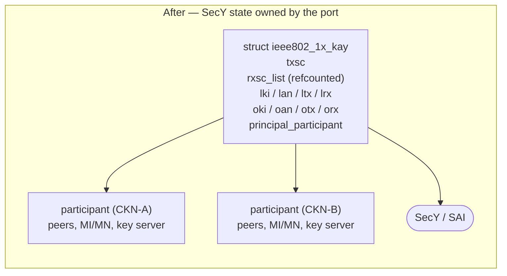
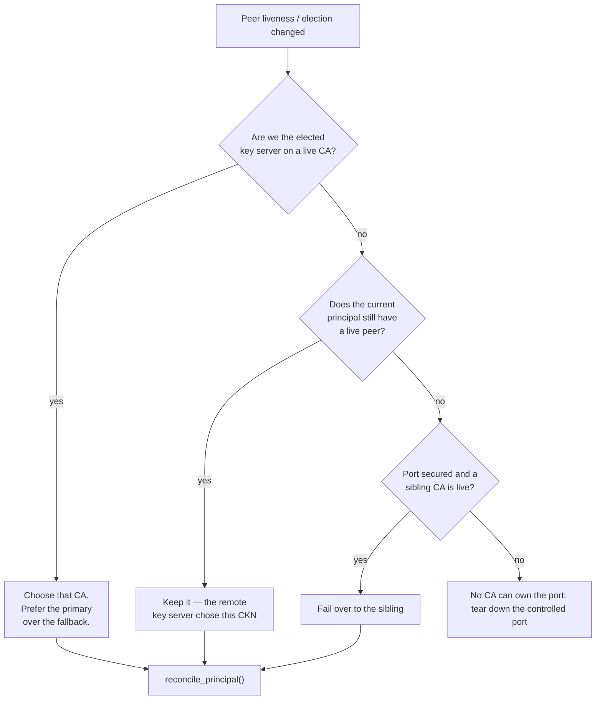
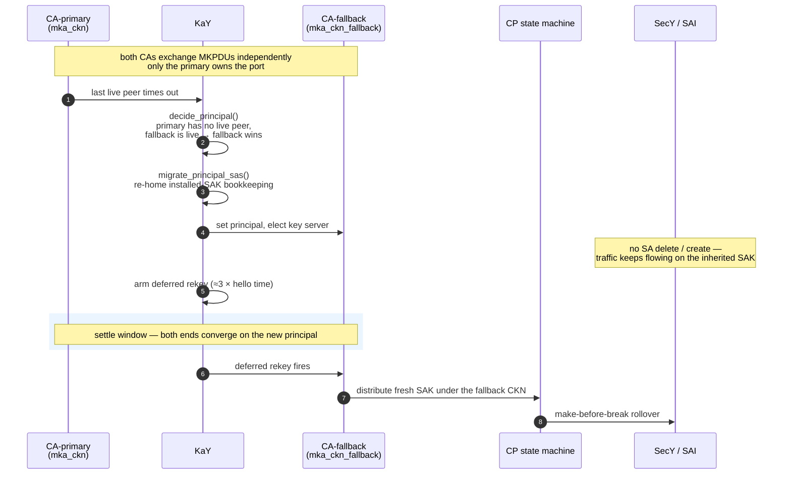
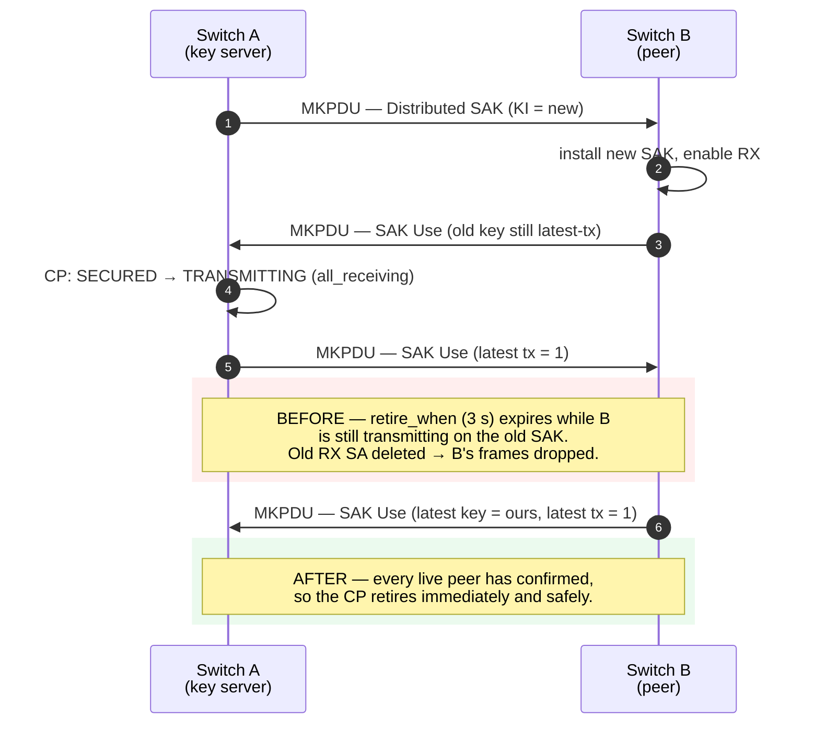
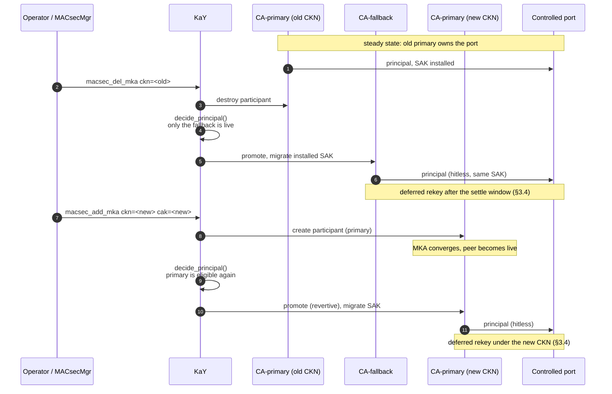

<!-- omit in toc -->
# MACsec Fallback CAK — wpa_supplicant High Level Design

***Revision***

|  Rev  | Date | Author       | Change Description |
| :---: | :--: | :----------- | ------------------ |
|  0.1  |      | Liam Kearney | Initial version    |

<!-- omit in toc -->
## Table of Contents

- [About this Manual](#about-this-manual)
- [Scope](#scope)
- [Abbreviations](#abbreviations)
- [1 Requirements](#1-requirements)
- [2 Background](#2-background)
  - [2.1 The single-CA assumption](#21-the-single-ca-assumption)
- [3 Design](#3-design)
  - [3.1 Per-port SecY state moves to the KaY](#31-per-port-secy-state-moves-to-the-kay)
  - [3.2 Principal CA selection](#32-principal-ca-selection)
  - [3.3 Hitless failover](#33-hitless-failover)
  - [3.4 Deferred post-promotion rekey](#34-deferred-post-promotion-rekey)
  - [3.5 SAK rollover hardening](#35-sak-rollover-hardening)
- [4 Configuration](#4-configuration)
  - [4.1 Network block parameters](#41-network-block-parameters)
  - [4.2 Control interface](#42-control-interface)
- [5 Interaction with MACsecMgr](#5-interaction-with-macsecmgr)
- [6 Backward compatibility](#6-backward-compatibility)
- [7 Test plan](#7-test-plan)
- [8 Patch series](#8-patch-series)

## About this Manual

This document describes the `wpa_supplicant` changes required to support a
**fallback Connectivity Association Key (CAK)** on a SONiC MACsec port, together
with the MKA robustness fixes that make key rollover hitless in the presence of
more than one Connectivity Association (CA).

It is a companion to the existing
[MACsec SONiC HLD](https://github.com/sonic-net/SONiC/blob/master/doc/macsec/MACsec_hld.md)
and fills in the section marked *TODO* at
[3.4.1.1 Primary/Fallback decision](https://github.com/sonic-net/SONiC/blob/master/doc/macsec/MACsec_hld.md#3411-primaryfallback-decision).
It delivers **Phase III** of that document's functional requirements:

> *Primary and Fallback secure Connectivity Association Key can be supported
> simultaneously.*

## Scope

**In scope** — changes inside `wpa_supplicant` / the MKA `KaY` implementation
(`src/pae/`, `wpa_supplicant/`).

**Out of scope** — CONFIG\_DB schema (the `MACSEC_PROFILE` table already carries
optional `fallback_cak` / `fallback_ckn`), MACsecMgr, the SONiC MACsec plugin,
MACsecOrch, and SAI. None of these need to change; the feature is confined to
the MKA control plane and reuses the existing plugin API surface.

## Abbreviations

| Abbreviation | Description                                              |
| ------------ | -------------------------------------------------------- |
| CA           | Secure Connectivity Association                          |
| CAK / CKN    | Connectivity Association Key / CA Key Name               |
| CP           | Controlled Port state machine (IEEE 802.1X-2010, Cl. 12) |
| KaY          | MACsec Key Agreement Entity                              |
| KI / KN      | Key Identifier / Key Number                              |
| MKA          | MACsec Key Agreement protocol                            |
| MKPDU        | MKA Protocol Data Unit                                   |
| MI / MN      | Member Identifier / Message Number                       |
| PN / LPN     | Packet Number / Lowest Packet Number                     |
| SAK          | Secure Association Key                                   |
| SC / SA      | Secure Channel / Secure Association                      |
| SecY         | MACsec Security Entity                                   |

## 1 Requirements

1. A port may be configured with a **primary** and an optional **fallback** CAK,
   both active simultaneously.
2. If the primary CA fails — typically a key mismatch after a one-sided key
   rotation, or the peer losing the primary CAK — the port **must fail over to
   the fallback CA without dropping traffic**.
3. Failover must be **revertive**: once the primary CA recovers a live peer, the
   port returns to it.
4. Both ends must converge on the **same** CA. A configuration where each end
   independently prefers a different CKN must not oscillate.
5. The feature must be **opt-in**. With only a primary CAK configured, behaviour
   is unchanged.
6. A CAK must be replaceable **at runtime**, without restarting the supplicant
   or bouncing the link.
7. A port carries **exactly one primary CA**, enforced by the supplicant. Adding
   a second primary is rejected rather than silently changing which CA owns the
   port.

## 2 Background

### 2.1 The single-CA assumption

MKA permits a port to hold several CAs at once. Upstream `wpa_supplicant`
models this — `struct ieee802_1x_kay` owns a list of participants, one per CKN —
but only ever runs one in practice. The **first** participant created claims the
Controlled Port and the SecY, and nothing re-evaluates that choice.

The reason is that per-port state was stored **per participant**:




Consequences of the old layout:

- Two participants each believed they owned the transmit SC, so the second one
  to act would delete or overwrite SAs installed by the first.
- Receive SCs for the same peer SCI were created and destroyed independently.
- There was no notion of *which* CA should own the port, so a dead primary CAK
  took the link down even with a healthy fallback configured.

## 3 Design

### 3.1 Per-port SecY state moves to the KaY

The transmit SC, the receive SCs and the installed-key bookkeeping (the latest
and old key identifiers with their association numbers and tx/rx flags) describe
the **port's SecY**, not any one CA. They are hoisted onto `struct
ieee802_1x_kay`:

| State | New owner | Lifetime |
| ----- | --------- | -------- |
| `txsc` | `kay->txsc` | Created by the first participant, torn down with the last |
| `rxsc_list` | `kay->rxsc_list` | Shared; `struct receive_sc` gains a **refcount**, so a peer SCI reachable through two CAs has exactly one receive SC |
| `lki/lan/ltx/lrx`, `oki/oan/otx/orx` | `kay->…` | One installed-key view per port |
| principal flag | `kay->principal_participant` | A single pointer, reachable via `get`/`is`/`set` accessors |

This is a **pure refactor** — with one participant the hoisted state has exactly
the same lifetime and values as before — but it is the precondition for
everything that follows.

### 3.2 Principal CA selection

`ieee802_1x_kay_decide_principal()` is evaluated whenever peer liveness or key
server election changes. It answers one question: *which CA owns the Controlled
Port?*



Two properties fall out of this ordering and are what keep the two ends in
step:

- **Primary preference applies only to the key server.** A follower keeps the CA
  the remote key server is actually distributing on. If both ends independently
  preferred their own primary, they would ping-pong between CKNs; deferring to
  the key server makes the choice unilateral and therefore stable.
- **Selection is revertive.** As soon as the primary CA regains a live peer and
  we are key server on it, ownership returns to the primary.

Two safety rules complete the picture:

- A `Distributed SAK` is validated **entirely within the receiving CA** before it
  is allowed to touch the CP, so a SAK arriving on the fallback CA cannot
  install key material for the port it does not own.
- Only the **principal** key server distributes SAKs. A rekey requested on a
  follower is retained (and honoured on promotion) rather than silently dropped.

### 3.3 Hitless failover

The promotion itself must not disturb the datapath. The incoming CA **inherits
the installed SAK** rather than negotiating a new one, so no SA is deleted or
created at the moment of failover — only MKA bookkeeping moves.



### 3.4 Deferred post-promotion rekey

Rekeying *immediately* on promotion is what breaks the datapath: while the two
ends are still converging on the new principal, the rotation races traffic and
frames are lost. The rekey is therefore deferred by **≈3 hello times** and the
inherited SAK carries traffic until then.

Arming is **non-resetting**, so a burst of ownership swaps collapses into a
single rekey instead of each swap pushing the timer out. A `principal_generation`
counter distinguishes *"armed, still owned by the same CA"* from *"ownership
moved again"* — in the latter case the settle window restarts for the new owner.
An ordinary rekey that lands first cancels the deferral, so the port never
rotates twice.

### 3.5 SAK rollover hardening

Running two CAs on one port exposed three latent defects in the rollover path.
All three are independent of the fallback feature and are worth having on their
own; two of them are pre-existing bugs in the single-CA case as well.

#### 3.5.1 Retire the old SA only once every peer has moved

`CP_TRANSMITTING` leaves for `CP_RETIRE` purely on a timer, so the old receive SA
is torn down whether or not a peer is still transmitting on it. A peer that has
not finished rotating has its frames dropped.

The key server now tracks, per live peer, whether that peer has advanced its
transmit to our latest SAK — its SAK-Use body advertises *latest-key tx* for a
latest key matching ours. Once **every** live peer confirms, the CP retires
immediately, which is both safe and faster than the timer.



`retire_when` is demoted to a failsafe for a peer that stays live but never
confirms. On the key server it is lengthened to **20 s** so it can never cut off
a slow-but-progressing peer mid-rotation — precisely the loss this change
exists to prevent. A follower cannot observe the gate and keeps the stock timer.

#### 3.5.2 Coalesce the deferred CP step

`ieee802_1x_cp_sm_step()` cancelled any queued step callback and registered a new
one. Since `ieee802_1x_cp_step_run()` already loops until `CP_state` is stable, a
single pending callback covers every change accumulated until it runs — so the
cancel served no purpose, and was actively harmful: a burst of `sm_step()` calls
perpetually pushed the 0 s timeout back and could starve an already-latched
`all_receiving` until the ~6 s `transmit_when` failsafe fired. Multiple CAs make
such bursts routine.

The CP now tracks whether a step is already queued and coalesces onto it. The
flag is latched only after `eloop_register_timeout()` succeeds, so a failed
registration lets the next `sm_step()` retry rather than wedging the machine.

#### 3.5.3 Advertise a stable lowest PN

`ieee802_1x_mka_get_lpn()` reports the transmit PN read on the *previous* call and
then re-reads it, so the two-second lookback required by IEEE Std 802.1X-2010
Clause 9 only holds if it is called exactly **once per hello interval**. That was
true with one participant. With several, each participant encoding its own SAK
Use body re-samples the shared transmit SC, so the first MKPDU of an interval
advertises a stale PN and the rest advertise one only moments old — and which
participant sees which depends on list order.

The value to advertise is now sampled **once per interval**, when the principal
encodes its MKPDU, and every participant reports that snapshot. Sampling cadence
becomes a property of the port rather than of the number of CAs on it.

#### 3.5.4 Two smaller fixes

- **Transmit SC leak.** `ieee802_1x_kay_create_mka()` creates the transmit SC in
  the SecY before deriving the KEK and ICK. If either derivation failed, the
  error path freed only the local structure, leaking the SC installed in the
  driver.
- **SAK Use from a not-yet-live peer.** A peer can add us to its live peer list
  and start advertising SAK Use before we have promoted it to live. This was
  treated as an error and discarded the whole MKPDU; because a SAK Use arriving
  without a Distributed SAK triggers a local MI reset, both ends would reset
  their MI in response to each other and the CA never converged. It is now
  treated as the timing transient it is: logged at debug level, that parameter
  set ignored, and processed normally once the peer reaches LIVE.

## 4 Configuration

### 4.1 Network block parameters

Two optional parameters are added to the `network={}` block, alongside the
existing `mka_cak` / `mka_ckn`:

| Parameter | Format | Description |
| --------- | ------ | ----------- |
| `mka_cak_fallback` | 32 or 64 hex digits | Fallback Connectivity Association Key |
| `mka_ckn_fallback` | up to 64 hex digits | Fallback CAK Name |

```conf
network={
	key_mgmt=NONE
	eapol_flags=0
	macsec_policy=1
	mka_cak=0123456789ABCDEF0123456789ABCDEF
	mka_ckn=6162636465666768696A6B6C6D6E6F707172737475767778797A303132333435
	mka_priority=128
	mka_cak_fallback=FEDCBA9876543210FEDCBA9876543210
	mka_ckn_fallback=3031323334353637383941424344454647484950515253545556575859606162
}
```

When both are set, a second, standby MKA participant is created on the same
interface at association time. Both participants exchange MKPDUs independently,
but only the principal owns the Controlled Port and distributes SAKs.

These map one-to-one onto the `fallback_cak` / `fallback_ckn` fields already
defined in the CONFIG\_DB `MACSEC_PROFILE` table, so no schema change is needed.

### 4.2 Control interface

Four commands are added so a CAK can be rotated at runtime without restarting
the supplicant or bouncing the link.

| `wpa_cli` command | Control interface | Description |
| ----------------- | ----------------- | ----------- |
| `macsec_add_mka ckn=<hex> cak=<hex> [fallback=1]` | `MACSEC_ADD_MKA` | Create an MKA participant on the running KaY. Creates the **primary** CA by default; with `fallback=1` the participant only claims the port while the primary CA has no live peer. Returns `FAIL` if the port already has a primary. |
| `macsec_del_mka ckn=<hex>` | `MACSEC_DEL_MKA` | Remove a participant by CKN. |
| `macsec_mka_list` | `MACSEC_MKA_LIST` | List participants with their role and peer counts. |
| `macsec_rekey` | `MACSEC_REKEY` | Force the key server to distribute a fresh SAK. |

`macsec_mka_list` reports, per participant:

```text
participant_idx=0
ckn=6162636465666768...
mi=...            mn=42
active=Yes        participant=Yes     retain=No
is_principal=Yes  is_primary=Yes
live_peers=1      potential_peers=0
is_key_server=Yes is_elected=Yes
```

#### 4.2.1 Rotating the primary CAK

Because a port has exactly one primary CA, the new primary cannot be stacked on
top of the old one — `macsec_add_mka` returns `FAIL` while a primary is present.
Rotation is therefore **delete, then add**, with the fallback CA carrying the
port in between:

1. `macsec_del_mka` the old primary. The KaY re-selects, the fallback CA is
   promoted and inherits the installed SAK (§3.3), so the port keeps forwarding.
2. `macsec_add_mka` the new primary. Once it has a live peer, revertive
   selection returns the port to it.

Each step costs one settle window of a few hello times, but no packet loss, and
the port is never left without a usable CA. Note the peer does **not** have to
have installed the new CKN before the old one is removed — the fallback covers
the gap, which is what makes an uncoordinated, one-end-at-a-time rotation safe.



## 5 Interaction with MACsecMgr

No MACsecMgr change is required for the static case: `fallback_cak` /
`fallback_ckn` from the `MACSEC_PROFILE` table are pushed with the existing
`set_network` flow, using the two new parameter names.

```bash
wpa_cli -g${DOMAIN_SOCK} IFNAME=${PORT} set_network ${NETWORK_ID} \
        mka_cak_fallback ${FALLBACK_CAK}
wpa_cli -g${DOMAIN_SOCK} IFNAME=${PORT} set_network ${NETWORK_ID} \
        mka_ckn_fallback ${FALLBACK_CKN}
```

The `macsec_add_mka` / `macsec_del_mka` / `macsec_mka_list` commands are the
building blocks for a future *hot* key-rotation flow in MACsecMgr (an update to
`primary_cak` on an already-running profile applied without a link bounce). Such
a flow must follow the delete-then-add ordering of §4.2, and requires a fallback
CAK to be configured — without one, the port has no CA to carry traffic between
the two steps. That flow is out of scope for this document.

## 6 Backward compatibility

- With only `mka_cak` / `mka_ckn` configured, exactly one participant is created
  and it is unconditionally the principal. Behaviour is byte-for-byte the
  previous behaviour.
- No SONiC MACsec plugin API changed, so no MACsecOrch or SAI change is implied.
- No CONFIG\_DB / APP\_DB / STATE\_DB schema change.
- The `MACSEC` status output gains `is_principal` and `is_primary` per
  participant and now reports secure channels once for the port rather than once
  per participant. Existing fields keep their names and meanings.

## 7 Test plan

| # | Scenario | Expectation |
| - | -------- | ----------- |
| 1 | Primary only (regression) | Unchanged behaviour; single participant is principal |
| 2 | Primary + fallback, both valid | Both CAs live; primary is principal; one transmit SC and one receive SC per peer |
| 3 | Primary CAK mismatched on one end | Port comes up on the fallback CA; no traffic loss |
| 4 | Primary recovers | Ownership reverts to the primary; no traffic loss |
| 5 | Repeated primary flap | Ownership swaps collapse into a single deferred rekey |
| 6 | Rekey with a slow peer | Old RX SA survives until the peer confirms; no drops |
| 7 | Runtime primary rotation: `macsec_del_mka` old, then `macsec_add_mka` new | Fallback carries the port in between; new primary takes over; link never goes down |
| 8 | Both CAKs invalid | Controlled port torn down; recovers when either becomes valid |
| 9 | Long soak with periodic rekey | No SC/SA leak in the driver; refcounts return to zero on teardown |
| 10 | `macsec_add_mka` for a second primary while one is present | Rejected with `FAIL`; the existing CA set and port ownership are unchanged |

Loss measurement should be a continuous bidirectional stream across the link for
scenarios 3–7; the pass criterion is zero dropped frames.

## 8 Patch series

The change is submitted as eight self-contained, sequentially applicable
commits:

| # | Commit | Purpose |
| - | ------ | ------- |
| 1 | fix transmit SC leak when creating an MKA participant fails | pre-existing bug fix |
| 2 | do not reject a SAK Use from a not-yet-live peer | pre-existing bug fix |
| 3 | move per-port SecY state from the participant to the KaY | refactor, no functional change |
| 4 | support a fallback CAK with automatic failover | the feature |
| 5 | defer the rekey that follows a principal promotion | hitless promotion |
| 6 | coalesce the deferred CP state machine step | rollover hardening |
| 7 | retire the old SA only once every peer transmits on the new SAK | rollover hardening |
| 8 | advertise a stable lowest PN per MKA hello interval | rollover hardening |

Commits 1, 2, 6, 7 and 8 are candidates for upstream `hostap` independently of
the fallback feature.
