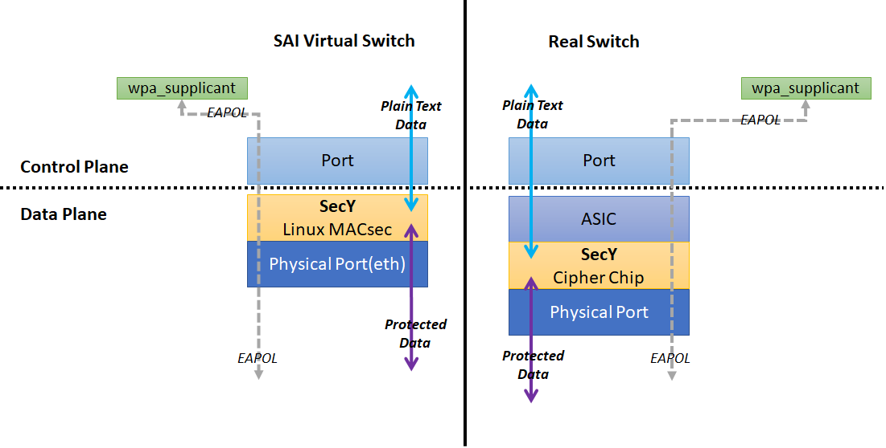
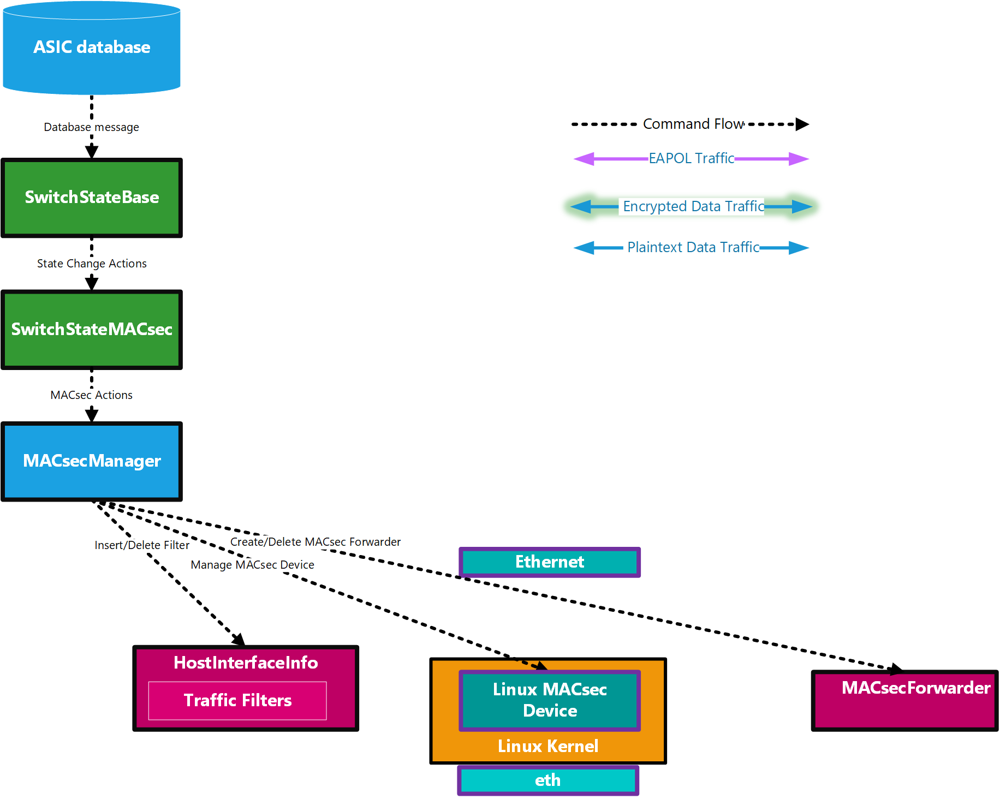
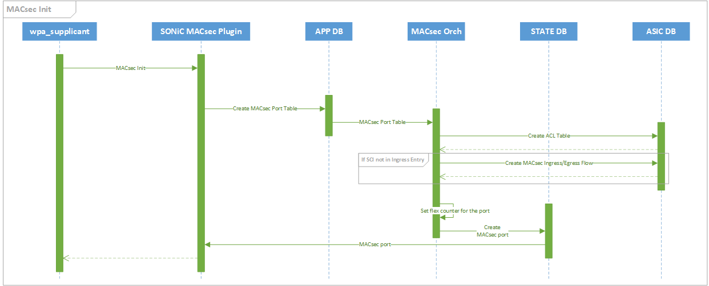
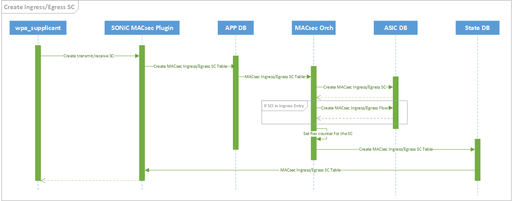
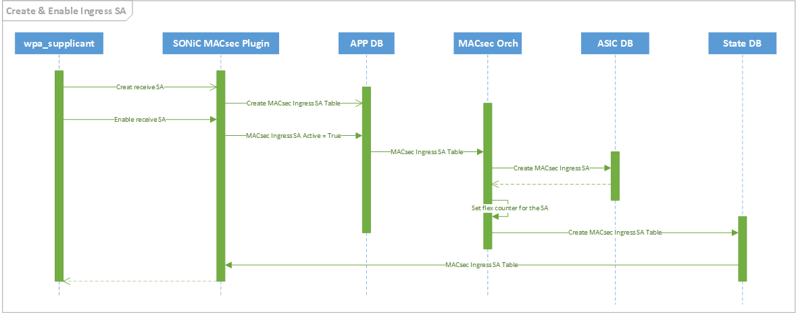
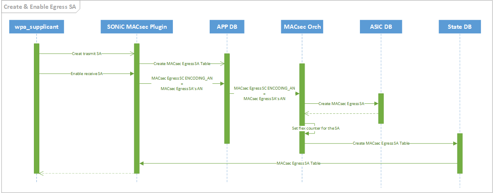
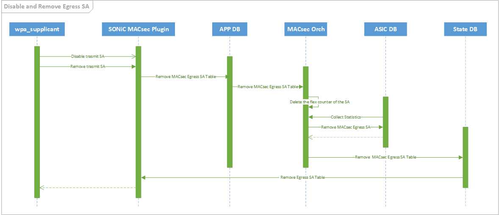
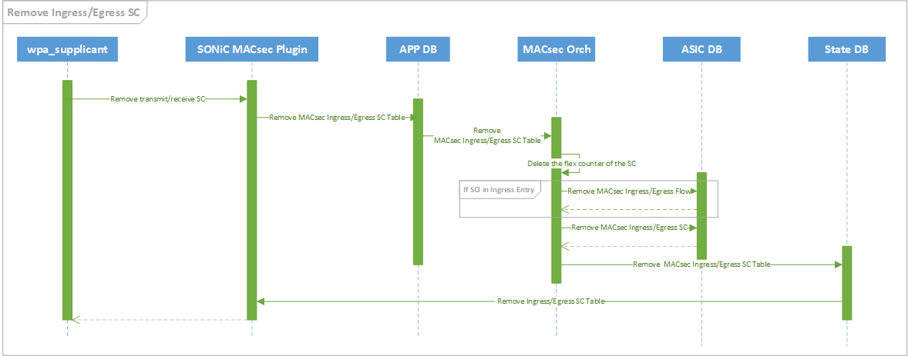
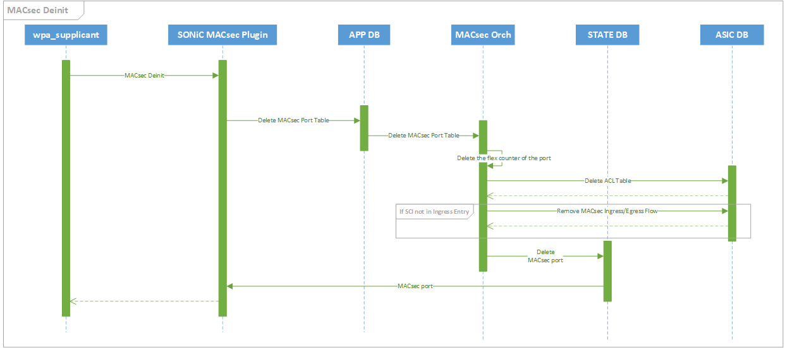

<!-- omit in toc -->
# MACsec SONiC High Level Design Document

***Revision***

|  Rev  | Date  | Author | Change Description |
| :---: | :---: | :----: | ------------------ |
|  0.1  |       | Ze Gan | Initial version    |

<!-- omit in toc -->
## Table of Contents

- [About this Manual](#about-this-manual)
- [Abbreviation](#abbreviation)
- [1 Requirements Overview](#1-requirements-overview)
  - [1.1 Functional requirements](#11-functional-requirements)
    - [Phase I](#phase-i)
    - [Phase II](#phase-ii)
    - [Phase III](#phase-iii)
- [2 Architecture Design](#2-architecture-design)
- [3 Modules Design](#3-modules-design)
  - [3.1 Config DB](#31-config-db)
    - [3.1.1 MACsec Profile Table](#311-macsec-profile-table)
    - [3.1.2 Port Table](#312-port-table)
  - [3.2 App DB](#32-app-db)
    - [3.2.1 MACsec Port Table](#321-macsec-port-table)
    - [3.2.2 MACsec Egress SC Table](#322-macsec-egress-sc-table)
    - [3.2.3 MACsec Ingress SC Table](#323-macsec-ingress-sc-table)
    - [3.2.4 MACsec Egress SA Table](#324-macsec-egress-sa-table)
    - [3.2.5 MACsec Ingress SA Table](#325-macsec-ingress-sa-table)
  - [3.3 State DB](#33-state-db)
    - [3.3.1 MACsec Port Table](#331-macsec-port-table)
    - [3.3.2 MACsec Egress SC Table](#332-macsec-egress-sc-table)
    - [3.3.3 MACsec Ingress SC Table](#333-macsec-ingress-sc-table)
    - [3.3.4 MACsec Egress SA Table](#334-macsec-egress-sa-table)
    - [3.3.5 MACsec Ingress SA Table](#335-macsec-ingress-sa-table)
  - [3.4 Software Modules](#34-software-modules)
    - [3.4.1 MACsec Mgr](#341-macsec-mgr)
      - [3.4.1.1 Primary/Fallback decision](#3411-primaryfallback-decision)
      - [3.4.1.2 wpa_cli parameters list](#3412-wpa_cli-parameters-list)
      - [3.4.1.3 Enable MACsec](#3413-enable-macsec)
      - [3.4.1.4 Disable MACsec](#3414-disable-macsec)
    - [3.4.2 WPA Supplicant](#342-wpa-supplicant)
      - [3.4.2.1 Extension Parameters](#3421-extension-parameters)
      - [3.4.2.2 Extension packet number(XPN) support](#3422-extension-packet-numberxpn-support)
      - [3.4.2.3 Proactive SAK refresh](#3423-proactive-sak-refresh)
      - [3.4.2.4 Scalability Evaluation](#3424-scalability-evaluation)
    - [3.4.3 SONiC MACsec Plugin](#343-sonic-macsec-plugin)
    - [3.4.4 MACsec Orch](#344-macsec-orch)
      - [3.4.4.1 Functions](#3441-functions)
      - [3.4.4.2 Flex Counter](#3442-flex-counter)
        - [3.4.4.2.1 Counter List](#34421-counter-list)
        - [3.4.4.2.2 Interval](#34422-interval)
    - [3.4.5 virtual MACsec SAI](#345-virtual-macsec-sai)
      - [Command Flow](#command-flow)
      - [Ingress Flow](#ingress-flow)
      - [Egress Flow](#egress-flow)
      - [State Change Actions](#state-change-actions)
      - [MACsec Actions](#macsec-actions)
- [4 Flow](#4-flow)
  - [4.1 Init Port](#41-init-port)
  - [4.2 MACsec Init](#42-macsec-init)
  - [4.3 Create Ingress/Egress SC](#43-create-ingressegress-sc)
  - [4.4 Create and Enable Ingress SA](#44-create-and-enable-ingress-sa)
  - [4.5 Create and Enable Egress SA](#45-create-and-enable-egress-sa)
  - [4.6 Disable and Remove Egress SA](#46-disable-and-remove-egress-sa)
  - [4.7 Disable and Remove Ingress SA](#47-disable-and-remove-ingress-sa)
  - [4.8 Remove Ingress/Egress SC](#48-remove-ingressegress-sc)
  - [4.9 MACsec Deinit](#49-macsec-deinit)
  - [4.10 Deinit Port](#410-deinit-port)

## About this Manual

This document provides general information about the MACsec feature implementation in SONiC.

## Abbreviation

| Abbreviation | Description                                  |
| ------------ | -------------------------------------------- |
| CA           | Secure Connectivity Association              |
| CAK          | Secure Connectivity Association Key          |
| CKN          | Secure Connectivity Association Key Name     |
| EAPOL        | Extensible Authentication Protocol over LANs |
| KaY          | MAC Security Key Agreement Entity            |
| MKA          | MACsec Key Agreement protocol                |
| SA           | Secure Association                           |
| SAK          | Secure Association Key                       |
| SC           | Secure Channel                               |
| SCI          | Secure Channel Identifier                    |
| XPN          | Extension Packet Number                      |
| SecY         | MACsec Security Entity                       |

## 1 Requirements Overview

### 1.1 Functional requirements

This section describes the SONiC requirements for MACsec primary feature.

At a high level the following should be supported:

#### Phase I

- MACsec can be enabled at a specified [port](https://github.com/Azure/SONiC/wiki/Configuration#port)
- MACsec can co-work with the [port channel](https://github.com/Azure/SONiC/wiki/Configuration#port-channel)
- Support Cipher: GCM-AES-128 and GCM-AES-256
- Secure Association Key(SAK) can be replaced without service outage

#### Phase II

- MACsec can support Extension packet number(XPN), which means to support Cipher Suites: GCM-AES-XPN-128 and GCM-AES-XPN-256
- SAK can be refreshed proactively.
- Primary and Fallback secure Connectivity Association Key can be supported simultaneously.
- Enable or disable the XPN feature by the wpa_cli
- Parameters of wpa_supplicant, send_sci, replay_protect, replay_window_size and rekey_period, can be updated on the fly
- CLI command `show macsec` to monitor mka session and statistics of MACsec

#### Phase III

- CLI commands to configure MACsec

## 2 Architecture Design

This chapter shows the MACsec interface stack of SAI virtual switch and real switch.

SAI virtual switch use the Linux MACsec driver as the MACsec Security Entity(SecY) to support the functionality of MACsec and the SecY is imposed on the physical port.

Real switch use the cipher chip as SecY which will also be imposed on physical interface. But the ASIC of the switch is located between the Port and the SecY.

In all scenarios, both virtual and real switch, the IP address will be assigned to the Port. The MKA protocol traffics, EAPOL packets, sent by wpa_supplicant directly use the Port as the egress/ingress port. All traffics, except EAPOL packets, transmitted on the Port will be encrypted by SecY and then these traffics will be put to the physical port for transmission. While all traffics, except EAPOL packets, received on the physical port will be validated and decrypted and then these traffics will be delivered to the Port or discarded if the validation fails.

  

## 3 Modules Design

The following figure depicts the data flow and related components of MACsec. Different colored boxes indicate the components that belong to different containers or spaces. The following paragraph only lists the necessary components that are needed by the functionality of MACsec.

- The orange means these components belong to MACsec container. This container include the control plane of MACsec that include MACsec enable/disable, MACsec session negotiation and key exchange. And it consists of daemons, MACsecMgr and wpa_supplicant, and a tool, wpa_cli. Meanwhile MACsec container should be running after SWSS container start, because MACsec feature depends on the Orchagent that interacts with MACsec SAI for the management of SecY.
  - **MACsecMgr** controls the availability of MACsec on specified interfaces by using wpa_cli commands to communicate with wpa_supplicant daemon.
  - **wpa_supplicant** uses the MKA protocol to manage the MACsec session and key exchange in MACsec control plane. It calls the predefined MACsec plugin APIs to communicate with SONiC MACsec plugin.
  - **SONiC MACsec Plugin** is a plugin of wpa_supplicant that follows the predefined APIs of wpa_supplicant. It is responsible for bi-directional conversion of the MACsec parameters and SONiC database entries.

- The green means these components are in SWSS container. This container uses the SAI APIs to control the MACsec security entities(SecY) according to databases entries and to synchronize the statistics from SecY to COUNTERS_DB.
  - **MACsecOrch** is a module of orchagent, that uses SAI APIs to manage the SecY according to messages from databases and synchronized the statistics of SecY to COUNTERS_DB.

- The blue boxes are MACsecSAI in Switch SYNCD(syncd) container or GEARBOX SYNCD(gbsyncd) container. MACsecSAI is a set of [APIs](https://github.com/opencomputeproject/SAI/blob/master/inc/saimacsec.h) that are defined to communicate with the SecY. MACsec function can be installed in Switch ASIC or Gearbox ASIC. If the MACsec function is installed in Switch ASIC, MACsecSAI in Switch syncd is responsible for SecY management. Alternatively, if the MACsec function is enabled in Gearbox, all MACsec functions will be handed over by MACsecSAI in Gearbox SYNCD. For the real switch, the SAI will be provided by the vendor of the cipher chip. But for the SAI virtual switch scenario, we leverage the model of MACsec in Switch ASIC. It means MACsec management will be handled by virtual SAI in syncd and it will use the [ip-macsec](https://man7.org/linux/man-pages/man8/ip-macsec.8.html) to manage Linux MACsec driver.

- The yellow one is Linux MACsec Driver (<https://github.com/torvalds/linux/blob/master/drivers/net/macsec.c>) running in the kernel space, which will only be used in SAI virtual switch and be managed by ip commands.

- The gray one is MACsec cipher chip which will only be used in real switch and be provided by the vendor.

  

### 3.1 Config DB

The following new tables will be added to Config DB. Unless otherwise stated, the attributes are mandatory.

#### 3.1.1 MACsec Profile Table

``` rfc5234
MACSEC_PROFILE|{{profile}}
    "priority":{{priority}} (OPTIONAL)
    "cipher_suite":{{cipher_suite}}
    "primary_cak":{{primary_cak}}
    "primary_ckn":{{primary_ckn}}
    "fallback_cak":{{fallback_cak}} (OPTIONAL)
    "fallback_ckn":{{fallback_ckn}} (OPTIONAL)
    "policy":{{policy}} (OPTIONAL)
    "enable_replay_protect":{{true|false}} (OPTIONAL)
    "replay_window":{{replay_window}} (OPTIONAL)
    "send_sci":{{true|false}} (OPTIONAL)
    "rekey_period":{{rekey_period}} (OPTIONAL)

; Defines schema for MACsec profile configuration attributes
key                         = MACSEC_PROFILE:name      ; MACsec profile configuration
; field                     = value
priority                    = DIGITS                   ; For Key server election.
                                                       ; In 0-255 range with 0 being the highest priority
                                                       ; Default 255
cipher_suite                = "GCM-AES-128" / "GCM-AES-256" / "GCM-AES-XPN-128" / "GCM-AES-XPN-256"
                                                       ; The cipher suite for MACsec.
                                                       ; Default GCM-AES-128 if this filed not exist
primary_cak                 = 32HEXDIG / 64HEXDIG      ; Primary Connectivity Association Key
primary_ckn                 = 64HEXDIG                 ; Primary CAK Name
fallback_cak                = 32HEXDIG / 64HEXDIG      ; Fallback Connectivity Association Key
fallback_ckn                = 64HEXDIG                 ; Fallback CAK Name
policy                      = "integrity_only" / "security"
                                                       ; MACsec policy.
                                                       ; INTEGRITY_ONLY: All traffics, except EAPOL, will be
                                                       ; converted to MACsec packets without encryption.
                                                       ; SECURITY: All traffics, except EAPOL, will be
                                                       ; encrypted by SecY.
                                                       ; Default security
enable_replay_protect       = "true" / "false"         ; Whether enable replay protect. Default false
replay_window               = DIGITS                   ; Replay window size that is the number of
                                                       ; packets that could be out of order. This filed
                                                       ; works only if ENABLE_REPLAY_PROTECT is true.
                                                       ; Default 0 which means no replay window and
                                                       ; strict check. The maximum is 2^32-1
send_sci                    = "true" / "false"         ; Whether send SCI. Default true
rekey_period                = DIGITS                   ; The period of proactively refresh (Unit second).
                                                       ; Default 0 which means never proactive refresh SAK.
; The profile cannot be deleted if it has been used by a port.
```

#### 3.1.2 Port Table

``` rfc5234
PORT|{{port_name}}
    "macsec":{{profile}} (OPTIONAL)

; Defines schema for MACsec profile configuration attributes
key                         = PORT:name               ; Interface name
; field                     = value
macsec                      = profile                 ; MACsec profile name. if this filed is empty or isn't existed,
                                                      ; the MACsec function is disable.
```

### 3.2 App DB

Fellowing new tables would be introduced to specify the MACsec parameters, SCs and SAs at the target port.

#### 3.2.1 MACsec Port Table

``` rfc5234
"MACSEC_PORT":{{port_name}}
    "enable":{{true|false}}
    "cipher_suite":{{cipher_suite}}
    "enable_encrypt":{{true|false}}
    "enable_replay_protect":{{true|false}}
    "replay_window":{{replay_window}}
    "send_sci":{{true|false}}

; Defines schema for MACsec port table attributes
key                         = MACSEC_PORT:name         ; MACsec port name
; field                     = value
enable                      = "true" / "false"         ; Whether enable this port
cipher_suite                = "GCM-AES-128" / "GCM-AES-256" / "GCM-AES-XPN-128" / "GCM-AES-XPN-256"
                                                       ; The cipher suite for MACsec.
enable_encrypt              = "true" / "false"         ; Whether encrypt the traffic
; Field, ENABLE_ENCRYPT, depends on the filed POLICY in MACSEC PROFILE TABLE of Config DB,
; policy = integrity_only ENABLE_ENCRYPT = false
; policy = security       ENABLE_ENCRYPT = true
enable_replay_protect       = "true" / "false"         ; Whether enable replay protect.
replay_window               = DIGITS                   ; Replay window size that is the number of
                                                       ; packets that could be out of order.
send_sci                    = "true" / "false"         ; Whether send SCI.
```

#### 3.2.2 MACsec Egress SC Table

``` rfc5234
"MACSEC_EGRESS_SC":{{port_name}}:{{sci}}
    "encoding_an":{{an}}

; Defines schema for MACsec Egress SC table attributes
key            = MACSEC_EGRESS_SC:port_name:sci     ; MACsec SC identifier
; field        = value
encoding_an    = DIGIT                              ; 0 to 3, the current transmit SA number.
                                                    ; Default 0.
; sci and encoding_an will be generated by KaY which is running in the wpa_supplicant.
; The sci of egress SC should be same as one of the sci of ingress SCs on the participants.
```

#### 3.2.3 MACsec Ingress SC Table

``` rfc5234
"MACSEC_INGRESS_SC":{{port_name}}:{{sci}}
    "Null": "Null"

; Defines schema for MACsec Ingress SC table attributes
key            = MACSEC_INGRESS_SC:port_name:sci    ; MACsec SC identifier
; field        = value
Null           = Null                               ; placeholder
; sci will be generated by KaY which is running in the wpa_supplicant.
; The sci of ingress SC should be same as one of the sci of egress SC on the participants.
```

#### 3.2.4 MACsec Egress SA Table

``` rfc5234
"MACSEC_EGRESS_SA":{{port_name}}:{{sci}}:{{an}}
    "sak":{{sak}}
    "auth_key":{{hash_subkey}}
    "next_pn":{{pn}}
    "salt":{{salt}}
    "ssci":{{ssci}}

; Defines schema for MACsec Egress SA table attributes
key           = MACSEC_EGRESS_SA:port_name:sci:an   ; MACsec SA identifier
; field       = value
sak           = 32HEXDIG / 64HEXDIG                 ; Secure Association Key.
                                                    ; Default 128 bit,
                                                    ; but if XPN enable, 256 bit
auth_key      = 32HEXDIG                            ; The hash subkey in AES-GCM
                                                    ; It's derived from SAK
next_pn       = DIGITS                              ; 1 to 2^32-1, the initialized next packet number
salt          = 24HEXDIG                            ; 96-bit parameter provided to the Current
                                                    ; Cipher Suite for subsequent protection
                                                    ; and validation operations.
                                                    ; Only available if XPN enable
ssci           = 8HEXDIG                            ; 32-bit value that is unique for each SCI
                                                    ; using a given SAK.
                                                    ; Only available if XPN enable
```

#### 3.2.5 MACsec Ingress SA Table

``` rfc5234
"MACSEC_INGRESS_SA":{{port_name}}:{{sci}}:{{an}}
    "active":{{true|false}}
    "sak":{{sak}}
    "auth_key":{{hash_subkey}}
    "lowest_acceptable_pn":{{pn}}
    "salt":{{salt}}
    "ssci":{{ssci}}

; Defines schema for MACsec Ingress SA table attributes
key                   = MACSEC_INGRESS_SA:port_name:sci:an  ; MACsec SA identifier
; field               = value
active                = "true" / "false"                    ; Whether this SA is available, Default False.
sak                   = 32HEXDIG / 64HEXDIG                 ; Secure Association Key.
                                                            ; Default 128 bit,
                                                            ; but if XPN enable, 256 bit
auth_key              = 32HEXDIG                            ; The hash subkey in AES-GCM
                                                            ; It's derived from SAK
lowest_acceptable_pn  = DIGITS                              ; 1 to 2^32-1, the lowest acceptable packet number
salt                  = 24HEXDIG                            ; 96-bit parameter provided to the Current
                                                            ; Cipher Suite for subsequent protection
                                                            ; and validation operations.
                                                            ; Only available if XPN enable
ssci           = 8HEXDIG                                    ; 32-bit value that is unique for each SCI
                                                            ; using a given SAK.
                                                            ; Only available if XPN enable
```

### 3.3 State DB

#### 3.3.1 MACsec Port Table

``` rfc5234
"MACSEC_PORT"|{{port_name}}
    "state":{{ok}}

; Defines schema for MACsec Port table attributes
key          = MACSEC_PORT:port_name  ; Port name
; field      = value
state        = "ok"              ; The MACsec port is ready to configure
```

#### 3.3.2 MACsec Egress SC Table

``` rfc5234
"MACSEC_EGRESS_SC"|{{port_name}}|{{sci}}
    "state":{{ok}}

; Defines schema for MACsec Egress SC table attributes
key          = MACSEC_EGRESS_SC:port_name:sci     ; MACsec SC identifier
; field      = value
state        = "ok"                          ; The MACsec SC has been created
```

#### 3.3.3 MACsec Ingress SC Table

``` rfc5234
"MACSEC_INGRESS_SC"|{{port_name}}|{{sci}}
    "state":{{ok}}

; Defines schema for MACsec Ingress SC table attributes
key          = MACSEC_INGRESS_SC:port_name:sci    ; MACsec SC identifier
; field      = value
state        = "ok"                          ; The MACsec SC has been created
```

#### 3.3.4 MACsec Egress SA Table

``` rfc5234
"MACSEC_EGRESS_SA"|{{port_name}}|{{sci}}|{{an}}
    "state":{{ok}}

; Defines schema for MACsec Port table attributes
key          = MACSEC_EGRESS_SA:port_name:sci:an   ; MACsec SA identifier
; field      = value
state        = "ok"                           ; The MACsec SA has been enabled
```

#### 3.3.5 MACsec Ingress SA Table

``` rfc5234
"MACSEC_INGRESS_SA"|{{port_name}}|{{sci}}|{{an}}
    "state":{{ok}}

; Defines schema for MACsec Port table attributes
key          = MACSEC_INGRESS_SA:port_name:sci:an  ; MACsec SA identifier
; field      = value
state        = "ok"                           ; The MACsec SA has been enabled
```

### 3.4 Software Modules

#### 3.4.1 MACsec Mgr

MACsecMgr is a daemon in MACsec container, that receives the message from CONFIG DB and uses wpa_cli instructions to manage the functionality of MACsec in the specified port.
The below figure is the flow chart of MACsecMgr which shows the MACsec profile management according to MACsec Profile Table and the functionality of MACsec in the specified port according to PortTable.

  

##### 3.4.1.1 Primary/Fallback decision

TODO

##### 3.4.1.2 wpa_cli parameters list

The following parameters will be used by the wpa_cli to communicate with the wpa_supplicant for MACsec configuration.

|       Parameter       | Hot Update | Description                                                                                                                                                                          |
| :-------------------: | :--------: | ------------------------------------------------------------------------------------------------------------------------------------------------------------------------------------ |
|      DOMAIN_SOCK      |     N      | Domain socket for communication with wpa_supplicant.                                                                                                                                 |
|         PORT          |     N      | The specified port name.                                                                                                                                                             |
|       CONFNAME        |     N      | Config file path. When using MACsec, the following parameters should be set <br> eapol_version=3 <br> ap_scan=0                                                                      |
|      NETWORK_ID       |     N      | The Identifier of network at this port                                                                                                                                               |
|          CAK          |     N      | The Secure Connectivity Association Key. <br> This value is the value PRIMARY_CAK in MACsec profile table of CONFIG DB.                                                              |
|          CKN          |     N      | The CAK Name. <br> This value is the value PRIMARY_CKN in MACsec profile table of CONFIG DB.                                                                                         |
|       PRIORITY        |     N      | Priority of MKA Actor <br> This value is the value PRIORITY in MACsec profile table of CONFIG DB.                                                                                    |
|     CIPHER_SUITE      |     N      | Hasn't been implemented                                                                                                                                                              |
|    ENABLE_ENCRYPT     |     N      | IEEE 802.1X/MACsec transmit mode <br> 0: Encrypt traffics (default) <br> 1: Integrity only <br> This value is set according to the value POLICY in MACsec profile table of CONFIG DB |
| ENABLE_REPLAY_PROTECT |     Y      | IEEE 802.1X/MACsec replay protection <br> This value is set according to the value ENABLE_REPLAY_PROTECT in MACsec profile table of CONFIG DB                                        |
|     REPLAY_WINDOW     |     Y      | IEEE 802.1X/MACsec replay protection window <br> 0: No replay window, strict check (default) <br> This value is the value PRIORITY in REPLAY_WINDOW profile table of CONFIG DB.      |
|       SEND_SCI        |     Y      | Hasn't been implemented                                                                                                                                                              |

***Hot update : The parameter can be updated on the fly. This feature should be patched on wpa_supplicant***

##### 3.4.1.3 Enable MACsec

``` bash
# Enable SONiC MACsec driver at the port. It is the physical port in the interface stack
wpa_cli -g{{DOMAIN_SOCK}} interface_add {{PORT}} {{CONFNAME}} macsec_sonic

# Add a network at the port and get the Network Id according from this instruction
wpa_cli -g{{DOMAIN_SOCK}} IFNAME={{PORT}} add_network

# Set Key management. Use preshared key
wpa_cli -g{{DOMAIN_SOCK}} IFNAME={{PORT}} set_network {{NETWORK_ID}} key_mgmt NONE

# Set IEEE 802.1X/EAPOL options. When using wired authentication (including MACsec drivers), eapol_flags must be set to 0.
wpa_cli -g{{DOMAIN_SOCK}} IFNAME={{PORT}} set_network {{NETWORK_ID}} eapol_flags 0

 # Set the macsec policy. The value 1 means Should secure, accept key server's advice to determine whether to use a secure session or not.
wpa_cli -g{{DOMAIN_SOCK}} IFNAME={{PORT}} set_network {{NETWORK_ID}} macsec_policy 1

# Set the transmit mode
wpa_cli -g{{DOMAIN_SOCK}} IFNAME={{PORT}} set_network {{NETWORK_ID}} macsec_integ_only {{ENABLE_ENCRYPT}}

# Set the Secure Connectivity Association Key
wpa_cli -g{{DOMAIN_SOCK}} IFNAME={{PORT}} set_network {{network_id}} mka_cak {{CAK}}

# Set the CAK Name
wpa_cli -g{{DOMAIN_SOCK}} IFNAME={{PORT}} set_network {{network_id}} mka_ckn {{CKN}}

# Set the priority of MKA actor
wpa_cli -g{{DOMAIN_SOCK}} IFNAME={{PORT}} set_network {{network_id}} mka_priority {{PRIORITY}}

# Set replay protect flag
wpa_cli -g{{DOMAIN_SOCK}} IFNAME={{PORT}} set_network {{network_id}} macsec_replay_protect {{ENABLE_REPLAY_PROTECT}}

# Set replay protect window size
wpa_cli -g{{DOMAIN_SOCK}} IFNAME={{PORT}} set_network {{network_id}} macsec_replay_window {{REPLAY_WINDOW}}

# Enable the network
wpa_cli -g{{DOMAIN_SOCK}} IFNAME={{PORT}} enable_network {{network_id}}
```

##### 3.4.1.4 Disable MACsec

``` bash
# Disable MACsec driver at the port
wpa_cli -g{{DOMAIN_SOCK}} interface_remove {{PORT}}
```

#### 3.4.2 WPA Supplicant

Wpa_supplicant(<https://salsa.debian.org/debian/wpa>) is Wi-Fi Protected Access client and IEEE 802.1X(MACsec) supplicant. A single instance of wpa_supplicant is able to manage multiple MACsec channels. Wpa_supplicant will be managed by supervisor in the macsec container as a daemon. Start command is `wpa_supplicant -Dmacsec_sonic -g{{DOMAIN_SOCK}}`.
The first parameter, `macsec_sonic`, indicates that the SONiC MACsec plugin is used.This parameter should be declared at SONiC MACsec Plugin.
The second parameter, `DOMAIN_SOCK`, indicates the position of domain sock, that will be used to interact with wpa_cli.
The details of SONiC MACsec plugin will be mentioned at chapter [3.4.3 SONiC MACsec Plugin](#343-sonic-macsec-plugin).

##### 3.4.2.1 Extension Parameters

The following parameters should be extended in wpa_supplicant to support SONiC MACsec requirements.
| Parameter    |
| ------------ |
| CIPHER_SUITE |
| SEND_SCI     |

##### 3.4.2.2 Extension packet number(XPN) support

TODO

##### 3.4.2.3 Proactive SAK refresh

The wpa_supplicant should be able proactively refresh SAK according to a specified interval.

##### 3.4.2.4 Scalability Evaluation

***Testbed configuration : OS (Ubuntu 18.04.4 LTS), CPU(Intel(R) Xeon(R) CPU E5-2698 v3 @ 2.30GHz), Memory(256G DDR4 2133 MHz) and wpa_supplicant(version 2.9)***

The experiments designed to evaluate the scalability of wpa_supplicant, are using the veth-pair interfaces to simulate the physical ports and using the Linux network namespace to simulate different switches. The MACsec interfaces were bound on the veth-pair interfaces and assigned IP address for connectivity checking. The RSS of `ps` command is as the index of memory usage of one wpa_supplicant.

- One wpa_supplicant to multiple interfaces

In this experiment, all interfaces were set by wpa_cli and were managed by one supplicant instance. The goal of the experiment is to get the maximum number of interfaces that a wpa_supplicant can handle and the memory usage of a wpa_supplicant.

| Number of interfaces | Memory usage of one wpa_supplicant (MB) | Average memory usage of per interface (MB) |
| -------------------: | --------------------------------------: | -----------------------------------------: |
|                   20 |                                       9 |                                        0.5 |
|                  200 |                                     164 |                                       0.82 |

The wpa_supplicant process raise an exception, `*** buffer overflow detected ***: ./wpa_supplicant terminated`, if the number of interface exceed 202 in the testbed.

- One wpa_supplicant to one interfaces

In this experiment, each interface was managed by one wpa_supplicant instance. The goal of the experiment is to get the memory usage of a wpa_supplicant.

| Number of interfaces | Total memory usage of all wpa_supplicants (MB) | Memory usage of per wpa_supplicant (MB) |
| -------------------: | ---------------------------------------------: | --------------------------------------: |
|                   20 |                                             76 |                                     3-5 |
|                  200 |                                            981 |                                     4-6 |
|                 2000 |                                          23292 |                                    9-13 |

Although to use solution, one wpa_supplicant to multiple interfaces, take less memory, SONiC MACsec will choose solution two, One wpa_supplicant to one interfaces. Because:

1. The number of interfaces of a switch often doesn't exceed 200, the memory usage isn't insensitive to the switch.
2. To use multiple wpa_supplicant instances can improve the robustness.

#### 3.4.3 SONiC MACsec Plugin

SONiC MACsec Plugin is a plugin of wpa_supplicant, that does conversion between MACsec Control instructions and SONiC DB operations.

The following list all MACsec control instructions:

|       Instructions       | SONiC DB operations                                                                                       | Note                                                                                                                               |
| :----------------------: | --------------------------------------------------------------------------------------------------------- | ---------------------------------------------------------------------------------------------------------------------------------- |
|           init           |                                                                                                           | Configure the port to receive EAPOL packets                                                                                        |
|          deinit          |                                                                                                           | Recover the original configuration, reject EAPOL packets , at the port                                                             |
|       macsec_init        | SET APP_DB[MACSEC_PORT]=PARAM<br>SET APP_DB[MACSEC_PORT:ENABLE] = FALSE<br>WAIT SET STATE_DB[MACSEC_PORT] | Initialize MACsec context for the port.                                                                                            |
|      macsec_deinit       | DEL APP_DB[MACSEC_PORT]<br>WAIT DEL STATE_DB[MACSEC_PORT]                                                 | Deinitialize MACsec context for the port.                                                                                          |
|  enable_protect_frames   | SET APP_DB[MACSEC_PORT:ENABLE_PROTECT]=PARAM                                                              | Enable traffics protection                                                                                                         |
|      enable_encrypt      | SET APP_DB[MACSEC_PORT:ENABLE_ENCRYPT]=PARAM                                                              |                                                                                                                                    |
|    set_replay_protect    | SET APP_DB[MACSEC_PORT:ENABLE_REPLAY_PROTECT]=PARAM<br>SET APP_DB[MACSEC_PORT:REPLAY_WINDOW]=PARAM        |                                                                                                                                    |
| set_current_cipher_suite |                                                                                                           | Has not been implemented in wpa_supplicant                                                                                         |
|  enable_controlled_port  | SET APP_DB[MACSEC_PORT:ENABLE]=PARAM                                                                      | Enable MACsec port for traffics forwarding. if the controlled port was disabled, only EAPOL traffics can pass the controlled port. |
|  get_receive_lowest_pn   | GET COUNTERS_DB[sai_macsec_sa_attr_t:SAI_MACSEC_SA_ATTR_MINIMUM_XPN]                                      |                                                                                                                                    |
|  set_receive_lowest_pn   | SET APP_DB[MACSEC_INGRESS_SA:LOWEST_ACCEPTABLE_PN]=PARAM                                                  |                                                                                                                                    |
|   get_transmit_next_pn   | GET COUNTERS_DB[sai_macsec_sa_attr_t:SAI_MACSEC_SA_ATTR_XPN]                                              |                                                                                                                                    |
|   set_transmit_next_pn   | SET APP_DB[MACSEC_EGRESS_SA:NEXT_PN]                                                                      |                                                                                                                                    |
|    create_receive_sc     | SET APP_DB[MACSEC_INGRESS_SC]<br>WAIT SET STATE_DB[MACSEC_INGRESS_SC]                                     |                                                                                                                                    |
|    delete_receive_sc     | DEL APP_DB[MACSEC_INGRESS_SC]<br>WAIT DEL STATE_DB[MACSEC_INGRESS_SC]                                     |                                                                                                                                    |
|    create_receive_sa     | SET APP_DB[MACSEC_INGRESS_SA]                                                                             |                                                                                                                                    |
|    delete_receive_sa     | DEL APP_DB[MACSEC_INGRESS_SA]<br>WAIT DEL STATE_DB[MACSEC_INGRESS_SA]                                     |                                                                                                                                    |
|    enable_receive_sa     | SET APP_DB[MACSEC_INGRESS_SA:ACTIVE]=TRUE<br>WAIT SET STATE_DB[MACSEC_INGRESS_SA]                         |                                                                                                                                    |
|    disable_receive_sa    | SET APP_DB[MACSEC_INGRESS_SA:ACTIVE]=FALSE                                                                |                                                                                                                                    |
|    create_transmit_sc    | SET APP_DB[MACSEC_EGRESS_SC:ENCODING_AN]=0<br>WAIT SET STATE_DB[MACSEC_EGRESS_SC]                         | 0 is the default encoding AN                                                                                                       |
|    delete_transmit_sc    | DEL APP_DB[MACSEC_EGRESS_SC]<br>WAIT DEL STATE_DB[MACSEC_EGRESS_SC]                                       |                                                                                                                                    |
|    create_transmit_sa    | SET APP_DB[MACSEC_EGRESS_SA]                                                                              |                                                                                                                                    |
|    delete_transmit_sa    | DEL APP_DB[MACSEC_EGRESS_SA]<br>WAIT DEL STATE_DB[MACSEC_EGRESS_SA]                                       |                                                                                                                                    |
|    enable_transmit_sa    | SET APP_DB[MACSEC_EGRESS_SC:ENCODING_AN]=PARAM<br>WAIT SET STATE_DB[MACSEC_EGRESS_SA]                     |                                                                                                                                    |
|   disable_transmit_sa    |                                                                                                           |                                                                                                                                    |

***WAIT : To subscribe the target table and to use the select operation to query the expected message***

#### 3.4.4 MACsec Orch

The MACsecOrch is introduced in the Orchagent to handle configuration requests. It monitors MACsec related tables in APP DB and convert those messages to SAI commands to manage the MACsec object. All MACsec SAI APIs are defined at (<https://github.com/opencomputeproject/SAI/blob/master/inc/saimacsec.h>).

##### 3.4.4.1 Functions

The following are all functions that MACsec Orch need to implement.

- Enable MACsec
  1. Monitor the SET message from the MACsec Port Table in APP DB
  2. Create ingress/egress MACsec ports
  3. Create ingress/egress MACsec ACL tables
  4. Create an ACL entry to permit EAPOL packets to 802.1x destination MAC address
  5. Create an ACL entry to drop packets (to be later used for macsec_flow), If PROTECT_ENABLE. Otherwise, not drop
  6. Bind the ingress/egress ACL tables to the ingress/egress MACsec ports
  7. Set Flex counter of MACsec port stats
  8. Set State DB

- Disable MACsec
  1. Monitor the DEL message from the MACsec Port Table in APP DB
  2. Delete Flex counter of MACsec port stats
  3. Unbind the ingress/egress ACL tables from the ingress/egress MACsec ports
  4. Delete the ingress/egress ACL tables
  5. Delete the ingress/egress MACsec ports
  6. Del State DB

- Create SC
  1. Monitor the SET message from the MACsec Ingress/Egress SC Table in APP DB
  2. Create ingress/egress MACsec flow
  3. Create ingress/egress MACsec SC
  4. Set Flex counter of MACsec SC and flow stats

- Delete SC
  1. Monitor the DEL message from the MACsec Ingress/Egress SC Table in APP DB
  2. Delete Flex counter of MACsec SC and MACsec flow
  3. Delete the ingress/egress MACsec SC
  4. Delete the ingress/egress MACsec SA

- Create Egress SA
  1. Monitor the SET message from the MACsec Egress SC Table
  2. A SA whose AN is equal to the ENCODING_AN of the MACsec Egress SC have been created, otherwise don't consume this message
  3. Create MACsec egress SA
  4. Set Flex Counter of MACsec SA stats

- Create Ingress SA
  1. Monitor the SET message from the MACsec Ingress SA Table
  2. The ACTIVE filed should be true, otherwise consume this message and exit this process
  3. Create MACsec ingress SA
  4. Set Flex Counter of MACsec SA stats

- Delete SA
  1. Monitor the DEL message from the MACsec SA Table
  2. Delete Flex counter of MACsec SA stats
  3. Delete MACsec SA

##### 3.4.4.2 Flex Counter

###### 3.4.4.2.1 Counter List

``` rfc5234

MACsec SA Ingress Table
"MACSEC_SA_INGRESS"|{{port_name}}|{{SCI}}|{{AN}}
    "NEXT_PN":{{PN}}
    "InPktsOK":{{InPktsOK}}
    "InPktsInvalid":{{InPktsInvalid}}       # the number of the frame is not valid and validateFrames is set to Check
    "InPktsNotValid":{{InPktsNotValid}}     # the number of the frame is discarded
    "InPktsNotUsingSA":{{InPktsNotUsingSA}} # The number of the dropped frame whose SA isn't enable but the validateFrames is Strict or its C bit in the SecTAG is set (Alias : InPktsNoSAError)
    "InPktsUnusedSA":{{InPktsUnusedSA}}     # The number of the frame delivered to uncontrolled port, whose SA isn't enable because the validate frames is not Strict (Alias : InPktsNoSA)

MACsec SC Ingress Table
"MACSEC_SC_INGRESS"|{{port_name}}|{{SCI}}
    "InPktsOK":{{InPktsOK}}
    "InOctetsValidated":{{InOctetsValidated}}   # the number of octets of User Data recovered from received frames that were integrity protected but not encrypted.
    "InOctetsDecrypted":{{InOctetsDecrypted}}   # the number of octets of User Data recovered from received frames that were both integrity protected and encrypted.
    "InPktsUnchecked":{{InPktsUnchecked}}       # the number of the frame is not valid
    "InPktsDelayed":{{InPktsDelayed}}           # the number of the frame that its PN is less than the lowest acceptable PN
    "InPktsInvalid":{{InPktsInvalid}}           # the number of the frame is not valid and validateFrames is set to Check
    "InPktsNotValid":{{InPktsNotValid}}         # the number of the frame is discarded
    "InPktsLate":{{InPktsLate}}                 # the number of the frame that its PN is less than the lowest acceptable PN. this counter will be used if replayProtect is enable
    "InPktsNotUsingSA":{{InPktsNotUsingSA}}     # The number of the dropped frame whose SA isn't enable but the validateFrames is Strict or its C bit in the SecTAG is set (Alias : InPktsNoSAError)
    "InPktsUnusedSA":{{InPktsUnusedSA}}         # The number of the frame delivered to uncontrolled port, whose SA isn't enable because the validate frames is not Strict (Alias : InPktsNoSA)

MACsec SA Egress Table
"MACSEC_SA_EGRESS"|{{port_name}}|{{SCI}}|{{AN}}
    "NEXT_PN":{{PN}}
    "OutPktsProtected":{{OutPktsProtected}}   # the number of the frame that was only protected(without encrypted)
    "OutPktsEncrypted":{{OutPktsEncrypted}}   # the number of the encrypted frame

MACsec SC Egress Table
"MACSEC_SC_EGRESS"|{{port_name}}|{{SCI}}
    "OutPktsProtected":{{OutPktsProtected}}     # the number of the frame that was only protected(without encrypted)
    "OutPktsEncrypted":{{OutPktsEncrypted}}     # the number of the encrypted frame
    "OutOctetsProtected":{{OutOctetsProtected}} # the number of octets of User Data in transmitted frames that were integrity protected but not encrypted.
    "OutOctetsEncrypted":{{OutOctetsEncrypted}} # the number of octets of User Data in transmitted frames that were both integrity protected and encrypted.

MACsec SECY Table
"MACSEC_SECY"|{{port_name}}
    "OutPktsUntagged":{{OutPktsUntagged}}   # the number of the transmitted frame without protection
    "InPktsUntagged":{{InPktsUntagged}}     # the number of the received frame without protection
    "OutPktsTooLong":{{OutPktsTooLong}}     # the number of the frame whose length is larger than the max length of common port
    "InPktsNoTag":{{InPktsNoTag}}           # the number of the received frame without security tag
    "InPktsBadTag":{{InPktsBadTag}}         # the number of the received frame with bad security tag
    "InPktsUnknownSCI":{{InPktsUnknownSCI}} # the number of the received frame with unknown SCI
    "InPktsNoSCI":{{InPktsNoSCI}}           # the number of the received frame without SCI (those frames will be passed to uncontrolled port)
    "InPktsOverrun":{{InPktsOverrun}}       # the number of the received frame that was discarded because the validation capabilities of the Cipher Suite cannot support current rate

```

###### 3.4.4.2.2 Interval

Wpa_supplicant need to monitor the packet number for SAK refreshing. But if a copy of packet number delayed more than the preparation time of SAK, the requirement of SAK refreshing may not be realized by wpa_supplicant, which will cause the packet number to be exhausted.

- MPN = maximum packet number, which indicates the maximum packet number, it should be 4,294,967,295 if packet number is 32bit
- RT = refresh threshold, which indicates that the SAK should be refreshed if the packet number increases to a threshold. This number is about 75 percent of MPN.
- MPB = maximum port bandwidth, which indicates the maximum bandwidth at the port
- MMPS = minimum MACsec packet size, which indicates the minimum packet size of MACsec, it should be 44 bytes
- Preparation time of SAK = (MPN-RT) / (MPB / MMPS)

| Preparation time of SAK(s) | MPN=2^32 | MPN=2^64          |
| -------------------------- | -------- | ----------------- |
| MPB = 40Gbps               | 9.45     | 40,582,836,962.16 |
| MPB = 100Gbps              | 3.78     | 16,233,134,784.86 |

Meanwhile, the sampling period of MKA about packet number is a random interval between 0-2 seconds. It should be guaranteed that the copy of packet number can be updated and sampled within a preparation time of SAK.
So the flex counter interval is set to **1** second, which can meet the above requirement.

#### 3.4.5 virtual MACsec SAI

This section describes the design of MACsec SAI in virtual SAI that runs in the syncd. The following pictures illustrate the architecture of virtual MACsec SAI.
All boxes with black edge are components of virtual SAI and all boxes with purple edge are network devices of linux.

- **SwitchStateMACsec** convert the state change action from SwitchStateBase to MACsecManager
- **MACsecManager** execute `ip` command to manage Linux MACsec Device and to insert or delete MACsec filter to HostInterfaceInfo to control the traffic forwarding strategy.
- **Traffic Filters** includes MACsec filter that can forward EAPOL traffic between `eth` device and `Ethernet` device, and forward plaintext data traffic from `Ethernet` device to linux `macsec` device. This filter will be enabled only if MACsec was enabled at the port.
- **MACsec Forwarder** can forward decrypted data traffic from linux `macsec` device to `Ethernet`.

##### Command Flow

  

##### Ingress Flow

  

##### Egress Flow

  

##### State Change Actions

- Create MACsec Port
  - Insert MACsec filters into `HostInterfaceInfo` and drop all non-EAPOL traffic.
- Create MACsec (Egress) SC
  - Create MACsec device and MACsec forwarder.
- Create MACsec SA
  - Try to create MACsec SA. But if ACL entry isn't set to MACsec flow, this action will not be delivered to MACsec Manager to create MACsec SA.
- Set ACL Entry to MACsec Flow
  - Set ACL entry to MACsec flow or default action. If the action is set to MACsec flow, it should notify MACsecManager to create MACsec SAs under the corresponding MACsec flow. Otherwise to notify MACsecManager to delete all MACsec SAs under this flow.
- Remove MACsec Port
  - Remove MACsec filters from `HostInterfaceInfo`.
- Remove MACsec SC
  - Remove MACsec forwarder and MACsec device.
- Remove MACsec SA
  - If all MACsec SA in a MACsec SC have been removed, To remove the corresponding MACsec SC.
- Get MACsec SA packet number

##### MACsec Actions

- Crate MACsec Port
  - `ip link add link <VETH_NAME> name <MACSEC_NAME> type macsec sci <SCI>`
  - `ip link set dev <MACSEC_NAME> up`
- Create MACsec Ingress SC
  - `ip macsec add <MACSEC_NAME> rx sci <SCI>`
- Create MACsec Ingress SA
  - `ip macsec add <MACSEC_NAME> rx sci <SCI> sa <SA> pn <PN> on key <AUTH_KEY> <SAK>`
- Create MACsec Egress SA
  - `ip macsec add <MACSEC_NAME> tx sa <AN> pn <PN> on key <AUTH_KEY> <SAK>`
  - `ip link set link <VETH_NAME> name <MACSEC_NAME> type macsec `
- Delete MACsec Port
  - `ip link del link <VETH_NAME> name <MACSEC_NAME> type macsec`
- Delete MACsec Ingress SC
  - `ip macsec set <MACSEC_NAME> rx sci <SCI> off`
  - `ip macsec del <MACSEC_NAME> rx sci <SCI>`
- Delete MACsec Ingress SA
  - `ip macsec set <MACSEC_NAME> rx sci <SCI> sa <SA> off`
  - `ip macsec del <MACSEC_NAME> rx sci <SCI> sa <SA>`
- Delete MACsec Egress SA
  - `ip macsec set <MACSEC_NAME> tx sa 0 off`
  - `ip macsec del <MACSEC_NAME> tx sa 0`
- Query MACsec SA packet number
  - `ip macsec show <macsec_dev>`

***MACsec egress sc will be automatically created/delete when the MACsec port is created/deleted***

## 4 Flow

### 4.1 Init Port

  

### 4.2 MACsec Init

  

### 4.3 Create Ingress/Egress SC

  

### 4.4 Create and Enable Ingress SA

  

### 4.5 Create and Enable Egress SA

  

### 4.6 Disable and Remove Egress SA

  

***The message, disable transmit SA, can be ignored because the transmit SA will be automatically disabled when the new transmit SA was installed.***

### 4.7 Disable and Remove Ingress SA

  

### 4.8 Remove Ingress/Egress SC

  

### 4.9 MACsec Deinit

  

### 4.10 Deinit Port

  
