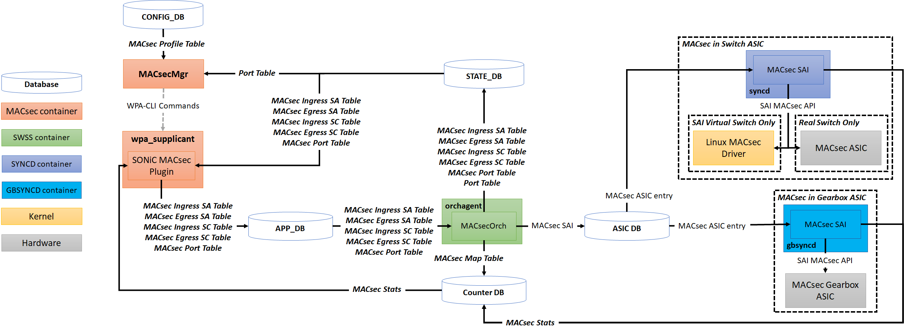
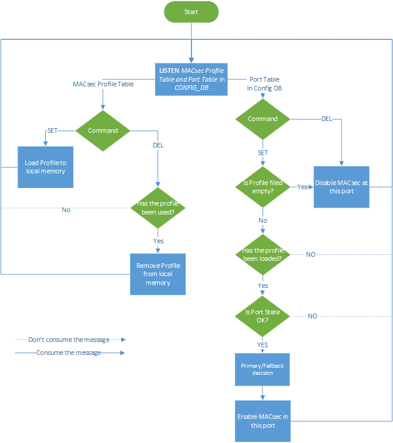

<!-- omit in toc -->
# MACsec SONiC High Level Design Document

***Revision***

|  Rev  | Date  | Author | Change Description |
| :---: | :---: | :----: | ------------------ |
|  0.1  |       | Ze Gan | Initial version    |

<!-- omit in toc -->
## Table of Contents

- [About this Manual](#about-this-manual)
- [Abbreviation](#abbreviation)
- [1 Requirements Overview](#1-requirements-overview)
  - [1.1 Functional requirements](#11-functional-requirements)
    - [Phase I](#phase-i)
    - [Phase II](#phase-ii)
    - [Phase III](#phase-iii)
- [2 Architecture Design](#2-architecture-design)
- [3 Modules Design](#3-modules-design)
  - [3.1 Config DB](#31-config-db)
    - [3.1.1 MACsec Profile Table](#311-macsec-profile-table)
    - [3.1.2 Port Table](#312-port-table)
  - [3.2 App DB](#32-app-db)
    - [3.2.1 MACsec Port Table](#321-macsec-port-table)
    - [3.2.2 MACsec Egress SC Table](#322-macsec-egress-sc-table)
    - [3.2.3 MACsec Ingress SC Table](#323-macsec-ingress-sc-table)
    - [3.2.4 MACsec Egress SA Table](#324-macsec-egress-sa-table)
    - [3.2.5 MACsec Ingress SA Table](#325-macsec-ingress-sa-table)
  - [3.3 State DB](#33-state-db)
    - [3.3.1 MACsec Port Table](#331-macsec-port-table)
    - [3.3.2 MACsec Egress SC Table](#332-macsec-egress-sc-table)
    - [3.3.3 MACsec Ingress SC Table](#333-macsec-ingress-sc-table)
    - [3.3.4 MACsec Egress SA Table](#334-macsec-egress-sa-table)
    - [3.3.5 MACsec Ingress SA Table](#335-macsec-ingress-sa-table)
  - [3.4 Software Modules](#34-software-modules)
    - [3.4.1 MACsec Mgr](#341-macsec-mgr)
      - [3.4.1.1 Primary/Fallback decision](#3411-primaryfallback-decision)
      - [3.4.1.2 wpa_cli parameters list](#3412-wpa_cli-parameters-list)
      - [3.4.1.3 Enable MACsec](#3413-enable-macsec)
      - [3.4.1.4 Disable MACsec](#3414-disable-macsec)
    - [3.4.2 WPA Supplicant](#342-wpa-supplicant)
      - [3.4.2.1 Extension Parameters](#3421-extension-parameters)
      - [3.4.2.2 Proactive SAK refresh](#3422-proactive-sak-refresh)
      - [3.4.2.3 Scalability Evaluation](#3423-scalability-evaluation)
    - [3.4.3 SONiC MACsec Plugin](#343-sonic-macsec-plugin)
    - [3.4.4 MACsec Orch](#344-macsec-orch)
      - [3.4.4.1 Functions](#3441-functions)
      - [3.4.4.2 Flex Counter Interval](#3442-flex-counter-interval)
    - [3.4.5 vMACsec SAI](#345-vmacsec-sai)
- [4 Flow](#4-flow)
  - [4.1 Init Port](#41-init-port)
  - [4.2 Init MACsec](#42-init-macsec)
  - [4.3 Create and Enable SA](#43-create-and-enable-sa)

## About this Manual

This document provides general information about the MACsec feature implementation in SONiC.

## Abbreviation

|     |                                          |
| --- | ---------------------------------------- |
| CA  | Secure Connectivity Association          |
| CAK | Secure Connectivity Association Key      |
| CAN | Secure Connectivity Association Key Name |
| SA  | Secure Association                       |
| SAK | Secure Association Key                   |
| SC  | Secure Channel                           |
| SCI | Secure Channel Identifier                |

## 1 Requirements Overview

### 1.1 Functional requirements

This section describes the SONiC requirements for MACsec primary feature.

At a high level the following should be supported:

#### Phase I

- MACsec should be supported on physical port
- Support Cipher: GCM-AES-128 and GCM-AES-256
- Secure Association Key(SAK) can be replaced without service outage

#### Phase II

- MACsec can support  Extension packet number(XPN), which means to support Cipher Suites: GCM-AES-XPN-128 and GCM-AES-XPN-256
- SAK can be refreshed proactively.
- Primary and Fallback secure Connectivity Association Key can be supported simultaneously.
- Choose the cipher suite by the wpa_cli
- A part of parameters of wpa_supplicant can be updated on the fly

#### Phase III

- CLI commands to configure MACsec

## 2 Architecture Design

This chapter shows the MACsec interface stack of virtual switch and real switch.
Virtual switch use the Linux MACsec driver to support the functionality of MACsec and the MACsec interface is imposed on Ethernet interface.  
Real switch use the ASIC chip as the MACsec Security Entity(SecY) which will be imposed on physic interface. And the ethernet port will be above the SecY.
In all scenarios, both virtual and real switch, the IP address will be assigned to the Port. All traffic, except EAPOL packets,  on the Port will be encrypted and then these traffic will be sent by Ethernet or Physical Interface. Meanwhile, all traffic, except EAPOL packets, on the physical port will be validated and decrypted and then these traffic will be delivered to Port or discarded if the validation fails.

  

## 3 Modules Design

The following figure depicts the data flow and related components of MACsec. Different colored boxes indicate the components that belong to different containers or spaces. The following paragraph only lists the necessary components that are needed by the functionality of MACsec.

- The orange means these components belong to MACsec container. This container include the control plane of MACsec that include MACsec enable/disable, MACsec session negotiation and key exchange. This container consists of daemons, MACsecMgr and wpa_supplicant, and a tool, wpa_cli.
  - **MACsecMgr** needs to control the availability of MACsec on specified interfaces by using wpa_cli commands to communicate with wpa_supplicant daemon.
  - **wpa_supplicant** uses the MKA protocol to manage the MACsec session and key exchange in MACsec control plane. It calls the predefined MACsec plugin APIs to communicate with SONiC MACsec plugin.
  - **SONiC** MACsec Plugin is a plugin of wpa_supplicant that follows the predefined APIs of wpa_supplicant. It is responsible for bi-directional conversion of the MACsec parameters and SONiC database entries.

- The green means these components are in SWSS container. This container uses the SAI APIs to control the MACsec security entities(SecY) according to databases entries and to synchronize the statistics from SecY to COUNTER_DB.
  - **MACsecOrch** is a module of orchagent, that uses SAI APIs to manage the SecY according to messages from databases and synchronized the statistics of SecY to COUNTER_DB.

- The blue one is (v)MACsecSAI in SYNCD container. (v)MACsecSAI is a serial of APIs that are defined to communicate with the real SecY. In virtual switch, the SecY is Linux MACsec driver and vMACsecSAI will use the ip commands to manage them. But in real switch, the SecY is MACsec ASIC and these APIs will be provided by the vendor of MACsec ASIC.

- The yellow one is Linux MACsec Driver (<https://github.com/torvalds/linux/blob/master/drivers/net/macsec.c>) running in the kernel space, which will only be used in virtual switch and be managed by ip commands.

- The gray one is MACsec ASIC which will only be used in real switch and be provided by the vendor.

  

### 3.1 Config DB

The following new tables will be added to Config DB. Unless otherwise stated, the attributes are mandatory.

#### 3.1.1 MACsec Profile Table

``` rfc5234
MACSEC_PROFILE|{{PROFILE}}
    "PRIORITY":{{PRIORITY}}
    "CIPHER_SUITE":{{CIPHER_SUITE}} (OPTIONAL)
    "PRIMARY_CAK":{{PRIMARY_CAK}}
    "PRIMARY_CKN":{{PRIMARY_CKN}}
    "FALLBACK_CAK":{{FALLBACK_CAK}} (OPTIONAL)
    "FALLBACK_CKN":{{FALLBACK_CKN}} (OPTIONAL)
    "POLICY":{{POLICY}}
    "ENABLE_REPLAY_PROTECT":{{TRUE|FALSE}} (OPTIONAL)
    "REPLAY_WINDOW":{{REPLAY_WINDOW}} (OPTIONAL)
    "SEND_SCI":{{TRUE|FALSE}} (OPTIONAL)
    "REKEY_PERIOD":{{REKEY_PERIOD}} (OPTIONAL)

; Defines schema for MACsec profile configuration attributes
key                         = MACSEC_PROFILE:name      ; MACsec profile configuration
; field                     = value
PRIORITY                    = DIGITS                   ; For Key server election.
                                                       ; In 0-255 range with 0 being the highest priority
CIPHER_SUITE                = "GCM-AES-128" / "GCM-AES-256" / "GCM-AES-XPN-128" / "GCM-AES-XPN-256"
                                                       ; The cipher suite for MACsec.
                                                       ; Default GCM-AES-128 if this filed not exist
PRIMARY_CAK                 = 32HEXDIG / 64HEXDIG      ; Primary Connectivity Association Key
PRIMARY_CKN                 = 64HEXDIG                 ; Primary CAK Name
FALLBACK_CAK                = 32HEXDIG / 64HEXDIG      ; Fallback Connectivity Association Key
FALLBACK_CKN                = 64HEXDIG                 ; Fallback CAK Name
POLICY                      = 0/1/2/3                  ; MACsec policy. 0: Not security,
                                                       ; 1: Only integrity checking, 3: encrypt traffic
ENABLE_REPLAY_PROTECT       = "true" / "false"         ; Whether enable replay protect. Default false
REPLAY_WINDOW               = DIGITS                   ; Replay window size that is the number of
                                                       ; packets that could be out of order. This filed
                                                       ; works only if ENABLE_REPLAY_PROTECT is true.
                                                       ; Default 0 which means no replay window and
                                                       ; strict check. The maximum is 2^32-1
SEND_SCI                    = "true" / "false"         ; Whether send SCI. Default true
REKEY_PERIOD                = DIGITS                   ; The period of proactively refresh (Unit second).
                                                       ; Default 0 which means never proactive refresh SAK.
```

#### 3.1.2 Port Table

``` rfc5234
PORT|{{port_name}}
    "MACSEC":{{PROFILE}}

; Defines schema for MACsec profile configuration attributes
key                         = PORT:name                ; Interface name
; field                     = value
MACSEC                      = profile                  ; MACsec profile name
```

### 3.2 App DB

Fellowing new tables would be introduced to specify the MACsec parameters, SCs and SAs at the target port.

#### 3.2.1 MACsec Port Table

``` rfc5234
"MACSEC_PORT"|{{port_name}}
    "ENABLE":{{TRUE|FALSE}}
    "CIPHER_SUITE":{{CIPHER_SUITE}}
    "ENABLE_PROTECT":{{TRUE|FALSE}}
    "ENABLE_ENCRYPT":{{TRUE|FALSE}}
    "ENABLE_REPLAY_PROTECT":{{TRUE|FALSE}}
    "REPLAY_WINDOW":{{REPLAY_WINDOW}}
    "SEND_SCI":{{TRUE|FALSE}}

; Defines schema for MACsec port table attributes
key                         = MACSEC_PORT:name         ; MACsec port name
; field                     = value
ENABLE                      = "true" / "false"         ; Whether enable this port
CIPHER_SUITE                = "GCM-AES-128" / "GCM-AES-256" / "GCM-AES-XPN-128" / "GCM-AES-XPN-256"
                                                       ; The cipher suite for MACsec.
ENABLE_PROTECT              = "true" / "false"         ; Whether protect the traffic
ENABLE_ENCRYPT              = "true" / "false"         ; Whether encrypt the traffic
ENABLE_REPLAY_PROTECT       = "true" / "false"         ; Whether enable replay protect.
REPLAY_WINDOW               = DIGITS                   ; Replay window size that is the number of
                                                       ; packets that could be out of order.
SEND_SCI                    = "true" / "false"         ; Whether send SCI.
```

#### 3.2.2 MACsec Egress SC Table

``` rfc5234
"MACSEC_EGRESS_SC"|{{port_name}}|{{SCI}}
    "ENCODING_AN":{{AN}}
    "SSCI":{{SSCI}}

; Defines schema for MACsec Egress SC table attributes
key            = MACSEC_EGRESS_SC:port_name:sci     ; MACsec SC identifier
; field        = value
ENCODING_AN    = DIGIT                              ; 0 to 3, the current transmit SA number.
SSCI           = 8HEXDIG                            ; 32-bit value that is unique for each SCI
                                                    ; using a given SAK.
                                                    ; Only available if XPN enable
```

#### 3.2.3 MACsec Ingress SC Table

``` rfc5234
"MACSEC_INGRESS_SC"|{{port_name}}|{{SCI}}
    "SSCI":{{SSCI}}

; Defines schema for MACsec Ingress SC table attributes
key            = MACSEC_INGRESS_SC:port_name:sci    ; MACsec SC identifier
; field        = value
SSCI           = 8HEXDIG                            ; 32-bit value that is unique for each SCI
                                                    ; using a given SAK.
                                                    ; Only available if XPN enable
```

#### 3.2.4 MACsec Egress SA Table

``` rfc5234
"MACSEC_EGRESS_SA"|{{port_name}}|{{SCI}}|{{AN}}
    "SAK":{{SAK}}
    "AUTH_KEY":{{HASH_SUBKEY}}
    "INIT_PN":{{PN}}
    "SALT":{{SALT}}

; Defines schema for MACsec Egress SA table attributes
key           = MACSEC_EGRESS_SA:port_name:sci:an   ; MACsec SA identifier
; field       = value
SAK           = 32HEXDIG / 64HEXDIG                 ; Secure Association Key.
                                                    ; Default 128 bit,
                                                    ; but if XPN enable, 258 bit
AUTN_KEY      = 32HEXDIG                            ; The hash subkey in AES-GCM
                                                    ; It's derived from SAK
INIT_PN       = DIGITS                              ; 1 to 2^32-1, the initialized next packet number
SALT          = 24HEXDIG                            ; 96-bit parameter provided to the Current
                                                    ; Cipher Suite for subsequent protection
                                                    ; and validation operations.
                                                    ; Only available if XPN enable
```

#### 3.2.5 MACsec Ingress SA Table

``` rfc5234
"MACSEC_INGRESS_SA"|{{port_name}}|{{SCI}}|{{AN}}
    "ACTIVE":{{TRUE|FALSE}}
    "SAK":{{SAK}}
    "AUTH_KEY":{{HASH_SUBKEY}}
    "LOWEST_ACCEPTABLE_PN":{{PN}}
    "SALT":{{SALT}}

; Defines schema for MACsec Ingress SA table attributes
key                   = MACSEC_INGRESS_SA:port_name:sci:an  ; MACsec SA identifier
; field               = value
ACTIVE                = "true" / "false"                    ; Whether this SA is available, Default False.
SAK                   = 32HEXDIG / 64HEXDIG                 ; Secure Association Key.
                                                            ; Default 128 bit,
                                                            ; but if XPN enable, 258 bit
AUTN_KEY              = 32HEXDIG                            ; The hash subkey in AES-GCM
                                                            ; It's derived from SAK
LOWEST_ACCEPTABLE_PN  = DIGITS                              ; 1 to 2^32-1, the lowest acceptable packet number
SALT                  = 24HEXDIG                            ; 96-bit parameter provided to the Current
                                                            ; Cipher Suite for subsequent protection
                                                            ; and validation operations.
                                                            ; Only available if XPN enable
```

### 3.3 State DB

#### 3.3.1 MACsec Port Table

``` rfc5234
"MACSEC_PORT"|{{port_name}}
    "state":{{OK}}

; Defines schema for MACsec Port table attributes
key          = MACSEC_PORT:port_name  ; Port name
; field      = value
state        = "" / "ok"              ; The MACsec port has readied to configure
```

#### 3.3.2 MACsec Egress SC Table

``` rfc5234
"MACSEC_EGRESS_SC"|{{port_name}}|{{SCI}}
    "state":{{OK}}

; Defines schema for MACsec Egress SC table attributes
key          = MACSEC_EGRESS_SC:port_name:sci     ; MACsec SC identifier
; field      = value
state        = "" / "ok"                          ; The MACsec SC has been created
```

#### 3.3.3 MACsec Ingress SC Table

``` rfc5234
"MACSEC_INGRESS_SC"|{{port_name}}|{{SCI}}
    "state":{{OK}}

; Defines schema for MACsec Ingress SC table attributes
key          = MACSEC_INGRESS_SC:port_name:sci    ; MACsec SC identifier
; field      = value
state        = "" / "ok"                          ; The MACsec SC has been created
```

#### 3.3.4 MACsec Egress SA Table

``` rfc5234
"MACSEC_EGRESS_SA"|{{port_name}}|{{SCI}}|{{AN}}
    "state":{{OK}}

; Defines schema for MACsec Port table attributes
key          = MACSEC_EGRESS_SA:port_name:sci:an   ; MACsec SA identifier
; field      = value
state        = "" / "ok"                           ; The MACsec SA has been enabled
```

#### 3.3.5 MACsec Ingress SA Table

``` rfc5234
"MACSEC_INGRESS_SA"|{{port_name}}|{{SCI}}|{{AN}}
    "state":{{OK}}

; Defines schema for MACsec Port table attributes
key          = MACSEC_INGRESS_SA:port_name:sci:an  ; MACsec SA identifier
; field      = value
state        = "" / "ok"                           ; The MACsec SA has been enabled
```

### 3.4 Software Modules

#### 3.4.1 MACsec Mgr

MACsecMgr is a daemon in MACsec container, that receives the message from CONFIG DB and uses wpa_cli instructions to manage the functionality of MACsec in the specified port.
The below figure is the flow chart of MACsecMgr which shows the MACsec profile management according to MACsec Profile Table and the functionality of MACsec in the specified port according to PortTable.

  

##### 3.4.1.1 Primary/Fallback decision

TODO

##### 3.4.1.2 wpa_cli parameters list

The following parameters will be used by the wpa_cli to communicate with the wpa_supplicant for MACsec configuration.

|       Parameter       | Hot Update | Description                                                                                                                                                                         |
| :-------------------: | :--------: | ----------------------------------------------------------------------------------------------------------------------------------------------------------------------------------- |
|      DOMAIN_SOCK      |     N      | Domain socket for communication with wpa_supplicant.                                                                                                                                |
|         PORT          |     N      | The specified port name.                                                                                                                                                            |
|       CONFNAME        |     N      | Config file path. When using MACsec, the following parameter should be set <br> eapol_version=3 <br> ap_scan=0                                                                      |
|      NETWORK_ID       |     N      | The Identifier of network at this port                                                                                                                                              |
|          CAK          |     N      | The Secure Connectivity Association Key. <br> This value is the value PRIMARY_CAK in MACsec profile table of CONFIG DB.                                                             |
|          CAN          |     N      | The CAK Name. <br> This value is the value PRIMARY_CAN in MACsec profile table of CONFIG DB.                                                                                        |
|       PRIORITY        |     N      | Priority of MKA Actor <br> This value is the value PRIORITY in MACsec profile table of CONFIG DB.                                                                                   |
|     CIPHER_SUITE      |     N      | Hasn't been implemented                                                                                                                                                             |
|    ENABLE_ENCRYPT     |     N      | IEEE 802.1X/MACsec transmit mode <br> 0: Encrypt traffic (default) <br> 1: Integrity only <br> This value is set according to the value POLICY in MACsec profile table of CONFIG DB |
| ENABLE_REPLAY_PROTECT |     Y      | IEEE 802.1X/MACsec replay protection <br> This value is set according to the value ENABLE_REPLAY_PROTECT in MACsec profile table of CONFIG DB                                       |
|     REPLAY_WINDOW     |     Y      | IEEE 802.1X/MACsec replay protection window <br> 0: No replay window, strict check (default) <br> This value is the value PRIORITY in REPLAY_WINDOW profile table of CONFIG DB.      |
|       SEND_SCI        |     Y      | Hasn't been implemented                                                                                                                                                             |

***Hot update : The parameter can be updated on the fly. This feature should be patched on wpa_supplicant***

##### 3.4.1.3 Enable MACsec

``` bash
# Enable SONiC MACsec driver at the port. It is the physical port in the interface stack
wpa_cli -g{{DOMAIN_SOCK}} interface_add {{PORT}} {{CONFNAME}} macsec_sonic

# Add a network at the port and get the Network Id according from this instruction
wpa_cli -g{{DOMAIN_SOCK}} IFNAME={{PORT}} add_network

# Set Key management. Use preshared key
wpa_cli -g{{DOMAIN_SOCK}} IFNAME={{PORT}} set_network {{NETWORK_ID}} key_mgmt NONE

# Set IEEE 802.1X/EAPOL options. When using wired authentication (including MACsec drivers), eapol_flags must be set to 0.
wpa_cli -g{{DOMAIN_SOCK}} IFNAME={{PORT}} set_network {{NETWORK_ID}} eapol_flags 0

# Set the macsec policy. The value 1 means Should secure, accept key server's advice to determine whether to use a secure session or not.
wpa_cli -g{{DOMAIN_SOCK}} IFNAME={{PORT}} set_network {{NETWORK_ID}} macsec_policy 1

# Set the transmit mode
wpa_cli -g{{DOMAIN_SOCK}} IFNAME={{PORT}} set_network {{NETWORK_ID}} macsec_integ_only {{ENABLE_ENCRYPT}}

# Set the Secure Connectivity Association Key
wpa_cli -g{{DOMAIN_SOCK}} IFNAME={{PORT}} set_network {{network_id}} mka_cak {{CAK}}

# Set the CAK Name
wpa_cli -g{{DOMAIN_SOCK}} IFNAME={{PORT}} set_network {{network_id}} mka_ckn {{CKN}}

# Set the priority of MKA actor
wpa_cli -g{{DOMAIN_SOCK}} IFNAME={{PORT}} set_network {{network_id}} mka_priority {{PRIORITY}}

# Set replay protect flag
wpa_cli -g{{DOMAIN_SOCK}} IFNAME={{PORT}} set_network {{network_id}} macsec_replay_protect {{ENABLE_REPLAY_PROTECT}}

# Set replay protect window size
wpa_cli -g{{DOMAIN_SOCK}} IFNAME={{PORT}} set_network {{network_id}} macsec_replay_window {{REPLAY_WINDOW}}

# Enable the network
wpa_cli -g{{DOMAIN_SOCK}} IFNAME={{PORT}} enable_network {{network_id}}
```

##### 3.4.1.4 Disable MACsec

``` bash
# Disable MACsec driver at the port
wpa_cli -g{{DOMAIN_SOCK}} interface_remove {{PORT}}
```

#### 3.4.2 WPA Supplicant

Wpa_supplicant(<https://salsa.debian.org/debian/wpa>) is Wi-Fi Protected Access client and IEEE 802.1X(MACsec) supplicant. A single instance of wpa_supplicant is able to manage multiple MACsec channels. Wpa_supplicant will be managed by supervisor in the macsec container as a daemon. Start command is `wpa_supplicant -Dmacsec_sonic -g{{DOMAIN_SOCK}}`.
The first parameter, macsec_sonic, indicates that the SONiC MACsec plugin is used.This parameter should be declared at SONiC MACsec Plugin.
The second parameter, DOMAIN_SOCK, indicates the position of domain sock, that will be used to interact with wpa_cli.
The details of SONiC MACsec plugin will be mentioned at next chapter.

##### 3.4.2.1 Extension Parameters

The following parameters should be extended in WPA_SUPPLICANT for support SONiC MACsec requirements.
|              |
| ------------ |
| CIPHER_SUITE |
| SEND_SCI     |

##### 3.4.2.2 Proactive SAK refresh

The wpa_supplicant should be able proactively refresh SAK according to a specified interval.

##### 3.4.2.3 Scalability Evaluation

TODO

#### 3.4.3 SONiC MACsec Plugin

SONiC MACsec Plugin is a plugin of wpa_supplicant, that does conversion between MACsec Control instructions and SONiC DB operations.

The following list all MACsec control instructions:

|       Instructions       | SONiC DB operations                                                                                       | Note                                       |
| :----------------------: | --------------------------------------------------------------------------------------------------------- | ------------------------------------------ |
|           init           |                                                                                                           | Create the socket for EAPOL  packets       |
|          deinit          |                                                                                                           | Delete the socket of EAPOL                 |
|     hapd_send_eapol      |                                                                                                           | Send EAPOL packets                         |
|       macsec_init        | SET APP_DB[MACSEC_PORT]=PARAM<br>SET APP_DB[MACSEC_PORT:ENABLE] = FALSE<br>WAIT SET STATE_DB[MACSEC_PORT] | Initialize MACsec context for the port.    |
|      macsec_deinit       | DEL APP_DB[MACSEC_PORT]<br>WAIT DEL STATE_DB[MACSEC_PORT                                                  | Deinitialize MACsec context for the port.  |
|  enable_protect_frames   | SET APP_DB[MACSEC_PORT:ENABLE_PROTECT]=PARAM                                                              | Enable traffic protection                  |
|      enable_encrypt      | SET APP_DB[MACSEC_PORT:ENABLE_ENCRYPT]=PARAM                                                              |                                            |
|    set_replay_protect    | SET APP_DB[MACSEC_PORT:ENABLE_REPLAY_PROTECT]=PARAM<br>SET APP_DB[MACSEC_PORT:REPLAY_WINDOW]=PARAM        |                                            |
| set_current_cipher_suite |                                                                                                           | Has not been implemented in WPA_SUPPLICANT |
|  enable_controlled_port  | SET APP_DB[MACSEC_PORT:ENABLE]=PARAM                                                                      | Enable MACsec port for traffic forward     |
|  get_receive_lowest_pn   | GET APP_DB[MACSEC_INGRESS_SA:LOWEST_ACCEPTABLE_PN]                                                        |                                            |
|  set_receive_lowest_pn   | SET APP_DB[MACSEC_INGRESS_SA:LOWEST_ACCEPTABLE_PN]=PARAM                                                  |                                            |
|   get_transmit_next_pn   | GET APP_DB[MACSEC_EGRESS_SA:INIT_PN]                                                                      |                                            |
|   set_transmit_next_pn   | SET APP_DB[MACSEC_EGRESS_SA:INIT_PN]                                                                      |                                            |
|    create_receive_sc     | SET APP_DB[MACSEC_SC]<br>WAIT SET STATE_DB[MACSEC_INGRESS_SC]                                             |                                            |
|    delete_receive_sc     | DEL APP_DB[MACSEC_SC]<br>WAIT DEL STATE_DB[MACSEC_INGRESS_SC]                                             |                                            |
|    enable_receive_sa     | SET APP_DB[MACSEC_SA_INGRESS:ACTIVE]=TRUE<br>WAIT SET STATE_DB[MACSEC_INGRESS_SA]                         |                                            |
|    disable_receive_sa    | SET APP_DB[MACSEC_SA_INGRESS:ACTIVE]=FALSE                                                                |                                            |
|    create_transmit_sc    | SET APP_DB[MACSEC_SC:ENCODING_AN]=0<br>WAIT SET STATE_DB[MACSEC_EGRESS_SC]                                | 0 is the default encoding AN               |
|    delete_transmit_sc    | DEL APP_DB[MACSEC_SC]<br>WAIT DEL STATE_DB[MACSEC_EGRESS_SC]                                              |                                            |
|    create_transmit_sa    | SET APP_DB[MACSEC_SA_EGRESS]                                                                              |                                            |
|    delete_transmit_sa    | DEL APP_DB[MACSEC_SA_EGRESS]<br>WAIT DEL STATE_DB[MACSEC_EGRESS_SA]                                       |                                            |
|    enable_transmit_sa    | SET APP_DB[MACSEC_SC:ENCODING_AN]=PARAM<br>WAIT SET STATE_DB[MACSEC_EGRESS_SA]                            |                                            |
|   disable_transmit_sa    |                                                                                                           |                                            |

***WAIT : To subscribe the target table and to use the select operation to query the expected message***

#### 3.4.4 MACsec Orch

The MACsecOrch is introduced in the Orchagent to handle configuration requests. It monitors MACsec related tables in APP DB and convert those messages to SAI commands to manage the MACsec object. All MACsec SAI APIs are defined at (<https://github.com/opencomputeproject/SAI/blob/master/inc/saimacsec.h>).

##### 3.4.4.1 Functions

The following are all functions that MACsec Orch need to implement.

- Enable MACsec
  1. Monitor the SET message from the MACsec Port Table in APP DB
  2. Create ingress/egress MACsec ports
  3. Create ingress/egress MACsec ACL tables
  4. Create an ACL entry to permit EAPOL packets to 802.1x destination MAC address
  5. Create an ACL entry to drop packets (to be later used for macsec_flow), If PROTECT_ENABLE. Otherwise, not drop
  6. Bind the ingress/egress ACL tables to the ingress/egress MACsec ports
  7. Set Flex counters of MACsec port stats
  8. Set State DB

- Disable MACsec
  1. Monitor the DEL message from  the MACsec Port Table in APP DB
  2. Delete Flex counter of MACsec port stats
  3. Unbind the ingress/egress ACL tables from the ingress/egress MACsec ports
  4. Delete the ingress/egress ACL tables
  5. Delete the ingress/egress MACsec ports
  6. Del State DB

- Create SC
  1. Monitor the SET message from the MACsec Ingress/Egress SC Table in APP DB
  2. Create ingress/egress MACsec flow
  3. Create ingress/egress MACsec SC
  4. Set Flex counter of MACsec SC and flow stats

- Delete SC
  1. Monitor the DEL message from the MACsec Ingress/Egress SC Table in APP DB
  2. Collect MACsec SC and flow stats
  3. Delete Flex counter of MACsec SC
  4. Delete the ingress/egress MACsec SC
  5. Delete the ingress/egress MACsec SA

- Create Ingress SA
  1. Monitor the DEL message from the MACsec  Ingress SA Table
  2. Collect SA Stats
  3. Delete Flex counter of MACsec ingress SA stats
  4. Delete ingress MACsec SA

- Create Egress SA
  1. Monitor the SET message from the MACsec Egress SC Table, only if ENCODING_AN change
  2. The ACTIVE filed should be true, otherwise exit this process
  3. Create egress MACsec egress SA
  4. Set Flex Counter of MACsec SA stats

- Delete SA
  1. Monitor the DEL message from the MACsec SA Table
  2. Collect SA Stats
  3. Delete Flex counter of MACsec SA stats
  4. Delete MACsec SA

##### 3.4.4.2 Flex Counter Interval

Wpa_supplicant need to monitor the packet number for SAK refreshing. But if a copy of packet number delayed more than the preparation time of SAK, the requirement of SAK refreshing may not be realized by wpa_supplicant, which will cause the packet number to be exhausted.

- MPN=maximal packet number, which indicates the maximal packet number, it should be 4,294,967,295 if packet number is 32bit
- RT=refresh threshold, which indicates that the SAK should be refreshed if the packet number increases to a threshold. This number is about 75% of MPN.
- MPB=maximal port bandwidth, which indicates the maximal bandwidth at the port
- MMPS=minimal MACsec packet size, which indicates the minimal packet size of MACsec, it should be 44 bytes
- Preparation time of SAK =  (MPN-RT) / (MPB / MMPS)

| Preparation time of SAK(s) | MPN=2^32 | MPN=2^64          |
| -------------------------- | -------- | ----------------- |
| MPB = 40Gbps               | 9.45     | 40,582,836,962.16 |
| MPB = 100Gbps              | 3.78     | 16,233,134,784.86 |

Meanwhile, the sampling period of MKA about packet number is a random interval between 0-2 seconds. It should be guaranteed that the copy of packet number can be updated and sampled within a preparation time of SAK.
So the flex counter interval is set to **1** second, which can meet the above requirement.

#### 3.4.5 vMACsec SAI

Create macsec netdev on the virtual physical port, and then configure the macsec netdev according to the SAI API.

## 4 Flow

### 4.1 Init Port

  

### 4.2 Init MACsec

  

### 4.3 Create and Enable SA

  
