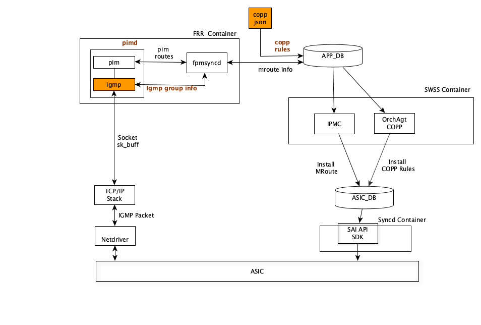
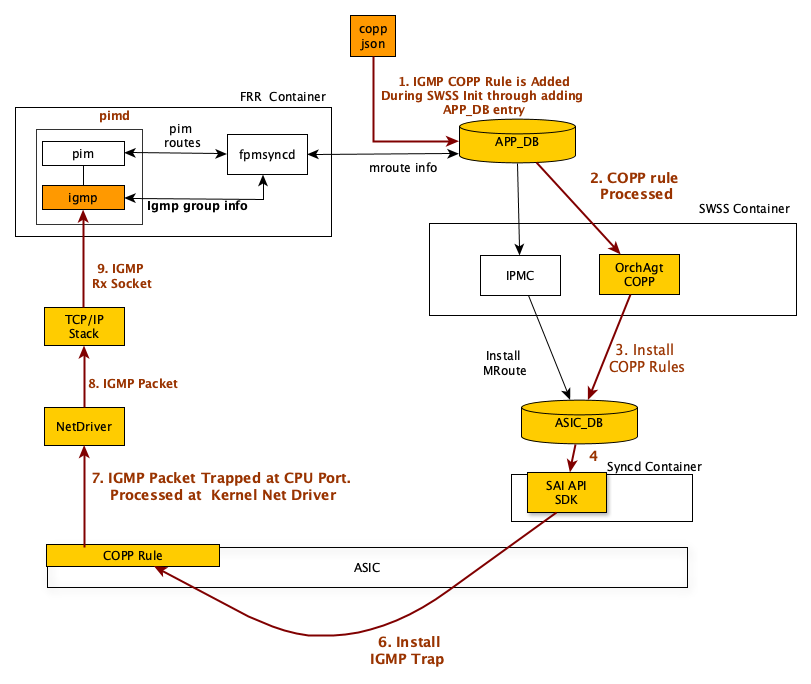
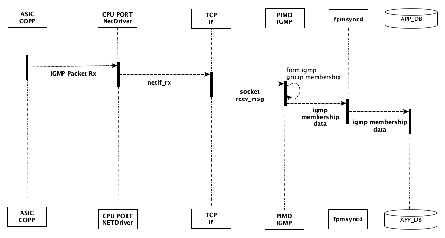
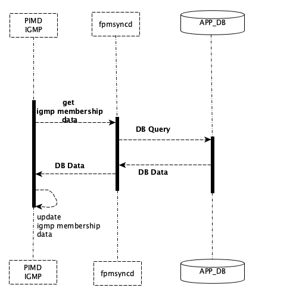


# SONiC  IGMP  for IP Multicast
# High Level Design Document
#### Rev 0.1

# Table of Contents
- [List of Tables](#list-of-tables)
- [Revision](#revision)
- [About this Manual](#about-this-manual)
- [Scope](#scope)
- [Definitions/Abbreviation](#definitions-abbreviation)
    + [Table 1: Abbreviations](#table-1-abbreviations)
    + [Table 2: IGMP Codes](#table-2-igmp-codes)
- [1 Feature Overview](#1-feature-overview)
  * [1.1 Requirements](#11-requirements)
    + [1.1.1Functional Requirements](#111-functional-requirements)
    + [1.1.2 Configuration and Management Requirements](#112-configuration-and-management-requirements)
    + [1.1.3 Scalability Requirements](#113-scalability-requirements)
    + [1.1.4 Warm Boot Requirements](#114-warm-boot-requirements)
  * [1.2 Design Overview](#12-design-overview)
    + [1.2.1 Basic Approach](#121-basic-approach)
    + [1.2.2  BGP Container](#122-bgp-container)
    + [1.2.3 SAI Overview](#123-sai-overview)
- [2 Functionality](#2-functionality)
  * [2.1 Target Deployment Use Cases](#21-target-deployment-use-cases)
  * [2.2 Functional Description](#22-functional-description)
- [3 Design](#3-design)
  * [3.1 Overview](#31-overview)
  * [3.2 DB Changes](#32-db-changes)
    + [3.2.1 CONFIG DB](#321-config-db)
    + [3.2.2 APP DB](#322-app-db)
    + [3.2.2 STATE DB](#322-state-db)
    + [3.2.3 ASIC DB](#323-asic-db)
    + [3.2.4 COUNTER DB](#324-counter-db)
  * [3.3 BGP Docker Design](#33-bgp-docker-design)
    + [3.3.1 PIMD/IGMP Changes](#331-pimd-igmp-changes)
  * [3.4 SAI](#34-sai)
    + [3.4.1 COPP_TABLE Traps](#341-copp-table-traps)
  * [3.5 CLI](#35-cli)
    + [3.5.1 Data Models](#351-data-models)
    + [3.5.2 Configuration Commands](#352-configuration-commands)
      - [3.5.2.1  IGMP interface](#3521-igmp-interface)
      - [3.5.2.2  IGMP query-interval](#3522-igmp-query-interval)
      - [3.5.2.3  IGMP query max response time](#3523-igmp-query-max-response-time)
      - [3.5.2.4  IGMP join](#3524-igmp-join)
    + [3.5.3 Show Commands](#363-show-commands)
      - [3.5.3.1 show ip igmp groups](#3631-show-ip-igmp-groups)
      - [3.5.3.2 show ip igmp interface](#3632-show-ip-igmp-interface)
      - [3.5.3.3 show ip igmp sources](#3633-show-ip-igmp-sources)
      - [3.5.3.4 show ip pim local-membership](#3634-show-ip-pim-local-membership)
      - [3.5.3.5 show ip igmp join](#3635-show-ip-igmp-join)
      - [3.5.3.6 show ip igmp statistics](#3636-show-ip-igmp-statistics)
      - [3.5.3.7 show ip multicast](#3637-show-ip-multicast)
      - [3.5.3.8 show ip igmp interface detail](#3638-show-ip-igmp-interface-detail)
    + [3.5.4 Clear Commands](#364-clear-commands)
      - [3.5.4.1clear ip igmp interfaces](#3641-clear-ip-igmp-interfaces)
    + [3.5.5 Debug Commands](#365-debug-commands)
      - [3.5.5.1 Syslog](#3651-syslog)
      - [3.5.5.1 IGMP Trap](#3651-igmp-trap)
    + [3.5.6 REST API Support](#366-rest-api-support)
- [4 Flow Diagrams](#4-flow-diagrams)
  * [4.1 IGMP Rx Packet Processing](#41-igmp-rx-packet-processing)
  * [4.2 IGMP Warm Restart](#42-igmp-warm-restart)
- [5 Error Handling](#5-error-handling)
- [6 Serviceability and Debug](#6-serviceability-and-debug)
- [7 Warm Boot Support](#7-warm-boot-support)
- [8 Scalability](#8-scalability)
	 - [Table 3: Scaling limits](#table-3-scaling-limits)
- [9 Unit Test](#9-unit-test)
  * [9.1 CLI Test Cases](#91-cli-test-cases)
  * [9.2 Rest API Test Cases](#92-rest-api-test-cases)
  * [9.3 Functional Test Cases](#93-functional-test-cases)
  * [9.4 Scaling Test Cases](#94-scaling-test-cases)
  * [9.5 Warm Boot Test Cases](#95-warm-boot-test-cases)
  * [9.6 Negative Test Cases](#96-negative-test-cases)

# List of Tables
[Table 1: Abbreviations](#table-1-abbreviations)

# Revision
| Rev |     Date    |       Author       | Change Description                |
|:---:|:-----------:|:------------------:|-----------------------------------|
| 0.1 | 06/17/2019  |  Benzeer Bava | Initial version                   |

# About this Manual
This document provides general information about the IGMP  implementation for IP Multicast   in SONiC.
# Scope
This document describes the functionality and high level design of the Layer 3  IGMP  feature in SONiC. 

- This document only adresses the integration of the IGMP Protocol to SONiC and any multicast routing aspects like creation/management of IP Multicast routes etc using PIM Protocol  are outside the scope of this document.
- MLD (IGMP equivalent for IPv6) is not in the scope of current specification.

# Definitions/Abbreviation
### Table 1: Abbreviations
| Term   | Meaning                                                |
|--------|--------------------------------------------------------|
|BGP Container | Docker container which hosts FRR suite in SONiC 									  |
|FRR | Free Range Routing Software Suite 										  |
| IGMP   | Internet Group Management Protocol            		  |
| IPMC	 | IP Multicast									  |
| MLD   | Multicast Listener Discovery      		  |
|Mrouter | Multicast Router 										  |
|pimd | PIM daemon in FRR, providing IGMP and PIM  protocol support 										  |
| PIM    | Protocol Independent Multicast						  |

### Table 2: IGMP Codes

| Term   | Meaning                                                |
|--------|--------------------------------------------------------|
| Membership Query   | MRouter sends periodic queries to clients, in order to refresh the membership state            		  |
| V1 Report          | Clients sends reports to mrouter in response to membership query or asynchronously for joining into a group|
| V2 Report          | Report for IGMP V2 |
| V3 Report          | Report for IGMP v3 |
| Leave Group        | Clients sends leave message to MRouter to unsubscribe from a group . Supported by IGMP V2 onwards|
 

# 1 Feature Overview

IP Multicast allows  sending data to clients belonging to a multicast group. A multicast group consists of subset of hosts(clients) in a network that may be even be spread  across multiple domains. The Protocol Independent Multicast (PIM) protocol dynamically creates a multicast distribution tree at each multicast router in order to reach all the clients in a group in a loop-free manner.  The Internet Group Management Protocol (IGMP) is a protocol used to communicate between IPv4 clients and multicast routers, in order  to form and manage membership information of clients in the group.

SONiC provides  IGMP through  FRR suite hosted in a container called BGP Docker Container.  *FRR* or Free Range Routing is a suite of various software daemons, that provide support for various protocols   including IP Multicast.  IP Multicast protocols like PIM and IGMP are available inside this  BGP container through the pimd daemon. 

Below is the high level architecture of IGMP in SONiC. pimd creates unix sockets for transmit and receive of IGMP packets to/from hardware ASIC. Using appropriate COPP rules, the hardware is programmed to trap the IGMP packets to CPU. PIM protocol is  also responsible for forming and installing Multicast route tables through fpmSyncd, which is outside the scope of this document. IGMP may stores its membership data in Application DB,  in order to synchronize the group membership during a warm reboot.

The scope of this document is to  integrate *pimd* daemon to BGP container,  implement  associated components for warm restart support,  and to  implement IGMP trap support at SAI layer.  The blocks highlighted in color represent the areas for implementation changes.

__Figure 1:  IGMP  High Level Architecture__

## 1.1 Requirements

### 1.1.1 Functional Requirements
 1. Integrate SONiC  IGMPv2 and IGMPv3 support  provided by FRR 7.0.1
 2. Support trapping  of IGMP packets to CPU
 3. Support Warm Reboot for IGMP group membership
 4. Integrate Ability to debug IGMP trapping path using SONiC syslog entries
 5. Integrate IGMP debugging logs generated by FRR to be available in SONiC syslog entries.

### 1.1.2 Configuration and Management Requirements
No additional CLI configurations are required.  BGP Daemon uses FRR vty shell commands in BGP container  to manage IGMP. 

integration of REST, gNMI, SNMP support are not in the current scope for FRR Docker.

### 1.1.3 Scalablity Requirements

FRR Suite or SONiC as such is not imposing any restriction on the scale of IGMP group membership data. 

The number of IGMP group members also represents the number of the locally reachable multicast routes. Hence the total number of IGMP groups in a system is constrained by the total number of multicast route entries supported by the hardware.  

The multicast routes are formed by the PIM protocol by processing the IGMP memberships and remote PIM messages. Hence the respective specification for PIM protocol shall specify the total scale of IP multicast routes.

### 1.1.4 Warm Boot Requirements

IGMP group entries should persist across warm reboot with no traffic disruption to the active flows.

1.  To support planned system warm boot 
    - After system warm reboot, the existing igmp group membership in pimd shall be retained.   However no IGMP queries are sent, and no IGMP reports are processed during the warm boot. Also, IGMP timers are not advanced/processed.

2.  To support SWSS  warm boot 
     - After SWSS warm reboot, the existing igmp group membership in pimd shall be unaffected.    
   
3.  To support BGP docker warm boot.
    - When BGP docker is warm restarted, the existing igmp group membership data shall be retained.

## 1.2 Design Overview
### 1.2.1 Basic Approach

Inorder to integrate SONiC with IGMP in FRR suite, following keys functionalities need to be provided.

1.  Using appropriate COPP rules in SONiC, the SAI interface need to add host interface traps for IGMP packet.
2.  Using appropriate database entry, the IGMP membership data need to be reinstated back in the event of warmreboot of the BGP container.

### 1.2.2  BGP Container
The IGMP protocol is available as part of pim daemon in the BGP container. The PIM dameon also implements PIM protocol. The PIM dameon in BGP Container is responsible for sending and recieving IGMP packets between hosts and multicast routers, and forming the IGMP group membership information.

### 1.2.3 SAI Overview

There is no change in SAI Interface APIs for supporting IGMP. The SAI Interface APIs for creating Multicast Routes are below.  

[https://github.com/opencomputeproject/SAI/blob/master/inc/saiipmc.h](https://github.com/opencomputeproject/SAI/blob/master/inc/saiipmc.h)

[https://github.com/opencomputeproject/SAI/blob/master/inc/saiipmcgroup.h](https://github.com/opencomputeproject/SAI/blob/master/inc/saiipmcgroup.h)

SAI layer implements trapping of IGMP packets through the existing API interface, which is  described in respective SAI layer specification.  

# 2 Functionality
Refer to section 1
## 2.1 Target Deployment Use Cases

The following are target deployment use cases for IP Multicast Routing functionality.

	 L3 CLOS underlay with Multicast for Data Centre interconnect
	 L3 CLOS underlay with Multicast inside Data centre

## 2.2 Functional Description
Refer to section 1.1

# 3 Design
## 3.1 Overview

The  pimd process will handle following key interactions with respect to the scope of current specification
- Process  IGMP messages trapped to CPU
- Interact with SWSS Container to store and update IGMP Group subscriptions in APP_DB
- Interact with SWSS Container  to retrieve IGMP Group subscriptions from  APP DB during warm restart

## 3.2 DB Changes

This section describes the changes made to different DBs for supporting IP IGMP.
 
In order to support warm reboot of the BGP Container, IGMP membership states (pim local membership) need to be stored in APP_DB.  The IGMP membership states are synchronized back using this data.

### 3.2.1 CONFIG_DB
No changes are needed. Configuration is done through vty shell in FRR.

### 3.2.2 APP_DB
During warm restart, the *pimd* needs to retain the IGMP data using a APP_DB entry. Since IGMP group membership is the local neighbor data of PIM, the objective is to retrieve this data from corresponding PIM generated DB itself. Hence, no changes to APP_DB are required.

Below is the information that needs to be retrieved from the PIM DB for each of the dynamically formed IGMP groups. The exact schema specification of PIM DB is outside the scope of this document. Below schema is  for representative purposes only.

    ;Store IGMP entry per SG .
    ;Status: work in progress
    key	 =  <PIM_TABLE_NAME>:source_address:group_address
    ;field 	 =  value
	ifname	 =  1*64VCHAR             ; Multicast group member interface.

### 3.2.2 STATE_DB
No State_DB changes are needed.

### 3.2.3 ASIC_DB
No ASIC_DB changes are needed since IGMP only passes information to PIM.

### 3.2.4 COUNTER_DB
No COUNTER_DB changes are needed. IGMP maintains control packet statistics, which are reset during warm restart.

## 3.3 BGP Docker Design
### 3.3.1 PIMD/IGMP Changes
The Following support needs to be added in the *pimd* daemon
- As IGMP data is populated, store a copy in APP_DB 
- During Warm restart, retrieve this data

## 3.4 SAI
IPMC SAI interface APIs are not in scope of current document. 

 
### 3.4.1 COPP_TABLE Traps

Control Plane Policing (COPP) table entries are used to Trap IGMP packets to the host. Below are the IGMP packet types which the IGMP stack inside the pim daemon is interested to process.

    {"igmp_query", SAI_HOSTIF_TRAP_TYPE_IGMP_TYPE_QUERY},
    {"igmp_leave", SAI_HOSTIF_TRAP_TYPE_IGMP_TYPE_LEAVE},
    {"igmp_v1_report", SAI_HOSTIF_TRAP_TYPE_IGMP_TYPE_V1_REPORT},
    {"igmp_v2_report", SAI_HOSTIF_TRAP_TYPE_IGMP_TYPE_V2_REPORT},
    {"igmp_v3_report", SAI_HOSTIF_TRAP_TYPE_IGMP_TYPE_V3_REPORT},

The match qualifier is IP protocol type and hence a single COPP entry is installed to trap  IGMP query/leave/ v1,v2,v3 reports. It shall be noted that the rate limiting for trapped packets towards CPU is specified through the cir/cbs parameter of the meter in COPP rule.

	"COPP_TABLE:trap.group.igmp”: {
	            "trap_ids": “igmp_query”,
	            "trap_action":"trap",
	            "trap_priority":"4",
	            "queue": "4",
	            "meter_type":"packets",
	            "mode":"sr_tcm",
	            "cir":"600",
	            "cbs":"600",
	            "red_action":"drop"
	        }
	        
The Below Figure highlights the processing flow for Trapping and processing IGMP Packets at the BGP Container. 

__Figure 2:  IGMP  Trapping__

## 3.5 CLI
*vtysh* provides configuration frontend for the FRR suite. The BGP Daemon shall be using the vtysh configuration and show commands for the IGMP feature.

### 3.5.1 Data Models
No Additional data models are in the current scope. vtysh commands are used to configure  IGMP for IP Multicast.

Integration of OpenConfig and related components are currently not in the scope of FRR.

### 3.5.2 Configuration Commands
The below information is taken from FRR Documentation for IGMP configuration commands. Please refer FRR documentation for latest updates.

#### 3.5.2.1  IGMP interface
Under interface configuration mode,  this command enables receiving IGMP reports and queries on the specific interface. 

**ip igmp**

The following command disables IGMP on the specific interface.
**no ip igmp** 

By default IGMP version 3 is enabled.  In order to enable IGMP version 2 instead, igmp version is configured under the  interface.

**ip igmp version 2**

#### 3.5.2.2  IGMP query-interval
The mrouter periodically sends igmp query messages to the clients in each group. Under interface configuration mode, this command is used to set the IGMP query interval in seconds for the interface. 

The default query interval is 125 seconds.

**ip igmp query-interval <1-1800\>**

#### 3.5.2.3  IGMP query max response time
The required responsiveness of replies to a membership query. Under interface configuration mode, this command is used to set the IGMP query response timeout value in deci-seconds. If the reports from client is not returned with in this time, the (S,G) or (*, G) is declared timed out.

**ip igmp query-max-response-time <10-250\>**

The default query response interval is 1 second.

#### 3.5.2.4  IGMP join
Under interface configuration mode, this command is used to  statically join into to a multicast group. Static joins have priority over dynamic joins. When a static join is configured for an interface and a dynamic join is also recieved for the same group, the static configuration takes precedence.

**ip igmp join  <A.B.C.D\>**

Under interface configuration mode, this command is used to  remove a statically joined multicast group.
**no ip igmp join  <A.B.C.D\>** 

### 3.5.3 Show Commands
The below information is taken from FRR Documentation for IGMP configuration commands. Please refer FRR documents for latest updates.

#### 3.5.3.1 show ip igmp groups
This commands displays IGMP group information across all the interfaces. This command displays both static and dynamically joined groups.

	
	sonic# show ip igmp groups
	Interface Address         Group           Mode Timer    Srcs V Uptime
	Ethernet12 100.100.100.2   225.1.1.4       ---- 00:04:07    1 2 00:01:45
	Ethernet12 100.100.100.2   225.6.6.8       ---- 00:04:08    1 2 00:01:43
	Ethernet24 100.100.120.2   225.1.1.4       ---- 00:03:59    1 2 00:00:21
	Ethernet24 100.100.120.2   225.6.6.8       ---- 00:03:59    1 2 00:00:21
	Vlan2000   100.100.120.2   232.10.10.1     INCL --:--:--    1 3 00:00:16
	Vlan2000   100.100.120.2   225.1.1.4       ---- 00:04:17    1 2 00:00:03

#### 3.5.3.2 show ip igmp interface
This command displays  IGMP enabled interfaces in the system

	sonic# show ip igmp interface
	Interface  State          Address  V  Querier  Query Timer    Uptime
	Ethernet12     up    100.100.100.2  2    local     00:00:59  00:18:18
	Ethernet24     up    100.100.120.2  2    local     00:01:43  00:00:54
	lo          mtrc       10.10.10.1  3    other     --:--:--  00:18:45

IGMP information for a specific interface can be displayed using the interface name as additional parameter.
For Example

	sonic# show ip igmp interface Ethernet12
	Interface : Ethernet12
	State     : up
	Address   : 100.100.100.2
	Uptime    : 00:21:31
	Version   : 2
	..

#### 3.5.3.3 show ip igmp sources
This command displays igmp sources. This  command help to verify whether receivers  has joined on specific interfaces.

	sonic# show ip igmp sources
	Interface Address         Group           Source          Timer Fwd Uptime
	Ethernet12 100.100.100.2   225.1.1.4       *               03:28   Y 00:02:24
	Ethernet12 100.100.100.2   225.6.6.8       *               03:29   Y 00:02:22
	Ethernet24 100.100.120.2   225.1.1.4       *               --:--   Y 00:01:00
	Ethernet24 100.100.120.2   225.6.6.8       *               03:20   Y 00:01:00

#### 3.5.3.4 show ip pim local-membership
This command displays IGMP information at PIM

	sonic# show ip pim local-membership
	Interface  Address          Source           Group            Membership
	Ethernet12  100.100.100.2    *                225.1.1.4        INCLUDE
	Ethernet12  100.100.100.2    *                225.6.6.8        INCLUDE
	Ethernet24  100.100.120.2    *                225.1.1.4        INCLUDE
	Ethernet24  100.100.120.2    *                225.6.6.8        INCLUDE

#### 3.5.3.5 show ip igmp join
IGMP static join information is listed.

	sonic# show ip igmp join
	Interface Address         Source          Group           Socket Uptime
	Ethernet12 100.100.100.2   *               225.1.1.1           20 01:12:02
	Ethernet12 100.100.100.2   *               225.1.7.8           21 01:10:47

#### 3.5.3.6 show ip igmp statistics

	sonic# show ip igmp statistics
	IGMP RX statistics
	Interface       : global
	V1 query        : 0
	V2 query        : 2
	V3 query        : 0
	V2 leave        : 0
	V1 report       : 0
	V2 report       : 12
	V3 report       : 2
	mtrace response : 0
	mtrace request  : 0
	unsupported     : 0

#### 3.5.3.7 show ip multicast
This Command displays summary 
	
	sonic# show ip multicast
	Mroute socket descriptor: 7(default)
	Mroute socket uptime: 00:21:48

	Zclient update socket: 11 failures=0
	Zclient lookup socket: 12 failures=0

	Maximum highest VifIndex: 31

	Upstream Join Timer: 60 secs
	Join/Prune Holdtime: 210 secs
	PIM ECMP: Disable
	PIM ECMP Rebalance: Disable

	RPF Cache Refresh Delay:    50 msecs
	RPF Cache Refresh Timer:    0 msecs
	RPF Cache Refresh Requests: 0
	RPF Cache Refresh Events:   0
	RPF Cache Refresh Last:     --:--:--
	Nexthop Lookups:            1
	Nexthop Lookups Avoided:    0

	Scan OIL - Last: --:--:--  Events: 0
	MFC Add  - Last: 00:01:39  Events: 18
	MFC Del  - Last: 00:06:08  Events: 4

	Interface Address            ifi Vif  PktsIn PktsOut    BytesIn   BytesOut
	Ethernet12   100.100.100.2    60   1       0       0          0          0
	Ethernet24   100.100.120.2    63   3       0       0          0          0
	lo           10.10.10.1        1   2       0       0          0          0
	pimreg       0.0.0.0          77   0       0       0          0          0

#### 3.5.3.8 show ip igmp interface detail

	sonic# show ip igmp interface detail
	Interface : Ethernet12
	State     : up
	Address   : 100.100.100.2
	Uptime    : 00:57:40
	Version   : 3

	Querier
	-------
	Querier     : local
	Start Count : 0
	Query Timer : 00:01:31
	Other Timer : --:--:--

	Timers
	------
	Group Membership Interval      : 210s
	Last Member Query Time         : 20s
	Older Host Present Interval    : 210s
	Other Querier Present Interval : 205s
	Query Interval                 : 100s
	Query Response Interval        : 10s
	Robustness Variable            : 2
	Startup Query Interval         : 25s

	Flags
	-----
	All Multicast   : no
	Broadcast       : yes
	Deleted         : no
	Interface Index : 61
	Multicast       : yes
	Multicast Loop  : 0
	Promiscuous     : no

  
###  3.5.4 Clear Commands
Below commands will be used to clear IGMP group membership.
The below information is taken from FRR Documentation for IGMP commands. Please refer FRR documentation for latest updates.

#### 3.5.4.1 clear ip igmp interfaces
This command in exec mode resets the  IGMP interfaces.

**clear ip igmp interfaces**

### 3.5.5 Debug Commands
The below information is taken from FRR Documentation for IGMP commands. Please refer FRR documentation for latest updates.

#### 3.5.5.1 Syslog
Following debug commands will be supported for enabling logging which can be viewed in /var/log/syslog.

       log syslog debugging
       debug igmp packets
       debug igmp events
       debug igmp trace
       debug pim zebra
       debug pim  events
       debug mroute detail

	###Debug Sample:
	Jun 24 08:51:59.784673 sonic DEBUG bgp#pimd[51]: Recv IGMP packet from 100.100.110.3 to 225.1.1.4 on Ethernet24: ttl=1 msg_type=22 msg_size=8
	Jun 24 08:51:59.784673 sonic DEBUG bgp#pimd[51]: igmp_v2_recv_report: from 100.100.110.3 on Ethernet24
	Jun 24 08:51:59.784673 sonic DEBUG bgp#pimd[51]: Recv IGMPv2 REPORT from 100.100.110.3 on Ethernet24 for 225.1.1.4
	Jun 24 08:51:59.784673 sonic DEBUG bgp#pimd[51]: igmpv3_report_isex: from 100.100.110.3 on Ethernet24: group=225.1.1.4 sources=0
	Jun 24 08:51:59.784727 sonic DEBUG bgp#pimd[51]: Resetting source * timer to GMI=260.000 sec for group 225.1.1.4 on Ethernet24
	Jun 24 08:51:59.784727 sonic DEBUG bgp#pimd[51]: Scheduling 260.000 sec TIMER event for group 225.1.1.4 source * on Ethernet24
	Jun 24 08:51:59.784768 sonic DEBUG bgp#pimd[51]: igmp_source_forward_start: (S,G)=(*,225.1.1.4) igmp_sock=14 oif=Ethernet24 fwd=1

#### 3.5.5.1 IGMP Trap

The PIM daemon creates a single mroute socket for receiving IGMP packets from CPU. As illustrated in Figure 2, the COPP rule in ASIC traps the IGMP packet to CPU port. The netdriver for the CPU port of ASIC hands over the IGMP packet to the TCP/IP stack in kernel. The TCP/IP stack then hands over the IGMP packet to the IGMP socket created by PIM daemon. The IGMP recieve flow is also illustrated in Figure 3

The  packet trapping at the vendor specific netdriver is outside the scope of this document. The flow of IGMP packets from TCP/IP Socket is illustrated below.

The descriptor of the recieve socket for IGMP packet is 7 in below example. 

	sonic# show ip multicast
	Mroute socket descriptor: 7(default)
	Mroute socket uptime: 02:07:40
	
**Socket trace of  IGMP  packet snooped  at the  CPU port**

	recvmsg(7, {msg_name=NULL, msg_namelen=0, msg_iov=[{iov_base="F\0\0 \0\0@\0\1\0020kddn\3\341\1\1\4\224\4\0\0\26\0\7\372\341\1\1\4", iov_len=10000}], msg_iovlen=1, msg_control=[{cmsg_len=28, cmsg_level=SOL_IP, cmsg_type=IP_PKTINFO, cmsg_data={ipi_ifindex=if_nametoindex("Ethernet24"), ipi_spec_dst=inet_addr("100.100.110.2"), ipi_addr=inet_addr("225.1.1.4")}}], msg_controllen=32, msg_flags=0}, 0) = 32

**Resulting igmp group Entry**

	sonic# show ip igmp group
	Interface Address         Group           Mode Timer    Srcs V Uptime
	Ethernet24 100.100.120.2   225.1.1.4       ---- 00:03:27    1 2 00:00:53
	

### 3.5.6 REST API Support
 
Integration of REST API and related components are currently not in the scope of FRR.
 
 
# 4 Flow Diagrams
## 4.1 IGMP RX Packet  Processing

__Figure 3:  Processing of Trapped IGMP packet__

## 4.2  Warm Restart

__Figure 4:  IGMP membership recovery during BGP Container  Warm Restart__

# 5 Error Handling

Apropriate syslogs or console errors are generated upon encountering various errors such as:

	1. Attempt to configure IGMP join on an interface where igmp is not enabled
	2. Recieving IGMP reports on a non IGMP interface
	3. IGMP leave recieved for statically joined group should be ignored

# 6 Serviceability and Debug
Debug commands as described in Debug Command section will be supported. Debug command output will be captured as part of tech support.
- Any CLI configuration errors will be displayed via console and configuration will be rejected.
- Internal processing errors within SwSS will be logged in syslog with ERROR level
- SAI interaction errors will be logged in syslog at the ERROR level.

# 7 Warm Boot Support
The IGMP group membership and hence the traffic corresponding to the active IPMC flows should not be 
disturbed during the warm reboot process.
 
- Planned BGP docker warm boot
	- IGMP entries are retained during warm reboot.
	
- Planned SWSS docker warm boot
    - IGMP entries are restored during warm reboot.

- Planned system warm boot  
    - IGMP entries are restored during warm reboot.

# 8 Scalability

Below IGMP scale will be tested to success. As there is no restriction at sonic software for the size of igmp group membership data, the below scale only signifies the testing preferences.

###### Table 3: Scaling limits
|Name                      | Scaling value    |
|--------------------------|------------------|
| Number of IGMP Interfaces|      128          |
| Number of IGMP Groups    |      32*128       |

The supported number of IGMP enabled IP interfaces is specific to the hardware platform. The PIM protocol may form one local multicast route corresponding to each IGMP group entry. The size of IP multicast routing table is specific to the hardware platform. Hence the corresponding PIM specification which actually forms the IP multicast routes shall specify the system scale.

# 9 Unit Test
## 9.1 CLI Test Cases

Repeat all the below test cases for both IGMP V2 and V3 . This is again repeated for different kinds of IGMP interfaces like  Router Ports, Vlan Interfaces, Port Channel Interfaces.

	 1. Verify CLI to enable and disable IGMP on an interface
	 2. Verify CLI to change IGMP query interval for an interface
	 3. Verify CLI to change IGMP max query response interval for interface
	 4. Verify CLI to reset IGMP query interval for an interface
	 5. Verify CLI to reset IGMP max query response interval for interface.
	 6. Verify CLI to statically join to an IGMP group, for the interface
	 7. Verify CLI to change IGMP Version from default 3 to 2
	 8. Verify CLI to change IGMP version from 2 to 3
	 9. Verify CLI to remove static multicast group membership
	 10. Verify CLI to display statically joined IGMP groups
	 11. Verify CLI to display IGMP protcol packet statistics
	 12. Verify CLI to display IGMP sources
	 13. Verify CLI to display  IGMP Query Interval and Query Response interval of interface
	 14. Verify show CLI to display IGMP interface configurations
	 15. Verify CLI to clear the dynamically joined IGMP groups
	 16. Verify Configuration save and verify after reload
	 17. Verify unsaved configuration after reload
	

## 9.2 Rest API Test Cases
Integration of REST API and related components are currently not in the scope of FRR.
 

## 9.3 Functional Test Cases

Repeat all the below test cases for both IGMP V2 and V3 . This is again repeated for different kinds of IGMP interfaces like  Router Ports, Vlan Interfaces, Port Channel Interfaces.

	 1. Verify IGMP queries are trapped.
	 2. Verify IGMP group membership is added. 
	 3. Verify IGMP group membership source timout is reset.
	 4. Verify IGMP membership is timedout and deleted.
	 5. Verify IGMP membership timeout value is changed with query max response time value and query interval. 
	 6. Verify IGMP stats is updated for  reports.
	 7. Verify IGMP stats is updated for  leaves.
	 8. Verify IGMP stats is updated for membership queries.
	 9. Verify IGMP max response interval.
	 10. Verify that different IGMP interfaces can have different values for the max response interval.
	 11. Verify that the default max response interval  is set for those interfaces which does not have explicit configuration.
	 12. Verify IGMP leave is processed.
	 13. Verify IGMP Query messages are sent out.
	 14. Verify mtrace to source.
	 15. Verify Clear IGMP group clears all IGMP dynamic group memberships.
	 16. Verify Clear IGMP group doesnot clear IGMP static group memberships.
	 17. Execute debug commands and verify IGMP operations at syslog.
	 18. Verify IGMP V2 messages received on V2 interface are accepted.
	 19. Verify IGMP V3 messages received on V3 interface are accepted.
	 20. Verify APP_DB is populated with IGMP membership.
	 21. Verify IGMP V2 messages received on V3 interface are accepted.
	 22. Verify IGMP V3 messages received on V2 interface are accepted.
	 23. Verify IGMP notifies local neighborhood to PIM.
	 24. Verify PIM APP_DB corresponding to IGMP group entry is updated when IGMP report is recieved.
	 25. Verify PIM APP_DB corresponding to IGMP group entry is updated when IGMP membership timeout is recieved.
	 26. Verify PIM APP_DB corresponding to IGMP group entry is updated when IGMP leave is recieved.
	 27. Verify IGMP statistics is reset during warm restart.
	
		 
	 
## 9.4 Scaling Test Cases
Verify functional test cases with the following scaling parameters

	1. Configure IGMP on maximum number of interfaces
	2. Configure maximum number of Group entries per IGMP interface. 
	3. Send maximum number of IGMP reports on all IGMP interfaces. 
	4. Lower the max query interval and max response time. In this case IGMP queries are send and recived more frequently.Check IGMP memberships are not timing out.
	
	

## 9.5 Warm Boot Test Cases

	 1. Verify IGMP membership data is not affected during warm restart of BGP docker.
	 2. Verify System Warm reboot

	 
## 9.6 Negative Test Cases
    
	 1. Verify IGMP queries received on non IGMP interfaces are not processed
	 2. Verify Invalid checksum IGMP packets are not processed
	 3. Verify unknown IGMP packets are not processed
	 4. Verify IGMP packets with high rate
	 5. Verify IGMP leave for a non existent entry
	 6. Verify configuring IGMP version other than 2 and 3 is rejected
	 7. Verify configuring IGMP max-response-time with value other than 10-250 is rejected
	 8. Verify configuring IGMP query-interval with value outside 1-1800 is rejected
	 9. Verify configuring IGMP query-interval  not less than max-response-time is rejected.
     10. Verify configuring IGMP max-response-time  not below  query-interval  is rejected.
     11. Verify configuring IGMP join with invalid IP adress is rejected
	 12. Verify configuring removal of IGMP join of non existent group is rejected
	 13. Verify configuring removal of IGMP join of different source adress is rejected
	 14. Verify configuring removal of IGMP join for a dynamic group is rejected

	 

