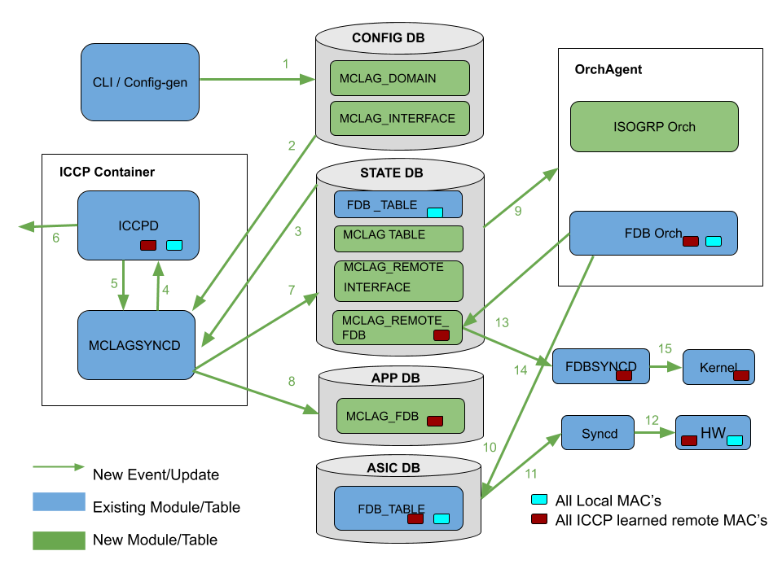
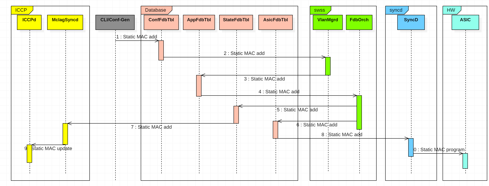
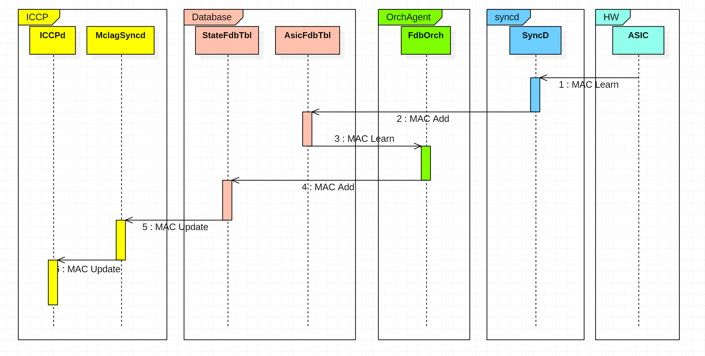
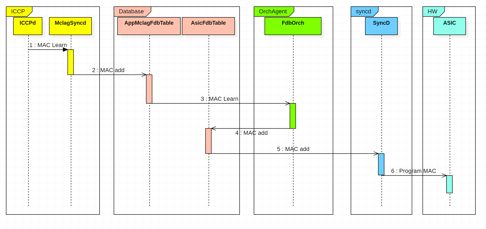
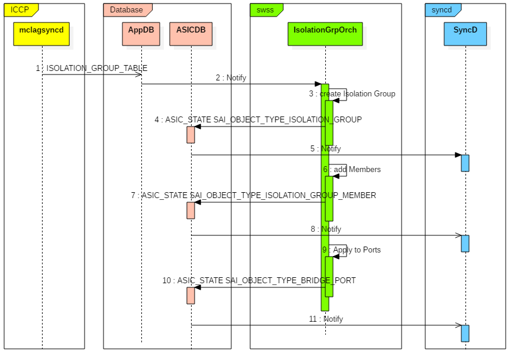

# MCLAG Enhancements
Rev 0.1

# Table of Contents
- **[List of Tables](#List-of-Tables)**
- **[Revision](#Revision)**
- **[About this Manual](#About-this-Manual)**
- **[Definition/Abbreviation](#Definition_Abbreviation)**
	- [Table 1: Abbreviations](#Table-1-Abbreviations)
- **[1 Feature Overview](#1-Feature-Overview)**
	- [1.1 Functional Requirements](#1_1-Functional-Requirements)
		- [1.1.1 Static MAC support over MCLAG](#1_1_1-Static-MAC-support-over-MCLAG)
		- [1.1.2 Configuration and Management Requirements](#1_1_2-Configuration-and-Management-Requirements)
		- [1.1.3 Performance and Scalability Requirements](#1_1_3-Performance-and-Scalability-Requirements)
		- [1.1.4 Warm Boot Requirements](#1_1_4-Warm-Boot-Requirements)
		- [1.1.5 Unique IP for supporting L3 protocol over MCLAG VLAN interface Requirements](#1_1_5-Unique-IP-for-supporting-L3-protocol-over-MCLAG-VLAN-interface-Requirements)
- **[2 Functionality](#2-Functionality)**
	- [2.1 Functional Description](#2_1-Functional-Description)
		- [2.1.1 Dynamic configuration of MCLAG](#2_1_1-Dynamic-configuration-of-MCLAG)
		- [2.1.2 Dynamic configuration of mclag_interface](#2_1_2-Dynamic-configuration-of-mclag_interface)
		- [2.1.3 Keep-alive timer configuration](#2_1_3-Keep_alive-timer-configuration)
		- [2.1.4 Session timeout configuration](#2_1_4-Session-timeout-configuration)
		- [2.1.5 Static MAC support](#2_1_5-Static-MAC-support)
		- [2.1.6 Aging disable for ICCP learned MAC addresses](#2_1_6-Aging-disable-for-ICCP-learned-MAC-addresses)
		- [2.1.7 Performance improvements](#2_1_7-Performance-improvements)
		- [2.1.8 Isolation group support](#2_1_8-Isolation-group-support)
		- [2.1.9 Unique IP enhancements](#2_1_9-Unique-IP-enhancements)
- **[3 Design](#3-Design)**
	- [3.1 Overview](#3_1-Overview)
	- [3.2 DB Changes](#3_2-DB-Changes)
		- [3.2.1 CONFIG DB](#3_2_1-CONFIG-DB)
			- *[3.2.1.1 MCLAG Domain table](#3_2_1_1-MCLAG-Domain-table)*
			- *[3.2.1.2 MCLAG Interface Table](#3_2_1_2-MCLAG-Interface-Table)*
			- *[3.2.1.3 MCLAG UniqueIP Table](#3_2_1_3-MCLAG-UniqueIP-Table)*
		- [3.2.2 APP DB](#3_2_2-APP-DB)
			- *[3.2.2.1 ISOLATION_GROUP_TABLE table](#3_2_2_1-ISOLATION_GROUP_TABLE-table)*
			- *[3.2.2.2 APP_LAG_TABLE](#3_2_2_2-APP_LAG_TABLE)*
			- *[3.2.2.3 APP_MCLAG_FDB_TABLE](#3_2_2_3-APP_MCLAG_FDB_TABLE)*
		- [3.2.3 STATE DB](#3_2_3-STATE-DB)
			- *[3.2.3.1 STATE_MCLAG_TABLE](#3_2_3_1-STATE_MCLAG_TABLE)*
			- *[3.2.3.2 STATE_MCLAG_REMOTE_INTF_TABLE](#3_2_3_2-STATE_MCLAG_REMOTE_INTF_TABLE)*
			- *[3.2.3.3 STATE_MCLAG_REMOTE_FDB_TABLE](#3_2_3_3-STATE_MCLAG_REMOTE_FDB_TABLE)*
	- [3.3 ICCP Changes](#3_3-ICCP-Changes)
		- [3.3.1 MCLAG interface flap handling](#3_3_1-MCLAG-interface-flap-handling)
		- [3.3.2 MCLAG configuration change handling](#3_3_2-MCLAG-configuration-change-handling)
		- [3.3.3 FDB handling changes](#3_3_3-FDB-handling-changes)
			- *[3.3.3.1 Static MAC handling](#3_3_3_1-Static-MAC-handling)*
			- *[3.3.3.2 Data structure and data type modifications](#3_3_3_2-Data-structure-and-data-type-modifications)*
			- *[3.3.3.3 MAC sync optimizations](#3_3_3_3-MAC-sync-optimizations)*
		- [3.3.4 Port Isolation changes](#3_3_4-Port-Isolation-changes)
		- [3.3.5 MCLAG Domain State](#3_3_5-MCLAG-Domain-State)
		- [3.3.6 Unique IP Changes](#3_3_6-Unique-IP-Changes)
	- [3.4 Switch State Service Design](#3_4-Switch-State-Service-Design)
		- [3.4.1 Orchestration Agent](#3_4_1-Orchestration-Agent)
			- *[3.4.1.1 Isolation group orch agent](#3_4_1_1-Isolation-group-orch-agent)*
			- *[3.4.1.2 PortsOrch Changes](#3_4_1_2-PortsOrch-Changes)*
			- *[3.4.1.3 FdbOrch Changes](#3_4_1_3-FdbOrch-Changes)*
			- *[3.4.1.4 MCLAG REMOTE MAC update to Kernel](#3_4_1_4-MCLAG-REMOTE-MAC-update-to-Kernel)*
	- [3.5 SyncD](#3_5-SyncD)
	- [3.6 MclagSyncD](#3_6-MclagSyncD)
		- [3.6.1 FDB Changes](#3_6_1-FDB-Changes)
			- *[3.6.1.1 Removal of FDB table in MclagSyncd](#3_6_1_1-Removal-of-FDB-table-in-MclagSyncd)*
			- *[3.6.1.2 Populating ICCP MAC updates to APP_DB MCLAG_FDB_TABLE](#3_6_1_2-Populating-ICCP-MAC-updates-to-APP_DB-MCLAG_FDB_TABLE)*
			- *[3.6.1.3 Populating ICCP and MCLAG interface state information](#3_6_1_3-Populating-ICCP-and-MCLAG-interface-state-information)*
		- [3.6.2 MCLAG config handling](#3_6_2-MCLAG-config-handling)
	- [3.7 SAI](#3_7-SAI)
		- [3.7.1 Port Isolation](#3_7_1-Port-Isolation)
	- [3.8 CLI](#3_8-CLI)
		- [3.8.1 Click based CLI](#3_8_1-Click-based-CLI)
			- *[3.8.1.1 Configuration commands](#3_8_1_1-Configuration-commands)*
				- *[3.8.1.1.1 MCLAG Domain configuration](#3_8_1_1_1-MCLAG-Domain-configuration)*
				- *[3.8.1.1.2 MCLAG interface configuration](#3_8_1_1_2-MCLAG-interface-configuration)*
				- *[3.8.1.1.3 MCLAG unique IP configuration](#3_8_1_1_3-MCLAG-unique-IP-configuration)*
		- [3.8.2 SONiC CLI](#3_8_2-SONiC-CLI)
			- *[3.8.2.1 Configuration commands](#3_8_2_1-Configuration-commands)*
				- *[3.8.2.1.1 MCLAG Domain configuration](#3_8_2_1_1-MCLAG-Domain-configuration)*
				- *[3.8.2.1.2 MCLAG Interface configuration](#3_8_2_1_2-MCLAG-Interface-configuration)*
			- *[3.8.2.2 Show commands](#3_8_2_2-Show-commands)*
- **[4 Flow Diagrams](#4-Flow-Diagrams)**
	- [4.1 FDB Flow Diagrams](#4_1-FDB-Flow-Diagrams)
		- [4.1.1 Local Static MAC upstream](#4_1_1-Local-Static-MAC-upstream)
		- [4.1.2 Local Dynamic MAC update](#4_1_2-Local-Dynamic-MAC-update)
		- [4.1.3 Remote MAC Processing](#4_1_3-Remote-MAC-Processing)
	- [4.2 Port Isolation group processing](#4_2-Port-Isolation-group-processing)
- **[5 Serviceability and Debug](#5-Serviceability-and-Debug)**
- **[6 Warm Boot Support](#6-Warm-Boot-Support)**
- **[7 Scalability](#7-Scalability)**
- **[8 Upgrade/Downgrade considerations](#8-Upgrade_Downgrade-considerations)**
- **[9 Unit Test](#9-Unit-Test)**
	- [9.1 DB table updates](#9_1-DB-table-updates)
	- [9.2 FDB](#9_2-FDB)
	- [9.3 Config handling](#9_3-Config-handling)
	- [9.4 Port Isolation](#9_4-Port-Isolation)
	- [9.5 MCLAG Interface Flap](#9_5-MCLAG-Interface-Flap)
	- [9.6 MCLAG Unique IP enhancements](#9_6-MCLAG-Unique-IP-enhancements)

# List of Tables

[Table 1: Abbreviations](#table-1-abbreviations)

# Revision
| Rev  | Date       | Author                                   | Change Description |
| ---- | ---------- | ---------------------------------------- | ------------------ |
| 0.1  | 08/02/2019 | Lisa Nguyen, Praveen Elagala, Abhishek Dharwadkar, Sabarivel Sakthivel, Adam Yeung | Initial draft      |
| 0.2  | 10/22/2019 | Tapash Das                               | L3 Protocol support enhancement |

# About this Manual
This document provides general information about SONiC MCLAG feature enhancements. The original MCLAG  feature is described at https://github.com/Azure/SONiC/blob/f478fe7cbc03c144f3b147e9638f460f764ce4b7/doc/Sonic-mclag-hld.md 


# Definition/Abbreviation
## Table 1: Abbreviations
| **Term** | **Definition**                       |
| -------- | ------------------------------------ |
| MCLAG    | Multi-Chassis Link Aggregation Group |
| ICCP     | Inter-Chassis Communication Protocol |
| FDB      | Layer-2 (MAC) based forwarding table |
| MHD      | Multi Home Device                    |

# 1 Feature Overview

This document captures the feature enhancements of SONiC ICCP MCLAG. This includes MCLAG configuration support, data structure changes, MAC event handling optimizations for scaling performance, support of static MAC address over MCLAG, support bridge-port isolation group for BUM control to MCLAG, and traffic recovery sequencing for traffic loop prevention. 

## 1.1 Functional Requirements

### 1.1.1 Static MAC support over MCLAG
- Advertise locally configured Static MAC address to peer MCLAG node
- Withdraw MAC from peer MCLAG node when static MAC address is un-configured
- Dynamic MAC move is prohibited on Static MAC over MCLAG

### 1.1.2 Configuration and Management Requirements
- Configure MCLAG domain and corresponding attributes domain-id, local-ip-address and peer-ip-address

- Configure optional attribute [peer-interface] 

- Configure keep-alive timer value

- Configure session-timeout value

- Add support for addition/deletion of mclag_interfaces under MCLAG domain

### 1.1.3 Performance and Scalability Requirements
- Optimize code flow and data structures to improve scaling performance
- Support 40K FDB entries
- Support 4K VLAN's

### 1.1.4 Warm Boot Requirements
- MCLAG peer nodes should reconcile the local FDB table upon completion of warm boot, as the MAC learn and age updates from peer would be lost during the time ICCP control session is down due to warm boot.

### 1.1.5 Unique IP for supporting L3 protocol over MCLAG VLAN interface Requirements
- For VLAN's associated with MCLAG interface, allow configuration of Unique IP address on VLAN interface of Peer nodes.
- Provide mechanism for running L3 protocols such as BGP, BFD between both Peer nodes VLAN interface.
- Provide mechanism for running L3 protocols such as BGP, BFD between Peer node VLAN interface and device connected to MCLAG Client.
- For MCLAG gateway functionality (Data path) Static Anycast Gateway (SAG) or VRRP configuration will be mandatory, SAG is preferred for active-active forwarding. 

# 2 Functionality

## 2.1 Functional Description
### 2.1.1 Dynamic configuration of MCLAG
- Current MCLAG configuration is generated from config_db.json file with no CLI support. New CLIs will be added to configure MCLAG which includes domain-id, local ip address, peer ip address and peer_link. peer_link configuration is mandatory for Layer2 MCLAG while optional for Layer3 MCLAG.

### 2.1.2 Dynamic configuration of mclag_interface
- In the current implementation the mclag_interfaces configuration is generated from config_db.json file no CLI support is present, a new configuration command is introduced to dynamically add/delete the mclag_interfaces.

### 2.1.3 Keep-alive timer configuration
- In current implementation the keep-alive timer is hardcoded to 1 second. A new CLI command will be introduced to allow the configuration range of values from 1 to 60 seconds for keep-alive timer.

### 2.1.4 Session timeout configuration
- In current implementation the session time out 15 seconds after the last keep-alive messages exchange, the timeout duration is hardcoded. A new CLI command will be added to allow a configurable duration for session timeout with the supported range of 3 to 3600 seconds. Session timeout has to be configured in multiples keep-alive timer value. 

### 2.1.5 Static MAC support
- Current implementation does not support static MAC address over MCLAG. Static MAC information is not exchanged in the FDB TLV between the MCLAG peer nodes. Changes will be added to support Static MAC with TLV.
- Changes will be added to support the static MAC syncing from local MCLAG node to peer MCLAG node. 
- Changes will be added to handle the MAC move scenarios in presence of remote Static MAC.

### 2.1.6 Aging disable for ICCP learned MAC addresses
- In the current implementation, MAC addresses learned in the control plane from the MCLAG peer are installed as dynamic entries. Therefore, if no local traffic from these MAC addresses is seen for the ageing period then they will age out, causing a notification back to ICCPd. However if the mac is learned from peer then it will immediately re-program MAC . The result is transient flooding for the MAC and some unnecessary control plane overhead.
- When the local MCLAG node learns the MAC addresses from peer MCLAG node the type of the MAC set as dynamic. For the remote MAC addresses learned via ICCP if no traffic received on local MCLAG interface MAC addresses get age out from HW. ICCPd process the age notifications as the MAC address is peer learned re-installs MAC address back to HW.  Transient traffic flooding can occur during remote MAC re-installation. 
- The process of remote MAC aging and re-installation is repetitive causing un-necessary messaging between modules and processing. 
- To suppress the unwanted MAC age events, the new implementation programs remote MAC addresses with aging disabled. For the MAC address learned from ICCPd, FdbOrch to set new SAI attribute SAI_FDB_ENTRY_ATTR_ALLOW_MAC_MOVE while programming, which causes SAI to not age out the MAC, but allows it to move.

### 2.1.7 Performance improvements

The following improvements are made in this enhancement: 

- Convert FDB and VLAN related linked list to binary trees to improve scaling performance
- When MCLAG node learns a new MAC address via ICCP from peer MCLAG node learned over remote orphan port, it sends a age notification back to peer to indicate MAC is locally aged, this update is not necessary as MAC not learned locally. Avoid sending the local age notification back to peer MCLAG node each time a MAC address is learned from peer.  

### 2.1.8 Isolation group support

To control the BUM traffic towards the MHD bridge-port isolation groups is used. The isolation group is applied on the ingress side of peer-link port to filter traffic towards the MHD to avoid duplicate traffic received at MHD.

Existing ACL based support will continue to support. 

### 2.1.9 Unique IP enhancements

- Current design mandates configuring same IP address on the VLAN interface for each VLAN of which an MCLAG is a member. 
- L3 protocols such as BGP, BFD, VRRP etc cannot be configured on the VLAN interface associated with MCLAG interface because such protocols cannot address the individual routers. 
- A new configuration command is introduced for allowing separate per-peer IP configuration on the VLAN interfaces associated with MCLAG interface.
- Both same IP configuration and unique IP configuration will co-exist based on the new configuration.  


# 3 Design

## 3.1 Overview
New changes will be added on top of the existing MCLAG implementation. 
Following diagram captures the high level module changes made for the MCLAG enhancements. 



**Figure 1: Overview of module changes**

Below is the summary of the changes for each flow number mentioned in the above diagram.

1. New CLI commands are introduced to configure MCLAG and its related attributes. Two new tables are added in CONFIG_DB to store the MCLAG configuration and mclag_interface configuration generated from CLI.
2. MclagSyncd receives the  new MCLAG configuration updates.
3. MclagSyncd receives new local (both static and dynamic) MAC updates from STATE_DB FDB_TABLE
4. MclagSyncd sends new MCLAG configuration to ICCPd.
5. ICCPd sends new remote static MAC updates, ICCP session and MCLAG remote interface state information updates to MclagSyncd.
6. ICCPd sets new static MAC flag in FDB TLV for local static MAC addresses advertisement. 
7. MclagSyncd updates ICCP session and MCLAG remote interface state information to STATE_DB FDB_TABLE and MCLAG_REMOTE_INTF_TABLE
8. MclagSyncd updates MAC addresses learned from peer MCLAG node to new  MCLAG FDB table .
9. FdbOrch registers for new MCLAG FDB table updates to process MAC updates from peer MCLAG node, ISOGRP Orch process new updates from MclagSyncd.
10. FdbOrch updates remote MAC addresses with new SAI attribute not to age them out. 
11. Syncd gets the ICCP learned remote MAC addresses with new SAI attribute SAI_FDB_ENTRY_ATTR_ALLOW_MAC_MOVE set .
12. Syncd programs the remote MAC to HW
14. FdbOrch update the MAC address to STATE_DB MCLAG REMOTE FDB Table.
15. FdbSycd gets the MAC updates from STATE_DB MCLAG REMOTE FDB Table.
16. FdbSyncd programs the MAC updates to kernel.

## 3.2 DB Changes

### 3.2.1 CONFIG DB
#### 3.2.1.1 MCLAG Domain table

Producer: Configuration
Consumer: MclagSyncd 
Description: New table to store MCLAG domain configuration. Applications can use it to get MCLAG configuration

```
;New MCLAG Domain Table
key               = MCLAG_DOMAIN|domain_id ; DIGIT 1-4095 

;field             = value
source_ip          = IP               ; local ip address 
peer_ip            = IP               ; peer  ip address 
peer_link          = port_name        ; peer link name
keepalive_interval = time_in_secs     ; keepalive time in seconds 
session_timeout    = time_in_secs     ; session timeout in multiple of 
									  ; keepalive_interval.

;value annotations
port_name         = 1*64VCHAR        ; name of the port, must be unique
time_in_secs      = dec-octet        ; time in seconds
IP                = IPV4address
IPv4address        = dec-octet "." dec-octet "." dec-octet "." dec-octet "

 dec-octet        = DIGIT            ; 0-9
                / %x31-39 DIGIT      ; 10-99
                / "1" 2DIGIT         ; 100-199
                / "2" %x30-34 DIGIT  ; 200-249
                / "25" %x30-35       ; 250-255
```
#### 3.2.1.2 MCLAG Interface Table

Producer: Configuration
Consumer: MclagSyncd 
Description: New table to store MCLAG interfaces for a MCLAG domain. MCLAG applications can query this table to check whether a interface is configured as MCLAG interface

```
;New MCLAG Interface Table
key              = MCLAG_INTERFACE|domain_id|ifname ; 

;value annotations
domain_id 	   = DIGIT 1-4095     ; domain_id for the MCLAG
ifname         = 1*64VCHAR        ; name of the MCLAG Interface (PortChannel)

```

Note: Same PortChannel name (ifname) is required to configure across all the MCLAG peer nodes towards MHD. 

#### 3.2.1.3 MCLAG UniqueIP Table

Producer: Configuration
Consumer: MclagSyncd 
Description: New table to store L3 VLAN interfaces that will have unique IP configuration. MCLAG applications can query this table to check whether a interface is configured for L3 protocol support.

```
;New MCLAG UniqueIP Table
key              = MCLAG_UNIQUE_IP_TABLE|ifname ; Only VLAN interface supported currently

```

### 3.2.2 APP DB

#### 3.2.2.1 ISOLATION_GROUP_TABLE table

Producer: MclagSyncd
Consumer: Isolation Group Orch Agent
Description: Isolation group table contains information about the Isolation group type, members and ports.

```
key = ISOLATION_GROUP_TABLE:name

;field        =  value
Description   =  1*255VCHAR
TYPE          =  "port" / "bridge-port"
PORTS         =  [0-max_ports]*port_name ; Ports on which this port isolation group 
                                         ; is applied
MEMBERS       =  [0-max_ports]*port_name ; Port isolation group members

;value annotations
port_name = 1*64VCHAR      ; name of the port, must be unique
max_ports = 1*5DIGIT       ; number of ports supported on the chip
```

#### 3.2.2.2 APP_LAG_TABLE
```
;Add one new attribute to existing LAG_TABLE to control whether traffic collection and distribution should be disabled for all LAG member ports.
traffic_disable    = "true"/"false"    ;default is false
```
#### 3.2.2.3 APP_MCLAG_FDB_TABLE

Producer: MclagSyncd 
Consumer: FdbOrch agent
Description: New  table to store the MAC addresses learned via ICCP. FdbOrch processes the FDB updates to program in HW.

```    
; Stores MCLAG FDB entries which were learned via ICCP 
; Notes:
; - only unicast FDB entries supported
key           = FDB_TABLE:"Vlan"vlanid:mac_address ; 
;fields
port          = ifName                ; interface where the entry is bound to
type          = "static" / "dynamic"  ; type of the entry
```

### 3.2.3 STATE DB

#### 3.2.3.1 STATE_MCLAG_TABLE
Producer: MclagSyncd
Consumer: Applications over MCLAG 
Description: New table to provide MCLAG domain states to applications running over MCLAG

```
;New STATE_MCLAG_TABLE
key = MCLAG_TABLE|domain_id             
;value annotations
domain_id 	      = DIGIT 1-4095     ; domain_id for the MCLAG
;fields
oper_status       = "down"/"up"
role              = "active"/"standby"
system_mac        = 12HEXDIG
```
#### 3.2.3.2 STATE_MCLAG_REMOTE_INTF_TABLE
Producer: MclagSyncd
Consumer: Applications over MCLAG 
Description: New table to provide remote MCLAG interface state received by ICCP 
Schema:

```
; New STATE_MCLAG_REMOTE_INTF_TABLE
key              = MCLAG_REMOTE_INTF_TABLE|domain_id|ifname
oper_status      = "down"/"up"

;value annotations
domain_id 	   = DIGIT 1-4095     ; domain_id for the MCLAG
ifname         = 1*64VCHAR        ; name of the MCLAG Interface (PortChannel)

```

#### 3.2.3.3 STATE_MCLAG_REMOTE_FDB_TABLE_NAME

Producer: FdbOrch
Consumer: FdbSyncd
Description: New table to populate the ICCP learned remote MAC entries for kernel programming.
Schema:

```
; New STATE_MCLAG_REMOTE_FDB_TABLE_NAME
key            = MCLAG_REMOTE_FDB_TABLE:"Vlan"vlanid:mac_address

;value annotations
vlanid 	   	   = DIGIT 1-4095     ; VLAN id.
mac_address    = 12HEXDIG         ; MAC address.

;fields
port           = 1*64VCHAR        ; name of the L2 Port
type           = "static/dynamic" ; tpye of the MAC address.

```


## 3.3 ICCP Changes
### 3.3.1 MCLAG interface flap handling

In the current implementation, in normal operation, a port isolation filter is applied on both peers to ensure that traffic received from the peer-link is never forwarded to local MCLAG member ports. This ensures loop-free and packet duplication-free operation. Then, if all ports in an MCLAG on one peer go down (MCLAG PortChannel is down), this filter is removed on the other peer, allowing traffic destined to the MCLAG to cross the peer link, maintaining connectivity to the MCLAG. Later, when at least one member port comes back up (MCLAG PortChannel is up) on the first peer, then the filter must be re-applied on the other peer. However, this can cause transient loops if the MCLAG member ports come up before the filter is re-applied on the remote peer.

In this enhancement, acknowledgements are added to interface state notifications in ICCP, and these are used to ensure that the remote filter is applied before enabling traffic on the upcoming MCLAG member interface(s), thereby eliminating the possibility of loops and duplicates.

### 3.3.2 MCLAG configuration change handling
ICCP is extended to dynamically handle changes in MCLAG configurations. In the current implementation, MCLAG config attributes local ip, peer ip, peer interface and MCLAG interface configuration has to be done prior to bringing up ICCP docker. To handle configuration changes, MclagSyncd subscribes to CONFIG_DB MCLAG changes, saves configuration data in internal cache and notifies ICCPd. In this enhancement, Pre-provisioning support for MCLAG interfaces and peer interfaces is added.


### 3.3.3 FDB handling changes
ICCPd will be extended to support static MAC addresses, data structure changes, data type changes and MAC syncing optimizations. More details are captured in the below sections.

#### 3.3.3.1 Static MAC handling
Changes will be added to extend the current FDB TLV to notify with a static MAC flag. ICCP MAC processing will be extended for local and remote static MAC addresses handling. Local and remote static MAC move scenarios will be handled.

#### 3.3.3.2 Data structure and data type modifications
In current ICCPd implementation MAC entries are stored in linked lists which can be costly in MAC scale scenarios for lookups. The existing linked list structures will be modified to binary trees for better add, delete and lookup operations. The MAC address entry is stored as 32 byte string in the messaging and local cache, the address will be converted to 6 bytes to optimize the space messages size while syncing the MAC addresses between MCLAG peer nodes.

#### 3.3.3.3 MAC sync optimizations
When MCLAG node learns a new MAC address via ICCP from peer MCLAG node ( MAC learned on remote orphan port ), MAC address is added locally and an age notification is sent back to peer MCLAG node. These age notifications are not required to be sent, additional checks are added to stop sending such unwanted MAC updates.

### 3.3.4 Port Isolation changes
In this enhancement, the port isolation logic is updated to use [SAI Port Isolation](https://github.com/opencomputeproject/SAI/blob/master/inc/saiisolationgroup.h) instead of Egress ACL. Using isolation group, unwanted traffic can be dropped at the ingress, i.e. before it gets queued etc. This will give better performance as unnecessary traffic will filtered at ingress. 

MclagSyncd is enhanced to check the platform capabilities for Isolationgroup support, platform not supporting isolation group will continue to use existing approach of using ACL's.  

### 3.3.5 MCLAG Domain State
To support applications running over MCLAG, MCLAG domain states such as ICCP state, active and standby role, system MAC, and remote MCLAG interface state are populated in the STATE_DB for applications to consume.

### 3.3.6 Unique IP Changes
To support Unique IP configuration on VLAN interface for the VLAN's associated with MCLAG interface following changes will be done.
- In Standby node, disable active node's MAC programming into MY Station TCAM. Also disable updating VLAN interface MAC in kernel.
- Add code to Sync VLAN interface MAC between Peers and program L2 Table with Peers VLAN interface MAC pointing to Peer Link. This is required since MAC learning is disabled for Peer Link.
- Add code to do ARP/ND sync for Local VLAN interface IP. 

For MCLAG gateway functionality (Data path) Static Anycast Gateway or VRRP configuration will be mandatory.

## 3.4 Switch State Service Design

### 3.4.1 Orchestration Agent

#### 3.4.1.1 Isolation group orch agent

A new isolation group orch agent will be added. Isolation group orch agent is the consumer of ISOLATION_GROUP_TABLE in APP DB.  MclagSyncd will produce the isolation group configuration in the APP DB and isolation group will program it in the ASIC DB. Only bridge port isolation group will be supported and will be used by MclagSyncd.

#### 3.4.1.2 PortsOrch Changes

To allow ICCP to control when traffic should be enabled on a LAG interface, PortsOrch is extended to support a new traffic disable attribute. When traffic disable attribute is set to true, LAG members are not added to hardware. They are kept in a temporary set until the traffic disable attribute is set to false.  


#### 3.4.1.3 FdbOrch Changes

As part of enhancements MclagSyncd populates the ICCP learned MAC addresses into the APP_DB MCLAG_FDB_TABLE instead of populating to APP_FDB_TABLE, FdbOrch registers to APP_DB MCLAG_FDB_TABLE to process the MAC updates from ICCP. 

Advertised FDB cache entries will now be marked about the learn source, MAC entries learned from APP_DB MCLAG_FDB_TABLE will be marked as learned from ICCP, these MAC addresses will be updated to ASIC_DB FDB_TABLE with new SAI attributes.

Advertised FDB entries with type static will be programmed to HW similar to local static MAC addresses to avoid any dynamic MAC move to other interfaces. 

When a static MAC address is configured locally and same MAC address is learned as advertised, FdbOrch to discard moving the MAC address. When static MAC address is deleted FdbOrch to re-program the advertised MAC address to HW. 

If the ICCP learned MAC is static, then any dynamic MAC move will be discarded by FdbOrch.

#### 3.4.1.4 MCLAG remote FDB update to Kernel

MCLAG remote MAC entries to be programmed in kernel to allow the local system and applications to reach the associated IP address. ICCP received MAC address needs to be programmed in kernel.  FdbOrch  updates the MCLAG_REMOTE_FDB_TABLE in STATE_DB accordingly. FDBSyncd subscribes to this table and programs the kernel as required. A similar path is used to update kernel MAC entry If there is an interface change associated with the MAC or when the MAC address is deleted. 


## 3.5 SyncD
No change to SyncD

## 3.6 MclagSyncD
### 3.6.1 FDB Changes
MclagSyncd is extended to optimize the FDB events handling. 

The changes include: -

- sending of the MAC entries is event driven instead of the periodic 60 seconds polling
- removal of the FDB cache in the MclagSyncd
- adding the ICCP learned MAC addresses to APP_DB MCLAG_FDB_TABLE

#### 3.6.1.1 Removal of FDB table in MclagSyncd
With the above change to event-driven updates, MclagSyncd no longer needs a local FDB table copy - it can update directly between ICCPd and FdbOrch.

#### 3.6.1.2 Populating ICCP MAC updates to APP_DB MCLAG_FDB_TABLE

In current implementation MclagSyncd updates the MAC addresses into the existing APP_DB FDB_TABLE. In this enhancement, a new APP_DB MCLAG_FBD_TABLE is used. This allows clients to distinguish between local and remote (ICCP received) MAC address.

#### 3.6.1.3 Populating ICCP and MCLAG interface state information

MclagSyncd is extended to receive the ICCP session related information from ICCPd and to populate this information in STATE_DB STATE_MCLAG_TABLE. MclagSyncd also receives MCLAG remote interface information which is populated in STATE_DB STATE_MCLAG_REMOTE_INTF_TABLE.

### 3.6.2 MCLAG config handling
MclagSyncd will be enhanced to listen to CONFIG_DB changes in MCLAG domain table and MCLAG_INTF_TABLE and notify ICCPd. ICCPd is enhanced to process the configuration and handle config changes accordingly.

## 3.7 SAI
### 3.7.1 Port Isolation
For controlling the BUM traffic received on the peer_link towards MCLAG portChannels, one isolation group is allocated of type SAI_ISOLATION_GROUP_TYPE_BRIDGE_PORT. All MCLAG PortChannel member ports get added to MLCAG isolation group , ports are set with attribute SAI_BRIDGE_PORT_ATTR_ISOLATION_GROUP.

The following SAI definitions will be used and no enhancements necessary.

- https://github.com/opencomputeproject/SAI/blob/master/inc/saiisolationgroup.h

## 3.8 CLI
### 3.8.1 Click based CLI

#### 3.8.1.1 Configuration commands

Two new sets of configuration commands are introduced to configure MCLAG domain attributes and domain's MCLAG interfaces 

##### 3.8.1.1.1 MCLAG Domain configuration
```
config mclag {add | del}  \<domain-id> \<local-ip-addr> \<peer-ip-addr> \ [\<peer-ifname>]

- domain-id MCLAG node's unique domain-id

- local_ip MCLAG node's local ipv4 address 

- peer_ip MCLAG node's peer ipv4 address

- peer_ifname MCLAG peer interface name; optional for L3 MCLAG, mandatory for L2 MCLAG config

```


##### 3.8.1.1.2 MCLAG interface configuration
```
config mclag member {add | del}  \<domain-id> <portchannel-names>

- comma seperated MCLAG interfaces for given MCLAG domain; MCLAG interfaces can be only portchannels
```

**MCLAG Keepalive/session timeout configuration**
```
config mclag   keepalive-interval \<domain-id> \<keepalive-timer-val>
config mclag   session-timeout  \<domain-id> \<session-timeout-val>

- keepalive-timer in the range of 1 to 60 seconds with default value of 1 seconds. 
- session-timeout in the range of 1 to 3600 seconds with default value of 15 seconds
- session-timeout should be at least greater than 3 times keepalive-timer value
```
##### 3.8.1.1.3 MCLAG unique IP configuration
```
config mclag unique-ip {add | del} <Vlan-interface's>

- Vlan-interface : VLAN interface for which unique IP can be configured.

```
### 3.8.2 SONiC CLI

#### 3.8.2.1 Configuration commands

Following KLISH based CLI configuration commands are introduced to configure MCLAG domain attributes and MCLAG interfaces. 

##### 3.8.2.1.1 MCLAG Domain configuration
```
To configure and unconfigure MCLAG domain at global configuration level use below command.  Config command creates MCLAG domain and enters domain configuration mode. 

sonic(config)#[no] mclag domain <domain-id>

domain-id is a integer in the range of 1 to 4095
```


To configure MCLAG attributes enter MCLAG domain configuration mode and enter following command
```
sonic(config-mclag-domain)#[no] source-address  <source-ipv4-address>

sonic(config-mclag-domain)#[no] peer-address <peer-ipv4-address>

sonic(config-mclag-domain)#[no] peer-link  <peer-if-name>
```


To configure MCLAG session keepalive interval and session timeout use following commands
```
sonic(config-mclag-domain)#[no] keepalive-interval <keepalive interval in secs>

sonic(config-mclag-domain)#[no] session-timeout <keepalive interval in secs>

- Keepalive interval in the range of 1 to 60 seconds with default value of 1 seconds. 

- session-timeout in the range of 1 to 3600 seconds with default value of 15 seconds

- session-timeout should be multipler of keepalive-timer value

```

##### 3.8.2.1.2 MCLAG Interface configuration

To configure/unconfigure MCLAG interfaces use following command. MCLAG interfaces can only be portchannels. Configure MCLAG interface under the portchannel interface configuration mode. 

**sonic(config-if-PortChannelx)# [no]  mclag [domain-id]


#### 3.8.2.2 Show commands

Following new KLISH based show commands are introduced

Displays brief information about MCLAG domain

```
1. show mclag brief

Sonic#show mclag brief

    Domain ID                   : 5
    Role                        : Active
    Session Status              : Up
    Peer Link Status            : Up
    Source Address              : 192.168.1.1
    Peer Address                : 192.168.1.2
    Peer Link                   : PortChannel30
    Keepalive Interval          : 1 secs
    Session Timeout             : 15 secs
    System MAC                  : b8:6a:97:73:6c:96
    Number of MCLAG Interfaces  : 2
    MCLAG Interface             Local/Remote Status
    PortChannel50               Up/Up
    PortChannel60               Up/Up

```

2. **Show mclag interface  <domain-id>  <PortChannelx>**
```
   Sonic#show mclag interface 5 PortChannel50
       Local/Remote Status           : Up/Up
       IsolateWithPeerLink            : Yes
       TrafficDisable                       : No
```

# 4 Flow Diagrams
## 4.1 FDB Flow Diagrams
### 4.1.1 Local Static MAC upstream
 Below diagram shows the flow for local static MAC addresses upstream to ICCPd.



**Figure 3: Local Static MAC upstream to ICCPd Flow Diagram**

### 4.1.2 Local Dynamic MAC update
 Below diagram shows the flow for local dynamic MAC addresses update to ICCPd.



**Figure 4: Local Dynamic MAC upstream to ICCPd Flow Diagram**

### 4.1.3 Remote MAC Processing
Below diagram shows the flow of MAC address programing learned from ICCP. 



**Figure 5: Peer MCLAG MAC programming flow Diagram**

## 4.2 Port Isolation group processing
Below diagram show the flow of Port Isolation group from App DB to SyncD



**Figure 6: Port Isolation group processing**

# 5 Serviceability and Debug
- Existing mclagdctl dump commands output will be extended with additional debug state information.

Mclagdctl dump state command is added with new field to show the sync state.
```
Example output:
root@sonic:/home/admin# mclagdctl -i 5 dump state
The MCLAG's keepalive is: OK
**MCLAG info sync is: completed**
Domain id: 5
Local Ip: 192.168.1.1
Peer Ip: 192.168.1.2
Peer Link Interface: PortChannel30
Keepalive time: 1
sesssion Timeout : 15
Peer Link Mac: b8:6a:97:73:6c:96
Role: Active
MCLAG Interface: PortChannel50
root@sonic:/home/admin#
```
  Mclagdctl is extended with new option to dump the debug counters information.

```
Example Output:
root@sonic:/home/admin# mclagdctl -i 5 dump debug counters
ICCP session down:  1
Peer link down:     0
Warmboot:           0

ICCP to MclagSyncd      TX_OK       TX_ERROR
------------------      -----       --------
PortIsolation           13          0
MacLearnMode            1           0
FlushFdb                1           0
SetIfMac                0           0
SetFdb                  226003      0
SetL2mc                 0           0
TrafficDistEnable       1           0
TrafficDistDisable      1           0
SetIccpState            2           0
SetIccpRole             1           0
SetSystemId             0           0
DelIccpInfo             0           0
SetRemoteIntfSts        9           0
DelRemoteIntf           0           0

MclagSyncd to          ICCP  RX_OK       RX_ERROR
------------------     -----------       --------
FdbChange               161616           0
CfgMclag                1                0
CfgMclagIface           1                0

ICCP to Peer   TX_OK        RX_OK        TX_ERROR    RX_ERROR
------------   -----        -----        --------    --------
SysConfig      2            2            0           0
AggrConfig     2            1            0           0
AggrState      7            9            0           0 
MacInfo        160896       142183       0           0
ArpInfo        0            0            0           0
L2mcInfo       0            0            0           0
PoInfo         2            1            0           0
PeerLinkInfo   2            2            0           0
Heartbeat      2533         2533         0           0
Nak            0            0            0           0
SyncData       2            2            0           0
SyncReq        1            0            0           0
Warmboot       0            0            0           0
IfUpAck        4            3            0           0

```


# 6 Warm Boot Support
- After a warm boot is completed, the FDB table is reconciled with the MCLAG peer. ICCP is extended to advertise the local FDB table. 

# 7 Scalability
- Support scale of 40K MAC addresses. 

# 8 Upgrade/Downgrade considerations

As part of the current enhancements MCLAG configuration can be provisioned dynamically, MclagSyncd reads the MCLAG  configuration from CONFIG_DB and updates to ICCPd.  The older way of  reading the configuration from configdb.json file during the ICCPd startup is deprecated.

Upgrade/downgrade from/to the older version is not supported with new enhanced version. 

# 9 Unit Test

## 9.1 DB table updates
1. Verify that MCLAG configuration of add/delete is updated in CONFIG_DB MCLAG Domain table.
2. Verify that mclag_interface configuration add/delete is updated properly in CONFIG_DB MCLAG interface table.
3. Verify that keep-alive and session-timeout values are updated properly in CONFIG_DB table.
4. Verify that MAC address updates received from peer MCLAG nodes is updated to APP MCLAG FDB table.
5. Verify that ICCP session state information is updated to STATE_MCLAG_TABLE.
6. Verify that MCLAG interface state information is updated to STATE_MCLAG_REMOTE_INTF_TABLE
7. Verify that Unique IP configuration if add/delete is updated in CONFIG_DB MCLAG UNIQUEIP TABLE

## 9.2 FDB

1. Verify that MAC address learned locally on orphan port are synced to the peer MCLAG node. 
2. Verify that MAC address aged locally on orphan ports are withdrawn to peer MCLAG node.
3. Verify that MAC address learned locally on MCLAG portchannel are synced to the peer MCLAG node. 
4. Verify that MAC address aged locally on MCLAG portchannel ports are withdrawn to peer MCLAG node.
5. Verify that when MCLAG portchannel is down MAC addresses pointing to the MCLAG portchannel are updated to point to peer-link interface.
6. Verify that when MClag portchannel is up MAC addresses pointing to peer-link interface are updated to point to MCLAG portchannel.
7. Verify that when peer-link is down MAC addresses pointing to peer-link are deleted on both the MCLAG peer nodes.
8. Verify that when clear FDB is executed local MAC addresses are cleared locally and withdrawn to the peer MCLAG node. Relearn the MAC addresses and advertise to peer MCLAG node.
9. Verify that static MAC configured locally is advertised to peer MCLAG node.
10. Verify that static MAC deleted locally is withdrawn to peer MCLAG node. 
11. Verify that in presence of remote static MAC addresses any dynamic local MAC move is not allowed.
12. Verify MAC learn with scale of 40K MAC entries.  

## 9.3 Config handling

1. Verify MCLAG domain configuration with local, peer ip, peer interface, MCLAG interface configures ICCP
2. Verify adding MCLAG interface to existing MCLAG domain  
3. Verify deleting one MCLAG interface from existing MCLAG domain  
4. Verify modifying local ip configuration for an existing MCLAG domain
5. Verify modifying peer interface for given MCLAG domain 
6. Verify configuration change of MCLAG keep-alive timer value to min/max values are reflected
7. Verify configuration change of MCLAG session timeout value to min/max values are reflected
8. Verify deletion of existing MCLAG domain
9. Verify adding MCLAG domain without peer interface
10. Verify adding MCLAG peer interface later after adding MCLAG domain
11. Verify deleting MCLAG interfaces with synced up MAC addresses and make sure behavior is similar to having MCLAG interface down
12. Verify Unique IP configuration on VLAN interface

## 9.4 Port Isolation

1. Configure Port Isolation group with members apply it to ingress port. Send unicast and BUM traffic and verify traffic is not seen at any member ports.
2. Dynamically add and delete the Port Isolation group members and verify unicast and BUM traffic again.
3. Remove Port Isolation group from ingress interface and verify traffic unicast and BUM again.
4. Send traffic from interface which doesn't have any port isolation group attached and verify unicast and BUM traffic.

## 9.5 MCLAG Interface Flap

1. Verify traffic is disabled until interface up ack is received from remote MCLAG peer when MCLAG interface flaps
2. Verify traffic is re-enabled on MCLAG interface which is waiting for interface up ack from peer when ICCP goes down
3. Verify traffic is disabled on a port when it is added to a MCLAG interface which is waiting for interface up ack from peer
4. Verify traffic is re-enabled on a LAG interface when it is unconfigured as MCLAG interface
5. Verify mclagdctl dump local interface output shows traffic is disabled on MCLAG interface which is waiting for interface up ack from peer

## 9.6 MCLAG Unique IP enhancements
1. Verify ARP and ND Sync.
2. Verify IPv4 and IPv6 routing with traffic
3. Veirfy Ping / Ping6 between Peer nodes VLAN interface
4. Veirfy Ping / Ping6 between Peer node VLAN interface and MCLAG Client device
5. Verify BGP session up on VLAN interface

