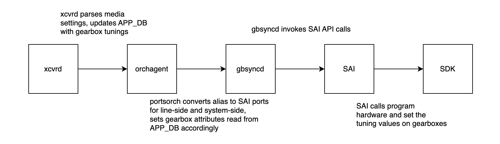

# SONiC Dynamic Gearbox Tuning Design Plan

## Revision

  | Version |     Date    |       Author           | Description                                                             |
  |:-------:|:-----------:|:----------------------:|:-----------------------------------------------------------------------:|
  | 0.1     | 12/19/2024  | Jan Mazurek            | Initial version                                                         |
  | 0.2     | 01/07/2026  | Brian Gallagher        | Updated after publishing PRs to implement this HLD                      |
  | 0.3     | 02/27/2026  | Brian Gallagher        | Changed the format of the media_settings.json to avoid changes in xcvrd |

## Summary

This document describes the design plan to implement dynamic gearbox (external phy) tuning for SONiC-supported switches.

## Definitions / Abbreviations

 | Term       |  Definition / Abbreviation                                            |
 |------------|-----------------------------------------------------------------------|
 | Tuning     | Process by which specific pre-emphasis is applied to a transmitted signal to cancel out noise.
 | Gearbox    | An external phy connected to some phsyical ports on the switch, designed to convert a set of input lanes at one rate (e.g., 4x10G) into a different set of output lanes at a compatible total bandwidth (e.g., 2x20G or 1x40G).
 | line-side  | The side of a gearbox facing the physical ports on a switch.
 | system-side| The side of a gearbox facing the internal switch ASIC.
 | APPL_DB    | Application Database
 | pmon       | Platform daemon controller
 | xcvrd      | daemon in charge of updating APPL_DB with transceiver information
 | orchagent  | process which monitors APPL_DB and makes SAI calls when certain events are triggered
 | SAI        | API library for programming switch hardware

## Context

When ethernet traffic travels over a medium like copper or fiber, noise propagates over time in the signal, reducing its clarity and increasing the risk of CRC errors or link issues. To this end, we introduce pre-emphasis noise to the signal when it is transmitted over a given medium in an effort to cancel out the natural noise which accumulates as the signal travels. We determine the amount of pre-emphasis noise to apply to each signal based on medium type and serdes rate of the transceiver. The pre-emphasis noise applied is represented by “tuning values”, which are used to program the hardware at each port to allow for the tunings to be applied. In switches where gearboxes are present, tuning values must be applied at each point of signal transmission, so tuning support must be available for the switch ASIC internal phys as well as the system-side and line-side ports of the gearboxes.  
Currently gearbox tuning values are set manually by reading a dedicated gearbox_config.json file and programming the hardware at system start. This means we need to manually set the tuning values any time that a customer wishes to change transceiver type/medium/speed.

For further background on Media tuning:

* [Media-based Port Settings](https://github.com/sonic-net/SONiC/blob/master/doc/media-settings/Media-based-Port-settings.md)  
* [Medium + Lane Speed based tuning](https://github.com/sonic-net/sonic-platform-daemons/pull/538)

## Theory

The aim of this feature is to create a larger media settings file which includes all configurations of transceivers and media types for a specific SKU and to implement a system which will dynamically set tuning values for all ASIC-port, ASIC-gearbox, and gearbox-port connections based on the detected type of transceivers/media present. This will eliminate the need for engineers to manually change these values in the future by allowing the platform daemon controller to automatically set these values based on detected media attributes. It will also simplify the process of configuring signal integrity tuning values for ports by consolidating all configuration into the media_settings.json file, regardless of whether a gearbox is involved or not.

**Note: system-side tuning values for a gearbox are independent of physical media and therefore typically remain static. In this proposal, they are still configured in the media_settings.json file in order to consolidate all tuning values for signal integrity in one place. In order to share the same tuning values across many different physical media, the 'Default' key can be used.**

## Current Design

### Orchagent

The orchagent process within sonic-swss currently configures gearbox tunings based on a gearbox_config.json file when gearbox ports are initialized. This means that any time a customer wants to change transceiver types or serdes lane speeds, a change to this file must be upstreamed to configure the new tuning values properly.

### Media Settings

The media settings file currently supports lookups for a variety of media tuning keys based on transceiver type for ASIC-port tunings. We intend to expand on the current design to include a section for gearbox media settings and update the parser file accordingly.

## Design Proposal

### 1\. sonic-buildimage \- Add gearbox-specific attributes in the Media Settings File

The first proposed change is to add support for gearbox-specific signal integrity tuning attributes. Existing attributes can be configured for either the line-side or system-side of a gearbox by prepending either `gb_line_` or `gb_system_` to the attribute name. For instance, to configure values for `pre1` on the line-side of the gearbox, the `gb_line_pre1` attribute would be specified in media_settings.json.

#### Example media_settings.json

```
{
    "MEDIA_SETTINGS": {
        "2-32": {
            "COPPER100": {
                "gb_line_pre1": {
                    "lane0": "0x75",
                    "lane1": "0x75",
                },
                "gb_line_main": {
                    "lane0": "0x75",
                    "lane1": "0x75",
                },
                "gb_line_post1": {
                    "lane0": "0x75",
                    "lane1": "0x75",
                },
                "gb_system_pre1": {
                    "lane0": "0x75",
                    "lane1": "0x75",
                    "lane2": "0x75",
                    "lane3": "0x75",
                },
                "gb_system_main": {
                    "lane0": "0x75",
                    "lane1": "0x75",
                    "lane2": "0x75",
                    "lane3": "0x75",
                },
                "gb_system_post1": {
                    "lane0": "0x75",
                    "lane1": "0x75",
                    "lane2": "0x75",
                    "lane3": "0x75",
                },
                ...
            },
        }
    },
    "PORT_MEDIA_SETTINGS": {
        "1": {
            "COPPER100": {
                "gb_line_pre1": {
                    "lane0": "0x5",
                    "lane1": "0x5",
                },
                "gb_line_main": {
                    "lane0": "0x5",
                    "lane1": "0x5",
                },
                "gb_line_post1": {
                    "lane0": "0x5",
                    "lane1": "0x5",
                },
                "gb_system_pre1": {
                    "lane0": "0x5",
                    "lane1": "0x5",
                    "lane2": "0x5",
                    "lane3": "0x5",
                },
                "gb_system_main": {
                    "lane0": "0x5",
                    "lane1": "0x5",
                    "lane2": "0x5",
                    "lane3": "0x5",
                },
                "gb_system_post1": {
                    "lane0": "0x5",
                    "lane1": "0x5",
                    "lane2": "0x5",
                    "lane3": "0x5",
                },
                ...
            },
        }
    }
}
```

### 2\. sonic-platform-daemons \- Update Media Settings Parser / xcvrd

`xcvrd` requires only minimal changes to support the above format. When calculating the speed for a media key, the line-side lane count will be used in the calculation. For example, when calculating lane speed, `xcvrd` performs calculations like `speed = int(int(int(port_speed) /lane_count)/1000)`. The gearbox line-side lane count will be used for `lane_count` in these calculations. Additionally, `xcvrd` requires some minor changes in its logic for publishing SI settings to APPL_DB to make sure it publishes the correct lane-width size for the line-side settings. These changes can be found in [this PR](https://github.com/sonic-net/sonic-platform-daemons/pull/728).

Other than that, `xcvrd` requires no further changes and will pick up the new attributes and publish them to APPL_DB out-of-the-box.

#### Example gearbox port APPL\_DB:

```
+-------------+-----------+----------------------------------------------------------------------------------------------------------------------------------------------+
| port_name   | DB_NAME   | DUMP                                                                                                                                         |
+=============+===========+==============================================================================================================================================+
| Ethernet32  | APPL_DB   | +-----------------------+------------------------------------------------------------------------------------------------------------------+ |
|             |           | | Keys                  | field-value pairs                                                                                                | |
|             |           | +=======================+==================================================================================================================+ |
|             |           | | PORT_TABLE:Ethernet32 | +--------------------+-----------------------------------------------------------------------------------------+ | |
|             |           | |                       | | field              | value                                                                                   | | |
|             |           | |                       | |--------------------+-----------------------------------------------------------------------------------------| | |
|             |           | |                       | | admin_status       | up                                                                                      | | |
|             |           | |                       | | alias              | etp9                                                                                    | | |
|             |           | |                       | | asic_port_name     | Eth32                                                                                   | | |
|             |           | |                       | | core_id            | 1                                                                                       | | |
|             |           | |                       | | core_port_id       | 25                                                                                      | | |
|             |           | |                       | | description        |                                                                                         | | |
|             |           | |                       | | dhcp_rate_limit    | 300                                                                                     | | |
|             |           | |                       | | flap_count         | 1                                                                                       | | |
|             |           | |                       | | gb_line_main       | 0x00000070,0x00000070,0x00000070,0x00000070,0x00000070,0x00000070,0x00000070,0x00000070 | | |
|             |           | |                       | | gb_line_post1      | 0x00000000,0x00000000,0x00000000,0x00000000,0x00000000,0x00000000,0x00000000,0x00000000 | | |
|             |           | |                       | | gb_line_post2      | 0x00000000,0x00000000,0x00000000,0x00000000,0x00000000,0x00000000,0x00000000,0x00000000 | | |
|             |           | |                       | | gb_line_pre1       | 0xffffffee,0xffffffee,0xffffffee,0xffffffee,0xffffffee,0xffffffee,0xffffffee,0xffffffee | | |
|             |           | |                       | | gb_line_pre2       | 0x00000000,0x00000000,0x00000000,0x00000000,0x00000000,0x00000000,0x00000000,0x00000000 | | |
|             |           | |                       | | gb_line_pre3       | 0x00000000,0x00000000,0x00000000,0x00000000,0x00000000,0x00000000,0x00000000,0x00000000 | | |
|             |           | |                       | | gb_system_main     | 0x00000080,0x00000080,0x00000080,0x00000080                                             | | |
|             |           | |                       | | gb_system_post1    | 0x00000000,0x00000000,0x00000000,0x00000000                                             | | |
|             |           | |                       | | gb_system_post2    | 0x00000000,0x00000000,0x00000000,0x00000000                                             | | |
|             |           | |                       | | gb_system_pre1     | 0x00000000,0x00000000,0x00000000,0x00000000                                             | | |
|             |           | |                       | | gb_system_pre2     | 0x00000000,0x00000000,0x00000000,0x00000000                                             | | |
|             |           | |                       | | gb_system_pre3     | 0x00000000,0x00000000,0x00000000,0x00000000                                             | | |
|             |           | |                       | | index              | 9                                                                                       | | |
|             |           | |                       | | lanes              | 56,57,58,59                                                                             | | |
|             |           | |                       | | last_up_time       | Wed Jan 07 17:53:08 2026                                                                | | |
|             |           | |                       | | line_oper_status   | up                                                                                      | | |
|             |           | |                       | | mtu                | 9100                                                                                    | | |
|             |           | |                       | | num_voq            | 8                                                                                       | | |
|             |           | |                       | | oper_status        | up                                                                                      | | |
|             |           | |                       | | role               | Ext                                                                                     | | |
|             |           | |                       | | speed              | 400000                                                                                  | | |
|             |           | |                       | | system_oper_status | up                                                                                      | | |
|             |           | |                       | +--------------------+-----------------------------------------------------------------------------------------+ | |
|             |           | +-----------------------+------------------------------------------------------------------------------------------------------------------+ |
+-------------+-----------+----------------------------------------------------------------------------------------------------------------------------------------------+
```

#### Example non-gearbox port APPL\_DB:

```
| Keys                  | field-value pairs                                                                                            | |
+=======================+==============================================================================================================+ |
| PORT_TABLE:Ethernet16 | +----------------+-----------------------------------------------------------------------------------------+ | |
|                       | | field          | value                                                                                   | | |
|                       | |----------------+-----------------------------------------------------------------------------------------| | |
|                       | | admin_status   | up                                                                                      | | |
|                       | | alias          | Ethernet3/1                                                                             | | |
|                       | | description    | Ethernet16-connected-to-bkd596@eth3/1                                                   | | |
|                       | | fec            | rs                                                                                      | | |
|                       | | flap_count     | 3                                                                                       | | |
|                       | | index          | 3                                                                                       | | |
|                       | | lanes          | 49,50,51,52,53,54,55,56                                                                 | | |
|                       | | last_down_time | Tue Nov 19 18:23:41 2024                                                                | | |
|                       | | last_up_time   | Tue Nov 19 18:23:47 2024                                                                | | |
|                       | | main           | 0x8a,0x8b,0x8b,0x8a,0x8a,0x8b,0x8a,0x8b                                                 | | |
|                       | | mtu            | 9100                                                                                    | | |
|                       | | oper_status    | up                                                                                      | | |
|                       | | pfc_asym       | off                                                                                     | | |
|                       | | post1          | 0xfffffff6,0xfffffff5,0xfffffff5,0xfffffff6,0xfffffff6,0xfffffff5,0xfffffff6,0xfffffff5 | | |
|                       | | post2          | 0xfffffffe,0xffffffff,0xffffffff,0xfffffffe,0xfffffffe,0xffffffff,0xfffffffe,0xffffffff | | |
|                       | | post3          | 0xfffffffd,0xfffffffd,0xfffffffd,0xfffffffd,0xfffffffd,0xfffffffd,0xfffffffd,0xfffffffd | | |
|                       | | pre1           | 0xfffffff1,0xfffffff1,0xfffffff1,0xfffffff1,0xfffffff1,0xfffffff1,0xfffffff1,0xfffffff1 | | |
|                       | | pre2           | 0x2,0x1,0x1,0x2,0x2,0x1,0x2,0x1                                                         | | |
|                       | | pre3           | 0x0,0x0,0x0,0x0,0x0,0x0,0x0,0x0                                                         | | |
|                       | | speed          | 400000                                                                                  | | |
|                       | | subport        | 0                                                                                       | | |
|                       | | tpid           | 0x8100                                                                                  | | |
|                       | +----------------+-----------------------------------------------------------------------------------------+ | |
+-----------------------+--------------------------------------------------------------------------------------------------------------+ |
```

### 3\. sonic-swss \- Update Orchagent to Dynamically Program Gearbox Tunings

The third proposed change is to alter the way the orchagent process sets gearbox tunings. Upon detecting a change within APPL\_DB for a particular port, orchagent will be triggered to run doPortTask() with SET\_COMMAND on the logical port. Since the media settings parser change from above will use the same mechanism as before to update APPL\_DB with gearbox tunings, similarly the same flow and system can be used within orchagent as before to set the gearbox tuning values. This will involve creating new serdes attributes for line-side and system-side tunings. These new serdes attributes will then be used to make SAI calls and program the relevant gearbox ports in a manner similar to how ASIC tunings are currently applied. In the current iteration of this feature, only tunings with serdes attributes of the form ('pre3', 'pre2', 'pre1', 'main', 'post1', 'post2', 'post3') will be parsed and applied to gearbox ports. This change will allow orchagent to dynamically set the appropriate tunings to gearboxes if customers ever wish to change the configuration of their ports or transceivers and will eliminate the need for engineers to spend time doing so manually.

These changes can be found in [this PR](https://github.com/sonic-net/sonic-swss/pull/4113).

## Overview \- Big Picture

The following diagram depicts an overview of the new proposed dynamic gearbox tuning flow. Intentionally, this is identical to the current flow of ASIC-port dynamic tuning with media settings as shown in [SONiC/Media-based-Port-settings.md at master](https://github.com/sonic-net/SONiC/blob/master/doc/media-settings/Media-based-Port-settings.md).


