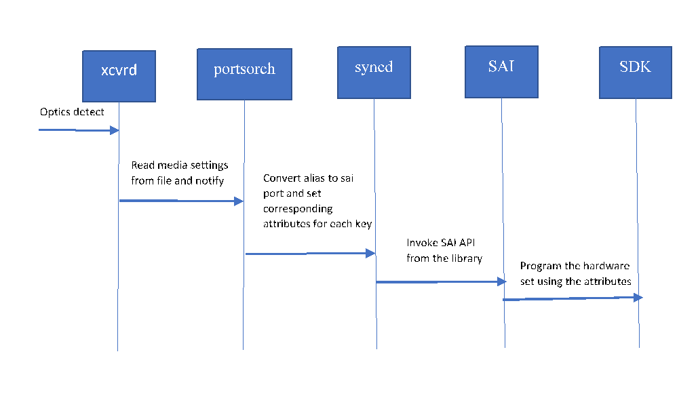
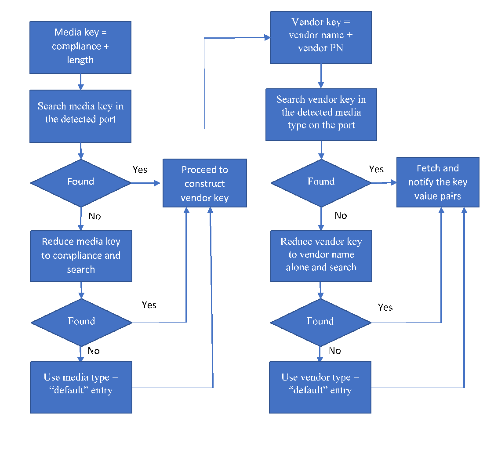

# Media based port settings in SONIC

## 1 Document History

| Version | Date       | Author                 | Description                                      |
|---------|------------|------------------------|--------------------------------------------------|
| v.01    | 01/30/2019 |Sudharsan               | Initial version from Dell                        |

## Overview:


              Networking devices such as switches or routers use different kind of optics as well as DAC cables to connect with peer devices such as servers, storage or other networking devices. There are different types of networking cables available and based on the cable type the networking ASIC might require additional settings for a cable to work properly on a port. As an example, a 40G-QSFP-CR4 2M DAC might require a different pre-emphasis setting on a device based on Broadcom ASIC than 40G-QSFP-CR4 1M DAC on a port. If the pre-emphasis is not set properly the traffic flowing through the port might encounter CRC errors and even in some cases the port might not even become operationally up.

              To solve the above problem, few SAI attributes required for serdes programming are listed in section below. These SAI attributes will be programmed during media insert event.

## Media settings file:


              The media settings file device/vendor-name/ONIE_PLATFORM_STRING/media_settings.json needs to be defined by each vendor who want to use this mechanism.  All the SKUs of the platform share this media_settings.json file. If there is no such file, then this mechanism will not be used. Thus if some vendors want to disable this mechanism, not defining a media_settings.json file should be sufficient.
	      
              This file contains the list of optics and DAC media-based settings for each port in the device. Each media setting for a media type comprises of key-value pairs per lane that is expected to be programmed when an optics or DAC is used. Examples of key value pairs include pre-emphasis, idriver and ipredriver.
	
              Below example shows the media-based settings for a device on a Broadcom based platform.  For each port the list of supported optics and DAC types are defined (uniquely identified by media type key). For each media type the list of supported vendors (uniquely identified by vendor key) is defined. Each vendor key which will in turn contain the key value pairs per lane that needs to be programmed.
	
              The media type key defined in the file will be comprised of compliance code and length string or simply compliance code if length does not apply (e.g. 40GBASE-CR4-3M or 40GBASE-SR4).
	
              The file comprises of two blocks. The first block is for global level settings, where all or multiple ports can be presented as keys. The multiple ports can be represented as a range (1-32) or a list(1,2,3) or a list of ranges(1-10,20-30) of index number in port_config.ini. The second block is port level settings where the key comprises of a single port number.
	
              When a media is detected, the front panel port is identified and index number is derived. First the global level is looked up and if there is a range or list that the port false within is found, then the vendor key (vendor name + vendor PN) as well as media_key (media type + specification compliance + length) is constructed and looked up at the next level. First Vendor key (eg. AMPHENOL-1234) is looked and If there is an exact match then those values are fetched and returned. If vendor key doesn't match, then media key (eg. QSFP28-40GBASE-CR4-1M) is looked and if there is a match then those values are fetched and returned.  The purpose of having a media key is to have default values for a media type across vendors.  A no-match on vendor and media keys will make the search fall back to individual port based block from global block.

              In the port based settings block, the index number of the port on which it is detected is identified at the first level. At second level, the Vendor key is and media key are derived as earlier (e.g. DELL-0123, QSFP28-40GBASE-SR4).  If there is no exact match for vendor key or media key, then the default value listed is chosen. Below is an example for json file for a specific port. For the port 1 a Vendor specific media type and a 'Default' media type is defined apart from global section containing vendor key as well as media key. The 'Default' media type can also be defined at a global section for a range of ports, if multiple ports have same default values.


### Sample Media settings file:
```
{
    "GLOBAL_MEDIA_SETTINGS": {
        "1-32": {
            "AMPHENOL-1234": {
                "preemphasis": {
                    "lane0":"0x001234",
                    "lane1":"0x001234",
                    "lane2":"0x001234",
                    "lane3":"0x001234"
                },
                "idriver": {
                    "lane0":"0x2",
                    "lane1":"0x2",
                    "lane2":"0x2",
                    "lane3":"0x2"
                }
            },
            "MOLEX-5678": {
                "preemphasis": {
                    "lane0":"0x005678",
                    "lane1":"0x005678",
                    "lane2":"0x005678",
                    "lane3":"0x005678"
                },
                "idriver": {
                    "lane0":"0x1",
                    "lane1":"0x1",
                    "lane2":"0x1",
                    "lane3":"0x1"
                }
            },
            "QSFP28-40GBASE-CR4-1M":{
                "preemphasis": {
                    "lane0":"0x005678",
                    "lane1":"0x005678"
                },
                "idriver": {
                    "lane0":"0x1",
                    "lane1":"0x1"
                }
            }
        },
	"2,4,6,8": {
	    "Default": {
                "preemphasis": {
                    "lane0":"0x612233",
                    "lane1":"0x512233",
                    "lane2":"0x412244",
                    "lane3":"0x343322"
                },
                "idriver": {
                    "lane0":"0x1",
                    "lane1":"0x2",
                    "lane2":"0xd",
                    "lane3":"0x1"
                }
	    }
	}
    },
    "PORT_MEDIA_SETTINGS": {
        "1": {
            "Default": {
                "preemphasis": {
                    "lane0":"0x112233",
                    "lane1":"0x112233",
                    "lane2":"0x112244",
                    "lane3":"0x443322"
                },
                "idriver": {
                    "lane0":"0xb",
                    "lane1":"0xc",
                    "lane2":"0xd",
                    "lane3":"0xa"
                }
            },
            "DELL-5678": {
                "preemphasis": {
                    "lane0":"0x102233",
                    "lane1":"0x132233",
                    "lane2":"0x152244",
                    "lane3":"0x413322"
                },
                "idriver": {
                   "lane0":"0xc",
                   "lane1":"0xc",
                   "lane2":"0xd",
                   "lane3":"0xb"
               }
            }
        }
    }
}
```

## Flow:


              When a media is detected in xcvrd daemon, it constructs the key identifier string as discussed above and searches the media_settings.json file. If found the key value pairs are fetched. The xcvrd daemon then sets the keys with values on appl_db PORT_TABLE. The logical ports are derived from the index number in the xcvrd daemon. The portsorch task will convert the logical port to SAI object Id and notifies the syncd by doing port attribute set of corresponding keys obtained from xcvrd. Syncd invokes the SAI port set those attribute with specified values. The SAI implementation then programs the attribute into the hardware.

              The notification of hardware profile from xcvrd to portsorch task will be done during initialization and during media detect event. However this notification will not happen during warm-reboot. This notification is also not required during media removal event. Since the media settings are required only for the proper functioning of the optics or DAC, the handling can be restricted to media insert event alone and no action needs to be taken during media removal.

              This mechanism is also very helpful in supporting new media types without upgrading the Operating system. If a new media type need to be supported the only change that needs to be done is modify media_settings.json to add the new media type.


              


## Breakout Scenario:

              For breakout scenario, there is no special handling or modification that needs to be done to media_settings.json. Currently breakout in SONiC is done by modifying port_config.ini and platform related files and doing a config reload. This config reload will stop and restart most of the daemons. Thus this sequence will be similar to the normal reboot sequence. When xcvrd is stopped and restarted it notifies portsorch about all media just as in normal reboot scenario.
	      
              The breakout media is listed either in global or port level section with appropriate number of lanes corresponding to the type. On media detection, the number of lanes per logical port and number of lanes listed in the media_settings.json file would match and thus this will be a normal scenario. For example if a 2X50G DAC media is detected on a port, each logical port would have two lanes and the media settings file would have two lanes defined as below and those those would be fetched and communicated to portsorch task.


```
{
    "GLOBAL_MEDIA_SETTINGS": {
        "1-32": {
            "AMPHENOL-2250": {
                "preemphasis": {
                    "lane0":"0x001234",
                    "lane1":"0x001234"
                },
                "idriver": {
                    "lane0":"0x2",
                    "lane1":"0x2"
                }
            }
	}
    }
}
```

              If there is no match for the media type or vendor PN detected, the media will be programmed with the default values listed in the port section for the particular physical port. However the values listed in media_settings.json for the physical port will be in four lane format. Thus for 2X50 breakout mode where there are two logical ports, the first two lanes in the key value pairs are associated with the first logical port and the next two lanes are associated with the next logical port. xcvrd will take care of these mapping and communicate the final logical ports with key value pairs and appropriate number of lanes to portsorch

```
{
    "PORT_MEDIA_SETTINGS": {
        "1": {
            "Default": {
                "preemphasis": {
                    "lane0":"0x001231",
                    "lane1":"0x001232",
		    "lane2":"0x001233",
		    "lane3":"0x001234",
                }
            }
	}
    }
}
```
              In the above case if the port 1 is in 2X50 mode with the logical ports Ethernet0 and Ethernet2 and the detected media type is unknown, xcvrd assigns pre-emphasis values 0x001231, 0x001232 to Ethernet0 and 0x001233, 0x001234 to Ethernet4 and communicates to portsorch	      
	      
## SAI Attributes:


              To define attributes for SAI pre-emphasis attribute as below. Some attributes like IDRIVER and IPREDRIVER are specific to Broadcom but required to be programmed for different cables similar to pre-emphasis. If an asic vendor does not support these attributes, then SAI implementation can return SAI_STATUS_NOT_SUPPORTED during set attribute call

```
/**
     * @brief Port serdes control pre-emphasis
     *
     * List of port serdes pre-emphasis values. The values are of type sai_u32_list_t
     * where the count is number lanes in a port and the list specifies list of values
     * to be applied to each lane.
     *
     * @type sai_u32_list_t
     * @flags CREATE_AND_SET
     * @default internal
     */
    SAI_PORT_ATTR_SERDES_PREEMPHASIS,
	
    /**
     * @brief Port serdes control idriver
     *
     * List of port serdes idriver values. The values are of type sai_u32_list_t
     * where the count is number lanes in a port and the list specifies list of values
     * to be applied to each lane.
     *
     * @type sai_u32_list_t
     * @flags CREATE_AND_SET
     * @default internal
     */
    SAI_PORT_ATTR_SERDES_IDRIVER,
 
    /**
     * @brief Port serdes control ipredriver
     *
     * List of port serdes ipredriver values. The values are of type sai_u32_list_t
     * where the count is number lanes in a port and the list specifies list of values
     * to be applied to each lane.
     *
     * @type sai_u32_list_t
     * @flags CREATE_AND_SET
     * @default internal
     */
    SAI_PORT_ATTR_SERDES_IPREDRIVER,
```
[This the pull request](https://github.com/opencomputeproject/SAI/pull/907)
