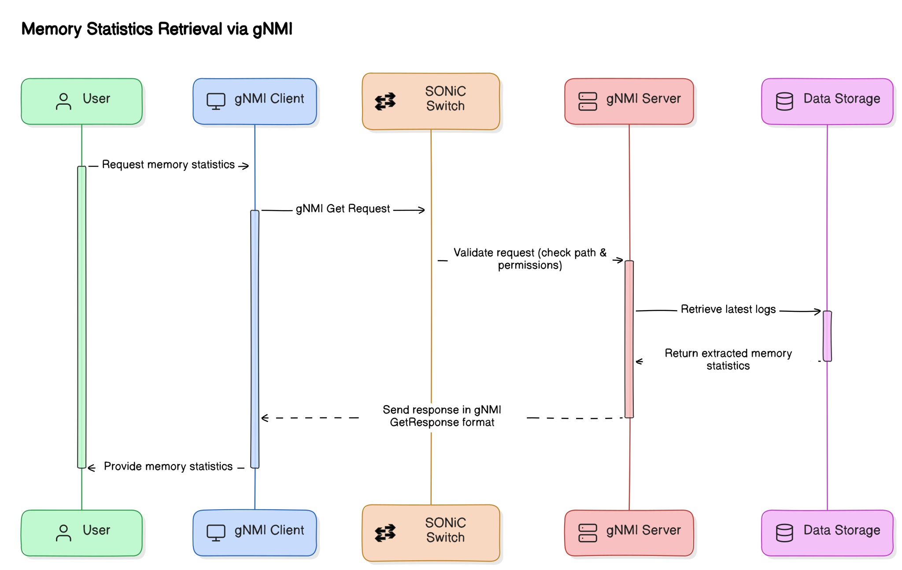

# Memory Statistics Enhancement with New Metrics, Leak Detection, and gNMI Access

## Revision History

| Revision No. | Description       | Editor                                   | Date          |
|-------------|------------------|--------------------------------------------|---------------|
| 1.0         | Document Creation | Kanza Latif, Hamza Hashmi and Arham Nasir | 09 April 2025 |

## Table of Contents

- [Scope](#scope)
- [Definitions/Abbreviations](#definitionsabbreviations)
- [Overview](#overview)
- [Functional Requirements](#functional-requirements)
- [Architecture Design](#architecture-design)
- [High-Level Design](#high-level-design)
  - [Core Functionalities](#core-functionalities)
  - [Sequence Diagrams](#sequence-diagrams)
- [SAI API](#sai-api)
- [Configuration and Management](#configuration-and-management)
  - [CLI/YANG Model Enhancements](#cliyang-model-enhancements)
    - [CLI Commands](#cli-commands)
      - [Config Commands](#config-commands)
      - [Show Commands](#show-commands)
  - [Daemon Configuration Management](#daemon-configuration-management)
  - [Config DB Enhancements](#config-db-enhancements)
- [Warmboot and Fastboot Design Impact](#warmboot-and-fastboot-design-impact)
- [Testing Requirements/Design](#testing-requirementsdesign)
  - [Unit Test Cases](#unit-test-cases)
  - [System Test Cases](#system-test-cases)
- [Future Work](#future-work)

---

## Scope

This High-Level Design (HLD) document enhances the existing Memory Statistics feature in SONiC by extending memory metrics to include Docker, process, and CPU memory, adding memory leak detection, and enabling remote log access via gNMI.

---

## Definitions/Abbreviations

| Sr No. | Term         | Definition  |
|--------|-------------|------------|
| 1      | gNMI        | Network Management Interface, a protocol for network management and telemetry |
| 2      | gRPC        | Remote Procedure Call, a high-performance framework for communication between network components |
| 3      | Telemetry   | A mechanism to collect and export real-time operational data from the system |
| 4      | Log Processing | The method of formatting and organizing log files for efficient retrieval and analysis |

---

## Overview
This High-Level Design (HLD) enhances SONiC’s Memory Statistics feature, originally limited to system-level memory monitoring via CLI, into a comprehensive solution that now includes Docker containers, individual processes, and CPU memory metrics. It introduces memory leak detection to prevent resource exhaustion and integrates gNMI for remote log access, reducing local dependency. This upgrade provides complete visibility across memory metrics with user-defined sampling and retention periods. Moreover, it also helps with early memory leak detection and efficient remote retrieval.

---

## Functional Requirements
This section outlines the functional requirements necessary for implementing this HLD in SONiC:

- **Monitoring Capabilities:** The system must monitor memory metrics for system (Total, Used, Free, Available, Cached, Buffers, Shared), Docker containers, individual processes, and CPU usage.
- **Memory Leak Detection:** The feature must analyze memory usage trends over time to detect potential leaks and report them via CLI.
- **Configurability:** The system must allow configuration of sampling intervals (3–15 minutes) and retention periods (1–30 days) via CLI.
- **CLI Enhancements:** The CLI must support displaying new metrics and leak analysis with filtering options.
- **Remote Log Access:** gNMI integration must enable retrieval of memory logs from remote systems.

---

## Architecture Design

The enhancement fits within the existing framework without altering its core structure. The memorystatsd is extended to collect additional metrics and detect leaks, interfacing with hostcfgd for ConfigDB updates. Enhancements were made to the existing gNMI server which processes logs into JSON and makes them remotely accessible. This integrates seamlessly with SONiC’s modular design, leveraging existing daemons and adding gNMI capabilities.

<p align="center">
    
    <br>
	Figure 1: Feature architecture diagram showing the unix socket, daemon, ConfigDB, data file and gNMI
</p>

---

## High-Level Design

### Core Functionalities

#### Data Collection and Storage
The `memorystatsd` collects system, Docker, process, and CPU memory metrics using `psutil` and Docker APIs, storing them as compressed log files for optimized memory usage.

#### Log Processing and Storage
Logs are processed into JSON for gNMI retrieval with low overhead.

#### Memory Leak Detection
This feature analyzes memory trends by comparing usage over time to detect steady increases reported via `show memory-stats --type process --leak-analysis` (e.g., "Potential Leak Detected").

#### Remote Access via gNMI
The gNMI server, running inside SONiC’s built-in gNMI container, retrieves JSON-formatted memory logs placed by memorystatsd and serves them to the clients.

#### User Interaction
Users view statistics, configure settings (reusing `enable/disable`, `sampling_interval` and `retention_period` from [v1](https://github.com/Arham-Nasir/SONiC/blob/4cf0b5d0bc973cf3a72f91b7f0a9567fd42eeccd/doc/memory_statistics/memory_statistics_hld.md)) and analyze leaks via CLI. Logs can also be fetched remotely via gNMI.

### Sequence Diagrams
- **View Memory Usage**:  
  - **Description**: It shows the CLI-based retrieval of memory metrics (system, Docker, process, CPU).  
  - **Diagram**:
  <p align="center">  
          
        <br>  
        <em>Figure 2: View Memory Usage</em>  
    </p> 
- **Memory Leak Detection**:  
  - **Description**: It tracks memory usage over time, detects unusual growth trends and warns about possible leaks.
  - **Diagram**:  
  <p align="center">  
        
      <br>  
      <em>Figure 3: Sequence for memory leak detection</em>  
  </p>  
- **gNMI Log Retrieval**:  
  - **Description**: This diagram outlines remote log access.  
  - **Diagram**:  
   <p align="center">  
          
        <br>  
        <em>Figure 4: Sequence for gNMI log retrieval</em>  
    </p>

---

## SAI API

No SAI API changes are required.

---

## Configuration and Management
## CLI/YANG Model Enhancements

### CLI Commands

#### Config Commands
The following configuration commands are reused from [v1](https://github.com/Arham-Nasir/SONiC/blob/4cf0b5d0bc973cf3a72f91b7f0a9567fd42eeccd/doc/memory_statistics/memory_statistics_hld.md) without modification:  
1. ##### config memory-stats enable/disable
   - Enables or disables monitoring (default: disabled).  
   - Example: `config memory-stats enable` → "Memory statistics monitoring enabled."  
2. ##### config memory-stats sampling-interval <interval>
   - Sets sampling interval (3–15 minutes, default: 5).  
   - Example: `config memory-stats sampling-interval 10` → "Sampling interval set to 10 minutes."  
3. ##### config memory-stats retention-period <period>
   - Sets retention period (1–30 days, default: 15).  
   - Example: `config memory-stats retention-period 20` → "Retention period set to 20 days."

#### Show Commands
Below are all the upgraded CLI commands with their definitions and sample outputs. These commands cover memory metrics for the system, Docker, process, CPU and leak analysis.

1. ##### View Memory Statistics
   ##### Command:
   `show memory-stats [--type <system|docker|process|cpu>] [--from <date-time>] [--to <date-time>] [--select <metric>] [--leak-analysis]`
   - ##### Description:
     - Displays memory statistics for the specified type (system, Docker, process, or CPU | default: system, last 15 days).
     - `--type <system|docker|process|cpu>`: Specifies the metric type.
     - `--from/--to`: Defines the time range (ISO format or relative, e.g., "5 days ago").
     - `--select <metric>`: Filters specific metrics (e.g., total_memory, used_memory, or process/container name/ID).
     - `--leak-analysis`: Enables leak detection mode.
   - ##### Sample Outputs:

     ##### System Memory Statistics (Default):
     ```
     admin@sonic:~$ show memory-stats --type system
     Memory Statistics (System):
     Codes: M - minutes, H - hours, D - days
     --------------------------------------------------------------------------------
     Report Generated:    2025-03-10 14:30:00
     Analysis Period:     From 2025-02-23 14:30:00 to 2025-03-10 14:30:00
     Interval:            2 Days
     --------------------------------------------------------------------------------------------------------------------------------------------------
     Metric             Current    High       Low        D23-D25    D25-D27    D27-D01    D01-D03    D03-D05    D05-D07    D07-D09    D09-D10
                        Value      Value      Value      23Feb25    25Feb25    27Feb25    01Mar25    03Mar25    05Mar25    07Mar25    09Mar25
     --------------------------------------------------------------------------------------------------------------------------------------------------
     total_memory       15.29GB    15.29GB    15.29GB    15.29GB    15.29GB    15.29GB    15.29GB    15.29GB    15.29GB    15.29GB    15.29GB
     used_memory        8.87GB     9.35GB     8.15GB     8.15GB     9.10GB     8.20GB     8.30GB     9.05GB     8.40GB     9.35GB     8.87GB
     free_memory        943.92MB   906.28MB   500.00MB   800.00MB   750.00MB   906.28MB   650.00MB   600.00MB   550.00MB   500.00MB   943.92MB
     available_memory   4.78GB     4.74GB     4.35GB     4.65GB     4.60GB     4.55GB     4.74GB     4.45GB     4.40GB     4.35GB     4.78GB
     cached_memory      5.17GB     5.08GB     4.96GB     5.08GB     5.06GB     5.04GB     5.02GB     5.00GB     4.98GB     4.96GB     5.17GB
     buffers_memory     337.83MB   333.59MB   295.00MB   325.00MB   320.00MB   315.00MB   333.59MB   305.00MB   300.00MB   295.00MB   337.83MB
     shared_memory      1.31GB     1.22GB     1.08GB     1.22GB     1.20GB     1.18GB     1.15GB     1.12GB     1.10GB     1.08GB     1.31GB
     ```

     ##### System Memory Statistics (Filtered with Time Range):
     ```
     admin@sonic:~$ show memory-stats --type system --from "5 days ago" --to "now" --select used_memory
     Memory Statistics (System):
     Codes: M - minutes, H - hours, D - days
     --------------------------------------------------------------------------------
     Report Generated:    2025-03-10 14:30:00
     Analysis Period:     From 2025-03-05 14:30:00 to 2025-03-10 14:30:00
     Interval:            1 Day
     --------------------------------------------------------------------------------------------------------------------------------------------------
     Metric             Current    High       Low        D05-D06    D06-D07    D07-D08    D08-D09    D09-D10
                        Value      Value      Value      05Mar25    06Mar25    07Mar25    08Mar25    09Mar25
     --------------------------------------------------------------------------------------------------------------------------------------------------
     used_memory        8.87GB     9.35GB     8.40GB     8.40GB     8.50GB     9.35GB     8.90GB     8.87GB
     ```

     ##### Docker Memory Statistics (Default):
     ```
     admin@sonic:~$ show memory-stats --type docker
     Memory Statistics (Docker):
     Codes: M - minutes, H - hours, D - days
     --------------------------------------------------------------------------------
     Report Generated:    2025-03-10 14:30:00
     Analysis Period:     From 2025-02-23 14:30:00 to 2025-03-10 14:30:00
     Interval:            2 Days
     --------------------------------------------------------------------------------------------------------------------------------------------------
     Container          Current    High       Low        D23-D25    D25-D27    D27-D01    D01-D03    D03-D05    D05-D07    D07-D09    D09-D10
                        Value      Value      Value      23Feb25    25Feb25    27Feb25    01Mar25    03Mar25    05Mar25    07Mar25    09Mar25
     --------------------------------------------------------------------------------------------------------------------------------------------------
     swss(7ef9d6a)      52.3MB     52.5MB     44.7MB     44.7MB     44.8MB     49.4MB     46.4MB     52.3MB     52.4MB     52.5MB     52.3MB
     stp(adf43d2)       22.8MB     23.3MB     22.5MB     22.5MB     22.6MB     22.7MB     22.8MB     22.9MB     23.0MB     23.3MB     22.8MB
     telemetry(b752462) 31.9MB     32.8MB     31.9MB     31.9MB     32.0MB     32.1MB     32.2MB     32.3MB     32.5MB     32.8MB     31.9MB
     ```

     ##### Docker Memory Statistics (Filtered with Time Range):
     ```
     admin@sonic:~$ show memory-stats --type docker --from "23 hours ago" --to "now" --select swss
     Memory Statistics (Docker):
     Codes: M - minutes, H - hours, D - days
     --------------------------------------------------------------------------------
     Report Generated:    2025-03-10 14:30:00
     Analysis Period:     From 2025-03-09 15:30:00 to 2025-03-10 14:30:00
     Interval:            3 Hours
     --------------------------------------------------------------------------------------------------------------------------------------------------
     Container          Current    High       Low        H15-H18    H18-H21    H21-H00    H00-H03    H03-H06    H06-H09    H09-H12    H12-H14
                        Value      Value      Value      09Mar25    09Mar25    09Mar25    10Mar25    10Mar25    10Mar25    10Mar25    10Mar25
     --------------------------------------------------------------------------------------------------------------------------------------------------
     swss(7ef9d6a)      52.3MB     52.5MB     52.2MB     52.2MB     52.3MB     52.4MB     52.5MB     52.4MB     52.3MB     52.3MB     52.3MB
     ```

     ##### Process Memory Statistics (Default):
     ```
     admin@sonic:~$ show memory-stats --type process
     Memory Statistics (Process):
     Codes: M - minutes, H - hours, D - days
     --------------------------------------------------------------------------------
     Report Generated:    2025-03-10 14:30:00
     Analysis Period:     From 2025-02-23 14:30:00 to 2025-03-10 14:30:00
     Interval:            2 Days
     --------------------------------------------------------------------------------------------------------------------------------------------------
     Process            Current    High       Low        D23-D25    D25-D27    D27-D01    D01-D03    D03-D05    D05-D07    D07-D09    D09-D10
                        Value      Value      Value      23Feb25    25Feb25    27Feb25    01Mar25    03Mar25    05Mar25    07Mar25    09Mar25
     --------------------------------------------------------------------------------------------------------------------------------------------------
     bgpd(6284)         19.2MB     19.2MB     18.4MB     18.4MB     18.5MB     18.6MB     18.7MB     18.8MB     18.9MB     19.2MB     19.2MB
     syncd(7889)        504.8MB    504.9MB    504.8MB    504.8MB    504.8MB    504.8MB    504.8MB    504.9MB    504.9MB    504.9MB    504.8MB
     python3(14573)     20.3MB     20.3MB     20.3MB     20.3MB     20.3MB     20.3MB     20.3MB     20.3MB     20.3MB     20.3MB     20.3MB
     ```

     ##### Process Memory Statistics (Filtered with Time Range):
     ```
     admin@sonic:~$ show memory-stats --type process --from "12 hours ago" --to "now" --select bgpd
     Memory Statistics (Process):
     Codes: M - minutes, H - hours, D - days
     --------------------------------------------------------------------------------
     Report Generated:    2025-03-10 14:30:00
     Analysis Period:     From 2025-03-10 02:30:00 to 2025-03-10 14:30:00
     Interval:            2 Hours
     --------------------------------------------------------------------------------------------------------------------------------------------------
     Process            Current    High       Low        H02-H04    H04-H06    H06-H08    H08-H10    H10-H12    H12-H14
                        Value      Value      Value      10Mar25    10Mar25    10Mar25    10Mar25    10Mar25    10Mar25
     --------------------------------------------------------------------------------------------------------------------------------------------------
     bgpd(6284)         19.2MB     19.2MB     19.1MB     19.1MB     19.1MB     19.2MB     19.2MB     19.2MB     19.2MB
     ```

     ##### CPU Memory Statistics (Default):
     ```
     admin@sonic:~$ show memory-stats --type cpu
     Memory Statistics (CPU):
     Codes: M - minutes, H - hours, D - days
     --------------------------------------------------------------------------------
     Report Generated:    2025-03-10 14:30:00
     Analysis Period:     From 2025-02-23 14:30:00 to 2025-03-10 14:30:00
     Interval:            2 Days
     --------------------------------------------------------------------------------------------------------------------------------------------------
     Metric             Current    High       Low        D23-D25    D25-D27    D27-D01    D01-D03    D03-D05    D05-D07    D07-D09    D09-D10
                        Value      Value      Value      23Feb25    25Feb25    27Feb25    01Mar25    03Mar25    05Mar25    07Mar25    09Mar25
     --------------------------------------------------------------------------------------------------------------------------------------------------
     cpu_memory         2.5GB      2.7GB      2.2GB      2.2GB      2.3GB      2.4GB      2.5GB      2.6GB      2.7GB      2.6GB      2.5GB
     ```

     ##### CPU Memory Statistics (Filtered with Time Range):
     ```
     admin@sonic:~$ show memory-stats --type cpu --from "20 hours ago" --to "now"
     Memory Statistics (CPU):
     Codes: M - minutes, H - hours, D - days
     --------------------------------------------------------------------------------
     Report Generated:    2025-03-10 14:30:00
     Analysis Period:     From 2025-03-09 18:30:00 to 2025-03-10 14:30:00
     Interval:            3 Hours
     --------------------------------------------------------------------------------------------------------------------------------------------------
     Metric             Current    High       Low        H18-H21    H21-H00    H00-H03    H03-H06    H06-H09    H09-H12    H12-H14
                        Value      Value      Value      09Mar25    09Mar25    10Mar25    10Mar25    10Mar25    10Mar25    10Mar25
     --------------------------------------------------------------------------------------------------------------------------------------------------
     cpu_memory         2.5GB      2.7GB      2.4GB      2.4GB      2.5GB      2.6GB      2.7GB      2.6GB      2.5GB      2.5GB
     ```

     ##### Process Memory Statistics with Leak Analysis (Default):
    
      ```
      admin@sonic:~$ show memory-stats --type process --leak-analysis
      Memory Statistics (Process Leak Analysis):
      Codes: M - minutes, H - hours, D - days
      --------------------------------------------------------------------------------
      Report Generated:    2025-03-10 14:30:00
      Analysis Period:     From 2025-02-23 14:30:00 to 2025-03-10 14:30:00
      Interval:            2 Days
      Threshold:           2048 KB
      ------------------------------------------------------------------------------------------------------------------------------------------------------------------------------------
      Process            Current    High       Low        D23-D25    D25-D27    D27-D01    D01-D03    D03-D05    D05-D07    D07-D09    D09-D10    Diff       Status
                         Value      Value      Value      23Feb25    25Feb25    27Feb25    01Mar25    03Mar25    05Mar25    07Mar25    09Mar25    (Total)
      ------------------------------------------------------------------------------------------------------------------------------------------------------------------------------------
      bgpd(7437)         19.2MB     19.2MB     18.4MB     18.4MB     18.5MB     18.6MB     18.7MB     18.8MB     18.9MB     19.2MB     19.2MB     850 KB     No Leak
      syncd(32734)       5.6MB      5.6MB      752.0KB    752.0KB    1.2MB      2.0MB      3.0MB      4.0MB      4.8MB      5.2MB      5.6MB      4.8 MB     Potential Leak Detected
      ```

      ##### Process Memory Statistics with Leak Analysis (Filtered with Time Range)
        ```
        admin@sonic:~$ show memory-stats --type process --from "20 minutes ago" --to "now" --select syncd --leak-analysis
        Memory Statistics (Process Leak Analysis):
        Codes: M - minutes, H - hours, D - days
        --------------------------------------------------------------------------------
        Report Generated:    2025-03-10 14:30:00
        Analysis Period:     From 2025-03-10 14:10:00 to 2025-03-10 14:30:00
        Interval:            2 Minutes
        Threshold:           2048 KB
        --------------------------------------------------------------------------------------------------------------------------------------------------
        Process            Current    High       Low        M10-M12    M12-M14    M14-M16    M16-M18    M18-M20    Diff       Status
                           Value      Value      Value      14:10      14:12      14:14      14:16      14:18      (Total)
        --------------------------------------------------------------------------------------------------------------------------------------------------
        syncd(32734)       5.6MB      5.6MB      752.0KB    752.0KB    2.0MB      3.5MB      4.8MB      5.6MB      4.8 MB     Potential Leak Detected
        --------------------------------------------------------------------------------------------------------------------------------------------------
        ```

### Config DB Enhancements

No Config DB enhancements required (Reused from [v1](https://github.com/Arham-Nasir/SONiC/blob/4cf0b5d0bc973cf3a72f91b7f0a9567fd42eeccd/doc/memory_statistics/memory_statistics_hld.md))

---

## Warmboot and Fastboot Design Impact

No impact on warmboot/fastboot functionalities.

---

## Testing Requirements/Design

### Unit Test Cases
| Test Case ID | Description                                                                 |
|--------------|-----------------------------------------------------------------------------|
| UT1         | Verify CLI to show Docker, process and CPU memory stats                                      |
| UT2         | Verify CLI to show Docker, process and CPU memory stats with leak analysis                  |                                        |
| UT3         | Verify leak detection for a process exceeding threshold                     |
| UT4         | Verify gNMI log retrieval for all metric types                              |

### System Test Cases
| Test Case ID | Description                                                                 |
|--------------|-----------------------------------------------------------------------------|
| ST1          | Validate end-to-end functionality, including gNMI and CLI retrieval  |

---

## Future Work
- Add alerting for memory leaks via email/syslog.
- Extend support to additional memory-related metrics.
