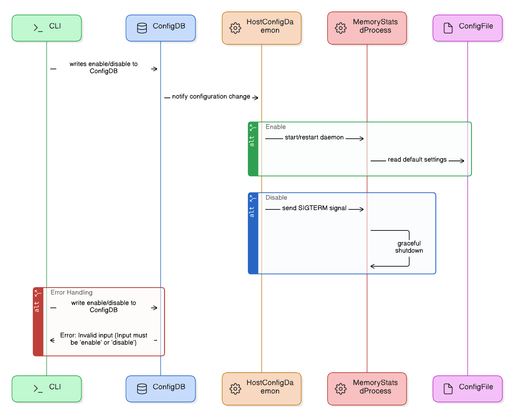
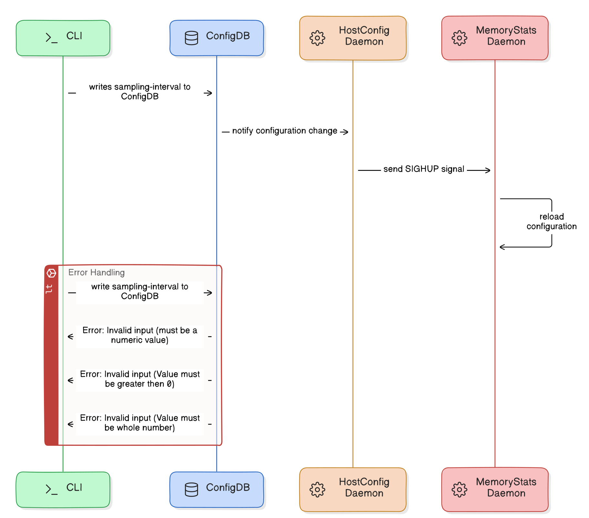
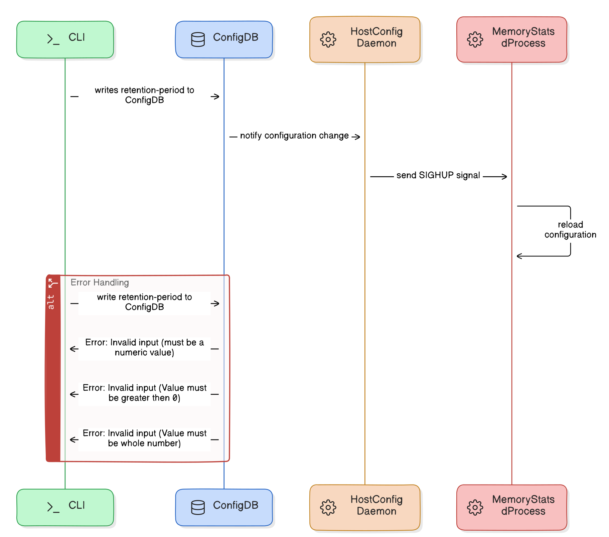
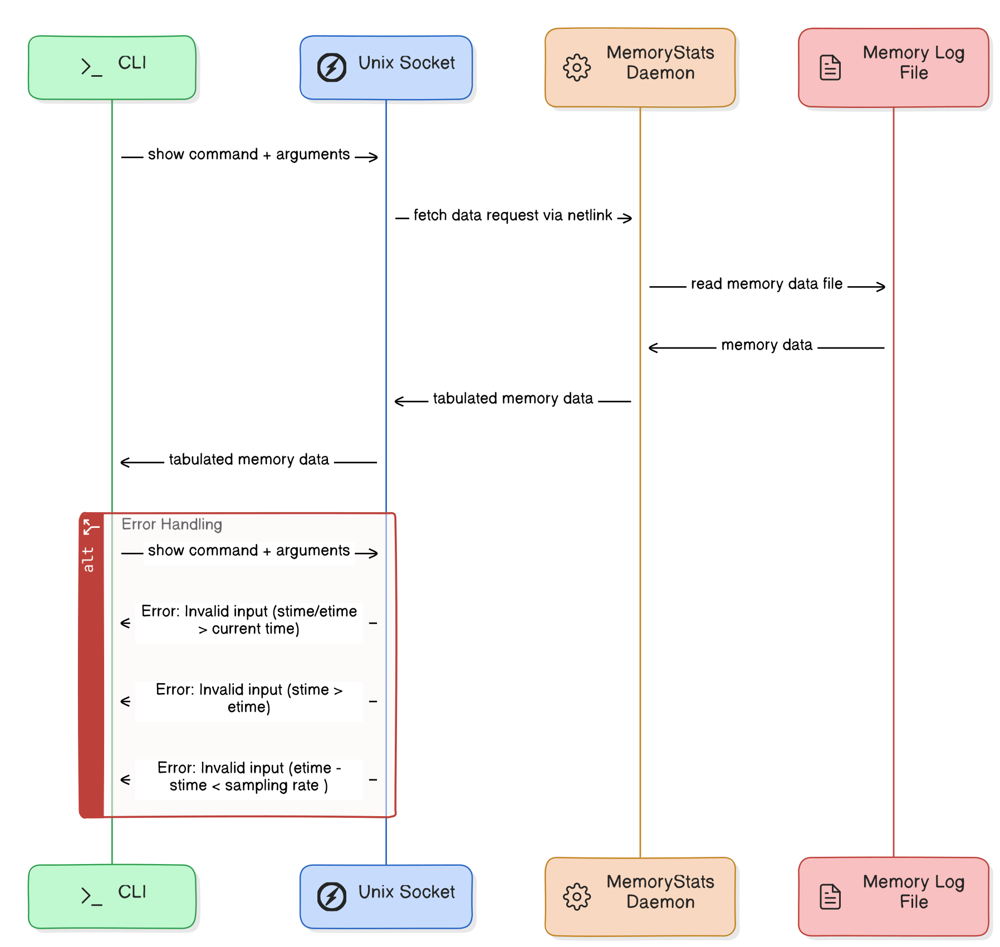
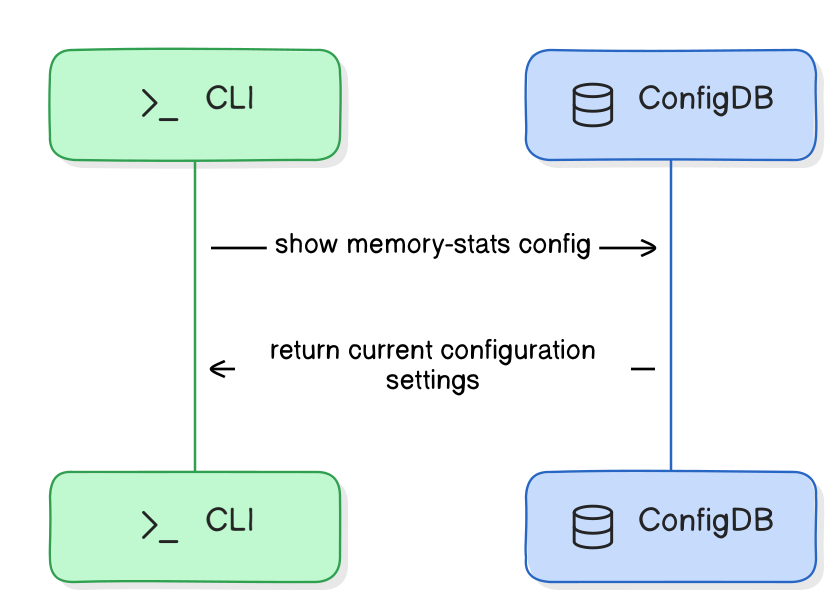

# Memory Statistics Feature in SONiC

[© xFlow Research Inc](https://xflowresearch.com/)

## Table of Content

- [Revision History](#revision-history)
- [Scope](#scope)
- [Definitions/Abbreviations](#definitionsabbreviations)
- [Overview](#overview)
- [Introduction](#introduction)
- [Proposed Behavior and Design](#proposed-behavior-and-design)
  - [Feature Overview](#feature-overview)
  - [Feature Specification](#feature-specification)
    - [Data Collection and Storage](#data-collection-and-storage)
    - [User Interaction](#user-interaction)
  - [Functional Requirements](#functional-requirements)
  - [Architecture Design](#architecture-design)
  - [Sequence Diagram ](#sequence-diagram)
    - [View Memory Usage](#view-memory-usage)
    - [Memory Collection Frequency Setting](#memory-collection-frequency-setting)
    - [Adjust Data Retention](#adjust-data-retention)
    - [Enable/Disable Memory Monitoring](#enabledisable-memory-monitoring)
    - [Displaying Memory Statistics Configuration](#displaying-memory-statistics-configuration)
- [SAI API](#sai-api)
- [Configuration and Management](#configuration-and-management)
  - [Daemon Configuration Management](#daemon-configuration-management)
  - [Config DB Enhancements](#config-db-enhancements)
  - [CLI/YANG Model Enhancements](#cliyang-model-enhancements)
    - [CLI Commands](#cli-commands)
    - [YANG Model Enhancements](#yang-model-enhancements)
- [Warmboot and Fastboot Design Impact](#warmboot-and-fastboot-design-impact)
- [Testing Requirements/Design](#testing-requirementsdesign)
  - [Unit Test Cases](#unit-test-cases)
  - [System Test Cases](#system-test-cases)
- [Future Work](#future-work)

## Revision History

| Version | Date       | Description                                       | Author                  |
|---------|------------|---------------------------------------------------|-------------------------|
| 1.0     | 2024-07-22 | Initial version                                   | Arham Nasir, Kanza Latif|   

## Scope

This High-Level Design (HLD) document outlines the framework for the Memory Statistics feature in SONiC, monitoring system-level memory statistics.

## Definitions/Abbreviations

| Sr No | Term           | Definition                                                                                          					|
|-------|----------------|--------------------------------------------------------------------------------------------------------------------------------------|
| 1     | CLI            | Command-Line Interface     							                       					|
| 2     | HLD            | High-Level Design    							                       					|
| 3     | SONiC          | Software for Open Networking in the Cloud     						       					|
| 4     | YANG           | Yet Another Next Generation (data modeling language)   				               					| 
| 5     | ConfigDB       | Configuration Database    			                                                                                        |

## Overview

This High-Level Design (HLD) document explains the Memory Statistics feature in SONiC. The aim is to improve memory monitoring and management to optimize network performance and reliability.

## Introduction

This HLD document introduces the Memory Statistics feature in SONiC, enhancing its native memory monitoring capabilities. Effective memory management is crucial for network performance and stability. Previously, administrators relied on third-party tools, increasing OPEX and operational burdens. The Memory Statistics feature integrates comprehensive memory monitoring into SONiC, providing historical data through the CLI. Key benefits include:

- **Streamlined Troubleshooting:** Facilitates rapid identification of memory usage anomalies that could indicate potential resource bottlenecks or memory irregularities.
- **Detailed Memory Analysis:** Offers in-depth insights into memory usage patterns, allowing administrators to optimize resource allocation and usage effectively.
- **Proactive Maintenance:** Enhances the ability to detect and address memory-related issues quickly, ensuring reliable system performance.

## Proposed Behavior and Design

This section explains how Memory Statistics feature works, focusing on user control and straightforward interaction.

### Feature Overview

- **Feature Scope:** Memory Statistics feature offers a systematic approach to monitoring system-wide memory usage. It automatically records crucial metrics such as Total Memory, Used Memory, Free Memory, Available Memory, Cached Memory, Shared Memory and Buffers. 
- **Configurability:**  This feature offers customizable options for data collection frequency and the duration of data retention according to their specific operational needs. By default, the system is configured to collect memory at all times and sample it every 5 minutes and retains this information for 15 days , ensuring a balance between granularity and storage management.
- **Enable/Disable Functionality:** This feature is disabled by default to conserve system resources , suiting various administrative preferences but can be easily enabled to ensure continuous monitoring.


### Feature Specification

#### Data Collection and Storage

Memory Statistics utilizes a dedicated daemon process for the continuous collection of memory data. This process operates in the background, ensuring minimal impact on system performance. Data is stored in compressed log files within the system, optimizing storage usage while ensuring data is easily retrievable for analysis and reporting.

#### User Interaction

User interaction with the Memory Statistics feature is designed to be straightforward and efficient, utilizing a set of powerful CLI commands that enable administrators to manage and analyze memory data effectively.The CLI interface includes commands for:

- **Viewing Memory Statistics:** Users can view memory data over custom time intervals with `--from` and `--to` options for defining the start and end times. This allows for flexible and targeted data analysis.
  - **Default Memory Overview:** For a quick general overview without specific parameters, the default command displays system memory statistics covering the last 15 days. This will provide a summary of crucial metrics such as Total Memory, Used Memory, Free Memory, Available Memory, Cached Memory, Shared Memory and Buffers, ideal for routine checks.
- **Selecting Specific Memory Metrics:** This feature enables users to choose specific memory metrics to display, such as Total Memory or Free Memory, which helps in focusing on relevant data points and reducing output clutter.
- **Configuring Data Collection and Retention:** Administrators can adjust the frequency of data collection and the duration of data retention through commands and can specify how long to retain the collected data for.
- **Enabling/Disabling the Feature:** To adapt to different operational requirements, users can enable or disable the Memory Statistics feature as needed.
	
### Functional Requirements

- Support for Python psutils package to collect system memory data
- Support for CLI commands for displaying memory information

### Architecture Design

The overall SONiC architecture will remain the same. However, the following updates and additions will be implemented:

- **Daemon Process:**
	- **memorystatsd:** A new system daemon process that will be implemented to gather and log memory statistics.
	- **hostcfgd:** The existing host config daemon will monitor changes in the ConfigDB's `MEMORY_STATISTICS` table and will reload the `memorystatsd` service to apply the new settings.

- **Log File Directories:** Supporting log file directories will be established via SONiC Buildimage.
- **SONiC Utilities Updates:** Changes will be made in the SONiC Utilities container to add new "show" and "config" commands.
- **New Configuration Table:** A new table, MEMORY_STATISTICS, will be added to ConfigDB to store memory-stats configuration parameters.
The high-level feature design diagram is shown below.

<p align="center">
    
    <br>
	Figure 1: Feature architecture diagram showing the unix socket, daemon, ConfigDB and data file
</p>

### Sequence Diagram

### Enable/Disable Memory Monitoring

<p align="center">
    
    <br>
	Figure 2: Sequence diagram for enabling or disabling the memory statistics monitoring feature
</p>

### Memory Collection Frequency Setting

<p align="center">
    
    <br>
	Figure 3: Sequence diagram for configuring the interval for memory data collection
</p>

### Adjust Data Retention

<p align="center">
    
    <br>
	Figure 4: Sequence diagram for setting how long the memory data should be retained
</p>


#### View Memory Usage

<p align="center">
    
    <br>
	Figure 5: Sequence diagram for memory data show command
</p>  


### Displaying Memory Statistics Configuration

<p align="center">
    
    <br>
	Figure 6: Sequence diagram for displaying the current memory statistics configuration in ConfigDB using the CLI


## SAI API

No SAI API change or addition is needed for this HLD.

## Configuration and Management

### **Daemon Configuration Management**


The `memorystatsd` process will dynamically manage its configuration with the help of `hostcfgd`. The design ensures reliable behavior by utilizing both a predefined configuration file and the ConfigDB for real-time updates.

- **Read Configuration at Startup**: Upon startup, the `memorystatsd` process reads its default configuration from a predefined config file. This guarantees that in the event of a restart—whether due to a crash or manual intervention—the daemon will always return to a known, consistent state.

- **Monitor ConfigDB for Changes**: During runtime, `hostcfgd` monitors the `MEMORY_STATISTICS` table in ConfigDB for any configuration changes made via the CLI, such as adjustments to retention periods, sampling intervals, or enabling/disabling the daemon.

- **Signal Daemon to Reload Configuration**: When a configuration change is detected in ConfigDB, `hostcfgd` signals the `memorystatsd` process using the `SIGHUP` signal to reload its configuration without restarting the process. This ensures the changes are applied dynamically during runtime.

- **Graceful Shutdown with SIGTERM**: The `memorystatsd` process is designed to handle the `SIGTERM` signal for a graceful shutdown, allowing it to safely terminate and clean up resources. This ensures any related processes or files are properly handled before the daemon stops.

- **Revert to Default on Restart**: While the daemon can reload configuration from ConfigDB during runtime, upon any restart (whether triggered by a crash or other factors), it will always revert to the default settings defined in the configuration file. This separation between startup defaults and runtime updates ensures predictable and safe behavior in the event of a failure.

- **Default Disabled State**: By default, the `memorystatsd` process will be **disabled**. The user must manually enable it using the CLI before it starts collecting memory statistics. This provides control over when the daemon begins its operations.

### **Workflow for Configuration Management**:

1. **Initial Setup**: Default settings, including retention periods and sampling intervals, are written to the config file during deployment. Optionally, these settings may also be written to ConfigDB.
   
2. **Daemon Startup**: On startup, `memorystatsd` reads its configuration from the predefined config file, initializing the necessary parameters such as retention period and sampling interval. However, it will start in a **disabled state** by default, requiring manual activation.

3. **Enable Daemon Manually**: Administrators need to manually enable the `memorystatsd` process via the CLI before it starts collecting memory statistics.

4. **Runtime Configuration Changes**: Administrators can modify settings like retention periods or sampling intervals via the CLI. These changes are written directly to the `MEMORY_STATISTICS` in ConfigDB.

5. **Monitor ConfigDB for Changes**: `hostcfgd` continuously monitors ConfigDB for updates to the `MEMORY_STATISTICS`.

6. **Signal Daemon to Reload Configuration**: Upon detecting changes in ConfigDB, `hostcfgd` sends a `SIGHUP` signal to the `memorystatsd` daemon, prompting it to reload its configuration without restarting.

7. **Reload Daemon**: The `memorystatsd` process applies the new settings from ConfigDB dynamically, allowing the daemon to continue operating with updated parameters during runtime.

8. **Handling Crashes and Restarts**: In case of a crash or restart, the `memorystatsd` daemon will always reload its default settings from the config file, ensuring a consistent startup state. Runtime-configured values from ConfigDB are only applied during runtime and not retained after a restart unless manually reloaded.

9. **Graceful Shutdown**: When the daemon needs to be stopped, the `SIGTERM` signal ensures a graceful shutdown, where the daemon cleans up resources and terminates smoothly.

### Config DB Enhancements

A new table, `MEMORY_STATISTICS`, will be introduced in `ConfigDB` to store the configuration settings of the Memory Statistics feature. This table will allow for management of data collection frequency, retention period, and enable/disable status. The relevant configuration parameters and the schema for this table are detailed below.

**MEMORY_STATISTICS Configuration Parameters**

| Parameter           | Type        | Description                                                    				|
|---------------------|-------------|-------------------------------------------------------------------------------------------|
| enabled             | boolean     | Enable or disable memory statistics collection.                				|
| sampling_interval   | uint8       | Interval (in minutes) for memory data collection. The range is 3–15 minutes.      	|
| retention_period    | uint8       | Duration (in days) for which memory data is retained. The range is 1–30 days.		|   

**Config DB Schema**
```json

MEMORY_STATISTICS: {
    "memory_statistics": {
        "enabled": "false",
        "sampling_interval": "5",
        "retention_period":  "15"
    }
}
``` 


### CLI/YANG Model Enhancements

#### CLI Commands

**Enable/Disable Memory Statistics Monitoring**

To enable or disable the memory statistics monitoring feature, use the following command:

	admin@sonic:~$ config memory-stats enable/disable
 By default, it is disabled.

**Set the Frequency of Memory Data Collection**

To configure the interval for memory data collection, use the following command:

	admin@sonic:~$ config memory-stats sampling-interval <interval>
 Default sampling-interval is 5 minutes

**Adjust the Data Retention Period**

To set how long the memory data should be retained, use the following command:

	admin@sonic:~$ config memory-stats retention-period <period>
 Default retention-period is 15 days

**View Memory Usage**

To display memory usage statistics, use the following command with optional parameters for time range and specific metrics:

	admin@sonic:~$ show memory-stats [--from <date-time>] [--to <date-time>] [--select <metric>]

**Command Definition**
  - **show memory-stats:** Display basic memory usage statistics
  - **--from <date-time>:** Display memory statistics from the specified start date-time.
  - **--to <date-time>:** Display memory statistics up to the specified end date-time.
  - **--select <metric>:** Display specific memory statistics, such as total memory.

 **Sample Output for Memory Usage**

Below is an example of the Memory Statistics output as it appears in the CLI. This display provides a summary of system memory metrics over a default time period, ideal for routine monitoring and analysis:


    admin@sonic:~$ show memory-stats 


	Memory Statistics:
	Codes:	M - minutes, H - hours, D - days
	--------------------------------------------------------------------------------
	Report Generated:    2024-12-04 15:49:52
	Analysis Period:     From 2024-11-19 15:49:52 to 2024-12-04 15:49:52
	Interval:            2 Days
	--------------------------------------------------------------------------------------------------------------------------------------------------
	Metric             Current    High       Low        D19-D21     D21-D23     D23-D25     D25-D27     D27-D29     D29-D01     D01-D03     D03-D05    
	                   Value      Value      Value      19Nov24     21Nov24     23Nov24     25Nov24     27Nov24     29Nov24     01Dec24     03Dec24    
	--------------------------------------------------------------------------------------------------------------------------------------------------

 	total_memory       15.29GB    15.29GB    15.29GB    15.29GB     15.29GB     15.29GB     15.29GB     15.29GB    15.29GB      15.29GB     15.29GB    
	used_memory        8.87GB     9.35GB     8.15GB     8.15GB      9.10GB      8.15GB      8.20GB      9.05GB     8.30GB       9.35GB      9.12GB     
	free_memory        943.92MB   906.28MB   500.00MB   800.00MB    750.00MB    906.2MB     650.00MB    600.00MB   550.00MB     500.00MB    725.92MB   
	available_memory   4.78GB     4.74GB     4.35GB     4.65GB      4.60GB      4.55GB      4.74GB      4.45GB     4.40GB       4.35GB      4.57GB     
	cached_memory      5.17GB     5.08GB     4.96GB     5.08GB      5.06GB      5.04GB      5.02GB     5.00GB      4.98GB       4.96GB      5.05GB     
	buffers_memory     337.83MB   333.59MB   295.00MB   325.00MB    320.00MB    315.00MB    333.59MB   305.00MB    300.00MB     295.00MB    317.84MB   
	shared_memory      1.31GB     1.22GB     1.08GB     1.22GB      1.20GB      1.18GB      1.15GB     1.12GB      1.10GB       1.08GB      1.19GB 


**View Memory Statistics Configuration**

To display the current configuration parameters such as data collection frequency, retention period, and enable/disable status in the MEMORY_STATISTICS_TABLE, use the following command:

	admin@sonic:~$ show memory-stats config

**Sample Output for Memory Statistics Configuration**

Below is an example of the Memory Statistics Configuration output as it appears in the CLI. This display provides a snapshot of the current configuration settings for memory statistics monitoring in confgdb:

    admin@sonic:~$ show memory-stats config
     
    Memory Statistics Configuration:
    --------------------------------
    Enabled:            false
    Sampling Interval:  5
    Retention Period:   15
 
 #### YANG Model Enhancements

A new YANG Model for sonic-memory-stats will be added.

```
module sonic-memory-statistics {
    yang-version 1.1;

    namespace "http://github.com/sonic-net/sonic-memory-statistics";
    prefix mem;

    import sonic-types {
        prefix stypes;
    }

    description "YANG module for configuring memory statistics in SONiC-based OS.";

    revision 2024-07-22 {
        description "First Revision";
    }

    container sonic-memory-statistics {
        container MEMORY_STATISTICS {
            description "Memory statistics configuration parameters.";
            container memory_statistics{
                leaf enabled {
                    type boolean;
                    default false;
                    description "Flag to enable or disable memory statistics collection. If set to false, the memory statistics collection will stop.";
                }

                leaf sampling_interval {
                    type uint8 {
                        range "3..15";
                    }
                    units "minutes";
                    default 5;
                    description "Time interval in minutes for sampling memory statistics. Valid range, is between 3 minutes to 15 minutes.";
                }

                leaf retention_period {
                    type uint8 {
                        range "1..30";
                    }
                    units "days";
                    default 15;
                    description "Retention period for memory statistics data, defined in days. Valid range is from 1 day to 30 days.";
                }
            }    
        }
    }
}

 ```


## Warmboot and Fastboot Design Impact

There is no impact on warmboot/fastboot functionalities by this HLD.

## Testing Requirements/Design

### Unit Test Cases

| Test Case ID | Test Case Description                                                                        |
|--------------|----------------------------------------------------------------------------------------------|
| UT1          | Verify CLI to show default memory statistics for the last 15 days                            |                                  
| UT2          | Verify CLI to show memory data for a custom time range using --from and --to options         | 
| UT3          | Verify CLI to show selective memory metrics using the --select option                        |
| UT4          | Verify CLI for error handling with incorrect syntax or invalid parameters                    | 
| UT5          | Verify CLI to reject future dates in --from or --to options                                  | 
| UT6          | Verify CLI to reject cases where --from date is later than --to date                         |
| UT7          | Verify CLI to configure memory data collection frequency using config memory-stats sampling-interval <interval> | 
| UT8          | Verify CLI to configure memory data retention period using config memory-stats retention-period <period> |
| UT9          | Verify CLI to enable memory statistics monitoring using config memory-stats enable           | 
| UT10         | Verify CLI to disable memory statistics monitoring using config memory-stats disable         | 

### System Test Cases

| Test Case ID | Test Case Description                                                                                      | 
|--------------|------------------------------------------------------------------------------------------------------------|
| ST1          | Validate the end-to-end functionality of the memory statistics daemon process, ensuring proper configuration reading, restart on update, data collection, and data retention | 

## Future Work

- Implement an alert system to notify administrators of significant memory usage anomalies or thresholds to enhance proactive maintenance capabilities.
- Expand the feature to collect additional memory metrics.
