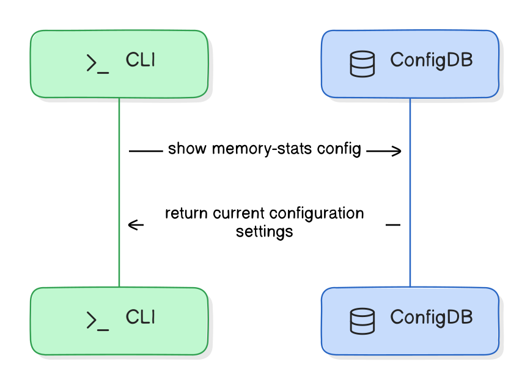

# Memory Statistics Feature in SONiC

[© xFlow Research Inc](https://xflowresearch.com/)

## Table of Content

- [Revision History](#revision-history)
- [Scope](#scope)
- [Definitions/Abbreviations](#definitionsabbreviations)
- [Overview](#overview)
- [Introduction](#introduction)
- [Proposed Behavior and Design](#proposed-behavior-and-design)
  - [Feature Overview](#feature-overview)
  - [Feature Specification](#feature-specification)
    - [Data Collection and Storage](#data-collection-and-storage)
    - [User Interaction](#user-interaction)
  - [Functional Requirements](#functional-requirements)
  - [Architecture Design](#architecture-design)
  - [Sequence Diagram ](#sequence-diagram)
    - [View Memory Usage](#view-memory-usage)
    - [Memory Collection Frequency Setting](#memory-collection-frequency-setting)
    - [Adjust Data Retention](#adjust-data-retention)
    - [Enable/Disable Memory Monitoring](#enabledisable-memory-monitoring)
    - [Displaying Memory Statistics Configuration](#displaying-memory-statistics-configuration)
- [Daemon Configuration Management](#daemon-configuration-management)
- [SAI API](#sai-api)
- [Configuration and Management](#configuration-and-management)
  - [CLI/YANG Model Enhancements](#cliyang-model-enhancements)
    - [CLI Commands](#cli-commands)
    - [YANG Model Enhancements](#yang-model-enhancements)
  - [Config DB Enhancements](#config-db-enhancements)
- [Warmboot and Fastboot Design Impact](#warmboot-and-fastboot-design-impact)
- [Testing Requirements/Design](#testing-requirementsdesign)
  - [Unit Test Cases](#unit-test-cases)
  - [System Test Cases](#system-test-cases)
- [Future Work](#future-work)

## Revision History

| Version | Date       | Description                                       | Author                  |
|---------|------------|---------------------------------------------------|-------------------------|
| 1.0     | 2024-07-22 | Initial version                                   | Arham Nasir, Kanza Latif|   

## Scope

This High-Level Design (HLD) document outlines the framework for the Memory Statistics feature in SONiC, monitoring system-level memory statistics.

## Definitions/Abbreviations

| Sr No | Term           | Definition                                                                                          					|
|-------|----------------|--------------------------------------------------------------------------------------------------------------------------------------|
| 1     | CLI            | Command-Line Interface     							                       					|
| 2     | HLD            | High-Level Design    							                       					|
| 3     | SONiC          | Software for Open Networking in the Cloud     						       					|
| 4     | YANG           | Yet Another Next Generation (data modeling language)   				               					| 
| 5     | ConfigDB       | Configuration Database    			                                                                                        |

## Overview

This High-Level Design (HLD) document explains the Memory Statistics feature in SONiC. The aim is to improve memory monitoring and management to optimize network performance and reliability.

## Introduction

This HLD document introduces the Memory Statistics feature in SONiC, enhancing its native memory monitoring capabilities. Effective memory management is crucial for network performance and stability. Previously, administrators relied on third-party tools, increasing OPEX and operational burdens. The Memory Statistics feature integrates comprehensive memory monitoring into SONiC, providing historical data through the CLI. Key benefits include:

- **Streamlined Troubleshooting:** Facilitates rapid identification of memory usage anomalies that could indicate potential resource bottlenecks or memory irregularities.
- **Detailed Memory Analysis:** Offers in-depth insights into memory usage patterns, allowing administrators to optimize resource allocation and usage effectively.
- **Proactive Maintenance:** Enhances the ability to detect and address memory-related issues quickly, ensuring reliable system performance.

## Proposed Behavior and Design

This section explains how Memory Statistics feature works, focusing on user control and straightforward interaction.

### Feature Overview

- **Feature Scope:** Memory Statistics feature offers a systematic approach to monitoring system-wide memory usage. It automatically records crucial metrics such as Total Memory, Used Memory, Free Memory, Available Memory, Cached Memory, Shared Memory and Buffers. 
- **Configurability:**  This feature offers customizable options for data collection frequency and the duration of data retention according to their specific operational needs. By default, the system is configured to collect memory at all times and sample it every 5 minutes and retains this information for 15 days , ensuring a balance between granularity and storage management.
- **Enable/Disable Functionality:** This feature is disabled by default to conserve system resources , suiting various administrative preferences but can be easily enabled to ensure continuous monitoring.


### Feature Specification

#### Data Collection and Storage

Memory Statistics utilizes a dedicated daemon process for the continuous collection of memory data. This process operates in the background, ensuring minimal impact on system performance. Data is stored in compressed log files within the system, optimizing storage usage while ensuring data is easily retrievable for analysis and reporting.

#### User Interaction

User interaction with the Memory Statistics feature is designed to be straightforward and efficient, utilizing a set of powerful CLI commands that enable administrators to manage and analyze memory data effectively.The CLI interface includes commands for:

- **Viewing Memory Statistics:** Users can view memory data over custom time intervals with `--from` and `--to` options for defining the start and end times. This allows for flexible and targeted data analysis.
  - **Default Memory Overview:** For a quick general overview without specific parameters, the default command displays system memory statistics covering the last 15 days. This will provide a summary of crucial metrics such as Total Memory, Used Memory, Free Memory, Available Memory, Cached Memory, Shared Memory and Buffers, ideal for routine checks.
- **Selecting Specific Memory Metrics:** This feature enables users to choose specific memory metrics to display, such as Total Memory or Free Memory, which helps in focusing on relevant data points and reducing output clutter.
- **Configuring Data Collection and Retention:** Administrators can adjust the frequency of data collection and the duration of data retention through commands and can specify how long to retain the collected data for.
- **Enabling/Disabling the Feature:** To adapt to different operational requirements, users can enable or disable the Memory Statistics feature as needed.
	
### Functional Requirements

- Support for Python psutils package to collect system memory data
- Support for CLI commands for displaying memory information

### Architecture Design

The overall SONiC architecture will remain the same. However, the following updates and additions will be implemented:

- **Daemon Process:**
	- **memorystatsd:** A new system daemon process that will be implemented to gather and log memory statistics.
	- **hostcfgd:** The existing host config daemon will monitor changes in the ConfigDB's `MEMORY_STATISTICS_TABLE` and will reload the `memorystatsd` service to apply the new settings.

- **Log File Directories:** Supporting log file directories will be established via SONiC Buildimage.
- **SONiC Utilities Updates:** Changes will be made in the SONiC Utilities container to add new "show" and "config" commands.
- **New Configuration Table:** A new table, MEMORY_STATISTICS_TABLE, will be added to ConfigDB to store memory-stats configuration parameters.
The high-level feature design diagram is shown below.

<p align="center">
    
    <br>
	Figure 1: Feature architecture diagram showing the unix socket, daemon, ConfigDB and data file
</p>

### Sequence Diagram

### Enable/Disable Memory Monitoring

<p align="center">
    
    <br>
	Figure 2: Sequence diagram for enabling or disabling the memory statistics monitoring feature
</p>

### Memory Collection Frequency Setting

<p align="center">
    
    <br>
	Figure 3: Sequence diagram for configuring the interval for memory data collection
</p>

### Adjust Data Retention

<p align="center">
    
    <br>
	Figure 4: Sequence diagram for setting how long the memory data should be retained
</p>


#### View Memory Usage

<p align="center">
    
    <br>
	Figure 5: Sequence diagram for memory data show command
</p>  


### Displaying Memory Statistics Configuration

<p align="center">
    
    <br>
	Figure 6: Sequence diagram for displaying the current memory statistics configuration in ConfigDB using the CLI


### Daemon Configuration Management

The `memorystatsd` will dynamically manage its configuration using the `hostcfgd`. The design will:

1. **Read Configuration at Startup**: On startup, `memorystatsd` process will read its configuration directly from the ConfigDB to initialize its settings.
2. **Monitor ConfigDB for Changes**: `hostcfgd` will monitor the `MEMORY_STATISTICS_TABLE` in ConfigDB for any changes to the configurations.
3. **Signal Daemon to Reload Configuration**: When configurations are updated via CLI and written to ConfigDB, hostcfgd will detect these changes and signal `memorystatsd` process to reload its configuration.
4. **Reload to Apply Changes**: `memorystatsd` process will reload its configurations upon receiving the signal and apply the new settings.

**Workflow for Configuration Management**

1. **Initial Setup**: On deployment, default settings are written to the ConfigDB.
2. **Daemon Startup**: `memorystatsd` reads configuration from ConfigDB and initializes its parameters.
3. **Runtime Configuration Changes**: Administrators update settings via CLI, which writes changes to ConfigDB.
4. **Monitor ConfigDB for Changes**: `hostcfgd` detects changes in ConfigDB.
5. **Signal Daemon to Reload Configuration**: hostcfgd signals `memorystatsd` to reload its configuration.
6. **Reload Daemon**: `memorystatsd` process reloads the configuration to apply the new settings.


## SAI API

No SAI API change or addition is needed for this HLD.

### Config DB Enhancements

A new table, `MEMORY_STATISTICS_TABLE`, will be introduced in `ConfigDB` to store the configuration settings of the Memory Statistics feature. This table will allow for management of data collection frequency, retention period, and enable/disable status. The relevant configuration parameters and the schema for this table are detailed below.

**MEMORY_STATS Configuration Parameters**

| Parameter           | Type        | Description                                                    |
|---------------------|-------------|----------------------------------------------------------------|
| enabled             | boolean     | Enable or disable memory statistics collection.                |
| sampling_interval   | unit16      | Interval for memory data collection.       		     |
| retention_period    | unit16      | Duration for which memory data is retained.		     |   

**Config DB Schema**
```json

MEMORY_STATS_TABLE: {
    "MemoryStats": {
        "enabled": "true",
        "sampling_interval": "5",
        "retention_period":  "15"
    }
}
``` 


## Configuration and Management

### CLI/YANG Model Enhancements

#### CLI Commands

**Set the Frequency of Memory Data Collection**

To configure the interval for memory data collection, use the following command:

	admin@sonic:~$ config memory-stats sampling-interval <interval>
 Default sampling-interval is 5 minutes

**Adjust the Data Retention Period**

To set how long the memory data should be retained, use the following command:

	admin@sonic:~$ config memory-stats retention-period <period>
 Default retention-period is 15 days

**Enable/Disable Memory Statistics Monitoring**

To enable or disable the memory statistics monitoring feature, use the following command:

	admin@sonic:~$ config memory-stats enable/disable
 By default, it is disabled.

**View Memory Usage**

To display memory usage statistics, use the following command with optional parameters for time range and specific metrics:

	admin@sonic:~$ show memory-stats [--from <date-time>] [--to <date-time>] [--select <metric>]

**Command Definition**
  - **show memory-stats:** Display basic memory usage statistics
  - **--from <date-time>:** Display memory statistics from the specified start date-time.
  - **--to <date-time>:** Display memory statistics up to the specified end date-time.
  - **--select <metric>:** Display specific memory statistics, such as total memory.

 **Sample Output for Memory Usage**

Below is an example of the Memory Statistics output as it appears in the CLI. This display provides a summary of system memory metrics over a default time period, ideal for routine monitoring and analysis:


    admin@sonic:~$ show memory-stats 


    Codes:	M - minutes, H - hours, D - days
	--------------------------------------------------------------------------------
	Report Generated:    2024-06-15 09:00:00
    Analysis Period:     From 2024-06-01 09:00:00 to 2024-06-15 09:00:00
    Interval:	         2 days
	--------------------------------------------------------------------------------
	  Metric            Current     High       Low        D1-D3      D3-D5      D5-D7      D7-D9      D9-D11     D11-D13    D13-D15    
	                    Value       Value      Value      01Jun24    03Jun24    05Jun24    07Jun24    09Jun24    11Jun24    13Jun24    
	--------------      --------    --------   --------   ---------  ---------  ---------  ---------  ---------  ---------  ---------
	Total Memory        15.6G       15.6G      15.1G      15.1G      15.2G      15.3G      15.3G      15.4G      15.5G      15.5G      
	Used Memory         2.3G        2.5G       2.0G       2.1G       2.2G       2.2G       2.3G       2.4G       2.3G       2.2G       
	Free Memory         11.9G       12.4G      10.6G      11.0G      11.2G      11.4G      11.5G      11.7G      11.8G      11.9G      
	Available Memory    13.0G       14.3G      12.4G      12.6G      12.7G      12.8G      12.9G      13.0G      13.1G      13.2G      
    Cached Memory       1.2G        1.5G       1.0G       1.1G       1.2G       1.3G       1.4G       1.3G       1.4G       1.2G       
    Buffer Memory       0.3G        0.4G       0.2G       0.2G       0.3G       0.3G       0.4G       0.3G       0.3G       0.4G       
	Shared Memory       0.5G        0.6G       0.4G       0.5G       0.5G       0.5G       0.4G       0.5G       0.5G       0.5G       


**View Memory Statistics Configuration**

To display the current configuration parameters such as data collection frequency, retention period, and enable/disable status in the MEMORY_STATISTICS_TABLE, use the following command:

	admin@sonic:~$ show memory-stats config

**Sample Output for Memory Statistics Configuration**

Below is an example of the Memory Statistics Configuration output as it appears in the CLI. This display provides a snapshot of the current configuration settings for memory statistics monitoring in confgdb:

    admin@sonic:~$ show memory-stats config
     
    Memory Statistics Configuration:
    --------------------------------
    Enabled:            true
    Sampling Interval:  5 minutes
    Retention Period:   15 days
 
 #### YANG Model Enhancements

A new YANG Model for sonic-memory-stats will be added.

```
module memory-stats {
    yang-version 1.1;

    namespace "http://github.com/sonic-net/sonic-memory-stats";
    prefix mem;
    
    import sonic-types {
        prefix stypes;
    }
    
    description "Memory-Stats YANG Module for SONiC-based OS";
    revision 2024-07-22 {
        description "First Revision";
    }
     
    container MemoryStats {
        description "Memory statistics configuration";

        leaf enabled {
            type boolean;
            default false;
            description "Enable or disable memory statistics";
        }

        leaf sampling-interval {
            type uint16;
            units "minutes";
            description "Interval for sampling memory statistics";
        }

        leaf retention-period {
            type uint16;
            units "days";
            description "Retention period for memory statistics data";
        }
    }

 ```


## Warmboot and Fastboot Design Impact

There is no impact on warmboot/fastboot functionalities by this HLD.

## Testing Requirements/Design

### Unit Test Cases

| Test Case ID | Test Case Description                                                                        |
|--------------|----------------------------------------------------------------------------------------------|
| UT1          | Verify CLI to show default memory statistics for the last 15 days                            |                                  
| UT2          | Verify CLI to show memory data for a custom time range using --from and --to options         | 
| UT3          | Verify CLI to show selective memory metrics using the --select option                        |
| UT4          | Verify CLI for error handling with incorrect syntax or invalid parameters                    | 
| UT5          | Verify CLI to reject future dates in --from or --to options                                  | 
| UT6          | Verify CLI to reject cases where --from date is later than --to date                         |
| UT7          | Verify CLI to configure memory data collection frequency using config memory-stats sampling-interval <interval> | 
| UT8          | Verify CLI to configure memory data retention period using config memory-stats retention-period <period> |
| UT9          | Verify CLI to enable memory statistics monitoring using config memory-stats enable           | 
| UT10         | Verify CLI to disable memory statistics monitoring using config memory-stats disable         | 

### System Test Cases

| Test Case ID | Test Case Description                                                                                      | 
|--------------|------------------------------------------------------------------------------------------------------------|
| ST1          | Validate the end-to-end functionality of the memory statistics daemon process, ensuring proper configuration reading, restart on update, data collection, and data retention | 

## Future Work

- Implement an alert system to notify administrators of significant memory usage anomalies or thresholds to enhance proactive maintenance capabilities.
- Expand the feature to collect additional memory metrics.
