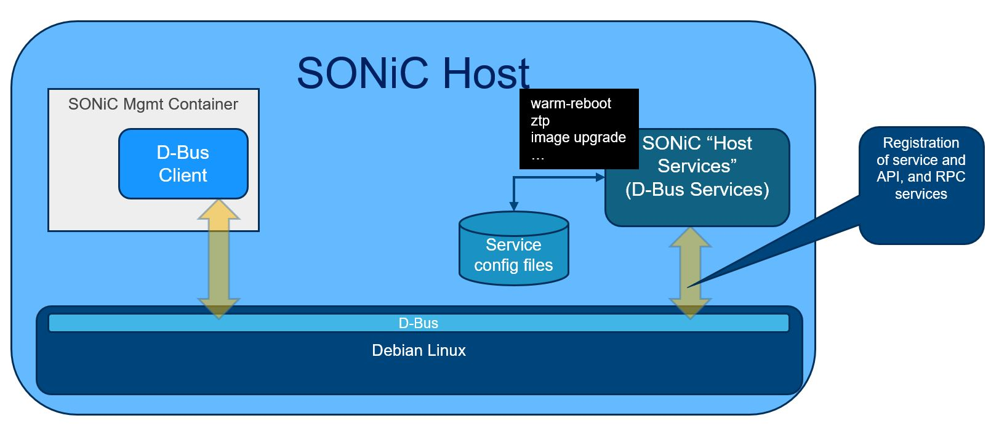
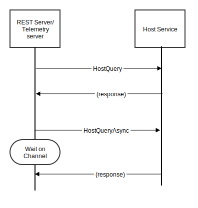

# Feature Name
Docker to Host Communications

# High Level Design Document
#### Rev 0.8

# Table of Contents
  * [List of Tables](#list-of-tables)
  * [Revision](#revision)
  * [About This Manual](#about-this-manual)
  * [Scope](#scope)
  * [Definition/Abbreviation](#definitionabbreviation)

# List of Tables
[Table 1: Abbreviations](#table-1-abbreviations)

# Revision
| Rev |     Date    |       Author       | Change Description                |
|:---:|:-----------:|:------------------:|-----------------------------------|
| 0.1 | 10/28/2019  | Nirenjan Krishnan  | Initial version                   |
|:---:|:-----------:|:------------------:|-----------------------------------|
| 0.2 | 12/08/2019  | Mike Lazar         | Add details about architecture    |
|:---:|:-----------:|:------------------:|-----------------------------------|
| 0.3 | 12/16/2019  | Mike Lazar         | Add security and logging info     |
|:---:|:-----------:|:------------------:|-----------------------------------|
| 0.4 | 02/07/2020  | Mike Lazar         | More information about security   |
|:---:|:-----------:|:------------------:|-----------------------------------|
| 0.5 | 03/05/2020  | Mike Lazar         | More D-Bus security info,         | 
|     |             |                    | and fixed formatting              |
|:---:|:-----------:|:------------------:|-----------------------------------|
| 0.6 | 04/15/2020  | Mike Lazar         | Addressed questions about         | 
|     |             |                    | logging and usage recommendations |
|:---:|:-----------:|:------------------:|-----------------------------------|
| 0.7 | 04/23/2020  | Mike Lazar         | Added authentication failure      |
|     |             |                    | log information                   |
|:---:|:-----------:|:------------------:|-----------------------------------|
| 0.8 | 05/26/2022  | Gang Lv            | Added generic config updater      |
|     |             |                    | interface                         |
|:---:|:-----------:|:------------------:|-----------------------------------|


# About this Manual
This document provides general information about the Docker to Host
communication feature in SONiC.

# Scope
This document describes the high level design of Docker to Host communication.
This describes the infrastructure provided by the feature, and example usage,
however, it does not describe the individual host-specific features.


# Definition/Abbreviation

### Table 1: Abbreviations
| **Term**                 | **Meaning**                                       |
|--------------------------|---------------------------------------------------|
| D-Bus                    | Desktop Bus: https://en.wikipedia.org/wiki/D-Bus  |

# 1 Feature Overview

This document describes a means (framework) for an application executed inside a container to securely request the execution of an operation ("action") by the host OS. The components of such framework are:
* the host services component (executed on the host OS), 
* the translib API component (executed insisde a container)

This framework is intended to be used by the SONiC management and telemetry containers, but can be extended for other application containers as well.

## 1.1 Requirements

### 1.1.1 Functional Requirements

* The SONiC Management Framework and Telemetry (application) containers must be able to issue
  requests to the host, and obtain responses to those requests from the host.
* The individual applications that need access to the host must be able to
  create a host module and easily issue requests and get responses back from the
  host.
* The host communication API shall be available in Translib, and shall provide
  both synchronous and asynchronous communication methods.
* It shall be possible to configure the identity of the Linux user accounts who have access to a D-Bus socket.
* It shall be possible to configure containers in such a way that only certain containers (e.g. SONiC Mgmt.)
  have access to the D-Bus socket.

### 1.1.2 Configuration and Management Requirements

N/A

### 1.1.3 Scalability Requirements

N/A

### 1.1.4 Warm Boot Requirements

N/A

## 1.2 Design Overview
### 1.2.1 Basic Approach

The new code for the client application TransLib API  is added to the existing Translib modules to provide a D-Bus based
API to issue requests/queries from a container based application to the host OS. 

The host service (executed as a daemon on the host OS) is a Python based
application that listens on service-specific D-Bus endpoints.https://en.wikipedia.org/wiki/D-Bus

The individual app modules extend the host service by providing a Python snippet (a "servlet") that registers against a D-Bus endpoint. New servlets can be defined and added as needed.

The application client inside containers executes DBus methods (effectively remote procedure calls), using the DBus end-points provided by the servlets on the host OS.

### 1.2.2 Container

SONiC Management Framework, gNMI Telemetry containers

### 1.2.3 SAI Overview

N/A

# 2 Functionality
## 2.1 Target Deployment Use Cases

All deployments

## 2.2 Functional Description

This feature enables management applications to issue
requests to the host to perform "actions". For instance :
* image install / upgrade
* initiate reboot and warm reboot using existing scripts
* create show-tech tar file using existing show-tech script
* config save/reload using existing scripts
* config apply-patch using existing scripts
* config checkpoint/delete-checkpoint using existing scripts

In contrast to typical DB operations - CRUD (create, read, update, delete), an "action" is an operation that does not directly modify a DB record, but triggers a host OS system request instead (such as SW image install/update).
It is recommended that the "Host services" only be defined for this type of applications. 

# 3 Design
## 3.1 Overview

The feature extends the SONiC management framework to add a D-Bus service on the host. This service will register against a known endpoint, and will service requests to the endpoint. Application modules will add "servlets" to the host
service, which will automatically register their endpoints (D-Bus objects and methods). 

The client application module in a container (e.g. management or telemetry) can use the APIs provided in Translib to send the request to the host - essentially, make a (remote) D-Bus method call, and either wait for the response (if the request was synchronous), or receive a channel and wait for the request to return the response on the
channel (asynchronous request).

The architecture of a D-Bus host service in a SONiC environment is illustrated in the diagram below:


Note. The Linux D-Bus implementation uses Unix domain sockets for client to D-Bus service communications.
All containers that use D-Bus services will bind mount
(-v /var/run/dbus:/var/run/dbus:rw) the host directory where D-Bus service sockets are created.
This ensures that only the desired containers access the D-Bus host services.

If multiple D-Bus clients simultaneously issue requests, then each request is queued and processed in the order received.

D-Bus provides a reliable communication channel between client (SONiC management container) and service (native host OS) – all actions are acknowledged and can provide return values. It should be noted that acknowledgements are important for operations such as “image upgrade” or “config-save”. In addition, D-Bus methods can return values of many types – not just ACKs. For instance, they can return strings, useful to return the output of a command.

### 3.1.1 Security of D-Bus Communications
In addition to standard Linux security mechanisms for file/Unix socket access rights (read/write), D-Bus provides a separate security layer, using the D-Bus service configuration files, for defining security policies. This allows finer granularity access control to D-Bus objects and methods - D-Bus can restrict access only to certain Linux users or groups. This is achieved by using the "Host Service" configuration file:
```
/etc/dbus-1/system.d/org.sonic.hostservice.conf
```

D-Bus allows security policies to be set per Linux user group or Linux user. The D-Bus framework is able to determine the user name and group of the client applications, and automatically enforces the access rules specified in the security policies.

For instance, assuming that the REST service provided by the SONiC management framework is executed as a system user ("mgmt") in its own group ("mgmt"), the configuration can allow this system user access to all Host Services - all objects and methods under "org.SONiC.HostService":

```
  <policy group="mgmt" />
    <allow send_destination="org.SONiC.HostService" />
    <allow receive_sender="org.SONiC.HostService" />
  </policy>
```

Assuming that the telemetry service is executed as a "telemetry" system user (group "telemetry"), that account may only be allowed access to a restricted set of services ("showtech"), and denied access to all others (e.g. ztp, configuration save/restore):

```
  <policy group="telemetry">
    <deny send_destination="org.SONiC.HostService"/>
    <deny receive_sender="org.SONiC.HostService"/>
    <allow send_destination="org.SONiC.HostService.showtech"/>
    <allow receive_sender="org.SONiC.HostService.showtech"/>
  </policy>
```

Note. The security of the D-Bus communications is completely independent of the security (authorization and authentication) that client applications may implement separately, e.g. Role Base Access Control in the case of the SONiC Management Framework.

### 3.1.2 Command Logging

It is possible to track and log the user name and the command that the user has requested.
This can be achieved by calling the function: dbus_bus_get_unix_user(), which returns the user id of the client application.

Note 1. Proper command auditing (all commands) for RBAC users (SONiC Management Users) is executed by the SONiC management Framework.

Note 2. In fact, the group and user account of DBus commands executed by a DBus service is generally implicit, based on the access policy rules, for instance:
```
  <policy group="appXGroupName" user="appXUserName">
    <deny send_destination="org.SONiC.HostService.appX"/>
    <deny receive_sender="org.SONiC.HostService.appX"/>
  </policy>
```

The host services framework will implement a generic logging framework, which automatically logs all commands (DBus methods)
invoked by client applications - e.g. or telemetry or management. The same approach applies to any other client application (not just management and framework), that may use the Host Services framework.  

The log record is created in the system log.

### 3.1.2.1 Logging D-Bus Authentication Failures

D-Bus is setup by default to log all authentication failures (security policy violations). SONiC directs authentication failures to /var/log/auth.log 

For instance, if an unauthorized user tries to execute the 'reboot' method, the following log record is generated in /var/log/auth.log:
```
Apr 23 15:25:53.381264 sonic NOTICE dbus[387]: [system] Rejected send message, 1 matched rules; type="method_call", sender=":1.9" (uid=1000 pid=7663 comm="dbus-send --session --dest=org.SONiC.HostService -") interface="org.SONiC.HostService" member="reboot" error name="(unset)" requested_reply="0" destination="org.SONiC.HostService" (uid=0 pid=402 comm="/usr/bin/python3 -u /usr/lib/sonic_host_service/so")
```

Note. The client application receives an error return code: 
```
Error org.freedesktop.DBus.Error.AccessDenied
```


### 3.1.3 Backwards Compatibility and Upgrades

D-Bus provides a means ("introspection") for client applications to query the objects and methods that service APIs provide. This allows client applications (e.g. management and telemetry containers) and services (D-Bus host service) to be upgraded independently. The client applications will query the APIs provided by the D-Bus Host Service, and adapt to the available functionality of the Host Service.

## 3.2 DB Changes
### 3.2.1 CONFIG DB
N/A
### 3.2.2 APP DB
N/A
### 3.2.3 STATE DB
N/A
### 3.2.4 ASIC DB
N/A
### 3.2.5 COUNTER DB
N/A

## 3.3 Switch State Service Design
### 3.3.1 Orchestration Agent
N/A
### 3.3.2 Other Process
N/A
## 3.4 SyncD
N/A
## 3.5 SAI
N/A

## 3.6 User Interface
### 3.6.1 Data Models
N/A
### 3.6.2 CLI
#### 3.6.2.1 Configuration Commands
N/A
#### 3.6.2.2 Show Commands
N/A
#### 3.6.2.3 Debug Commands
N/A
#### 3.6.2.4 IS-CLI Compliance
N/A
### 3.6.3 REST API Support
N/A
### 3.6.4 D-Bus API
#### 3.6.4.1 showtech.info
This API will execute the "show techsupport" command.

Input is date message, and output are return code and error message.

"show techsupport" command could take a few minutes, and D-Bus client should use timeout or asynchronous request.

#### 3.6.4.2 config.save
This API will execute the "config save" command.

Input is config file name, and output are return code and error message.

#### 3.6.4.3 config.reload
This API will execute the "config reload" command.

Input is config file name, and output are return code and error message.

"config reload" command would restart D-Bus host service, so D-Bus client might not receive the response.

#### 3.6.4.4 gcu.apply_patch_db
This API will execute the "config apply-patch" command with SONiC DB schema.

Input is patch file name, and output are return code and error message.

"config apply-patch" command could take a few seconds, and D-Bus client should use timeout or asynchronous request.

#### 3.6.4.5 gcu.apply_patch_yang
This API will execute the "config apply-patch" command with SONiC Yang schema.

Input is patch file name, and output are return code and error message.

"config apply-patch" command could take a few seconds, and D-Bus client should use timeout or asynchronous request.

#### 3.6.4.6 gcu.create_cp
This API will execute the "config checkpoint" command.

Input is checkpoint name, and output are return code and error message.

#### 3.6.4.7 gcu.delete_cp
This API will execute the "config delete-checkpoint" command.

Input is checkpoint name, and output are return code and error message.

# 4 Flow Diagrams



# 5 Error Handling
If dbus host service exited abnormally, systemd would restart this service.

The `hostQuery` and `hostQueryAsync` APIs return a standard Go `error` object,
which can be used to handle any errors that are returned by the D-Bus
infrastructure.

# 6 Serviceability and Debug
N/A

# 7 Warm Boot Support
N/A

# 8 Scalability
N/A

# 9 Unit Test
| Test Case | Description |
| ---- | ---- |
| 1 | Invoke showtech.info API, and CLI command is successful. |
| 2 | Invoke config.save API, and CLI command is successful. |
| 3 | Invoke config.save API, and CLI command failed. |
| 4 | Invoke config.reload API, and CLI command is successful. |
| 5 | Invoke config.reload API, and CLI command failed. |
| 6 | Invoke gcu.apply_patch_db API, and CLI command is successful. |
| 7 | Invoke gcu.apply_patch_db API, and CLI command failed. |
| 8 | Invoke gcu.apply_patch_yang API, and CLI command is successful. |
| 9 | Invoke gcu.apply_patch_yang API, and CLI command failed. |
| 10 | Invoke gcu.create_cp API, and CLI command is successful. |
| 11 | Invoke gcu.create_cp API, and CLI command failed. |
| 12 | Invoke gcu.delete_cp API, and CLI command is successful. |
| 13 | Invoke gcu.delete_cp API, and CLI command failed. |

# 10 Internal Design Information
N/A
