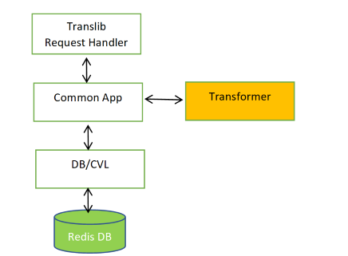

# SONiC Management Framework - [DRAFT]

## High level design document

### Rev 0.2

## Table of Contents

* [List of Tables](#list-of-tables)
* [Revision](#revision)
* [About this Manual](#about-this-manual)
* [Scope](#scope)
* [Definition/Abbreviation](#definitionabbreviation)
* [Table 1: Abbreviations](#table-1-abbreviations)
* [1 Feature Overview](#1-feature-overview)
    * [1.1 Requirements](#11-requirements)
    * [1.2 Design Overview](#12-design-overview)
        * [1.2.1 Basic Approach](#121-basic-approach)
        * [1.2.2 Container](#122-container)
* [2 Functionality](#2-functionality)
    * [2.1 Target Deployment Use Cases](#21-target-deployment-use-cases)
    * [2.2 Functional Description](#22-functional-description)
* [3 Design](#3-design)
    * [3.1 Overview](#31-overview)
        * [3.1.1 Build time flow](#311-build-time-flow)
        * [3.1.2 Run time flow](#312-run-time-flow)
            * [3.1.2.1 CLI](#3121-cli)
            * [3.1.2.2 REST](#3122-rest)
            * [3.1.2.3 gNMI](#3123-gnmi)
    * [3.2 SONiC Management Framework Components](#32-sonic-management-framework-components)
        * [3.2.1 Build time components](#321-build-time-components)
            * [3.2.1.1 Yang to OpenAPI converter](#3211-yang-to-openapi-converter)
                * [3.1.1.1.1 Overview](#31111-overview)
                * [3.1.1.1.2 Supported HTTP verbs](#31112-supported-http-verbs)
                * [3.1.1.1.3 Supported Data Nodes](#31113-supported-data-nodes)
                * [3.1.1.1.4 Data Type Mappings](#31114-data-type-mappings)
                * [3.1.1.1.5 Notes](#31115-notes)
                * [3.1.1.1.6 Future enhancements](#31116-future-enhancements)
            * [3.2.1.2 swagger generator](#3212-swagger-generator)
            * [3.2.1.3 YGOT generator](#3213-ygot-generator)
            * [3.2.1.4 pyang compiler](#3214-pyang-compiler)
        * [3.2.2 Run time components](#322-run-time-components)
            * [3.2.2.1 CLI](#3221-cli)
            * [3.2.2.2 REST Client SDK](#3222-rest-client-sdk)
            * [3.2.2.3 gNMI Client](#3223-gnmi-client)
            * [3.2.2.4 REST Server](#3224-rest-server)
                * [3.2.2.4.1 Transport options](#32241-transport-options)
                * [3.2.2.4.2 TransLib linking](#32242-translib-linking)
                * [3.2.2.4.3 Media Types](#32243-media-types)
                * [3.2.2.4.4 Payload Validations](#32244-payload-validations)
                * [3.2.2.4.5 Concurrency](#32245-concurrency)
                * [3.2.2.4.6 API Versioning](#32246-api-versioning)
                * [3.2.2.4.7 RESTCONF Entity-tag](#32247-restconf-entity-tag)
                * [3.2.2.4.8 RESTCONF Discovery](#32248-restconf-discovery)
                * [3.2.2.4.9 RESTCONF Query Parameters](#32249-restconf-query-parameters)
                * [3.2.2.4.10 RESTCONF Operations](#322410-restconf-operations)
                * [3.2.2.4.11 RESTCONF Notifications](#322411-restconf-notifications)
                * [3.2.2.4.12 Authentication](#322412-authentication)
                * [3.2.2.4.13 Error Response](#322413-error-response)
                * [3.2.2.4.14 DB Schema](#322414-db-schema)
                * [3.2.2.4.15 API Documentation](#322415-api-documentation)
            * [3.2.2.5 gNMI server](#3225-gnmi-server)
			    * [3.2.2.5.1 Files changed/added](#32251-files-changed/added)
				* [3.2.2.5.2 Sample Requests](#32253-sample-requests)
            * [3.2.2.6 Translib](#3226-translib)
                * [3.2.2.6.1 App Interface](#32261-app-interface)
                * [3.2.2.6.2 Translib Request Handler](#32262-translib-request-handler)
                * [3.2.2.6.3 YGOT request binder](#32263-ygot-request-binder)
                * [3.2.2.6.4 DB access layer](#32264-db-access-layer)
                * [3.2.2.6.5 App Modules](#32265-app-modules)
			* [3.2.2.7 Transformer](#3227-transformer)
				* [3.2.2.7.1 Components](#32271-components)
				* [3.2.2.7.2 Design](#32272-design)
				* [3.2.2.7.3 Process](#32273-process)
				* [3.2.2.7.4 Common App](#32274-common-app)
				* [3.2.2.7.5 YANG Extensions](#32275-yang-extensions)
				* [3.2.2.7.6 Public Functions](#32276-public-functions)
				* [3.2.2.7.7 Overloaded Modules](#32277-overloaded-modules)
				* [3.2.2.7.8 Utilities](#32278-utilities)
            * [3.2.2.8 Config Validation Library (CVL)](#3228-config-validation-library-cvl)
				* [3.2.2.8.1 Architecture](#32281-architecture)
				* [3.2.2.8.2 Validation types](#32282-validation-types)
				* [3.2.2.8.3 CVL APIs](#32283-cvl-apis)
            * [3.2.2.9 Redis DB](#3229-redis-db)
            * [3.2.2.10 Non DB data provider](#32210-non-db-data-provider)
* [4 Flow Diagrams](#4-flow-diagrams)
    * [4.1 REST SET flow](#41-rest-set-flow)
    * [4.2 REST GET flow](#42-rest-get-flow)
	* [4.3 Translib Initialization flow](#43-translib-initialization-flow)
	* [4.4 gNMI flow](#44-gNMI-flow)
	* [4.5 CVL flow](#45-CVL-flow)
* [5 Developer Work flow](#5-Developer-Work-flow)
    * [5.1 Identify the standard YANG module](#51-Identify-the-standard-YANG-module)
    * [5.2 Define the REDIS schema for the new feature](#52-Define-the-REDIS-schema-for-the-new-feature)
    * [5.3 Define Config Validation YANG schema](#53-Define-Config-Validation-YANG-schema)
    * [5.4 Generation of REST server stubs and Client SDKs](#54-Generation-of-REST-server-stubs-and-Client-SDKs)
    * [5.5 Config Translation App](#55-Config-Translation-App)
    * [5.6 Cisco style CLI](#56-Cisco-style-CLI)
    * [5.7 gNMI](#57-gNMI)
* [6 Error Handling](#6-error-handling)
* [7 Serviceability and Debug](#7-serviceability-and-debug)
* [8 Warm Boot Support](#8-warm-boot-support)
* [9 Scalability](#9-scalability)
* [10 Unit Test](#10-unit-test)
* [11 Internal Design Information](#11-internal-design-information)
* [APPENDIX](#APPENDIX)


## List of Tables

[Table 1: Abbreviations](#table-1-abbreviations)

## Revision

| Rev |     Date    |       Author            | Change Description                |
|:---:|:-----------:|:-----------------------:|-----------------------------------|
| 0.1 | 06/13/2019  | Anand Kumar Subramanian | Initial version                   |
| 0.2 | 07/05/2019  | Prabhu Sreenivasan      | Added gNMI, CLI content from DELL |
| 0.3 | 08/05/2019  | Senthil Kumar Ganesan   | Updated gNMI content |
## About this Manual

This document provides general information about the Management framework feature implementation in SONiC.

## Scope

This document describes the high level design of Management framework feature.

## Definition/Abbreviation

### Table 1: Abbreviations

| **Term**                 | **Meaning**                         |
|--------------------------|-------------------------------------|
| CVL                      | Config Validation Library           |

## 1 Feature Overview

Management framework is a SONiC application which is responsible for providing various common North Bound Interfaces (NBIs) for the purposes of managing configuration on SONiC switches. The application manages coordination of NBI’s to provide a coherent way to validate, apply and show configuration.

### 1.1 Requirements

* Must provide support for:

    1. Standard [YANG](https://tools.ietf.org/html/rfc7950) models (e.g. OpenConfig, IETF, IEEE)
    2. Industry-standard CLI

* Must provide support for [OpenAPI spec](https://swagger.io/specification/) to generate REST server side code
* Must provide support for NBIs such as:

    1. CLI
    2. gNMI
    3. REST/RESTCONF

* Must support the following security features:

    1. Certificate-based authentication
    2. User/password based authentication

* Ease of use for developer workflow

    1. Specify data model and auto-generate as much as possible from there

* Must support Validation and Error Handling - data model, platform capability/scale, dynamic resources

### 1.2 Design Overview

Management framework makes use of the translation library (Translib) written in golang to convert the data models exposed to the management clients into the Redis ABNF schema format. Supported management servers can make use of the Translib to convert the incoming payload to SONiC ABNF schema and vice versa depending on the incoming request. Translib will cater to the needs of REST and gNMI servers. Later the Translib can be enhanced to support other management servers if needed. This framework will support both standard and custom YANG models for communication with the corresponding management servers. Management framework will also take care of maintaining data consistency, when writes are performed from two different management servers at the same time. Management framework will provide a mechanism to authenticate and authorize any incoming requests. Management framework will also take care of validating the requests before persisting them into the Redis DB.

#### 1.2.1 Basic Approach

#### 1.2.2 Container

The management framework is designed to run in a single container named “sonic-mgmt-framework”. The container includes the REST server linked with translib, and CLI process. The gNMI support requires the gNMI server which is provided as a part of sonic-telemetry container. Although it is possible to run gNMI server in a separate container, it would make more sense to move the gNMI server to the new management framework.

## 2 Functionality

### 2.1 Target Deployment Use Cases

1. KLISH based CLI which will use REST client to talk to the corresponding servers to send and receive data.
2. REST client through which the user can perform POST, PUT, PATCH, DELETE, GET operations on the supported YANG paths.
3. gNMI client with support for capabilities, get, set, and subscribe based on the supported YANG models.

### 2.2 Functional Description

## 3 Design

### 3.1 Overview

The SONiC management framework comprises two flows:

1. Build time flow
2. Run time flow

as show in the architecture diagram below.


#### 3.1.1 Build time flow

User can start with YANG or OpenAPI spec.

1. In case of YANG, the pyang compiler generates the corresponding OpenAPI spec which is in turn given to the Swagger generator to generate the REST client SDK and REST SERVER stubs in golang. The YANG data model is also provided to the [YGOT](https://github.com/openconfig/ygot) generator to generate the YGOT bindings which will be consumed by the APP module. Additionally, a YANG annotation file must also be provided, for data models that do not map directly to the SONiC YANG structure. The requests in this case will be converted into filled in YGOT structures and given to app module for conversion. The app module uses the YANG annotations to help convert and map YANG objects to DB objects and vice-versa.
2. In case of OpenAPI spec, it is directly given to the [Swagger](https://swagger.io) generator to generate the REST client SDK and REST SERVER stubs in golang. In this case the REST server takes care of validating the incoming request to be OpenAPI compliant before giving the same to the app module. In this case the Translib infra will invoke the App module functions with the path and the raw JSON for App modules for conversion.

#### 3.1.2 Run time flow

##### 3.1.2.1 CLI

1. CLI uses the KLISH framework to provide CLI shell. The CLI request is converted to a corresponding REST client request using the Client SDK generated by the Swagger generator and given to the REST server.
2. The Swagger generated REST server handles all the REST requests from the CLI and invokes a common handler for all the create, update, replace, delete and get operations along with path and payload. This common handler converts all the requests into Translib arguments and invokes the corresponding Translib provided APIs.
3. TransLib uses the value of the input (incoming) path/URI to determine the identity of the appropriate App module.
4. Further processing of CLI commands will be handled by Translib componenets that will be discussed in more detail in the later sections.

##### 3.1.2.2 REST

1. REST client will use the Swagger generated client SDK to send the request to the REST server.
2. From then on the flow is similar to the one seen in the CLI.

##### 3.1.2.3 gNMI

GNMI service defines a gRPC-based protocol for the modification and retrieval of configuration from a target device, as well as the control and generation of telemetry streams from a target device to a data collection system. Refer  [GNMI spec](https://github.com/openconfig/reference/blob/master/rpc/gnmi/gnmi-specification.md)


1. Existing SONiC telemetry framework has been extended to support the new GNMI services.
2. All 4 GNMI services are supported: Get, Set, Capabilities and Subscribe.
3. A new client transl data client is added to support the request incoming request in YANG objects (Both Open Config and SONiC)
4. The new transl data client relies on translib infra provided to translate, get, set of the YANG objects.

More details onthe GNMI Server, Client and workflow provided later in the document.

### 3.2 SONiC Management Framework Components

Management framework components can be classified into

1. Build time components
2. Run time components

#### 3.2.1 Build time components

Following are the build time components of the management framework

1. YANG to OpenAPI converter
2. Swagger generator
3. YGOT generator
4. pyang compiler (for CVL YANG to YIN conversion)

##### 3.2.1.1 YANG to OpenAPI converter

##### 3.1.1.1.1 Overview

Open source Python-based YANG parser called pyang is used for YANG parsing and building a python object dictionary. A custom in-house plugin is developed to translate this python object dictionary into OpenAPI spec. As of now OpenAPI spec version, 2.0 is chosen considering the maturity of the toolset available in the open community.

URI format and payload will be RESTCONF complaint and is based on the [RFC8040](https://tools.ietf.org/html/rfc8040). The Request and Response body will only be in JSON format in this release.

##### 3.1.1.1.2 Supported HTTP verbs

Following are the HTTP methods supported in the version 1

POST, PUT, PATCH, GET and DELETE.

##### 3.1.1.1.3 Supported Data Nodes

For each of the below-listed Data keywords nodes in the YANG model, the OpenAPI (path) will be generated in version 1

* Container
* List
* Leaf
* Leaf-list

##### 3.1.1.1.4 Data Type Mappings

 YANG Type | OpenAPI Type
-------------|------------------
int8 | Integer
int16 | Integer
int32 | Integer
int64 | Integer
uint8 | Integer
uint16 | Integer
uint32 | Integer
uint64 | Integer
decimal64 | Number
String | string
Enum | Enum
Identityref | String (Future can be Enum)
long | Integer
Boolean | Boolean
Binary | String with Format as Binary (<https://github.com/OAI/OpenAPI-Specification/blob/master/versions/2.0.md>)
bits | integer

##### 3.1.1.1.5 Notes

* All list keys will be made mandatory in the payload and URI
* YANG mandatory statements will be mapped to the required statement in OpenAPI
* Default values, Enums are mapped to Default and Enums statements of OpenAPI
* Currently, Swagger/OpenAPI 2.0 Specification does NOT support JSON-schema a yOf and oneOfdirectives, which means that we cannot properly treat YANG choice/case statements during conversion. As a workaround, the current transform will simply serialize all configuration nodes from the choice/case sections into a flat list of properties.

##### 3.1.1.1.6 Future enhancements

* Support for additional Data nodes such as RPC, Actions, and notifications(if required).
* Support for RESTCONF query parameters such as depth, filter, etc
* Support for other RESTCONF features such as capabilities.
* Support for HTTPS with X.509v3 Certificates.
* Support for a pattern in string, the range for integer types and other OpenAPI header objects defined in https://github.com/OAI/OpenAPI-Specification/blob/master/versions/2.0.md#header-object
* Other misc OpenAPI related constraint will be added

##### 3.2.1.2 Swagger generator

Swagger-codegen tool (github.com/Swagger-api/Swagger-codegen) is used to generate REST server and client code from the OpenAPI definitions. It consumes the OpenAPI definitions generated from YANG files and any other manually written OpenAPI definition files.

REST Server is generated in GO language. Customized Swagger-codegen templates are used to make each server stub invoke a common request handler function. The common request handler will invoke Translib APIs to service the request.

REST client is generated in python language. Client applications can generate the REST client in any language using standard Swagger-codegen tool.

##### 3.2.1.3 YGOT generator

YGOT generator generates GO binding structures for the management YANG. The generated GO binding structures are consumed by the Translib to validate the incoming payload and help in conversion of Redis data to management YANG specific JSON output payload.

##### 3.2.1.4 pyang compiler

Open source pyang tool is used to compile CVL specific SONiC native YANG models and generate YIN schema.

#### 3.2.2 Run time components

Following are the run time components in the management framework

1. CLI
2. REST Client SDK
3. gNMI Client
4. REST Server
5. gNMI Server
6. Translib
7. Config Validation Library (CVL)
8. Redis DB
9. Non DB data provider

##### 3.2.2.1 CLI

Open source Klish is integrated to sonic-mgmt-framework to provide the command line interface tool to perform network operations more efficiently in SONiC.  Klish will provide the core functionality of command parsing, syntax validation, command help and command auto-completion.


1. CLI command input from user
2. Klish invokes the actioner script
3. Actioner script invokes the swagger client API to make a REST API call.
4. Receive response from swagger client API and pass it to renderer scripts.
5. Renderer scripts processes the JSON response from Rest Client and parses the response.
6. CLI output is rendered to the console.


CLI consists of the following components.

1) CLI Parser engine

Open source Klish

2) XML files

XML files defined by developer that defines the CLI command structure. Klish uses XML based command tree inputs to build the parser command tree. Every CLI to be supported are specified in xml format in module/feature specific xml file. XML files can be defined with macros and entity references, preprocessed by scripts to generate the expanded XML files.

3) Actioner scripts

Script that will form the request body and invoke the swagger client API.

4) Renderer

Script that will receive the JSON response from Swagger CLI API and use the jinja2 template file to render the CLI output in the desired format.

###### Preprocess XML files

The preprocessing scripts preprocess the raw CLI xml files and generate a target XML file that can be consumed by the klish open source parser. The inputs to the preprocessing scripts are the raw CLI XML files, macro files and other utility files like platform specifics.

The cli-xml files are validated as part of compilation. The 'xmllint' binary is used to validate all the processed XML files (i.e. after macro substitution and pipe processing) against the detailed schema kept at sonic-clish.xsd

The following preprocessing scripts are introduced:

*klish_ins_def_cmd.py*

This script is used to append the "exit" and "end" commands to the views of the Klish XML files


*klish_insert_pipe.py*

This script extends every show and get COMMAND with pipe option


*klish_platform_features_process.sh*

Validate all platform xml files. Generate the entity.xml files.


*klish_replace_macro.py*

This script does macro replacement on the xml files which are used by klish to define CLI structure.


###### Actioner scripts

The Actioner script is used to invoke the swagger client API. The script can be defined in the <ACTION> tag and run with bash conditional expressions.  

    Example:
    <VIEW name="configure-if-view">
        <!-- ip access-group -->
        <COMMAND
             name="ip access-group"
             help="Specify access control for packets"
             >
        <MACRO name="ACG-OPTIONS" arg=""></MACRO>
        <ACTION>
            if test "${direction-switch}" = "in"; then
                python $SONIC_CLI_ROOT/target/sonic-cli.py post_list_base_interfaces_interface ${access-list-name} ACL_IPV4 ${iface} ingress
            else
                python $SONIC_CLI_ROOT/target/sonic-cli.py post_list_base_interfaces_interface ${access-list-name} ACL_IPV4 ${iface} egress
            fi
        </ACTION>
        </COMMAND>

###### Renderer scripts.

The actioner script receives the JSON output from the swagger client API and invokes the renderer script. The renderer script will send the JSON response to the jinja2 template file to parse the response and generate the CLI output.


###### Workflow (to add a new CLI)

The following steps are to be followed when a new CLI is to be added.
1. Create a CLI XML file that defines the cli command structure.
2. Define the CLI command and the parameters that the command requires.
3. Define the CLI help string to be displayed and datatype for the parameters.
   New parameter types(PTYPES) can be defined and used in the CLI XML files.
   All xml tags should be defined in the sonic-clish.xsd schema file.
4. New macro can be introduced by defining them in <module>macro.xml


##### 3.2.2.2 REST Client SDK

Framework provides swagger-codegen generated python client SDK. Developers can generate client SDK code in other programming languages from the OpenAPI definitions on need basis.

Client applications can use swagger generated client SDK or any other REST client tool to communicate with REST Server.

##### 3.2.2.3 gNMI Client

SONiC Teleletry service provides the gNMI server, while the client must be provided by the user.

GNMI client developed by JipanYANG.(github.com/jipanYANG/gnxi/gnmi_get, github.com/jipanYANG/gnxi/gnmi_set)
is used for testing. gnmi_get and gnmi_set code has been changed to handle module name.

Note: Although the GRPC protocol allows for many encodings and models to be used, our usage is restricted to JSON encoding.

Supported RPC Operations:
-------------------------
- Get: Get one or more paths and have value(s) returned in a GetResponse.
- Set: Update, replace or delete objects
    + Update: List of one or more objects to update
    + Replace: List of one or objects to replace existing objects, any unspecified fields wil be defaulted.
    + Delete: List of one or more object paths to delete
- Capabilities: Return gNMI version and list of supported models
- Subscribe:
    + Subscribe to paths using either streaming or poll, or once based subscription, with either full current state or updated values only.
        * Once: Get single subscription message.
        * Poll: Get one subscription message for each poll request from the client.
        * Stream: Get one subscription message for each object update, or at each sample interval if using sample mode. target_defined uses the values pre-configured for that particular object.


Example Client Operations:
--------------------------
Using opensource clients, these are example client operations. The .json test payload files are available here: https://github.com/project-arlo/sonic-mgmt-framework/tree/master/src/translib/test

Get:
----
`./gnmi_get -xpath /openconfig-acl:acl/interfaces -target_addr 127.0.0.1:8080 -alsologtostderr -insecure true -pretty`

Set:
----
Replace:
--------
    `./gnmi_set -replace /openconfig-acl:acl/:@./test/01_create_MyACL1_MyACL2.json -target_addr 127.0.0.1:8080 -alsologtostderr -insecure true -pretty`
Delete:
-------
    `./gnmi_set -delete /openconfig-acl:acl/ -target_addr 127.0.0.1:8080 -insecure`

Subscribe:
----------
Streaming sample based:
-----------------------
`./gnmi_cli -insecure -logtostderr -address 127.0.0.1:8080 -query_type s -streaming_sample_interval 3000000000 -streaming_type 2 -q /openconfig-acl:acl/ -v 0 -target YANG`

Poll based:
-----------
`./gnmi_cli -insecure -logtostderr -address 127.0.0.1:8080 -query_type p -polling_interval 1s -count 5 -q /openconfig-acl:acl/ -v 0 -target YANG`

Once based:
-----------
`./gnmi_cli -insecure -logtostderr -address 127.0.0.1:8080 -query_type o -q /openconfig-acl:acl/ -v 0 -target YANG`

##### 3.2.2.4 REST Server

The management REST Server will be implemented as a Go HTTP server. It supports below operations:

* RESTCONF APIs for YANG data
* REST APIs for manual OpenAPI definitions

###### 3.2.2.4.1 Transport options

REST Servers supports only HTTPS transport and listens on default port 443. Server port can be changed through a an entry in ConfigDB REST_SERVER table. Details are in [DB Schema](#3_2_2_4_14-db-schema) section.

HTTPS certificates are managed similar to that of existing gNMI Telemetry program. Server key, certificate and CA certificate are maintained in ConfigDB DEVICE_METATDATA table. Same certificate will be used by both gNMI Telemetry and REST Server.

###### 3.2.2.4.2 Translib linking

REST Server will statically link with Translib. Each REST request will invoke Translib APIs which will invoke appropriate app module. Below is the mapping of HTTP operations to Translib APIs:

 HTTP Method | Translib API     | Request data  | Response data
-------------|------------------|---------------|---------------
 GET         | Translib.Get     | path          | status, payload
 POST        | Translib.Create  | path, payload | status
 PATCH       | Translib.Update  | path, payload | status
 PUT         | Translib.Replace | path, payload | status
 DELETE      | Translib.Delete  | path          | status

More details about Translib APIs are in section [3.2.2.6](#3_2_2_6-Translib).

###### 3.2.2.4.3 Media Types

YANG defined RESTCONF APIs support **application/yang-data+json** media type. **application/yang-data+xml** is not supported in first release.

OpenAPI defined REST APIs can support any media type. REST Server or Translib will not process input or output data for such APIs. App module should process the data.

###### 3.2.2.4.4 Payload Validations

REST Server will not perform any payload validation for YANG defined RESTCONF APIs. Translib will validate the input and output payloads through YGOT bindings.

For OpenAPI defined REST APIs the REST Server will provide limited payload validation. Translib will not validate such payloads. JSON request payloads (content type **application/json**) will be validated against the schema defined in OpenAPI. Response data and non-JSON request data will not be validated.

###### 3.2.2.4.5 Concurrency

REST Server will accept concurrent requests. Translib provides appropriate locking mechanism - parallel reads and sequential writes.

###### 3.2.2.4.6 API Versioning

REST Server will allow clients to specify API version through a custom HTTP header "Accept-Version". However API versioning feature will be supported only in a future release. The server will ignore the version information in current release.

    Accept-Version: 2019-06-20
    Accept-Version: 1.0.3

REST Server will extract version text from the request header and pass it to the Translib API as metadata. App modules can inspect the version information and act accordingly.

For YANG defined RESTCONF APIs, the version will the latest YANG revision date. For manual OpenAPI definitions developer can define version text in any appropriate format.

###### 3.2.2.4.7 RESTCONF Entity-tag

REST Server will support RESTCONF entity-tag and last-modified timestamps in next release. Server will not process or send corresponding request, response headers in first release.
Note that entity-tag and last-modified timestamps will be supported only for top level datastore node (/restconf/data). Per resource entity tags and timestamps will not be supported. Global entity tag and timestamp are used for all resources.

###### 3.2.2.4.8 RESTCONF Discovery

Server will support RESTCONF root resource discovery as described in [RFC8040, section 3.1](https://tools.ietf.org/html/rfc8040#page-18). RESTCONF root resource will be "/restconf".

YANG module library discovery as per [RFC7895](https://tools.ietf.org/html/rfc7895) will be supported in a future release.

###### 3.2.2.4.9 RESTCONF Query Parameters

RESTCONF Query Parameters will be supported in future release. All query parameters will be ignored by REST Server in this release.

###### 3.2.2.4.10 RESTCONF Operations

RESTCONF operations via YANG RPC are not supported in this release. They can be supported in future releases.

###### 3.2.2.4.11 RESTCONF Notifications

RESTCONF Notification are not supported by framework. Clients can use gNMI for monitoring and notifications.

###### 3.2.2.4.12 Authentication

REST Server will support below 3 authentication modes.

* No authentication
* TLS Certificate authentication
* Username/password authentication

Only one mode can be active at a time. Administrator can choose the authentication mode through ConfigDB REST_SERVER table entry. See [DB Schema](#3_2_2_4_14-db-schema) section.

###### 3.2.2.4.12.1 No Authentication

This is the default mode. REST Server will not authenticate the client; all requests will be processed. It should not be used in production.

###### 3.2.2.4.12.2 Certificate Authentication

In this mode TLS public certificate of the client will be used to authenticate the client. Administrator will have to pre-provision the CA certificate in ConfigDB DEVICE_METADATA|x509 entry. REST Server will accept a connection only if the client TLS certificate is signed by that CA.

###### 3.2.2.4.12.3 User Authentication

In this mode REST Server expects the client to provide user credentials in every request. Server will support HTTP Basic Authentication method to accept user credentials.

REST Server will integrate with Linux PAM to authenticate and authorize the user. PAM may internally use native user database or TACACS+ server based on system configuration. REST write requests will be allowed only if the user has admin privileges. Only read operations will be allowed for other users.

Performing TACACS+ authentication for every REST request can slow down the APIs. This will be optimized through JSON Web Token (JWT) or a similar mechanism in future release.

###### 3.2.2.4.13 Error Response

REST Server sends back HTTP client error (4xx) or server error (5xx) status when request processing
fails. Response status and payload will be as per RESTCONF specifications - [RCF8040, section7](https://tools.ietf.org/html/rfc8040#page-73).
Error response data will be a JSON with below structure. Response Content-Type will be
"application/yang-data+json".

    +---- errors
         +---- error*
              +---- error-type       "protocol" or "application"
              +---- error-tag        string
              +---- error-app-tag?   string
              +---- error-path?      xpath
              +---- error-message?   string

Note: REST Server will not populate error-app-tag and error-path fields in this release. It can be
enhanced in a future release. A sample error response:

    {
      "ietf-restconf:errors" : {
        "error" : [
          {
            "error-type" : "application",
            "error-tag" : "invalid-value",
            "error-message" : "VLAN 100 not found"
          }
        ]
      }
    }

**error-type** can be either "protocol" or "application", indicating the origin of the error.
RESTCONF defines two more error-type enums "transport" and "rpc"; they are not used by REST Server.

**error-tag** indicates nature of error as described in [RFC8040, section 7](https://tools.ietf.org/html/rfc8040#page-74).

**error-message** field carries a human friendly error message that can be displayed to the end
user. This is an optional field; system errors do not include error-message, or have generic
messages like "Internal error". App Module developer should use human friendly messages while
returning application errors. In case of CVL constraint violation the REST Server will pick
the error message from the yang "error-message" statement of CVL schema yang.

Table below lists possible error conditions with response status and data returned by REST Server.

Method  | Error condition          | Status | error-type  | error-tag        | error-message
--------|--------------------------|--------|-------------|------------------|----------------------
*any*   | Incorrect request data      | 400 | protocol    | invalid-value    |
*write* | Bad content-type            | 415 | protocol    | invalid-value    | Unsupported content-type
*write* | OpenAPI schema validation fails | 400 | protocol| invalid-value    | Content not as per schema
*write* | YGOT schema validation fails    | 400 | protocol| invalid-value    | *YGOT returned message*
*any*   | Invalid user credentials    | 401 | protocol    | access-denied    | Authentication failed
*write* | User is not an admin        | 403 | protocol    | access-denied    | Authorization failed
*write* | TransLib commit failure     | 409 | protocol    | in-use           |
*any*   | Unknown HTTP server failure | 500 | protocol    | operation-failed | Internal error
*any*   | Not supported by App Module | 405 | application | operation-not-supported | *App Module returned message*
*any*   | Incorrect payload           | 400 | application | invalid-value    | *App Module returned message*
*any*   | Resource not found          | 404 | application | invalid-value    | *App Module returned message*
POST    | Resource exists             | 409 | application | resource-denied  | *App Module returned message*
*any*   | Unknown error in TransLib   | 500 | application | operation-failed | Internal error
*any*   | Unknown App Module failure  | 500 | application | operation-failed | *App Module returned message*
*any*   | CVL constraint failure      | 500 | application | invalid-value    | *error-message defined in CVL yang*


###### 3.2.2.4.14 DB Schema

A new table "REST_SERVER" will be introduced in ConfigDB for maintaining REST Server configurations. Below is the schema for this table.

    key         = REST_SERVER:default   ; REST Server configurations.
    ;field      = value
    port        = 1*5DIGIT              ; Server port - defaults to 443
    client_auth = "none"/"user"/"cert"  ; Client authentication mode.
                                        ; none: No authentication, all clients
                                        ;       are allowed. Should be used only
                                        ;       for debugging. Default value.
                                        ; user: Username/password authentication
                                        ;       via PAM.
                                        ; cert: Certificate based authentication.
                                        ;       Client's public certificate should
                                        ;       be registered on this server.
    log_level   = DIGIT                 ; Verbosity for glog.V logs

###### 3.2.2.4.15 API Documentation

REST Server will provide [Swagger UI](https://github.com/swagger-api/swagger-ui) based online
documentation and test UI for all REST APIs it supports. Documentation can be accessed by launching
URL **https://*REST_SERVER_IP*/ui** in a browser. This page will list all supported OpenAPI
definition files (both YANG generated and manual) along with link to open Swagger UI for them.


##### 3.2.2.5 gNMI server

1. gNMI Server is part of the telemetry process that supports telemtry as well as gNMI.
2. The gRPC server opens a TCP port and allows only valid mutually authenticated TLS connections, which requires valid Client, Server and CA Certificates be installed as well a properly configured DNS. Multiple simultaneous connections are allowed to gNMI server.
3. The gNMI Agent uses the db client, as well as the non-db client to access and modify data directly in the redis DB.
4. The Translib client is used to provide alternative models of access such as Openconfig models as opposed to the native redis schema, as long as the Translib supports these models. Translib offers bidirectional translation between the native redis model and the desired north bound model, as well as notifications/updates on these model objects to support telemetry and asynchronous updates, alarms and events. Translib should also provide information about what models it supports so that information can be returned in gNMI Capabilities response.
5. The gNMI Server defines the four RPC functions as required by the gNMI Specification: Get, Set, Capabilities and Subscribe.
6. Since the db, non-db and translib clients offer the functionality to support these functions, gNMI only has to translate the paths and object payloads into the correct parameters for the client calls and package the results back into the response gNMI objects to return to the gNMI Client, which is a straightforward operation, since no additional processing of the data is expected to be done in the gNMI Server itself. When new models are added to Translib, no additional work should be required to support them in gNMI Server.
7. All operations in a Set request are processed in a single transaction that will either succeed or fail as one operation. The db, non-db and translib clients must support a Bulk operation in order to achieve the transactional behavior. gNMI Server then must use this Bulk operation for Set requests.
8. Subscribe operations: Once, Poll and Stream require that the gRPC connection remain open until the subscription is completed. This means many connections must be supported. Subscribe offers several options, such as only sending object updates (not the whole object) which requires support form the db clients. Subscribe also allows for periodic sampling defined by the client. This must be handled in the gNMI agent itself. This requires a timer for each subscribe connection of this type in order to periodically poll the db client and return the result in a Subscribe Response. These timers should be destroyed when the subscription gRPC connection is closed.

###### 3.2.2.5.1 Files changed/added:

    |-- gnmi_server
    |   |-- client_subscribe.go
    |   |-- server.go ------------------- MODIFIED (Handles creation of transl_data_client for GET/SET/CAPABILITY)
    |   |-- server_test.go
    |-- sonic_data_client
    |   |-- db_client.go ---------------- MODIFIED (Common interface Stub code for new functions as all data clients implement common interface functions)
    |   |-- non_db_client.go ------------ MODIFIED (Common interface Stub code for new functions as all data clients implement common interface functions)
    |   |-- transl_data_client.go ------- ADDED    (Specific processing for GET/SET/CAPABILITY for transl data clients)
    |   |-- trie.go
    |   |-- virtual_db.go
    |
    |-- transl_utils -------------------- ADDED
        |-- transl_utils.go ------------- ADDED    (Layer for invoking Translib API's)

###### 3.2.2.5.2 Sample Requests

go run gnmi_get.go  -xpath /openconfig-acl:acl/acl-sets/acl-set[name=MyACL4][type=ACL_IPV4]/acl-entries/acl-entry[sequence-id=1] -target_addr 10.130.84.34:8081 -alsologtostderr -insecure true -pretty

go run gnmi_set.go -replace  /openconfig-acl:acl/acl-sets/acl-set[name=MyACL4][type=ACL_IPV4]/acl-entries/acl-entry=2/actions/config:@openconfig.JSON -target_addr 10.130.84.34:8081 -alsologtostderr -insecure true -pretty

go run gnmi_capabilities.go -target_addr 10.130.84.34:8081 -alsologtostderr -insecure true -pretty

##### 3.2.2.6 Translib

Translib is a library that will convert the management server requests to Redis ABNF format and vice versa. Translib exposes the following APIs for the management servers to consume. Translib also has the capability to communicate with non DB data providers and get and set data on them.

        func Create(req SetRequest) (SetResponse, error)
            This method is exposed to the management servers to perform a configuration create operation.
            Input parameters:
            SetRequest - Contains the path and payload of the create request
            Returns:
            error - error string
            SetResponse - contains fields like error source, error type etc
        func Update(req SetRequest) (SetResponse, error)
            This method is exposed to the management servers to perform a configuration update operation.
            Input parameters:
            SetRequest - Contains the path and payload of the update request
            Returns:
            error - error string
            SetResponse - contains fields like error source, error type etc
        func Replace(req SetRequest) (SetResponse, error)
            This method is exposed to the management servers to perform a configuration replace operation.
            Input parameters:
            SetRequest - Contains the path and payload of the replace request
            Returns:
            error - error string
            SetResponse - contains fields like error source, error type etc
        func Delete(req SetRequest) (SetResponse, error)
            This method is exposed to the management servers to perform a configuration delete operation.
            Input parameters:
            SetRequest - Contains the path and payload of the delete request
            Returns:
            error - error string
            SetResponse - contains fields like error source, error type etc
        func Get(req GetRequest) (GetResponse, error)
            This method is exposed to the management servers to perform a configuration/Operational get operation.
            Input parameters:
            GetRequest - Contains the path and payload of the get request
            Returns:
            error - error string
            GetResponse - contains fields like payload, error source, error type etc
        func Subscribe(paths []string, q *queue.PriorityQueue, stop chan struct{}) error
            This method is exposed to the management servers to perform a subscribe operation on the operational data.
            Input parameters:
            paths - paths of all the operational data that are being subscribed
            q - queue through which the operational data notifications will exchanged with the management servers
            stop - channel for stopping the subscribe request.
            Returns:
            error - error string
        func GetModels() ([]ModelData, error)
            This method is exposed to get all the supported models using which the user will be able to communicate
            Returns:
            error - error string
            []ModelData - array of ModelData structure containing name, version and organisation of the exposed models

        Translib Structures:
        type ErrSource int

        const(
            ProtoErr ErrSource = iota
            AppErr
        )

        type SetRequest struct{
            Path       string
            Payload    []byte
        }

        type SetResponse struct{
            ErrSrc     ErrSource
        }

        type GetRequest struct{
            Path       string
        }

        type GetResponse struct{
            Payload    []byte
            ErrSrc     ErrSource
        }

        type ModelData struct{
            Name      string
            Org       string
            Ver       string
        }

Translib has the following sub modules to help in the translation of data

1. App Interface
2. Translib Request Handlers
3. YGOT request binder
4. DB access layer
5. App Modules
6. Transformer

###### 3.2.2.6.1 App Interface

App Interface helps in identifing the App module responsible for servicing the incoming request. It provides the following APIs for the App modules to register themselves with the App interface during the initialization of the app modules.

        func Register(path string, appInfo *AppInfo) error
            This method can be used by any app module to register itself with the Translib infra.
            Input Parameters:
            path - base path of the model that this app module services
            appInfo - This contains the reflect types of the App module structure that needs to be instantiated for each request, corresponding YGOT structure reflect type to instantiate the corresponding YGOT structure and boolean indicating if this is native app module to differentiate between OpenAPI spec servicing app module and the YANG serving app module.
            Returns:
            error - error string  
        func AddModel(model *gnmi.ModelData) error
            This method can be used to register the models that the app module supports with the Translib infra.
            Input Parameters:
            model - Filled ModelData structure containing the Name, Organisation and version of the model that is being supported.
            Returns:
            error - error string

        App Interface Structures:
        //Structure containing app module information
        type AppInfo struct {
            AppType      reflect.Type
            YGOTRootType reflect.Type
            IsNative     bool
        }

        Example Usages:
        func init () {
            log.Info("Init called for ACL module")
            err := appinterface.Register("/openconfig-acl:acl",
                    &appinterface.AppInfo{AppType: reflect.TypeOf(AclApp{}),
                    YGOTRootType: reflect.TypeOf(ocbinds.OpenconfigAcl_Acl{}),
                    IsNative: false})
            if err != nil {
                log.Fatal("Register ACL app module with App Interface failed with error=", err)
            }

            err = appinterface.AddModel(&gnmi.ModelData{Name:"openconfig-acl",
                                                        Organization:"OpenConfig working group",
                                                        Version:"1.0.2"})
            if err != nil {
                log.Fatal("Adding model data to appinterface failed with error=", err)
            }
        }

        type AclApp struct {
            path string
            YGOTRoot *YGOT.GoStruct
            YGOTTarget *interface{}
        }

Translib request handlers use the App interface to get all the App module information depending on the incoming path as part of the requests.

###### 3.2.2.6.2 Translib Request Handler

These are the handlers for the APIs exposed by the Translib. Whenever a request lands in the request handler, the handler uses the App interface to get the App Module that can process the request based on the incoming path. It then uses the YGOT binder module, if needed, to convert the incoming path and payload from the request into YGOT structures. The filled YGOT structures are given to the App Modules for conversion to ABNF schema. The Translib also interacts with the DB access layer to start, commit and abort a transaction.

###### 3.2.2.6.3 YGOT request binder

The YGOT request binder module uses the YGOT tools to perform the un-marshalling and validation. YGOT (YANG Go Tools) is an open source tool and it has collection of Go utilities which are used to

  1. generate a set of Go structures for bindings for the given YANG modules at build time
  2. un-marshall the given request into the Go structure objects, and these objects follows the same hierarchical structure defined in the YANG model, and it's simply a data instance tree of the given request, but represented using the generated Go structures
  3. validate the contents of the Go structures against the YANG schema (e.g., validating range and regular expression constraints).
  4. render the Go structure objects to an output format - such as JSON.

This RequestBinder module exposes the below mentioned APIs which will be used to un-marshall the request into Go structure objects, and validate the request  

    func getRequestBinder(uri *string, payload *[]byte, opcode int, appRootNodeType *reflect.Type) *requestBinder
        This method is used to create the requestBinder object which keeps the given request information such as uri, payload, App module root type, and un-marshall the same into object bindings
        Input parameters:
            uri -  path of the target object in the request.
            payload - payload content of given the request and the type is byte array
            opcode - type of the operation (CREATE, DELETE, UPDATE, REPLACE) of the given request, and the type is enum
            appRootNodeType - pointer to the reflect.Type object of the App module root node's YGOT structure object
        Returns:
        requestBinder -  pointer to the requestBinder object instance

    func (binder *requestBinder) unMarshall() (*YGOT.GoStruct, *interface{}, error)
        This method is be used to un-marshall the request into Go structure objects, and validates the request against YANG model schema
        Returns:
        YGOT.GoStruct - root Go structure object of type Device.
        interface{} - pointer to the interface type of the Go structure object instance of the given target path
        error - error object to describe the error if the un-marshalling fails, otherwise nil

Utilities methods:
These utilities methods provides below mentioned common operations on the YGOT structure which are needed by the App module

    func getParentNode(targetUri *string, deviceObj *ocbinds.Device) (*interface{}, *YANG.Entry, error)
        This method is used to get parent object of the given target object's uri path
        Input parameters:
        targetUri - path of the target URI
        deviceObj - pointer to the base root object Device
        Returns
        interface{} - pointer to the parent object of the given target object's URI path
        YANG.Entry - pointer to the YANG schema of the parent object
        error - error object to describe the error if this methods fails to return the parent object, otherwise nil

    func getNodeName(targetUri *string, deviceObj *ocbinds.Device) (string, error)
        This method is used to get the YANG node name of the given target object's uri path.
        Input parameters:
        targetUri - path of the target URI  
        deviceObj - pointer to the base root object Device
        Returns:
        string - YANG node name of the given target object
        error - error object to describe the error if this methods fails to return the parent object, otherwise nil

    func getObjectFieldName(targetUri *string, deviceObj *ocbinds.Device, YGOTTarget *interface{}) (string, error)
        This method is used to get the go structure object field name of the given target object.
        Input parameters:
            targetUri - path of the target URI
            deviceObj - pointer to the base root object Device
            YGOTTarget - pointer to the interface type of the target object.
        Returns:
        string - object field name of the given target object
        error - error object to describe the error if this methods fails to perform the desired operation, otherwise nil

###### 3.2.2.6.4 DB access layer

The DB access layer implements a wrapper over the go-Redis/Redis package
enhancing the  functionality in the following ways:

    * Provide a sonic-py-swsssdk like API in Go
    * Enable support for concurrent access via Redis CAS (Check-And-Set)
      transactions.
    * Invoke the CVL for validation before write operations to the Redis DB

The APIs are broadly classified into the following areas:

    * Initialization/Close: NewDB(), DeleteDB()
    * Read                : GetEntry(), GetKeys(), GetTable()
    * Write               : SetEntry(), CreateEntry(), ModEntry(), DeleteEntry()
    * Transactions        : StartTx(), CommitTx(), AbortTx()
    * Map                 : GetMap(), GetMapAll()
    * Subscriptions       : SubscribeDB(), UnsubscribeDB()

Detail Method Signature:
    Please refer to the code for the detailed method signatures.

DB access layer, Redis, CVL Interaction:

    DB access       |  PySWSSSDK API   |  RedisDB Call at  | CVL Call at
                    |                  |  at CommitTx      | invocation
    ----------------|------------------|-------------------|--------------------
    SetEntry(k,v)   | set_entry(k,v)   | HMSET(fields in v)|If HGETALL=no entry
                    |                  | HDEL(fields !in v | Validate(OP_CREATE)
                    |                  |  but in           |
                    |                  |  previous HGETALL)|Else
                    |                  |                   | Validate(OP_UPDATE)
                    |                  |                   | Validate(
                    |                  |                   |   DEL_FIELDS)
    ----------------|------------------|-------------------|--------------------
    CreateEntry(k,v)|    none          | HMSET(fields in v)| Validate(OP_CREATE)
    ----------------|------------------|-------------------|--------------------
    ModEntry(k,v)   | mod_entry(k,v)   | HMSET(fields in v)| Validate(OP_UPDATE)
    ----------------|------------------|-------------------|--------------------
    DeleteEntry(k,v)|set,mod_entry(k,0)| DEL               | Validate(OP_DELETE)
    ----------------|------------------|-------------------|--------------------
    DeleteEntryField|    none          | HDEL(fields)      | Validate(
    (k,v)           |                  |                   |   DEL_FIELDS)

##### 3.2.2.7 Transformer

Transformer provides a generic infrastructure for Translib to programmatically translate YANG to ABNF/Redis schema and vice versa, using YANG extensions to define translation hints on the YANG paths. At run time, the translation hints are mapped to an in-memory Transformer Spec that provides two-way mapping between YANG and ABNF/Redis schema for Transformer to perform data translation.

With the Transformer, a developer needs only to provide:
1. A YANG file to define the data model
2. A YANG annotation file to define translation hints: To map YANG objects to DB objects (external callbacks used for complex mapping).
3. The necessary callback code that provides translation from YANG to DB and vice versa

###### 3.2.2.7.1 Components

Transformer consists of the following components and data:
* **Transformer Spec:** a collection of translation hints
* **Spec Builder:**  loads YANG and annotation files to dynamically build YANG metadata and Transformer Spec. Note that Transformer Spec is built only for non ABNF based YANG.  [future – Notification spec can be built to support both sample or on-change based notification]
* **Transformer Core:** main transformer tasks, i.e. encode/decode YGOT, traverse the payload, lookup YANG metadata/Transformer spec, call Transformer methods, construct the results, error reporting etc.
* **Built-in Default Transformer method:** perform static 1:1 translation and key generation
* **Overloaded Transformer methods:** callback functions invoked by Transformer core to perform complex translation
* **YANG metadata:** provides the Transformer with the schema information that can be accessed by Transformer to get node information, like default values, parent/descendant nodes, etc.


###### 3.2.2.7.2 Design

Requests from Northbound Interfaces (NBI) are processed by Translib public APIs – Create, Replace, Update, Delete, (CRUD) and Get - that call a specific method on app modules. The app modules call Transformer to translate the request, then use the translated data to operate on DB/CVL to set or get data.



At app init, each app module asks the transformer to load YANG modules pertaining to the application. Transformer parses YANG modules with extensions to dynamically build an in-memory metadata tree and transformer spec.

When a request lands at the app module in the form of a YGOT structure from the Translib request handler, the request is passed to Transformer that then decodes the YGOT structure to read the request payload and look up the spec to get translation hints. The Transformer Spec is structured with a two-way mapping to allow Transformer to map YANG-based data to ABNF data and vice-versa via reverse lookup.

Transformer has a built-in default transformer method to perform static, simple translation from YANG to ABNF or vice versa. It performs simple mapping - e.g. a direct name/value mapping, generating DB Keys by a concatenation of multiple YANG keys with a default delimiter `|`, which can be customized by a YANG extension.

Additionally, for more complex translations of non-ABNF YANG models (such as OpenConfig), Transformer also allows developers to overload the default method by specifying a method name in YANG extensions, to perform translations with developer-supplied methods as callback functions. Transformer dynamically invokes those functions instead of using default method. Each transformer method must be defined to support two-way translation, i.e, `read_<transformer_method>` and `write_<transformer_method>`, which are invoked by Transformer core.

###### 3.2.2.7.3 Process

CRUD requests (configuration) are processed via the following steps:

1. App module calls transformer to translate YANG to ABNF
2. Transformer allocates buffer with 3-dimensional map: `[table-name][key-values][attributes]`
	- `table-name` and `key-values` used for app to watch DB Keys
	- `table-name` also can be used by app to regroup the output from Transformer by tables if the app needs to update the DB in a certain order. e.g. for `openconfig-acl.yang`: If a CREATE request includes ACL tables, rules, and binds rules to interfaces, then the app module has to update in this order; it must regroup the translated data by table in order.
3. Transformer decodes YGOT structure and traverses the incoming request to get the node name
4. Transformer looks up the Transformer Spec to check if a translation hint exists for the given path
5. If no spec or hint is found, the name and value are copied as-is
6. If a hint is found, check the hint to perform the action, either simple data translation or invoke external callbacks
7. Repeat steps 3 through 6 until traversal is completed
8. Invoke any annotated post-Transformer functions
9. Transformer returns the buffer to app module
10. App module proceeds to watch DB keys and update DB

GET requests are processed via the following steps:
1. App module asks the transformer to translate the URL with key predicates to the query target, i.e. table name and keys
2. Transformer returns the query target
3. App module proceeds to query the DB via DB-access to get the result
4. App module asks the Transformer to translate from ABNF to YANG
5. Transformer performs reverse translation using with default (reverse) method
or overloaded Transformer (reverse) methods.
6. Transformer returns the output as YGOT structure to the app module

###### 3.2.2.7.4 Common App

The Common App is a generic app that handles all ABNF based YANG modules.

There is a different flow in processing ABNF based YANG vs non-ABNF based YANG. If a request is in the form of ABNF based YANG, the generic common app module is a backend app that invokes Transformer to translate data. If a request is non-ABNF based YANG, a specific app module registered to Translib will be the backend app. By default, the common app will generically handle YGOT bindings for YANG modules.

Unlike app modules for non-ABNF based YANGs, common app module does not need translation hints since the node name itself is defined as ABNF node, so the YANG data can be directly mapped to ABNF data by default transformer method. Reverse mapping also can be processed by a default method. Note that common app module processes the request in schema order. That is, when it gets a request that spans over multiple table updates, it processes it in the order as defined in YANG.

###### 3.2.2.7.5 YANG Extensions
The translation hints are defined as YANG extensions to support simple table/field name mapping or more complex data translation by overloading the default methods.

| Extensions | Usage |
| ---------- | ----- |
| `sonic-ext:table-name [string]` | Map a YANG list to TABLE name |
| `sonic-ext:field-name [string]` | Map a YANG leafy to FIELD name |
| `sonic-ext:key-delimiter [string]` | Override the default delimiter, “&#124;” |
| `sonic-ext:db-locator [string]` |	DB locator for read-only data - STATE-DB, APPL-DB etc. |
| `sonic-ext:key-transformer [function]` | Overloading default method for key generation |
| `sonic-ext:field-transformer [function]` | Overloading default method for field generation |
| `sonic-ext:subtree-transformer [function]` | Overloading default method for the current subtree, including all descendant nodes |
| `sonic-ext:post-transformer [function]` | Overloading default method for post-translation |


###### 3.2.2.7.6 Public Functions

`XlateToDb()` and `XlateFromDb` are used by app modules to request translations

```go
func XlateToDb(s *ygot.GoStruct, t *interface{}) (map[string]map[string]db.Value, error) {}

func XlateFromDb(d map[string]map[string]db.Value) (ygot.GoStruct, error) {}
```

###### 3.2.2.7.7 Overloaded Methods

Overloaded transformer methods are prepended with `Read` or `Write` to support bi-directional data transfer.

```go
func Read_method_name (s *ygot.GoStruct, t *interface{}) (map[string]map[string]db.Value, error) {}

func Write_method_name (d map[string]map[string]db.Value) (ygot.GoStruct, error) {}
```

###### 3.2.2.7.8 Utilities

To support annotating YANG extensions, the [goyang package](https://github.com/openconfig/goyang) will be extended to generate the template file, which has YANG paths with `deviation` statements. The template file can then be used by developers to define translation hints.

For example:

```YANG
deviation /acl/acl-sets/acl-set {
   deviate add { sonic-ext:key-delimiter; “_”; }

deviation /acl/acl-sets/acl-set/acl-entries/acl-entry {
   deviate add { sonic-ext:table-name; “ACL_RULE”;
   deviate add { sonic-ext:key-transformer; “make_acl_rule_keys”; }

deviation /acl/acl-sets/ac-set/acl-entries/acl-entry/source-address {
   deviate add { sonic-ext:field-name; “SRC_IP”; }
deviation /acl/acl-sets/ac-set/acl-entries/acl-entry/ forwarding-action {
   deviate add { sonic-ext:field-transformer; “set_packet_action”; }
```


##### 3.2.2.8 Config Validation Library (CVL)

Config Validation Library (CVL) is an independent library to validate ABNF schema based SONiC (Redis) configuration. This library can be used by component like [Cfg-gen](https://github.com/Azure/sonic-buildimage/blob/master/src/sonic-config-engine/sonic-cfggen), Translib, [ZTP](https://github.com/Azure/SONiC/blob/master/doc/ztp/ztp.md) etc. to validate SONiC configuration data before it is written to Redis DB.

CVL uses SONiC native YANG models written based on ABNF schema along with various constraints. These native YANG models are simple and very close mapping of ABNF schema. Custom YANG extension (annotation) are used for custom validation purpose. Specific YANG extensions (rather metadata) are used  to translate ABNF data to YANG data. Opensource *libyang* library is used to perform YANG data validation.

###### 3.2.2.8.1 Architecture


1. During build time, developer writes YANG schema based on ABNF schema and adds metadata and constraints as needed. Custom YANG extensions are defined for this purpose.
2. The YANG models are compiled using Pyang compiler and generated YIN files packaged in the build
3. During boot up/initialization sequence YIN schemas generated from SONiC native YANG models are parsed and schema tree is build using libyang API.
4. Application calls CVL APIs to validate the configuration.
5. ABNF JSON goes through a translator and YANG  data is generated. Metadata embedded in the YANG schema are used to help this translation process.
6. Then YANG data is fed to libyang for performing syntax validation first. If error occurs, CVL returns appropriate error code and details to application without proceeding further.
7. If syntax validation is successful, CVL uses dependent data from translated YANG data or if needed, fetches the dependent data from Redis DB.
8. Finally translated YANG data and dependent data are merged and fed to libyang for performing semantics validation. If error occurs, CVL returns appropriate error code and details to application, else success is returned.
9. Platform validation is specific syntax and semantics validation only performed with the help of dynamic platform data as input.

###### 3.2.2.8.2 Validation types

Config Validator does Syntactic, Semantic validation and Platform Validation as per native YANG schema.

###### 3.2.2.8.2.1 Syntactic Validation

Following are some of the syntactic validation supported by the config validation library

* Basic data type
* Enum
* Ranges
* Pattern matching
* Check for mandatory field
* Check for default field
* Check for number of keys are their types
* Check for table size etc.

###### 3.2.2.8.2.2 Semantic Validation

* Check for key reference existence  in other table
* Check any conditions between fields within same table
* Check any conditions between fields across different table

###### 3.2.2.8.2.3 Platform specific validation

There can be two types of platform constraint validation

###### 3.2.2.8.2.3.1 Static Platform Constraint Validation

* Platform constraints (range, enum, ‘must’/’when’ expression etc.) are expressed in YANG deviation model for each feature.
* Deviation models are compiled along with SONiC feature YANG model and new constraints are added or overwritten in the compiled schema.

###### 3.2.2.8.2.3.2  Dynamic Platform Constraint Validation

###### 3.2.2.8.2.3.2.1 Platform data is available in Redis DB table.

* SONiC YANG models can be developed based on platform specific data in Redis DB. Constraints like ‘must’ or ‘when’ are used in feature YANG by cross-referencing platform YANG models.

###### 3.2.2.8.2.3.2.2 Platform data is available through APIs

* If constraints cannot be expressed using YANG syntax or platform data is available through API, custom validation needs to be hooked up in feature YANG model through custom YANG extension.
* CVL will generate stub code for custom validation. Feature developer implements the stub code. The validation function should call platform API and fetch required parameter for checking constraints.
* Based on YANG extension syntax, CVL will call the appropriate custom validation function along with YANG instance data to be validated.

###### 3.2.2.8.3 CVL APIs

        //Strcture for key and data in API
        type CVLEditConfigData struct {
                VType CVLValidateType //Validation type
                VOp CVLOperation      //Operation type
                Key string      //Key format : "PORT|Ethernet4"
                Data map[string]string //Value :  {"alias": "40GE0/28", "mtu" : 9100,  "admin_status":  down}
        }

        /* CVL Error Structure. */
        type CVLErrorInfo struct {
                TableName string      /* Table having error */
                ErrCode  CVLRetCode   /* Error Code describing type of error. */
                Keys    []string      /* Keys of the Table having error. */
                Value    string        /* Field Value throwing error */
                Field	 string        /* Field Name throwing error . */
                Msg     string        /* Detailed error message. */
                ConstraintErrMsg  string  /* Constraint error message. */
        }

        /* Error code */
        type CVLRetCode int
        const (
                CVL_SUCCESS CVLRetCode = iota
                CVL_SYNTAX_ERROR /* Generic syntax error */
                CVL_SEMANTIC_ERROR /* Generic semantic error */
                CVL_ERROR /* Generic error */
                CVL_SYNTAX_MISSING_FIELD /* Missing field */
                CVL_SYNTAX_INVALID_FIELD /* Invalid Field  */
                CVL_SYNTAX_INVALID_INPUT_DATA /*Invalid Input Data */
                CVL_SYNTAX_MULTIPLE_INSTANCE /* Multiple Field Instances */
                CVL_SYNTAX_DUPLICATE /* Duplicate Fields  */
                CVL_SYNTAX_ENUM_INVALID /* Invalid enum value */
                CVL_SYNTAX_ENUM_INVALID_NAME /* Invalid enum name  */
                CVL_SYNTAX_ENUM_WHITESPACE /* Enum name with leading/trailing whitespaces */
                CVL_SYNTAX_OUT_OF_RANGE /* Value out of range/length/pattern (data) */
                CVL_SYNTAX_MINIMUM_INVALID /* min-elements constraint not honored  */
                CVL_SYNTAX_MAXIMUM_INVALID /* max-elements constraint not honored */
                CVL_SEMANTIC_DEPENDENT_DATA_MISSING /* Dependent Data is missing */
                CVL_SEMANTIC_MANDATORY_DATA_MISSING /* Mandatory Data is missing */
                CVL_SEMANTIC_KEY_ALREADY_EXIST /* Key already existing. */
                CVL_SEMANTIC_KEY_NOT_EXIST /* Key is missing. */
                CVL_SEMANTIC_KEY_DUPLICATE /* Duplicate key. */
                CVL_SEMANTIC_KEY_INVALID /* Invaid key */
                CVL_NOT_IMPLEMENTED /* Not implemented */
                CVL_INTERNAL_UNKNOWN /*Internal unknown error */
                CVL_FAILURE          /* Generic failure */
        )

1. Initialize() - Initialize the library only once, subsequent calls does not affect once library is already initialized . This automatically called when if ‘cvl’ package is imported.
2. Finish()  - Clean up the library resources. This should ideally be called when no more validation is needed or process is about to exit.
3. ValidateConfig(jsonData string) - Just validates json buffer containing multiple row instances of the same table, data instance from different tables. All dependency are provided in the payload. This is useful for bulk data validation.
4. ValidateEditConfig(cfgData []CVLEditConfigData) - Validates the JSON data for create/update/delete operation. Syntax or Semantics Validation can be done separately or together. Related data should be given as depedent data for validation to be succesful.
5. ValidateKey(key string) - Just validates the key and checks if it exists in the DB. It checks whether the key value is following schema format. Key should have table name as prefix.
6. ValidateField(key, field, value string)  - Just validates the field:value pair in table. Key should have table name as prefix.

##### 3.2.2.9 Redis DB

Please see [3.2.2.6.4 DB access layer](#3_2_2_6_4-db-access-layer)

##### 3.2.2.10 Non DB data provider

Currently, it is up to each App Module to perform the proprietary access
mechanism for the app specific configuration.

## 4 Flow Diagrams

### 4.1 REST SET flow


1. REST client can send any of the write commands such as POST, PUT, PATCH or DELETE and it will be handled by the REST Gateway.
2. All handlers in the REST gateway will invoke a command request handler.
3. Authentication and authorization of the commands are done here.
4. Request handler invokes one of the write APIs exposed by the translib.
5. Translib infra populates the ygot structure with the payload of the request and performs a syntactic validation
6. Translib acquires the write lock (mutex lock) to avoid another write happening from the same process at the same time.
7. Translib infra gets the app module corresponding to the incoming uri.
8. Translib infra calls the initialize function of the app module with the ygot structures, path and payload.
9. App module caches the incoming data into the app structure.
10. App module calls Transformer function to translate the request from cached ygot structures into redis ABNF format. It also gets all the keys that will be affected as part of this request.
11. App module returns the list of keys that it wants to keep a watch on along with the status.
12. Translib infra invokes the start transaction request exposed by the DB access layer.
13. DB access layer performs a WATCH of all the keys in the redis DB. If any of these keys are modified externally then the EXEC call in step 26 will fail.
14. Status being returned fram redis.
15. Status being returned from DB access layer.
16. Translib then invokes the processWrite API on the app module.
17. App modules perform writes of the translated data to the DB access layer.
18. DB access layer validates the writes using CVL and then caches them.
19. Status being returned from DB access layer.
20. Status being returned from App Module.
21. Translib infra invokes the commit transaction on the DB access layer.
22. DB access layer first invokes MULTI request on the redis DB indicating there are multiple writes coming in, so commit everything together. All writes succeed or nothing succeeds.
23. Status returned from redis.
24. pipeline of all the cached writes are executed from the DB access layer.
25. Status retuned from redis.
26. EXEC call is made to the redis DB. Here if the call fails, it indicates that one of the keys that we watched has changed and none of the writes will go into the redis DB.
27. Status returned from redis DB.
28. Status retuned from DB access layer.
29. Write lock acquired in Step 6 is released.
30. Status returned from the translib infra.
31. REST Status returned from the Request handler.
32. REST response is sent by the rest gateway to the rest client.

### 4.2 REST GET flow


1. REST GET request from the REST client is sent to the REST Gateway.
2. REST Gateway invokes a common request handler.
3. Authentication of the incoming request is performed.
4. Request handler calls the translib exposed GET API with the uri of the request.
5. Translib infra gets the app module corresponding to the incoming uri.
6. Translib infra calls the initialize function of the app module with the ygot structures and path. App module caches them.
7. Status retuned from app module.
8. App module queries Transformer to translate the path to the Redis keys that need to be queried.
9. Status returned from app module.
10. Translib infra calls the processGet function on the app module
11. App modules calls read APIs exposed by the DB access layer to read data from the redis DB.
12. Data is read from the Redis DB is returned to the app module
13. App module fills the YGOT structure with the data from the Redis DB and validated the filled YGOT structure for the syntax.
14. App module converts the YGOT structures to JSON format.
15. IETF JSON payload is returned to the Translib infra.
16. IETF JSON payload is returned to the request handler.
17. Response is returned to REST gateway.
18. REST response is returned to the REST client from the REST gateway.

### 4.3 Translib Initialization flow


1. App Module 1 `init` is invoked
2. App module 1 calls `Register` function exposed by Translib infra to register itself with the translib.
3. App Module 2 `init` is invoked
4. App module 2 calls `Register` function exposed by Translib infra to register itself with the translib.
5. App Module N `init` is invoked
6. App module N calls `Register` function exposed by Translib infra to register itself with the translib.

This way multiple app modules initialize with the translib infra during boot up.

### 4.4 gNMI flow


1. GNMI requests land in their respective GET/SET handlers which then redirect the requests to corresponding data clients.
2. If user does not provide target field then by default the request lands to the transl_data_client.
3. Next, the transl_data_client provides higher level abstraction along with collating the responses for multiple paths.
4. Transl Utils layer invokes Translib API's which in turn invoke App-Module API's and data is retrieved and modified in/from  Redis Db/non-DB as required.

### 4.5 CVL flow


Above is the sequence diagram explaining the CVL steps. Note that interaction between DB Access layer and Redis including transactions is not shown here for brevity.

1. REST/GNMI invokes one of the write APIs exposed by the translib.
2. Translib infra populates the ygot structure with the payload of the request and performs a syntactic validation.
3. Translib acquires the write lock (mutex lock) to avoid another write happening from the same process at the same time.
4. Translib infra gets the app module corresponding to the incoming uri.
5. Translib infra calls the initialize function of the app module with the ygot structures, path and payload.
6. App module calls Transformer to translate the request from cached ygot structure into redis ABNF format. It also gets all the keys that will be affected as part of this request.
7. App modules returns the list of keys that it wants to keep a watch on along with the status.
8. Translib infra invokes the start transaction request exposed by the DB access layer.
9. Status being returned from DB access layer.
10. Translib then invokes the processWrite API on the app module.
11. App modules perform writes of the translated data to the DB access layer.
12. DB access layer calls validateWrite for CREATE/UPDATE/DELETE operation. It is called with keys and Redis/ABNF payload.
13. validateSyntax() feeds Redis data to translator internally which produces YANG XML. This is fed to libyang for validating the syntax.
14. If it is successful, control goes to next step, else error is returned to DB access layer. The next step is to ensure that keys are present in Redis DB for Update/Delete operation. But keys should not be present for Create operation.
15. Status is returned after checking keys.
16. CVL gets dependent data from  incoming Redis payload. For example if ACL_TABLE and ACL_RULE is getting created in a single request.
17. Otherwise dependent should be present in Redis DB, query is sent to Redis to fetch it.
18. Redis returns response to the query.
19. Finally request data and dependent is merged and validateSemantics() is called.
20. If above step is successful, success is returned or else failure is returned with error details.
21. DB Access layer forwards the status response to App mpdule.
22. App module forwards the status response to Translib infra.
23. Translib infra invokes the commit transaction on the DB access layer.
24. Status is returned from DB access layer after performing commit operation.
25. Write lock acquired in Step 3 is released.
26. Final response is returned from the translib infra to REST/GNMI.

## 5 Developer Work-flow


### 5.1 Identify the standard YANG module
OpenConfig model is preferred; IETF YANG model can be used if there is no OpenConfig model for the feature.

Custom YANG model can be developed if there are no standard YANGs. CVL YANG can also be used as Northbound YANG.

Feature implementation may support additional configuration/state knobs than standard YANGs. The developer needs to write a custom extension YANG in such cases. Extension YANGs add custom configuration/state knobs on top of standard YANG tree using YANG deviation.

### 5.2 Define the REDIS schema for the new feature.
It is suggested to keep it in line with YANG model hierarchy.


### 5.3 Define Config Validation YANG schema
REDIS schema needs to be expressed in SONiC proprietary YANG model with all data types and constraints. Appropriate custom YANG extensions need to be used for expressing metadata. The YANG model is used by Config Validation Library(CVL)to provide automatic syntactic and semantic validation.

Custom validation code needs to be written if some of the constraints cannot be expressed in YANG syntax.

Refer to [APPENDIX](#APPENDIX) for detailed guidelines on writing CVL YANG model.

### 5.4 Generation of REST server stubs and Client SDKs

* Place the main YANG modules under sonic-mgmt-framework/models/yang directory.
	* By placing YANG module in this directory, YAML (swagger spec) is generated for the YANG.
	* If there is YANG which is augmenting the main YANG module, this augmenting YANG should also be placed in sonic-mgmt-framework/models/yang directory itself.
* Place all dependent YANG modules such as submodules or YANGs which define typedefs, etc under sonic-mgmt-framework/models/yang/common directory.
	* By placing YANG module in this directory, YAML (swagger spec)  is not generated for the YANG modules, but the YANGs placed under sonic-mgmt-framework/models/yang can utilize or refer to types, and other YANG constraints from the YANG modules present in this directory.
	* Example: ietf-inet-types.yang which mainly has typedefs used by other YANG models and generally we won't prefer having a YAML for this YANG, this type of YANG files can be placed under sonic-mgmt-framework/models/yang/common.
* Generation of Rest-server stubs and client SDKs will automatically happen when make command is executed as part of the build.


### 5.5 Config Translation App
Config Translation App (Go language) consists of two parts - Transformer and App module. They translate the data in Northbound API schema (defined in step#1) to the native REDIS schema (defined in step#2) and vice versa. All Northbound API services like REST, GNMI, NETCONF invoke this App to read and write data.

Key features:
* Go language.
* YANG to REDIS  and vice-versa data translation is handled by Transformer.
* The processing of data is taken care by App module
	* App consumes/produces YANG data through [YGOT](https://github.com/openconfig/ygot) structures
	* Framework provides Go language APIs for REDIS DB access. APIs are similar to existing python APIs defined in sonic-py-swsssdk repo.
	* For read operation
		* App receives the YANG path to read
		* App should read appropriate REDIS entries for the above path using Transformer
		* App should construct the ygot tree structure from the DB data using Transformer
	* For write operations
		* App receives the target YANG path and data as ygot tree
		* App translates the ygot tree data into appropriate REDIS calls using Transformer
		* Translation Framework takes care of transaction - write everything or none
* REST server provides a test UI for quick UT of translation app. This UI lists all REST APIs for a YANG and provide option to try them out. REST server invokes Translation Apps.
* Spytest automation integration can make use of direct REST calls or CLI (which also makes use of REST internally - step#5). Framework generates REST client SDK to facilitate direct REST calls.


### 5.6 Cisco style CLI
Cisco Style CLI is achieved using KLISH framework.

* CLI tree is expressed in the XML file with node data types and hierarchy along with different modes.
* Action handler needs to be hooked up in XML for corresponding CLI syntax. Action handler should be developed by call client SDK APIs (i.e one action handler might need to call multiple client SDK APIs.)
* Show command output formatting is achieved using [Jinja](http://jinja.pocoo.org/) templates. So, the developer needs to check if generic template has to be used or new template needs to be written.

### 5.7  gNMI
There is no specific steps required for gNMI.


## 6 Error Handling

Validation is done at both north bound interface and against database schema. Appropriate error code is returned for invalid configuration.
All application errors are logged into syslog.

## 7 Serviceability and Debug

1. Detailed syslog messages to help trace a failure.
2. Debug commands will be added when debug framework becomes available.
3. CPU profiling enable/disable with SIGUR1 signal.

## 8 Warm Boot Support

Management Framework does not disrupt data plane traffic during warmboot. No special handling required for warmboot.

## 9 Scalability

Describe key scaling factor and considerations

## 10 Unit Test

#### GNMI
1.  Verify that gnmi_get is working at Toplevel module
2.  Verify thet gnmi_get is working for each ACL Table
3.  Verify gnmi_get working for each ACL Rule:
4.  Verify that gnmi_get is working for all ACL interfaces
5.  Verify that gnmi_get is working for each ACL interface name
6.  Verify that gnmi_get fails for non-existent ACL name and type
7.  Verify that TopLevel node can be deleted
8.  Verify that a particular ACL Table can be deleted
9.  Verify that ACL rule can be deleted
10. Verify that ACL table can be created
11. Verify that ACL rule can be created
12. Verify that ACL binding can be created
13. Verify that creating rule on non existent ACL gives error
14. Verify that giving invalid interface number is payload gives error.
15. Verify that  GNMI capabalities is returning correctly.

#### Request Binder (YGOT)
1.  create a ygot object binding for the uri ends with container
2.  create a ygot object binding for the uri ends with leaf
3.  create a ygot object binding for the uri ends with list
4.  create a ygot object binding for the uri ends with leaf-list
5.  create a ygot object binding for the uri which has keys
6.  create a ygot object binding for the uri which has keys and ends with list with keys
7.  validate the uri which has the correct number of keys
8.  validate the uri which has the invalid node name
9.  validate the uri which has the invalid key value
10. validate the uri which has the incorrect number of keys
11. validate the uri which has the invalid leaf value
12. validate the payload which has the incorrect number of keys
13. validate the payload which has the invalid node name
14. validate the payload which has the invalid leaf value
15. validate the uri and the payload with the "CREATE" operation
16. validate the uri and the payload with the "UPDATE" operation
17. validate the uri and the payload with the "DELETE" operation
18. validate the uri and the payload with the "REPLACE" operation
19. validate the getNodeName method for LIST node
20. validate the getNodeName method for leaf node
21. validate the getNodeName method for leaf-list node
22. validate the getParentNode method for LIST node
23. validate the getParentNode method for leaf node
24. validate the getParentNode method for leaf-list node
25. validate the getObjectFieldName method for LIST node
26. validate the getObjectFieldName method for leaf node
27. validate the getObjectFieldName method for leaf-list node

#### DB access layer
1.  Create, and close a DB connection. (NewDB(), DeleteDB())
2.  Get an entry (GetEntry())
3.  Set an entry without Transaction (SetEntry())
4.  Delete an entry without Transaction (DeleteEntry())
5.  Get a Table (GetTable())
6.  Set an entry with Transaction (StartTx(), SetEntry(), CommitTx())
7.  Delete an entry with Transaction (StartTx(), DeleteEntry(), CommitTx())
8.  Abort Transaction. (StartTx(), DeleteEntry(), AbortTx())
9.  Get multiple keys (GetKeys())
10. Delete multiple keys (DeleteKeys())
11. Delete Table (DeleteTable())
12. Set an entry with Transaction using WatchKeys Check-And-Set(CAS)
13. Set an entry with Transaction using Table CAS
14. Set an entry with Transaction using WatchKeys, and Table CAS
15. Set an entry with Transaction with empty WatchKeys, and Table CAS
16. Negative Test(NT): Fail a Transaction using WatchKeys CAS
17. NT: Fail a Transaction using Table CAS
18. NT: Abort an Transaction with empty WatchKeys/Table CAS
19. NT: Check V logs, Error logs
20. NT: GetEntry() EntryNotExist.

#### ACL app (via REST)
1.  Verify that if no ACL and Rules configured, top level GET request should return empty response
2.  Verify that bulk request for ACLs, multiple Rules within each ACLs and interface bindings are getting created with POST request at top level
3.  Verify that all ACLs and Rules and interface bindings are shown with top level GET request
5.  Verify that GET returns all Rules for single ACL
6.  Verify that GET returns Rules details for single Rule
7.  Verify that GET returns all interfaces at top level ACL-interfaces
8.  Verify that GET returns one interface binding
9.  Verify that single or multiple new Rule(s) can be added to existing ACL using POST/PATCH request
10. Verify that single or mutiple new ACLs can be added using POST/PATCH request
11. Verify that single or multiple new interface bindings can be added to existing ACL using POST/PATCH request
12. Verify that single Rule is deleted from an ACL with DELETE request
13. Verify that single ACL along with all its Rules and bindings are deleted with DELETE request
14. Verify that single interface binding is deleted with DELETE request
15. Verify that all ACLs and Rules and interface bindings are deleted with top level DELETE request
16. Verify that CVL throws error is ACL is created with name and type same as existing ACL with POST request
17. Verify that CVL throws error is RULE is created with SeqId, ACL name and type same as existing Rule with POST request
18. Verify that GET returns error for non exising ACL or Rule
19. Verify that CVL returns errors on creating rule under non existent ACL using POST request
20. Verify that CVL returns error on giving invalid interface number in payload during binding creation

#### CVL
1. Check if CVL validation passes when data is given as JSON file
2. Check if CVL Validation passes for Tables with repeated keys like QUEUE,WRED_PROFILE and SCHEDULER
3. Check if CVL throws error when bad schema is passed
4. Check if debug trace level is changed as per updated conf file on receiving SIGUSR2
5. Check must constraint for DELETE throws failure if condition fails, (if acl is a bound to port, deleting the acl rule throws error due to must constraint)
6. Check if CVL Validation passes when data has cascaded leafref dependency (Vlan Member->Vlan->Port)
7. Check if Proper Error Tag is returned when must condition is not satisfied
8. Check if CVL Validation passes if Redis is loaded with dependent data for UPDATE operation.
9. Check is CVL Error is returned when any mandatory node is not provided.
10. Check if CVL validation passes when global cache is updated for PORT Table for "must" expressions.
11. Check if CVL is able to validate JSON data given in JSON file for VLAN , ACL models
12. Check if CVL initialization is successful
13. Check if CVL is able to validate JSON data given in string format for CABLE LENGTH
14. Check if CVL failure is returned if input JSON data has incorrect key
15. Check if CVL is returning CVL_SUCCESS for Create operation if Dependent Data is present in Redis
16. Check if CVL is returning CVL_FAILURE for Create operation with invalid field for CABLE_LENGTH .
17. Check is CVL Error is returned for any invalid field in leaf
18. Check is Valid CVL_SUCCESS is returned for Valid field for ACL_TABLE when data is given in Test Structure
19. Check is Valid CVL_SUCCESS is returned for Valid field for ACL_RULE where Dependent data is provided in same session
20. Check if CVL is returning CVL_FAILURE for Create operation with invalid Enum vaue
21. Check if CVL validation fails when incorrect IP address prefix is provided.
22. Check is CVL validation fails when incorrect IP address is provided.
23. Check is CVL validation fails when out of bound are provided.
24. Check is CVL validation fails when invalid IP protocol
25. Check is CVL validation fails when out of range values are provided.
26. Check if CVL validation fails when incorrect key name is provided .
27. Check if CVL validation passes is any allowed special character is list name.
28. Check if CVL validation fails when key names contains junk characters.
29. Check if CVL validation fails when additional extra node is provided
30. Check is CVL validation passes when JSON data is given as buffer for DEVICE METEADATA
31. Check if CVL validation fails when key name does not contain separators.
32. Check if CVL validation fails when one of the keys is missing for  Create operation
33. Check if CVL validation fails when there are no keys between separators for Create operation
34. Check if CVL validation fails when missing dependent data is provided for Update operation in same transaction
35. Check if CVL validation fails when missing dependent data is provided for Create operation in same transaction.
36. Check if CVL validation fails when there are no keys between separators for DELETE operation
37. Check if CVL validation fails when there are no keys between separators for UPDATE operation
38. Check if CVL validation fails when invalid key separators are provided for Delete operation
39. Check if CVL validation fails if UPDATE operation is given with invalid enum value
40. Check if CVL validation fails if UPDATE operation is given with invalid key containing missing keys
41. Check if CVL validation passes with dependent data present in same transaction for DELETE operation.
42. Check if CVL validation fails if DELETE operation is given with missing key for DELETE operation.
43. Check if CVL validation fails if UPDATE operation is given with missing key
44. Check if CVL validation fails when an existing key is provided in CREATE operation
45. Check if CVL validation passes for INTERFACE table
46. Check if CVL validation fails when configuration not satisfying must constraint is provided
47. Check if CVL validation passes when Redis has valid dependent data for UPDATE operation
48. Check if CVL validation fails when two different sequences are passed(Create and Update is same transaction)                                                            
49. Check if CVL validation fails for UPDATE operation when Redis does not have dependent data.
50. Check if CVL validation passes with valid dependent  data given for CREATE operation.
51. Check if CVL validation fails when user tries to delete non existent key
52. Check if CVL Validation passes if Cache contains dependent data populated in same sessions but separate transaction.
53. Check if CVL Validation passes if Cache data dependent data that is populated across sessions
54. Check if CVL Validation fails when incorrect dependent Data is provided for CREATE operation
55. Check if CVL validation passes when valid dependent data is provided for CREATE operation
56. Check if Proper Error Tag is returned when must condition is not satisfied in "range"
57. Check if Proper Error Tag is returned when must condition is not satisfied in "length"
58. Check if Proper Error Tag is returned when must condition is not satisfied in "pattern"
59. Check if DELETE fails when ACL Table is tried to Rule or when DELETE tries to delete TABLE with non-empty leafref
60. Check if validation fails when non-existent dependent data is provided.
61. Check if CVL validation fails when DELETE tries to delete leafref of another table(delete ACL table referenced by ACL rule)
62. Check if CVL Validation fails when unrelated chained dependent data is given.
63. Check if CVL Validation fails when VLAN range is out of bound and proper error message is returned
64. Check if Logs are printed as per configuration in log configuration file.
65. Check if DELETE operation is performed on single field
66. Check if CVL validation passes when valid dependent data is provided using a JSON file.
67. Check if CVL validation is passed when when delete is performed on Table and then connected leafref
68. Check if CVL validation is passes when JSON data can be given in file format
69. Check if CVL Finish operation is successful
70. Check if CVL validation passes when Entry can be deleted and created in same transaction
71. Check if CVL validation passes when two UPDATE operation are given

## 11 Internal Design Information

Internal BRCM information to be removed before sharing with the community


## APPENDIX

### How to write CVL/SONiC Northbound YANG

1. CVL YANG schema is 1:1 mapping of ABNF schema. So ABNF schema is taken as reference and CVL YANG model is written based on it.
2. All related data definition should be written in a single YANG model file. YANG model file is named as 'sonic-<feature>.yang'. It is mandatory to define a top level container named as 'sonic-<feature>' i.e. same as YANG model name. All other definition should be written inside this container.
3. Define common data type in a common YANG model like sonic-common.yang file. All YANG extension are also defined in sonic-common.yang.
4. Define a YANG 'list' for each table in ABNF schema. The list name should be same exactly same as table name including its case.
5. By default table is defined in CONFIG_DB, if needed use extension 'scommon:db-name' for defining the table in other DB. Example - 'scommon:db-name "APPL_DB"'.
6. The default separator used in table key pattern is "|". If it is different, use  'scommon:key-delim <separator>;'
7. Define same number of key elements as specified in table in ABNF schema. Generally the default key pattern is '{table_name}|{key1}|{key2}. However, if needed use '*' for repetitive key pattern e.g. 'scommon:key-pattern QUEUE|({ifname},)*|{qindex}'. ABNF schema does not have any explicit key name. So,  use appropriate key name as needed and define them as leaf.

Example :
The 'key  = "QUEUE:"port_name":queue_index' key definition in ABNF schema is defined as :

	list QUEUE {
		key "ifname qindex";
		scommon:key-pattern "QUEUE|({ifname},)*|{qindex}";

		leaf ifname {
			type leafref {
				path "/prt:sonic-port/prt:PORT/prt:ifname";
			}
		}

		leaf qindex {
			type string {
				pattern "[0-8]((-)[0-8])?";
			}
		}
	}


Refer to [sonic-queue.yang](https://github.com/project-arlo/sonic-mgmt-framework/blob/master/src/cvl/schema/sonic-queue.yang) for example.

8. Mapping tables in Redis are defined using nested 'list'. Use 'scommon:map-list "true";' to indicate that the 'list' is used for mapping table. Use 'scommon:map-leaf "<field1> <field2>";' to defining the mapping between two fields. The outer 'list' is used for multiple instances of mapping. The inner 'list' is used for mapping entries for each outer list instance.
Example :

	list TC_TO_QUEUE_MAP {
		key "name";
		scommon:key-pattern "TC_TO_QUEUE_MAP|{name}";
		scommon:map-list "true"; //special conversion for map tables
		scommon:map-leaf "tc_num qindex"; //every key:value pair is mapped to list keys, e.g. "1":"7" ==> tc_num=1, qindex=7

		leaf name {
			type string;
		}

		list TC_TO_QUEUE_MAP { //this is list inside list for storing mapping between two fields
			key "tc_num qindex";

			leaf tc_num {
				type string {
					pattern "[0-9]?";
				}
			}

			leaf qindex {
				type string {
					pattern "[0-9]?";
				}
			}
		}

	}

Refer to [sonic-tc-queue-map.yang](https://github.com/project-arlo/sonic-mgmt-framework/blob/master/src/cvl/schema/sonic-tc-queue-map.yang) for example.

9. Each field in table instance i.e. hash entry in Redis is defined as a leaf in YANG list. Use appropriate data type for each field. Use enum, range and pattern as needed for defining data syntax constraint.

10. Use 'leafref' to build relationship between two tables tables.

Example:

  	leaf MIRROR_ACTION {
		 type leafref {
			 path "/sms:sonic-mirror-session/sms:MIRROR_SESSION/sms:name";
		 }
	}

Refer to [sonic-acl.yang ](https://github.com/project-arlo/sonic-mgmt-framework/blob/master/src/cvl/schema/sonic-acl.yang) to see the relationship between ACL_RULE and MIRROR_SESSION table.

11. 'ref_hash_key_reference' in ABNF schema is defined using 'leafref' to the referred table.

Example : 'scheduler' in QUEUE table is defined as :

	leaf scheduler {
			type leafref {
				path "/sch:sonic-scheduler/sch:SCHEDULER/sch:name";
			}
	}

Refer to [sonic-queue.yang](https://github.com/project-arlo/sonic-mgmt-framework/blob/master/src/cvl/schema/sonic-queue.yang) for example.

12. The establish complex relationship and constraints among multiple tables use 'must' expression. Define appropriate error message for reporting to Northbound when condition is not met.
Example:

        must "(/scommon:operation/scommon:operation != 'DELETE') or " +
			"count(../../ACL_TABLE[aclname=current()]/ports) = 0" {
				error-message "Ports are already bound to this rule.";
		}

Refer to [sonic-acl.yang](https://github.com/project-arlo/sonic-mgmt-framework/blob/master/src/cvl/schema/sonic-acl.yang) for example.

13. Define appropriate 'error-app-tag' and 'error' messages for in 'length', 'pattern', 'range' and 'must' statement so that management application can use it for error processing.

Example:

	leaf vlanid {
		mandatory true;
		type uint16 {
			range "1..4095" {
				error-message "Vlan ID out of range";
				error-app-tag vlanid-invalid;
			}
		}
	}


14. Use 'when' statement for conditional data definition.
15. Add read-only nodes for state  data using 'config false' statement. Such data definition is used by management application only and CVL ignores them.
16. Define custom RPC for executing command like clear, reset etc. This is also for Northbound interface, CVL ignores it.
17. Define NOTIFICATION for sending out events as they occur in the system, e.g. link up/down or link failure event. This is also ignored by CVL.
18. Once YANG file is written, place it inside 'src/cvl/schema' folder and compile it by invoking 'make' utility. Fix any YANG error reported by 'pyang' compiler.


#### Sample YANG model:


	module sonic-acl {
		namespace "http://github.com/Azure/sonic-acl";
		prefix sacl;
		yang-version 1.1;

		import ietf-yang-types {
			prefix yang;
		}

		import ietf-inet-types {
			prefix inet;
		}

		import sonic-common {
			prefix scommon;
		}

		import sonic-port {
			prefix prt;
		}

		import sonic-portchannel {
			prefix spc;
		}

		import sonic-mirror-session {
			prefix sms;
		}

		import sonic-pf-limits {
			prefix spf;
		}

		organization
			"BRCM";

		contact
			"BRCM";

		description
			"SONIC ACL";

		revision 2019-05-15 {
			description
					"Initial revision.";
		}

		container sonic-acl {
			scommon:db-name "CONFIG_DB";

			list ACL_TABLE {
				key "aclname";
				scommon:key-delim "|";
				scommon:key-pattern "ACL_TABLE|{aclname}";

				leaf aclname {
					type string;
				}

				leaf policy_desc {
					type string {
						length 1..255 {
							error-app-tag policy-desc-invalid-length;
						}
					}
				}

				leaf stage {
					type enumeration {
						enum INGRESS;
						enum EGRESS;
					}
				}

				leaf type {
					type enumeration {
						enum MIRROR;
						enum L2;
						enum L3;
						enum L3V6;
					}
				}

				leaf-list ports {
					type leafref {
						path "/prt:sonic-port/prt:PORT/prt:ifname";
					}
				}
			}

			list ACL_RULE {
					key "aclname rulename";
					scommon:key-delim "|";
					scommon:key-pattern "ACL_RULE|{aclname}|{rulename}";
					scommon:pf-check    "ACL_CheckAclLimits";

					leaf aclname {
						type leafref {
							path "../../ACL_TABLE/aclname";
						}
						must "(/scommon:operation/scommon:operation != 'DELETE') or " +
							"count(../../ACL_TABLE[aclname=current()]/ports) = 0" {
								error-message "Ports are already bound to this rule.";
						}
					}

					leaf rulename {
						type string;
					}

					leaf PRIORITY {
						type uint16 {
							range "1..65535";
						}
					}

					leaf RULE_DESCRIPTION {
						type string;
					}

					leaf PACKET_ACTION {
						type enumeration {
							enum FORWARD;
							enum DROP;
							enum REDIRECT;
						}
					}

					leaf MIRROR_ACTION {
						type leafref {
							path "/sms:sonic-mirror-session/sms:MIRROR_SESSION/sms:name";
						}
					}

					leaf IP_TYPE {
						type enumeration {
							enum any;
							enum ip;
							enum ipv4;
							enum ipv4any;
							enum non_ipv4;
							enum ipv6any;
							enum non_ipv6;
						}
					}

					leaf IP_PROTOCOL {
						type uint8 {
							range "1|2|6|17|46|47|51|103|115";
						}
					}

					leaf ETHER_TYPE {
						type string{
							pattern "(0x88CC)|(0x8100)|(0x8915)|(0x0806)|(0x0800)|(0x86DD)|(0x8847)";
						}
					}

					choice ip_src_dst {
						case ipv4_src_dst {
							leaf SRC_IP {
								mandatory true;
								type inet:ipv4-prefix;
							}
							leaf DST_IP {
								mandatory true;
								type inet:ipv4-prefix;
							}
						}
						case ipv6_src_dst {
							leaf SRC_IPV6 {
								mandatory true;
								type inet:ipv6-prefix;
							}
							leaf DST_IPV6 {
								mandatory true;
								type inet:ipv6-prefix;
							}
						}
					}

					choice src_port {
						case l4_src_port {
							leaf L4_SRC_PORT {
								type uint16;
							}
						}
						case l4_src_port_range {
							leaf L4_SRC_PORT_RANGE {
								type string {
									pattern "[0-9]{1,5}(-)[0-9]{1,5}";
								}
							}
						}
					}

				choice dst_port {
						case l4_dst_port {
							leaf L4_DST_PORT {
								type uint16;
							}
						}
						case l4_dst_port_range {
							leaf L4_DST_PORT_RANGE {
								type string {
									pattern "[0-9]{1,5}(-)[0-9]{1,5}";
								}
							}
						}
				}

				leaf TCP_FLAGS {
					type string {
						pattern "0[xX][0-9a-fA-F]{2}[/]0[xX][0-9a-fA-F]{2}";
					}
				}

				leaf DSCP {
					type uint8;
				}
			}

			container state {
				config false;
				description "Status data";

				leaf MATCHED_PACKETS {
					type yang:counter64;
				}

				leaf MATCHED_OCTETS {
					type yang:counter64;
				}
			}

		}
	}
