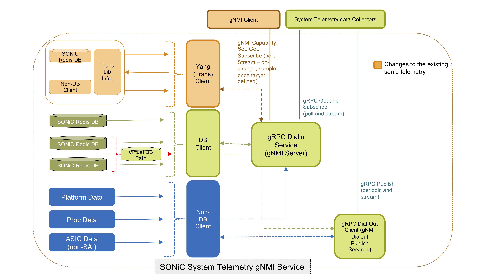
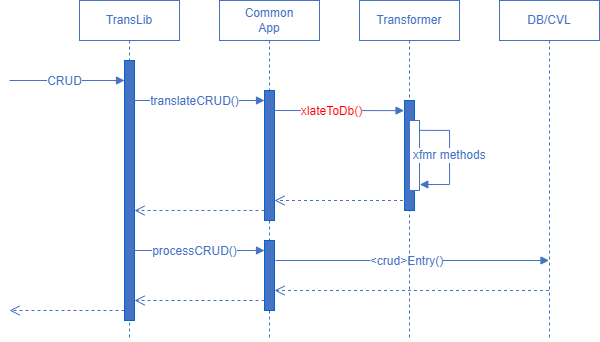
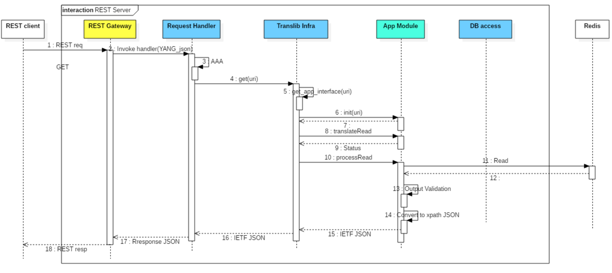

# SONiC Management Framework

## High level design document

### Rev 0.19

## Table of Contents

* [List of Tables](#list-of-tables)
* [Revision](#revision)
* [About this Manual](#about-this-manual)
* [Scope](#scope)
* [Definition/Abbreviation](#definitionabbreviation)
* [Table 1: Abbreviations](#table-1-abbreviations)
* [1 Feature Overview](#1-feature-overview)
    * [1.1 Requirements](#11-requirements)
    * [1.2 Design Overview](#12-design-overview)
        * [1.2.1 Basic Approach](#121-basic-approach)
        * [1.2.2 Container](#122-container)
* [2 Functionality](#2-functionality)
    * [2.1 Target Deployment Use Cases](#21-target-deployment-use-cases)
* [3 Design](#3-design)
    * [3.1 Overview](#31-overview)
        * [3.1.1 Build time flow](#311-build-time-flow)
        * [3.1.2 Run time flow](#312-run-time-flow)
            * [3.1.2.1 CLI](#3121-cli)
            * [3.1.2.2 REST](#3122-REST)
            * [3.1.2.3 gNMI](#3123-gnmi)
    * [3.2 SONiC Management Framework Components](#32-sonic-management-framework-components)
        * [3.2.1 Build time components](#321-build-time-components)
            * [3.2.1.1 Yang to OpenAPI converter](#3211-yang-to-openapi-converter)
                * [3.2.1.1.1 Overview](#32111-overview)
                * [3.2.1.1.2 Supported HTTP verbs](#32112-supported-http-verbs)
                * [3.2.1.1.3 Supported Data Nodes](#32113-supported-data-nodes)
                * [3.2.1.1.4 Data Type Details](#32114-data-type-details)
                * [3.2.1.1.5 Special Handling](#32115-special-handling)
                * [3.2.1.1.6 Future enhancements](#32115-future-enhancements)                
            * [3.2.1.2 OpenAPI generator](#3212-OpenAPI-generator)
            * [3.2.1.3 YGOT generator](#3213-YGOT-generator)
            * [3.2.1.4 pyang compiler](#3214-pyang-compiler)
        * [3.2.2 Run time components](#322-run-time-components)
            * [3.2.2.1 CLI](#3221-cli)
            * [3.2.2.2 REST Client SDK](#3222-REST-client-sdk)
            * [3.2.2.3 gNMI Client](#3223-gnmi-client)
            * [3.2.2.4 REST server](#3224-REST-server)
                * [3.2.2.4.1 Transport options](#32241-transport-options)
                * [3.2.2.4.2 Translib linking](#32242-Translib-linking)
                * [3.2.2.4.3 Media Types](#32243-media-types)
                * [3.2.2.4.4 Payload Validations](#32244-payload-validations)
                * [3.2.2.4.5 Concurrency](#32245-concurrency)
                * [3.2.2.4.6 API Versioning](#32246-api-versioning)
                * [3.2.2.4.7 RESTCONF Entity-tag](#32247-restconf-entity-tag)
                * [3.2.2.4.8 RESTCONF Discovery](#32248-restconf-discovery)
                * [3.2.2.4.9 RESTCONF Query Parameters](#32249-restconf-query-parameters)
                * [3.2.2.4.10 RESTCONF Operations](#322410-restconf-operations)
                * [3.2.2.4.11 RESTCONF Notifications](#322411-restconf-notifications)
                * [3.2.2.4.12 Authentication](#322412-authentication)
                * [3.2.2.4.13 Error Response](#322413-error-response)
                * [3.2.2.4.14 DB Schema](#322414-db-schema)
                * [3.2.2.4.15 API Documentation](#322415-api-documentation)
            * [3.2.2.5 gNMI server](#3225-gnmi-server)
			    * [3.2.2.5.1 Files changed/added](#32251-files-changed/added)
				* [3.2.2.5.2 Sample Requests](#32253-sample-requests)
            * [3.2.2.6 Translib](#3226-Translib)
                * [3.2.2.6.1 App Interface](#32261-app-interface)
                * [3.2.2.6.2 Translib Request Handler](#32262-Translib-request-handler)
                * [3.2.2.6.3 YGOT request binder](#32263-YGOT-request-binder)
                * [3.2.2.6.4 YANG Model Versioning](#32264-yang-model-versioning)
                * [3.2.2.6.5 DB access layer](#32265-db-access-layer)
			* [3.2.2.7 Transformer](#3227-transformer)
				* [3.2.2.7.1 Components](#32271-components)
				* [3.2.2.7.2 Design](#32272-design)
				* [3.2.2.7.3 Process](#32273-process)
				* [3.2.2.7.4 Common App](#32274-common-app)
				* [3.2.2.7.5 YANG Extensions](#32275-yang-extensions)
				* [3.2.2.7.6 Public Functions](#32276-public-functions)
				* [3.2.2.7.7 Overloaded Modules](#32277-overloaded-modules)
				* [3.2.2.7.8 Utilities](#32278-utilities)
            * [3.2.2.8 Config Validation Library (CVL)](#3228-config-validation-library-cvl)
				* [3.2.2.8.1 Architecture](#32281-architecture)
				* [3.2.2.8.2 Validation types](#32282-validation-types)
				* [3.2.2.8.3 CVL APIs](#32283-cvl-apis)
            * [3.2.2.9 Redis DB](#3229-redis-db)
            * [3.2.2.10 Non DB data provider](#32210-non-db-data-provider)
* [4 Flow Diagrams](#4-flow-diagrams)
    * [4.1 REST SET flow](#41-REST-set-flow)
    * [4.2 REST GET flow](#42-REST-get-flow)
	* [4.3 Translib Initialization flow](#43-Translib-initialization-flow)
	* [4.4 gNMI flow](#44-gNMI-flow)
	* [4.5 CVL flow](#45-CVL-flow)
* [5 Developer Work flow](#5-Developer-Work-flow)
    * [5.1 Developer work flow for custom (SONiC/CVL) YANG](#51-Developer-work-flow-for-custom-SONiCCVL-YANG)
        * [5.1.1 Define Config Validation YANG schema](#511-Define-Config-Validation-YANG-schema)
        * [5.1.2 Generation of REST server stubs and Client SDKs for YANG based APIs](#512-Generation-of-REST-server-stubs-and-Client-SDKs-for-YANG-based-APIs)
        * [5.1.3 Config Translation App (Go language)](#513-Config-Translation-App-Go-language)
        * [5.1.4 IS CLI](#514-IS-CLI)
        * [5.1.5 gNMI](#515-gNMI)
    * [5.2 Developer work flow for standard (OpenConfig/IETF) YANG](#52-Developer-work-flow-for-standard-OpenConfigIETF-YANG)
        * [5.2.1 Identify the standard YANG module for the feature for northbound APIs](#521-Identify-the-standard-YANG-module-for-the-feature-for-northbound-APIs)
        * [5.2.2 Define the Redis schema for the new feature. (not applicable for legacy/existing feature)](#522-Define-the-Redis-schema-for-the-new-feature-not-applicable-for-legacyexisting-feature)
        * [5.2.3 Define Config Validation YANG schema](#523-Define-Config-Validation-YANG-schema)
        * [5.2.4 Generation of REST server stubs and Client SDKs for YANG based APIs](#524-Generation-of-REST-server-stubs-and-Client-SDKs-for-YANG-based-APIs)
        * [5.2.5 Config Translation App (Go language)](#525-Config-Translation-App-Go-language)
        * [5.2.6 IS CLI](#526-IS-CLI)
        * [5.2.7 gNMI](#527-gNMI)
* [6 Error Handling](#6-error-handling)
* [7 Serviceability and Debug](#7-serviceability-and-debug)
* [8 Warm Boot Support](#8-warm-boot-support)
* [9 Scalability](#9-scalability)
* [10 Unit Test](#10-unit-test)
* [11 Appendix A](#11-appendix-a)
* [12 Appendix B](#11-appendix-b)


## List of Tables

[Table 1: Abbreviations](#table-1-abbreviations)

## Revision

| Rev |     Date    |       Author            | Change Description                |
|:---:|:-----------:|:-----------------------:|-----------------------------------|
| 0.1 | 06/13/2019  | Anand Kumar Subramanian | Initial version                   |
| 0.2 | 07/05/2019  | Prabhu Sreenivasan      | Added gNMI, CLI content from DELL |
| 0.3 | 08/05/2019  | Senthil Kumar Ganesan   | Updated gNMI content          |
| 0.4 | 08/07/2019  | Arun Barboza            | Clarifications on Table CAS   |
| 0.5 | 08/07/2019  | Anand Kumar Subramanian | Translib Subscribe support    |
| 0.6 | 08/08/2019  | Kwangsuk Kim            | Updated Developer Workflow and CLI sections |
| 0.7 | 08/09/2019  | Partha Dutta            | Updated Basic Approach under Design Overview |
| 0.8 | 08/15/2019  | Anand Kumar Subramanian | Addressed review comments     |
| 0.9 | 08/19/2019  | Partha Dutta            | Addressed review comments related to CVL    |
| 0.10 | 09/25/2019 | Kwangsuk Kim            | Updated Transformer section |
| 0.11 | 09/30/2019 | Partha Dutta            | Updated as per SONiC YANG guideline    |
| 0.12 | 10/19/2019 | Senthil Kumar Ganesan   | Added Appendix B    |
| 0.13 | 11/27/2019 | Anand Kumar Subramanian | Added new APIs in translib    |
| 0.14 | 12/03/2019 | Sachin Holla            | RESTCONF yang library and other enhancements |
| 0.15 | 12/19/2019 | Partha Dutta            | Added new CVL API, platform and custom validation details |
| 0.16 | 04/08/2020 | Sachin Holla            | API versioning enhancement |
| 0.17 | 04/08/2020 | Mohammed Faraaz         | OpenAPI 3.0 enhancements |
| 0.18 | 04/09/2020 | Kwangsuk Kim            | Updated CLI and Transformer enhancement |
| 0.19 | 04/15/2020 | Mohammed Faraaz         | Generic REST client for CLI |

## About this Manual

This document provides general information about the Management framework feature implementation in SONiC.

## Scope

This document describes the high level design of Management framework feature.

## Definition/Abbreviation

### Table 1: Abbreviations

| **Term**                 | **Meaning**                         |
|--------------------------|-------------------------------------|
| CVL                      | Config Validation Library           |
| NBI                      | North Bound Interface               |
| ABNF                     | Augmented Backus-Naur Form          |
| YANG                     | Yet Another Next Generation         |
| JSON                     | Java Script Object Notation         |
| XML                      | eXtensible Markup Language          |
| gNMI                     | gRPC Network Management Interface   |
| YGOT                     | YANG Go Tools                       |

## 1 Feature Overview

Management framework is a SONiC application which is responsible for providing various common North Bound Interfaces (NBIs) for the purposes of managing configuration and status on SONiC switches. The application manages coordination of NBI’s to provide a coherent way to validate, apply and show configuration.

### 1.1 Requirements

* Must provide support for:

    1. Standard [YANG](https://tools.ietf.org/html/rfc7950) models (e.g. OpenConfig, IETF, IEEE)
    2. Custom YANG models ([SONiC YANG](https://github.com/sonic-net/SONiC/blob/master/doc/mgmt/SONiC_YANG_Model_Guidelines.md))
    3. Industry-standard CLI / Cisco like CLI

* Must provide support for [OpenAPI spec](http://spec.openapis.org/oas/v3.0.3) to generate REST server side code
* Must provide support for NBIs such as:

    1. CLI
    2. gNMI
    3. REST/RESTCONF

* Must support the following security features:

    1. Certificate-based authentication
    2. User/password based authentication
    3. Role based authorization

* Ease of use for developer workflow

    1. Specify data model and auto-generate as much as possible from there

* Must support Validation and Error Handling - data model, platform capability/scale, dynamic resources
* SNMP integration in SONiC is left for future study

### 1.2 Design Overview

Management framework makes use of the translation library (Translib) written in golang to convert the data models exposed to the management clients into the Redis ABNF schema format. Supported management servers can make use of the Translib to convert the incoming payload to SONiC ABNF schema and vice versa depending on the incoming request. Translib will cater to the needs of REST and gNMI servers. Later the Translib can be enhanced to support other management servers if needed. This framework will support both standard and custom YANG models for communication with the corresponding management servers. Management framework will also take care of maintaining data consistency, when writes are performed from two different management servers at the same time. Management framework will provide a mechanism to authenticate and authorize any incoming requests. Management framework will also take care of validating the requests before writing them into the Redis DB. Config Validation Library is used for syntactic and semantic validation of ABNF JSON based on YANG derived from Redis ABNF schema.

#### 1.2.1 Basic Approach

* Management framework takes comprehensive approach catering:
	* Standard based YANG Models and custom YANG
	* Open API spec
	* Industry standard CLI
	* Config Validation
* REST server, gNMI server, App module and Translib - all in Go
* Translation by using the Translib Library and application specific modules
* Marshalling and unmarshalling using YGOT
* Redis updated using CAS(Check-and-Set) trans. (No locking, No rollback)
* Config Validation by using YANG model from ABNF schema
* CLI with Klish framework

#### 1.2.2 Container

The management framework is designed to run in a single container named “sonic-mgmt-framework”. The container includes the REST server linked with Translib, and CLI process.
The gNMI support requires the gNMI server which is provided as a part of sonic-telemetry container. We would like to rename this container as the sonic-gnmi container as now it can perform configurations as well through the gNMI server.
Will introduce a new container sonic-mgmt-common to host the common code that is used both in the mgmt-framework and sonic-telemetry container. This new repo will compile into static libraries that will be used in the other two repos. This way sonic-telemetry repo can be compiled without the mgmt-framework being present in the code base.

## 2 Functionality

### 2.1 Target Deployment Use Cases

1. Industry Standard CLI which will use REST client to talk to the corresponding servers to send and receive data.
2. REST client through which the user can perform POST, PUT, PATCH, DELETE, GET operations on the supported YANG paths.
3. gNMI client with support for capabilities, get, set, and subscribe based on the supported YANG models.

## 3 Design

### 3.1 Overview

The SONiC management framework comprises two workflows:

1. Build time flow
2. Run time flow

as show in the architecture diagram below.


#### 3.1.1 Build time flow

The Developer starts by defining the desired management objects and the access APIs to provide for the target application. This can be done in one of the two ways: -
1) A YANG data model
2) An OpenAPI spec

This can be an independent choice on an application by application basis. However note that using YANG allows for richer data modelling, and therefore superior data validation.

1. In case of YANG, if the developer chooses standard YANG model (Openconfig, IETF etc.), a separate SONiC YANG model has to be written based on Redis ABNF schema for validating Redis configuration and transformer hints should be written in a deviation file for standard YANG model to Redis DB coversion and vice versa (refer to [3.2.2.7 Transformer](#3227-transformer) for details). However, if custom SONiC YANG model is written based on guidelines, CVL YANG is automatically derived from it and the same is used for validation purpose and there is no need of writing any deviation file for transformer hints. Based on the given YANG model as input, the pyang compiler generates the corresponding OpenAPI spec which is in turn given to the OpenAPI generator to generate the REST client SDK and REST server stubs in golang. The YANG data model is also provided to the [YGOT](https://github.com/openconfig/YGOT) generator to create the YGOT bindings. These are used on the interface between Translib and the selected App module. Specifically, Translib populates the binding structures based upon the incoming server payload, and the App module processes the structure accordingly. Additionally, a YANG annotation file must also be provided, for data models that do not map directly to the SONiC YANG structure. The requests in this case will be populated into the YGOT structures and passed to App module for conversion. The App module uses the YANG annotations to help convert and map YANG objects to DB objects and vice-versa.

2. In case of OpenAPI spec, it is directly given to the [OpenAPI](https://openapi-generator.tech/docs/generators/python) generator to generate the REST client SDK and REST server stubs in golang. In this case the REST server takes care of validating the incoming request to be OpenAPI compliant before giving the same to Translib. There is no YANG, and therefore no YGOT bindings are generated or processed, and so the Translib infra will invoke the App module functions with the path and the raw JSON for App modules to convert. For configuration validation purpose, SONiC YANG model has to be written based on Redis ABNF schema. 

#### 3.1.2 Run time flow

##### 3.1.2.1 CLI

1. CLI uses the KLISH framework to provide a CLI shell. The CLI request is converted to a corresponding REST client request using c, and is sent to the REST server.
2. The OpenAPI generated REST server handles all the REST requests from CLI and invokes a common handler for all the create, update, replace, delete and get operations along with path and payload. This common handler converts all the requests into Translib arguments and invokes the corresponding Translib provided APIs.
3. Translib API then calls the corresponding handler defined in Common App module, subsequently invokes Transformer functions with YGOT structured request to perform model to model transformation, i.e. Openconfig  Model to SONiC model, to generate the request DB map.
4. Common App handlers pass the request DB map to DB Access module to access REDIS Database, process the request DB map. The response to GET operation is passed to Transformer to perform reverse transformation to Openconfig Model, and wired out to CLI as JSON response.
5. Further processing of CLI commands will be handled by Translib componenets that will be discussed in more detail in the later sections.

##### 3.1.2.2 REST

1. REST client will use the OpenAPI generated client SDK to send the request to the REST server.
2. From then on the flow is similar to the one seen in the CLI.

##### 3.1.2.3 gNMI

GNMI service defines a gRPC-based protocol for the modification and retrieval of configuration from a target device, as well as the control and generation of telemetry streams from a target device to a data collection system. Refer  [GNMI spec](https://github.com/openconfig/reference/blob/master/rpc/gnmi/gnmi-specification.md)



1. Existing SONiC telemetry framework has been extended to support the new GNMI services.
2. All 4 GNMI services are supported: Get, Set, Capabilities and Subscribe.
3. A new transl data client is added to process the incoming YANG-based request (either standard or proprietary)
4. The new transl data client relies on Translib infra provided to translate, get, set of the YANG objects.

More details on the GNMI server, Client and workflow provided later in the document.

### 3.2 SONiC Management Framework Components

Management framework components can be classified into

1. Build time components
2. Run time components

#### 3.2.1 Build time components

Following are the build time components of the management framework

1. Pyang compiler (for YANG to OpenAPI conversion)
2. OpenAPI generator
3. YGOT generator
4. pyang compiler (for YANG to YIN conversion)

##### 3.2.1.1 YANG to OpenAPI converter

##### 3.2.1.1.1 Overview

Open source Python-based YANG parser called pyang is used for YANG parsing and building a Python object dictionary. A custom plugin is developed to translate this Python object dictionary into an OpenAPI spec. The OpenAPI specs are [3.0](https://github.com/OAI/OpenAPI-Specification/blob/master/versions/3.0.3.md) complaint.

URI format and payload is RESTCONF complaint and is based on the [RFC8040](https://tools.ietf.org/html/rfc8040). The Request and Response body is in JSON format in this release.

##### 3.2.1.1.2 Supported HTTP verbs

Following table lists the HTTP methods generated for different types of YANG nodes.

 YANG node type         | HTTP methods
------------------------|-----------------
Configuration data      | POST, PUT, PATCH, DELETE, GET, HEAD
Non configuration data  | GET, HEAD
YANG RPC                | POST

##### 3.2.1.1.3 Supported Data Nodes

For each of the below-listed Data keywords nodes in the YANG model, the OpenAPI (path) will be generated 

* Container
* List
* Leaf
* Leaf-list
* Rpc

##### 3.2.1.1.4 Data Type Details

 YANG Type    | OpenAPI Type
--------------|------------------
int8          | Integer
int16         | Integer
int32         | Integer
int64         | Integer
uint8         | Integer
uint16        | Integer
uint32        | Integer
uint64        | Integer
decimal64     | Number
String        | string
Enum          | Enum
Identityref   | String (Future can be Enum)
long          | Integer
Boolean       | Boolean
Binary        | String with Format as Binary
bits          | integer

* All list keys will be made mandatory in the payload and URI
* YANG mandatory statements will be mapped to the required statement in OpenAPI
* Default values, Enums are mapped to Default and Enums statements of OpenAPI
* Since OpenAPI spec does not provide a way to define an unsigned types, a custom vendor extension x-yang-type is introduced which will contain the actual yang data type of a leaf/leaf-list. This vendor extension will be part of type object.

Example below

```
  /restconf/data/ietf-snmp:snmp/tlstm/cert-to-name={id}:
    put:
      tags:
      - ietf-snmp
      parameters:
      - name: id
        in: path
        required: true
        schema:
          format: int32
          maximum: 4294967295
          minimum: 0
          type: integer
          **x-yang-type: uint32**
```
* As seen in above example all Integer types will have maximum and minimum fields. If the range statement is defined on the YANG node, then the value for maximum and minimum is derived from the range statement otherwise default range specified by YANG will be considered. And also a custom vendor extension called x-range will include a copy of range statement's value. If a type has one more range statements (may be indirectly using typedefs) all the range statements will be included as part of x-range extension separated by '|' character.

Exampe below
```
    - format: int32
    **maximum: 2147483647**
    **minimum: 1**
    type: integer
    **x-range: 1..2147483647 | 4..10**
    x-yang-type: int32
```
* A string data types will have a vendor extension x-pattern whose value will be a regex. This field will only be present when the YANG node has it. Although OpenAPI 3.0 has a pattern field under schema object, but it is not used because the regex required for OpenAPI 3.0 is a W3C complaint regex but Openconfig models follow POSIX style regex. If a type has one more regex statements (may be indirectly using typedefs) all the regex statements will be included as part of x-pattern extension, they will be ANDed together.

Example below
```
    - maxLength: 18446744073709551615
    minLength: 0
    type: string
    **x-pattern: (([0-9]|[1-9][0-9]|1[0-9][0-9]|2[0-4][0-9]|25[0-5])\.){3}([0-9]|[1-9][0-9]|1[0-9][0-9]|2[0-4][0-9]|25[0-5])(\%[\p{N}\p{L}]+)?**
    x-yang-type: string
```
NOTE: An extra backslash is added in front of % in the above code snippet. Remove the backslash while using the actual jinja2 code in SONiC.

* As seen in above example all String types will have maxLength and minLength fields. If the length statement is defined on the YANG node, then the value for maxLength and minLength is derived from the length statement otherwise default length specified by YANG will be considered. And also a custom vendor extension called x-length will include a copy of length statement's value. If a type has one more length statements (may be indirectly using typedefs) all the length statements will be included as part of x-length extension separated by '|' character.

* A Union data type is supported through oneOf directive. oneOf is a JSON schema directive supported by openAPI 3.0. It takes an array of objects and at any given time only one of item can be used. 

Example below
```
    - name: security-model
    in: path
    required: true
    schema:
        oneOf:
        - enum:
        - v1
        - v2c
        - usm
        - tsm
        maxLength: 18446744073709551615
        minLength: 0
        type: string
        x-yang-type: string
        - format: int32
        maximum: 2147483647
        minimum: 1
        type: integer
        x-range: 1..2147483647
        x-yang-type: int32
```

##### 3.2.1.1.5 Special handling

* A list and leaf-list will have maxItems and minItems properties set if a YANG node defines max-elements and min-elements statements.

Example below
```
    security-model:
        type: array
        items:
        oneOf:
        - enum:
            - v1
            - v2c
            - usm
            - tsm
            maxLength: 18446744073709551615
            minLength: 0
            type: string
            x-yang-type: string
        - format: int32
            maximum: 2147483647
            minimum: -2147483648
            type: integer
            x-range: 1..2147483647
            x-yang-type: int32
        minItems: 1
```
* A Choice-case statement is supported using oneOf directive.

Example below
```
    ietf-snmp:auth:
        type: object
        properties: {}
        **oneOf:**
        - type: object
        properties:
            md5:
            type: object
            properties:
                key:
                maxLength: 18446744073709551615
                minLength: 0
                type: string
                x-pattern: ([0-9a-fA-F]{2}(:[0-9a-fA-F]{2})*)?
                x-yang-type: string
            required:
            - key
        - type: object
        properties:
            sha:
            type: object
            properties:
                key:
                maxLength: 18446744073709551615
                minLength: 0
                type: string
                x-pattern: ([0-9a-fA-F]{2}(:[0-9a-fA-F]{2})*)?
                x-yang-type: string
            required:
            - key
```

##### 3.2.1.1.6 Future enhancements

* Support for additional YANG actions and notifications(if required).
* Support for RESTCONF query parameters such as depth, filter, etc
* Convert Yang identities in to enums

##### 3.2.1.2 OpenAPI generator

OpenAPI-codegen tool (github.com/OpenAPITools/openapi-generator) is used to generate REST server and client code from the OpenAPI definitions. It consumes the OpenAPI definitions generated from YANG files and any other manually written OpenAPI definition files.

REST server is generated in Go language. Customized OpenAPI-codegen templates are used to make each server stub invoke a common request handler function. The common request handler will invoke Translib APIs to service the request.

REST client is generated in Python language. Client applications can generate the REST client in any language using standard OpenAPI-codegen tool.

##### 3.2.1.3 YGOT generator

YGOT generator generates Go binding structures for the management YANG. The generated Go binding structures are consumed by the Translib to validate the incoming payload and help in conversion of Redis data to management YANG specific JSON output payload.

##### 3.2.1.4 pyang compiler

Open source pyang tool is used to compile YANG models and generate output file in required format. For example SONiC YANG model is compiled and YIN schema file is generated for validation purpose. Similarly, after compiling YANG model, OpenAPI spec file is generated for generating REST client SDK and server code using OpenAPI-codegen.

#### 3.2.2 Run time components

Following are the run time components in the management framework

1. CLI
2. REST Client SDK
3. REST server
4. gNMI Client
5. gNMI server
6. Translib
7. Config Validation Library (CVL)
8. Redis DB
9. Non DB data provider

##### 3.2.2.1 CLI

Open source Klish is integrated into sonic-mgmt-framework container to provide the command line interface tool to perform more efficient network operations more efficiently in SONiC. Klish will provide the core functionality of command parsing, syntax validation, command help and command auto-completion. The following diagram shows how the CLI commands are built, processed, and executed.


1. CLI command input from user
2. Klish invokes the actioner defined in command <ACTION> tag
3. Actioner invokes either sub shell or the built-in methods to make a REST client API call using C based libcurl or Python Requests package to the REST server. 
4. Receive response from OpenAPI clientAPI and pass it to renderer scripts.
5. Renderer scripts processes the JSON response from REST Client and optionally formats the output using a Jinja template
6. CLI output is rendered to the terminal.

###### 3.2.2.1.1 CLI components

CLI consists of the following components.

* **Open source Klish** - CLI parser framework to support Command Line Interface Shell
* **XML files** to define CLI command line options and actions
  * Klish uses XML to define CLI commands to build the command tree. Klish provides modular CLI tree configurations to build command trees from multiple XML files. XML elements can be defined with macros and entity references, which are then preprocessed by utility scripts to generate the expanded XML files that are ultimately used by Klish.
* **Actioner** - Python scripts or built-in methods defined as a command `action`, to form the request body and invoke the OpenAPI client API
* **Renderer** - Python scripts defined with Jinja templates. Receives the JSON response from Swagger API and use the jinja2 template file to render and format CLI output.
* **Preprocess scripts** - Validates XML files and applies some processing from a developer-friendly form into a "raw" form that is compatible with Klish.

###### 3.2.2.1.2 Preprocessing XML files

Multiple scripts are executed at build time to preprocess special XML tags/attributes - MACRO substitution, adding pipe processing, etc. - and generate target XML files in a form that is consumable by Klish.

The XML files are also validated as part of compilation. `xmllint` is used to validate all the processed XML files after macro substitution and pipe processing against the detailed schema defined in `sonic-clish.xsd`. Once the XML files are fully validated and preprocessed, the target XML files are generated in the folder `${workspace}/sonic-mgmt-framework/build/cli/target/command-tree`.

The following preprocessing scripts are introduced:
*	`klish_ins_def_cmd.py` - append the "exit" and "end" commands to the views of the Klish XML files
*	`klish_insert_pipe.py` - extend every show and get COMMAND with pipe option
*	`klish_platform_features_process.sh` - validate all platform XML files. Generate the entity.XML files.
*	`klish_replace_macro.py` – perform macro substitution on the Klish XML files

###### 3.2.2.1.3 MACROs

There are some CLI commands that can have the same set of options, where the set of XML tags would need to be repeated in all those CLI commands. Macros can be used to avoid such repetitions and to keep the options in one place, so that it is possible to make a reference to a macro in multiple command definitions. There are cases where we may need to use variations in the values of these macro options. In such cases, it is also possible to pass those XML attributes as an argument to macros and substitute those values inside the macro definition. The macro definition is referred as the ``<MACRO name="name of macro">`` and ``</MACRO>`` tags. `klish_replace_macro.py` is used to process macros at the compile time to expand the references to the target XML files.
The macro definition files are located in the folder `${workspace}/sonic-mgmt-framework/src/CLI/clitree/macro`.

Example:

Before macro substitution:

```XML
<VIEW name="configure-if-view">
    <!-- ip access-group -->
    <COMMAND
         name="ip access-group"
         help="Specify access control for packets"
         >
    <MACRO name="ACG-OPTIONS" arg=""></MACRO>
       ...
    </COMMAND>
```

After macro substitution:

```XML
<VIEW name="configure-if-view">
    <!-- ip access-group -->
    <COMMAND name="ip access-group" help="Specify access control for packets">
      <PARAM name="access-list-name" help="Name of access-list (Max size 140)" ptype="STRING"/>
      <PARAM name="direction-switch" help="Configure the direction to apply the access list" ptype="SUBCOMMAND" mode="switch">
        <PARAM name="in" help="Apply access-list in incoming direction" ptype="SUBCOMMAND" mode="subcommand"/>
        <PARAM name="out" help="Apply access-list in outgoing direction" ptype="SUBCOMMAND" mode="subcommand"/>
      </PARAM>
        ...
    </COMMAND>
```

###### 3.2.2.1.4 ENTITY
XML files can include an ENTITY that refers to a predefined value. Entity is typically used to define platform specific values and processed by `klish_platform_features_process.sh` to prepend the ENTITY values to the target XML files. By default, there is a default file called `platform_dummy.XML` that defines a platform default ENTITY list. Note that the platform specific is not supported yet.

Example: `platform_dummy.XML`

```XML
<ENTITYLIST>
  <ENTITYNAME value="1">START_PORT_ID</ENTITYNAME>
  <ENTITYNAME value="32">MAX_PORT_ID</ENTITYNAME>
  <ENTITYNAME value="1">START_SUB_PORT_ID</ENTITYNAME>
  <ENTITYNAME value="4">MAX_SUB_PORT_ID</ENTITYNAME>
  <ENTITYNAME value="9276">MAX_MTU</ENTITYNAME>
 </ENTITYLIST>
```

The ENTITY name can be referenced in command definitions. For example, PTYPE for RANGE_MTU, used for interface commands:

```XML
<PTYPE
  help=""
	method="integer"
  name="RANGE_MTU"
	pattern="1312..&MAX_MTU;"
/>
```

###### 3.2.2.1.5 Actioner

The Actioner is used to convert CLI commands to the corresponding OpenAPI client requests on the target resources. It is defined with the `<ACTION>` tag in the XML file. There are three different methods available in the Actioner: sub-shell, builtin clish_restcl and clish_pyobj. CLI builtin functions "clish_pyobj" and "clish_restcl" can be applied to reduce time take to execute a command by eliminating the sub-shell interpreter overhead.

1) Spawn a sub-shell to interpret Python scripts
Klish spawns a sub-shell to interpret the Python scripts defined in a command's `<ACTION>` tag.
The sub-shell runs the wrapper script `sonic_cli_<module_name>.py`
```
	sonic_cli_<module_name>.py <OpenAPI client method> [parameters . . .]
```
The `sonic_cli_<module_name>.py` has a dispatch function to call a OpenAPI client method with parameters passed from user input.

Example:
```XML
<VIEW name="configure-if-view">
    <!-- ip access-group -->
    <COMMAND
         name="ip access-group"
         help="Specify access control for packets"
         >
    <MACRO name="ACG-OPTIONS" arg=""></MACRO>
    <ACTION>
        if test "${direction-switch}" = "in"; then
            Python $SONIC_CLI_ROOT/target/sonic-cli.py post_list_base_interfaces_interface ${access-list-name} ACL_IPV4 ${iface} ingress
        else
            Python $SONIC_CLI_ROOT/target/sonic-cli.py post_list_base_interfaces_interface ${access-list-name} ACL_IPV4 ${iface} egress
        fi
    </ACTION>
    </COMMAND>
    ...
```

2) Invoke the built-in function, clish_restcl, to use libcurl to make REST client call
This builtin uses libcurl to connect to the REST server
Format of ACTION tag argument:
oper= url=</restconf/data/...> body={..}
oper can be PUT/POST/PATCH/DELETE
body is optional.
oper GET is not supported as we currently don't handle rendering using jinja templates.
Example:
```
<ACTION builtin="clish_restcl">oper=PATCH url=/restconf/data/openconfig-interfaces:interfaces/interface=Vlan${vlan-id}/config body={"openconfig-interfaces:config": {"name": "Vlan${vlan-id}"}}</ACTION>
```

3) Invoke the built-in function, clish_pyobj, to use embedding Python to make REST client call
This builtin uses embedded python approach.

Format of ACTION tag argument:
<module> <function> <args>
(<module> is the actioner script without the extension. The name cannot include "-")

Example:
```
<ACTION builtin="clish_pyobj">sonic_cli_if patch_openconfig_interfaces_interfaces_interface_config Vlan${vlan-id}</ACTION>
```

###### 3.2.2.1.6 Renderer scripts

The actioner script receives the JSON output from the OpenAPI client API and invokes the renderer script. The renderer script will send the JSON response to the jinja2 template file to parse the response and generate the CLI output.

Example: "show acl"

```
{\% set acl_sets = acl_out['openconfig_aclacl']['acl_sets']['acl_set'] \%}
   {\% for acl_set in acl_sets \%}
       Name:  {{ acl_set['state']['description'] }}
   {\% endfor \%}
```
NOTE: An extra backslash is added in front of % in the above code snippet. Remove the backslash while using the actual jinja2 code in SONiC.

###### 3.2.2.1.7 Generic REST Client for CLI

Actioner scripts can use the generic rest client **cli_client.py** to communicate to REST Server.
It is a replacement for OpenAPI Client SDKs.
This client is tailor made to connect to local REST Server and handle the CLI actioner usecases.

###### 3.2.2.1.8 Workflow (to add a new CLI)

The following steps are to be followed when a new CLI is to be added.
1.	Create an XML file that defines CLI command and parameters that the command requires.
2.	Define the CLI help string to be displayed and datatype for the parameters. New parameter types (PTYPES), macros, and entities can be defined and used in the XML files. Valid XML tags are defined in the `sonic-clish.xsd` file.
3.	Add the actioner to `<ACTION>` tag to run the wrapper script with the OpenAPI client method name and parameters or use the generic REST client to communicate with rest-server.
4.  Add the code to the wrapper script to construct the payload in `generate_body()` and handle the response.
5.	For ‘show’ commands, create a Jinja template to format the output.


##### 3.2.2.2 REST Client SDK

Framework provides OpenAPI-codegen generated Python client SDK. Developers can generate client SDK code in other programming languages from the OpenAPI definitions as required.

Client applications can use OpenAPI generated client SDK or any other REST client tool to communicate with the REST server.

##### 3.2.2.3 gNMI Client

SONiC Telemetry service provides the gNMI server, while the client must be provided by the user. gNMI is typically used as a programmatic interface and therefore it is typically called directly from programming language environments using their respective gRPC libraries (https://github.com/grpc/grpc). For testing and scripting purposes, several CLI programs are provided as well.

GNMI clients developed by google and modified by JipanYANG.(github.com/jipanYANG/gnxi/gnmi_get, github.com/jipanYANG/gnxi/gnmi_set)
was taken and further modified to support new features. gnmi_cli from openconfig (https://github.com/openconfig/gnmi/tree/master/cmd/gnmi_cli) is also taken for testing subscribe and capabilities operations. Finally, a new client was developed gnoi_client, for test gNOI RPC operations.

Note: Although the gRPC protocol allows for many encodings to be used, our usage is restricted to JSON_IETF encoding.

Supported RPC Operations:
-------------------------
- Get: Get one or more paths and have value(s) returned in a GetResponse.
- Set: Update, replace or delete objects
    + Update: List of one or more objects to update
    + Replace: List of one or objects to replace existing objects, any unspecified fields wil be defaulted.
    + Delete: List of one or more object paths to delete
- Capabilities: Return gNMI version and list of supported models and model versions.
    + A gNMI Extension field has been added as well to return the SONiC model "bundle version".
- Subscribe:
    + Subscribe to paths using either streaming or poll, or once based subscription, with either full current state or updated values only.
        * Once: Get single subscription message.
        * Poll: Get one subscription message for each poll request from the client.
        * Stream: Get one subscription message for each object update (called ON_CHANGE mode), or at each sample interval if using sample mode. target_defined uses the values pre-configured for that particular object. Not all paths support ON_CHANGE mode due to performance considerations, while all paths will support sample mode and therefore target defined as well since it will default to sample if ON_CHANGE is not supported.


Example Client Operations:
--------------------------
Using opensource clients, these are example client operations. The .json test payload files are available here: https://github.com/project-arlo/sonic-mgmt-common/tree/master/src/Translib/test

Get:
----
`./gnmi_get -xpath /openconfig-acl:acl/interfaces -target_addr 127.0.0.1:8080 -alsologtostderr -insecure true -pretty`

Set:
----
Replace:
--------
    `./gnmi_set -replace /openconfig-acl:acl/:@./test/01_create_MyACL1_MyACL2.json -target_addr 127.0.0.1:8080 -alsologtostderr -insecure true -pretty`
Delete:
-------
    `./gnmi_set -delete /openconfig-acl:acl/ -target_addr 127.0.0.1:8080 -insecure`

Subscribe:
----------
Streaming sample based:
-----------------------
`./gnmi_cli -insecure -logtostderr -address 127.0.0.1:8080 -query_type s -streaming_sample_interval 3 -streaming_type SAMPLE -q /openconfig-acl:acl/ -v 0 -target YANG`

Poll based:
-----------
`./gnmi_cli -insecure -logtostderr -address 127.0.0.1:8080 -query_type p -polling_interval 1s -count 5 -q /openconfig-acl:acl/ -v 0 -target YANG`

Once based:
-----------
`./gnmi_cli -insecure -logtostderr -address 127.0.0.1:8080 -query_type o -q /openconfig-acl:acl/ -v 0 -target YANG`


gNOI:
--------------
gNOI (gRPC Network Operations Interface) extends the gNMI server, adding new custom RPC's to execute management functions on the switch.

gNOI Clear Neighbor:
-------------------
```
gnoi_client -module Sonic -rpc clearNeighbors -jsonin '{"sonic-neighbor:input": {"force": true, "ip": "4.4.4.1"}}' -insecure
```

##### 3.2.2.4 REST Server

The management REST server is a HTTP server implemented in Go language.
It supports following operations:

* RESTCONF APIs for YANG data
* REST APIs for manual OpenAPI definitions

###### 3.2.2.4.1 Transport options

REST server supports only HTTPS transport and listens on default port 443.
Server port can be changed through an entry in ConfigDB REST_SERVER table.

By default a temporary self signed certificate is used as TLS server certificate.
It can be overridden by specifiying a valid TLS private key and certificate file
paths through the REST_SERVER table.

REST_SERVER table schema is described in [DB Schema](#322414-db-schema) section.

###### 3.2.2.4.2 Translib linking

REST server will statically link with Translib. For each REST request, the server
invokes Translib API which then invokes appropriate App module to process the request.
Below is the mapping of HTTP operations to Translib APIs:

 HTTP Method | Translib API     | Request data  | Response data
-------------|------------------|---------------|---------------
 GET         | translib.Get     | path          | status, payload
 POST        | translib.Create  | path, payload | status
 POST (for YANG RPC) | translib.Action  | path, payload | status, payload
 PATCH       | translib.Update  | path, payload | status
 PUT         | translib.Replace | path, payload | status
 DELETE      | translib.Delete  | path          | status
 HEAD        | translib.Get     | path          | status, (payload ignored)
 OPTIONS     | -                | -             | -

More details about Translib APIs are in section [3.2.2.6](#3_2_2_6-Translib).

REST OPTIONS requests do not invoke any Translib API. They return list of supported HTTP methods
for requested path in the "Allow" response header. If PATCH method was supported, the response
will also include an "Accept-Patch" header with the value "application/yang-data+json".

###### 3.2.2.4.3 Media Types

YANG defined RESTCONF APIs support **application/yang-data+json** media type.
Request and response payloads follow [RFC7951](https://tools.ietf.org/html/rfc7951)
defined encoding rules. Media type **application/yang-data+xml** is not supported
in first release.

OpenAPI defined REST APIs can use any media type depending on App module
implementation. However content type negotiation is not supported by REST server.
A REST API should not be designed to consume or produce multiuple content types.
OpenAPI definition for each REST API should have maximun one cone media type in
its "consumes" and "produces" statements.

###### 3.2.2.4.4 Payload Validations

REST server does not validate request payload for YANG defined RESTCONF APIs.
Payload will be validated automatically in lower layers when it gets loaded
into YGOT bindings.

For OpenAPI defined REST APIs the REST server will provide limited payload
validation. JSON request payloads (content type **application/json**) will be
validated against the schema defined in OpenAPI. Response data and non-JSON
request data are not validated by the REST server - this is left to the App module.

###### 3.2.2.4.5 Concurrency

REST server will accept concurrent requests. Translib provides appropriate locking mechanism - parallel reads and sequential writes.

###### 3.2.2.4.6 API Versioning

REST server will allow clients to specify API version through a custom HTTP header **Accept-Version**.

    Accept-Version: 1.0.3

Version text should be in **MAJOR.MINOR.PATCH** format. REST server will extract version text from
the request header and pass it to the Translib API as **ClientVersion** argument.
Section [3.2.2.6.4.2](#322642-version-checks) explains Translib version checking logic.

Version checks are bypassed if Accept-Version header is not present in the request.

For YANG defined RESTCONF APIs, the server's version can be discovered through the standard YANG
module library API "GET /restconf/data/ietf-yang-library:modules-state/module-set-id".
Client should not pass Accept-Version header for this API! This is safe since module-set-id
is a standard API defined by [RFC7895](https://tools.ietf.org/html/rfc7895) for this very purpose.

API Versioning is not supported for manual OpenAPI definitions in this release.
Accept-Version header value will be ignored even if specified.

###### 3.2.2.4.7 RESTCONF Entity-tag

REST server does not maintain entity-tag and last-modified timestamp for configuration data nodes.
GET and HEAD responses does not include "ETag" and "Last-Modified" headers.

[RFC7232](https://tools.ietf.org/html/rfc7232) style HTTP conditional requests is also not supported.
REST server ignores "If-Match", "If-Modified-Since" like conditional request headers.

###### 3.2.2.4.8 RESTCONF Discovery

REST server supports following APIs for clients to discover various RESTCONF protocol features
as described in [RFC8040](https://tools.ietf.org/html/rfc8040).

Method | Path                                           | Purpose
-------|------------------------------------------------|---------------------------
GET    | /.well-known/host-meta                         | RESTCONF root path
GET    | /restconf/yang-library-version                 | YANG library version
GET    | /restconf/data/ietf-yang-library:modules-state | RFC7895 YANG module library
GET    | /restconf/data/ietf-restconf-monitoring:restconf-state/capabilities | RESTCONF Capabilities
GET    | /models/yang/{filename}                        | YANG download

###### 3.2.2.4.8.1 RESTCONF root

Server supports RESTCONF root path discovery through "GET /.well-known/host-meta" API
as described in [RFC8040, section 3.1](https://tools.ietf.org/html/rfc8040#page-18).
RESTCONF root path is "/restconf".

###### 3.2.2.4.8.2 Yang library version

REST server supports "GET /restconf/yang-library-version" API to advertise YANG library version.
Response will indicate version "2016-06-21" as described in [RFC8040, section 3.3.3](https://tools.ietf.org/html/rfc8040#section-3.3.3).
This advertises that the server supports [RFC7895](https://tools.ietf.org/html/rfc7895) compliant
YANG library operations.

###### 3.2.2.4.8.3 YANG module library

REST server allows clients to discover and download all YANG modules supported by the server
via "GET /restconf/data/ietf-yang-library:modules-state" API. Response data includes YANG module
information as per [RFC7895](https://tools.ietf.org/html/rfc7895) requirements.

REST server allows clients to download the YANG files via "GET /models/yang/{filename}" API.
YANG module library response includes full download URL for every YANG module entry.

Note - RFC7895 has been recently obsoleted by [RFC8525](https://tools.ietf.org/html/rfc8525).
It supports YANG library with multi data stores and data store schemas. However these features
are not available in SONiC. Hence REST server does not implement RFC8525 YANG library APIs (for now).

###### 3.2.2.4.8.4 RESTCONF capabilities

REST server supports "GET /restconf/data/ietf-restconf-monitoring:restconf-state/capabilities" API to
advertise its capabilities as described in [RFC8040, section 9.1](https://tools.ietf.org/html/rfc8040#section-9.1).
REsponse includes below mentioned capability information.

    urn:ietf:params:restconf:capability:defaults:1.0?basic-mode=report-all

###### 3.2.2.4.9 RESTCONF Query Parameters

RESTCONF Query Parameters will be supported in future release. All query parameters will be ignored by REST server in this release.

###### 3.2.2.4.10 RESTCONF Operations

REST server supports invoking YANG RPCs through "POST /restconf/operations/{rpc_name}" API
as described in [RFC8040, section 4.4.2](https://tools.ietf.org/html/rfc8040#section-4.4.2).
Operations modeled through YANG v1.1 action statement are not supported in this release.

YGOT binding objects are not available for YANG RPC input and output data model.
Hence payload validation is not performed by REST server or Translib for these APIs.
App modules will receive raw JSON data.

###### 3.2.2.4.11 RESTCONF Notifications

RESTCONF Notification are not supported by framework. Clients can use gNMI for monitoring and notifications.

###### 3.2.2.4.12 Authentication

REST server supports following authentication modes.

* HTTP Basic authentication (username/password authentication)
* HTTP Bearer token authentication with JSON Web Token (JWT) format.
* TLS Certificate authentication
* Any combination of above 3 modes
* No authentication

Details are in [SONiC RBAC HLD](https://github.com/project-arlo/SONiC/blob/master/doc/aaa/SONiC%20RBAC%20HLD.md).

By default HTTP Baisc and bearer token authentication modes are enabled.
It can be overridden through ConfigDB [REST_SERVER table](#322414-db-schema) entry.

###### 3.2.2.4.13 Error Response

REST server sends back HTTP client error (4xx) or server error (5xx) status when request processing
fails. Response status and payload will be as per RESTCONF specifications - [RCF8040, section7](https://tools.ietf.org/html/rfc8040#page-73).
Error response data will be a JSON with below structure. Response Content-Type will be
"application/yang-data+json".

    +---- errors
         +---- error*
              +---- error-type       "protocol" or "application"
              +---- error-tag        string
              +---- error-app-tag?   string
              +---- error-path?      xpath
              +---- error-message?   string

Note: REST server will not populate error-app-tag and error-path fields in this release. It can be
enhanced in a future release. A sample error response:

    {
      "ietf-restconf:errors" : {
        "error" : [
          {
            "error-type" : "application",
            "error-tag" : "invalid-value",
            "error-message" : "VLAN 100 not found"
          }
        ]
      }
    }

**error-type** can be either "protocol" or "application", indicating the origin of the error.
RESTCONF defines two more error-type enums "transport" and "rpc"; they are not used by REST server.

**error-tag** indicates nature of error as described in [RFC8040, section 7](https://tools.ietf.org/html/rfc8040#page-74).

**error-message** field carries a human friendly error message that can be displayed to the end
user. This is an optional field; system error do not include error-message, or have generic
messages like "Internal error". App module developer should use human friendly messages while
returning application errors. In case of CVL constraint violation the REST server will pick
the error message from the YANG "error-message" statement of CVL schema YANG.

Table below lists possible error conditions with response status and data returned by REST server.

Method  | Error condition          | Status | error-type  | error-tag        | error-message
--------|--------------------------|--------|-------------|------------------|----------------------
*any*   | Incorrect request data      | 400 | protocol    | invalid-value    |
*write* | Bad content-type            | 415 | protocol    | invalid-value    | Unsupported content-type
*write* | OpenAPI schema validation fails | 400 | protocol| invalid-value    | Content not as per schema
*write* | YGOT schema validation fails    | 400 | protocol| invalid-value    | *YGOT returned message*
*any*   | Invalid user credentials    | 401 | protocol    | access-denied    | Authentication failed
*write* | User is not an admin        | 403 | protocol    | access-denied    | Authorization failed
*write* | Translib commit failure     | 409 | protocol    | in-use           |
*any*   | Bad Accept-Version value    | 400 | protocol    | invalid-value    | Invalid Accept-Version
*any*   | Version ckeck fails         | 400 | protocol    | operation-not-supported    | Unsupported client version *X.Y.Z*
*any*   | Unknown HTTP server failure | 500 | protocol    | operation-failed | Internal error
*any*   | Not supported by App module | 405 | application | operation-not-supported | *App module returned message*
*any*   | Incorrect payload           | 400 | application | invalid-value    | *App module returned message*
*any*   | Resource not found          | 404 | application | invalid-value    | *App module returned message*
POST    | Resource exists             | 409 | application | resource-denied  | *App module returned message*
*any*   | Unknown error in Translib   | 500 | application | operation-failed | Internal error
*any*   | Unknown App module failure  | 500 | application | operation-failed | *App module returned message*
*any*   | CVL constraint failure      | 500 | application | invalid-value    | *error-message defined in SONiC YANG*


###### 3.2.2.4.14 DB Schema

A new table "REST_SERVER" is introduced in ConfigDB for maintaining REST server configurations.

    key         = REST_SERVER|default   ; REST server configurations.
    ;field      = value
    port        = 1*5DIGIT              ; server port - defaults to 443
    client_auth = "none" / "password" / "jwt" / "cert" 
                                        ; Client authentication mode.
                                        ; none: No authentication, all clients
                                        ;       are allowed. Should be used only
                                        ;       for debugging.
                                        ; password: HTTP Basic authentication.
                                        ; jwt : HTTP Bearer Token authentication with
                                        ;       JSON Web Token format.
                                        ; cert: Certificate based authentication.
                                        ;       Requires ca_crt configuration.
                                        ; Any combination of "password", "jwt" and "cert" modes can be
                                        ; enabled by specifying a comma separated values.
                                        ; Eg: "password,jwt" enables both password and jwt modes.
    log_level   = DIGIT                 ; Verbosity for glog.V logs
    server_crt  = 1*VCHAR               ; Path to TLS certificate file
    server_key  = 1*VCHAR               ; Path to TLS private key file
    ca_crt      = 1*VCHAR               ; Path to the CA certificate to be used for
                                        ; client certificate validation.

###### 3.2.2.4.15 API Documentation

REST server will provide [Swagger UI](https://github.com/swagger-api/swagger-ui) based online
documentation and test UI for all REST APIs it supports. Documentation can be accessed by launching
URL **https://REST_SERVER_IP/ui** in a browser. This page will list all supported OpenAPI
definition files (both YANG generated and manual) along with link to open Swagger UI for them.


##### 3.2.2.5 gNMI server

1. gNMI server is part of the telemetry process that supports telemtry as well as gNMI.
2. The gRPC server opens a TCP port and allows only valid mutually authenticated TLS connections, which requires valid Client, server and CA Certificates be installed as well a properly configured DNS. Multiple simultaneous connections are allowed to gNMI server.
3. The gNMI Agent uses the db client, as well as the non-db client to access and modify data directly in the Redis DB.
4. The Translib client is used to provide alternative models of access such as Openconfig models as opposed to the native Redis schema, as long as the Translib supports these models. Translib offers bidirectional translation between the native Redis model and the desired north bound model, as well as notifications/updates on these model objects to support telemetry and asynchronous updates, alarms and events. Translib should also provide information about what models it supports so that information can be returned in gNMI Capabilities response.
5. The gNMI server defines the four RPC functions as required by the gNMI Specification: Get, Set, Capabilities and Subscribe.
6. Since the db, non-db and Translib clients offer the functionality to support these functions, gNMI only has to translate the paths and object payloads into the correct parameters for the client calls and package the results back into the response gNMI objects to return to the gNMI Client, which is a straightforward operation, since no additional processing of the data is expected to be done in the gNMI server itself. When new models are added to Translib, no additional work should be required to support them in gNMI server.
7. All operations in a Set request are processed in a single transaction that will either succeed or fail as one operation. The db, non-db and Translib clients must support a Bulk operation in order to achieve the transactional behavior. gNMI server then must use this Bulk operation for Set requests.
8. Subscribe operations: Once, Poll and Stream require that the gRPC connection remain open until the subscription is completed. This means many connections must be supported. Subscribe offers several options, such as only sending object updates (not the whole object) which requires support form the db clients. Subscribe also allows for periodic sampling defined by the client. This must be handled in the gNMI agent itself. This requires a timer for each subscribe connection of this type in order to periodically poll the db client and return the result in a Subscribe Response. These timers should be destroyed when the subscription gRPC connection is closed.

###### 3.2.2.5.1 Files changed/added:

    |-- gnmi_server
    |   |-- client_subscribe.go
    |   |-- server.go ------------------- MODIFIED (Handles creation of transl_data_client for GET/SET/CAPABILITY)
    |   |-- server_test.go
    |-- sonic_data_client
    |   |-- db_client.go ---------------- MODIFIED (Common interface Stub code for new functions as all data clients implement common interface functions)
    |   |-- non_db_client.go ------------ MODIFIED (Common interface Stub code for new functions as all data clients implement common interface functions)
    |   |-- transl_data_client.go ------- ADDED    (Specific processing for GET/SET/CAPABILITY for transl data clients)
    |   |-- trie.go
    |   |-- virtual_db.go
    |
    |-- transl_utils -------------------- ADDED
        |-- transl_utils.go ------------- ADDED    (Layer for invoking Translib APIs)

###### 3.2.2.5.2 Sample Requests

go run gnmi_get.go  -xpath /openconfig-acl:acl/acl-sets/acl-set[name=MyACL4][type=ACL_IPV4]/acl-entries/acl-entry[sequence-id=1] -target_addr 10.130.84.34:8081 -alsologtostderr -insecure true -pretty

go run gnmi_set.go -replace  /openconfig-acl:acl/acl-sets/acl-set[name=MyACL4][type=ACL_IPV4]/acl-entries/acl-entry=2/actions/config:@openconfig.JSON -target_addr 10.130.84.34:8081 -alsologtostderr -insecure true -pretty

go run gnmi_capabilities.go -target_addr 10.130.84.34:8081 -alsologtostderr -insecure true -pretty

##### 3.2.2.6 Translib

Translib is a library that adapts management server requests to SONiC data providers and vice versa. Translib exposes the following APIs for the management servers to consume.

        func Create(req SetRequest) (SetResponse, error)
        func Update(req SetRequest) (SetResponse, error)
        func Replace(req SetRequest) (SetResponse, error)
        func Delete(req SetRequest) (SetResponse, error)
        func Get(req GetRequest) (GetResponse, error)
        func Action(req ActionRequest) (ActionResponse, error)
        func Bulk(req BulkRequest) (BulkResponse, error)
        func Subscribe(req SubscribeRequest) ([]*IsSubscribeResponse, error)
        func IsSubscribeSupported(req IsSubscribeRequest) ([]*IsSubscribeResponse, error)
        func GetModels() ([]ModelData, error)

        Translib Structures:
        type ErrSource int

        const (
            ProtoErr ErrSource = iota
            AppErr
        )

        type SetRequest struct {
            Path    string
            Payload []byte
            User    string
            ClientVersion Version
        }

        type SetResponse struct {
            ErrSrc ErrSource
            Err    error
        }

        type GetRequest struct {
            Path    string
            User    string
            ClientVersion Version
        }

        type GetResponse struct {
            Payload []byte
            ErrSrc  ErrSource
        }

        type ActionRequest struct {
            Path    string
            Payload []byte
            User    string
            ClientVersion Version
        }

        type ActionResponse struct {
            Payload []byte
            ErrSrc  ErrSource
        }

        type BulkRequest struct {
            DeleteRequest  []SetRequest
            ReplaceRequest []SetRequest
            UpdateRequest  []SetRequest
            CreateRequest  []SetRequest
            User           string
            ClientVersion  Version
        }

        type BulkResponse struct {
            DeleteResponse  []SetResponse
            ReplaceResponse []SetResponse
            UpdateResponse  []SetResponse
            CreateResponse  []SetResponse
        }

        type SubscribeRequest struct {
            Paths           []string
            Q               *queue.PriorityQueue
            Stop            chan struct{}
            User            string
            ClientVersion   Version
        }

        type SubscribeResponse struct {
            Path         string
            Payload      []byte
            Timestamp    int64
            SyncComplete bool
            IsTerminated bool
        }

        type NotificationType int

        const (
            Sample NotificationType = iota
            OnChange
        )

        type IsSubscribeRequest struct {
            Paths               []string
            User                string
        }

        type IsSubscribeResponse struct {
            Path                string
            IsOnChangeSupported bool
            MinInterval         int
            Err                 error
            PreferredType       NotificationType
        }

        type ModelData struct {
            Name string
            Org  string
            Ver  string
        }

        type Version struct {
            Major uint32
            Minor uint32
            Patch uint32
        }

Translib has the following sub modules to help in the translation of data

1. App Interface
2. Translib Request Handlers
3. YGOT request binder
4. DB access layer
5. App Modules
6. Transformer

###### 3.2.2.6.1 App Interface

App Interface helps in identifying the App module responsible for servicing the incoming request. It provides the following APIs for the App modules to register themselves with the App interface during the initialization of the app modules.

        func Register(path string, appInfo *AppInfo) error
            This method can be used by any App module to register itself with the Translib infra.
            Input Parameters:
            path - base path of the model that this App module services
            appInfo - This contains the reflect types of the App module structure that needs to be instantiated for each request, corresponding YGOT structure reflect type to instantiate the corresponding YGOT structure and boolean indicating if this is native App module to differentiate between OpenAPI spec servicing App module and the YANG serving App module.
            Returns:
            error - error string  
        func AddModel(model *gnmi.ModelData) error
            This method can be used to register the models that the App module supports with the Translib infra.
            Input Parameters:
            model - Filled ModelData structure containing the Name, Organisation and version of the model that is being supported.
            Returns:
            error - error string

        App Interface Structures:
        //Structure containing App module information
        type AppInfo struct {
            AppType         reflect.Type
            YGOTRootType    reflect.Type
            IsNative        bool
            tablesToWatch   []*db.TableSpec
        }

        Example Usages:
        func init () {
            log.Info("Init called for ACL module")
            err := register("/openconfig-acl:acl",
                    &appInfo{appType: reflect.TypeOf(AclApp{}),
                    ygotRootType:  reflect.TypeOf(ocbinds.OpenconfigAcl_Acl{}),
                    isNative:      false,
                    tablesToWatch: []*db.TableSpec{&db.TableSpec{Name: ACL_TABLE}, &db.TableSpec{Name: RULE_TABLE}}})

            if err != nil {
                log.Fatal("Register ACL App module with App Interface failed with error=", err)
            }

            err = appinterface.AddModel(&gnmi.ModelData{Name:"openconfig-acl",
                                                        Organization:"OpenConfig working group",
                                                        Version:"1.0.2"})
            if err != nil {
                log.Fatal("Adding model data to appinterface failed with error=", err)
            }
        }

        type AclApp struct {
            path string
            YGOTRoot *YGOT.GoStruct
            YGOTTarget *interface{}
        }

Translib request handlers use the App interface to get all the App module information depending on the incoming path as part of the requests.

###### 3.2.2.6.2 Translib Request Handler

These are the handlers for the APIs exposed by the Translib. Whenever a request lands in the request handler, the handler uses the App interface to get the App module that can process the request based on the incoming path. It then uses the YGOT binder module, if needed, to convert the incoming path and payload from the request into YGOT structures. The filled YGOT structures are given to the App Modules for processing. The Translib also interacts with the DB access layer to start, commit and abort a transaction.

###### 3.2.2.6.3 YGOT request binder

The YGOT request binder module uses the YGOT tools to perform the unmarshalling and validation. YGOT (YANG Go Tools) is an open source tool and it has collection of Go utilities which are used to

  1. Generate a set of Go structures for bindings for the given YANG modules at build time
  2. Unmarshall the given request into the Go structure objects. These objects follows the same hierarchical structure defined in the YANG model, and it's simply a data instance tree of the given request, but represented using the generated Go structures
  3. Validate the contents of the Go structures against the YANG model (e.g., validating range and regular expression constraints).
  4. Render the Go structure objects to an output format - such as JSON.

This RequestBinder module exposes the below mentioned APIs which will be used to unmarshall the request into Go structure objects, and validate the request  

    func getRequestBinder(uri *string, payload *[]byte, opcode int, appRootNodeType *reflect.Type) *requestBinder
        This method is used to create the requestBinder object which keeps the given request information such as uri, payload, App module root type, and unmarshall the same into object bindings
        Input parameters:
            uri -  path of the target object in the request.
            payload - payload content of given the request and the type is byte array
            opcode - type of the operation (CREATE, DELETE, UPDATE, REPLACE) of the given request, and the type is enum
            appRootNodeType - pointer to the reflect.Type object of the App module root node's YGOT structure object
        Returns:
        requestBinder -  pointer to the requestBinder object instance

    func (binder *requestBinder) unMarshall() (*YGOT.GoStruct, *interface{}, error)
        This method is be used to unmarshall the request into Go structure objects, and validates the request against YANG model schema
        Returns:
        YGOT.GoStruct - root Go structure object of type Device.
        interface{} - pointer to the interface type of the Go structure object instance of the given target path
        error - error object to describe the error if the unmarshalling fails, otherwise nil

Utilities methods:
These utilities methods provides below mentioned common operations on the YGOT structure which are needed by the App module

    func getParentNode(targetUri *string, deviceObj *ocbinds.Device) (*interface{}, *YANG.Entry, error)
        This method is used to get parent object of the given target object's uri path
        Input parameters:
        targetUri - path of the target URI
        deviceObj - pointer to the base root object Device
        Returns
        interface{} - pointer to the parent object of the given target object's URI path
        YANG.Entry - pointer to the YANG schema of the parent object
        error - error object to describe the error if this methods fails to return the parent object, otherwise nil

    func getNodeName(targetUri *string, deviceObj *ocbinds.Device) (string, error)
        This method is used to get the YANG node name of the given target object's uri path.
        Input parameters:
        targetUri - path of the target URI  
        deviceObj - pointer to the base root object Device
        Returns:
        string - YANG node name of the given target object
        error - error object to describe the error if this methods fails to return the parent object, otherwise nil

    func getObjectFieldName(targetUri *string, deviceObj *ocbinds.Device, YGOTTarget *interface{}) (string, error)
        This method is used to get the go structure object field name of the given target object.
        Input parameters:
            targetUri - path of the target URI
            deviceObj - pointer to the base root object Device
            YGOTTarget - pointer to the interface type of the target object.
        Returns:
        string - object field name of the given target object
        error - error object to describe the error if this methods fails to perform the desired operation, otherwise nil

###### 3.2.2.6.4 YANG Model Versioning

###### 3.2.2.6.4.1 Version Management

Translib maintains a "YANG bundle version" which is the collective version number for all the YANG
modules deployed in the Management Framework Service. This version is maintained in a configuration
file. It uses **MAJOR.MINOR.PATCH** syntax as per [Sematic Versioning](https://semver.org) specification.
Developer will have to update the bundle version number when he makes any YANG change.

**Major version** is fixed to 1 in this release.
It will be incremented in future releases when any YANG model is changed in a non backward
compatible manner. Following are the candidates:

* Delete, rename or relocate data node
* Change list key attributes
* Change data type of a node to an incompatible type
* Change leafref target

**Minor version** is incremented if the YANG change modifies the API in a backward
compatible way. Patch version is reset to 0.
Candidate YANG changes for this category are:

* Add new YANG module
* Add new YANG data nodes
* Mark a YANG data node as deprecated
* Change data type of a node to a compatible type
* Add new enum or identity

**Patch version** is incremented for cosmetic fixes that do not change YANG API.
Candidate YANG changes for this category are:

* Change description, beautification.
* Expand pattern or range of a node to wider set.
* Change must expression to accept more cases.
* Error message or error tag changes.

###### 3.2.2.6.4.2 Version Checks

Version check ensures that translib processes the requests only from compatible clients.
All translib APIs accept an optional **ClientVersion** argument.
Clients can pass the YANG bundle version that they are capable of handling through this argument.
If specified, request will be processed only if below criteria is satisfied.

    Base_Version <= ClientVersion <= YANG_Bundle_Version

Base Version is **1.0.0** for current release.
It will change in a future release when major version is incremented.

Version check is bypassed if client does not send its version number in the request.
However some requests may succeed and some may fail due to input or schema mismatch.

###### 3.2.2.6.5 DB access layer

The DB access layer implements a wrapper over the [go-redis](https://github.com/go-redis/redis) package
enhancing the  functionality in the following ways:

    * Provide a sonic-py-swsssdk like API in Go
    * Enable support for concurrent access via Redis CAS (Check-And-Set)
      transactions.
    * Invoke the CVL for validation before write operations to the Redis DB

The APIs are broadly classified into the following areas:

    * Initialization/Close: NewDB(), DeleteDB()
    * Read                : GetEntry(), GetKeys(), GetKeysPattern(), GetTable()
    * Write               : SetEntry(), CreateEntry(), ModEntry(), DeleteEntry()
                            DeleteEntryField()
    * Transactions        : StartTx(), CommitTx(), AbortTx(), AppendWatchTx()
    * Map                 : GetMap(), GetMapAll()
    * Subscriptions       : SubscribeDB(), UnsubscribeDB()
    * Publish             : Publish()

Detail Method Signature:
    Please refer to the code for the detailed method signatures.

Concurrent Access via Redis CAS transactions:

    Upto 4 levels of concurrent write access support.

    1. Table based watch keys (Recommended):
       At App module registration, the set of Tables that are to be managed by
       the module are provided. External (i.e. non-Management-Framework)
       applications may choose to watch and set these same table keys to detect
       and prevent concurrent write access. The format of the table key is
       "CONFIG_DB_UPDATED_<TABLE>".  (Eg: CONFIG_DB_UPDATED_ACL_TABLE)

    2. Row based watch keys:
       For every transaction, the App module provides a list of keys that it
       would need exclusive access to for the transaction to succeed. Hence,
       this is more complex for the app modules to implement. The external
       applications need not be aware of table based keys. However, the
       concurrent modification of yet to be created keys (i.e. keys which are
       not in the DB, but might be created by a concurrent application) may not
       be detected.

    3. A combination of 1. and 2.:
       More complex, but easier concurrent write access detection.

    4. None:
       For applications not needing concurrent write access protections.


DB access layer, Redis, CVL Interaction:

    DB access       |  PySWSSSDK API   |  RedisDB Call at  | CVL Call at
                    |                  |  at CommitTx      | invocation
    ----------------|------------------|-------------------|--------------------
    SetEntry(k,v)   | set_entry(k,v)   | HMSET(fields in v)|If HGETALL=no entry
                    |                  | HDEL(fields !in v | ValidateEditConfig
                    |                  |  but in           | (OP_CREATE)
                    |                  |  previous HGETALL)|
                    |                  |                   |Else
                    |                  |                   | ValidateEditConfig(
                    |                  |                   |  {OP_UPDATE,
                    |                  |                   |  DEL_FIELDS})
    ----------------|------------------|-------------------|--------------------
    CreateEntry(k,v)|    none          | HMSET(fields in v)| ValidateEditConfig(
                    |                  |                   |  OP_CREATE)
    ----------------|------------------|-------------------|--------------------
    ModEntry(k,v)   | mod_entry(k,v)   | HMSET(fields in v)| ValidateEditConfig(
                    |                  |                   |  OP_UPDATE)
    ----------------|------------------|-------------------|--------------------
    DeleteEntry(k,v)|set,mod_entry(k,0)| DEL               | ValidateEditConfig(
                    |                  |                   |  OP_DELETE)
    ----------------|------------------|-------------------|--------------------
    DeleteEntryField|    none          | HDEL(fields)      | ValidateEditConfig(
    (k,v)           |                  |                   |   DEL_FIELDS)

Notes:
    1. SetEntry(), CreateEntry(), ModEntry() with empty fields in v, will map to
       DeleteEntry(). [ There may be an option to disable this in the future. ]

####### 3.2.2.6.5.1 Config Session Changes

Currently, the main task of the database as mentioned in [Management Framework] under the [DB Access Layer] section is to implement a wrapper over the go-redis package and enhance the functionality in the following ways:

* Provide a sonic-py-swsssdk like API in Go

* Enable support for concurrent access via Redis CAS (Check-And-Set) transactions.

* Invoke the CVL for validation before write operations to the Redis DB

This will be enhanced for the following:

* Provide a way for querying a *candidate-datastore*, instead of the redis server's CONFIG_DB database selection. This can be supported in one of several ways:

  - [ ] Use a different database number for CONFIG_DB than the one specified by the default (4, per the default database_config.json) on the redis-server for querying a *candidate-datastore*. This will require additional changes to the database docker (to support additional database numbers), and more memory resources (the CONFIG_DB is essentially duplicated). Increasing the number of supported *candidate-datastore* 's may result in an additional duplication of the memory resources, since each *candidate-datastore* will have to be implemented as a separate database number on the redis-server.

  - [x] Use the existing behavior of the DB Access Layer (with the recent support added for reflecting the CAS Transaction cache in Get queries on a DB connection, by checking the CAS Transaction cache before returning entries to the caller). No additional resources (like memory) are needed.

* Provide a way for querying the *running-datastore*. This is already supported in the Management Framework as in the current, and past SONiC releases, by opening a new DB Access Layer connection.

* Nested transactions will be used to mark the beginning and end of each request. This is to be used to rollback the state of the Config Session in case a Set/CRUD request results in a failure. Any changes in the current Set/CRUD request need to be rolled back, but changes made by previous Set/CRUD requests in the same Config Session need to be preserved.

| API       | Description                                                     |
|:----------|-----------------------------------------------------------------|
|           |                                                                 |
|DeclareSP  | Define the Savepoint                                            |
|           |                                                                 |
|ReleaseSP  | Destroys the Savepoint                                          |
|           |                                                                 |
|Rollback2SP| Roll back all commands executed after the Savepoint             |
|           |                                                                 |

* Keep a count of the Transaction size, i.e. the number of redis operations that are pending commit in the *candidate-configuration*.

######## 3.2.2.6.5.1.1 Locking

* Synchronize *configure-session*, *configure-terminal*, and CRUD/Set/Write operations from non-KLISH clients (RESTCONF, gNMI). Thus, while a *configure-session* remains active, all other KLISH CLI, RESTCONF, and gNMI requests for Set will be disallowed/rejected indicating that a Resource is Locked, or a similar error message. Redis provides a locking mechanism through the use of *SETNX* command, which sets a key only if the value does not exist. Redis locking will be the preferred choice.

* Exclusive *configure-session* behavior, i.e. only one KLISH session can be in the un-named *configure-session* at a time. This should be able to detect cases where a KLISH session has exited out of a *configure-session* either due to explicit admin command *exit*, or implicitly if the KLISH session was terminated due to connectivity issues, or an idle-timeout.

* Synchronize access to the *candidate-datastore* DB connection. Multiple go-routines/threads can make DB Layer calls using that DB connection because:

  - Config Session KLISH CLI could be making Set/CRUD requests.
  - Another admin session could be requesting `show config session diff`
  - Another admin session could be requesting `clear config session`

######## 3.2.2.6.5.1.2 Transaction Size Limit

Each KLISH CLI *configure-session* command can result in one or more redis commands being added to the *candidate-datastore*. The size of the redis commands in the *candidate-datastore* will be limited to ccDbTxCmdsLim (currently 10000).

######## 3.2.2.6.5.1.3 DB Stretch Goal

* Provide a way for querying an arbitrary datastore, as specified by either a *snapshot*, a *commit-id*, or a *target-datastore* specified in the form of a json (or equivalent format) file. Some Restrictions:

  + IsWriteDisabled is true.
  + IsOnChangeCache, and IsCacheEnabled are false.
  + ScanCursor, PubSubRpcDB are not supported.
  + Only CONFIG_DB-like datastores supported.
  + Statistics (only some of which are applicable, i.e. no PCC (per-connection-cache)) may be recorded under a alternate DB no (internally known as PSEUDO_DB)

###### 3.2.2.6.6 Config Session State

The ConfigSession Object is created in Translib to manage the lifetime of a KLISH *configure session*. It is only supported for KLISH clients.

Following are some of fields in this object:

- name: Name of the Config Session (Future Release)

- token: Unique Session Token

- state: Config Session State

- username: Name of the User

- pid: The identifying PID of the KLISH Config Session


Following is a set of tables which represents the state transitions for the ConfigSession Object in translib.


#### cs_STATE_None

Initially the ConfigSession Object is in the *None* state. Upon receipt of the internal ConfigSessionStart(OrResume) RPC, a transition is made to the *ACTIVE* state, and the actions under "Entry Action" column are executed.

Table: cs_STATE_None


|   RPC    |     Conditions    |    State    |       Entry Action             |
|:---------|:-----------------:|:------------|:------------------------------:|
|          |                   |             |                                |
|          |                   |             |                                |
|  Start   |                   |   ACTIVE    |                                |
|          |                   |             | c = NewConfigSession()         |
|          |                   |             |                                |
|          |                   |             | c.name = req.Name              |
|          |                   |             | c.token = token.Generate()     |
|          |                   |             | c.username = req.User          |
|          |                   |             | c.cInfo.pid = req.CInfo.Pid    |
|          |                   |             |                                |
|          |                   |             | c.ccDB = NewDB()               |
|          |                   |             | c.ccDB.StartTx()               |
|          |                   |             |                                |
|          |                   |             | rsp.Token = c.Token            |
|          |                   |             | rsp.Status = CreatedSession    |
|          |                   |             |                                |
|          |                   |             |                                |
|----------|-------------------|-------------|--------------------------------|
|          |                   |             |                                |
|          |                   |             |                                |
|   Exit   |                   |    None     | rsp.Status = Error             |
|          |                   |             |                                |
|          |                   |             |                                |
|----------|-------------------|-------------|--------------------------------|
|          |                   |             |                                |
|          |                   |             |                                |
|  Abort   |                   |    None     | rsp.Status = Error             |
|          |                   |             |                                |
|          |                   |             |                                |
|----------|-------------------|-------------|--------------------------------|
|          |                   |             |                                |
|          |                   |             |                                |
|  Commit  |                   |    None     | rsp.Status = Error             |
|          |                   |             |                                |
|          |                   |             |                                |
|----------|-------------------|-------------|--------------------------------|
|          |                   |             |                                |
|          |                   |             |                                |
|   Kill   |                   |    None     | rsp.Status = Error             |
|          |                   |             |                                |
|          |                   |             |                                |
|----------|-------------------|-------------|--------------------------------|


#### cs_STATE_ACTIVE

Once in the *ACTIVE* state, transitions can be made to *INACTIVE*, or *None*, or back to *ACTIVE*.

Table: cs_STATE_ACTIVE

|   RPC    |     Conditions    |    State    |       Entry Action             |
|:---------|:-----------------:|:------------|:------------------------------:|
|          |                   |             |                                |
|          |                   |             |                                |
|  Start   |                   |             |                                |
|          | req.User ==       |             |                                |
|          |       c.User      |             |                                |
|          | (Ensure same user)|             |                                |
|          |                   |             |                                |
|          | c.cInfo.pid is    |             |                                |
|          | inactive          |             |                                |
|          | (Verify Stale pid)|             |                                |
|          |                   |   ACTIVE    |                                |
|          |                   |             |  c.cInfo.pid = req.CInfo.Pid   |
|          |                   |             |                                |
|          |                   |             |  rsp.Token = c.Token           |
|          |                   |             |  rsp.Status = ResumedSession   |
|          |                   |             |                                |
|          |                   |             |                                |
|----------|-------------------|-------------|--------------------------------|
|          |                   |             |                                |
|          |                   |             |                                |
|  Exit    |                   |             |                                |
|          | req.Token ==      |             |                                |
|          |       c.Token     |             |                                |
|          | (Ensure same sess)|             |                                |
|          |                   |             |                                |
|          | req.User ==       |             |                                |
|          |       c.User      |             |                                |
|          | (Ensure same user)|             |                                |
|          |                   |             |                                |
|          | req.CInfo.Pid ==  |             |                                |
|          |      c.cInfo.pid  |             |                                |
|          | (Verify same pid) |             |                                |
|          |                   |  INACTIVE   |                                |
|          |                   |             | c.CInfo.pid = 0                |
|          |                   |             |                                |
|          |                   |             | rsp.Status = ExitedSession     |
|          |                   |             |                                |
|          |                   |             |                                |
|----------|-------------------|-------------|--------------------------------|
|          |                   |             |                                |
|          |                   |             |                                |
|  Abort   |                   |             |                                |
|          | req.Token ==      |             |                                |
|          |       c.Token     |             |                                |
|          | (Ensure same sess)|             |                                |
|          |                   |             |                                |
|          | req.User ==       |             |                                |
|          |       c.User      |             |                                |
|          | (Ensure same user)|             |                                |
|          |                   |             |                                |
|          | req.CInfo.Pid ==  |             |                                |
|          |      c.cInfo.pid  |             |                                |
|          | (Verify same pid) |             |                                |
|          |                   |    None     |                                |
|          |                   |             | rsp.Status = AbortedSession    |
|          |                   |             |                                |
|          |                   |             |                                |
|----------|-------------------|-------------|--------------------------------|
|          |                   |             |                                |
|          |                   |             |                                |
|  Commit  |                   |             |                                |
|          | req.Token ==      |             |                                |
|          |       c.Token     |             |                                |
|          | (Ensure same sess)|             |                                |
|          |                   |             |                                |
|          | req.User ==       |             |                                |
|          |       c.User      |             |                                |
|          | (Ensure same user)|             |                                |
|          |                   |             |                                |
|          | req.CInfo.Pid ==  |             |                                |
|          |      c.cInfo.pid  |             |                                |
|          | (Verify same pid) |             |                                |
|          |                   |             |                                |
|          |                   |    None     |                                |
|          |                   |             | c.ccDB.CommitTx()              |
|          |                   |             |   recordCommitTx()             |
|          |                   |             | c.ccDB.DeleteDB()              |
|          |                   |             |                                |
|          |                   |             |rsp.Status = CommittedSession   |
|          |                   |             |                                |
|          |                   |             |                                |
|----------|-------------------|-------------|--------------------------------|
|          |                   |             |                                |
|          |                   |             |                                |
|   Kill   |                   |    None     |                                |
|          |                   |             | c.ccDB.AbortTx()               |
|          |                   |             | c.ccDB.DeleteDB()              |
|          |                   |             |                                |
|          |                   |             | rsp.Status = KilledSession     |
|          |                   |             |                                |
|----------|-------------------|-------------|--------------------------------|


#### cs_STATE_INACTIVE

In the *INACTIVE* state, transitions can be made to *ACTIVE*, or *None* states.

Table: cs_STATE_INACTIVE

|   RPC    |     Conditions    |    State    |       Entry Action             |
|:---------|:-----------------:|:------------|:------------------------------:|
|          |                   |             |                                |
|          |                   |             |                                |
|  Start   |                   |             |                                |
|          | req.User ==       |             |                                |
|          |       c.User      |             |                                |
|          | (Ensure same user)|             |                                |
|          |                   |   ACTIVE    |                                |
|          |                   |             |  c.cInfo.pid = req.CInfo.Pid   |
|          |                   |             |                                |
|          |                   |             |  rsp.Token = c.Token           |
|          |                   |             |  rsp.Status = ResumedSession   |
|          |                   |             |                                |
|          |                   |             |                                |
|----------|-------------------|-------------|--------------------------------|
|          |                   |             |                                |
|          |                   |             |                                |
|   Exit   |                   |   INACTIVE  | rsp.Status = Error             |
|          |                   |             |                                |
|          |                   |             |                                |
|----------|-------------------|-------------|--------------------------------|
|          |                   |             |                                |
|          |                   |             |                                |
|  Abort   |                   |   INACTIVE  | rsp.Status = Error             |
|          |                   |             |                                |
|          |                   |             |                                |
|----------|-------------------|-------------|--------------------------------|
|          |                   |             |                                |
|          |                   |             |                                |
|  Commit  |                   |   INACTIVE  | rsp.Status = Error             |
|          |                   |             |                                |
|          |                   |             |                                |
|----------|-------------------|-------------|--------------------------------|
|          |                   |             |                                |
|          |                   |             |                                |
|   Kill   |                   |    None     |                                |
|          |                   |             | c.ccDB.AbortTx()               |
|          |                   |             | c.ccDB.DeleteDB()              |
|          |                   |             |                                |
|          |                   |             | rsp.Status = KilledSession     |
|          |                   |             |                                |
|          |                   |             |                                |
|----------|-------------------|-------------|--------------------------------|


##### 3.2.2.7 Transformer

Transformer provides the underlying infrastructure for developers to translate data from YANG to ABNF/Redis schema and vice versa, using YANG extensions annotated to YANG paths to provide translation methods. At run time, the YANG extensions are mapped to an in-memory Transformer Spec that provides two-way mapping between YANG and ABNF/Redis schema for Transformer to perform data translation while processing SET/GET operations.

In case that SONiC YANG modules are used by NBI applications, the Transformer performs 1:1 mapping between a YANG object and a SONiC DB object without a need to write special translation codes. If the openconfig YANGs are used by NBI applications, you may need special handling to translate data between YANG and ABNF schema. In such case, you can annotate YANG extensions and write callbacks to perform translations where required.

For special handling, a developer needs to provide:
1. An annotation file to define YANG extensions on YANG paths where translation required
e.g. In openconfig-acl.yang, ACL FORWARDING_ACTION "ACCEPT" mapped to "FORWARD", ACL sequence id ‘1’ mapped to ‘RULE_1’ in Redis DB etc. 
2. Transformer callbacks to perform translation

###### 3.2.2.7.1 Components

Transformer consists of the following components and data:
* **Transformer Spec:** a collection of translation hints
* **Spec Builder:** loads YANG and annotation files to dynamically build YANG schema tree and Transformer Spec.
* **Transformer Core:** perform main transformer tasks, i.e. encode/decode YGOT, traverse the payload, lookup Transformer spec, call Transformer methods, construct the results, error reporting etc.
* **Built-in Default Transformer method:** perform static translation
* **Overloaded Transformer methods:** callback functions invoked by Transformer core to perform complex translation with developer supplied translation logic
* **Ouput framer:** aggregate the translated pieces returned from default and overloaded methods to construct the output payload
* **Method overloader:** dynamically lookup and invoke the overloaded transformer methods during data translation
* **YANG schema tree:** provides the Transformer with the schema information that can be accessed by Transformer to get node information, like default values, parent/descendant nodes, etc.


###### 3.2.2.7.2 Design

Requests from Northbound Interfaces (NBI) are processed by Translib public APIs - Create, Replace, Update, Delete, (CRUD) and Get - that call a specific method on the common app module. The common app calls Transformer APIs to translate the request, then use the translated data to proceed to DB/CVL layer to set or get data in Redis DB. The **common app** as a default application module generically handles both SET (CRUD) and GET, and Subscribe requests with Transformer. Note that a specific app module can be registered to the Translib to handle the requests if needed.


At Transformer init, it loads YANG modules pertaining to the applications. Transformer parses YANG modules with the extensions to dynamically build an in-memory schema tree and transformer spec.

Below structure is defined for the transformer spec:

```YANG
type yangXpathInfo  struct {
    yangDataType   string
    tableName      *string
    xfmrTbl        *string
    childTable      []string
    dbEntry        *yang.Entry
    yangEntry      *yang.Entry
    keyXpath       map[int]*[]string
    delim          string
    fieldName      string
    xfmrFunc       string
    xfmrField      string
    xfmrPost       string
    validateFunc   string
    rpcFunc        string
    xfmrKey        string
    keyName        *string
    dbIndex        db.DBNum
    keyLevel       int
    isKey          bool
    defVal         string
    hasChildSubTree bool
}
```

When a request lands at the common app in the form of a YGOT structure from the Translib request handler, the request is passed to Transformer that decodes the YGOT structure to read the request payload and look up the spec to get translation hints. Note that the Transformer cannot be used for OpenAPI spec. The Transformer Spec is structured with a two-way mapping to allow Transformer to map YANG-based data to ABNF data and vice-versa via reverse lookup. The reverse mapping is used to populate the data read from Redis DB to YANG structure for the response to get operation.

Transformer has a built-in default transformer method to perform static, simple translation from YANG to ABNF or vice versa. It performs simple mapping - e.g. a direct name/value mapping, table/key/field name - which can be customized by a YANG extension.

Additionally, for more complex translations of non-ABNF YANG models, i.e. OpenConfig models, Transformer also allows developers to overload the default method by specifying a callback fucntion in YANG extensions, to perform translations with developer-supplied translation codes as callback functions. Transformer dynamically invokes those functions instead of using default method. Each transformer callback must be defined to support two-way translation, i.e, YangToDb_<transformer_callback> and DbToYang_<transformer_callback>, which are invoked by Transformer core.

###### 3.2.2.7.3 Process

CRUD requests (configuration) are processed via the following steps:

1. App module calls transformer, passing it a YGOT populated Go structure to translate YANG to ABNF
2. App module calls CVL API to get all depenent table list to watch tables, and get the ordered table list
3. Transformer allocates buffer with 3-dimensional map: `[table-name][key-values][attributes]`
4. Transformer decodes YGOT structure and traverses the incoming request to get the YANG node name
5. Transformer looks up the Transformer Spec to check if a translation hint exists for the given path
6. If no spec or hint is found, the name and value are copied as-is
7. If a hint is found, check the hint to perform the action, either simple data translation or invoke external callbacks
8. Repeat steps 4 through 7 until traversal is completed
9. Invoke any annotated post-Transformer functions
10. Transformer aggregates the results to returns to App module
11. App module proceeds to update DB to ensure DB update in the order learnt from step 2

GET requests are processed via the following steps:
1. App module asks the transformer to translate the URL to the keyspec to the query target
	```YANG
        type KeySpec struct {
              DbNum db.DBNum
              Ts    db.TableSpec
              Key   db.Key
              Child []KeySpec
              IgnoreParentKey bool
	}
	```
2. Transformer proceeds to traverse the DB with the keyspec to get the results
3. Transformer translate the results from ABNF to YANG, with default transformer method or callbacks
4. Transformer aggregate the translated results, return to the App module to unmarshall the JSON payload

###### 3.2.2.7.4 Common App

The Common App is a default app that handles the GET/SET/Subscribe requests for SONiC or OpenConfig YANG modules unless an app module is registered to Translib.

Here is a diagram to show how the common app supports SET(CRUD)/GET requests.




If a request is associated with multiple tables, the common app module processes the DB updates in the table order learned from CVL layer.
e.g. in case that the sonic-acl.yang used by NBI and the payload with CREATE operation has a data including both ACL_TABLE and ACL_RULE, the common app updates the CONFIG-DB to create an ACL TABLE instance, followed by ACL_RULE entry creation in this order. DELETE operates in the reverse order, i.e. ACL_RULE followed by ACL_TABLE.

###### 3.2.2.7.5 YANG Extensions

The translation hints are defined as YANG extensions to support simple table/field name mapping or more complex data translation by external callbacks.

----------

1. `sonic-ext:table-name [string]`: 
Map a YANG container/list to TABLE name, processed by the default transformer method. Argument is a table name statically mapped to the given YANG container or list node.
The table-name is inherited to all descendant nodes unless another one is defined.

2. `sonic-ext:field-name [string]`: 
Map a YANG leafy - leaf or leaf-list - node to FIELD name, processed by the default transformer method

3. `sonic-ext:key-delimiter [string]`: 
Override the default key delimiters used in Redis DB, processed by the default transformer method.
Default delimiters are used by Transformer unless the extension is defined - CONFIG_DB: "&#124;", APPL_DB: "&#58;", ASIC_DB: "&#124;", COUNTERS_DB: "&#58;", FLEX_COUNTER_DB: "&#124;", STATE_DB: "&#124;"

4. `sonic-ext:key-name [string]`: 
Fixed key name, used for YANG container mapped to TABLE with a fixed key, processed by the default transformer method. Used to define a fixed key, mainly for container mapped to TABLE key
e.g. Redis can have a hash “STP|GLOBAL”
```YANG
container global
   sonic-ext:table-name “STP”
   sonic-ext:key-name “GLOBAL”
```
5. `sonic-ext:key-transformer [function]`: 
Overloading default method with a callback to generate DB keys(s), used when the key values in a YANG list are different from ones in DB TABLE.
A pair of callbacks should be implemented to support 2 way translation - **YangToDB***function*, **DbToYang***function*

6. `sonic-ext:field-transformer [function]`: 
Overloading default method with a callback to generate FIELD value, used when the leaf/leaf-list values defined in a YANG list are different from the field values in DB.
A pair of callbacks should be implemented to support 2 way translation - **YangToDB***function*, **DbToYang***function*

7. `sonic-ext:subtree-transformer [function]`: 
Overloading default method with a callback for the current subtree, allows the sub-tree transformer to take full control of translation. Note that, if any other extensions, e.g. table-name etc., are annotated to the nodes on the subtree, they are not effective.
The subtree-transformer is inherited to all descendant nodes unless another one is defined, i.e. the scope of subtree-transformer callback is limited to the current and descendant nodes along the YANG path until a new subtree transformer is annotated.
A pair of callbacks should be implemented to support 2 way translation - **YangToDB***function*, **DbToYang***function*

8. `sonic-ext:db-name [string]`: 
DB name to access data – “APPL_DB”, “ASIC_DB”, “COUNTERS_DB”, “CONFIG_DB”, “FLEX_COUNTER_DB”, “STATE_DB”. The default db-name is CONFIG_DB, Used for GET operation to non CONFIG_DB, applicable only to SONiC YANG. Processed by Transformer core to traverse database.
The db-name is inherited to all descendant nodes unless another one. Must be defined with the table-name

9. `sonic-ext:post-transformer [function]`: 
A special hook to update the DB requests right before passing to common-app, analogous to the postponed YangToDB subtree callback that is invoked at the very end by the Transformer.
Used to add/update additional data to the maps returned from Transformer before passing to common-app, e.g. add a default acl rule 
Note that the post-transformer can be annotated only to the top-level container(s) within each module, and called once for the given node during translation

10. `sonic-ext:table-transformer [function]`: 
Dynamically map a YANG container/list to TABLE name(s), allows the table-transformer to map a YANG list/container to table names.
Used to dynamically map a YANG list/container to table names based on URI and payload.
The table-transformer is inherited to all descendant nodes unless another one is defined

11. `sonic-ext:get-validate [function]`: 
A special hook to validate YANG nodes, to populate data read from database, allows developers to instruct Transformer to choose a YANG node among multiple nodes, while constructing the response payload. 
Typically used to check the “when” condition to validate YANG node among multiple nodes to choose only valid nodes from sibling nodes.

----------


Note that the key-transformer, field-transformer and subtree-transformer have a pair of callbacks associated with 2 way translation using a prefix - **YangToDB***function*, **DbToYang***function*. It is not mandatory to implement both functions. E.g. if you need a translation for GET operation only, you can implement only **DbToYang***function*. 

The template annotation file can be generated and used by the developers to define extensions to the yang paths as needed to translate data between YANG and ABNF format. Refer to the 3.2.2.7.8 Utilities.

Here is the general guide you can check to find which extensions can be annotated in implementing your model.
```YANG
1)	If the translation is simple mapping between YANG container/list and TABLE, consider using the extensions - table-name, field-name, optionally key-delimiter 
2)	If the translation requires a complex translation with your codes, consider the following transformer extensions - key-transformer, field-transformer, subtree-transformer to take a control during translation. Note that multiple subtree-transformers can be annotated along YANG path to divide the scope
3)	If multiple tables are mapped to a YANG list, e.g. openconfig-interface.yang, use the table-transformer to dynamically choose tables based on URI/payload 
4)	In Get operation access to non CONFIG_DB, you can use the db-name extension
5)	In Get operation, you can annotate the subtree-transformer on the node to implement your own data access and translation with DbToYangxxx function
6)	In case of mapping a container to TABLE/KET, you can use the key-name along with the table-name extension
```

###### 3.2.2.7.6 Public Functions

`XlateToDb()` and `GetAndXlateFromDb` are used by the common app to request translations.

```go
func XlateToDb(path string, opcode int, d *db.DB, yg *ygot.GoStruct, yt *interface{}) (map[string]map[string]db.Value, error) {}

func GetAndXlateFromDB(xpath string, uri *ygot.GoStruct, dbs [db.MaxDB]*db.DB) ([]byte, error) {}
```

###### 3.2.2.7.7 Overloaded Methods

The function prototypes for external transformer callbacks are defined in the following-

```go
type XfmrParams struct {
        d *db.DB
        dbs [db.MaxDB]*db.DB
        curDb db.DBNum
        ygRoot *ygot.GoStruct
        uri string
        requestUri string //original uri using which a curl/NBI request is made
        oper int
        key string
        dbDataMap *map[db.DBNum]map[string]map[string]db.Value
        subOpDataMap map[int]*RedisDbMap // used to add an in-flight data with a sub-op
        param interface{}
        txCache *sync.Map
        skipOrdTblChk *bool
}

/**
 * KeyXfmrYangToDb type is defined to use for conversion of Yang key to DB Key 
 * Transformer function definition.
 * Param: XfmrParams structure having Database info, YgotRoot, operation, Xpath
 * Return: Database keys to access db entry, error
 **/
type KeyXfmrYangToDb func (inParams XfmrParams) (string, error)
/**
 * KeyXfmrDbToYang type is defined to use for conversion of DB key to Yang key
 * Transformer function definition.
 * Param: XfmrParams structure having Database info, operation, Database keys to access db entry
 * Return: multi dimensional map to hold the yang key attributes of complete xpath, error
 **/
type KeyXfmrDbToYang func (inParams XfmrParams) (map[string]interface{}, error)

/**
 * FieldXfmrYangToDb type is defined to use for conversion of yang Field to DB field
 * Transformer function definition.
 * Param: Database info, YgotRoot, operation, Xpath
 * Return: multi dimensional map to hold the DB data, error
 **/
type FieldXfmrYangToDb func (inParams XfmrParams) (map[string]string, error)
/**
 * FieldXfmrDbtoYang type is defined to use for conversion of DB field to Yang field
 * Transformer function definition.
 * Param: XfmrParams structure having Database info, operation, DB data in multidimensional map, output param YgotRoot
 * Return: error
 **/
type FieldXfmrDbtoYang func (inParams XfmrParams)  (map[string]interface{}, error)

/**
 * SubTreeXfmrYangToDb type is defined to use for handling the yang subtree to DB
 * Transformer function definition.
 * Param: XfmrParams structure having Database info, YgotRoot, operation, Xpath
 * Return: multi dimensional map to hold the DB data, error
 **/
type SubTreeXfmrYangToDb func (inParams XfmrParams) (map[string]map[string]db.Value, error)
/**
 * SubTreeXfmrDbToYang type is defined to use for handling the DB to Yang subtree
 * Transformer function definition.
 * Param : XfmrParams structure having Database pointers, current db, operation, DB data in multidimensional map, output param YgotRoot, uri
 * Return :  error
 **/
type SubTreeXfmrDbToYang func (inParams XfmrParams) (error)
/**
 * ValidateCallpoint is used to validate a YANG node during data translation back to YANG as a response to GET
 * Param : XfmrParams structure having Database pointers, current db, operation, DB data in multidimensional map, output param YgotRoot, uri
 * Return :  bool
 **/
type ValidateCallpoint func (inParams XfmrParams) (bool)
/**
 * RpcCallpoint is used to invoke a callback for action
 * Param : []byte input payload, dbi indices
 * Return :  []byte output payload, error
 **/
type RpcCallpoint func (body []byte, dbs [db.MaxDB]*db.DB) ([]byte, error)
/**
 * PostXfmrFunc type is defined to use for handling any default handling operations required as part of the CREATE
 * Transformer function definition.
 * Param: XfmrParams structure having database pointers, current db, operation, DB data in multidimensional map, YgotRoot, uri
 * Return: multi dimensional map to hold the DB data, error
 **/
type PostXfmrFunc func (inParams XfmrParams) (map[string]map[string]db.Value, error)
/**
 * TableXfmrFunc type is defined to use for table transformer function for dynamic derviation of redis table.
 * Param: XfmrParams structure having database pointers, current db, operation, DB data in multidimensional map, YgotRoot, uri
 * Return: List of table names, error
 **/
type TableXfmrFunc func (inParams XfmrParams) ([]string, error)

```

###### 3.2.2.7.8 Utilities

The goyang package is extended to generate the template annotation file for any input yang files. A new output format type "annotate" can be used to generate the template annotation file.The goyang usage is as below:

```
Usage: goyang [-?] [--format FORMAT] [--ignore-circdep] [--path DIR[,DIR...]] [--trace TRACEFILE] [FORMAT OPTIONS] [SOURCE] [...]
 -?, --help  display help
     --format=FORMAT
             format to display: annotate, tree, types
     --ignore-circdep
             ignore circular dependencies between submodules
     --path=DIR[,DIR...]
             comma separated list of directories to add to search path
     --trace=TRACEFILE
             write trace into to TRACEFILE

Formats:
    annotate - generate template file for yang annotations

    tree - display in a tree format

    types - display found types
        --types_debug  display debug information
        --types_verbose
                       include base information
```
The $(SONIC_MGMT_FRAMEWORK)/gopkgs/bin is added to the PATH to run the goyang binary.

For example:

```
goyang --format=annotate --path=/path/to/yang/models openconfig-acl.yang  > openconfig-acl-annot.yang

Sample output:
module openconfig-acl-annot {
  
    yang-version "1"

    namespace "http://openconfig.net/yang/annotation";
    prefix "oc-acl-annot"

    import openconfig-packet-match { prefix oc-pkt-match }
    import openconfig-interfaces { prefix oc-if }
    import openconfig-yang-types { prefix oc-yang }
    import openconfig-extensions { prefix oc-ext }

    deviation oc-acl:openconfig-acl {
      deviate add {
      }
    }
    deviation oc-acl:openconfig-acl/oc-acl:acl {
      deviate add {
      }
    }
    deviation oc-acl:openconfig-acl/oc-acl:acl/oc-acl:state {
      deviate add {
      }
    }
    deviation oc-acl:openconfig-acl/oc-acl:acl/oc-acl:state/oc-acl:counter-capability {
      deviate add {
      }
    }
    deviation oc-acl:openconfig-acl/oc-acl:acl/oc-acl:acl-sets {
      deviate add {
      }
    }
    deviation oc-acl:openconfig-acl/oc-acl:acl/oc-acl:acl-sets/oc-acl:acl-set {
      deviate add {
      }
    }
    deviation oc-acl:openconfig-acl/oc-acl:acl/oc-acl:acl-sets/oc-acl:acl-set/oc-acl:type {
      deviate add {
      }
    }
...
...
    deviation oc-acl:openconfig-acl/oc-acl:acl/oc-acl:config {
      deviate add {
      }
    }
}
```


##### 3.2.2.8 Config Validation Library (CVL)

Config Validation Library (CVL) is an independent library to validate ABNF schema based SONiC (Redis) configuration. This library can be used by component like [Cfg-gen](https://github.com/sonic-net/sonic-buildimage/blob/master/src/sonic-config-engine/sonic-cfggen), Translib, [ZTP](https://github.com/sonic-net/SONiC/blob/master/doc/ztp/ztp.md) etc. to validate SONiC configuration data before it is written to Redis DB. Ideally, any component importing config_db.json file into Redis DB can invoke CVL API to validate the configuration. 

CVL uses SONiC YANG models written based on ABNF schema along with various constraints. These native YANG models are simple and have a very close mapping to the associated ABNF schema. Custom YANG extensions (annotations) are used for custom validation purpose. Specific YANG extensions (rather metadata) are used to translate ABNF data to YANG data. In the context of CVL these YANG models are called CVL YANG models and generated from SONiC YANG during build time. Opensource [libyang](https://github.com/CESNET/libyang) library is used to perform YANG data validation.

SONiC YANG can be used as Northbound YANG for management interface by adding other data definitions such as state data (read only data), RPC or Notification as needed.Such YANG models are called SONiC NBI YANG models. Since CVL validates configuration data only, these data definition statements are ignored by CVL. During build time CVL YANG is actually generated from SONiC NBI YANG models with the help of CVL specific pyang plugin. 

CVL supports multiple user-defined Redis database instances based on the [Multi DB instance HLD](https://github.com/sonic-net/SONiC/blob/master/doc/database/multi_database_instances.md) specification. During CVL initialization time, the DB configuration file is read from the predefined location and details are stored in internal data structure. CVL implements internal API for connecting to a Redis DB instance using the details stored in its internal data structure.

###### 3.2.2.8.1 Architecture


1. During build time, developer writes SONiC YANG schema based on ABNF schema following [SONiC YANG Guidelines](https://github.com/sonic-net/SONiC/blob/master/doc/mgmt/SONiC_YANG_Model_Guidelines.md) and adds metadata and constraints as needed. Custom YANG extensions are defined for this purpose.
2. The YANG models are compiled using Pyang compiler. CVL specific YIN schema files are derived from SONiC YANG with the help of CVL specific pyang plugin. Finally, generated YIN files are packaged in the build.
3. During boot up/initialization sequence, YIN schemas generated from SONiC YANG models are parsed and schema tree is build using libyang API.
4. Application calls CVL APIs to validate the configuration. In case of Translib library DB Access layer calls appropriate CVL APIs to validate the configuration.
5. ABNF JSON goes through a translator and YANG  data is generated. Metadata embedded in the YANG schema are used to help this translation process.
6. Then YANG data is fed to libyang for performing syntax validation first. If error occurs, CVL returns appropriate error code and details to application without proceeding further.
7. If syntax validation is successful, CVL uses dependent data from translated YANG data or if needed, fetches the dependent data from Redis DB. Dependent data refers to the data needed to validate constraint expressed in YANG syntax such as 'leafref', 'must', 'when' etc.
8. Finally translated YANG data and dependent data are merged and fed to libyang for performing semantics validation. If error occurs, CVL returns appropriate error code and details to application, else success is returned.
9. Platform validation is specific syntax and semantics validation only performed with the help of dynamic platform data as input.

###### 3.2.2.8.2 Validation types

Config Validator does Syntactic, Semantic validation and Platform Validation as per YIN schema with metadata.

###### 3.2.2.8.2.1 Syntactic Validation

Following are some of the syntactic validations supported by the config validation library

* Basic data type
* Enum
* Ranges
* Pattern matching
* Check for mandatory field
* Check for default field
* Check for number of keys are their types
* Check for table size etc.

###### 3.2.2.8.2.2 Semantic Validation

* Check for key reference existence in other table
* Check any conditions between fields within same table
* Check any conditions between fields across different table

###### 3.2.2.8.2.3 Platform specific validation

There can be two types of platform constraint validation

###### 3.2.2.8.2.3.1 Static Platform Constraint Validation

* Platform constraints (range, enum, ‘must’/’when’ expression etc.) are expressed in SONiC YANG deviation model for each feature.  

Example of 'deviation' :

```
module sonic-acl-deviation {
	......
	......
	deviation /sacl:sonic-acl/sacl:ACL_TABLE/sacl:ACL_TABLE_LIST {
		deviate add {
			max-elements 3;
		}
	}

	deviation /sacl:sonic-acl/sacl:ACL_RULE/sacl:ACL_RULE_LIST {
		deviate add {
			max-elements 768;
		}
	}
}
```

* All deviation models are compiled along with corresponding CVL YANG model and are placed in platform specific schema folder. At runtime based on detected platform from provisioned  “DEVICE_METADATA:platform” field, deviation files are applied.

* Here is the sample folder structure for platform specific deviation files.
```
	models/yang/sonic/platform/
	|-- accton_as5712
	|   |--- sonic-acl-deviation.yang
	|-- quanta_ix8
	    |--- sonic-acl-deviation.yang
```

###### 3.2.2.8.2.3.2  Dynamic Platform Constraint Validation

###### 3.2.2.8.2.3.2.1 Platform data is available in Redis DB table.

* Based on Redis DB, platform specific YANG data defintion can be added in SONiC YANG models. Constraints like ‘must’ or ‘when’ are used in feature YANG by cross-referencing platform YANG models.

###### 3.2.2.8.2.3.2.2 Platform data is available through APIs

* If constraints cannot be expressed using YANG syntax or platform data is available through feature/component API (APIs exposed by a feature to query platform specific constants, resource limitation etc.), custom validation needs to be hooked up in SONiC YANG model through custom YANG extension.
* Feature developer implements the custom validation functions with functional validation code. The validation function may call feature/component API and fetch required parameter for checking constraints.
* Based on YANG extension syntax, CVL will call the appropriate custom validation function along with YANG instance data to be validated. Below is the custom validation context structure definition.

```
	//Custom validation context passed to custom validation function
	type CustValidationCtxt struct {
		ReqData []CVLEditConfigData //All request data
		CurCfg *CVLEditConfigData //Current request data for which validation should be done
		YNodeName string //YANG node name
		YNodeVal string  //YANG node value, leaf-list will have "," separated value
		YCur *xmlquery.Node //YANG data tree
		RClient *redis.Client //Redis client
	}
```
 
###### 3.2.2.8.3 CVL APIs

```
        //Structure for key and data in API
        type CVLEditConfigData struct {
                VType CVLValidateType //Validation type
                VOp CVLOperation      //Operation type
                Key string      //Key format : "PORT|Ethernet4"
                Data map[string]string //Value :  {"alias": "40GE0/28", "mtu" : 9100,  "admin_status":  down}
        }

        /* CVL Error Structure. */
        type CVLErrorInfo struct {
                TableName string      /* Table having error */
                ErrCode  CVLRetCode   /* Error Code describing type of error. */
                Keys    []string      /* Keys of the Table having error. */
                Value    string        /* Field Value throwing error */
                Field	 string        /* Field Name throwing error . */
                Msg     string        /* Detailed error message. */
                ConstraintErrMsg  string  /* Constraint error message. */
        }

        /* Structure for dependent entry to be deleted */
        type CVLDepDataForDelete struct {
                RefKey string /* Ref Key which is getting deleted */
                Entry  map[string]map[string]string /* Entry or field which should be deleted as a result */
        }

       /* Maintain time stats for call to ValidateEditConfig(). */
        type ValidationTimeStats struct {
                Hits uint          /* Total number of times ValidateEditConfig() called */
                Time time.Duration /* Total time spent in ValidateEditConfig() */
                Peak time.Duration /* Highest time spent in ValidateEditConfig() */
        }

        /* Validation type */
        type CVLValidateType uint
        const (
                VALIDATE_NONE CVLValidateType = iota //Data is used as dependent data
                VALIDATE_SYNTAX //Syntax is checked and data is used as dependent data
                VALIDATE_SEMANTICS //Semantics is checked
                VALIDATE_ALL //Syntax and Semantics are checked
        )
	
        /* Validation operation */	
        type CVLOperation uint
        const (
                OP_NONE   CVLOperation = 0 //Used to just validate the config without any operation
                OP_CREATE = 1 << 0//For Create operation
                OP_UPDATE = 1 << 1//For Update operation
                OP_DELETE = 1 << 2//For Delete operation
        )

        /* Error code */
        type CVLRetCode int
        const (
                CVL_SUCCESS CVLRetCode = iota
                CVL_SYNTAX_ERROR /* Generic syntax error */
                CVL_SEMANTIC_ERROR /* Generic semantic error */
                CVL_ERROR /* Generic error */
                CVL_SYNTAX_MISSING_FIELD /* Missing field */
                CVL_SYNTAX_INVALID_FIELD /* Invalid Field  */
                CVL_SYNTAX_INVALID_INPUT_DATA /*Invalid Input Data */
                CVL_SYNTAX_MULTIPLE_INSTANCE /* Multiple Field Instances */
                CVL_SYNTAX_DUPLICATE /* Duplicate Fields  */
                CVL_SYNTAX_ENUM_INVALID /* Invalid enum value */
                CVL_SYNTAX_ENUM_INVALID_NAME /* Invalid enum name  */
                CVL_SYNTAX_ENUM_WHITESPACE /* Enum name with leading/trailing whitespaces */
                CVL_SYNTAX_OUT_OF_RANGE /* Value out of range/length/pattern (data) */
                CVL_SYNTAX_MINIMUM_INVALID /* min-elements constraint not honored  */
                CVL_SYNTAX_MAXIMUM_INVALID /* max-elements constraint not honored */
                CVL_SEMANTIC_DEPENDENT_DATA_MISSING /* Dependent Data is missing */
                CVL_SEMANTIC_MANDATORY_DATA_MISSING /* Mandatory Data is missing */
                CVL_SEMANTIC_KEY_ALREADY_EXIST /* Key already existing. */
                CVL_SEMANTIC_KEY_NOT_EXIST /* Key is missing. */
                CVL_SEMANTIC_KEY_DUPLICATE /* Duplicate key. */
                CVL_SEMANTIC_KEY_INVALID /* Invaid key */
                CVL_NOT_IMPLEMENTED /* Not implemented */
                CVL_INTERNAL_UNKNOWN /*Internal unknown error */
                CVL_FAILURE          /* Generic failure */
        )
```	

1. func Initialize() CVLRetCode
	- Initialize the library only once, subsequent calls does not affect once library is already initialized . This automatically called when if ‘cvl’ package is imported.

2. func Finish()
	- Clean up the library resources. This should ideally be called when no more validation is needed or process is about to exit.

3. func (c *CVL) ValidateConfig(jsonData string) CVLRetCode
	- Just validates json buffer containing multiple row instances of the same table, data instance from different tables. All dependency are provided in the payload. This is useful for bulk data validation.
	
4. func (c *CVL) ValidateEditConfig(cfgData []CVLEditConfigData) (cvlErr CVLErrorInfo, ret CVLRetCode)
	- Validates the JSON data for create/update/delete operation. Syntax or Semantics Validation can be done separately or together. Related data should be given as dependent data for validation to be successful.

5. func (c *CVL) ValidateKeys(key []string) CVLRetCode
	- Just validates the key and checks if it exists in the DB. It checks whether the key value is following schema format. Key should have table name as prefix.
	
6. func (c *CVL) ValidateFields(key string, field string, value string) CVLRetCode
	- Just validates the field:value pair in table. Key should have table name as prefix.
	
7. func (c *CVL) SortDepTables(inTableList []string) ([]string, CVLRetCode)
	- Sort the list of given tables as per their dependency imposed by leafref.

8. func (c *CVL) GetOrderedTables(yangModule string) ([]string, CVLRetCode) 
	- Get the sorted list of tables in a given YANG module based on leafref relation.

9. func (c *CVL) GetDepTables(yangModule string, tableName string) ([]string, CVLRetCode)
	- Get the list of dependent tables for a given table in a YANG module.

10. func (c *CVL) GetDepDataForDelete(redisKey string) ([]CVLDepDataForDelete)
	- Get the dependent data (Redis keys) to be deleted or modified for a given entry getting deleted.
	
11. func GetValidationTimeStats() (ValidationTimeStats)
        - Provides statistics details of time spent in ValidateEditConfig().
	
12. func ClearValidationTimeStats() 
        - Clears statistics details of time spent in ValidateEditConfig().
	
##### 3.2.2.9 Redis DB

Please see [3.2.2.6.5 DB access layer](#32265-db-access-layer)

##### 3.2.2.10 Non DB data provider

Currently, it is up to each App module to perform the proprietary access
mechanism for the app specific configuration.

## 4 Flow Diagrams

### 4.1 REST SET flow


1. REST client can send any of the write commands such as POST, PUT, PATCH or DELETE and it will be handled by the REST Gateway.
2. All handlers in the REST gateway will invoke a command request handler.
3. Authentication and authorization of the commands are done here.
4. Request handler invokes one of the write APIs exposed by the Translib.
5. Translib infra populates the YGOT structure with the payload of the request and performs a syntactic validation
6. Translib acquires the write lock (mutex lock) to avoid another write happening from the same process at the same time.
7. Translib infra gets the App module corresponding to the incoming URI.
8. Translib infra calls the initialize function of the App module with the YGOT structures, path and payload.
9. App module caches the incoming data into the app structure.
10. App module calls Transformer function to translate the request from cached YGOT structures into Redis ABNF format. It also gets all the keys that will be affected as part of this request.
11. App module returns the list of keys that it wants to keep a watch on along with the status.
12. Translib infra invokes the start transaction request exposed by the DB access layer.
13. DB access layer performs a WATCH of all the keys in the Redis DB. If any of these keys are modified externally then the EXEC call in step 26 will fail.
14. Status being returned from Redis.
15. Status being returned from DB access layer.
16. Translib then invokes the processWrite API on the App module.
17. App modules perform writes of the translated data to the DB access layer.
18. DB access layer validates the writes using CVL and then caches them.
19. Status being returned from DB access layer.
20. Status being returned from App module.
21. Translib infra invokes the commit transaction on the DB access layer.
22. DB access layer first invokes MULTI request on the Redis DB indicating there are multiple writes coming in, so commit everything together. All writes succeed or nothing succeeds.
23. Status returned from Redis.
24. Pipeline of all the cached writes are executed from the DB access layer.
25. Status retuned from Redis.
26. EXEC call is made to the Redis DB. Here if the call fails, it indicates that one of the keys that we watched has changed and none of the writes will go into the Redis DB.
27. Status returned from Redis DB.
28. Status returned from DB access layer.
29. Write lock acquired in Step 6 is released.
30. Status returned from the Translib infra.
31. REST Status returned from the Request handler.
32. REST response is sent by the REST gateway to the REST client.

### 4.2 REST GET flow



1. REST GET request from the REST client is sent to the REST Gateway.
2. REST Gateway invokes a common request handler.
3. Authentication of the incoming request is performed.
4. Request handler calls the Translib exposed GET API with the uri of the request.
5. Translib infra gets the App module corresponding to the incoming uri.
6. Translib infra calls the initialize function of the App module with the YGOT structures and path. App module caches them.
7. Status retuned from App module.
8. App module queries Transformer to translate the path to the Redis keys that need to be queried.
9. Status returned from App module.
10. Translib infra calls the processGet function on the App module
11. App modules calls read APIs exposed by the DB access layer to read data from the Redis DB.
12. Data is read from the Redis DB is returned to the App module
13. App module fills the YGOT structure with the data from the Redis DB and validated the filled YGOT structure for the syntax.
14. App module converts the YGOT structures to JSON format.
15. IETF JSON payload is returned to the Translib infra.
16. IETF JSON payload is returned to the request handler.
17. Response is returned to REST gateway.
18. REST response is returned to the REST client from the REST gateway.

### 4.3 Translib Initialization flow


1. App module 1 `init` is invoked
2. App module 1 calls `Register` function exposed by Translib infra to register itself with the Translib.
3. App module 2 `init` is invoked
4. App module 2 calls `Register` function exposed by Translib infra to register itself with the Translib.
5. App module N `init` is invoked
6. App module N calls `Register` function exposed by Translib infra to register itself with the Translib.

This way multiple app modules initialize with the Translib infra during boot up.

### 4.4 gNMI flow


1. GNMI requests land in their respective GET/SET handlers which then redirect the requests to corresponding data clients.
2. If user does not provide target field then by default the request lands to the transl_data_client.
3. Next, the transl_data_client provides higher level abstraction along with collating the responses for multiple paths.
4. Transl Utils layer invokes Translib API's which in turn invoke App-Module API's and data is retrieved and modified in/from  Redis Db/non-DB as required.

### 4.5 CVL flow


Above is the sequence diagram explaining the CVL steps. Note that interaction between DB Access layer and Redis including transactions is not shown here for brevity.

1. REST/GNMI invokes one of the write APIs exposed by the Translib.
2. Translib infra populates the YGOT structure with the payload of the request and performs a syntactic validation.
3. Translib acquires the write lock (mutex lock) to avoid another write happening from the same process at the same time.
4. Translib infra gets the App module corresponding to the incoming uri.
5. Translib infra calls the initialize function of the App module with the YGOT structures, path and payload.
6. App module calls Transformer to translate the request from cached YGOT structure into Redis ABNF format. It also gets all the keys that will be affected as part of this request.
7. App modules returns the list of keys that it wants to keep a watch on along with the status.
8. Translib infra invokes the start transaction request exposed by the DB access layer.
9. Status being returned from DB access layer.
10. Translib then invokes the processWrite API on the App module.
11. App modules perform writes of the translated data to the DB access layer.
12. DB access layer calls validateWrite for CREATE/UPDATE/DELETE operation. It is called with keys and Redis/ABNF payload.
13. validateSyntax() feeds Redis data to translator internally which produces YANG XML. This is fed to libyang for validating the syntax.
14. If it is successful, control goes to next step, else error is returned to DB access layer. The next step is to ensure that keys are present in Redis DB for Update/Delete operation. But keys should not be present for Create operation.
15. Status is returned after checking keys.
16. CVL gets dependent data from  incoming Redis payload. For example if ACL_TABLE and ACL_RULE is getting created in a single request.
17. Otherwise dependent should be present in Redis DB, query is sent to Redis to fetch it.
18. Redis returns response to the query.
19. Finally request data and dependent is merged and validateSemantics() is called.
20. If above step is successful, success is returned or else failure is returned with error details.
21. DB Access layer forwards the status response to App mpdule.
22. App module forwards the status response to Translib infra.
23. Translib infra invokes the commit transaction on the DB access layer.
24. Status is returned from DB access layer after performing commit operation.
25. Write lock acquired in Step 3 is released.
26. Final response is returned from the Translib infra to REST/GNMI.

## 5 Developer Work flow
Developer work flow differs for standard YANG (IETF/OpenConfig) vs proprietary YANG used for a feature. When a standards-based YANG model is chosen for a new feature, the associated Redis DB design should take the design of this model into account - the closer the mapping between these, then the less translation logic is required in the Management path. This simplifies the work flow as translation intelligence can be avoided as both Redis schema and NB YANG schema are aligned.

Where the YANG does not map directly to the Redis DB, the management framework provides mechanisms to represent complex translations via developer written custom functions.

SONiC YANG should always be developed for a new feature, and should be purely based on the schema of config objects in DB. 

For the case where developer prefers to write a non-standard YANG model for a new or existing SONIC feature, the YANG should be written aligned to Redis schema such that the same YANG can be used for both northbound and CVL. This simplifies the developer work flow (explained in section 5.1)


### 5.1 Developer work flow for non Standards-based SONiC YANG

 Typical steps for writing a non-standard YANG for management framework are given below.
- Write the SONiC YANG based upon the Redis DB design.
- Add 'must','when' expressions to capture the dependency between config objects.
- Add required non-config, notification and RPC objects to the YANG.
- Add meta data for transformer.

#### 5.1.1 Define SONiC YANG schema
Redis schema needs to be expressed in SONiC proprietary YANG model with all data types and constraints. Appropriate custom YANG extensions need to be used for expressing metadata. The YANG model is used by Config Validation Library(CVL) to provide automatic syntactic and semantic validation and Translib for Northbound management interface.

Custom validation code needs to be written if some of the constraints cannot be expressed in YANG syntax.

Please refer to [SONiC YANG Guidelines](https://github.com/sonic-net/SONiC/blob/master/doc/mgmt/SONiC_YANG_Model_Guidelines.md) for detiailed guidelines on writing SONiC YANG.

#### 5.1.2 Generation of REST server stubs and Client SDKs for YANG based APIs

* Place the main YANG modules under sonic-mgmt-common/models/yang directory.
	* By placing YANG module in this directory, on the next build, OpenAPI YAML (OpenAPI spec) is generated for the YANG.
	* If there is YANG which is augmenting the main YANG module, this augmenting YANG should also be placed in sonic-mgmt-common/models/yang directory itself.
* Place all dependent YANG modules which are imported into the main YANG module such as submodules or YANGs which define typedefs, etc under sonic-mgmt-common/models/yang/common directory.
	* By placing YANG module in this directory, OpenAPI YAML (OpenAPI spec) is not generated for the YANG modules, but the YANGs placed under sonic-mgmt-common/models/yang can utilize or refer to types, and other YANG constraints from the YANG modules present in this directory.
	* Example: ietf-inet-types.yang which mainly has typedefs used by other YANG models and generally we won't prefer having a YAML for this YANG, this type of YANG files can be placed under sonic-mgmt-common/models/yang/common.
* Generation of REST server stubs and client SDKs will automatically happen when make command is executed as part of the build.

#### 5.1.3 Config Translation App (Go language)
Config Translation App consists of two parts - Transformer and App module. They translate the data in Northbound API schema to the native Redis schema (refer to section 5.1.1) and vice versa. All Northbound API services like REST, GNMI, NETCONF invoke this App to read and write data through Translib API calls.

Key features:

* Go language.
* YANG to Redis and vice-versa data translation is handled by Transformer. The data translation happens based on the YANG model developed as per section 5.1.1.
* The processing of data is taken care by App module
	* App consumes/produces YANG data through [YGOT](https://github.com/openconfig/YGOT) structures.
	* Framework provides Go language APIs for Redis DB access. APIs are similar to existing Python APIs defined in sonic-py-swsssdk repo.
	* The Transformer converts between these formats.

		* For read operation
			* App module receives the YANG path to read in a Go struct
			* App module uses the Transformer to get a DB entry(s) reference from this path
			* App module reads the Redis entry(s)
			* App module uses the Transformer to convert the returned DB object(s) to a Go struct
			* App module returns this to TransLib
		* For write operations
			* App module receives the target YANG path and data in a Go struct
			* App module uses the Transformer to translates the Go struct into appropriate Redis calls
			* DB Access layer takes care of DB transactions - write everything or none

* REST server provides a test UI for quick UT of App modules. This UI lists all REST APIs for a YANG and provides option to try them out.
* Pytest automation integration can make use of direct REST calls or CLI (which also makes use of REST APIs internally). Framework generates REST client SDK to facilitate direct REST API calls.

#### 5.1.4 IS CLI
IS CLI is achieved using KLISH framework.

* CLI tree is expressed in the XML file with node data types and hierarchy along with different modes.
* Actioner handler needs to be hooked up in XML for corresponding CLI syntax. Actioner handler should be developed to call client SDK APIs (i.e one action handler might need to call multiple client SDK APIs.)
* Show command output formatting is achieved using [Jinja](http://jinja.pocoo.org/) templates. So, the developer needs to check if an existing template can be used or new template needs to be written.

#### 5.1.5  gNMI
There is no specific steps required for gNMI.


### 5.2 Developer work flow for standard-based (e.g. OpenConfig/IETF) YANG

#### 5.2.1 Identify the standard YANG module for the feature for northbound APIs.
The Developer starts by selecting the standard YANG to be the basis for the Management data model. For SONiC, OpenConfig is the preferred source. However, in the absence of a suitable model there, other standards can be considered (e.g. IETF, IEEE, OEM de-facto standards).

The SONiC feature implementation may not exactly match the chosen model - there may be parts of the YANG that are not implemented by (or have limitations in) the feature, or the Developer may wish to expose feature objects that are not covered by the YANG. In such cases, the Developer should extend the model accordingly. The preferred method is to write a deviation file and then use modification statements there (e.g. deviate, augment) accordingly.

#### 5.2.2 Define the Redis schema for the new feature. (not applicable for legacy/existing feature)
The Redis DB design should take the YANG design into account, and try to stay as close to it as possible. This simplifies the translation processes within the Management implementation. Where this is not possible or appropriate, custom translation code must be provided.


#### 5.2.3 Define SONiC YANG schema
Redis schema needs to be expressed in SONiC YANG model with all data types and constraints. Appropriate custom YANG extensions need to be used for expressing this metadata. The YANG model is used by Config Validation Library(CVL)to provide automatic syntactic and semantic validation.

Custom validation code needs to be written if some of the constraints cannot be expressed in YANG syntax.

Please refer to [SONiC YANG Guidelines](https://github.com/sonic-net/SONiC/blob/master/doc/mgmt/SONiC_YANG_Model_Guidelines.md) for detiailed guidelines on writing SONiC YANG.

#### 5.2.4 Generation of REST server stubs and Client SDKs for YANG based APIs

* Place the main YANG modules under sonic-mgmt-common/models/yang directory.
	* By placing YANG module in this directory, YAML (OpenAPI spec) is generated for the YANG.
	* If there is YANG which is augmenting the main YANG module, this augmenting YANG should also be placed in sonic-mgmt-common/models/yang directory itself.
* Place all dependent YANG modules such as submodules or YANGs which define typedefs, etc under sonic-mgmt-common/models/yang/common directory.
	* By placing YANG module in this directory, YAML (OpenAPI spec)  is not generated for the YANG modules, but the YANGs placed under sonic-mgmt-common/models/yang can utilize or refer to types, and other YANG constraints from the YANG modules present in this directory.
	* Example: ietf-inet-types.yang which mainly has typedefs used by other YANG models and generally we won't prefer having a YAML for this YANG, this type of YANG files can be placed under sonic-mgmt-common/models/yang/common.
* Generation of REST-server stubs and client SDKs will automatically happen when make command is executed as part of the build.


#### 5.2.5 Config Translation App (Go language)
Config Translation App consists of two parts - Transformer and App module. They translate the data in Northbound API schema (defined in step#1) to the native Redis schema (defined in step#2) and vice versa. All Northbound API services like REST, GNMI, NETCONF invoke this App to read and write data.

Key features:

* Go language.
* YANG to Redis and vice-versa data translation is handled by Transformer. In order to facilitate data translation, the developer needs to provide just the YANG file for the data model
    * YANG file for the data model
    * Optionally, a YANG annotation file (refer to [3.2.2.7.8 Utilities](#32278-utilities)) to define translation hints to map YANG objects to DB objects. These translation hints are external callbacks for performing complex translation whereas simple translations are handled by Transformer's built-in methods. The annotation file is also placed in `sonic-mgmt-common/models/yang`
    * Code to define the translation callbacks, in `sonic-mgmt-common/src/translib/transformer`
* The processing of data is taken care by App module
	* App consumes/produces YANG data through [YGOT](https://github.com/openconfig/YGOT) structures.
	* Framework provides Go language APIs for Redis DB access. APIs are similar to existing Python APIs defined in sonic-py-swsssdk repo.
  	* For read operation
		* App module receives the YANG path to read in a Go struct
		* App module uses the Transformer to get a DB entry(s) reference from this path
		* App module reads the Redis entry(s)
		* App module uses the Transformer to convert the returned DB object(s) to a Go struct
		* App module returns this to TransLib
	* For write operations
		* App module receives the target YANG path and data as YGOT tree
		* App module translates the YGOT tree data into appropriate Redis calls using reference from Transformer
    		* App module also handles additional complex logic like transaction ordering or checking for dependencies
		* Translation Framework takes care of DB transactions - write everything or none
* REST server provides a test UI for quick UT of translation app. This UI lists all REST APIs for a YANG and provide option to try them out. REST server invokes Translation Apps.
* Spytest automation integration can make use of direct REST calls or CLI (which also makes use of REST internally - step#5). Framework generates REST client SDK to facilitate direct REST calls.


#### 5.2.6 IS CLI
IS CLI is achieved using KLISH framework and steps are same as in SONiC YANG model. Please refer to section [5.1.4 IS CLI](#514-IS-CLI).

#### 5.2.7 gNMI
There is no specific steps required for gNMI.


## 6 Error Handling

Validation is done at both north bound interface and against database schema. Appropriate error code is returned for invalid configuration.
All application errors are logged into syslog.

## 7 Serviceability and Debug

1. Detailed syslog messages to help trace a failure.
2. Debug commands will be added when debug framework becomes available.
3. CPU profiling enable/disable with SIGUR1 signal.

## 8 Warm Boot Support

Management Framework does not disrupt data plane traffic during warmboot. No special handling required for warmboot.

## 9 Scalability

Manageability framework will be scalable to handle huge payloads conforming to the standard/SONiC yang models.

## 10 Unit Test

#### GNMI
1.  Verify that gnmi_get is working at Toplevel module
2.  Verify thet gnmi_get is working for each ACL Table
3.  Verify gnmi_get working for each ACL Rule:
4.  Verify that gnmi_get is working for all ACL interfaces
5.  Verify that gnmi_get is working for each ACL interface name
6.  Verify that gnmi_get fails for non-existent ACL name and type
7.  Verify that TopLevel node can be deleted
8.  Verify that a particular ACL Table can be deleted
9.  Verify that ACL rule can be deleted
10. Verify that ACL table can be created
11. Verify that ACL rule can be created
12. Verify that ACL binding can be created
13. Verify that creating rule on non existent ACL gives error
14. Verify that giving invalid interface number is payload gives error.
15. Verify that  GNMI capabalities is returning correctly.

#### Request Binder (YGOT)
1.  create a YGOT object binding for the uri ends with container
2.  create a YGOT object binding for the uri ends with leaf
3.  create a YGOT object binding for the uri ends with list
4.  create a YGOT object binding for the uri ends with leaf-list
5.  create a YGOT object binding for the uri which has keys
6.  create a YGOT object binding for the uri which has keys and ends with list with keys
7.  validate the uri which has the correct number of keys
8.  validate the uri which has the invalid node name
9.  validate the uri which has the invalid key value
10. validate the uri which has the incorrect number of keys
11. validate the uri which has the invalid leaf value
12. validate the payload which has the incorrect number of keys
13. validate the payload which has the invalid node name
14. validate the payload which has the invalid leaf value
15. validate the uri and the payload with the "CREATE" operation
16. validate the uri and the payload with the "UPDATE" operation
17. validate the uri and the payload with the "DELETE" operation
18. validate the uri and the payload with the "REPLACE" operation
19. validate the getNodeName method for LIST node
20. validate the getNodeName method for leaf node
21. validate the getNodeName method for leaf-list node
22. validate the getParentNode method for LIST node
23. validate the getParentNode method for leaf node
24. validate the getParentNode method for leaf-list node
25. validate the getObjectFieldName method for LIST node
26. validate the getObjectFieldName method for leaf node
27. validate the getObjectFieldName method for leaf-list node

#### DB access layer
1.  Create, and close a DB connection. (NewDB(), DeleteDB())
2.  Get an entry (GetEntry())
3.  Set an entry without Transaction (SetEntry())
4.  Delete an entry without Transaction (DeleteEntry())
5.  Get a Table (GetTable())
6.  Set an entry with Transaction (StartTx(), SetEntry(), CommitTx())
7.  Delete an entry with Transaction (StartTx(), DeleteEntry(), CommitTx())
8.  Abort Transaction. (StartTx(), DeleteEntry(), AbortTx())
9.  Get multiple keys (GetKeys())
10. Delete multiple keys (DeleteKeys())
11. Delete Table (DeleteTable())
12. Set an entry with Transaction using WatchKeys Check-And-Set(CAS)
13. Set an entry with Transaction using Table CAS
14. Set an entry with Transaction using WatchKeys, and Table CAS
15. Set an entry with Transaction with empty WatchKeys, and Table CAS
16. Negative Test(NT): Fail a Transaction using WatchKeys CAS
17. NT: Fail a Transaction using Table CAS
18. NT: Abort an Transaction with empty WatchKeys/Table CAS
19. NT: Check V logs, Error logs
20. NT: GetEntry() EntryNotExist.

#### ACL app (via REST)
1.  Verify that if no ACL and Rules configured, top level GET request should return empty response
2.  Verify that bulk request for ACLs, multiple Rules within each ACLs and interface bindings are getting created with POST request at top level
3.  Verify that all ACLs and Rules and interface bindings are shown with top level GET request
5.  Verify that GET returns all Rules for single ACL
6.  Verify that GET returns Rules details for single Rule
7.  Verify that GET returns all interfaces at top level ACL-interfaces
8.  Verify that GET returns one interface binding
9.  Verify that single or multiple new Rule(s) can be added to existing ACL using POST/PATCH request
10. Verify that single or mutiple new ACLs can be added using POST/PATCH request
11. Verify that single or multiple new interface bindings can be added to existing ACL using POST/PATCH request
12. Verify that single Rule is deleted from an ACL with DELETE request
13. Verify that single ACL along with all its Rules and bindings are deleted with DELETE request
14. Verify that single interface binding is deleted with DELETE request
15. Verify that all ACLs and Rules and interface bindings are deleted with top level DELETE request
16. Verify that CVL throws error is ACL is created with name and type same as existing ACL with POST request
17. Verify that CVL throws error is RULE is created with SeqId, ACL name and type same as existing Rule with POST request
18. Verify that GET returns error for non exising ACL or Rule
19. Verify that CVL returns errors on creating rule under non existent ACL using POST request
20. Verify that CVL returns error on giving invalid interface number in payload during binding creation

#### CVL
1. Check if CVL validation passes when data is given as JSON file
2. Check if CVL Validation passes for Tables with repeated keys like QUEUE,WRED_PROFILE and SCHEDULER
3. Check if CVL throws error when bad schema is passed
4. Check if debug trace level is changed as per updated conf file on receiving SIGUSR2
5. Check must constraint for DELETE throws failure if condition fails, (if acl is a bound to port, deleting the acl rule throws error due to must constraint)
6. Check if CVL Validation passes when data has cascaded leafref dependency (Vlan Member->Vlan->Port)
7. Check if Proper Error Tag is returned when must condition is not satisfied
8. Check if CVL Validation passes if Redis is loaded with dependent data for UPDATE operation.
9. Check is CVL Error is returned when any mandatory node is not provided.
10. Check if CVL validation passes when global cache is updated for PORT Table for "must" expressions.
11. Check if CVL is able to validate JSON data given in JSON file for VLAN , ACL models
12. Check if CVL initialization is successful
13. Check if CVL is able to validate JSON data given in string format for CABLE LENGTH
14. Check if CVL failure is returned if input JSON data has incorrect key
15. Check if CVL is returning CVL_SUCCESS for Create operation if Dependent Data is present in Redis
16. Check if CVL is returning CVL_FAILURE for Create operation with invalid field for CABLE_LENGTH .
17. Check is CVL Error is returned for any invalid field in leaf
18. Check is Valid CVL_SUCCESS is returned for Valid field for ACL_TABLE when data is given in Test Structure
19. Check is Valid CVL_SUCCESS is returned for Valid field for ACL_RULE where Dependent data is provided in same session
20. Check if CVL is returning CVL_FAILURE for Create operation with invalid Enum vaue
21. Check if CVL validation fails when incorrect IP address prefix is provided.
22. Check is CVL validation fails when incorrect IP address is provided.
23. Check is CVL validation fails when out of bound are provided.
24. Check is CVL validation fails when invalid IP protocol
25. Check is CVL validation fails when out of range values are provided.
26. Check if CVL validation fails when incorrect key name is provided .
27. Check if CVL validation passes is any allowed special character is list name.
28. Check if CVL validation fails when key names contains junk characters.
29. Check if CVL validation fails when additional extra node is provided
30. Check is CVL validation passes when JSON data is given as buffer for DEVICE METEADATA
31. Check if CVL validation fails when key name does not contain separators.
32. Check if CVL validation fails when one of the keys is missing for  Create operation
33. Check if CVL validation fails when there are no keys between separators for Create operation
34. Check if CVL validation fails when missing dependent data is provided for Update operation in same transaction
35. Check if CVL validation fails when missing dependent data is provided for Create operation in same transaction.
36. Check if CVL validation fails when there are no keys between separators for DELETE operation
37. Check if CVL validation fails when there are no keys between separators for UPDATE operation
38. Check if CVL validation fails when invalid key separators are provided for Delete operation
39. Check if CVL validation fails if UPDATE operation is given with invalid enum value
40. Check if CVL validation fails if UPDATE operation is given with invalid key containing missing keys
41. Check if CVL validation passes with dependent data present in same transaction for DELETE operation.
42. Check if CVL validation fails if DELETE operation is given with missing key for DELETE operation.
43. Check if CVL validation fails if UPDATE operation is given with missing key
44. Check if CVL validation fails when an existing key is provided in CREATE operation
45. Check if CVL validation passes for INTERFACE table
46. Check if CVL validation fails when configuration not satisfying must constraint is provided
47. Check if CVL validation passes when Redis has valid dependent data for UPDATE operation
48. Check if CVL validation fails when two different sequences are passed(Create and Update is same transaction)   
49. Check if CVL validation fails for UPDATE operation when Redis does not have dependent data.
50. Check if CVL validation passes with valid dependent  data given for CREATE operation.
51. Check if CVL validation fails when user tries to delete non existent key
52. Check if CVL Validation passes if Cache contains dependent data populated in same sessions but separate transaction.
53. Check if CVL Validation passes if Cache data dependent data that is populated across sessions
54. Check if CVL Validation fails when incorrect dependent Data is provided for CREATE operation
55. Check if CVL validation passes when valid dependent data is provided for CREATE operation
56. Check if Proper Error Tag is returned when must condition is not satisfied in "range"
57. Check if Proper Error Tag is returned when must condition is not satisfied in "length"
58. Check if Proper Error Tag is returned when must condition is not satisfied in "pattern"
59. Check if DELETE fails when ACL Table is tried to Rule or when DELETE tries to delete TABLE with non-empty leafref
60. Check if validation fails when non-existent dependent data is provided.
61. Check if CVL validation fails when DELETE tries to delete leafref of another table(delete ACL table referenced by ACL rule)
62. Check if CVL Validation fails when unrelated chained dependent data is given.
63. Check if CVL Validation fails when VLAN range is out of bound and proper error message is returned
64. Check if Logs are printed as per configuration in log configuration file.
65. Check if DELETE operation is performed on single field
66. Check if CVL validation passes when valid dependent data is provided using a JSON file.
67. Check if CVL validation is passed when when delete is performed on Table and then connected leafref
68. Check if CVL validation is passes when JSON data can be given in file format
69. Check if CVL Finish operation is successful
70. Check if CVL validation passes when Entry can be deleted and created in same transaction
71. Check if CVL validation passes when two UPDATE operation are given
72. Check if CVL validation passes when 'leafref' points to a key in another table having multiple keys.
73. Check if CVL validation passes when 'leafref' points to non-key in another table.
74. Check if CVL validation passes when 'leafref' points to a key which is drived in predicate from another table in cascaded fashion. 
75. Check if CVL validation passes when 'must' condition involves checking with fields having default value which are not provided in request a data.
76. Check if CVL validation passes when 'must' condition has predicate field/key value derived from another table using another predicate in cascaded fashion.
77. Check if CVL validation passes for 'when' condition present within a leaf/leaf-list.
78. Check if CVL validation passes for 'when' condition present in choice/case node.
79. Check if CVL validation passes if 'max-elements' is present in a YANG list.
80. Check if CVL can sort the list of given tables as per their dependency imposed by leafref.
81. Check if CVL can return sorted list of tables in a given YANG module based on leafref relation.
82. Check if CVL can return the list of dependent tables for a given table in a YANG module.
83. Check if CVL can return the dependent data(Redis keys) to be deleted or modified for a given entry getting deleted.

## 11 Appendix A

Following are the list of Open source tools used in Management framework

1. [Gorilla/mux](https://github.com/gorilla/mux)
2. [Go datastructures](https://github.com/Workiva/go-datastructures/tree/master/queue)
3. [Swagger](https://swagger.io)
4. [gNMI client](https://github.com/jipanyang/gnxi)
5. [goyang](https://github.com/openconfig/goyang)
6. [YGOT](https://github.com/openconfig/ygot/ygot)
7. [GO Redis](https://github.com/go-redis/redis)
8. [Logging](https://github.com/google/glog)
9. [Profiling](https://github.com/pkg/profile)
10. [Validation](https://gopkg.in/go-playground/validator.v9)
11. [JSON query](https://github.com/antchfx/jsonquery)
12. [XML query](https://github.com/antchfx/xmlquery)
13. [Sorting](https://github.com/facette/natsort)
14. [pyangbind](https://github.com/robshakir/pyangbind)
15. [libYang](https://github.com/CESNET/libyang)
16. [OpenAPI](https://www.openapis.org/)


## 12 Appendix B

Following are the list of Open source libraries used in telemetry container. 
Always refer to the [Makefile](https://github.com/sonic-net/sonic-gnmi/blob/master/Makefile) for the sonic-gnmi container for current package list.


1. [GRPC](https://google.golang.org/grpc)
2. [GNMI](https://github.com/openconfig/gnmi/proto/gnmi)
3. [Protobuf](https://github.com/golang/protobuf/proto)
4. [goyang](https://github.com/openconfig/goyang)
5. [GO Redis](https://github.com/go-redis/redis)
6. [YGOT](https://github.com/openconfig/ygot/ygot)
7. [Logging](https://github.com/google/glog)
8. [GO Context](https://golang.org/x/net/context)
9. [Credentials](https://google.golang.org/grpc/credentials)
10. [Validation](https://gopkg.in/go-playground/validator.v9)
11. [GNXI utils](https://github.com/google/gnxi/utils)
12. [Gorilla/mux](https://github.com/gorilla/mux)
13. [jipanyang/xpath](https://github.com/jipanyang/gnxi/utils/xpath)
14. [c9s/procinfo](https://github.com/c9s/goprocinfo/linux)
15. [Workkiva/Queue](https://github.com/Workiva/go-datastructures/queue)
16. [jipanyang/gnmi client](https://github.com/jipanyang/gnmi/client/gnmi)
17. [xeipuuv/gojsonschema](https://github.com/xeipuuv/gojsonschema)
