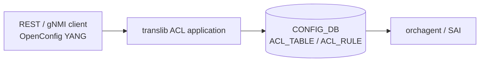

# OpenConfig Model Support for SONiC ACL Feature

# High Level Design Document
#### Rev 0.1

# Table of Contents
  * [List of Tables](#list-of-tables)
  * [Revision](#revision)
  * [About This Manual](#about-this-manual)
  * [Related Documents](#related-documents)
  * [Scope](#scope)
  * [Definition/Abbreviation](#definitionabbreviation)
  * [1 Feature Overview](#1-feature-overview)
    * [1.1 Requirements](#11-requirements)
      * [1.1.1 Functional Requirements](#111-functional-requirements)
      * [1.1.2 Configuration and Management Requirements](#112-configuration-and-management-requirements)
      * [1.1.3 Scalability Requirements](#113-scalability-requirements)
    * [1.2 Design Overview](#12-design-overview)
      * [1.2.1 Basic Approach](#121-basic-approach)
      * [1.2.2 Container](#122-container)
  * [2 Functionality](#2-functionality)
      * [2.1 Target Deployment Use Cases](#21-target-deployment-use-cases)
  * [3 Design](#3-design)
    * [3.1 Overview](#31-overview)
      * [3.1.1 SONiC Feature YANG and CONFIG_DB](#311-sonic-feature-yang-and-config_db)
      * [3.1.2 OpenConfig Modules](#312-openconfig-modules)
      * [3.1.3 UMF Translation (REST/gNMI to CONFIG_DB)](#313-umf-translation-restgnmi-to-config_db)
      * [3.1.4 Southbound Programming](#314-southbound-programming)
      * [3.1.5 Mapping Table and Unit Tests](#315-mapping-table-and-unit-tests)
    * [3.2 DB Changes](#32-db-changes)
      * [3.2.1 CONFIG DB](#321-config-db)
      * [3.2.2 APP DB](#322-app-db)
      * [3.2.3 STATE DB](#323-state-db)
      * [3.2.4 ASIC DB](#324-asic-db)
      * [3.2.5 COUNTER DB](#325-counter-db)
  * [4 OpenConfig to SONiC Mapping Table](#4-openconfig-to-sonic-mapping-table)
    * [4.1 ACL Set](#41-acl-set)
    * [4.2 ACL Entry](#42-acl-entry)
    * [4.3 IPv4 Match](#43-ipv4-match)
    * [4.4 IPv6 Match](#44-ipv6-match)
    * [4.5 Transport Match](#45-transport-match)
    * [4.6 Actions](#46-actions)
    * [4.7 Interface Bindings](#47-interface-bindings)
  * [5 User Interface](#5-user-interface)
    * [5.1 Data Models](#51-data-models)
    * [5.2 REST API Support](#52-rest-api-support)
      * [5.2.1 GET](#521-get)
      * [5.2.2 PUT](#522-put)
      * [5.2.3 POST](#523-post)
      * [5.2.4 PATCH](#524-patch)
      * [5.2.5 DELETE](#525-delete)
    * [5.3 gNMI Support](#53-gnmi-support)
      * [5.3.1 GET](#531-get)
      * [5.3.2 SET](#532-set)
      * [5.3.3 DELETE](#533-delete)
      * [5.3.4 SUBSCRIBE](#534-subscribe)
  * [6 Error Handling](#6-error-handling)
  * [7 Unit Test Cases](#7-unit-test-cases)
    * [7.1 Functional Test Cases](#71-functional-test-cases)
    * [7.2 Negative Test Cases](#72-negative-test-cases)

# List of Tables
[Table 1: Abbreviations](#table-1-abbreviations)

[Table 2: Translation Flow Layers](#table-2-translation-flow-layers)

OpenConfig to SONiC mapping tables: [Section 4](#4-openconfig-to-sonic-mapping-table)

# Revision
| Rev | Date | Author | Change Description |
|:---:|:-----------:|:---------------------:|-----------------------------------|
| 0.1 | 09/17/2026 | Anukul Verma | Initial version. Documents the existing UMF OpenConfig mapping (implementation already present; no prior HLD). |

# About this Manual
This document provides general information about the OpenConfig configuration and management of ACLs in SONiC corresponding to the openconfig-acl.yang module. It describes how OpenConfig models are translated to SONiC CONFIG_DB `ACL_TABLE` and `ACL_RULE` entries. Current HLD and implementation scope is **configuration only**; corresponding OpenConfig `state` nodes are replicas of `config`, except `matched-packets` and `matched-octets`, which are always returned as `0`. The OpenConfig-to-SONiC mapping documented here has been implemented in UMF for some time; this HLD is added now as the missing design reference.

ACLs are configured under:
/acl

# Related Documents
| Document | Description |
|----------|-------------|
| Management Framework.md | UMF architecture (REST, gNMI, translib, transformers) |

# Scope
- This document describes the high level design of OpenConfig **ACL** configuration in SONiC.
- **In scope:** REST and gNMI — Get, Set (POST/PUT/PATCH), Delete, and Subscribe on supported ACL YANG paths. Scope is **IPv4 and IPv6 ACL sets** (`ACL_IPV4`, `ACL_IPV6`), ACL entries, and ingress/egress interface bindings. OpenConfig `state` nodes for mapped config leaves are replicas of `config`. Entry `matched-packets` / `matched-octets` are returned as `0`.
- **Out of scope:** SONiC KLISH CLI and native SONiC CLI for ACLs; `ACL_L2` and `ACL_MIXED`; rule `description`; `log-action`; IPv4/IPv6 `hop-limit`, `identity`, and fragment match; MAC/`l2` match; `input-interface`; global `counter-capability`; live hardware ACL counters.
- OpenConfig xpath root:
  `/acl`
- Supported attributes in OpenConfig YANG tree (reflecting current UMF implementation):

```
module: openconfig-acl
+--rw acl
   +--rw acl-sets
   |  +--rw acl-set* [name type]
   |     +--rw name      -> ../config/name
   |     +--rw type      -> ../config/type
   |     +--rw config
   |     |  +--rw name?          string
   |     |  +--rw type?          identityref (ACL_IPV4 | ACL_IPV6)
   |     |  +--rw description?   string
   |     +--ro state
   |     |  +--ro name?          string
   |     |  +--ro type?          identityref (ACL_IPV4 | ACL_IPV6)
   |     |  +--ro description?   string
   |     +--rw acl-entries
   |        +--rw acl-entry* [sequence-id]
   |           +--rw sequence-id    -> ../config/sequence-id
   |           +--rw config
   |           |  +--rw sequence-id?   uint32
   |           +--ro state
   |           |  +--ro sequence-id?      uint32
   |           |  +--ro matched-packets?  oc-yang:counter64
   |           |  +--ro matched-octets?   oc-yang:counter64
   |           +--rw ipv4
   |           |  +--rw config
   |           |  |  +--rw source-address?        oc-inet:ipv4-prefix
   |           |  |  +--rw destination-address?   oc-inet:ipv4-prefix
   |           |  |  +--rw dscp?                  oc-inet:dscp
   |           |  |  +--rw protocol?              union (identityref | uint8)
   |           |  +--ro state
   |           |     +--ro source-address?        oc-inet:ipv4-prefix
   |           |     +--ro destination-address?   oc-inet:ipv4-prefix
   |           |     +--ro dscp?                  oc-inet:dscp
   |           |     +--ro protocol?              union (identityref | uint8)
   |           +--rw ipv6
   |           |  +--rw config
   |           |  |  +--rw source-address?        oc-inet:ipv6-prefix
   |           |  |  +--rw destination-address?   oc-inet:ipv6-prefix
   |           |  |  +--rw dscp?                  oc-inet:dscp
   |           |  |  +--rw protocol?              union (identityref | uint8)
   |           |  +--ro state
   |           |     +--ro source-address?        oc-inet:ipv6-prefix
   |           |     +--ro destination-address?   oc-inet:ipv6-prefix
   |           |     +--ro dscp?                  oc-inet:dscp
   |           |     +--ro protocol?              union (identityref | uint8)
   |           +--rw transport
   |           |  +--rw config
   |           |  |  +--rw source-port?           union (uint16 | string range)
   |           |  |  +--rw destination-port?      union (uint16 | string range)
   |           |  |  +--rw detail-mode?           enumeration (EXPLICIT)
   |           |  |  +--rw explicit-tcp-flags*    identityref
   |           |  +--ro state
   |           |     +--ro source-port?           union (uint16 | string range)
   |           |     +--ro destination-port?      union (uint16 | string range)
   |           |     +--ro detail-mode?           enumeration (EXPLICIT)
   |           |     +--ro explicit-tcp-flags*    identityref
   |           +--rw actions
   |              +--rw config
   |              |  +--rw forwarding-action    identityref (ACCEPT | DROP | REJECT)
   |              +--ro state
   |                 +--ro forwarding-action    identityref (ACCEPT | DROP)
   +--rw interfaces
      +--rw interface* [id]
         +--rw id        -> ../config/id
         +--rw config
         |  +--rw id?   oc-if:interface-id
         +--ro state
         |  +--ro id?   oc-if:interface-id
         +--rw interface-ref
         |  +--rw config
         |     +--rw interface?   -> /oc-if:interfaces/interface/name
         +--rw ingress-acl-sets
         |  +--rw ingress-acl-set* [set-name type]
         |     +--rw set-name    -> ../config/set-name
         |     +--rw type        -> ../config/type
         |     +--rw config
         |     |  +--rw set-name?   string
         |     |  +--rw type?       identityref
         |     +--ro state
         |     |  +--ro set-name?   string
         |     |  +--ro type?       identityref
         |     +--ro acl-entries
         |        +--ro acl-entry* [sequence-id]
         |           +--ro sequence-id    -> ../state/sequence-id
         |           +--ro state
         |              +--ro sequence-id?      uint32
         |              +--ro matched-packets?  oc-yang:counter64
         |              +--ro matched-octets?   oc-yang:counter64
         +--rw egress-acl-sets
            +--rw egress-acl-set* [set-name type]
               +--rw set-name    -> ../config/set-name
               +--rw type        -> ../config/type
               +--rw config
               |  +--rw set-name?   string
               |  +--rw type?       identityref
               +--ro state
               |  +--ro set-name?   string
               |  +--ro type?       identityref
               +--ro acl-entries
                  +--ro acl-entry* [sequence-id]
                     +--ro sequence-id    -> ../state/sequence-id
                     +--ro state
                        +--ro sequence-id?      uint32
                        +--ro matched-packets?  oc-yang:counter64
                        +--ro matched-octets?   oc-yang:counter64
```

# Definition/Abbreviation
### Table 1: Abbreviations

| **Term** | **Definition** |
|--------------------------|-------------------------------------|
| YANG | Yet Another Next Generation: modular language representing data structures in an XML tree format |
| REST | REpresentative State Transfer |
| gNMI | gRPC Network Management Interface |
| UMF | Unified Management Framework (`sonic-mgmt-common`) |
| ACL | Access Control List |
| SAI | Switch Abstraction Interface |

# 1 Feature Overview
## 1.1 Requirements
### 1.1.1 Functional Requirements
1. Expose SONiC ACL configuration through standard OpenConfig YANG models under `/acl`.
2. Support IPv4 and IPv6 ACL sets, entries (match and forwarding action), and ingress/egress interface bindings. GET `state` for mapped config leaves returns the same values as `config`.
3. Translate OpenConfig sequence-id and forwarding-action to SONiC rule priority and packet action.
4. Provide REST Get, Post, Put, Patch, and Delete, and gNMI Get, Set, Delete, and Subscribe on mapped ACL paths.

### 1.1.2 Configuration and Management Requirements
ACLs are configured and queried only through REST and gNMI via the Unified Management Framework (UMF). KLISH and native SONiC CLI are out of scope for this document. Unsupported operations return an error through existing UMF error handling; no new management interfaces are introduced.

### 1.1.3 Scalability Requirements
ACL scale follows the existing CONFIG_DB `ACL_TABLE` and `ACL_RULE` schemas and platform SAI ACL limits.

## 1.2 Design Overview
### 1.2.1 Basic Approach
SONiC already programs ACLs from CONFIG_DB into orchagent/SAI. The northbound OpenConfig mapping is already implemented in UMF; this HLD documents that mapping. REST/gNMI clients configure OpenConfig YANG; the UMF translib ACL application translates requests into existing CONFIG_DB `ACL_TABLE` and `ACL_RULE` rows.

### 1.2.2 Container
Implementation is in **sonic-mgmt-common** (REST server in the Management Framework container and gNMI server in the gnmi container: translib ACL application, annotations). There is no FRR programming path for ACLs.

# 2 Functionality
## 2.1 Target Deployment Use Cases
All northbound clients configure and query ACLs using OpenConfig YANG over REST or gNMI.

1. **REST clients** — GET, POST, PUT, PATCH, and DELETE on ACL RESTCONF paths. Orchestration systems are one example.
2. **gNMI clients** — Capabilities, Get, Set (update/delete), and Subscribe (stream) on ACL gNMI paths. Controllers and telemetry consumers are examples.

# 3 Design
## 3.1 Overview
This HLD follows Management Framework.md. The design covers: SONiC feature YANG, OpenConfig modules, UMF translation, CONFIG_DB, mapping tables (Section 4), and unit tests (Section 7).

### 3.1.1 SONiC Feature YANG and CONFIG_DB
SONiC defines the southbound schema in `sonic-acl.yang`:

| Item | Detail |
|------|--------|
| CONFIG_DB tables | `ACL_TABLE`, `ACL_RULE` |
| `ACL_TABLE` key | `{name}_{openconfig-type}` (spaces and hyphens in `name` become `_`) |
| `ACL_TABLE` leaves | `type` (`L3` / `L3V6`), `policy_desc`, `stage` (`INGRESS` / `EGRESS`), `ports` |
| `ACL_RULE` key | `{acl-table-key}` + `RULE_{sequence-id}` (plus implicit `DEFAULT_RULE`) |
| `ACL_RULE` leaves | `PRIORITY`, `PACKET_ACTION`, `IP_TYPE`, `IP_PROTOCOL`, `SRC_IP` / `DST_IP` or `SRC_IPV6` / `DST_IPV6`, `DSCP`, `L4_SRC_PORT` / `L4_DST_PORT` or range fields, `TCP_FLAGS` |
| Out of scope | `MIRROR` / `MIRRORV6` table types; `REDIRECT` packet action; L2 `ETHER_TYPE` |

OpenConfig clients never write CONFIG_DB directly; UMF populates these tables from OpenConfig payloads. CONFIG_DB examples are in [§3.2.1](#321-config-db).

### 3.1.2 OpenConfig Modules
| Module | Source | Role for ACL |
|--------|--------|----------------|
| [openconfig-acl.yang](https://github.com/openconfig/public/blob/master/release/models/acl/openconfig-acl.yang) | openconfig/public | Base ACL container (`acl`) |
| [openconfig-packet-match.yang](https://github.com/openconfig/public/blob/master/release/models/acl/openconfig-packet-match.yang) | openconfig/public | IPv4, IPv6, and transport match groupings used by `acl-entry` |
| openconfig-acl-annot.yang | sonic-mgmt-common | XPath to CONFIG_DB table and field bindings |

### 3.1.3 UMF Translation (REST/gNMI to CONFIG_DB)
OpenConfig SET/GET/SUBSCRIBE requests for `/acl` are handled by translib and the **ACL application** registered at that xpath. The application maps ACL sets, entries, and interface bindings to CONFIG_DB `ACL_TABLE` and `ACL_RULE`.


*Figure: Management Framework architecture ([Management Framework.md](https://github.com/sonic-net/SONiC/blob/master/doc/mgmt/Management%20Framework.md)).*

#### Table 2: Translation Flow Layers

| Layer | Artifact | Role |
|-------|----------|------|
| **1. SONiC feature YANG** | `sonic-acl.yang` | CONFIG_DB `ACL_TABLE` / `ACL_RULE` schema |
| **2. OpenConfig modules** | `openconfig-acl.yang` | Northbound client model |
| **3. UMF annotations** | `openconfig-acl-annot.yang` | XPath → table and field bindings |
| **4. UMF translib application** | ACL application | YangToDb / DbToYang / Subscribe for ACL sets, entries, and bindings |
| **5. CONFIG_DB** | `ACL_TABLE`, `ACL_RULE` | Runtime configuration store |
| **6. ACL orchagent** | orchagent / SAI | Programs hardware ACLs from CONFIG_DB |



### 3.1.4 Southbound Programming
CONFIG_DB `ACL_TABLE` and `ACL_RULE` changes are consumed by orchagent and programmed through SAI. There is no FRR / frrcfgd path for ACLs.

### 3.1.5 Mapping Table and Unit Tests
- **OpenConfig → SONiC mapping:** [Section 4](#4-openconfig-to-sonic-mapping-table).
- **REST/gNMI examples:** [Section 5](#5-user-interface).
- **Unit tests:** [Section 7](#7-unit-test-cases).

## 3.2 DB Changes
OpenConfig ACL uses the existing CONFIG_DB `ACL_TABLE` and `ACL_RULE` tables. No new tables are added.

### 3.2.1 CONFIG DB
Example (IPv4 ACL bound ingress on Ethernet4):
```
ACL_TABLE|MyACL5_ACL_IPV4
  type:        L3
  policy_desc: Description for MyACL5
  stage:       INGRESS
  ports@:      Ethernet4

ACL_RULE|MyACL5_ACL_IPV4|RULE_8
  PRIORITY:      65528
  PACKET_ACTION: FORWARD
  IP_TYPE:       IPV4ANY
  IP_PROTOCOL:   6
  SRC_IP:        192.0.2.0/24
  DST_IP:        198.51.100.0/24
  L4_SRC_PORT:   101
  L4_DST_PORT:   100
  TCP_FLAGS:     0x11/0x11

ACL_RULE|MyACL5_ACL_IPV4|DEFAULT_RULE
  PRIORITY:      1
  PACKET_ACTION: DROP
  IP_TYPE:       ANY
```

`PRIORITY` is `65536 - sequence-id` (sequence-id `8` → `65528`). `DEFAULT_RULE` is created automatically on ACL create and is not exposed on OpenConfig GET.

### 3.2.2 APP DB
No APP DB tables are used for ACL OpenConfig configuration.

### 3.2.3 STATE DB
No STATE DB tables are used for ACL OpenConfig configuration.

### 3.2.4 ASIC DB
No ASIC DB tables are used for ACL OpenConfig configuration.

### 3.2.5 COUNTER DB
No COUNTER DB tables are used. OpenConfig `matched-packets` and `matched-octets` are always returned as `0`.

# 4 OpenConfig to SONiC Mapping Table
**CONFIG_DB tables:** `ACL_TABLE`, `ACL_RULE`  
**Key patterns:** `ACL_TABLE` — `{name}_{ACL_IPV4|ACL_IPV6}`; `ACL_RULE` — `{acl-table-key}|RULE_{sequence-id}`

**Conventions:**
- Each subsection maps one OpenConfig container or list. Paths are shown as an indented tree; placeholders: `<name>`, `<type>`, `<seq>`, `<ifname>`.
- GET `state` for mapped config leaves is a replica of `config` from the same CONFIG_DB tables. APPL_DB is not used. `matched-packets` / `matched-octets` are always `0`.

## 4.1 ACL Set
**OpenConfig path:**
```
/acl/acl-sets
     acl-set[name=<name>][type=<type>]
          config
          state
```
| OpenConfig leaf | DB Name | Table:Field | Notes |
|-----------------|---------|-------------|-------|
| name (list key) | CONFIG_DB | ACL_TABLE:key `{name}_{type}` | Spaces and hyphens in `name` become `_` |
| type (list key) | CONFIG_DB | ACL_TABLE:type | `ACL_IPV4`→`L3`; `ACL_IPV6`→`L3V6`; encoded in Redis key as `ACL_IPV4` / `ACL_IPV6` |
| name | CONFIG_DB | ACL_TABLE:key | Same as list key |
| type | CONFIG_DB | ACL_TABLE:type | Same as list key |
| description | CONFIG_DB | ACL_TABLE:policy_desc | Length 1..255 |

`ACL_L2` and `ACL_MIXED` are not supported.

## 4.2 ACL Entry
**OpenConfig path:**
```
/acl/acl-sets/acl-set[name=<name>][type=<type>]/acl-entries
     acl-entry[sequence-id=<seq>]
          config
          state
```
| OpenConfig leaf | DB Name | Table:Field | Notes |
|-----------------|---------|-------------|-------|
| sequence-id (list key) | CONFIG_DB | ACL_RULE:key `RULE_{seq}` | Redis key second component |
| sequence-id | CONFIG_DB | ACL_RULE:PRIORITY | `PRIORITY = 65536 - sequence-id`; SONiC range `1..65535` |
| matched-packets | — | — | GET always `0`; not from COUNTER DB |
| matched-octets | — | — | GET always `0`; not from COUNTER DB |

On ACL create, UMF also writes a hidden `DEFAULT_RULE` with `PRIORITY=1`, `PACKET_ACTION=DROP`, `IP_TYPE=ANY`. That rule is omitted from OpenConfig GET. Rule `description` is accepted on SET but is not stored and is omitted on GET.

DELETE of `/acl-entries` removes user rules and keeps the ACL set. PUT of an `acl-set` replaces the full rule list.

## 4.3 IPv4 Match
**OpenConfig path:**
```
.../acl-entry[sequence-id=<seq>]/ipv4
     config
     state
```
| OpenConfig leaf | DB Name | Table:Field | Notes |
|-----------------|---------|-------------|-------|
| source-address | CONFIG_DB | ACL_RULE:SRC_IP | IPv4 prefix |
| destination-address | CONFIG_DB | ACL_RULE:DST_IP | IPv4 prefix |
| dscp | CONFIG_DB | ACL_RULE:DSCP | 0..63 |
| protocol | CONFIG_DB | ACL_RULE:IP_PROTOCOL | Identity (`IP_TCP`→`6`, `IP_UDP`→`17`, `IP_ICMP`→`1`, `IP_IGMP`→`2`, `IP_RSVP`→`46`, `IP_GRE`→`47`, `IP_AUTH`→`51`, `IP_PIM`→`103`, `IP_L2TP`→`115`) or numeric uint8 in that set |

IPv4 rules also set `IP_TYPE=IPV4ANY`. DELETE of `ipv4/config` or `protocol` is not supported.

## 4.4 IPv6 Match
**OpenConfig path:**
```
.../acl-entry[sequence-id=<seq>]/ipv6
     config
     state
```
| OpenConfig leaf | DB Name | Table:Field | Notes |
|-----------------|---------|-------------|-------|
| source-address | CONFIG_DB | ACL_RULE:SRC_IPV6 | IPv6 prefix |
| destination-address | CONFIG_DB | ACL_RULE:DST_IPV6 | IPv6 prefix |
| dscp | CONFIG_DB | ACL_RULE:DSCP | 0..63 |
| protocol | CONFIG_DB | ACL_RULE:IP_PROTOCOL | Same identity/numeric mapping as IPv4 |

IPv6 rules also set `IP_TYPE=IPV6ANY`. DELETE of `ipv6/config` is not supported.

## 4.5 Transport Match
**OpenConfig path:**
```
.../acl-entry[sequence-id=<seq>]/transport
     config
     state
```
| OpenConfig leaf | DB Name | Table:Field | Notes |
|-----------------|---------|-------------|-------|
| source-port | CONFIG_DB | ACL_RULE:L4_SRC_PORT or L4_SRC_PORT_RANGE | Single port → `L4_SRC_PORT`; OpenConfig range `low..high` → `L4_SRC_PORT_RANGE` as `low-high`; GET of a range uses `-` |
| destination-port | CONFIG_DB | ACL_RULE:L4_DST_PORT or L4_DST_PORT_RANGE | Same range encoding as source-port |
| detail-mode | — | — | Set to `EXPLICIT` when `explicit-tcp-flags` is present |
| explicit-tcp-flags | CONFIG_DB | ACL_RULE:TCP_FLAGS | Bitmask `0xNN/0xNN` (`FIN=0x01`, `SYN=0x02`, `RST=0x04`, `PSH=0x08`, `ACK=0x10`, `URG=0x20`, `ECE=0x40`, `CWR=0x80`) |

DELETE of the `transport` container and of `explicit-tcp-flags` is supported.

## 4.6 Actions
**OpenConfig path:**
```
.../acl-entry[sequence-id=<seq>]/actions
     config
     state
```
| OpenConfig leaf | DB Name | Table:Field | Notes |
|-----------------|---------|-------------|-------|
| forwarding-action | CONFIG_DB | ACL_RULE:PACKET_ACTION | `ACCEPT`→`FORWARD`; `DROP` and `REJECT`→`DROP`; GET of a `REJECT` rule returns `DROP` |

DELETE of `forwarding-action` is not supported. `log-action` is not mapped.

## 4.7 Interface Bindings
**OpenConfig path:**
```
/acl/interfaces
     interface[id=<ifname>]
          config
          state
          interface-ref/config
          ingress-acl-sets/ingress-acl-set[set-name=<name>][type=<type>]
          egress-acl-sets/egress-acl-set[set-name=<name>][type=<type>]
```
| OpenConfig leaf | DB Name | Table:Field | Notes |
|-----------------|---------|-------------|-------|
| id | CONFIG_DB | ACL_TABLE:ports | Binding port; `interface-ref/config/interface` is used when present, otherwise `id` |
| set-name | CONFIG_DB | ACL_TABLE:key | Must match an existing ACL set |
| type | CONFIG_DB | ACL_TABLE:type | Same `ACL_IPV4` / `ACL_IPV6` mapping as §4.1 |
| stage | CONFIG_DB | ACL_TABLE:stage | Ingress binding → `INGRESS`; egress binding → `EGRESS`. An ACL is bound as ingress **or** egress, not both |
| acl-entry sequence-id (binding) | CONFIG_DB | ACL_RULE | Read-only list of bound ACL entries; counters always `0` |

Multiple interfaces may bind the same ACL (ports leaf-list). DELETE of `/acl/interfaces` removes all bindings (`stage` and `ports` cleared). Invalid interface names are rejected.

# 5 User Interface
## 5.1 Data Models
| Model | Source | Purpose |
|-------|--------|---------|
| sonic-acl.yang | sonic-yang-models | SONiC CONFIG_DB schema for ACLs |
| [openconfig-acl.yang](https://github.com/openconfig/public/blob/master/release/models/acl/openconfig-acl.yang) | openconfig/public | Base ACL container |
| [openconfig-packet-match.yang](https://github.com/openconfig/public/blob/master/release/models/acl/openconfig-packet-match.yang) | openconfig/public | IPv4/IPv6/transport match groupings |
| openconfig-acl-annot.yang | sonic-mgmt-common | XPath to table and field bindings |

## 5.2 REST API Support
Examples below use paths and payloads validated by unit tests (documentation prefixes substituted). RESTCONF URL encoding uses `=` separators; gNMI uses bracket notation (see §5.3).

### 5.2.1 GET
Supported at ACL-set, entry, and interface-binding levels.

```
curl -X GET -k "https://<device>/restconf/data/openconfig-acl:acl/acl-sets/acl-set=MyACL5,ACL_IPV4" -H "accept: application/yang-data+json"
```

```
curl -X GET -k "https://<device>/restconf/data/openconfig-acl:acl/acl-sets/acl-set=MyACL5,ACL_IPV4/acl-entries/acl-entry=8" -H "accept: application/yang-data+json"
```

```
curl -X GET -k "https://<device>/restconf/data/openconfig-acl:acl/interfaces/interface=Ethernet4" -H "accept: application/yang-data+json"
```

### 5.2.2 PUT
PUT replaces an ACL set, including its rule list.

```
curl -X PUT -k "https://<device>/restconf/data/openconfig-acl:acl/acl-sets/acl-set=MyACL3,ACL_IPV4" \
  -H "Content-Type: application/yang-data+json" \
  -d '{
    "openconfig-acl:acl-set": [{
      "name": "MyACL3",
      "type": "ACL_IPV4",
      "config": {"name": "MyACL3", "type": "ACL_IPV4", "description": "Description for MyACL3"},
      "acl-entries": {
        "acl-entry": [{
          "sequence-id": 8,
          "config": {"sequence-id": 8},
          "ipv4": {"config": {"source-address": "192.0.2.1/32", "destination-address": "198.51.100.1/32", "protocol": "IP_TCP"}},
          "transport": {"config": {"source-port": "801..811", "destination-port": "901..921"}},
          "actions": {"config": {"forwarding-action": "REJECT"}}
        }]
      }
    }]
  }'
```

GET of that replaced rule returns `forwarding-action` `DROP` (`REJECT` stored as `DROP`) and port ranges with `-` (`801-811`).

### 5.2.3 POST
POST creates an ACL set, a rule, or an interface binding.

```
curl -X POST -k "https://<device>/restconf/data/openconfig-acl:acl/acl-sets/acl-set=MyACL5,ACL_IPV4" \
  -H "Content-Type: application/yang-data+json" \
  -d '{"openconfig-acl:config": {"name": "MyACL5", "type": "ACL_IPV4", "description": "Description for MyACL5"}}'
```

```
curl -X POST -k "https://<device>/restconf/data/openconfig-acl:acl/acl-sets/acl-set=MyACL5,ACL_IPV4/acl-entries/acl-entry=8" \
  -H "Content-Type: application/yang-data+json" \
  -d '{
    "openconfig-acl:sequence-id": 8,
    "openconfig-acl:config": {"sequence-id": 8},
    "openconfig-acl:ipv4": {"config": {"source-address": "192.0.2.0/24", "destination-address": "198.51.100.0/24", "protocol": "IP_TCP"}},
    "openconfig-acl:transport": {"config": {"source-port": 101, "destination-port": 100, "detail-mode": "EXPLICIT", "explicit-tcp-flags": ["TCP_FIN", "TCP_ACK"]}},
    "openconfig-acl:actions": {"config": {"forwarding-action": "ACCEPT"}}
  }'
```

```
curl -X POST -k "https://<device>/restconf/data/openconfig-acl:acl/interfaces/interface=Ethernet4/ingress-acl-sets/ingress-acl-set=MyACL5,ACL_IPV4" \
  -H "Content-Type: application/yang-data+json" \
  -d '{"openconfig-acl:config": {"set-name": "MyACL5", "type": "ACL_IPV4"}}'
```

IPv6 example:

```
curl -X POST -k "https://<device>/restconf/data/openconfig-acl:acl/acl-sets/acl-set=MyACL6,ACL_IPV6/acl-entries/acl-entry=6" \
  -H "Content-Type: application/yang-data+json" \
  -d '{
    "openconfig-acl:sequence-id": 6,
    "openconfig-acl:config": {"sequence-id": 6},
    "openconfig-acl:ipv6": {"config": {"source-address": "2001:db8::/64", "destination-address": "2001:db8:1::/64", "protocol": "IP_TCP", "dscp": 11}},
    "openconfig-acl:transport": {"config": {"source-port": 101, "destination-port": 100, "detail-mode": "EXPLICIT", "explicit-tcp-flags": ["TCP_FIN", "TCP_ACK"]}},
    "openconfig-acl:actions": {"config": {"forwarding-action": "ACCEPT"}}
  }'
```

### 5.2.4 PATCH
Supported on ACL description, rule match fields, and bulk ACL-set create.

```
curl -X PATCH -k "https://<device>/restconf/data/openconfig-acl:acl/acl-sets/acl-set=MyACL5,ACL_IPV4/config/description" \
  -H "Content-Type: application/yang-data+json" \
  -d '{"openconfig-acl:description": "Updated ACL description"}'
```

```
curl -X PATCH -k "https://<device>/restconf/data/openconfig-acl:acl/acl-sets/acl-set=MyACL5,ACL_IPV4/acl-entries/acl-entry=8" \
  -H "Content-Type: application/yang-data+json" \
  -d '{
    "openconfig-acl:acl-entry": [{
      "sequence-id": 8,
      "config": {"sequence-id": 8},
      "ipv4": {"config": {"source-address": "192.0.2.8/24", "destination-address": "198.51.100.8/24", "protocol": "IP_L2TP"}},
      "transport": {"config": {"source-port": 101, "destination-port": 100, "detail-mode": "EXPLICIT", "explicit-tcp-flags": ["TCP_FIN", "TCP_ACK", "TCP_RST", "TCP_ECE"]}},
      "actions": {"config": {"forwarding-action": "ACCEPT"}}
    }]
  }'
```

### 5.2.5 DELETE

```
curl -X DELETE -k "https://<device>/restconf/data/openconfig-acl:acl/acl-sets/acl-set=MyACL5,ACL_IPV4/config/description" -H "accept: */*"
```

```
curl -X DELETE -k "https://<device>/restconf/data/openconfig-acl:acl/acl-sets/acl-set=MyACL5,ACL_IPV4/acl-entries/acl-entry=8/transport/config/explicit-tcp-flags" -H "accept: */*"
```

```
curl -X DELETE -k "https://<device>/restconf/data/openconfig-acl:acl/interfaces/interface=Ethernet4/ingress-acl-sets/ingress-acl-set=MyACL5,ACL_IPV4" -H "accept: */*"
```

```
curl -X DELETE -k "https://<device>/restconf/data/openconfig-acl:acl/acl-sets/acl-set=MyACL5,ACL_IPV4" -H "accept: */*"
```

## 5.3 gNMI Support
Use `--target OC-YANG`.

### 5.3.1 GET

```
gnmic -a <device>:<port> --insecure --target OC-YANG get \
  --path "/openconfig-acl:acl/acl-sets/acl-set[name=MyACL5][type=ACL_IPV4]"
```

### 5.3.2 SET

```
gnmic -a <device>:<port> --insecure --target OC-YANG set \
  --update-path "/openconfig-acl:acl/acl-sets/acl-set[name=MyACL5][type=ACL_IPV4]" \
  --update-value '{
    "config": {
      "name": "MyACL5",
      "type": "ACL_IPV4",
      "description": "Description for MyACL5"
    }
  }'
```

### 5.3.3 DELETE

```
gnmic -a <device>:<port> --insecure --target OC-YANG set \
  --delete "/openconfig-acl:acl/acl-sets/acl-set[name=MyACL5][type=ACL_IPV4]/acl-entries/acl-entry[sequence-id=8]"
```

### 5.3.4 SUBSCRIBE
Subscribe on-change is supported on ACL sets and entries. Interface bindings Subscribe as SAMPLE (on-change is not supported on `/acl/interfaces`).

```
gnmic -a <device>:<port> --insecure --target OC-YANG subscribe \
  --path "/openconfig-acl:acl/acl-sets/acl-set[name=*][type=*]" \
  --mode stream
```

```
gnmic -a <device>:<port> --insecure --target OC-YANG subscribe \
  --path "/openconfig-acl:acl/acl-sets/acl-set[name=*][type=*]/acl-entries/acl-entry[sequence-id=*]" \
  --mode stream
```

# 6 Error Handling
- GET of a missing ACL set or missing ACL entry is rejected (not found).
- POST of a duplicate ACL set or duplicate `sequence-id` is rejected.
- Binding to a nonexistent interface is rejected.
- `ACL_L2` / `ACL_MIXED` types are not supported.
- DELETE of `ipv4/config`, `ipv6/config`, `protocol`, or `forwarding-action` is rejected.
- Invalid `PRIORITY` values planted in CONFIG_DB (non-numeric or duplicate) are skipped on GET rather than rendered as ACL entries.
- `matched-packets` / `matched-octets` are always `0`; they are not live counters.

# 7 Unit Test Cases
Section 7 summarizes generic functional and negative scenarios for REST and gNMI paths under `/acl`.

## 7.1 Functional Test Cases

**ACL set CRUD**

- POST IPv4 ACL with description; GET `state` matches config; PATCH description; DELETE description; DELETE ACL set.

**ACL entries**

- POST rule with IPv4 match, transport ports, `explicit-tcp-flags`, and `ACCEPT`; GET rule; PATCH source/destination/protocol/flags; DELETE `explicit-tcp-flags`, `dscp`, and `transport`; DELETE rule.

**Replace**

- PUT ACL set replacing multiple rules with one rule; `REJECT` GET as `DROP`; port range `..` stored and GET as `-`.

**IPv6**

- POST IPv6 ACL and rule; ingress bind; GET from `acl-set` and `interfaces` trees.

**Bindings**

- POST ingress and egress bindings; GET at `acl-sets`, `interfaces`, and `interface` levels; add a second port to the same ACL; DELETE one binding; DELETE `/acl/interfaces`.

**Subscribe**

- gNMI Subscribe on-change on `acl-set[name=*][type=*]` and `acl-entry[sequence-id=*]`; bindings Subscribe SAMPLE only.

## 7.2 Negative Test Cases

**Validation**

1. GET missing ACL set or missing entry rejected.
2. POST duplicate ACL set rejected.
3. POST duplicate `sequence-id` rejected.
4. POST binding with invalid interface rejected.
5. DELETE of `protocol`, `ipv4/config`, `ipv6/config`, or `forwarding-action` rejected.
6. `ACL_L2` not supported.
