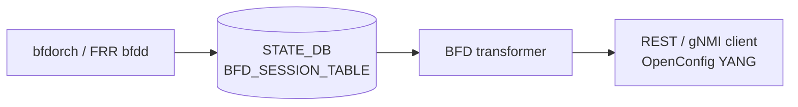

# OpenConfig Model Support for SONiC BFD Feature

# High Level Design Document
#### Rev 0.1

# Table of Contents
  * [List of Tables](#list-of-tables)
  * [Revision](#revision)
  * [About This Manual](#about-this-manual)
  * [Related Documents](#related-documents)
  * [Scope](#scope)
  * [Definition/Abbreviation](#definitionabbreviation)
  * [1 Feature Overview](#1-feature-overview)
    * [1.1 Requirements](#11-requirements)
      * [1.1.1 Functional Requirements](#111-functional-requirements)
      * [1.1.2 Configuration and Management Requirements](#112-configuration-and-management-requirements)
      * [1.1.3 Scalability Requirements](#113-scalability-requirements)
    * [1.2 Design Overview](#12-design-overview)
      * [1.2.1 Basic Approach](#121-basic-approach)
      * [1.2.2 Container](#122-container)
  * [2 Functionality](#2-functionality)
      * [2.1 Target Deployment Use Cases](#21-target-deployment-use-cases)
  * [3 Design](#3-design)
    * [3.1 Overview](#31-overview)
      * [3.1.1 SONiC Feature YANG and CONFIG_DB](#311-sonic-feature-yang-and-config_db)
      * [3.1.2 OpenConfig Modules](#312-openconfig-modules)
      * [3.1.3 UMF Translation (REST/gNMI to CONFIG_DB)](#313-umf-translation-restgnmi-to-config_db)
      * [3.1.4 Southbound Programming](#314-southbound-programming)
      * [3.1.5 Mapping Table and Unit Tests](#315-mapping-table-and-unit-tests)
    * [3.2 DB Changes](#32-db-changes)
      * [3.2.1 CONFIG DB](#321-config-db)
      * [3.2.2 APP DB](#322-app-db)
      * [3.2.3 STATE DB](#323-state-db)
      * [3.2.4 ASIC DB](#324-asic-db)
      * [3.2.5 COUNTER DB](#325-counter-db)
  * [4 OpenConfig to SONiC Mapping Table](#4-openconfig-to-sonic-mapping-table)
    * [4.1 BFD Interface](#41-bfd-interface)
    * [4.2 Interface Reference](#42-interface-reference)
    * [4.3 Peer](#43-peer)
    * [4.4 Peer State](#44-peer-state)
  * [5 User Interface](#5-user-interface)
    * [5.1 Data Models](#51-data-models)
    * [5.2 REST API Support](#52-rest-api-support)
      * [5.2.1 GET](#521-get)
      * [5.2.2 PUT](#522-put)
      * [5.2.3 POST](#523-post)
      * [5.2.4 PATCH](#524-patch)
      * [5.2.5 DELETE](#525-delete)
    * [5.3 gNMI Support](#53-gnmi-support)
      * [5.3.1 GET](#531-get)
      * [5.3.2 SET](#532-set)
      * [5.3.3 DELETE](#533-delete)
      * [5.3.4 SUBSCRIBE](#534-subscribe)
  * [6 Error Handling](#6-error-handling)
  * [7 Unit Test Cases](#7-unit-test-cases)
    * [7.1 Functional Test Cases](#71-functional-test-cases)
    * [7.2 Negative Test Cases](#72-negative-test-cases)

# List of Tables
[Table 1: Abbreviations](#table-1-abbreviations)

[Table 2: Translation Flow Layers](#table-2-translation-flow-layers)

OpenConfig to SONiC mapping tables: [Section 4](#4-openconfig-to-sonic-mapping-table)

# Revision
| Rev | Date | Author | Change Description |
|:---:|:-----------:|:---------------------:|-----------------------------------|
| 0.1 | 09/17/2026 | Anukul Verma | Initial version. |

# About this Manual
This document provides general information about the OpenConfig management of BFD in SONiC corresponding to the openconfig-bfd.yang module. It describes how OpenConfig BFD **operational state** is read from STATE_DB `BFD_SESSION_TABLE` over REST and gNMI. Current HLD and implementation scope is **GET and Subscribe only**. OpenConfig BFD configuration leaves, micro-BFD, and unmapped peer state leaves are not supported. Enabling BFD on a protocol session is configured under those protocol models (static routes, BGP), not under `/bfd`.

BFD operational state is queried under:
/bfd

# Related Documents
| Document | Description |
|----------|-------------|
| Management Framework.md | UMF architecture (REST, gNMI, translib, transformers) |
| OpenConfig_StaticRoute.md | BFD enable on static-route IP next-hops |
| Openconfig_BGP.md | BFD enable on BGP neighbors and peer-groups |

# Scope
- This document describes the high level design of OpenConfig **BFD** operational-state mapping in SONiC.
- **In scope:** REST and gNMI GET, and gNMI Subscribe, on supported `/bfd` YANG paths. Interface list, `interface-ref`, and peer `state` leaves mapped from STATE_DB `BFD_SESSION_TABLE`. IPv4 and IPv6 peers; dotted interface ids (`Ethernet0.10`) for subinterfaces.
- **Out of scope:** SONiC KLISH CLI and native SONiC CLI for BFD; OpenConfig SET/POST/PUT/PATCH/DELETE on `/bfd`; all `/bfd/interfaces/interface/config` and matching interface `state` timer/enable leaves; `micro-bfd-sessions`; peer `subscribed-protocols`, `remote-session-state`, failure/up-transition counters, diagnostic codes, demand/auth/CPI flags, and `echo`/`async` timer containers. Protocol-level `enable-bfd` configuration is documented in the Static Route and BGP HLDs.
- OpenConfig xpath root:
  `/bfd`
- Supported attributes in OpenConfig YANG tree (reflecting current UMF implementation):

```
module: openconfig-bfd
+--ro bfd
   +--ro interfaces
      +--ro interface* [id]
         +--ro id        -> ../config/id
         +--ro config
         |  +--ro id?   oc-if:interface-id
         +--ro state
         |  +--ro id?   oc-if:interface-id
         +--ro interface-ref
         |  +--ro config
         |  |  +--ro interface?      -> /oc-if:interfaces/interface/name
         |  |  +--ro subinterface?   uint32
         |  +--ro state
         |     +--ro interface?      -> /oc-if:interfaces/interface/name
         |     +--ro subinterface?   uint32
         +--ro peers
            +--ro peer* [local-discriminator]
               +--ro local-discriminator    -> ../state/local-discriminator
               +--ro state
                  +--ro local-address?                       oc-inet:ip-address
                  +--ro remote-address?                      oc-inet:ip-address
                  +--ro local-discriminator?                 string
                  +--ro remote-discriminator?                string
                  +--ro session-state?                       enumeration (UP | DOWN | ADMIN_DOWN | INIT)
                  +--ro remote-minimum-receive-interval?     uint32
```

# Definition/Abbreviation
### Table 1: Abbreviations

| **Term** | **Definition** |
|--------------------------|-------------------------------------|
| YANG | Yet Another Next Generation: modular language representing data structures in an XML tree format |
| REST | REpresentative State Transfer |
| gNMI | gRPC Network Management Interface |
| UMF | Unified Management Framework (`sonic-mgmt-common`) |
| BFD | Bidirectional Forwarding Detection |
| VRF | Virtual Routing and Forwarding |

# 1 Feature Overview
## 1.1 Requirements
### 1.1.1 Functional Requirements
1. Expose SONiC BFD session operational state through the standard OpenConfig YANG model under `/bfd`.
2. Support GET of per-interface BFD peers (IPv4 and IPv6), including session state and mapped discriminator/interval leaves.
3. Derive `interface-ref` from the OpenConfig interface list id, including dotted subinterface ids.
4. Provide REST GET and gNMI Get and Subscribe on mapped BFD paths.

### 1.1.2 Configuration and Management Requirements
BFD **state** is queried only through REST GET and gNMI Get/Subscribe via the Unified Management Framework (UMF). OpenConfig configuration under `/bfd` is not supported. Session enable remains under protocol OpenConfig models. KLISH and native SONiC CLI are out of scope. Unsupported operations return an error through existing UMF error handling; no new management interfaces are introduced.

### 1.1.3 Scalability Requirements
BFD scale follows the existing STATE_DB `BFD_SESSION_TABLE` population by bfdorch (one row per `{vrf, interface, peer}`).

## 1.2 Design Overview
### 1.2.1 Basic Approach
bfdorch publishes live BFD sessions into STATE_DB `BFD_SESSION_TABLE`. UMF transformers translate those rows into `/bfd/interfaces/interface/peers/peer` state for REST/gNMI GET and Subscribe.

### 1.2.2 Container
Implementation is in **sonic-mgmt-common** (REST server in the Management Framework container and gNMI server in the gnmi container: annotations, transformers). There is no OpenConfig SET path and no frrcfgd programming from this module.

# 2 Functionality
## 2.1 Target Deployment Use Cases
All northbound clients query BFD operational state using OpenConfig YANG over REST or gNMI.

1. **REST clients** — GET on BFD RESTCONF paths. Orchestration systems are one example.
2. **gNMI clients** — Capabilities, Get, and Subscribe (stream) on BFD gNMI paths. Controllers and telemetry consumers are examples.

# 3 Design
## 3.1 Overview
This HLD follows Management Framework.md. The design covers: STATE_DB schema, OpenConfig modules, UMF translation, mapping tables (Section 4), and unit tests (Section 7).

### 3.1.1 SONiC Feature YANG and CONFIG_DB
This OpenConfig mapping does **not** write CONFIG_DB and does not use a `sonic-bfd.yang` CONFIG_DB schema. Live sessions are stored in STATE_DB by bfdorch:

| Item | Detail |
|------|--------|
| STATE_DB table | `BFD_SESSION_TABLE` |
| Key | `{vrf}\|{interface}\|{peer-ip}` |
| Mapped fields | `local_addr`, `state`, `remote_discriminator`, `remote_min_rx` |
| Key components used in OC | `interface` → list `id`; `peer-ip` → peer list key and `remote-address` |
| Not in OC tree | VRF component of the Redis key |
| Unmapped fields (examples) | `type`, `tx_interval`, `rx_interval`, `multiplier`, `multihop`, `local_discriminator`, `remote_min_tx`, `remote_multiplier` |

OpenConfig clients never write this table. STATE_DB examples are in [§3.2.3](#323-state-db).

### 3.1.2 OpenConfig Modules
| Module | Source | Role for BFD |
|--------|--------|----------------|
| [openconfig-bfd.yang](https://github.com/openconfig/public/blob/master/release/models/bfd/openconfig-bfd.yang) | openconfig/public | Base BFD container (`bfd`) |
| openconfig-bfd-annot.yang | sonic-mgmt-common | XPath to STATE_DB table and field bindings |
| openconfig-bfd-deviation.yang | sonic-mgmt-common | `not-supported` deviations for config and unmapped state leaves |

### 3.1.3 UMF Translation (REST/gNMI to CONFIG_DB)
OpenConfig GET/SUBSCRIBE requests for `/bfd` are handled by translib and the **transformer** common app. Annotation YANG binds the interface and peer lists to STATE_DB `BFD_SESSION_TABLE`. The interface list is derived from distinct interface key components; peer rows are the matching sessions.


*Figure: Management Framework architecture ([Management Framework.md](https://github.com/sonic-net/SONiC/blob/master/doc/mgmt/Management%20Framework.md)).*

#### Table 2: Translation Flow Layers

| Layer | Artifact | Role |
|-------|----------|------|
| **1. SONiC session table** | STATE_DB `BFD_SESSION_TABLE` | Live BFD sessions written by bfdorch |
| **2. OpenConfig modules** | `openconfig-bfd.yang` | Northbound client model |
| **3. UMF annotations** | `openconfig-bfd-annot.yang` | XPath → table and field bindings |
| **4. UMF transformers** | BFD transformers | DbToYang / Subscribe for interfaces, `interface-ref`, and peers |
| **5. STATE_DB** | `BFD_SESSION_TABLE` | Operational store (GET/Subscribe only) |
| **6. bfdorch / FRR bfdd** | BFD agent | Runs sessions; publishes STATE_DB |



### 3.1.4 Southbound Programming
Protocol `enable-bfd` (static next-hop, BGP neighbor/peer-group) is programmed into FRR bfdd. bfdorch publishes resulting sessions to STATE_DB. This `/bfd` OpenConfig module **reads** that table only; it does not program FRR.

### 3.1.5 Mapping Table and Unit Tests
- **OpenConfig → SONiC mapping:** [Section 4](#4-openconfig-to-sonic-mapping-table).
- **REST/gNMI examples:** [Section 5](#5-user-interface).
- **Unit tests:** [Section 7](#7-unit-test-cases).

## 3.2 DB Changes
OpenConfig BFD uses the existing STATE_DB `BFD_SESSION_TABLE`. No new tables are added.

### 3.2.1 CONFIG DB
No CONFIG_DB tables are used for OpenConfig `/bfd`.

### 3.2.2 APP DB
No APP DB tables are used for OpenConfig `/bfd`.

### 3.2.3 STATE DB
Example:
```
BFD_SESSION_TABLE|default|Ethernet0|192.0.2.1
  state:                Up
  local_addr:           192.0.2.2
  remote_discriminator: 2
  remote_min_rx:        300

BFD_SESSION_TABLE|default|Ethernet0.10|192.0.2.5
  state:       Up
  local_addr:  192.0.2.6
```

`remote_min_rx` is stored in **milliseconds**. OpenConfig `remote-minimum-receive-interval` is returned in **microseconds** (`300` → `300000`).

### 3.2.4 ASIC DB
No ASIC DB tables are used for OpenConfig `/bfd`.

### 3.2.5 COUNTER DB
No COUNTER DB tables are used.

# 4 OpenConfig to SONiC Mapping Table
**STATE_DB table:** `BFD_SESSION_TABLE`  
**Key pattern:** `{vrf}|{interface}|{peer-ip}`

**Conventions:**
- Each subsection maps one OpenConfig container or list. Paths are shown as an indented tree; placeholders: `<ifname>`, `<peer>`.
- This mapping is **operational state**, not a config replica. GET and Subscribe read STATE_DB. CONFIG_DB and APPL_DB are not used.
- VRF is part of the Redis key and is **not** an OpenConfig leaf. A GET that specifies interface and peer locates the matching STATE_DB row (any VRF).

## 4.1 BFD Interface
**OpenConfig path:**
```
/bfd/interfaces
     interface[id=<ifname>]
          config
          state
```
| OpenConfig leaf | DB Name | Table:Field | Notes |
|-----------------|---------|-------------|-------|
| id (list key) | STATE_DB | BFD_SESSION_TABLE:key component `{interface}` | One interface list entry per distinct interface that has at least one session |
| id (config/state) | STATE_DB | BFD_SESSION_TABLE:key component `{interface}` | Mirrored from the list key on GET |

GET of `/bfd` or `/bfd/interfaces` with no sessions returns empty JSON. GET of `interface[id=<ifname>]` with no matching session is not found. Interface `enabled`, addresses, and timer leaves under `config`/`state` are not supported.

## 4.2 Interface Reference
**OpenConfig path:**
```
/bfd/interfaces/interface[id=<ifname>]/interface-ref
     config
     state
```
| OpenConfig leaf | DB Name | Table:Field | Notes |
|-----------------|---------|-------------|-------|
| interface | — | Derived | Taken from list `id`; if `id` is `Ethernet0.10`, `interface` is `Ethernet0` |
| subinterface | — | Derived | Present only when `id` contains `.<index>`; `Ethernet0.10` → `10` |

`interface-ref` is GET-only (derived from the parent list key). It is not written to STATE_DB.

## 4.3 Peer
**OpenConfig path:**
```
/bfd/interfaces/interface[id=<ifname>]/peers
     peer[local-discriminator=<peer>]
```
| OpenConfig leaf | DB Name | Table:Field | Notes |
|-----------------|---------|-------------|-------|
| local-discriminator (list key) | STATE_DB | BFD_SESSION_TABLE:key component `{peer-ip}` | OpenConfig key is the **peer IP address**, not STATE_DB field `local_discriminator` |

The `peers` list is `config false`. IPv4 and IPv6 peer addresses are supported.

## 4.4 Peer State
**OpenConfig path:**
```
.../peer[local-discriminator=<peer>]/state
```
| OpenConfig leaf | DB Name | Table:Field | Notes |
|-----------------|---------|-------------|-------|
| local-address | STATE_DB | BFD_SESSION_TABLE:local_addr | Source address of the session |
| remote-address | STATE_DB | BFD_SESSION_TABLE:key `{peer-ip}` | Same as list key |
| local-discriminator | STATE_DB | BFD_SESSION_TABLE:key `{peer-ip}` | Same as list key (peer IP string) |
| remote-discriminator | STATE_DB | BFD_SESSION_TABLE:remote_discriminator | Omitted (not found) when the field is absent on the row |
| session-state | STATE_DB | BFD_SESSION_TABLE:state | `Up`/`up`/`UP`→`UP`; `Down`/`down`/`DOWN`→`DOWN`; `Init`/`init`/`INIT`→`INIT`; `Admin_Down` / `Admin Down` / `admin_down` / `ADMIN_DOWN` / `shutdown`→`ADMIN_DOWN` |
| remote-minimum-receive-interval | STATE_DB | BFD_SESSION_TABLE:remote_min_rx | STATE_DB milliseconds × 1000 → OpenConfig microseconds; omitted (not found) when the field is absent |

# 5 User Interface
## 5.1 Data Models
| Model | Source | Purpose |
|-------|--------|---------|
| [openconfig-bfd.yang](https://github.com/openconfig/public/blob/master/release/models/bfd/openconfig-bfd.yang) | openconfig/public | Base BFD container |
| openconfig-bfd-annot.yang | sonic-mgmt-common | XPath to STATE_DB table and field bindings |
| openconfig-bfd-deviation.yang | sonic-mgmt-common | `not-supported` deviations |

## 5.2 REST API Support
Examples below use paths and payloads validated by unit tests (documentation prefixes substituted). RESTCONF URL encoding uses `=` separators; gNMI uses bracket notation (see §5.3). Scope is GET only.

### 5.2.1 GET
Supported at container, interface, `interface-ref`, peers, peer, `/state`, and individual mapped leaves.

```
curl -X GET -k "https://<device>/restconf/data/openconfig-bfd:bfd" -H "accept: application/yang-data+json"
```

```
curl -X GET -k "https://<device>/restconf/data/openconfig-bfd:bfd/interfaces/interface=Ethernet0" -H "accept: application/yang-data+json"
```

```
curl -X GET -k "https://<device>/restconf/data/openconfig-bfd:bfd/interfaces/interface=Ethernet0/interface-ref" -H "accept: application/yang-data+json"
```

```
curl -X GET -k "https://<device>/restconf/data/openconfig-bfd:bfd/interfaces/interface=Ethernet0/peers/peer=192.0.2.1/state" -H "accept: application/yang-data+json"
```

Example GET `/state` body (rich row with discriminator and remote interval):

```json
{
  "openconfig-bfd:state": {
    "local-address": "192.0.2.2",
    "local-discriminator": "192.0.2.1",
    "remote-address": "192.0.2.1",
    "remote-discriminator": "2",
    "remote-minimum-receive-interval": 300000,
    "session-state": "UP"
  }
}
```

Dotted subinterface:

```
curl -X GET -k "https://<device>/restconf/data/openconfig-bfd:bfd/interfaces/interface=Ethernet0.10/interface-ref" -H "accept: application/yang-data+json"
```

returns `interface` `Ethernet0` and `subinterface` `10`.

### 5.2.2 PUT
Not supported. OpenConfig BFD configuration leaves under `/bfd` are `not-supported`.

### 5.2.3 POST
Not supported.

### 5.2.4 PATCH
Not supported.

### 5.2.5 DELETE
Not supported.

## 5.3 gNMI Support
Use `--target OC-YANG`.

### 5.3.1 GET

```
gnmic -a <device>:<port> --insecure --target OC-YANG get \
  --path "/openconfig-bfd:bfd/interfaces/interface[id=Ethernet0]/peers/peer[local-discriminator=192.0.2.1]/state"
```

### 5.3.2 SET
Not supported.

### 5.3.3 DELETE
Not supported.

### 5.3.4 SUBSCRIBE
Subscribe is supported on the BFD interface and peer trees (STATE_DB `BFD_SESSION_TABLE` on-change). Wildcard interface and peer keys are permitted.

```
gnmic -a <device>:<port> --insecure --target OC-YANG subscribe \
  --path "/openconfig-bfd:bfd/interfaces/interface[id=*]/peers/peer[local-discriminator=*]/state/session-state" \
  --mode stream
```

# 6 Error Handling
- GET of a missing interface id, missing peer, or missing optional state leaf (`remote-discriminator`, `remote-minimum-receive-interval` when absent on the row) is rejected (not found).
- GET of `/bfd/interfaces/interface` or `/peers/peer` as an unkeyed list when no sessions exist is rejected (not found).
- GET of `/bfd` or `/bfd/interfaces` with no sessions returns empty JSON (not an error).
- SET/POST/PUT/PATCH/DELETE on `/bfd` configuration paths is not supported (`not-supported` deviations).
- Unmapped peer state leaves (`subscribed-protocols`, diagnostics, `echo`/`async`, and others listed in Scope) are not supported.

# 7 Unit Test Cases
Section 7 summarizes generic functional and negative scenarios for REST and gNMI paths under `/bfd`.

## 7.1 Functional Test Cases

**Container and interface GET**

- GET `/bfd` and `/bfd/interfaces` with sessions present; GET `interface[id=Ethernet0]` including `config/id`, `state/id`, `interface-ref`, and `peers`.

**Peer state**

- GET IPv4 peer (`session-state` `UP`) and IPv6 peer (`DOWN`); GET `/state` and individual leaves (`local-address`, `local-discriminator`, `remote-address`, `session-state`).
- GET `remote-discriminator` and `remote-minimum-receive-interval` when present (milliseconds converted to microseconds).

**Subinterface**

- GET `interface[id=Ethernet0.10]/interface-ref` splits into `interface=Ethernet0`, `subinterface=10`; GET peer state under that interface.

**Subscribe**

- gNMI Subscribe on-change on `interface[id=*]` / `peer[local-discriminator=*]` session-state.

## 7.2 Negative Test Cases

**Validation**

1. GET unknown peer or unknown interface rejected (not found).
2. GET `remote-discriminator` or `remote-minimum-receive-interval` when the STATE_DB field is absent rejected (not found).
3. Empty STATE_DB: GET `/bfd` and `/bfd/interfaces` return empty JSON; GET unkeyed list or keyed instance (and paths beneath it) rejected (not found).
4. Configuration SET on `/bfd` not supported.
