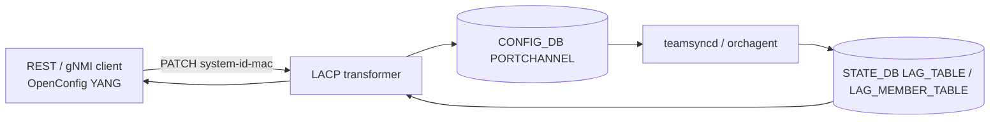

# OpenConfig Model Support for SONiC LACP Feature

# High Level Design Document
#### Rev 0.1

# Table of Contents
  * [List of Tables](#list-of-tables)
  * [Revision](#revision)
  * [About This Manual](#about-this-manual)
  * [Related Documents](#related-documents)
  * [Scope](#scope)
  * [Definition/Abbreviation](#definitionabbreviation)
  * [1 Feature Overview](#1-feature-overview)
    * [1.1 Requirements](#11-requirements)
      * [1.1.1 Functional Requirements](#111-functional-requirements)
      * [1.1.2 Configuration and Management Requirements](#112-configuration-management-requirements)
      * [1.1.3 Scalability Requirements](#113-scalability-requirements)
    * [1.2 Design Overview](#12-design-overview)
      * [1.2.1 Basic Approach](#121-basic-approach)
      * [1.2.2 Container](#122-container)
  * [2 Functionality](#2-functionality)
      * [2.1 Target Deployment Use Cases](#21-target-deployment-use-cases)
  * [3 Design](#3-design)
    * [3.1 Overview](#31-overview)
      * [3.1.1 SONiC Feature YANG and CONFIG_DB](#311-sonic-feature-yang-and-config_db)
      * [3.1.2 OpenConfig Modules](#312-openconfig-modules)
      * [3.1.3 UMF Translation (REST/gNMI to CONFIG_DB)](#313-umf-translation-restgnmi-to-config_db)
      * [3.1.4 Southbound Programming](#314-southbound-programming)
      * [3.1.5 Mapping Table and Unit Tests](#315-mapping-table-and-unit-tests)
    * [3.2 DB Changes](#32-db-changes)
      * [3.2.1 CONFIG DB](#321-config-db)
      * [3.2.2 APP DB](#322-app-db)
      * [3.2.3 STATE DB](#323-state-db)
      * [3.2.4 ASIC DB](#324-asic-db)
      * [3.2.5 COUNTER DB](#325-counter-db)
  * [4 OpenConfig to SONiC Mapping Table](#4-openconfig-to-sonic-mapping-table)
    * [4.1 Interface](#41-interface)
    * [4.2 Interface Configuration](#42-interface-configuration)
    * [4.3 Interface State](#43-interface-state)
    * [4.4 Member](#44-member)
    * [4.5 Member State](#45-member-state)
  * [5 User Interface](#5-user-interface)
    * [5.1 Data Models](#51-data-models)
    * [5.2 REST API Support](#52-rest-api-support)
      * [5.2.1 GET](#521-get)
      * [5.2.2 PUT](#522-put)
      * [5.2.3 POST](#523-post)
      * [5.2.4 PATCH](#524-patch)
      * [5.2.5 DELETE](#525-delete)
    * [5.3 gNMI Support](#53-gnmi-support)
      * [5.3.1 GET](#531-get)
      * [5.3.2 SET](#532-set)
      * [5.3.3 DELETE](#533-delete)
      * [5.3.4 SUBSCRIBE](#534-subscribe)
  * [6 Error Handling](#6-error-handling)
  * [7 Unit Test Cases](#7-unit-test-cases)
    * [7.1 Functional Test Cases](#71-functional-test-cases)
    * [7.2 Negative Test Cases](#72-negative-test-cases)

# List of Tables
[Table 1: Abbreviations](#table-1-abbreviations)

[Table 2: Translation Flow Layers](#table-2-translation-flow-layers)

OpenConfig to SONiC mapping tables: [Section 4](#4-openconfig-to-sonic-mapping-table)

# Revision
| Rev | Date | Author | Change Description |
|:---:|:-----------:|:---------------------:|-----------------------------------|
| 0.1 | 09/17/2026 | Anukul Verma | Initial version. |

# About this Manual
This document provides general information about the OpenConfig management of LACP in SONiC corresponding to the openconfig-lacp.yang module. It describes how OpenConfig **per-aggregate LACP operational state** is read from STATE_DB, and how **interface `config/system-id-mac`** is written to CONFIG_DB `PORTCHANNEL`, over REST and gNMI. Creating PortChannel interfaces is not done through `/lacp` (use the OpenConfig interfaces model).

LACP is configured and queried under:
/lacp

# Related Documents
| Document | Description |
|----------|-------------|
| Management Framework.md | UMF architecture (REST, gNMI, translib, transformers) |

# Scope
- This document describes the high level design of OpenConfig **LACP** mapping in SONiC.
- **In scope:** REST and gNMI GET, gNMI Subscribe (ON_CHANGE), and PATCH/DELETE of `config/system-id-mac`, on supported `/lacp` YANG paths. Interface list membership is CONFIG_DB `PORTCHANNEL`. Interface and member operational state is STATE_DB `LAG_TABLE` / `LAG_MEMBER_TABLE`.
- **Out of scope:** SONiC KLISH CLI and native SONiC CLI for LACP; creating or deleting PortChannel objects through `/lacp`; `/lacp/config` and `/lacp/state`; interface config `interval`, `lacp-mode`, `fallback`, `fallback-timeout`, `system-priority`; interface state `system-priority`, `fallback-timeout`; member config `port-priority`; member state `oper-key`, `partner-key`, `port-priority`, `partner-port-priority`, `last-change`, and `counters`; OpenConfig if-aggregate `lag-speed` / `min-links` (interfaces model, not `/lacp`).
- OpenConfig xpath root:
  `/lacp`
- Supported attributes in OpenConfig YANG tree (reflecting current UMF implementation):

```
module: openconfig-lacp
+--rw lacp
   +--rw interfaces
      +--rw interface* [name]
         +--rw name      -> ../config/name
         +--rw config
         |  +--rw name?            oc-if:base-interface-ref
         |  +--rw system-id-mac?   oc-yang:mac-address
         +--ro state
         |  +--ro name?            oc-if:base-interface-ref
         |  +--ro interval?        enumeration
         |  +--ro lacp-mode?       enumeration
         |  +--ro system-id-mac?   oc-yang:mac-address
         |  +--ro fallback?        boolean
         +--rw members
            +--rw member* [interface]
               +--rw interface    -> ../config/interface
               +--rw config
               |  +--rw interface?   oc-if:base-interface-ref
               +--ro state
                  +--ro interface?          oc-if:base-interface-ref
                  +--ro activity?           enumeration
                  +--ro timeout?            enumeration
                  +--ro synchronization?    enumeration
                  +--ro aggregatable?       boolean
                  +--ro collecting?         boolean
                  +--ro distributing?       boolean
                  +--ro system-id?          oc-yang:mac-address
                  +--ro partner-id?         oc-yang:mac-address
                  +--ro port-num?           uint16
                  +--ro partner-port-num?   uint16
```

# Definition/Abbreviation
### Table 1: Abbreviations

| **Term** | **Definition** |
|----------|----------------|
| YANG | Yet Another Next Generation: modular language representing data structures in an XML tree format |
| gNMI | gRPC Network Management Interface: used to retrieve or manipulate the state of a device via telemetry or configuration data |
| UMF | Unified Management Framework (REST, gNMI, translib) |
| LACP | Link Aggregation Control Protocol (IEEE 802.1AX / 802.3ad) |
| LAG | Link Aggregation Group (PortChannel) |

# 1 Feature Overview
## 1.1 Requirements
### 1.1.1 Functional Requirements
1. Expose OpenConfig LACP interface and member operational state for PortChannels over REST and gNMI GET.
2. Support PATCH and DELETE of interface `config/system-id-mac` on an existing CONFIG_DB `PORTCHANNEL` row.
3. Support gNMI Subscribe ON_CHANGE on the mapped `/lacp` trees.
4. Omit individual state leaves whose STATE_DB field is absent (do not invent defaults).

### 1.1.2 Configuration and Management Requirements
LACP PortChannel membership is existing CONFIG_DB `PORTCHANNEL`. OpenConfig `/lacp` does not create PortChannels. Get and Subscribe are supported on the mapped paths. The only writable `/lacp` leaf is `config/system-id-mac`. Other configuration leaves under `/lacp` return an error.

### 1.1.3 Scalability Requirements
The number of OpenConfig interface list entries tracks CONFIG_DB `PORTCHANNEL` rows. Member list entries track STATE_DB `LAG_MEMBER_TABLE` keys `{lag}|{member}`.

## 1.2 Design Overview
### 1.2.1 Basic Approach
UMF maps `/lacp` to CONFIG_DB `PORTCHANNEL` for list membership and `system_mac`, and to STATE_DB `LAG_TABLE` / `LAG_MEMBER_TABLE` for live LACP state. Member actor flags are decoded from the LACPDU actor-state bitmask.

### 1.2.2 Container
Implementation is in **sonic-mgmt-common** (REST server in the Management Framework container; gNMI server in the gnmi container).

# 2 Functionality
## 2.1 Target Deployment Use Cases

1. **REST clients** — GET on LACP RESTCONF paths; PATCH/DELETE of `config/system-id-mac`. Orchestration systems are one example.
2. **gNMI clients** — Capabilities, Get, Set (`system-id-mac` only), Delete (`system-id-mac` only), and Subscribe (stream) on LACP gNMI paths. Controllers and telemetry consumers are examples.

# 3 Design
## 3.1 Overview
This HLD follows Management Framework.md. The design covers: PORTCHANNEL / LAG STATE_DB schema, OpenConfig modules, UMF translation, mapping tables (Section 4), and unit tests (Section 7).

### 3.1.1 SONiC Feature YANG and CONFIG_DB
Writable OpenConfig LACP configuration uses existing `sonic-portchannel.yang`. Live LACP state has no dedicated SONiC YANG model:

| Item | Detail |
|------|--------|
| CONFIG_DB table | `PORTCHANNEL` (`sonic-portchannel.yang`) |
| Mapped CONFIG_DB field | `system_mac` ← `/lacp/.../config/system-id-mac` |
| STATE_DB tables | `LAG_TABLE` (key: PortChannel name); `LAG_MEMBER_TABLE` (key: `{lag}\|{member}`) — no SONiC YANG model |
| Mapped LAG_TABLE fields | `runner.fast_rate`, `runner.active`, `runner.fallback`, `team_device.ifinfo.dev_addr` |
| Mapped LAG_MEMBER_TABLE fields | `runner.actor_lacpdu_info.state` (bitmask), `runner.actor_lacpdu_info.system`, `runner.actor_lacpdu_info.port`, `runner.partner_lacpdu_info.system`, `runner.partner_lacpdu_info.port` |

OpenConfig clients never create `PORTCHANNEL` through `/lacp`. STATE_DB examples are in [§3.2.3](#323-state-db).

### 3.1.2 OpenConfig Modules
| Module | Source | Role for LACP |
|--------|--------|----------------|
| [openconfig-lacp.yang](https://github.com/openconfig/public/blob/master/release/models/lacp/openconfig-lacp.yang) | openconfig/public | Base LACP container (`lacp`), version 2.2.0 as loaded |
| openconfig-lacp-annot.yang | sonic-mgmt-common | XPath to PORTCHANNEL / LAG_TABLE / LAG_MEMBER_TABLE bindings |
| openconfig-lacp-deviation.yang | sonic-mgmt-common | `not-supported` deviations |

### 3.1.3 UMF Translation (REST/gNMI to CONFIG_DB)
OpenConfig GET/SUBSCRIBE/SET requests for `/lacp` are handled by translib and the **transformer** common app. Annotation YANG binds `/lacp/interfaces/interface` to CONFIG_DB `PORTCHANNEL`. Interface state is filled from STATE_DB `LAG_TABLE`. Members are STATE_DB `LAG_MEMBER_TABLE` rows for that PortChannel.


*Figure: Management Framework architecture ([Management Framework.md](https://github.com/sonic-net/SONiC/blob/master/doc/mgmt/Management%20Framework.md)).*

#### Table 2: Translation Flow Layers

| Layer | Artifact | Role |
|-------|----------|------|
| **1. SONiC PortChannel YANG** | `sonic-portchannel.yang` | CONFIG_DB `PORTCHANNEL` schema (`system_mac`) |
| **2. OpenConfig modules** | `openconfig-lacp.yang` | Northbound client model |
| **3. UMF annotations** | `openconfig-lacp-annot.yang` | XPath → PORTCHANNEL / STATE_DB bindings |
| **4. UMF transformers** | LACP transformers | DbToYang / YangToDb / Subscribe for interface, members, and `system-id-mac` |
| **5. CONFIG_DB / STATE_DB** | `PORTCHANNEL`, `LAG_TABLE`, `LAG_MEMBER_TABLE` | Config store and live LACP state |
| **6. teamsyncd / orchagent** | LAG agents | Publish STATE_DB; program SAI LAG from CONFIG_DB |



### 3.1.4 Southbound Programming
teamsyncd (teamd) publishes `LAG_TABLE` and `LAG_MEMBER_TABLE` in STATE_DB. orchagent programs the SAI LAG from CONFIG_DB `PORTCHANNEL`. OpenConfig SET of `system-id-mac` writes `PORTCHANNEL.system_mac` only; it does not write STATE_DB.

### 3.1.5 Mapping Table and Unit Tests
- **OpenConfig → SONiC mapping:** [Section 4](#4-openconfig-to-sonic-mapping-table).
- **REST/gNMI examples:** [Section 5](#5-user-interface).
- **Unit tests:** [Section 7](#7-unit-test-cases).

## 3.2 DB Changes
OpenConfig LACP uses existing CONFIG_DB `PORTCHANNEL` and STATE_DB LAG tables. No new tables are added.

### 3.2.1 CONFIG DB
PortChannel used for `/lacp/interfaces/interface` membership and `config/system-id-mac`. Example after PATCH of `system-id-mac`:

```
PORTCHANNEL|PortChannel0
  admin_status: up
  mtu:          9100
  system_mac:   00:44:33:22:11:11
```

DELETE of `config/system-id-mac` removes `system_mac` from the row. It does not delete the PortChannel.

### 3.2.2 APP DB
No APP DB tables are used for OpenConfig `/lacp`.

### 3.2.3 STATE DB
Interface operational state (`LAG_TABLE`) and per-member LACPDU info (`LAG_MEMBER_TABLE`):

```
LAG_TABLE|PortChannel0
  runner.active:               true
  runner.fast_rate:            false
  runner.fallback:             false
  team_device.ifinfo.dev_addr: 52:54:00:ab:cd:ef

LAG_MEMBER_TABLE|PortChannel0|Ethernet0
  runner.actor_lacpdu_info.state:    63
  runner.actor_lacpdu_info.port:     1
  runner.actor_lacpdu_info.system:   52:54:00:ab:cd:ef
  runner.partner_lacpdu_info.port:   2
  runner.partner_lacpdu_info.system: 1e:af:77:fc:79:ee
```

`runner.actor_lacpdu_info.state` is an integer bitmask (IEEE 802.1AX actor state): bit 0 activity, bit 1 timeout, bit 2 aggregatable, bit 3 synchronization, bit 4 collecting, bit 5 distributing. A missing or non-numeric bitmask omits those six leaves. Explicit Redis `0` is a valid bitmask (all bits off).

### 3.2.4 ASIC DB
No ASIC DB tables are used for OpenConfig `/lacp`.

### 3.2.5 COUNTER DB
No COUNTER DB tables are used. Member `counters` under `/lacp` are not supported.

# 4 OpenConfig to SONiC Mapping Table
**CONFIG_DB table:** `PORTCHANNEL`  
**STATE_DB tables:** `LAG_TABLE`, `LAG_MEMBER_TABLE`  
**LAG_MEMBER_TABLE key:** `{lag}|{member}`

**Conventions:**
- Each subsection maps one OpenConfig container or list. Paths are shown as an indented tree; placeholders: `<lag>`, `<member>`.
- Interface `config` (except list-key mirrors) is CONFIG_DB `PORTCHANNEL`. Interface and member `state` operational leaves are **live STATE_DB**, not a config replica. `config/system-id-mac` and `state/system-id-mac` can differ.

## 4.1 Interface
**OpenConfig path:**
```
/lacp/interfaces
     interface[name=<lag>]
```
| OpenConfig leaf | DB Name | Table:Field | Notes |
|-----------------|---------|-------------|-------|
| name (list key) | CONFIG_DB | PORTCHANNEL:`<lag>` | Listed for every PORTCHANNEL row |
| name (config/state) | CONFIG_DB | PORTCHANNEL key | Mirrored from the list key on GET |

GET of `interface[name=<lag>]` when the PortChannel is not in CONFIG_DB is not found, even if `LAG_TABLE` has a row.

## 4.2 Interface Configuration
**OpenConfig path:**
```
/lacp/interfaces/interface[name=<lag>]/config
```
| OpenConfig leaf | DB Name | Table:Field | Notes |
|-----------------|---------|-------------|-------|
| name | CONFIG_DB | PORTCHANNEL key | List-key mirror |
| system-id-mac | CONFIG_DB | PORTCHANNEL:`system_mac` | PATCH writes the field; DELETE clears it |

`interval`, `lacp-mode`, `fallback`, `fallback-timeout`, and `system-priority` under config are not supported.

## 4.3 Interface State
**OpenConfig path:**
```
/lacp/interfaces/interface[name=<lag>]/state
```
| OpenConfig leaf | DB Name | Table:Field | Notes |
|-----------------|---------|-------------|-------|
| name | CONFIG_DB | PORTCHANNEL key | List-key mirror |
| interval | STATE_DB | LAG_TABLE:`runner.fast_rate` | `true` → `FAST`; other non-empty → `SLOW`; absent → omit |
| lacp-mode | STATE_DB | LAG_TABLE:`runner.active` | `true` → `ACTIVE`; other non-empty → `PASSIVE`; absent → omit |
| system-id-mac | STATE_DB | LAG_TABLE:`team_device.ifinfo.dev_addr` | Live actor MAC; not `PORTCHANNEL.system_mac` |
| fallback | STATE_DB | LAG_TABLE:`runner.fallback` | `true`/`false`; absent → omit |

`system-priority` and `fallback-timeout` under state are not supported.

## 4.4 Member
**OpenConfig path:**
```
/lacp/interfaces/interface[name=<lag>]/members
     member[interface=<member>]
          config
```
| OpenConfig leaf | DB Name | Table:Field | Notes |
|-----------------|---------|-------------|-------|
| interface (list key) | STATE_DB | LAG_MEMBER_TABLE key `{lag}\|{member}` | Member port name |
| interface (config/state) | STATE_DB | same key component | Mirrored from the list key on GET |

`port-priority` under member config is not supported.

## 4.5 Member State
**OpenConfig path:**
```
/lacp/interfaces/interface[name=<lag>]/members
     member[interface=<member>]/state
```
| OpenConfig leaf | DB Name | Table:Field | Notes |
|-----------------|---------|-------------|-------|
| interface | STATE_DB | LAG_MEMBER_TABLE key | List-key mirror |
| activity | STATE_DB | LAG_MEMBER_TABLE:`runner.actor_lacpdu_info.state` bit 0 | `ACTIVE` / `PASSIVE` |
| timeout | STATE_DB | same bitmask bit 1 | `SHORT` / `LONG` |
| aggregatable | STATE_DB | same bitmask bit 2 | boolean |
| synchronization | STATE_DB | same bitmask bit 3 | `IN_SYNC` / `OUT_SYNC` |
| collecting | STATE_DB | same bitmask bit 4 | boolean |
| distributing | STATE_DB | same bitmask bit 5 | boolean |
| system-id | STATE_DB | `runner.actor_lacpdu_info.system` | Actor system MAC |
| partner-id | STATE_DB | `runner.partner_lacpdu_info.system` | Partner system MAC |
| port-num | STATE_DB | `runner.actor_lacpdu_info.port` | uint16 |
| partner-port-num | STATE_DB | `runner.partner_lacpdu_info.port` | uint16 |

Bitmask integer `63` (all six bits set) is a fully synced active member. Integer `0` is passive, long timeout, not aggregatable, out of sync, not collecting, not distributing. A missing, empty, or non-numeric bitmask omits the six flag leaves; other present fields (for example `port-num`) still appear on container GET.

# 5 User Interface
## 5.1 Data Models
| Module | Source | Role |
|--------|--------|------|
| [openconfig-lacp.yang](https://github.com/openconfig/public/blob/master/release/models/lacp/openconfig-lacp.yang) | openconfig/public | Base LACP container |
| openconfig-lacp-annot.yang | sonic-mgmt-common | XPath to PORTCHANNEL and STATE_DB bindings |
| openconfig-lacp-deviation.yang | sonic-mgmt-common | `not-supported` deviations |

## 5.2 REST API Support
Examples below use paths and payloads validated by unit tests (documentation prefixes substituted). RESTCONF URL encoding uses `=` separators; gNMI uses bracket notation (see §5.3).

### 5.2.1 GET
Supported at `/lacp/interfaces`, interface, `/config`, `/state`, members, member, and individual mapped leaves.

```
curl -X GET -k "https://<device>/restconf/data/openconfig-lacp:lacp/interfaces" -H "accept: application/yang-data+json"
```

```
curl -X GET -k "https://<device>/restconf/data/openconfig-lacp:lacp/interfaces/interface=PortChannel0" -H "accept: application/yang-data+json"
```

```
curl -X GET -k "https://<device>/restconf/data/openconfig-lacp:lacp/interfaces/interface=PortChannel0/state" -H "accept: application/yang-data+json"
```

Example GET `/state` body:

```json
{
  "openconfig-lacp:state": {
    "name": "PortChannel0",
    "interval": "SLOW",
    "lacp-mode": "ACTIVE",
    "system-id-mac": "52:54:00:ab:cd:ef",
    "fallback": false
  }
}
```

```
curl -X GET -k "https://<device>/restconf/data/openconfig-lacp:lacp/interfaces/interface=PortChannel0/members/member=Ethernet0/state" -H "accept: application/yang-data+json"
```

Example GET member `/state` (actor bitmask `63`):

```json
{
  "openconfig-lacp:state": {
    "interface": "Ethernet0",
    "activity": "ACTIVE",
    "timeout": "SHORT",
    "synchronization": "IN_SYNC",
    "aggregatable": true,
    "collecting": true,
    "distributing": true,
    "system-id": "52:54:00:ab:cd:ef",
    "partner-id": "1e:af:77:fc:79:ee",
    "port-num": 1,
    "partner-port-num": 2
  }
}
```

GET `config/system-id-mac` reads CONFIG_DB even when `LAG_TABLE` is absent:

```json
{
  "openconfig-lacp:system-id-mac": "00:44:33:22:11:11"
}
```

### 5.2.2 PUT
Not supported. PortChannel objects are not created or replaced through `/lacp`.

### 5.2.3 POST
Not supported.

### 5.2.4 PATCH
Supported for `config/system-id-mac` on an existing PORTCHANNEL row.

```
curl -X PATCH -k "https://<device>/restconf/data/openconfig-lacp:lacp/interfaces/interface=PortChannel0/config/system-id-mac" \
  -H "Content-Type: application/yang-data+json" \
  -d '{"openconfig-lacp:system-id-mac": "00:44:33:22:11:11"}'
```

### 5.2.5 DELETE
Supported for `config/system-id-mac` only. Clears `PORTCHANNEL.system_mac`; the PortChannel row remains.

```
curl -X DELETE -k "https://<device>/restconf/data/openconfig-lacp:lacp/interfaces/interface=PortChannel0/config/system-id-mac"
```

## 5.3 gNMI Support
Use `--target OC-YANG`.

### 5.3.1 GET

```
gnmic -a <device>:<port> --insecure --target OC-YANG get \
  --path "/openconfig-lacp:lacp/interfaces/interface[name=PortChannel0]/state"
```

```
gnmic -a <device>:<port> --insecure --target OC-YANG get \
  --path "/openconfig-lacp:lacp/interfaces/interface[name=PortChannel0]/members/member[interface=Ethernet0]/state"
```

### 5.3.2 SET
Supported for `config/system-id-mac` only.

```
gnmic -a <device>:<port> --insecure --target OC-YANG set \
  --update-path "/openconfig-lacp:lacp/interfaces/interface[name=PortChannel0]/config/system-id-mac" \
  --update-value "00:44:33:22:11:11"
```

### 5.3.3 DELETE
Supported for `config/system-id-mac` only.

```
gnmic -a <device>:<port> --insecure --target OC-YANG set \
  --delete "/openconfig-lacp:lacp/interfaces/interface[name=PortChannel0]/config/system-id-mac"
```

### 5.3.4 SUBSCRIBE
Subscribe is ON_CHANGE on the mapped interface and member trees (CONFIG_DB `PORTCHANNEL` and STATE_DB LAG tables). Wildcard interface and member keys are permitted.

```
gnmic -a <device>:<port> --insecure --target OC-YANG subscribe \
  --path "/openconfig-lacp:lacp/interfaces/interface[name=*]/state/lacp-mode" \
  --mode stream
```

```
gnmic -a <device>:<port> --insecure --target OC-YANG subscribe \
  --path "/openconfig-lacp:lacp/interfaces/interface[name=*]/members/member[interface=*]/state/synchronization" \
  --mode stream
```

# 6 Error Handling
- GET of a PortChannel that is not in CONFIG_DB `PORTCHANNEL` is rejected (not found), including when only `LAG_TABLE` has a row.
- GET of a member that is not in `LAG_MEMBER_TABLE` is rejected (not found).
- GET of a mapped state leaf whose STATE_DB field is missing, empty, or (for the actor bitmask) non-numeric is rejected (not found). Container GET of `/state` returns only present leaves (`name` / `interface` still mirrored).
- PATCH or DELETE of `config/system-id-mac` when the PortChannel is not in CONFIG_DB is rejected (not found).
- PUT/POST of `/lacp` objects, and SET of unmapped config leaves (`interval`, `lacp-mode`, `fallback`, `system-priority`, member `port-priority`), are not supported (`not-supported` deviations).
- Unmapped state containers (member `counters`, `oper-key`, `partner-key`, and others listed in Scope) are not supported.

# 7 Unit Test Cases
Section 7 summarizes generic functional and negative scenarios for REST and gNMI paths under `/lacp`.

## 7.1 Functional Test Cases

**Interface GET**

- GET `/lacp/interfaces` and `interface[name=PortChannel0]` including `config/name`, `config/system-id-mac`, `state` (`interval`, `lacp-mode`, `system-id-mac`, `fallback`), and members.
- GET `/state` and individual leaves. GET `interval` `FAST` when `runner.fast_rate` is `true`; GET `lacp-mode` `PASSIVE` when `runner.active` is `false`.
- GET `config/system-id-mac` when `LAG_TABLE` is absent (CONFIG_DB only).

**Member GET**

- GET a fully synced member (bitmask `63`) and a defaulted member (bitmask `5`).
- GET bitmask `0` (all flags off) and bitmask `63` (all flags on).
- GET individual member leaves (`activity`, `timeout`, `synchronization`, `aggregatable`, `collecting`, `distributing`, `system-id`, `partner-id`, `port-num`, `partner-port-num`).

**system-id-mac write**

- PATCH `config/system-id-mac`; GET returns the CONFIG_DB value; `state/system-id-mac` remains the STATE_DB actor MAC.
- DELETE `config/system-id-mac` clears `system_mac` and leaves the PORTCHANNEL row.

**Subscribe**

- gNMI Subscribe ON_CHANGE on `interface[name=*]` state and `member[interface=*]` state leaves.

## 7.2 Negative Test Cases

**Validation**

1. GET unknown PortChannel or unknown member rejected (not found).
2. GET `state/system-id-mac` (and other state leaves) when only `LAG_TABLE` exists and CONFIG_DB `PORTCHANNEL` does not, rejected (not found).
3. PATCH `config/system-id-mac` without a PORTCHANNEL row rejected (not found).
4. GET absent STATE_DB fields (`runner.fast_rate`, `runner.active`, `dev_addr`, `runner.fallback`, actor bitmask, partner/system MAC) rejected (not found); container GET omits those leaves.
5. GET member with empty or non-numeric actor bitmask: flag leaves rejected (not found).
6. Configuration SET of unmapped `/lacp` config leaves not supported.
