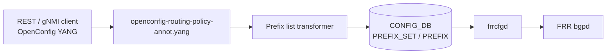

# OpenConfig Model Support for SONiC Prefix List Feature

# High Level Design Document
#### Rev 0.1

# Table of Contents
  * [List of Tables](#list-of-tables)
  * [Revision](#revision)
  * [About This Manual](#about-this-manual)
  * [Related Documents](#related-documents)
  * [Scope](#scope)
  * [Definition/Abbreviation](#definitionabbreviation)
  * [1 Feature Overview](#1-feature-overview)
    * [1.1 Requirements](#11-requirements)
      * [1.1.1 Functional Requirements](#111-functional-requirements)
      * [1.1.2 Configuration and Management Requirements](#112-configuration-and-management-requirements)
      * [1.1.3 Scalability Requirements](#113-scalability-requirements)
    * [1.2 Design Overview](#12-design-overview)
      * [1.2.1 Basic Approach](#121-basic-approach)
      * [1.2.2 Container](#122-container)
  * [2 Functionality](#2-functionality)
      * [2.1 Target Deployment Use Cases](#21-target-deployment-use-cases)
  * [3 Design](#3-design)
    * [3.1 Overview](#31-overview)
      * [3.1.1 SONiC Feature YANG and CONFIG_DB](#311-sonic-feature-yang-and-config_db)
      * [3.1.2 OpenConfig Modules](#312-openconfig-modules)
      * [3.1.3 UMF Translation (REST/gNMI to CONFIG_DB)](#313-umf-translation-restgnmi-to-config_db)
      * [3.1.4 FRR Programming (frrcfgd)](#314-frr-programming-frrcfgd)
      * [3.1.5 OpenConfig Extensions](#315-openconfig-extensions)
      * [3.1.6 Mapping Table and Unit Tests](#316-mapping-table-and-unit-tests)
    * [3.2 DB Changes](#32-db-changes)
      * [3.2.1 CONFIG DB](#321-config-db)
      * [3.2.2 APP DB](#322-app-db)
      * [3.2.3 STATE DB](#323-state-db)
      * [3.2.4 ASIC DB](#324-asic-db)
      * [3.2.5 COUNTER DB](#325-counter-db)
  * [4 OpenConfig to SONiC Mapping Table](#4-openconfig-to-sonic-mapping-table)
    * [4.1 Prefix Sets Container](#41-prefix-sets-container)
    * [4.2 Prefix Set Entry](#42-prefix-set-entry)
    * [4.3 Prefix Set Leaves (config/state)](#43-prefix-set-leaves-configstate)
    * [4.4 Prefix Entry](#44-prefix-entry)
    * [4.5 Prefix Entry Leaves (config/state)](#45-prefix-entry-leaves-configstate)
  * [5 User Interface](#5-user-interface)
    * [5.1 Data Models](#51-data-models)
    * [5.2 REST API Support](#52-rest-api-support)
      * [5.2.1 GET](#521-get)
      * [5.2.2 PUT](#522-put)
      * [5.2.3 POST](#523-post)
      * [5.2.4 PATCH](#524-patch)
      * [5.2.5 DELETE](#525-delete)
    * [5.3 gNMI Support](#53-gnmi-support)
      * [5.3.1 GET](#531-get)
      * [5.3.2 SET](#532-set)
      * [5.3.3 DELETE](#533-delete)
      * [5.3.4 SUBSCRIBE](#534-subscribe)
  * [6 Error Handling](#6-error-handling)
  * [7 Unit Test Cases](#7-unit-test-cases)
    * [7.1 Functional Test Cases](#71-functional-test-cases)
    * [7.2 Negative Test Cases](#72-negative-test-cases)

# List of Tables
[Table 1: Abbreviations](#table-1-abbreviations)

[Table 2: Translation Flow Layers](#table-2-translation-flow-layers)

OpenConfig to SONiC mapping tables: [Section 4](#4-openconfig-to-sonic-mapping-table)

# Revision
| Rev | Date | Author | Change Description |
|:---:|:-----------:|:---------------------:|-----------------------------------|
| 0.1 | 07/22/2026 | Soumya Gargari, Anukul Verma | Initial version |

# About this Manual
This document provides general information about the OpenConfig configuration and management of prefix lists (defined prefix sets) in SONiC corresponding to the openconfig-routing-policy.yang module. It describes how OpenConfig models are translated to SONiC CONFIG_DB entries and FRR prefix-list configuration, and how operational state is returned over REST and gNMI.

Prefix lists are configured under:
/routing-policy/defined-sets/prefix-sets

# Related Documents
| Document | Description |
|----------|-------------|
| Management Framework.md | UMF architecture (REST, gNMI, translib, transformers) |
| OpenConfig_RouteMap.md | Route-map match conditions reference prefix sets by name |
| Openconfig_BGP.md | BGP policy that may reference prefix sets |

# Scope
- This document describes the high level design of OpenConfig **Prefix List** configuration and operational retrieval in SONiC.
- **In scope:** REST and gNMI — Get, Set (POST/PUT/PATCH), Delete, and Subscribe on supported prefix-set YANG paths.
- **Out of scope:** SONiC KLISH CLI and native SONiC CLI for prefix lists; SONiC `PREFIX_NOSEQ_LIST` (entries without explicit sequence numbers).
- OpenConfig xpath root:
  `/routing-policy/defined-sets/prefix-sets`
- Supported attributes in OpenConfig YANG tree (reflecting current UMF implementation):

```
module: openconfig-routing-policy
        (+ openconfig-routing-policy-ext)
+--rw routing-policy
   +--rw defined-sets
      +--rw prefix-sets
         +--rw prefix-set* [name]
            +--rw name        -> ../config/name
            +--rw config
            |  +--rw name?                    string
            |  +--rw mode?                    enumeration (IPV4 | IPV6)
            |  +--rw oc-rp-ext:description?   string
            +--ro state
            |  +--ro name?                    string
            |  +--ro mode?                    enumeration
            |  +--ro oc-rp-ext:description?   string
            +--rw prefixes
               +--rw prefix* [ip-prefix masklength-range]
                  +--rw ip-prefix           -> ../config/ip-prefix
                  +--rw masklength-range    -> ../config/masklength-range
                  +--rw config
                  |  +--rw ip-prefix                      oc-inet:ip-prefix
                  |  +--rw masklength-range?              string
                  |  +--rw oc-rp-ext:sequence-number?     uint32
                  |  +--rw oc-rp-ext:action?              enumeration (PERMIT | DENY)
                  +--ro state
                     +--ro ip-prefix                      oc-inet:ip-prefix
                     +--ro masklength-range?              string
                     +--ro oc-rp-ext:sequence-number?     uint32
                     +--ro oc-rp-ext:action?              enumeration
```

Extension leaves are documented in [Section 3.1.5 OpenConfig Extensions](#315-openconfig-extensions).

# Definition/Abbreviation
### Table 1: Abbreviations

| **Term** | **Definition** |
|--------------------------|-------------------------------------|
| YANG | Yet Another Next Generation: modular language representing data structures in an XML tree format |
| REST | REpresentative State Transfer |
| gNMI | gRPC Network Management Interface |
| UMF | Unified Management Framework (`sonic-mgmt-common`) |
| FRR | Free Range Routing (bgpd) |
| PERMIT / DENY | Prefix list match actions mapped to route filter permit or deny |

# 1 Feature Overview
## 1.1 Requirements
### 1.1.1 Functional Requirements
1. Expose SONiC prefix list configuration through standard OpenConfig YANG models under `routing-policy/defined-sets/prefix-sets`.
2. Support configuration and operational retrieval of prefix sets and prefix entries (see Scope and Section 4).
3. Support IPv4 and IPv6 prefix sets with PERMIT and DENY actions on entries.
4. Enforce sequence-number ordering semantics via CONFIG_DB keys and cross-entry validation.
5. Provide REST Get, Post, Put, Patch, and Delete, and gNMI Get, Set, Delete, and Subscribe on all mapped prefix-set paths.

### 1.1.2 Configuration and Management Requirements
Prefix lists are configured and queried only through REST and gNMI via the Unified Management Framework (UMF). KLISH and native SONiC CLI are out of scope for this document. Unsupported operations return an error through existing UMF error handling; no new management interfaces are introduced.

### 1.1.3 Scalability Requirements
Prefix list scale follows the existing CONFIG_DB `PREFIX` / `PREFIX_SET` schema and platform limits for the number of sets and entries per set.

## 1.2 Design Overview
### 1.2.1 Basic Approach
SONiC already programs FRR prefix lists from CONFIG_DB through **frrcfgd**. This feature adds a northbound OpenConfig view: REST/gNMI clients configure OpenConfig YANG; UMF transformers translate requests into existing CONFIG_DB `PREFIX_SET` and `PREFIX` rows; frrcfgd applies configuration to FRR bgpd from CONFIG_DB changes.

### 1.2.2 Container
Implementation changes are in **sonic-mgmt-common** (REST server in the Management Framework container and gNMI server in the gnmi container: annotations, transformers) and **sonic-frr-mgmt-framework** (frrcfgd runtime mapping for `PREFIX_SET` / `PREFIX`).

# 2 Functionality
## 2.1 Target Deployment Use Cases
All northbound clients configure and query prefix lists using OpenConfig YANG over REST or gNMI.

1. **REST clients** — GET, POST, PUT, PATCH, and DELETE on prefix-set RESTCONF paths. Orchestration systems are one example.
2. **gNMI clients** — Capabilities, Get, Set (update/delete), and Subscribe (stream) on prefix-set gNMI paths. Controllers and telemetry consumers are examples.

# 3 Design
## 3.1 Overview
This HLD follows Management Framework.md. The design covers: SONiC feature YANG, OpenConfig modules, UMF translation, CONFIG_DB, FRR programming, mapping tables (Section 4), and unit tests (Section 7).

### 3.1.1 SONiC Feature YANG and CONFIG_DB
SONiC defines the southbound schema in `sonic-routing-policy-sets.yang`:

| Item | Detail |
|------|--------|
| CONFIG_DB tables | `PREFIX_SET`, `PREFIX` |
| `PREFIX_SET` key | `{set-name}` |
| `PREFIX_SET` leaves | `mode` (`IPv4` / `IPv6`), `description` |
| `PREFIX` key | `{set-name}\|{sequence-number}\|{canonical-ip-prefix}\|{masklength-range}` |
| `PREFIX` leaves | `action` (`permit` / `deny`), `mode` |
| Out of scope | `PREFIX_NOSEQ_LIST` (SONiC CLI / native model for entries without sequence numbers) |

OpenConfig clients never write CONFIG_DB directly; UMF transformers populate `PREFIX_SET` and `PREFIX` from OpenConfig payloads. A CONFIG_DB example is in [§3.2.1](#321-config-db).

### 3.1.2 OpenConfig Modules
| Module | Source | Role for prefix lists |
|--------|--------|------------------------|
| [openconfig-routing-policy.yang](https://github.com/openconfig/public/blob/master/release/models/policy/openconfig-routing-policy.yang) | openconfig/public | Base `defined-sets/prefix-sets` tree: `name`, `mode`, `ip-prefix`, `masklength-range` |
| openconfig-routing-policy-ext.yang | sonic-mgmt-common | Prefix-set `description`; prefix entry `sequence-number`, `action` (prefix `oc-rp-ext`) |
| openconfig-routing-policy-annot.yang | sonic-mgmt-common | XPath to CONFIG_DB and operational state bindings |
| openconfig-routing-policy-deviation.yang | sonic-mgmt-common | `not-supported` deviations for unsupported base OC leaves |

### 3.1.3 UMF Translation (REST/gNMI to CONFIG_DB)
OpenConfig SET/GET/SUBSCRIBE requests are handled by translib and the **transformer** common app. Annotation YANG defines xpath-to-DB bindings; the prefix list transformer performs protocol validation, prefix normalization, key composition, and Subscribe path mapping.


*Figure: Management Framework architecture ([Management Framework.md](https://github.com/sonic-net/SONiC/blob/master/doc/mgmt/Management%20Framework.md)).*

#### Table 2: Translation Flow Layers

| Layer | Artifact | Role |
|-------|----------|------|
| **1. SONiC feature YANG** | `sonic-routing-policy-sets.yang` | CONFIG_DB `PREFIX_SET` / `PREFIX` schema |
| **2. OpenConfig modules** | `openconfig-routing-policy.yang`, `openconfig-routing-policy-ext.yang` | Northbound client model |
| **3. UMF annotations** | `openconfig-routing-policy-annot.yang` | XPath → table/field/transformer binding |
| **4. UMF transformers** | Prefix list transformer | YangToDb / DbToYang / Subscribe for prefix sets |
| **5. CONFIG_DB** | `PREFIX_SET`, `PREFIX` | Runtime configuration store |
| **6. FRR** | `frrcfgd.py` | Programs FRR bgpd prefix-list configuration |



### 3.1.4 FRR Programming (frrcfgd)
CONFIG_DB `PREFIX_SET` and `PREFIX` changes are consumed by **frrcfgd**, which programs FRR bgpd prefix-list configuration at runtime.


*Figure: Unified FRR management framework ([SONiC Unified FRR Mgmt Interface HLD](https://github.com/sonic-net/SONiC/blob/master/doc/mgmt/SONiC_Design_Doc_Unified_FRR_Mgmt_Interface.md)) — prefix lists follow the same CONFIG_DB → frrcfgd → FRR path as other routing-policy objects.*

### 3.1.5 OpenConfig Extensions
SONiC augments base OpenConfig prefix-set and prefix entry `config`/`state` using `openconfig-routing-policy-ext.yang`.

| Property | Value |
|----------|-------|
| Module | `openconfig-routing-policy-ext.yang` |
| Prefix | `oc-rp-ext` |
| Namespace | `http://openconfig.net/yang/routing-policy/sonic/extension` |

Extension leaf DB mappings are documented in [Section 4](#4-openconfig-to-sonic-mapping-table) only.

| OpenConfig YANG Node | Data type |
|----------------------|-----------|
| **defined-sets/prefix-sets/prefix-set/config** | |
| description | string |
| **defined-sets/prefix-sets/prefix-set/state** | |
| description | string |
| **defined-sets/prefix-sets/prefix-set/prefixes/prefix/config** | |
| sequence-number | uint32 (range: 1..4294967295) |
| action | enumeration (PERMIT \| DENY; default PERMIT) |
| **defined-sets/prefix-sets/prefix-set/prefixes/prefix/state** | |
| sequence-number | uint32 (range: 1..4294967295) |
| action | enumeration (PERMIT \| DENY; default PERMIT) |

### 3.1.6 Mapping Table and Unit Tests
- **OpenConfig → SONiC mapping:** [Section 4](#4-openconfig-to-sonic-mapping-table) — xpath-to-CONFIG_DB mapping.
- **REST/gNMI examples:** [Section 5](#5-user-interface).
- **Unit tests:** [Section 7](#7-unit-test-cases).

## 3.2 DB Changes
OpenConfig Prefix Lists use the existing CONFIG_DB `PREFIX_SET` and `PREFIX` tables. No new CONFIG_DB, APP_DB, STATE_DB, ASIC_DB, or COUNTER_DB tables are added.

### 3.2.1 CONFIG DB
Example:
```
PREFIX_SET|PrefixSet_1
  mode:        IPv6
  description: Test Prefix Set 1

PREFIX|PrefixSet_1|10|2001:db8::/32|32..64
  action: permit
  mode:   IPv6
```

OpenConfig `mode` uses `IPV4`/`IPV6`; CONFIG_DB stores `IPv4`/`IPv6`. The `ip-prefix` portion of the `PREFIX` key is always the canonical normalized address.

### 3.2.2 APP DB
No APP DB tables are used for prefix list configuration.

### 3.2.3 STATE DB
No STATE DB tables are used for prefix list configuration.

### 3.2.4 ASIC DB
No ASIC DB tables are used for prefix list configuration.

### 3.2.5 COUNTER DB
No COUNTER DB tables are used for prefix list configuration.

# 4 OpenConfig to SONiC Mapping Table
**CONFIG_DB tables:** `PREFIX_SET`, `PREFIX`  
**Key patterns:** `PREFIX_SET|{set-name}`; `PREFIX|{set-name}|{seq}|{canonical-ip-prefix}|{masklength-range}`

**Conventions:**
- Each subsection maps one OpenConfig container or list. Paths are shown as an indented tree; placeholders: `<set-name>`, `<ip-prefix>`, `<masklength-range>`, `<seq>`.
- **Extension** — `Yes` on extension leaves; blank on base OpenConfig leaves. Extension definitions are in [§3.1.5](#315-openconfig-extensions).
- Where `config` and `state` share the same mapping, both are covered in one table; operational `state` is returned on GET from CONFIG_DB.
- YANG list keys for `prefix` are `ip-prefix` and `masklength-range` only; `sequence-number` is stored in the CONFIG_DB key, not as a third list key.

## 4.1 Prefix Sets Container
**OpenConfig path:**
```
/routing-policy/defined-sets/prefix-sets
```
| OpenConfig node | Extension | DB Name | Table:Field | Notes |
|-----------------|-----------|---------|-------------|-------|
| prefix-sets | | — | — | Container for all prefix sets |

## 4.2 Prefix Set Entry
**OpenConfig path:**
```
/routing-policy/defined-sets/prefix-sets/prefix-set[name=<set-name>]
```
| OpenConfig leaf | Extension | DB Name | Table:Field | Notes |
|-----------------|-----------|---------|-------------|-------|
| name (list key) | | CONFIG_DB | PREFIX_SET:key `{set-name}` | Also used as key component in `PREFIX` rows |

## 4.3 Prefix Set Leaves (config/state)
**OpenConfig path:**
```
/routing-policy/defined-sets/prefix-sets/prefix-set[name=<set-name>]
     config
     state
```
| OpenConfig leaf | Extension | DB Name | Table:Field | Notes |
|-----------------|-----------|---------|-------------|-------|
| name | | CONFIG_DB | PREFIX_SET:key `{set-name}` | |
| mode | | CONFIG_DB | PREFIX_SET:mode | OpenConfig `IPV4`/`IPV6` → `IPv4`/`IPv6` |
| description | Yes | CONFIG_DB | PREFIX_SET:description | |

## 4.4 Prefix Entry
**OpenConfig path:**
```
/routing-policy/defined-sets/prefix-sets/prefix-set[name=<set-name>]
     prefixes/prefix[ip-prefix=<ip-prefix>][masklength-range=<masklength-range>]
```
| OpenConfig leaf | Extension | DB Name | Table:Field | Notes |
|-----------------|-----------|---------|-------------|-------|
| ip-prefix (list key) | | CONFIG_DB | PREFIX:key `{canonical-ip-prefix}` | Normalized on write; GET/DELETE accept URI forms that normalize to the same key |
| masklength-range (list key) | | CONFIG_DB | PREFIX:key `{masklength-range}` | Empty allowed; see Notes in §4.5 |

## 4.5 Prefix Entry Leaves (config/state)
**OpenConfig path:**
```
/routing-policy/defined-sets/prefix-sets/prefix-set[name=<set-name>]
     prefixes/prefix[ip-prefix=<ip-prefix>][masklength-range=<masklength-range>]
          config
          state
```
| OpenConfig leaf | Extension | DB Name | Table:Field | Notes |
|-----------------|-----------|---------|-------------|-------|
| ip-prefix | | CONFIG_DB | PREFIX:key `{canonical-ip-prefix}` | Prefixes with host bits set are rejected. Entry address family must match parent prefix-set `mode` |
| masklength-range | | CONFIG_DB | PREFIX:key `{masklength-range}` | Single value `V` must equal prefix length `P`. Range `MIN..MAX` requires `MIN <= MAX` and `P` equal to `MIN` or `MAX` |
| sequence-number | Yes | CONFIG_DB | PREFIX:key `{sequence-number}` | **Mandatory** on create, update, and replace. OpenConfig does not use SONiC `PREFIX_NOSEQ_LIST`. To change sequence, delete the prefix entry and recreate. PATCH/UPDATE that changes only sequence for the same `(ip-prefix, masklength-range)` is rejected |
| action | Yes | CONFIG_DB | PREFIX:action | `PERMIT`/`DENY` → `permit`/`deny`; default PERMIT when omitted on create |
| (derived) | | CONFIG_DB | PREFIX:mode | Aligned with parent prefix-set `mode` |

Additional validation (enforced on SET):
- Two entries in the same set cannot share the same `(ip-prefix, masklength-range)` with different sequence numbers, or the same sequence number with different `(ip-prefix, masklength-range)`.
- A single request must not include two prefix entries that normalize to the same `(ip-prefix, masklength-range)`.
- Deleting the **last** prefix entry in a set also removes the `PREFIX_SET` row automatically.

# 5 User Interface
## 5.1 Data Models
| Model | Source | Purpose |
|-------|--------|---------|
| sonic-routing-policy-sets.yang | sonic-yang-models | SONiC CONFIG_DB schema |
| [openconfig-routing-policy.yang](https://github.com/openconfig/public/blob/master/release/models/policy/openconfig-routing-policy.yang) | openconfig/public | Base prefix-set container |
| openconfig-routing-policy-ext.yang | sonic-mgmt-common | `description`, `sequence-number`, `action` |
| openconfig-routing-policy-annot.yang | sonic-mgmt-common | XPath to CONFIG_DB and operational state bindings |
| openconfig-routing-policy-deviation.yang | sonic-mgmt-common | `not-supported` deviations for unsupported OC leaves |

## 5.2 REST API Support
Examples below use paths and payloads validated by unit tests. RESTCONF URL encoding uses `=` separators; gNMI uses bracket notation (see §5.3).

### 5.2.1 GET
Supported at container, list, and leaf levels.

```
curl -X GET -k "https://<device>/restconf/data/openconfig-routing-policy:routing-policy/defined-sets/prefix-sets/prefix-set=PrefixSet_1" -H "accept: application/yang-data+json"
```

```
curl -X GET -k "https://<device>/restconf/data/openconfig-routing-policy:routing-policy/defined-sets/prefix-sets/prefix-set=PrefixSet_1/prefixes/prefix=2001:db8::/32,32..64/state" -H "accept: application/yang-data+json"
```

GET accepts either the canonical or equivalent non-canonical URI spelling of `ip-prefix` when it normalizes to the same CONFIG_DB key (e.g. `0::/64` and `::/64`).

### 5.2.2 PUT
Supported. PUT on a prefix set replaces the targeted resource per RESTCONF rules.

```
curl -X PUT -k "https://<device>/restconf/data/openconfig-routing-policy:routing-policy/defined-sets/prefix-sets/prefix-set=PrefixSet_1/config/mode" -H "accept: */*" -H "Content-Type: application/yang-data+json" -d "{\"openconfig-routing-policy:mode\":\"IPV6\"}"
```

### 5.2.3 POST
POST creates prefix sets or merges prefix entries into an existing set.

POST — create IPv4 prefix set:

```
curl -X POST -k "https://<device>/restconf/data/openconfig-routing-policy:routing-policy/defined-sets/prefix-sets" -H "accept: */*" -H "Content-Type: application/yang-data+json" -d "{\"openconfig-routing-policy:prefix-set\":[{\"name\":\"PrefixSet_1\",\"config\":{\"name\":\"PrefixSet_1\",\"mode\":\"IPV4\",\"description\":\"Test Prefix Set 1\"}}]}"
```

POST — create prefix set with IPv6 prefix entry:

```
curl -X POST -k "https://<device>/restconf/data/openconfig-routing-policy:routing-policy/defined-sets/prefix-sets" -H "accept: */*" -H "Content-Type: application/yang-data+json" -d "{\"openconfig-routing-policy:prefix-set\":[{\"name\":\"PrefixSet_1\",\"config\":{\"name\":\"PrefixSet_1\",\"mode\":\"IPV6\"},\"prefixes\":{\"prefix\":[{\"ip-prefix\":\"2001:db8::/32\",\"masklength-range\":\"32..64\",\"config\":{\"ip-prefix\":\"2001:db8::/32\",\"masklength-range\":\"32..64\",\"sequence-number\":10,\"action\":\"PERMIT\"}}]}}]}"
```

### 5.2.4 PATCH
Supported at leaf level (e.g. prefix `action`).

```
curl -X PATCH -k "https://<device>/restconf/data/openconfig-routing-policy:routing-policy/defined-sets/prefix-sets/prefix-set=PrefixSet_1/prefixes/prefix=2001:db8::/32,32..64/config/action" -H "accept: */*" -H "Content-Type: application/yang-data+json" -d "{\"openconfig-routing-policy:action\":\"DENY\"}"
```

PATCH that changes only `sequence-number` for an existing `(ip-prefix, masklength-range)` is rejected.

### 5.2.5 DELETE
Supported at prefix-set, prefix entry, and container levels.

DELETE one prefix entry:

```
curl -X DELETE -k "https://<device>/restconf/data/openconfig-routing-policy:routing-policy/defined-sets/prefix-sets/prefix-set=PrefixSet_1/prefixes/prefix=2001:db8::/32,32..64" -H "accept: */*"
```

DELETE entire prefix set:

```
curl -X DELETE -k "https://<device>/restconf/data/openconfig-routing-policy:routing-policy/defined-sets/prefix-sets/prefix-set=PrefixSet_1" -H "accept: */*"
```

## 5.3 gNMI Support
### 5.3.1 GET

```
gnmic -a <device>:<port> --insecure --target OC-YANG -e json_ietf get \
  --path "/openconfig-routing-policy:routing-policy/defined-sets/prefix-sets/prefix-set[name=PrefixSet_1]"
```

Leaf GET (`mode`):

```
gnmic -a <device>:<port> --insecure --target OC-YANG -e json_ietf get \
  --path "/openconfig-routing-policy:routing-policy/defined-sets/prefix-sets/prefix-set[name=PrefixSet_1]/config/mode"
```

### 5.3.2 SET

Create prefix set with nested prefix entry:

```
gnmic -a <device>:<port> --insecure --target OC-YANG -e json_ietf set \
  --update-path "/openconfig-routing-policy:routing-policy/defined-sets/prefix-sets/prefix-set[name=PrefixSet_1]" \
  --update-value '{
  "config": {"name": "PrefixSet_1", "mode": "IPV6"},
  "prefixes": {"prefix": [{
    "ip-prefix": "2001:db8::/32",
    "masklength-range": "32..64",
    "config": {
      "ip-prefix": "2001:db8::/32",
      "masklength-range": "32..64",
      "sequence-number": 10,
      "action": "PERMIT"
    }
  }]}
}'
```

### 5.3.3 DELETE

Delete a prefix entry:

```
gnmic -a <device>:<port> --insecure --target OC-YANG -e json_ietf set \
  --delete "/openconfig-routing-policy:routing-policy/defined-sets/prefix-sets/prefix-set[name=PrefixSet_1]/prefixes/prefix[ip-prefix=2001:db8::/32][masklength-range=32..64]"
```

### 5.3.4 SUBSCRIBE

Supported on supported config and state paths under `prefix-sets`. No feature-specific path is listed in controller-agent telemetry subscriptions; use the prefix-sets container xpath below.

On-change subscription:

```
gnmic -a <device>:<port> --insecure --target OC-YANG -e json_ietf sub \
  --path "/openconfig-routing-policy:routing-policy/defined-sets/prefix-sets" \
  --stream-mode on-change
```

Periodic sample subscription:

```
gnmic -a <device>:<port> --insecure --target OC-YANG -e json_ietf sub \
  --path "/openconfig-routing-policy:routing-policy/defined-sets/prefix-sets" \
  --stream-mode sample --sample-interval 30s
```

# 6 Error Handling
Invalid configurations and unsupported operations report an error with a descriptive message. Representative categories:

- Missing `sequence-number` on prefix entry create (`Sequence number is mandatory for prefix entry...`)
- Same normalized prefix with different sequence numbers, or same sequence with different prefixes
- Duplicate prefix spellings in a single payload
- Host-bit prefixes rejected for IPv4 and IPv6
- Address family mismatch between entry and prefix-set `mode`
- Invalid `masklength-range` format or inverted range
- PATCH/UPDATE that changes only `sequence-number` for an existing entry
- GET/DELETE on unknown prefix entry (`Prefix entry not found`)

# 7 Unit Test Cases

Section 7 summarizes generic functional and negative scenarios for REST and gNMI paths under the prefix-set subtree.

## 7.1 Functional Test Cases

**Basic CRUD**

1. Create, verify, and delete prefix sets and prefix entries using POST, PUT, PATCH, GET, and DELETE via REST/gNMI.
2. PUT and PATCH update prefix-set `mode`; GET returns updated config and state.
3. DELETE entire prefix set removes `PREFIX_SET` and all `PREFIX` rows.
4. DELETE one prefix entry; deleting the **last** entry also removes the `PREFIX_SET` row.

**Prefix entries and normalization**

- IPv4 and IPv6 prefix-set `mode` with PERMIT and DENY actions on entries.
- IPv6 prefix normalization (e.g. `0::/64` stored and retrieved as `::/64`).
- GET and DELETE using canonical and non-canonical URI forms of the same prefix.
- Prefix-set `description` stored in CONFIG_DB `PREFIX_SET:description`.

**Leaf updates**

- PATCH on prefix `action` leaf updates CONFIG_DB `PREFIX:action`.

**Subscribe**

- gNMI Subscribe on `prefix-sets` container (on-change and sample modes).

## 7.2 Negative Test Cases

**Validation**

1. Missing `sequence-number` on prefix entry create rejected.
2. Host-bit prefixes rejected for IPv4 and IPv6.
3. IPv4 prefix in IPV6 set (and vice versa) rejected.
4. Invalid `masklength-range` formats and inverted ranges rejected.
5. Invalid prefix-set `mode` values (e.g. `MIXED`) rejected.

**Sequence and duplicate entries**

- Same normalized `(ip-prefix, masklength-range)` with different sequence numbers rejected.
- Same sequence number with different `(ip-prefix, masklength-range)` rejected.
- Duplicate prefix spellings in a single payload rejected.
- PATCH/UPDATE that changes only `sequence-number` for an existing entry rejected.

**Not found**

- GET/DELETE on unknown prefix entry rejected (`Prefix entry not found`).

**Unsupported leaf rejection tests**

- Unsupported OpenConfig leaves marked `not-supported` in deviation/annotation YANG rejected.
