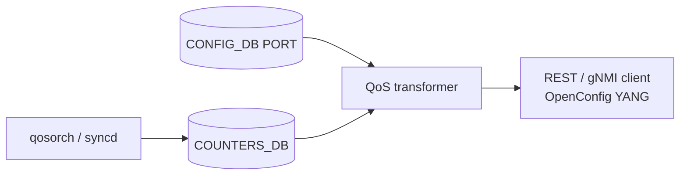

# OpenConfig Model Support for SONiC QoS Feature

# High Level Design Document
#### Rev 0.1

# Table of Contents
  * [List of Tables](#list-of-tables)
  * [Revision](#revision)
  * [About This Manual](#about-this-manual)
  * [Related Documents](#related-documents)
  * [Scope](#scope)
  * [Definition/Abbreviation](#definitionabbreviation)
  * [1 Feature Overview](#1-feature-overview)
    * [1.1 Requirements](#11-requirements)
      * [1.1.1 Functional Requirements](#111-functional-requirements)
      * [1.1.2 Configuration and Management Requirements](#112-configuration-management-requirements)
      * [1.1.3 Scalability Requirements](#113-scalability-requirements)
    * [1.2 Design Overview](#12-design-overview)
      * [1.2.1 Basic Approach](#121-basic-approach)
      * [1.2.2 Container](#122-container)
  * [2 Functionality](#2-functionality)
      * [2.1 Target Deployment Use Cases](#21-target-deployment-use-cases)
  * [3 Design](#3-design)
    * [3.1 Overview](#31-overview)
      * [3.1.1 SONiC Feature YANG and CONFIG_DB](#311-sonic-feature-yang-and-config_db)
      * [3.1.2 OpenConfig Modules](#312-openconfig-modules)
      * [3.1.3 UMF Translation (REST/gNMI to CONFIG_DB)](#313-umf-translation-restgnmi-to-config_db)
      * [3.1.4 Southbound Programming](#314-southbound-programming)
      * [3.1.5 Mapping Table and Unit Tests](#315-mapping-table-and-unit-tests)
    * [3.2 DB Changes](#32-db-changes)
      * [3.2.1 CONFIG DB](#321-config-db)
      * [3.2.2 APP DB](#322-app-db)
      * [3.2.3 STATE DB](#323-state-db)
      * [3.2.4 ASIC DB](#324-asic-db)
      * [3.2.5 COUNTER DB](#325-counter-db)
  * [4 OpenConfig to SONiC Mapping Table](#4-openconfig-to-sonic-mapping-table)
    * [4.1 Interface](#41-interface)
    * [4.2 Interface Reference](#42-interface-reference)
    * [4.3 Queue](#43-queue)
    * [4.4 Queue State Counters](#44-queue-state-counters)
  * [5 User Interface](#5-user-interface)
    * [5.1 Data Models](#51-data-models)
    * [5.2 REST API Support](#52-rest-api-support)
      * [5.2.1 GET](#521-get)
      * [5.2.2 PUT](#522-put)
      * [5.2.3 POST](#523-post)
      * [5.2.4 PATCH](#524-patch)
      * [5.2.5 DELETE](#525-delete)
    * [5.3 gNMI Support](#53-gnmi-support)
      * [5.3.1 GET](#531-get)
      * [5.3.2 SET](#532-set)
      * [5.3.3 DELETE](#533-delete)
      * [5.3.4 SUBSCRIBE](#534-subscribe)
  * [6 Error Handling](#6-error-handling)
  * [7 Unit Test Cases](#7-unit-test-cases)
    * [7.1 Functional Test Cases](#71-functional-test-cases)
    * [7.2 Negative Test Cases](#72-negative-test-cases)

# List of Tables
[Table 1: Abbreviations](#table-1-abbreviations)

[Table 2: Translation Flow Layers](#table-2-translation-flow-layers)

OpenConfig to SONiC mapping tables: [Section 4](#4-openconfig-to-sonic-mapping-table)

# Revision
| Rev | Date | Author | Change Description |
|:---:|:-----------:|:---------------------:|-----------------------------------|
| 0.1 | 09/17/2026 | Anukul Verma | Initial version. |

# About this Manual
This document provides general information about the OpenConfig management of QoS in SONiC corresponding to the openconfig-qos.yang module. It describes how OpenConfig **per-queue egress counters** are read from COUNTERS_DB over REST and gNMI. Current HLD and implementation scope is **GET and Subscribe only** (SAMPLE). OpenConfig QoS configuration (classifiers, forwarding-groups, global queues, scheduler-policies, buffer-allocation-profiles, queue-management-profiles, packet-trim, interface input, and output scheduler/classifiers) is not supported.

QoS operational state is queried under:
/qos

# Related Documents
| Document | Description |
|----------|-------------|
| Management Framework.md | UMF architecture (REST, gNMI, translib, transformers) |

# Scope
- This document describes the high level design of OpenConfig **QoS** operational-state mapping in SONiC.
- **In scope:** REST and gNMI GET, and gNMI Subscribe (SAMPLE), on supported `/qos` YANG paths. Physical PORT interfaces that have at least one `COUNTERS_QUEUE_NAME_MAP` entry; per-queue egress counters from COUNTERS_DB `COUNTERS:<oid>`.
- **Out of scope:** SONiC KLISH CLI and native SONiC CLI for QoS; OpenConfig SET/POST/PUT/PATCH/DELETE on `/qos`; `/qos/config` and `/qos/state`; classifiers, forwarding-groups, global queues, scheduler-policies, buffer-allocation-profiles, queue-management-profiles, packet-trim; interface `input`; output `config`/`state`, classifiers, and scheduler-policy; queue `queue-management-profile`, `max-queue-len`, `avg-queue-len`, `ecn-selected-pkts`, `ecn-selected-octets`; `interface-ref` config and `subinterface`; PortChannel, VLAN, and dotted subinterface ids.
- OpenConfig xpath root:
  `/qos`
- Supported attributes in OpenConfig YANG tree (reflecting current UMF implementation):

```
module: openconfig-qos
+--rw qos
   +--rw interfaces
      +--rw interface* [interface-id]
         +--rw interface-id    -> ../config/interface-id
         +--rw config
         |  +--rw interface-id?   string
         +--ro state
         |  +--ro interface-id?   string
         +--rw interface-ref
         |  +--ro state
         |     +--ro interface?      -> /oc-if:interfaces/interface/name
         +--rw output
            +--rw queues
               +--rw queue* [name]
                  +--rw name      -> ../config/name
                  +--rw config
                  |  +--rw name?   string
                  +--ro state
                     +--ro name?                 string
                     +--ro transmit-pkts?        oc-yang:counter64
                     +--ro transmit-octets?      oc-yang:counter64
                     +--ro dropped-pkts?         oc-yang:counter64
                     +--ro dropped-octets?       oc-yang:counter64
                     +--ro ecn-marked-pkts?      oc-yang:counter64
                     +--ro ecn-marked-octets?    oc-yang:counter64
```

# Definition/Abbreviation
### Table 1: Abbreviations

| **Term** | **Definition** |
|----------|----------------|
| YANG | Yet Another Next Generation: modular language representing data structures in an XML tree format |
| gNMI | gRPC Network Management Interface: used to retrieve or manipulate the state of a device via telemetry or configuration data |
| UMF | Unified Management Framework (REST, gNMI, translib) |
| QoS | Quality of Service |
| SAI | Switch Abstraction Interface |
| ECN | Explicit Congestion Notification |

# 1 Feature Overview
## 1.1 Requirements
### 1.1.1 Functional Requirements
1. Expose OpenConfig QoS **per-queue egress counters** for physical ports over REST and gNMI GET.
2. Support gNMI Subscribe in SAMPLE mode on the mapped queue counter tree.
3. Hide interfaces that have no queue OID mapping; omit individual counter leaves whose SAI field is absent (do not invent zeros).

### 1.1.2 Configuration and Management Requirements
OpenConfig `/qos` is read-only. Get and Subscribe are supported on the mapped paths. Set, POST, PUT, PATCH, and DELETE return an error. QoS policy configuration remains native SONiC (CONFIG_DB scheduler/WRED/queue tables), not this OpenConfig tree.

### 1.1.3 Scalability Requirements
The number of OpenConfig queue list entries tracks `COUNTERS_QUEUE_NAME_MAP` fields (`<port>:<qid>`) for ports that also exist in CONFIG_DB `PORT`.

## 1.2 Design Overview
### 1.2.1 Basic Approach
UMF maps `/qos` queue egress counters from COUNTERS_DB. Interface list membership is CONFIG_DB `PORT` filtered by `COUNTERS_QUEUE_NAME_MAP`. Queue counters are SAI fields on `COUNTERS:<queue-oid>`.

### 1.2.2 Container
Implementation is in **sonic-mgmt-common** (REST server in the Management Framework container; gNMI server in the gnmi container).

# 2 Functionality
## 2.1 Target Deployment Use Cases

1. **REST clients** — GET on QoS RESTCONF paths. Orchestration systems are one example.
2. **gNMI clients** — Capabilities, Get, and Subscribe (SAMPLE) on QoS gNMI paths. Telemetry consumers are examples.

# 3 Design
## 3.1 Overview
This HLD follows Management Framework.md. The design covers: COUNTERS_DB schema, OpenConfig modules, UMF translation, mapping tables (Section 4), and unit tests (Section 7).

### 3.1.1 SONiC Feature YANG and CONFIG_DB
This OpenConfig mapping does **not** write QoS policy into CONFIG_DB and does not use a dedicated `sonic-qos.yang` schema for the counter path. Interface keys are existing physical ports:

| Item | Detail |
|------|--------|
| CONFIG_DB table (membership) | `PORT` (`sonic-port.yang`) |
| COUNTERS_DB map | `COUNTERS_QUEUE_NAME_MAP` — Redis hash, field `<port>:<qid>` → queue OID (no SONiC YANG model) |
| COUNTERS_DB stats | `COUNTERS` — key is the queue OID |
| Mapped SAI fields | `SAI_QUEUE_STAT_PACKETS`, `SAI_QUEUE_STAT_BYTES`, `SAI_QUEUE_STAT_DROPPED_PACKETS`, `SAI_QUEUE_STAT_DROPPED_BYTES`, `SAI_QUEUE_STAT_WRED_ECN_MARKED_PACKETS`, `SAI_QUEUE_STAT_WRED_ECN_MARKED_BYTES` |

OpenConfig clients never write these tables. COUNTERS_DB examples are in [§3.2.5](#325-counter-db).

### 3.1.2 OpenConfig Modules
| Module | Source | Role for QoS |
|--------|--------|----------------|
| [openconfig-qos.yang](https://github.com/openconfig/public/blob/master/release/models/qos/openconfig-qos.yang) | openconfig/public | Base QoS container (`qos`), version 2.1.0 as loaded |
| [openconfig-qos-interfaces.yang](https://github.com/openconfig/public/blob/master/release/models/qos/openconfig-qos-interfaces.yang) | openconfig/public | Interface and queue subtrees |
| [openconfig-qos-elements.yang](https://github.com/openconfig/public/blob/master/release/models/qos/openconfig-qos-elements.yang) | openconfig/public | Classifiers, schedulers, queues (not mapped) |
| [openconfig-qos-mem-mgmt.yang](https://github.com/openconfig/public/blob/master/release/models/qos/openconfig-qos-mem-mgmt.yang) | openconfig/public | Buffer / queue-management (not mapped) |
| [openconfig-qos-types.yang](https://github.com/openconfig/public/blob/master/release/models/qos/openconfig-qos-types.yang) | openconfig/public | QoS types |
| openconfig-qos-annot.yang | sonic-mgmt-common | XPath to COUNTERS_DB / PORT bindings |
| openconfig-qos-deviation.yang | sonic-mgmt-common | `not-supported` deviations |

### 3.1.3 UMF Translation (REST/gNMI to CONFIG_DB)
OpenConfig GET/SUBSCRIBE requests for `/qos` are handled by translib and the **transformer** common app. Annotation YANG binds `/qos/interfaces/interface` to CONFIG_DB `PORT` and `/output/queues/queue` to COUNTERS_DB. Queue list GET enumerates `COUNTERS_QUEUE_NAME_MAP` and fills counters from `COUNTERS:<oid>`.


*Figure: Management Framework architecture ([Management Framework.md](https://github.com/sonic-net/SONiC/blob/master/doc/mgmt/Management%20Framework.md)).*

#### Table 2: Translation Flow Layers

| Layer | Artifact | Role |
|-------|----------|------|
| **1. SONiC port YANG** | `sonic-port.yang` | CONFIG_DB `PORT` schema (interface list membership) |
| **2. OpenConfig modules** | `openconfig-qos.yang` and submodules | Northbound client model |
| **3. UMF annotations** | `openconfig-qos-annot.yang` | XPath → PORT / COUNTERS_DB bindings |
| **4. UMF transformers** | QoS transformers | DbToYang / Subscribe for interface-ref and queues |
| **5. COUNTERS_DB** | `COUNTERS_QUEUE_NAME_MAP`, `COUNTERS` | Queue OID map and SAI stats |
| **6. qosorch / syncd** | QoS / SAI agents | Populate queue OIDs and counters |



### 3.1.4 Southbound Programming
qosorch and syncd program ASIC queues and publish `COUNTERS_QUEUE_NAME_MAP` plus `COUNTERS:<oid>` in COUNTERS_DB. This `/qos` OpenConfig module **reads** those tables only; it does not program schedulers, WRED, or maps.

### 3.1.5 Mapping Table and Unit Tests
- **OpenConfig → SONiC mapping:** [Section 4](#4-openconfig-to-sonic-mapping-table).
- **REST/gNMI examples:** [Section 5](#5-user-interface).
- **Unit tests:** [Section 7](#7-unit-test-cases).

## 3.2 DB Changes
OpenConfig QoS uses existing CONFIG_DB `PORT` and COUNTERS_DB tables. No new tables are added.

### 3.2.1 CONFIG DB
Physical ports used for `/qos/interfaces/interface` membership. Example:

```
PORT|Ethernet0
  alias:        Ethernet0
  admin_status: up
```

A PORT row is listed under `/qos` only when `COUNTERS_QUEUE_NAME_MAP` has at least one `<port>:<qid>` field for that port.

### 3.2.2 APP DB
No APP DB tables are used for OpenConfig `/qos`.

### 3.2.3 STATE DB
No STATE DB tables are used for OpenConfig `/qos`.

### 3.2.4 ASIC DB
No ASIC DB tables are used for OpenConfig `/qos`.

### 3.2.5 COUNTER DB
`COUNTERS_QUEUE_NAME_MAP` is a single Redis hash (empty key). Each field is `<port>:<qid>` and the value is the queue OID. `COUNTERS` is keyed by that OID.

```
COUNTERS_QUEUE_NAME_MAP
  Ethernet0:0  oid:0x15000000000001
  Ethernet0:1  oid:0x15000000000002

COUNTERS|oid:0x15000000000001
  SAI_QUEUE_STAT_PACKETS:                 100
  SAI_QUEUE_STAT_BYTES:                   10000
  SAI_QUEUE_STAT_DROPPED_PACKETS:         5
  SAI_QUEUE_STAT_DROPPED_BYTES:           500
  SAI_QUEUE_STAT_WRED_ECN_MARKED_PACKETS: 3
  SAI_QUEUE_STAT_WRED_ECN_MARKED_BYTES:   300
```

A missing SAI field is omitted from the OpenConfig `/state` container. GET of that leaf is not found. An explicit Redis value `0` is returned as OpenConfig `0` (zero is a real counter, not absent).

# 4 OpenConfig to SONiC Mapping Table
**COUNTERS_DB tables:** `COUNTERS_QUEUE_NAME_MAP`, `COUNTERS`  
**CONFIG_DB table (membership):** `PORT`  
**NAME_MAP field pattern:** `<ifname>:<qid>`

**Conventions:**
- Each subsection maps one OpenConfig container or list. Paths are shown as an indented tree; placeholders: `<ifname>`, `<qid>`.
- Interface list membership is CONFIG_DB `PORT`. Queue list keys and counters are COUNTERS_DB. GET and Subscribe of counters are **operational state**, not a config replica. Interface and queue `config`/`name` leaves on GET are list-key mirrors, not writable QoS policy.
- `counter64` values are JSON strings (RFC 7951).

## 4.1 Interface
**OpenConfig path:**
```
/qos/interfaces
     interface[interface-id=<ifname>]
          config
          state
```
| OpenConfig leaf | DB Name | Table:Field | Notes |
|-----------------|---------|-------------|-------|
| interface-id (list key) | CONFIG_DB | PORT:`<ifname>` | Listed only if `COUNTERS_QUEUE_NAME_MAP` has `<ifname>:<qid>` |
| interface-id (config/state) | CONFIG_DB | PORT key | Mirrored from the list key on GET |

GET of `/qos` or `/qos/interfaces` with no NAME_MAP entries returns empty JSON. GET of `interface[interface-id=<ifname>]` when the port has no NAME_MAP fields, or is not a CONFIG_DB `PORT` row (PortChannel, dotted subinterface, unknown id), is not found.

## 4.2 Interface Reference
**OpenConfig path:**
```
/qos/interfaces/interface[interface-id=<ifname>]/interface-ref
     state
```
| OpenConfig leaf | DB Name | Table:Field | Notes |
|-----------------|---------|-------------|-------|
| interface | — | derived | Same as parent list key `<ifname>` |

`interface-ref/config` and `state/subinterface` are not supported.

## 4.3 Queue
**OpenConfig path:**
```
/qos/interfaces/interface[interface-id=<ifname>]/output/queues
     queue[name=<qid>]
          config
          state
```
| OpenConfig leaf | DB Name | Table:Field | Notes |
|-----------------|---------|-------------|-------|
| name (list key) | COUNTERS_DB | `COUNTERS_QUEUE_NAME_MAP` field `<ifname>:<qid>` | Queue index string (for example `0`) |
| name (config/state) | COUNTERS_DB | same field | Mirrored from the list key on GET |

`queue-management-profile` on config and state is not supported.

## 4.4 Queue State Counters
**OpenConfig path:**
```
/qos/interfaces/interface[interface-id=<ifname>]/output/queues
     queue[name=<qid>]/state
```
| OpenConfig leaf | DB Name | Table:Field | Notes |
|-----------------|---------|-------------|-------|
| transmit-pkts | COUNTERS_DB | COUNTERS:`SAI_QUEUE_STAT_PACKETS` | Skip if field absent |
| transmit-octets | COUNTERS_DB | COUNTERS:`SAI_QUEUE_STAT_BYTES` | Skip if field absent |
| dropped-pkts | COUNTERS_DB | COUNTERS:`SAI_QUEUE_STAT_DROPPED_PACKETS` | Skip if field absent |
| dropped-octets | COUNTERS_DB | COUNTERS:`SAI_QUEUE_STAT_DROPPED_BYTES` | Skip if field absent |
| ecn-marked-pkts | COUNTERS_DB | COUNTERS:`SAI_QUEUE_STAT_WRED_ECN_MARKED_PACKETS` | Skip if field absent |
| ecn-marked-octets | COUNTERS_DB | COUNTERS:`SAI_QUEUE_STAT_WRED_ECN_MARKED_BYTES` | Skip if field absent |

`COUNTERS` key is the OID from `COUNTERS_QUEUE_NAME_MAP[<ifname>:<qid>]`. Container GET includes only present leaves. Leaf GET of an absent SAI field is not found.

# 5 User Interface
## 5.1 Data Models
| Module | Source | Role |
|--------|--------|------|
| [openconfig-qos.yang](https://github.com/openconfig/public/blob/master/release/models/qos/openconfig-qos.yang) | openconfig/public | Base QoS container |
| openconfig-qos-annot.yang | sonic-mgmt-common | XPath to PORT and COUNTERS_DB bindings |
| openconfig-qos-deviation.yang | sonic-mgmt-common | `not-supported` deviations |

## 5.2 REST API Support
Examples below use paths and payloads validated by unit tests (documentation prefixes substituted). RESTCONF URL encoding uses `=` separators; gNMI uses bracket notation (see §5.3). Scope is GET only.

### 5.2.1 GET
Supported at `/qos`, `/qos/interfaces`, interface, `interface-ref`, `output/queues`, queue, `/state`, and individual mapped counter leaves.

```
curl -X GET -k "https://<device>/restconf/data/openconfig-qos:qos" -H "accept: application/yang-data+json"
```

```
curl -X GET -k "https://<device>/restconf/data/openconfig-qos:qos/interfaces/interface=Ethernet0" -H "accept: application/yang-data+json"
```

```
curl -X GET -k "https://<device>/restconf/data/openconfig-qos:qos/interfaces/interface=Ethernet0/interface-ref" -H "accept: application/yang-data+json"
```

```
curl -X GET -k "https://<device>/restconf/data/openconfig-qos:qos/interfaces/interface=Ethernet0/output/queues/queue=0/state" -H "accept: application/yang-data+json"
```

Example GET `/state` body (all six SAI fields present):

```json
{
  "openconfig-qos:state": {
    "name": "0",
    "transmit-pkts": "100",
    "transmit-octets": "10000",
    "dropped-pkts": "5",
    "dropped-octets": "500",
    "ecn-marked-pkts": "3",
    "ecn-marked-octets": "300"
  }
}
```

Example GET `/state` when ECN SAI fields are absent (leaves omitted, not zero):

```json
{
  "openconfig-qos:state": {
    "name": "1",
    "transmit-pkts": "200",
    "transmit-octets": "20000",
    "dropped-pkts": "10",
    "dropped-octets": "1000"
  }
}
```

```
curl -X GET -k "https://<device>/restconf/data/openconfig-qos:qos/interfaces/interface=Ethernet0/output/queues/queue=0/state/transmit-pkts" -H "accept: application/yang-data+json"
```

returns `{"openconfig-qos:transmit-pkts": "100"}`.

### 5.2.2 PUT
Not supported. OpenConfig QoS configuration containers under `/qos` are `not-supported`.

### 5.2.3 POST
Not supported.

### 5.2.4 PATCH
Not supported.

### 5.2.5 DELETE
Not supported.

## 5.3 gNMI Support
Use `--target OC-YANG`.

### 5.3.1 GET

```
gnmic -a <device>:<port> --insecure --target OC-YANG get \
  --path "/openconfig-qos:qos/interfaces/interface[interface-id=Ethernet0]/output/queues/queue[name=0]/state"
```

### 5.3.2 SET
Not supported.

### 5.3.3 DELETE
Not supported.

### 5.3.4 SUBSCRIBE
Subscribe is SAMPLE only (`subscribe-on-change` disabled on the queue tree). Minimum sample interval is 5 seconds. Wildcard interface and queue keys are permitted.

```
gnmic -a <device>:<port> --insecure --target OC-YANG subscribe \
  --path "/openconfig-qos:qos/interfaces/interface[interface-id=*]/output/queues/queue[name=*]/state/transmit-pkts" \
  --mode stream --stream-mode sample --sample-interval 5s
```

# 6 Error Handling
- GET of a PORT that has no `COUNTERS_QUEUE_NAME_MAP` fields, a PortChannel or dotted subinterface id, or an unknown interface id is rejected (not found).
- GET of a queue index that is not in `COUNTERS_QUEUE_NAME_MAP` for that port is rejected (not found).
- GET of a mapped counter leaf whose SAI field is missing on `COUNTERS:<oid>` is rejected (not found). Container GET of `/state` omits that leaf.
- GET of `/qos` or `/qos/interfaces` with an empty NAME_MAP returns empty JSON (not an error). GET of the unkeyed `interface` or `queue` list in that case is rejected (not found).
- SET/POST/PUT/PATCH/DELETE on `/qos` configuration paths is not supported (`not-supported` deviations).
- Unmapped QoS containers (classifiers, schedulers, buffer profiles, and others listed in Scope) are not supported.

# 7 Unit Test Cases
Section 7 summarizes generic functional and negative scenarios for REST and gNMI paths under `/qos`.

## 7.1 Functional Test Cases

**Container and interface GET**

- GET `/qos`, `/qos/interfaces`, and `interface[interface-id=Ethernet0]` including `config/interface-id`, `state/interface-id`, `interface-ref/state/interface`, and `output/queues`.
- Wildcard `interface` list includes every PORT that has at least one NAME_MAP field (multiple ports).

**Queue counters**

- GET `queue[name=0]/state` and each mapped leaf (`transmit-pkts`, `transmit-octets`, `dropped-pkts`, `dropped-octets`, `ecn-marked-pkts`, `ecn-marked-octets`).
- GET `/state` when ECN SAI fields are absent: those leaves omitted; remaining counters still returned.
- GET a leaf whose Redis value is `0` returns `0`.

**Subscribe**

- gNMI Subscribe SAMPLE on `interface[interface-id=*]` / `queue[name=*]` counter leaves.

## 7.2 Negative Test Cases

**Validation**

1. GET unknown queue index or unknown interface rejected (not found).
2. GET PortChannel or dotted subinterface id rejected (not found).
3. GET PORT with no NAME_MAP fields rejected (not found); wildcard list omits that port.
4. GET NAME_MAP port with no CONFIG_DB PORT row rejected (not found).
5. GET absent ECN (or other) counter leaf rejected (not found).
6. Empty NAME_MAP: GET `/qos` and `/qos/interfaces` return empty JSON; GET unkeyed list or keyed instance (and paths beneath it) rejected (not found).
7. Configuration SET on `/qos` not supported.
