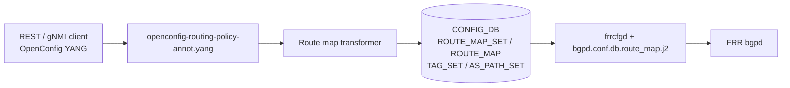

# OpenConfig Model Support for SONiC Route Map Feature

# High Level Design Document
#### Rev 0.1

# Table of Contents
  * [List of Tables](#list-of-tables)
  * [Revision](#revision)
  * [About This Manual](#about-this-manual)
  * [Related Documents](#related-documents)
  * [Scope](#scope)
  * [Definition/Abbreviation](#definitionabbreviation)
  * [1 Feature Overview](#1-feature-overview)
    * [1.1 Requirements](#11-requirements)
      * [1.1.1 Functional Requirements](#111-functional-requirements)
      * [1.1.2 Configuration and Management Requirements](#112-configuration-and-management-requirements)
      * [1.1.3 Scalability Requirements](#113-scalability-requirements)
    * [1.2 Design Overview](#12-design-overview)
      * [1.2.1 Basic Approach](#121-basic-approach)
      * [1.2.2 Container](#122-container)
  * [2 Functionality](#2-functionality)
      * [2.1 Target Deployment Use Cases](#21-target-deployment-use-cases)
  * [3 Design](#3-design)
    * [3.1 Overview](#31-overview)
      * [3.1.1 SONiC Feature YANG and CONFIG_DB](#311-sonic-feature-yang-and-config_db)
      * [3.1.2 OpenConfig Modules](#312-openconfig-modules)
      * [3.1.3 UMF Translation (REST/gNMI to CONFIG_DB)](#313-umf-translation-restgnmi-to-config_db)
      * [3.1.4 FRR Programming (frrcfgd and Templates)](#314-frr-programming-frrcfgd-and-templates)
      * [3.1.5 OpenConfig Extensions](#315-openconfig-extensions)
      * [3.1.6 Mapping Table and Unit Tests](#316-mapping-table-and-unit-tests)
    * [3.2 DB Changes](#32-db-changes)
      * [3.2.1 CONFIG DB](#321-config-db)
      * [3.2.2 APP DB](#322-app-db)
      * [3.2.3 STATE DB](#323-state-db)
      * [3.2.4 ASIC DB](#324-asic-db)
      * [3.2.5 COUNTER DB](#325-counter-db)
  * [4 OpenConfig to SONiC Mapping Table](#4-openconfig-to-sonic-mapping-table)
    * [4.1 Policy Definition](#41-policy-definition)
    * [4.2 Statement](#42-statement)
    * [4.3 Conditions](#43-conditions)
    * [4.4 Actions](#44-actions)
    * [4.5 Tag Set](#45-tag-set)
    * [4.6 AS Path Set](#46-as-path-set)
  * [5 User Interface](#5-user-interface)
    * [5.1 Data Models](#51-data-models)
    * [5.2 REST API Support](#52-rest-api-support)
      * [5.2.1 GET](#521-get)
      * [5.2.2 PUT](#522-put)
      * [5.2.3 POST](#523-post)
      * [5.2.4 PATCH](#524-patch)
      * [5.2.5 DELETE](#525-delete)
    * [5.3 gNMI Support](#53-gnmi-support)
      * [5.3.1 GET](#531-get)
      * [5.3.2 SET](#532-set)
      * [5.3.3 DELETE](#533-delete)
      * [5.3.4 SUBSCRIBE](#534-subscribe)
  * [6 Error Handling](#6-error-handling)
  * [7 Unit Test Cases](#7-unit-test-cases)
    * [7.1 Functional Test Cases](#71-functional-test-cases)
    * [7.2 Negative Test Cases](#72-negative-test-cases)

# List of Tables
[Table 1: Abbreviations](#table-1-abbreviations)

[Table 2: Translation Flow Layers](#table-2-translation-flow-layers)

OpenConfig to SONiC mapping tables: [Section 4](#4-openconfig-to-sonic-mapping-table)

# Revision
| Rev | Date | Author | Change Description |
|:---:|:-----------:|:---------------------:|-----------------------------------|
| 0.1 | 07/23/2026 | Raja Kushwah, Anukul Verma | Initial version |

# About this Manual
This document provides general information about the OpenConfig configuration and management of Route Map (routing policy) in SONiC corresponding to the openconfig-routing-policy.yang module (policy-definitions under routing-policy). It describes how OpenConfig models are translated to SONiC CONFIG_DB entries and FRR bgpd route-map configuration, and how operational state is returned over REST and gNMI.

Route maps and related defined sets are configured under:
/routing-policy/policy-definitions
/routing-policy/defined-sets/tag-sets
/routing-policy/defined-sets/bgp-defined-sets/as-path-sets

# Related Documents
| Document | Description |
|----------|-------------|
| Management Framework.md | UMF architecture (REST, gNMI, translib, transformers) |
| OpenConfig_PrefixList.md | Prefix sets referenced by route-map match conditions |
| OpenConfig_BGPCommunity.md | Community and extended-community sets referenced by match/set actions |
| Openconfig_BGP.md | BGP neighbors and redistribution that attach route maps |

# Scope
- This document describes the high level design of OpenConfig **Route Map** configuration and operational retrieval in SONiC.
- **In scope:** REST and gNMI — Get, Set (POST/PUT/PATCH), Delete, and Subscribe on supported route-map (`policy-definition` / `statement`) YANG paths; `defined-sets/tag-sets` and `defined-sets/bgp-defined-sets/as-path-sets`; match conditions and set-actions documented in the Scope tree; flow control (`on-match-next`, `on-match-goto-statement`, `next-statement`).
- **Out of scope:** SONiC KLISH CLI and native SONiC CLI for route maps; `prefix-sets`, `community-sets`, and `ext-community-sets` — covered in separate HLDs; route-map match conditions reference those sets by name (leafref) only; `bgp-conditions/ext-community-count` (not implemented in UMF).
- OpenConfig xpath roots:
  `/routing-policy/policy-definitions`
  `/routing-policy/defined-sets/tag-sets`
  `/routing-policy/defined-sets/bgp-defined-sets/as-path-sets`
- Supported attributes in OpenConfig YANG tree (reflecting current UMF implementation):

```
module: openconfig-routing-policy
        (+ openconfig-bgp-policy,
           openconfig-routing-policy-ext)
+--rw routing-policy
   +--rw defined-sets
   |  +--rw tag-sets
   |  |  +--rw tag-set* [name]
   |  |     +--rw name                     -> ../config/name
   |  |     +--rw config
   |  |     |  +--rw name?                 string
   |  |     |  +--rw tag-value*            tag-type
   |  |     +--ro state
   |  |        +--ro name?                 string
   |  |        +--ro tag-value*             tag-type
   |  +--rw oc-bgp-pol:bgp-defined-sets
   |     +--rw oc-bgp-pol:as-path-sets
   |        +--rw oc-bgp-pol:as-path-set* [as-path-set-name]
   |           +--rw oc-bgp-pol:as-path-set-name    -> ../config/as-path-set-name
   |           +--rw oc-bgp-pol:config
   |           |  +--rw oc-bgp-pol:as-path-set-name?     string
   |           |  +--rw oc-bgp-pol:as-path-set-member*   string
   |           |  +--rw oc-rp-ext:action?                action-type
   |           +--ro oc-bgp-pol:state
   |              +--ro oc-bgp-pol:as-path-set-name?     string
   |              +--ro oc-bgp-pol:as-path-set-member*   string
   |              +--ro oc-rp-ext:action?                action-type
   +--rw policy-definitions
      +--rw policy-definition* [name]
         +--rw name                     -> ../config/name
         +--rw config
         |  +--rw name?                 string
         +--ro state
         |  +--ro name?                 string
         +--rw statements
            +--rw statement* [name]
               +--rw name               -> ../config/name
               +--rw config
               |  +--rw name?                 string
               |  +--rw oc-rp-ext:description? string
               +--ro state
               |  +--ro name?                 string
               |  +--ro oc-rp-ext:description? string
               +--rw conditions
               |  +--rw config
               |  |  +--rw call-policy?          leafref
               |  |  +--rw install-protocol-eq?  identityref (BGP | DIRECTLY_CONNECTED | STATIC)
               |  +--ro state
               |  |  +--ro call-policy?          leafref
               |  |  +--ro install-protocol-eq?  identityref
               |  +--rw match-interface
               |  |  +--rw config
               |  |  |  +--rw interface?   leafref
               |  |  +--ro state
               |  |     +--ro interface?   leafref
               |  +--rw match-prefix-set
               |  |  +--rw config
               |  |  |  +--rw prefix-set?   leafref
               |  |  +--ro state
               |  |     +--ro prefix-set?   leafref
               |  +--rw match-tag-set
               |  |  +--rw config
               |  |  |  +--rw tag-set?             leafref
               |  |  +--ro state
               |  |     +--ro tag-set?             leafref
               |  +--rw oc-bgp-pol:bgp-conditions
               |     +--rw oc-bgp-pol:config
               |     |  +--rw oc-bgp-pol:local-pref-eq?               uint32
               |     |  +--rw oc-bgp-pol:med-eq?                      uint32
               |     |  +--rw oc-bgp-pol:origin-eq?                   identityref
               |     |  +--rw oc-rp-ext:match-nexthop-set?            leafref
               |     |  +--rw oc-rp-ext:match-src-network-instance?   string
               |     |  +--rw oc-rp-ext:match-neighbor*               string (max 1)
               |     +--ro oc-bgp-pol:state
               |     |  +--ro oc-bgp-pol:local-pref-eq?               uint32
               |     |  +--ro oc-bgp-pol:med-eq?                      uint32
               |     |  +--ro oc-bgp-pol:origin-eq?                   identityref
               |     |  +--ro oc-rp-ext:match-nexthop-set?            leafref
               |     |  +--ro oc-rp-ext:match-src-network-instance?   string
               |     |  +--ro oc-rp-ext:match-neighbor*               string (max 1)
               |     +--rw oc-bgp-pol:match-as-path-set
               |     |  +--rw oc-bgp-pol:config
               |     |  |  +--rw oc-bgp-pol:as-path-set?         leafref
               |     |  |  +--rw oc-bgp-pol:match-set-options?   match-set-options-type
               |     |  +--ro oc-bgp-pol:state
               |     |     +--ro oc-bgp-pol:as-path-set?         leafref
               |     |     +--ro oc-bgp-pol:match-set-options?   match-set-options-type
               |     +--rw oc-bgp-pol:match-community-set
               |     |  +--rw oc-bgp-pol:config
               |     |  |  +--rw oc-bgp-pol:community-set?   leafref
               |     |  +--ro oc-bgp-pol:state
               |     |     +--ro oc-bgp-pol:community-set?   leafref
               |     +--rw oc-bgp-pol:match-ext-community-set
               |        +--rw oc-bgp-pol:config
               |        |  +--rw oc-bgp-pol:ext-community-set?   leafref
               |        |  +--rw oc-bgp-pol:match-set-options?   match-set-options-type
               |        +--ro oc-bgp-pol:state
               |           +--ro oc-bgp-pol:ext-community-set?   leafref
               |           +--ro oc-bgp-pol:match-set-options?   match-set-options-type
               +--rw actions
                  +--rw config
                  |  +--rw policy-result?           enumeration (ACCEPT_ROUTE | REJECT_ROUTE)
                  |  +--rw oc-rp-ext:next-statement?          uint16
                  |  +--rw oc-rp-ext:on-match-next?           boolean
                  |  +--rw oc-rp-ext:on-match-goto-statement? uint16
                  +--ro state
                  |  +--ro policy-result?           enumeration
                  |  +--ro oc-rp-ext:next-statement?          uint16
                  |  +--ro oc-rp-ext:on-match-next?           boolean
                  |  +--ro oc-rp-ext:on-match-goto-statement? uint16
                  +--rw set-tag
                  |  +--rw config
                  |  |  +--rw mode?   enumeration (INLINE)
                  |  +--ro state
                  |  |  +--ro mode?   enumeration
                  |  +--rw inline
                  |     +--rw config
                  |     |  +--rw tag*   tag-type
                  |     +--ro state
                  |        +--ro tag*   tag-type
                  +--rw oc-bgp-pol:bgp-actions
                     +--rw oc-bgp-pol:config
                     |  +--rw oc-bgp-pol:set-route-origin?    identityref
                     |  +--rw oc-bgp-pol:set-local-pref?      uint32
                     |  +--rw oc-bgp-pol:set-next-hop?        union
                     |  +--rw oc-bgp-pol:set-med?             uint32
                     |  +--rw oc-bgp-pol:set-med-action?      enum (SET | ADD | SUBTRACT)
                     |  +--rw oc-rp-ext:set-source-address?   oc-inet:ip-address
                     +--ro oc-bgp-pol:state
                     |  +--ro oc-bgp-pol:set-route-origin?    identityref
                     |  +--ro oc-bgp-pol:set-local-pref?      uint32
                     |  +--ro oc-bgp-pol:set-next-hop?        union
                     |  +--ro oc-bgp-pol:set-med?             uint32
                     |  +--ro oc-bgp-pol:set-med-action?      enum
                     |  +--ro oc-rp-ext:set-source-address?   oc-inet:ip-address
                     +--rw oc-bgp-pol:set-as-path-prepend
                     |  +--rw oc-bgp-pol:config
                     |  |  +--rw oc-bgp-pol:repeat-n?      uint8
                     |  |  +--rw oc-bgp-pol:asn?           oc-inet:as-number
                     |  |  +--rw oc-rp-ext:asn-sequence?   string
                     |  +--ro oc-bgp-pol:state
                     |     +--ro oc-bgp-pol:repeat-n?      uint8
                     |     +--ro oc-bgp-pol:asn?           oc-inet:as-number
                     |     +--ro oc-rp-ext:asn-sequence?   string
                     +--rw oc-bgp-pol:set-community
                     |  +--rw oc-bgp-pol:config
                     |  |  +--rw oc-bgp-pol:method?    enum (INLINE | REFERENCE)
                     |  |  +--rw oc-bgp-pol:options?   enum (ADD)
                     |  +--ro oc-bgp-pol:state
                     |  |  +--ro oc-bgp-pol:method?    enum
                     |  |  +--ro oc-bgp-pol:options?   enum
                     |  +--rw oc-bgp-pol:inline
                     |  |  +--rw oc-bgp-pol:config
                     |  |  |  +--rw oc-bgp-pol:communities*   union
                     |  |  +--ro oc-bgp-pol:state
                     |  |     +--ro oc-bgp-pol:communities*   union
                     |  +--rw oc-bgp-pol:reference
                     |     +--rw oc-bgp-pol:config
                     |     |  +--rw oc-bgp-pol:community-set-refs*   leafref
                     |     +--ro oc-bgp-pol:state
                     |        +--ro oc-bgp-pol:community-set-refs*   leafref
                     +--rw oc-bgp-pol:set-ext-community
                     |  +--rw oc-bgp-pol:config
                     |  |  +--rw oc-bgp-pol:method?    enum (INLINE | REFERENCE)
                     |  |  +--rw oc-bgp-pol:options?   enum (REPLACE)
                     |  +--ro oc-bgp-pol:state
                     |  |  +--ro oc-bgp-pol:method?    enum
                     |  |  +--ro oc-bgp-pol:options?   enum
                     |  +--rw oc-bgp-pol:inline
                     |  |  +--rw oc-bgp-pol:config
                     |  |  |  +--rw oc-bgp-pol:communities*   union
                     |  |  +--ro oc-bgp-pol:state
                     |  |     +--ro oc-bgp-pol:communities*   union
                     |  +--rw oc-bgp-pol:reference
                     |     +--rw oc-bgp-pol:config
                     |     |  +--rw oc-bgp-pol:ext-community-set-refs*   leafref
                     |     +--ro oc-bgp-pol:state
                     |        +--ro oc-bgp-pol:ext-community-set-refs*   leafref
                     +--rw oc-rp-ext:set-large-community
                        +--rw oc-rp-ext:config
                        |  +--rw oc-rp-ext:method?    enum (INLINE)
                        |  +--rw oc-rp-ext:options?   enum (ADD)
                        +--ro oc-rp-ext:state
                        |  +--ro oc-rp-ext:method?    enum
                        |  +--ro oc-rp-ext:options?   enum
                        +--rw oc-rp-ext:inline
                           +--rw oc-rp-ext:config
                           |  +--rw oc-rp-ext:large-communities*   string
                           +--ro oc-rp-ext:state
                              +--ro oc-rp-ext:large-communities*   string
```

Extension leaves are documented in [Section 3.1.5 OpenConfig Extensions](#315-openconfig-extensions).

# Definition/Abbreviation
### Table 1: Abbreviations

| **Term** | **Definition** |
|--------------------------|-------------------------------------|
| YANG | Yet Another Next Generation: modular language representing data structures in an XML tree format |
| REST | REpresentative State Transfer |
| gNMI | gRPC Network Management Interface |
| UMF | Unified Management Framework (`sonic-mgmt-common`) |
| BGP | Border Gateway Protocol |
| MED | Multi-Exit Discriminator |
| VRF | Virtual Routing and Forwarding |
| CVL | Config Validation Library |
| FRR | Free Range Routing (bgpd) |

# 1 Feature Overview
## 1.1 Requirements
### 1.1.1 Functional Requirements
1. Expose SONiC route-map configuration through standard OpenConfig YANG models under `routing-policy/policy-definitions`.
2. Expose SONiC AS-path-set configuration through OpenConfig YANG models under `routing-policy/defined-sets/bgp-defined-sets/as-path-sets`.
3. Support tag-set match on route-map statements via `match-tag-set`; tag-set definitions are stored in CONFIG_DB `TAG_SET` and programmed by frrcfgd.
4. Support configuration and operational retrieval of route-map attributes under the OpenConfig policy-definition and statement YANG tree (see Scope and Section 4).
5. Support match conditions: prefix-set, community-set, ext-community-set, as-path-set, tag-set, local-pref, MED, origin, install-protocol, interface, call-policy, and SONiC-ext conditions (next-hop-set, source network-instance, neighbor).
6. Support BGP set-actions: next-hop (IPv4/IPv6/PREFER_GLOBAL), set-community (INLINE/REFERENCE), set-ext-community (INLINE/REFERENCE), set-large-community (INLINE), AS-path prepend (asn / repeat-n / asn-sequence), local-pref, MED (SET/ADD/SUBTRACT), route-origin, set-source-address; and protocol-agnostic `set-tag`.
7. Support flow control: `on-match-next`, `on-match-goto-statement`, and `next-statement`.
8. Provide REST Get, Post, Put, Patch, and Delete, and gNMI Get, Set, Delete, and Subscribe on all mapped route-map and AS-path-set paths; `match-tag-set` on route-map statements.

### 1.1.2 Configuration and Management Requirements
Route maps are configured and queried only through REST and gNMI via the Unified Management Framework (UMF). KLISH and native SONiC CLI are out of scope for this document. Unsupported operations return an error through existing UMF error handling; no new management interfaces are introduced.

### 1.1.3 Scalability Requirements
Route-map scale follows the existing CONFIG_DB `ROUTE_MAP_SET` / `ROUTE_MAP` schema and platform limits for the number of route-maps and statements (and their match/set attributes) per route-map.

## 1.2 Design Overview
### 1.2.1 Basic Approach
SONiC already programs route maps from CONFIG_DB into FRR bgpd through **frrcfgd** and boot-time Jinja2 templates. This feature adds a northbound OpenConfig view: REST/gNMI clients configure OpenConfig YANG; UMF transformers translate requests into existing CONFIG_DB `ROUTE_MAP_SET` and `ROUTE_MAP` rows; frrcfgd applies configuration to FRR from CONFIG_DB changes.

### 1.2.2 Container
Implementation changes are in **sonic-mgmt-common** (REST server in the Management Framework container and gNMI server in the gnmi container: annotations, transformers) and **sonic-frr-mgmt-framework** (frrcfgd runtime mapping and `bgpd.conf.db.route_map.j2` boot template).

# 2 Functionality
## 2.1 Target Deployment Use Cases
All northbound clients configure and query route maps using OpenConfig YANG over REST or gNMI.

1. **REST clients** — GET, POST, PUT, PATCH, and DELETE on route-map RESTCONF paths under `policy-definitions`. Orchestration systems are one example.
2. **gNMI clients** — Capabilities, Get, Set (update/delete), and Subscribe (stream) on route-map gNMI paths. Controllers and telemetry consumers are examples.

# 3 Design
## 3.1 Overview
This HLD follows Management Framework.md. The design covers: SONiC feature YANG, OpenConfig modules, UMF translation, CONFIG_DB, FRR programming, mapping tables (Section 4), and unit tests (Section 7).

### 3.1.1 SONiC Feature YANG and CONFIG_DB
SONiC defines the southbound schema in `sonic-route-map.yang` and `sonic-routing-policy-sets.yang`:

| Item | Detail |
|------|--------|
| CONFIG_DB tables | `ROUTE_MAP_SET`, `ROUTE_MAP`, `TAG_SET`, `AS_PATH_SET` |
| `ROUTE_MAP_SET` key | `{name}` |
| `ROUTE_MAP` key | `{name}\|{stmt_name}` (statement sequence number, uint16 1..65535) |
| `TAG_SET` key | `{name}` |
| `TAG_SET` leaves | `tag_value@` (leaf-list of tag values) |
| `AS_PATH_SET` key | `{name}` |
| `AS_PATH_SET` leaves | `as_path_set_member@` (leaf-list), `action` (`permit` / `deny`) |
| `ROUTE_MAP` leaves | `route_operation`, `description`, match leaves (`match_prefix_set`, `match_ipv6_prefix_set`, `match_community`, `match_ext_community`, `match_as_path`, `match_interface`, `match_protocol`, `match_next_hop_set`, `match_src_vrf`, `match_neighbor@`, `match_tag`, `match_local_pref`, `match_med`, `match_origin`, `call_route_map`), set leaves (`set_next_hop`, `set_ipv6_next_hop_global`, `set_ipv6_next_hop_prefer_global`, `set_community_inline`, `set_community_ref`, `set_ext_community_inline`, `set_ext_community_ref`, `set_large_community_inline`, `set_local_pref`, `set_med`, `set_metric`, `set_metric_action`, `set_origin`, `set_asn`, `set_repeat_asn`, `set_asn_list`, `set_tag`, `set_src`), flow-control leaves (`next_statement`, `on_match_next`, `on_match_goto_statement`) |
| Out of scope | `PROTOCOL_ROUTE_MAP` (protocol-level route-map attachment; see Openconfig_BGP.md) |

OpenConfig clients never write CONFIG_DB directly; UMF transformers populate `ROUTE_MAP_SET`, `ROUTE_MAP`, `TAG_SET`, and `AS_PATH_SET` from OpenConfig payloads. CONFIG_DB examples are in [§3.2.1](#321-config-db).

### 3.1.2 OpenConfig Modules
| Module | Source | Role for route maps |
|--------|--------|------------------------|
| [openconfig-routing-policy.yang](https://github.com/openconfig/public/blob/master/release/models/policy/openconfig-routing-policy.yang) | openconfig/public | Base `policy-definitions` / `statement` tree: conditions, actions, `set-tag` |
| [openconfig-bgp-policy.yang](https://github.com/openconfig/public/blob/master/release/models/bgp/openconfig-bgp-policy.yang) | openconfig/public | BGP `bgp-conditions` and `bgp-actions` augment on statements |
| openconfig-routing-policy-ext.yang | sonic-mgmt-common | Statement `description`; flow control; extended match/set leaves (prefix `oc-rp-ext`) |
| openconfig-routing-policy-annot.yang | sonic-mgmt-common | XPath to CONFIG_DB and operational state bindings |
| openconfig-routing-policy-deviation.yang | sonic-mgmt-common | `not-supported` deviations for unsupported base OC leaves |

### 3.1.3 UMF Translation (REST/gNMI to CONFIG_DB)
OpenConfig SET/GET/SUBSCRIBE requests are handled by translib and the **transformer** common app. Annotation YANG defines xpath-to-DB bindings; the route-map transformer performs key composition, value encoding (next-hop union, MED action, community additive), mutual-exclusion validation, and Subscribe path mapping.


*Figure: Management Framework architecture ([Management Framework.md](https://github.com/sonic-net/SONiC/blob/master/doc/mgmt/Management%20Framework.md)).*

#### Table 2: Translation Flow Layers

| Layer | Artifact | Role |
|-------|----------|------|
| **1. SONiC feature YANG** | `sonic-route-map.yang`, `sonic-routing-policy-sets.yang` | CONFIG_DB `ROUTE_MAP_SET` / `ROUTE_MAP` / `AS_PATH_SET` schema; `TAG_SET` CONFIG_DB table |
| **2. OpenConfig modules** | `openconfig-routing-policy.yang`, `openconfig-bgp-policy.yang`, `openconfig-routing-policy-ext.yang` | Northbound client model |
| **3. UMF annotations** | `openconfig-routing-policy-annot.yang` | XPath → table/field/transformer binding |
| **4. UMF transformers** | Route map transformer; AS path set transformer | YangToDb / DbToYang / Subscribe for policy-definitions, tag-set match, and as-path-sets |
| **5. CONFIG_DB** | `ROUTE_MAP_SET`, `ROUTE_MAP`, `TAG_SET`, `AS_PATH_SET` | Runtime configuration store |
| **6. FRR** | `frrcfgd.py` + `bgpd.conf.db.route_map.j2` | Programs FRR bgpd route-map, tag-set, and as-path-list configuration |



### 3.1.4 FRR Programming (frrcfgd and Templates)
CONFIG_DB `ROUTE_MAP` changes are consumed by **frrcfgd**, which programs FRR bgpd route-map configuration at runtime. `TAG_SET` and `AS_PATH_SET` changes are also consumed by **frrcfgd** and programmed into FRR bgpd. Boot-time configuration is rendered from the Jinja2 template into `bgpd.conf`. frrcfgd distributes `ROUTE_MAP` updates to `zebra`, `bgpd`, and `ospfd` daemons; route-map match/set semantics are applied in **bgpd**.


*Figure: Unified FRR management framework ([SONiC Unified FRR Mgmt Interface HLD](https://github.com/sonic-net/SONiC/blob/master/doc/mgmt/SONiC_Design_Doc_Unified_FRR_Mgmt_Interface.md)) — route maps follow the same CONFIG_DB → frrcfgd → FRR path as other routing-policy objects.*

Leaf `set-source-address` (CONFIG_DB `set_src`) is programmed through FRR **mgmtd**, not bgpd CLI.

### 3.1.5 OpenConfig Extensions
SONiC augments base OpenConfig route-map statement `config`/`state` and BGP action containers using `openconfig-routing-policy-ext.yang`.

| Property | Value |
|----------|-------|
| Module | `openconfig-routing-policy-ext.yang` |
| Prefix | `oc-rp-ext` |
| Namespace | `http://openconfig.net/yang/routing-policy/sonic/extension` |

Extension leaf DB mappings are documented in [Section 4](#4-openconfig-to-sonic-mapping-table) only.

| OpenConfig YANG Node | Data type |
|----------------------|-----------|
| **defined-sets/bgp-defined-sets/as-path-sets/as-path-set/config** | |
| action | enumeration (PERMIT \| DENY; default PERMIT) |
| **defined-sets/bgp-defined-sets/as-path-sets/as-path-set/state** | |
| action | enumeration (PERMIT \| DENY; default PERMIT) |
| **policy-definitions/.../statement/config** | |
| description | string (length: 1..255) |
| **policy-definitions/.../statement/state** | |
| description | string (length: 1..255) |
| **.../statement/actions/config** | |
| next-statement | uint16 (range: 1..65535) |
| on-match-next | boolean |
| on-match-goto-statement | uint16 (range: 1..65535) |
| **.../statement/actions/state** | |
| next-statement | uint16 (range: 1..65535) |
| on-match-next | boolean |
| on-match-goto-statement | uint16 (range: 1..65535) |
| **.../bgp-conditions/config** | |
| match-nexthop-set | leafref (prefix-set name) |
| match-src-network-instance | string |
| match-neighbor | string (leaf-list, max 1) |
| **.../bgp-conditions/state** | |
| match-nexthop-set | leafref |
| match-src-network-instance | string |
| match-neighbor | string (leaf-list, max 1) |
| **.../bgp-actions/config** | |
| set-source-address | oc-inet:ip-address |
| **.../bgp-actions/state** | |
| set-source-address | oc-inet:ip-address |
| **.../set-as-path-prepend/config** | |
| asn-sequence | string (pattern: space-separated ASNs) |
| **.../set-as-path-prepend/state** | |
| asn-sequence | string |
| **.../bgp-actions/set-large-community/config** | |
| method | enumeration (INLINE) |
| options | enumeration (ADD) |
| **.../set-large-community/inline/config** | |
| large-communities | string (pattern: `GlobalAdmin:LocalData1:LocalData2`) |

### 3.1.6 Mapping Table and Unit Tests
- **OpenConfig → SONiC mapping:** [Section 4](#4-openconfig-to-sonic-mapping-table) — xpath-to-CONFIG_DB mapping.
- **REST/gNMI examples:** [Section 5](#5-user-interface).
- **Unit tests:** [Section 7](#7-unit-test-cases).

## 3.2 DB Changes
OpenConfig Route Maps use the existing CONFIG_DB `ROUTE_MAP_SET`, `ROUTE_MAP`, `TAG_SET`, and `AS_PATH_SET` tables. No new CONFIG_DB, APP_DB, STATE_DB, ASIC_DB, or COUNTER_DB tables are added.

### 3.2.1 CONFIG DB
Example:
```
ROUTE_MAP_SET|ROUTE
  (no fields)

ROUTE_MAP|ROUTE|10
  route_operation: permit
  set_next_hop:      192.168.1.1
  match_prefix_set:  DEFAULT-ROUTE
  set_community_inline: 65001:100 additive
```

`route_operation` stores `permit` for OpenConfig `ACCEPT_ROUTE` and `deny` for `REJECT_ROUTE`.

Example — tag set:
```
TAG_SET|TAG-A
  tag_value@: 42
```

Example — AS path set:
```
AS_PATH_SET|AS-SET-A
  as_path_set_member@: ^65001_,_65002$
  action:              deny
```

### 3.2.2 APP DB
No APP DB tables are used for route-map configuration.

### 3.2.3 STATE DB
No STATE DB tables are used for route-map configuration.

### 3.2.4 ASIC DB
No ASIC DB tables are used for route-map configuration.

### 3.2.5 COUNTER DB
No COUNTER DB tables are used for route-map configuration.

# 4 OpenConfig to SONiC Mapping Table
**CONFIG_DB tables:** `ROUTE_MAP_SET`, `ROUTE_MAP`, `TAG_SET`, `AS_PATH_SET`  
**Key patterns:** `ROUTE_MAP_SET` — `{name}`; `ROUTE_MAP` — `{name}|{stmt_name}` (e.g. `ROUTE|10`); `TAG_SET` — `{name}`; `AS_PATH_SET` — `{name}`

**Conventions:**
- Each subsection maps one OpenConfig container or list. Paths are shown as an indented tree; placeholders: `<policy-name>`, `<stmt>`.
- **Extension** — `Yes` on extension leaves; blank on base OpenConfig leaves. Extension definitions are in [§3.1.5](#315-openconfig-extensions).
- Where `config` and `state` share the same mapping, both are covered in one table; operational `state` is returned on GET from CONFIG_DB.

## 4.1 Policy Definition
**OpenConfig path:**
```
/routing-policy/policy-definitions/policy-definition[name=<policy-name>]
```
| OpenConfig leaf | Extension | DB Name | Table:Field | Notes |
|-----------------|-----------|---------|-------------|-------|
| name (list key) | | CONFIG_DB | ROUTE_MAP_SET:key `{name}` | Route-map name registry |
| name | | CONFIG_DB | ROUTE_MAP_SET:key `{name}` | Same as list key |

## 4.2 Statement
**OpenConfig path:**
```
/routing-policy/policy-definitions/policy-definition[name=<policy-name>]
     statements/statement[name=<stmt>]
```
| OpenConfig leaf | Extension | DB Name | Table:Field | Notes |
|-----------------|-----------|---------|-------------|-------|
| name (list key) | | CONFIG_DB | ROUTE_MAP:key `{stmt_name}` | Statement sequence number (uint16, 1..65535) |
| name | | CONFIG_DB | ROUTE_MAP:key `{stmt_name}` | Same as list key |
| description | Yes | CONFIG_DB | ROUTE_MAP:description | Free-form statement description |

## 4.3 Conditions
**OpenConfig path:**
```
/routing-policy/policy-definitions/policy-definition[name=<policy-name>]
     statements/statement[name=<stmt>]
          conditions
```
| OpenConfig leaf | Extension | DB Name | Table:Field | Notes |
|-----------------|-----------|---------|-------------|-------|
| call-policy | | CONFIG_DB | ROUTE_MAP:call_route_map | Invoke another route-map by name |
| install-protocol-eq | | CONFIG_DB | ROUTE_MAP:match_protocol | Only `BGP`→`bgp`, `DIRECTLY_CONNECTED`→`connected`, `STATIC`→`static` |
| interface | | CONFIG_DB | ROUTE_MAP:match_interface | `subinterface` leaf is not supported |
| prefix-set | | CONFIG_DB | ROUTE_MAP:match_prefix_set or match_ipv6_prefix_set | Field chosen by referenced prefix-set `mode` (IPv4 vs IPv6); mixing IPv4 and IPv6 prefix-sets on the same statement is rejected |
| tag-set | | CONFIG_DB | ROUTE_MAP:match_tag | Tag-set name (leafref to `TAG_SET`) or numeric tag value stored as string |
| local-pref-eq | | CONFIG_DB | ROUTE_MAP:match_local_pref | uint32 |
| med-eq | | CONFIG_DB | ROUTE_MAP:match_med | uint32 |
| origin-eq | | CONFIG_DB | ROUTE_MAP:match_origin | `IGP`/`EGP`/`INCOMPLETE`→`igp`/`egp`/`incomplete` |
| community-set | | CONFIG_DB | ROUTE_MAP:match_community | Leafref to `COMMUNITY_SET` |
| ext-community-set | | CONFIG_DB | ROUTE_MAP:match_ext_community | Leafref to `EXTENDED_COMMUNITY_SET`; alias path `bgp-conditions/config/ext-community-set` maps to the same field |
| match-set-options (ext-community-set) | | — | — | `ANY` accepted as no-op (default); `ALL` and `INVERT` rejected |
| as-path-set | | CONFIG_DB | ROUTE_MAP:match_as_path | Leafref to `AS_PATH_SET` |
| match-set-options (as-path-set) | | — | — | `ANY` accepted as no-op (default); `ALL` and `INVERT` rejected |
| match-nexthop-set | Yes | CONFIG_DB | ROUTE_MAP:match_next_hop_set | Leafref to a prefix-set used for next-hop matching |
| match-src-network-instance | Yes | CONFIG_DB | ROUTE_MAP:match_src_vrf | Source VRF; `default` for default VRF |
| match-neighbor | Yes | CONFIG_DB | ROUTE_MAP:match_neighbor@ | Leaf-list, max 1 entry (SONiC limitation) |

## 4.4 Actions
**OpenConfig path:**
```
/routing-policy/policy-definitions/policy-definition[name=<policy-name>]
     statements/statement[name=<stmt>]
          actions
```
| OpenConfig leaf | Extension | DB Name | Table:Field | Notes |
|-----------------|-----------|---------|-------------|-------|
| policy-result | | CONFIG_DB | ROUTE_MAP:route_operation | `ACCEPT_ROUTE`→`permit`, `REJECT_ROUTE`→`deny`; `NEXT_STATEMENT` is not supported |
| next-statement | Yes | CONFIG_DB | ROUTE_MAP:next_statement | Continue at statement `<seq>` |
| on-match-next | Yes | CONFIG_DB | ROUTE_MAP:on_match_next | Boolean; default next-statement behavior |
| on-match-goto-statement | Yes | CONFIG_DB | ROUTE_MAP:on_match_goto_statement | GOTO target; rejected when `on-match-next=true` |
| set-tag mode | | CONFIG_DB | ROUTE_MAP:set_tag | `INLINE` only; `set-tag/reference` is not supported |
| set-tag inline tag | | CONFIG_DB | ROUTE_MAP:set_tag | Single uint32 value when `mode=INLINE` |
| set-next-hop | | CONFIG_DB | ROUTE_MAP:set_next_hop / set_ipv6_next_hop_global / set_ipv6_next_hop_prefer_global | IPv4 address→`set_next_hop`; IPv6 address→`set_ipv6_next_hop_global`; `PREFER_GLOBAL`→`set_ipv6_next_hop_prefer_global=true`; families mutually exclusive per statement |
| set-local-pref | | CONFIG_DB | ROUTE_MAP:set_local_pref | uint32 |
| set-med | | CONFIG_DB | ROUTE_MAP:set_med or set_metric | With `set-med-action=SET`→`set_med` (`set_metric`/`set_metric_action` cleared); with `ADD`→`set_metric` + `set_metric_action=METRIC_ADD_VALUE`; with `SUBTRACT`→`set_metric` + `set_metric_action=METRIC_SUBTRACT_VALUE` |
| set-med-action | | CONFIG_DB | ROUTE_MAP:set_metric_action | Must be paired with `set-med`; numeric `set-med` variant only (identityref variant rejected) |
| set-route-origin | | CONFIG_DB | ROUTE_MAP:set_origin | `IGP`/`EGP`/`INCOMPLETE`→`igp`/`egp`/`incomplete` |
| set-source-address | Yes | CONFIG_DB | ROUTE_MAP:set_src | IPv4 or IPv6 address; programmed via FRR mgmtd |
| asn | | CONFIG_DB | ROUTE_MAP:set_asn | ASN 0 rejected (reserved) |
| repeat-n | | CONFIG_DB | ROUTE_MAP:set_repeat_asn | Requires `asn` to be configured |
| asn-sequence | Yes | CONFIG_DB | ROUTE_MAP:set_asn_list | Space-separated ASN sequence |
| set-community method | | CONFIG_DB | ROUTE_MAP:set_community_inline / set_community_ref | `INLINE`→inline field; `REFERENCE`→ref field |
| set-community options | | CONFIG_DB | ROUTE_MAP:set_community_inline | `ADD` only; appends ` additive` suffix per community member |
| set-community inline communities | | CONFIG_DB | ROUTE_MAP:set_community_inline | Comma-separated; with `options=ADD` each member gets ` additive` suffix |
| set-community reference community-set-refs | | CONFIG_DB | ROUTE_MAP:set_community_ref | Exactly one non-empty ref (SONiC stores a single reference) |
| set-ext-community method | | CONFIG_DB | ROUTE_MAP:set_ext_community_inline / set_ext_community_ref | `INLINE`→inline field; `REFERENCE`→ref field |
| set-ext-community options | | CONFIG_DB | ROUTE_MAP:set_ext_community_inline | `REPLACE` only |
| set-ext-community inline communities | | CONFIG_DB | ROUTE_MAP:set_ext_community_inline | Comma-separated communities |
| set-ext-community reference ext-community-set-refs | | CONFIG_DB | ROUTE_MAP:set_ext_community_ref | Exactly one non-empty ref |
| set-large-community method | Yes | CONFIG_DB | ROUTE_MAP:set_large_community_inline | `INLINE` only |
| set-large-community options | Yes | CONFIG_DB | ROUTE_MAP:set_large_community_inline | `ADD` only; appends ` additive` suffix per member |
| set-large-community inline large-communities | Yes | CONFIG_DB | ROUTE_MAP:set_large_community_inline | Format `GlobalAdmin:LocalData1:LocalData2` |

## 4.5 Tag Set
**OpenConfig path:**
```
/routing-policy/defined-sets/tag-sets/tag-set[name=<tag-set-name>]
```
| OpenConfig leaf | Extension | DB Name | Table:Field | Notes |
|-----------------|-----------|---------|-------------|-------|
| name (list key) | | CONFIG_DB | TAG_SET:key `{name}` | Tag-set name registry |
| name | | CONFIG_DB | TAG_SET:key `{name}` | Same as list key |
| tag-value | | CONFIG_DB | TAG_SET:tag_value@ | Leaf-list of tag values; comma-separated in CONFIG_DB |

`TAG_SET` is programmed by frrcfgd into FRR bgpd. Northbound REST/gNMI CRUD on `/defined-sets/tag-sets` is not bound in the current UMF annotation set; tag sets may be provisioned in CONFIG_DB and referenced by route-map `match-tag-set` by name. `match-tag-set/config/tag-set` also accepts a numeric tag value stored directly in `ROUTE_MAP:match_tag` without a `TAG_SET` row.

## 4.6 AS Path Set
**OpenConfig path:**
```
/routing-policy/defined-sets/bgp-defined-sets/as-path-sets/as-path-set[as-path-set-name=<name>]
```
| OpenConfig leaf | Extension | DB Name | Table:Field | Notes |
|-----------------|-----------|---------|-------------|-------|
| as-path-set-name (list key) | | CONFIG_DB | AS_PATH_SET:key `{name}` | AS-path-set name registry |
| as-path-set-name | | CONFIG_DB | AS_PATH_SET:key `{name}` | Same as list key |
| as-path-set-member | | CONFIG_DB | AS_PATH_SET:as_path_set_member@ | Leaf-list; comma-separated regex members in CONFIG_DB; DELETE at leaf-list level rejected — delete parent `as-path-set` container |
| action | Yes | CONFIG_DB | AS_PATH_SET:action | `PERMIT`→`permit`, `DENY`→`deny`; default `permit` when unset |

# 5 User Interface
## 5.1 Data Models
| Model | Source | Purpose |
|-------|--------|---------|
| sonic-route-map.yang | sonic-yang-models | SONiC CONFIG_DB schema for route maps |
| sonic-routing-policy-sets.yang | sonic-yang-models | SONiC CONFIG_DB schema for `AS_PATH_SET` |
| [openconfig-routing-policy.yang](https://github.com/openconfig/public/blob/master/release/models/policy/openconfig-routing-policy.yang) | openconfig/public | Base policy-definition container |
| [openconfig-bgp-policy.yang](https://github.com/openconfig/public/blob/master/release/models/bgp/openconfig-bgp-policy.yang) | openconfig/public | BGP conditions and actions augment |
| openconfig-routing-policy-ext.yang | sonic-mgmt-common | Statement description, flow control, extended match/set leaves |
| openconfig-routing-policy-annot.yang | sonic-mgmt-common | XPath to CONFIG_DB and operational state bindings |
| openconfig-routing-policy-deviation.yang | sonic-mgmt-common | `not-supported` deviations for unsupported OC leaves |

## 5.2 REST API Support
Examples below use paths and payloads validated by unit tests. RESTCONF URL encoding uses `=` separators; gNMI uses bracket notation (see §5.3).

### 5.2.1 GET
Supported at leaf and container level.

```
curl -X GET -k "https://<device>/restconf/data/openconfig-routing-policy:routing-policy/policy-definitions/policy-definition=ROUTE/statements/statement=10" -H "accept: application/yang-data+json"
```

```
curl -X GET -k "https://<device>/restconf/data/openconfig-routing-policy:routing-policy/policy-definitions" -H "accept: application/yang-data+json"
```

### 5.2.2 PUT
PUT performs REPLACE on a policy-definition or statement.

```
curl -X PUT -k "https://<device>/restconf/data/openconfig-routing-policy:routing-policy/policy-definitions/policy-definition=ROUTE" \
  -H "Content-Type: application/yang-data+json" \
  -d '{"openconfig-routing-policy:policy-definition":[{"name":"ROUTE","config":{"name":"ROUTE"},"statements":{"statement":[{"name":"10","config":{"name":"10"},"actions":{"config":{"policy-result":"ACCEPT_ROUTE"}}}]}}]}'
```

### 5.2.3 POST
POST creates a policy-definition or merges statements into an existing route-map.

POST — create policy-definition with statements:

```
curl -X POST -k "https://<device>/restconf/data/openconfig-routing-policy:routing-policy/policy-definitions" \
  -H "Content-Type: application/yang-data+json" \
  -d '{"openconfig-routing-policy:policy-definition":[{"name":"ROUTE","config":{"name":"ROUTE"},"statements":{"statement":[{"name":"10","config":{"name":"10"},"actions":{"config":{"policy-result":"ACCEPT_ROUTE"}}},{"name":"20","config":{"name":"20"},"actions":{"config":{"policy-result":"REJECT_ROUTE"}}}]}}]}'
```

POST — add a statement to an existing route-map:

```
curl -X POST -k "https://<device>/restconf/data/openconfig-routing-policy:routing-policy/policy-definitions/policy-definition=ROUTE/statements" \
  -H "Content-Type: application/yang-data+json" \
  -d '{"openconfig-routing-policy:statement":[{"name":"20","config":{"name":"20"},"actions":{"config":{"policy-result":"REJECT_ROUTE"}}}]}'
```

### 5.2.4 PATCH
Supported at leaf level.

PATCH BGP next-hop (IPv4):

```
curl -X PATCH -k "https://<device>/restconf/data/openconfig-routing-policy:routing-policy/policy-definitions/policy-definition=ROUTE/statements/statement=10/actions/openconfig-bgp-policy:bgp-actions/config/set-next-hop" \
  -H "Content-Type: application/yang-data+json" \
  -d '{"openconfig-bgp-policy:set-next-hop":"192.168.1.1"}'
```

PATCH prefix-set match condition:

```
curl -X PATCH -k "https://<device>/restconf/data/openconfig-routing-policy:routing-policy/policy-definitions/policy-definition=ROUTE/statements/statement=10/conditions/match-prefix-set/config/prefix-set" \
  -H "Content-Type: application/yang-data+json" \
  -d '{"openconfig-routing-policy:prefix-set":"DEFAULT-ROUTE"}'
```

PATCH set-community (INLINE + ADD):

```
curl -X PATCH -k "https://<device>/restconf/data/openconfig-routing-policy:routing-policy/policy-definitions/policy-definition=ROUTE/statements/statement=10/actions/openconfig-bgp-policy:bgp-actions/set-community" \
  -H "Content-Type: application/yang-data+json" \
  -d '{"openconfig-bgp-policy:set-community":{"config":{"method":"INLINE","options":"ADD"},"inline":{"config":{"communities":["65001:100"]}}}}'
```

PATCH match-tag condition:

```
curl -X PATCH -k "https://<device>/restconf/data/openconfig-routing-policy:routing-policy/policy-definitions/policy-definition=ROUTE/statements/statement=10/conditions/match-tag-set/config/tag-set" \
  -H "Content-Type: application/yang-data+json" \
  -d '{"openconfig-routing-policy:tag-set":"100"}'
```

POST create AS path set:

```
curl -X POST -k "https://<device>/restconf/data/openconfig-routing-policy:routing-policy/defined-sets/openconfig-bgp-policy:bgp-defined-sets/as-path-sets" \
  -H "Content-Type: application/yang-data+json" \
  -d '{"openconfig-bgp-policy:as-path-set":[{"as-path-set-name":"AS-SET-A","config":{"as-path-set-name":"AS-SET-A","as-path-set-member":["^65001_","_65002$"],"openconfig-routing-policy-ext:action":"DENY"}}]}'
```

### 5.2.5 DELETE
Supported at leaf, statement, and policy-definition levels.

DELETE BGP next-hop leaf:

```
curl -X DELETE -k "https://<device>/restconf/data/openconfig-routing-policy:routing-policy/policy-definitions/policy-definition=ROUTE/statements/statement=10/actions/openconfig-bgp-policy:bgp-actions/config/set-next-hop" \
  -H "accept: */*"
```

DELETE a single statement:

```
curl -X DELETE -k "https://<device>/restconf/data/openconfig-routing-policy:routing-policy/policy-definitions/policy-definition=ROUTE/statements/statement=10" \
  -H "accept: */*"
```

DELETE entire route-map:

```
curl -X DELETE -k "https://<device>/restconf/data/openconfig-routing-policy:routing-policy/policy-definitions/policy-definition=ROUTE" \
  -H "accept: */*"
```

DELETE AS path set:

```
curl -X DELETE -k "https://<device>/restconf/data/openconfig-routing-policy:routing-policy/defined-sets/openconfig-bgp-policy:bgp-defined-sets/as-path-sets/as-path-set=AS-SET-A" \
  -H "accept: */*"
```

## 5.3 gNMI Support
gNMI paths match the xpath form used in unit tests (`policy-definition[name=…]`, `statement[name=…]`).

### 5.3.1 GET
```
gnmic -a <device>:<port> --insecure --target OC-YANG -e json_ietf get \
  --path "/openconfig-routing-policy:routing-policy/policy-definitions/policy-definition[name=ROUTE]/statements/statement[name=10]"
```

```
gnmic -a <device>:<port> --insecure --target OC-YANG -e json_ietf get \
  --path "/openconfig-routing-policy:routing-policy/policy-definitions"
```

### 5.3.2 SET
Create route-map with a statement (replace):

```
gnmic -a <device>:<port> --insecure --target OC-YANG -e json_ietf set \
  --replace-path "/openconfig-routing-policy:routing-policy/policy-definitions/policy-definition[name=ROUTE]" \
  --replace-value '{
  "openconfig-routing-policy:policy-definition": [{
    "name": "ROUTE",
    "config": {"name": "ROUTE"},
    "statements": {"statement": [{
      "name": "10",
      "config": {"name": "10"},
      "actions": {"config": {"policy-result": "ACCEPT_ROUTE"}}
    }]}
  }]
}'
```

Add a statement (update):

```
gnmic -a <device>:<port> --insecure --target OC-YANG -e json_ietf set \
  --update-path "/openconfig-routing-policy:routing-policy/policy-definitions/policy-definition[name=ROUTE]/statements/statement[name=20]" \
  --update-value '{
  "openconfig-routing-policy:statement": [{
    "name": "20",
    "config": {"name": "20"},
    "actions": {"config": {"policy-result": "REJECT_ROUTE"}}
  }]
}'
```

Set BGP next-hop on a statement:

```
gnmic -a <device>:<port> --insecure --target OC-YANG -e json_ietf set \
  --update-path "/openconfig-routing-policy:routing-policy/policy-definitions/policy-definition[name=ROUTE]/statements/statement[name=10]/actions/openconfig-bgp-policy:bgp-actions/config" \
  --update-value '{
  "openconfig-bgp-policy:config": {
    "set-next-hop": "192.168.1.1"
  }
}'
```

Create AS path set (update):

```
gnmic -a <device>:<port> --insecure --target OC-YANG -e json_ietf set \
  --update-path "/openconfig-routing-policy:routing-policy/defined-sets/openconfig-bgp-policy:bgp-defined-sets/as-path-sets/as-path-set[as-path-set-name=AS-SET-A]" \
  --update-value '{
  "openconfig-bgp-policy:as-path-set": [{
    "as-path-set-name": "AS-SET-A",
    "config": {
      "as-path-set-name": "AS-SET-A",
      "as-path-set-member": ["^65001_", "_65002$"],
      "openconfig-routing-policy-ext:action": "DENY"
    }
  }]
}'
```

### 5.3.3 DELETE
```
gnmic -a <device>:<port> --insecure --target OC-YANG -e json_ietf set \
  --delete "/openconfig-routing-policy:routing-policy/policy-definitions/policy-definition[name=ROUTE]/statements/statement[name=10]/actions/openconfig-bgp-policy:bgp-actions/config/set-next-hop"
```

```
gnmic -a <device>:<port> --insecure --target OC-YANG -e json_ietf set \
  --delete "/openconfig-routing-policy:routing-policy/policy-definitions/policy-definition[name=ROUTE]"
```

```
gnmic -a <device>:<port> --insecure --target OC-YANG -e json_ietf set \
  --delete "/openconfig-routing-policy:routing-policy/defined-sets/openconfig-bgp-policy:bgp-defined-sets/as-path-sets/as-path-set[as-path-set-name=AS-SET-A]"
```

### 5.3.4 SUBSCRIBE
Supported on `policy-definitions` and statement subtrees. CONFIG_DB field changes on `ROUTE_MAP` are mapped back to the corresponding OpenConfig paths.

```
gnmic -a <device>:<port> --insecure --target OC-YANG -e json_ietf sub \
  --path "/openconfig-routing-policy:routing-policy/policy-definitions" \
  --stream-mode on-change
```

```
gnmic -a <device>:<port> --insecure --target OC-YANG -e json_ietf sub \
  --path "/openconfig-routing-policy:routing-policy/policy-definitions/policy-definition[name=ROUTE]/statements/statement[name=10]" \
  --stream-mode on-change
```

```
gnmic -a <device>:<port> --insecure --target OC-YANG -e json_ietf sub \
  --path "/openconfig-routing-policy:routing-policy/defined-sets/openconfig-bgp-policy:bgp-defined-sets/as-path-sets" \
  --stream-mode on-change
```

# 6 Error Handling
Invalid configurations and unsupported operations return an error. Examples:
- `policy-result` accepts only `ACCEPT_ROUTE` and `REJECT_ROUTE`; other enum values (including `NEXT_STATEMENT`) are rejected.
- Invalid or mutually exclusive `set-next-hop` values (IPv4, IPv6, and `PREFER_GLOBAL` cannot coexist on one statement).
- IPv4 and IPv6 `match-prefix-set` on the same statement is rejected.
- `set-community`/`set-ext-community`/`set-large-community` `options` without inline communities or reference is rejected; unsupported option values (`set-community` other than `ADD`, `set-ext-community` other than `REPLACE`, `set-large-community` other than `INLINE`/`ADD`).
- `community-set-refs` / `ext-community-set-refs` with zero or more than one entry is rejected.
- `set-med-action` without a MED value (and no existing MED in DB for PATCH) is rejected; identityref variant of `set-med` is rejected.
- `set-as-path-prepend/repeat-n` without `asn` is rejected; `set-asn = 0` is rejected.
- Unsupported `install-protocol-eq` values (e.g. `OSPF`, `ISIS`) are rejected.
- `set-tag` with `mode` other than `INLINE`, or more than one tag entry, is rejected.
- `on-match-goto-statement` together with `on-match-next=true` is rejected (CVL `must` constraint).
- `match-set-options` on `match-as-path-set` and `match-ext-community-set` accepts only `ANY`; `ALL` and `INVERT` are rejected. `match-set-options` on `match-community-set`, `match-prefix-set`, and `match-tag-set` is not supported (`not-supported` in deviation YANG).
- DELETE on `as-path-set-member` leaf-list is rejected; delete the parent `as-path-set` container to clear members.
- Unsupported OC leaves marked `not-supported` in deviation/annotation YANG are rejected for any operation.

# 7 Unit Test Cases
Section 7 summarizes generic functional and negative scenarios for REST and gNMI paths under the route-map subtree.

## 7.1 Functional Test Cases
**Basic CRUD**
1. POST create route-map (policy-definition) with multiple statements; GET verifies structure; PATCH updates `policy-result`; PUT replaces a statement; DELETE removes statement and entire policy.
2. GET at policy-definition, statement, and leaf levels including wildcard GET on `/routing-policy/policy-definitions`.

**Statement identity and description**
3. POST/PATCH/GET/DELETE statement `description` on config and state.

**Flow control**
4. Configure and verify `next-statement`, `on-match-next`, and `on-match-goto-statement` set/get/delete.

**BGP set-next-hop**
5. IPv4 next-hop→`set_next_hop`; IPv6 next-hop→`set_ipv6_next_hop_global`; `PREFER_GLOBAL`→`set_ipv6_next_hop_prefer_global`; DELETE clears prior family before switching.

**Match conditions referencing defined-sets**
6. Prefix-set match (IPv4 and IPv6 field selection by referenced set mode); community-set, ext-community-set, and as-path-set match; tag-set match (named set or inline numeric value); local-pref, MED, origin, install-protocol, interface, call-policy; extended match next-hop-set, source network-instance, and neighbor.
7. `match-set-options` on `match-as-path-set` and `match-ext-community-set`: `ANY` accepted; `ALL`/`INVERT` rejected.

**Defined sets (tag-set and AS path set)**
8. POST/GET/PATCH/DELETE on `defined-sets/bgp-defined-sets/as-path-sets` including `as-path-set-member` and `action` leaves.
9. Route-map `match-tag-set` create/get/patch/delete with inline tag value or named tag-set reference.

**BGP set-actions**
10. `set-community` INLINE (with `options=ADD` additive) and REFERENCE; `set-ext-community` INLINE/REFERENCE; `set-large-community` INLINE.
11. `set-med` with `set-med-action` SET, ADD, and SUBTRACT encoding.
12. `set-local-pref`, `set-route-origin`, `set-source-address`, `set-tag`, and AS-path prepend (`asn`, `repeat-n`, `asn-sequence`).

**Subscribe**
13. gNMI Subscribe supported on `policy-definitions`, statement-level config/state subtrees, and `as-path-sets`.

## 7.2 Negative Test Cases
**Validation**
1. Invalid `set-next-hop` (not an IP and not `PREFER_GLOBAL`) rejected.
2. Configuring both IPv4 and IPv6 `set-next-hop` (or IP + `PREFER_GLOBAL`) on the same statement rejected.
3. Attaching both IPv4 and IPv6 prefix-sets to the same statement rejected.
4. `set-community options` without inline communities/reference rejected; unsupported `options` values rejected.
5. `community-set-refs` / `ext-community-set-refs` with zero or more than one entry rejected.
6. `set-med-action` without MED value rejected; identityref variant of `set-med` rejected.
7. `set-as-path-prepend/repeat-n` without `asn` rejected; `set-asn = 0` rejected.
8. Unsupported `install-protocol-eq` value rejected.
9. `set-tag` with unsupported `mode` or multiple tag entries rejected.
10. `on-match-goto-statement` with `on-match-next=true` rejected.
11. `match-set-options` `ALL`/`INVERT` on `match-as-path-set` or `match-ext-community-set` rejected.
12. DELETE on `as-path-set-member` leaf-list rejected.
13. GET on deleted route-map/statement/as-path-set returns not-found.
14. Unsupported OC leaves outside the Scope tree rejected via deviation/annotation YANG.
