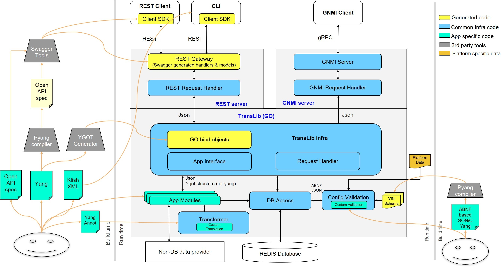
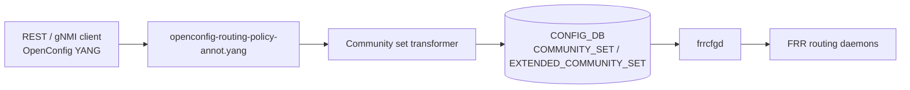
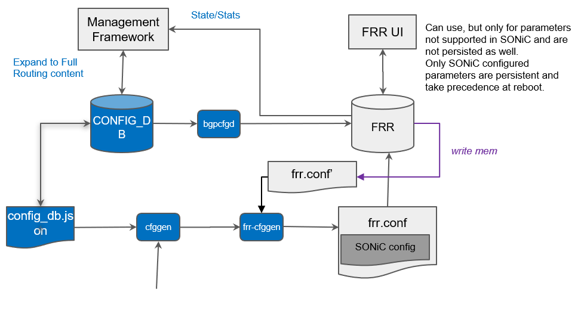

# OpenConfig Model Support for SONiC Routing Policy Community Set Feature

# High Level Design Document
#### Rev 0.1

# Table of Contents
  * [List of Tables](#list-of-tables)
  * [Revision](#revision)
  * [About This Manual](#about-this-manual)
  * [Related Documents](#related-documents)
  * [Scope](#scope)
  * [Definition/Abbreviation](#definitionabbreviation)
  * [1 Feature Overview](#1-feature-overview)
    * [1.1 Requirements](#11-requirements)
      * [1.1.1 Functional Requirements](#111-functional-requirements)
      * [1.1.2 Configuration and Management Requirements](#112-configuration-and-management-requirements)
      * [1.1.3 Scalability Requirements](#113-scalability-requirements)
    * [1.2 Design Overview](#12-design-overview)
      * [1.2.1 Basic Approach](#121-basic-approach)
      * [1.2.2 Container](#122-container)
  * [2 Functionality](#2-functionality)
      * [2.1 Target Deployment Use Cases](#21-target-deployment-use-cases)
  * [3 Design](#3-design)
    * [3.1 Overview](#31-overview)
      * [3.1.1 SONiC Feature YANG and CONFIG_DB](#311-sonic-feature-yang-and-config_db)
      * [3.1.2 OpenConfig Modules](#312-openconfig-modules)
      * [3.1.3 UMF Translation (REST/gNMI to CONFIG_DB)](#313-umf-translation-restgnmi-to-config_db)
      * [3.1.4 FRR Programming (frrcfgd)](#314-frr-programming-frrcfgd)
      * [3.1.5 OpenConfig Extensions](#315-openconfig-extensions)
      * [3.1.6 Mapping Table and Unit Tests](#316-mapping-table-and-unit-tests)
    * [3.2 DB Changes](#32-db-changes)
      * [3.2.1 CONFIG DB](#321-config-db)
      * [3.2.2 APP DB](#322-app-db)
      * [3.2.3 STATE DB](#323-state-db)
      * [3.2.4 ASIC DB](#324-asic-db)
      * [3.2.5 COUNTER DB](#325-counter-db)
  * [4 OpenConfig to SONiC Mapping Table](#4-openconfig-to-sonic-mapping-table)
    * [4.1 Defined Sets Container](#41-defined-sets-container)
    * [4.2 Community Set Entry](#42-community-set-entry)
    * [4.3 Community Set Leaves (config/state)](#43-community-set-leaves-configstate)
    * [4.4 Extended Community Set Entry](#44-extended-community-set-entry)
    * [4.5 Extended Community Set Leaves (config/state)](#45-extended-community-set-leaves-configstate)
  * [5 User Interface](#5-user-interface)
    * [5.1 Data Models](#51-data-models)
    * [5.2 REST API Support](#52-rest-api-support)
      * [5.2.1 GET](#521-get)
      * [5.2.2 PUT](#522-put)
      * [5.2.3 POST](#523-post)
      * [5.2.4 PATCH](#524-patch)
      * [5.2.5 DELETE](#525-delete)
    * [5.3 gNMI Support](#53-gnmi-support)
      * [5.3.1 GET](#531-get)
      * [5.3.2 SET](#532-set)
      * [5.3.3 DELETE](#533-delete)
      * [5.3.4 SUBSCRIBE](#534-subscribe)
  * [6 Error Handling](#6-error-handling)
  * [7 Unit Test Cases](#7-unit-test-cases)
    * [7.1 Functional Test Cases](#71-functional-test-cases)
    * [7.2 Negative Test Cases](#72-negative-test-cases)

# List of Tables
[Table 1: Abbreviations](#table-1-abbreviations)

[Table 2: Translation Flow Layers](#table-2-translation-flow-layers)

OpenConfig to SONiC mapping tables: [Section 4](#4-openconfig-to-sonic-mapping-table)

# Revision
| Rev | Date | Author | Change Description |
|:---:|:----:|:------:|:-------------------|
| 0.1 | 07/23/2026 | Venkata Krishna Rao Gorrepati, Anukul Verma | Initial version |

# About this Manual
This document provides general information about the OpenConfig configuration and management of routing-policy community sets and extended community sets in SONiC corresponding to the openconfig-routing-policy.yang and openconfig-bgp-policy.yang modules. It describes how OpenConfig models are translated to SONiC CONFIG_DB entries and FRR community-list configuration, and how operational state is returned over REST and gNMI.

Community sets are configured under:
/routing-policy/defined-sets/bgp-defined-sets/community-sets

Extended community sets are configured under:
/routing-policy/defined-sets/bgp-defined-sets/ext-community-sets

# Related Documents
| Document | Description |
|----------|-------------|
| Management Framework.md | UMF architecture (REST, gNMI, translib, transformers) |
| OpenConfig_RouteMap.md | Route-map match conditions reference community sets by name |
| OpenConfig_PrefixList.md | Prefix sets (separate defined-sets HLD) |
| Openconfig_BGP.md | BGP policy overview |

# Scope
- This document describes the high level design of OpenConfig **Community Set** and **Extended Community Set** configuration and operational retrieval in SONiC routing-policy defined-sets.
- **In scope:** REST and gNMI — Get, Set (POST/PUT/PATCH), Delete, and Subscribe on supported community-set and ext-community-set YANG paths.
- **Out of scope:** SONiC KLISH CLI and native SONiC CLI for community lists; large-community configuration in route-map policy statements (see OpenConfig_RouteMap.md); route-map match/set actions that reference community sets (covered in OpenConfig_RouteMap.md).
- OpenConfig xpath roots:
  `/routing-policy/defined-sets/bgp-defined-sets/community-sets`
  `/routing-policy/defined-sets/bgp-defined-sets/ext-community-sets`
- Supported attributes in OpenConfig YANG tree (reflecting current UMF implementation):

```
module: openconfig-routing-policy
        (+ openconfig-bgp-policy,
           openconfig-routing-policy-ext)
+--rw routing-policy
   +--rw defined-sets
      +--rw oc-bgp-pol:bgp-defined-sets
         +--rw oc-bgp-pol:community-sets
         |  +--rw oc-bgp-pol:community-set* [community-set-name]
         |     +--rw oc-bgp-pol:community-set-name    -> ../config/community-set-name
         |     +--rw oc-bgp-pol:config
         |     |  +--rw oc-bgp-pol:community-set-name      string
         |     |  +--rw oc-bgp-pol:community-member*       union
         |     |  +--rw oc-bgp-pol:match-set-options?      match-set-options-type
         |     |  +--rw oc-rp-ext:action?                  action-type
         |     +--ro oc-bgp-pol:state
         |        +--ro oc-bgp-pol:community-set-name      string
         |        +--ro oc-bgp-pol:community-member*       union
         |        +--ro oc-bgp-pol:match-set-options?      match-set-options-type
         |        +--ro oc-rp-ext:action?                  action-type
         +--rw oc-bgp-pol:ext-community-sets
            +--rw oc-bgp-pol:ext-community-set* [ext-community-set-name]
               +--rw oc-bgp-pol:ext-community-set-name    -> ../config/ext-community-set-name
               +--rw oc-bgp-pol:config
               |  +--rw oc-bgp-pol:ext-community-set-name?   string
               |  +--rw oc-bgp-pol:ext-community-member*     union
               |  +--rw oc-bgp-pol:match-set-options?        match-set-options-type
               |  +--rw oc-rp-ext:action?                    action-type
               +--ro oc-bgp-pol:state
                  +--ro oc-bgp-pol:ext-community-set-name?   string
                  +--ro oc-bgp-pol:ext-community-member*     union
                  +--ro oc-bgp-pol:match-set-options?        match-set-options-type
                  +--ro oc-rp-ext:action?                    action-type
```

Extension leaves are documented in [Section 3.1.5 OpenConfig Extensions](#315-openconfig-extensions).

# Definition/Abbreviation
### Table 1: Abbreviations

| **Term** | **Definition** |
|--------------------------|-------------------------------------|
| YANG | Yet Another Next Generation: modular language representing data structures in an XML tree format |
| REST | REpresentative State Transfer |
| gNMI | gRPC Network Management Interface |
| UMF | Unified Management Framework (`sonic-mgmt-common`) |
| BGP | Border Gateway Protocol |
| AS | Autonomous System |
| RT | Route Target |
| SoO | Site of Origin |
| FRR | Free Range Routing (bgpd) |

# 1 Feature Overview
## 1.1 Requirements
### 1.1.1 Functional Requirements
1. Expose SONiC community-list configuration through standard OpenConfig YANG models under `routing-policy/defined-sets/bgp-defined-sets`.
2. Support configuration and operational retrieval of community sets and extended community sets (see Scope and Section 4).
3. Support standard community formats (`AS:NN`), well-known communities, and regex/expanded members.
4. Support extended community formats (`route-target:`, `site-of-origin:`, and expanded patterns).
5. Support PERMIT/DENY action on community and extended community sets.
6. Provide REST Get, Post, Put, Patch, and Delete, and gNMI Get, Set, Delete, and Subscribe on all mapped community-set paths.

### 1.1.2 Configuration and Management Requirements
Community sets are configured and queried only through REST and gNMI via the Unified Management Framework (UMF). KLISH and native SONiC CLI are out of scope for this document. Unsupported operations return an error through existing UMF error handling; no new management interfaces are introduced.

### 1.1.3 Scalability Requirements
Community set scale follows the existing CONFIG_DB `COMMUNITY_SET` and `EXTENDED_COMMUNITY_SET` schema and platform limits for the number of sets and members per set.

## 1.2 Design Overview
### 1.2.1 Basic Approach
SONiC already programs FRR community lists from CONFIG_DB through **frrcfgd** (today consumed primarily by BGP route policy). This feature adds a northbound OpenConfig view: REST/gNMI clients configure OpenConfig YANG; UMF transformers translate requests into existing CONFIG_DB `COMMUNITY_SET` and `EXTENDED_COMMUNITY_SET` rows; frrcfgd applies configuration to FRR from CONFIG_DB changes.

### 1.2.2 Container
Implementation changes are in **sonic-mgmt-common** (REST server in the Management Framework container and gNMI server in the gnmi container: annotations, transformers) and **sonic-frr-mgmt-framework** (frrcfgd runtime mapping for `COMMUNITY_SET` / `EXTENDED_COMMUNITY_SET`).

# 2 Functionality
## 2.1 Target Deployment Use Cases
All northbound clients configure and query community sets using OpenConfig YANG over REST or gNMI.

1. **REST clients** — GET, POST, PUT, PATCH, and DELETE on community-set and ext-community-set RESTCONF paths. Orchestration systems are one example.
2. **gNMI clients** — Capabilities, Get, Set (update/delete), and Subscribe (stream) on community-set gNMI paths. Controllers and telemetry consumers are examples.

# 3 Design
## 3.1 Overview
This HLD follows Management Framework.md. The design covers: SONiC feature YANG, OpenConfig modules, UMF translation, CONFIG_DB, FRR programming, mapping tables (Section 4), and unit tests (Section 7).

### 3.1.1 SONiC Feature YANG and CONFIG_DB
SONiC defines the southbound schema in `sonic-routing-policy-sets.yang`:

| Item | Detail |
|------|--------|
| CONFIG_DB tables | `COMMUNITY_SET`, `EXTENDED_COMMUNITY_SET` |
| `COMMUNITY_SET` key | `{name}` |
| `COMMUNITY_SET` leaves | `set_type` (`STANDARD` / `EXPANDED`), `match_action` (`ANY` / `ALL`), `action` (`permit` / `deny`), `community_member` (leaf-list) |
| `EXTENDED_COMMUNITY_SET` key | `{name}` |
| `EXTENDED_COMMUNITY_SET` leaves | `set_type`, `match_action`, `action`, `community_member` (leaf-list) |
| Out of scope | Large-community route-map actions (see OpenConfig_RouteMap.md) |

OpenConfig clients never write CONFIG_DB directly; UMF transformers populate `COMMUNITY_SET` and `EXTENDED_COMMUNITY_SET` from OpenConfig payloads. The CONFIG_DB field `set_type` is auto-derived during translation and is not exposed as an OpenConfig leaf. A CONFIG_DB example is in [§3.2.1](#321-config-db).

### 3.1.2 OpenConfig Modules
| Module | Source | Role for community sets |
|--------|--------|-------------------------|
| [openconfig-routing-policy.yang](https://github.com/openconfig/public/blob/master/release/models/policy/openconfig-routing-policy.yang) | openconfig/public | Base `routing-policy/defined-sets` container |
| [openconfig-bgp-policy.yang](https://github.com/openconfig/public/blob/master/release/models/bgp/openconfig-bgp-policy.yang) | openconfig/public | `bgp-defined-sets`, `community-sets`, `ext-community-sets`, member unions, `match-set-options` |
| openconfig-routing-policy-ext.yang | sonic-mgmt-common | Community-set and ext-community-set `action` (prefix `oc-rp-ext`) |
| openconfig-routing-policy-annot.yang | sonic-mgmt-common | XPath to CONFIG_DB and operational state bindings |
| openconfig-routing-policy-deviation.yang | sonic-mgmt-common | `not-supported` deviations for unsupported base OC leaves |

### 3.1.3 UMF Translation (REST/gNMI to CONFIG_DB)
OpenConfig SET/GET/SUBSCRIBE requests are handled by translib and the **transformer** common app. Annotation YANG defines xpath-to-DB bindings; the community-set transformer performs member validation, `set_type` derivation, well-known community mapping, and extended-community format conversion.



*Figure: Management Framework architecture ([Management Framework.md](https://github.com/sonic-net/SONiC/blob/master/doc/mgmt/Management%20Framework.md)).*

#### Table 2: Translation Flow Layers

| Layer | Artifact | Role |
|-------|----------|------|
| **1. SONiC feature YANG** | `sonic-routing-policy-sets.yang` | CONFIG_DB `COMMUNITY_SET` / `EXTENDED_COMMUNITY_SET` schema |
| **2. OpenConfig modules** | `openconfig-routing-policy.yang`, `openconfig-bgp-policy.yang`, `openconfig-routing-policy-ext.yang` | Northbound client model |
| **3. UMF annotations** | `openconfig-routing-policy-annot.yang` | XPath → table/field/transformer binding |
| **4. UMF transformers** | Community set transformer | YangToDb / DbToYang for community and ext-community sets |
| **5. CONFIG_DB** | `COMMUNITY_SET`, `EXTENDED_COMMUNITY_SET` | Runtime configuration store |
| **6. FRR** | `frrcfgd.py` | Programs FRR community-list / extcommunity-list configuration |



### 3.1.4 FRR Programming (frrcfgd)
CONFIG_DB `COMMUNITY_SET` and `EXTENDED_COMMUNITY_SET` changes are consumed by **frrcfgd**, which programs FRR community-list and extcommunity-list configuration at runtime. The derived `set_type` value (`STANDARD` or `EXPANDED`) determines whether FRR programs a standard or expanded list; numeric set names in the 0–99 range map to FRR standard list numbers, and 100–500 to expanded list numbers.



*Figure: Unified FRR management framework ([SONiC Unified FRR Mgmt Interface HLD](https://github.com/sonic-net/SONiC/blob/master/doc/mgmt/SONiC_Design_Doc_Unified_FRR_Mgmt_Interface.md)) — community sets follow the same CONFIG_DB → frrcfgd → FRR path as other routing-policy objects.*

### 3.1.5 OpenConfig Extensions
SONiC augments base OpenConfig community-set and ext-community-set `config`/`state` using `openconfig-routing-policy-ext.yang`.

| Property | Value |
|----------|-------|
| Module | `openconfig-routing-policy-ext.yang` |
| Prefix | `oc-rp-ext` |
| Namespace | `http://openconfig.net/yang/routing-policy/sonic/extension` |

Extension leaf DB mappings are documented in [Section 4](#4-openconfig-to-sonic-mapping-table) only.

| OpenConfig YANG Node | Data type |
|----------------------|-----------|
| **defined-sets/bgp-defined-sets/community-sets/community-set/config** | |
| action | enumeration (PERMIT \| DENY; default PERMIT) |
| **defined-sets/bgp-defined-sets/community-sets/community-set/state** | |
| action | enumeration (PERMIT \| DENY; default PERMIT) |
| **defined-sets/bgp-defined-sets/ext-community-sets/ext-community-set/config** | |
| action | enumeration (PERMIT \| DENY; default PERMIT) |
| **defined-sets/bgp-defined-sets/ext-community-sets/ext-community-set/state** | |
| action | enumeration (PERMIT \| DENY; default PERMIT) |

### 3.1.6 Mapping Table and Unit Tests
- **OpenConfig → SONiC mapping:** [Section 4](#4-openconfig-to-sonic-mapping-table) — xpath-to-CONFIG_DB mapping.
- **REST/gNMI examples:** [Section 5](#5-user-interface).
- **Unit tests:** [Section 7](#7-unit-test-cases).

## 3.2 DB Changes
OpenConfig community sets use the existing CONFIG_DB `COMMUNITY_SET` and `EXTENDED_COMMUNITY_SET` tables. No new CONFIG_DB, APP_DB, STATE_DB, ASIC_DB, or COUNTER_DB tables are added.

### 3.2.1 CONFIG DB
Example — standard community set:
```
COMMUNITY_SET|CommunitySet1
  community_member: 100:200,300:400
  set_type:         STANDARD
  match_action:     ANY
  action:           permit
```

Example — expanded community set (numeric name 100–500):
```
COMMUNITY_SET|150
  community_member: 65001:100,.*:200
  set_type:         EXPANDED
  match_action:     ALL
  action:           permit
```

Example — extended community set:
```
EXTENDED_COMMUNITY_SET|ExtCommunitySet1
  community_member: rt 300:400
  set_type:         STANDARD
  match_action:     ANY
  action:           permit
```

### 3.2.2 APP DB
No APP DB tables are used for community set configuration.

### 3.2.3 STATE DB
No STATE DB tables are used for community set configuration.

### 3.2.4 ASIC DB
No ASIC DB tables are used for community set configuration.

### 3.2.5 COUNTER DB
No COUNTER DB tables are used for community set configuration.

# 4 OpenConfig to SONiC Mapping Table
**CONFIG_DB tables:** `COMMUNITY_SET`, `EXTENDED_COMMUNITY_SET`  
**Key pattern:** `{set-name}` (e.g. `CommunitySet1`, `50`, `ExtCommunitySet1`)

**Conventions:**
- Each subsection maps one OpenConfig container or list. Paths are shown as an indented tree; placeholders: `<set-name>`.
- **Extension** — `Yes` on extension leaves; blank on base OpenConfig leaves. Extension definitions are in [§3.1.5](#315-openconfig-extensions).
- Where `config` and `state` share the same mapping, both are covered in one table; operational `state` is returned on GET from CONFIG_DB.

## 4.1 Defined Sets Container
**OpenConfig path:**
```
/routing-policy/defined-sets/bgp-defined-sets
```
| OpenConfig node | Extension | DB Name | Table:Field | Notes |
|-----------------|-----------|---------|-------------|-------|
| bgp-defined-sets | | — | — | Parent container for `community-sets` and `ext-community-sets` |

## 4.2 Community Set Entry
**OpenConfig path:**
```
/routing-policy/defined-sets/bgp-defined-sets/community-sets/community-set[community-set-name=<set-name>]
```
| OpenConfig leaf | Extension | DB Name | Table:Field | Notes |
|-----------------|-----------|---------|-------------|-------|
| community-set-name (list key) | | CONFIG_DB | COMMUNITY_SET:key `{set-name}` | Non-numeric names allowed; numeric names must be in range 0–500 |

## 4.3 Community Set Leaves (config/state)
**OpenConfig path:**
```
/routing-policy/defined-sets/bgp-defined-sets/community-sets/community-set[community-set-name=<set-name>]
     config
     state
```
| OpenConfig leaf | Extension | DB Name | Table:Field | Notes |
|-----------------|-----------|---------|-------------|-------|
| community-set-name | | CONFIG_DB | COMMUNITY_SET:key `{set-name}` | |
| community-member | | CONFIG_DB | COMMUNITY_SET:community_member | Union: `AS:NN` string, uint32 (0–65535), or well-known enum (`NO_EXPORT`, `NO_ADVERTISE`, `NOPEER`, `GRACEFUL_SHUTDOWN`). Well-known values stored as `no-export`, `no-advertise`, `no-peer`, `graceful-shutdown`. PATCH merges new members into the existing list. **Auto-derived `set_type`:** any expanded/regex member → `EXPANDED`; otherwise → `STANDARD`. Numeric name **0–99** with expanded members → error. Numeric name **100–500** allows either type. `set_type` is written to CONFIG_DB but **not** returned on OpenConfig GET. Update that changes `set_type` is rejected |
| match-set-options | | CONFIG_DB | COMMUNITY_SET:match_action | `ANY` → `ANY`; `ALL` → `ALL`. `INVERT` is **not supported** |
| action | Yes | CONFIG_DB | COMMUNITY_SET:action | `PERMIT`/`DENY` → `permit`/`deny`; default PERMIT when omitted |

## 4.4 Extended Community Set Entry
**OpenConfig path:**
```
/routing-policy/defined-sets/bgp-defined-sets/ext-community-sets/ext-community-set[ext-community-set-name=<set-name>]
```
| OpenConfig leaf | Extension | DB Name | Table:Field | Notes |
|-----------------|-----------|---------|-------------|-------|
| ext-community-set-name (list key) | | CONFIG_DB | EXTENDED_COMMUNITY_SET:key `{set-name}` | Same numeric name rules as community sets (0–500) |

## 4.5 Extended Community Set Leaves (config/state)
**OpenConfig path:**
```
/routing-policy/defined-sets/bgp-defined-sets/ext-community-sets/ext-community-set[ext-community-set-name=<set-name>]
     config
     state
```
| OpenConfig leaf | Extension | DB Name | Table:Field | Notes |
|-----------------|-----------|---------|-------------|-------|
| ext-community-set-name | | CONFIG_DB | EXTENDED_COMMUNITY_SET:key `{set-name}` | |
| ext-community-member | | CONFIG_DB | EXTENDED_COMMUNITY_SET:community_member | `route-target:<value>` → `rt <value>`; `site-of-origin:<value>` → `soo <value>`. Members without standard prefixes (e.g. regex) → `EXPANDED`. PATCH merges new members. Same `set_type` derivation and immutability rules as community sets |
| match-set-options | | CONFIG_DB | EXTENDED_COMMUNITY_SET:match_action | `ANY` → `ANY`; `ALL` → `ALL`. `INVERT` is **not supported** |
| action | Yes | CONFIG_DB | EXTENDED_COMMUNITY_SET:action | `PERMIT`/`DENY` → `permit`/`deny`; default PERMIT when omitted |

# 5 User Interface
## 5.1 Data Models
| Model | Source | Purpose |
|-------|--------|---------|
| sonic-routing-policy-sets.yang | sonic-yang-models | SONiC CONFIG_DB schema |
| [openconfig-routing-policy.yang](https://github.com/openconfig/public/blob/master/release/models/policy/openconfig-routing-policy.yang) | openconfig/public | Base `defined-sets` container |
| [openconfig-bgp-policy.yang](https://github.com/openconfig/public/blob/master/release/models/bgp/openconfig-bgp-policy.yang) | openconfig/public | Community-set and ext-community-set containers |
| openconfig-routing-policy-ext.yang | sonic-mgmt-common | `action` on community and ext-community sets |
| openconfig-routing-policy-annot.yang | sonic-mgmt-common | XPath to CONFIG_DB and operational state bindings |
| openconfig-routing-policy-deviation.yang | sonic-mgmt-common | `not-supported` deviations for unsupported OC leaves |

## 5.2 REST API Support
Examples below use paths and payloads validated by unit tests. RESTCONF URL encoding uses `=` separators; gNMI uses bracket notation (see §5.3).

### 5.2.1 GET
Supported at container, list, and leaf levels.

```
curl -X GET -k "https://<device>/restconf/data/openconfig-routing-policy:routing-policy/defined-sets/bgp-defined-sets/community-sets/community-set=CommunitySet1" -H "accept: application/yang-data+json"
```

```
curl -X GET -k "https://<device>/restconf/data/openconfig-routing-policy:routing-policy/defined-sets/bgp-defined-sets/ext-community-sets/ext-community-set=ExtCommunitySet1/config/ext-community-member" -H "accept: application/yang-data+json"
```

### 5.2.2 PUT
Supported at leaf level (e.g. `match-set-options`, `action`).

```
curl -X PUT -k "https://<device>/restconf/data/openconfig-routing-policy:routing-policy/defined-sets/bgp-defined-sets/community-sets/community-set=CommunitySet1/config/match-set-options" -H "Content-Type: application/yang-data+json" -d '{"openconfig-bgp-policy:match-set-options":"ALL"}'
```

### 5.2.3 POST
POST creates community sets or extended community sets.

POST — create community set:

```
curl -X POST -k "https://<device>/restconf/data/openconfig-routing-policy:routing-policy/defined-sets/bgp-defined-sets/community-sets" -H "Content-Type: application/yang-data+json" -d '{
  "openconfig-bgp-policy:community-set": [{
    "community-set-name": "CommunitySet1",
    "config": {
      "community-set-name": "CommunitySet1",
      "community-member": ["100:200", "300:400"],
      "match-set-options": "ANY",
      "action": "PERMIT"
    }
  }]
}'
```

POST — create extended community set:

```
curl -X POST -k "https://<device>/restconf/data/openconfig-routing-policy:routing-policy/defined-sets/bgp-defined-sets/ext-community-sets" -H "Content-Type: application/yang-data+json" -d '{
  "openconfig-bgp-policy:ext-community-set": [{
    "ext-community-set-name": "ExtCommunitySet1",
    "config": {
      "ext-community-set-name": "ExtCommunitySet1",
      "ext-community-member": ["route-target:300:400"],
      "match-set-options": "ANY"
    }
  }]
}'
```

### 5.2.4 PATCH
Supported at leaf level (e.g. `community-member`, `action`).

```
curl -X PATCH -k "https://<device>/restconf/data/openconfig-routing-policy:routing-policy/defined-sets/bgp-defined-sets/community-sets/community-set=CommunitySet1/config/community-member" -H "Content-Type: application/yang-data+json" -d '{"openconfig-bgp-policy:community-member":["100:200","300:400","500:600"]}'
```

```
curl -X PATCH -k "https://<device>/restconf/data/openconfig-routing-policy:routing-policy/defined-sets/bgp-defined-sets/community-sets/community-set=CommunitySet1/config/action" -H "Content-Type: application/yang-data+json" -d '{"action":"DENY"}'
```

### 5.2.5 DELETE
Supported at community-set and ext-community-set list entry level. DELETE on individual `community-member` or `ext-community-member` leaf is **not** supported — delete the entire set instead.

```
curl -X DELETE -k "https://<device>/restconf/data/openconfig-routing-policy:routing-policy/defined-sets/bgp-defined-sets/community-sets/community-set=CommunitySet1" -H "accept: */*"
```

```
curl -X DELETE -k "https://<device>/restconf/data/openconfig-routing-policy:routing-policy/defined-sets/bgp-defined-sets/ext-community-sets/ext-community-set=ExtCommunitySet1" -H "accept: */*"
```

## 5.3 gNMI Support
### 5.3.1 GET
```
gnmic -a <device>:<port> --insecure --target OC-YANG -e json_ietf get \
  --path "/openconfig-routing-policy:routing-policy/defined-sets/bgp-defined-sets/community-sets/community-set[community-set-name=CommunitySet1]"
```

```
gnmic -a <device>:<port> --insecure --target OC-YANG -e json_ietf get \
  --path "/openconfig-routing-policy:routing-policy/defined-sets/bgp-defined-sets/community-sets/community-set[community-set-name=CommunitySet1]/config/community-member"
```

### 5.3.2 SET
Create community set:

```
gnmic -a <device>:<port> --insecure --target OC-YANG -e json_ietf set \
  --update-path "/openconfig-routing-policy:routing-policy/defined-sets/bgp-defined-sets/community-sets/community-set[community-set-name=CommunitySet1]/config" \
  --update-value '{
  "community-set-name": "CommunitySet1",
  "community-member": ["100:200", "300:400"],
  "match-set-options": "ANY",
  "action": "PERMIT"
}'
```

Create extended community set:

```
gnmic -a <device>:<port> --insecure --target OC-YANG -e json_ietf set \
  --update-path "/openconfig-routing-policy:routing-policy/defined-sets/bgp-defined-sets/ext-community-sets/ext-community-set[ext-community-set-name=ExtCommunitySet1]/config" \
  --update-value '{
  "ext-community-set-name": "ExtCommunitySet1",
  "ext-community-member": ["route-target:300:400"],
  "match-set-options": "ANY"
}'
```

### 5.3.3 DELETE
```
gnmic -a <device>:<port> --insecure --target OC-YANG -e json_ietf set \
  --delete "/openconfig-routing-policy:routing-policy/defined-sets/bgp-defined-sets/community-sets/community-set[community-set-name=CommunitySet1]"
```

### 5.3.4 SUBSCRIBE
Supported on supported config and state paths under `community-sets` and `ext-community-sets`. No feature-specific path is listed in controller-agent telemetry subscriptions; use the container xpath below.

```
gnmic -a <device>:<port> --insecure --target OC-YANG -e json_ietf sub \
  --path "/openconfig-routing-policy:routing-policy/defined-sets/bgp-defined-sets/community-sets" \
  --stream-mode on-change
```

```
gnmic -a <device>:<port> --insecure --target OC-YANG -e json_ietf sub \
  --path "/openconfig-routing-policy:routing-policy/defined-sets/bgp-defined-sets/ext-community-sets" \
  --stream-mode on-change
```

# 6 Error Handling
Invalid configurations and unsupported operations report an error with a descriptive message. Representative categories:

- Invalid community format (not valid `AS:NN`, well-known, or expanded pattern)
- Empty `community-member` or `ext-community-member` list
- `match-set-options` set to `INVERT` (only `ANY` and `ALL` supported)
- Numeric set name outside 0–500 range
- Numeric set name 0–99 with expanded/regex members (`Standard community set name [0-99] cannot have expanded community members`)
- `set_type` mismatch on update (`Community members type do not match existing set_type in DB`)
- Invalid `action` value (not PERMIT or DENY)
- Duplicate community set name on create
- DELETE on individual `community-member` or `ext-community-member` leaf (must delete entire set)
- GET on non-existent community set (resource not found)
- Invalid extended community format
- Standard uint32 community member outside 0–65535 range
- Invalid well-known community enum value

# 7 Unit Test Cases
## 7.1 Functional Test Cases
**Basic CRUD**
1. POST create community set and extended community set; GET at container, list, and leaf levels; DELETE entire set.
2. PUT update `match-set-options` on community and ext-community sets.
3. PATCH merge additional `community-member` and `ext-community-member` values.
4. GET `bgp-defined-sets` container returns both community and ext-community sets.

**Community members and set_type**
5. Standard `AS:NN` members result in `set_type=STANDARD` in CONFIG_DB.
6. Regex/expanded members result in `set_type=EXPANDED`.
7. Well-known communities (`NO_EXPORT`, `NO_ADVERTISE`, `NOPEER`, `GRACEFUL_SHUTDOWN`) accepted and stored in SONiC string form.
8. Mixed well-known and standard communities in one set.
9. Numeric name 0–99 with standard members accepted; numeric name 100–500 with expanded members accepted.
10. Extended community `route-target:` and `site-of-origin:` prefixes stored as `rt` / `soo` in CONFIG_DB.

**Action extension**
11. POST/PATCH/GET `action` PERMIT and DENY on community and ext-community sets; CONFIG_DB stores `permit`/`deny`.

**Subscribe**
12. gNMI Subscribe on `community-sets` and `ext-community-sets` container paths.

## 7.2 Negative Test Cases
1. GET after DELETE returns resource not found.
2. `match-set-options=INVERT` rejected for community and ext-community sets.
3. Uint32 community member outside 0–65535 rejected.
4. Numeric set name outside 0–500 rejected.
5. Numeric set name 0–99 with regex/expanded members rejected.
6. Update that changes member type from STANDARD to EXPANDED on existing set rejected (`set_type` mismatch).
7. Invalid community string format (e.g. multiple colons, AS out of range) rejected.
8. Invalid well-known community enum value rejected.
9. DELETE on individual `community-member` leaf rejected.
