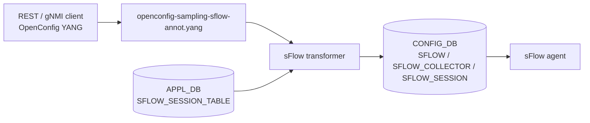

# OpenConfig Model Support for SONiC sFlow Feature

# High Level Design Document
#### Rev 0.1

# Table of Contents
  * [List of Tables](#list-of-tables)
  * [Revision](#revision)
  * [About This Manual](#about-this-manual)
  * [Related Documents](#related-documents)
  * [Scope](#scope)
  * [Definition/Abbreviation](#definitionabbreviation)
  * [1 Feature Overview](#1-feature-overview)
    * [1.1 Requirements](#11-requirements)
      * [1.1.1 Functional Requirements](#111-functional-requirements)
      * [1.1.2 Configuration and Management Requirements](#112-configuration-and-management-requirements)
      * [1.1.3 Scalability Requirements](#113-scalability-requirements)
    * [1.2 Design Overview](#12-design-overview)
      * [1.2.1 Basic Approach](#121-basic-approach)
      * [1.2.2 Container](#122-container)
  * [2 Functionality](#2-functionality)
      * [2.1 Target Deployment Use Cases](#21-target-deployment-use-cases)
  * [3 Design](#3-design)
    * [3.1 Overview](#31-overview)
      * [3.1.1 SONiC Feature YANG and CONFIG_DB](#311-sonic-feature-yang-and-config_db)
      * [3.1.2 OpenConfig Modules](#312-openconfig-modules)
      * [3.1.3 UMF Translation (REST/gNMI to CONFIG_DB)](#313-umf-translation-restgnmi-to-config_db)
      * [3.1.4 Southbound Programming](#314-southbound-programming)
      * [3.1.5 Mapping Table and Unit Tests](#315-mapping-table-and-unit-tests)
    * [3.2 DB Changes](#32-db-changes)
      * [3.2.1 CONFIG DB](#321-config-db)
      * [3.2.2 APP DB](#322-app-db)
      * [3.2.3 STATE DB](#323-state-db)
      * [3.2.4 ASIC DB](#324-asic-db)
      * [3.2.5 COUNTER DB](#325-counter-db)
  * [4 OpenConfig to SONiC Mapping Table](#4-openconfig-to-sonic-mapping-table)
    * [4.1 sFlow Global](#41-sflow-global)
    * [4.2 Collector](#42-collector)
    * [4.3 Interface](#43-interface)
      * [4.3.1 Interface config](#431-interface-config)
      * [4.3.2 Interface state](#432-interface-state)
  * [5 User Interface](#5-user-interface)
    * [5.1 Data Models](#51-data-models)
    * [5.2 REST API Support](#52-rest-api-support)
      * [5.2.1 GET](#521-get)
      * [5.2.2 PUT](#522-put)
      * [5.2.3 POST](#523-post)
      * [5.2.4 PATCH](#524-patch)
      * [5.2.5 DELETE](#525-delete)
    * [5.3 gNMI Support](#53-gnmi-support)
      * [5.3.1 GET](#531-get)
      * [5.3.2 SET](#532-set)
      * [5.3.3 DELETE](#533-delete)
      * [5.3.4 SUBSCRIBE](#534-subscribe)
  * [6 Error Handling](#6-error-handling)
  * [7 Unit Test Cases](#7-unit-test-cases)
    * [7.1 Functional Test Cases](#71-functional-test-cases)
    * [7.2 Negative Test Cases](#72-negative-test-cases)

# List of Tables
[Table 1: Abbreviations](#table-1-abbreviations)

[Table 2: Translation Flow Layers](#table-2-translation-flow-layers)

OpenConfig to SONiC mapping tables: [Section 4](#4-openconfig-to-sonic-mapping-table)

# Revision
| Rev | Date | Author | Change Description |
|:---:|:-----------:|:---------------------:|-----------------------------------|
| 0.1 | 09/17/2026 | Anukul Verma | Initial version. Documents the existing UMF OpenConfig mapping (implementation already present; no prior HLD). |

# About this Manual
This document provides general information about the OpenConfig configuration and management of sFlow in SONiC corresponding to the openconfig-sampling-sflow.yang module. It describes how OpenConfig models are translated to SONiC CONFIG_DB (and APPL_DB for interface GET) entries. Current HLD and implementation scope is **configuration only**; corresponding OpenConfig `state` nodes are replicas of `config`. Packet counters (`packets-sent`, `packets-sampled`) are not supported. The OpenConfig-to-SONiC mapping documented here has been implemented in UMF for some time; this HLD is added now as the missing design reference.

sFlow is configured under:
/sampling/sflow

# Related Documents
| Document | Description |
|----------|-------------|
| Management Framework.md | UMF architecture (REST, gNMI, translib, transformers) |

# Scope
- This document describes the high level design of OpenConfig **sFlow** configuration in SONiC.
- **In scope:** REST and gNMI — Get, Set (POST/PUT/PATCH), Delete, and Subscribe on supported sFlow YANG paths. Scope is **configuration only**; OpenConfig `state` nodes are replicas of the corresponding `config` nodes. Global and collector GET use CONFIG_DB; interface GET/Subscribe use APPL_DB `SFLOW_SESSION_TABLE` (applied session, same config-shaped leaves).
- **Out of scope:** SONiC KLISH CLI and native SONiC CLI for sFlow; global `sampling-rate`, `source-address`, and `sample-size`; collector `packets-sent`; interface `packets-sampled`; SONiC-only `sample_direction`.
- OpenConfig xpath root:
  `/sampling/sflow`
- Supported attributes in OpenConfig YANG tree (reflecting current UMF implementation):

```
module: openconfig-sampling-sflow
+--rw sampling
   +--rw sflow
      +--rw config
      |  +--rw enabled?             boolean
      |  +--rw polling-interval?    uint16
      |  +--rw agent?               oc-if:base-interface-ref
      +--ro state
      |  +--ro enabled?             boolean
      |  +--ro polling-interval?    uint16
      |  +--ro agent?               oc-if:base-interface-ref
      +--rw collectors
      |  +--rw collector* [address port network-instance]
      |     +--rw address              oc-inet:ip-address
      |     +--rw port                 oc-inet:port-number
      |     +--rw network-instance     string
      |     +--rw config
      |     |  +--rw address?            oc-inet:ip-address
      |     |  +--rw port?               oc-inet:port-number
      |     |  +--rw network-instance?   string
      |     +--ro state
      |        +--ro address?            oc-inet:ip-address
      |        +--ro port?               oc-inet:port-number
      |        +--ro network-instance?   string
      +--rw interfaces
         +--rw interface* [name]
            +--rw name      oc-if:base-interface-ref
            +--rw config
            |  +--rw name?             oc-if:base-interface-ref
            |  +--rw enabled?          boolean
            |  +--rw sampling-rate?    uint32
            +--ro state
               +--ro name?             oc-if:base-interface-ref
               +--ro enabled?          boolean
               +--ro sampling-rate?    uint32
```

# Definition/Abbreviation
### Table 1: Abbreviations

| **Term** | **Definition** |
|--------------------------|-------------------------------------|
| YANG | Yet Another Next Generation: modular language representing data structures in an XML tree format |
| REST | REpresentative State Transfer |
| gNMI | gRPC Network Management Interface |
| UMF | Unified Management Framework (`sonic-mgmt-common`) |
| sFlow | Sampled Flow packet sampling |

# 1 Feature Overview
## 1.1 Requirements
### 1.1.1 Functional Requirements
1. Expose SONiC sFlow configuration through standard OpenConfig YANG models under `/sampling/sflow`.
2. Support configuration of global enable, polling interval, and agent interface; GET `state` returns the same configured values as `config`.
3. Support sFlow collectors (address, port, network-instance) and per-interface enable and sampling-rate.
4. Provide REST Get, Post, Put, Patch, and Delete, and gNMI Get, Set, Delete, and Subscribe on mapped sFlow paths.

### 1.1.2 Configuration and Management Requirements
sFlow is configured and queried only through REST and gNMI via the Unified Management Framework (UMF). KLISH and native SONiC CLI are out of scope for this document. Unsupported operations return an error through existing UMF error handling; no new management interfaces are introduced.

### 1.1.3 Scalability Requirements
sFlow scale follows the existing CONFIG_DB `SFLOW`, `SFLOW_COLLECTOR`, and `SFLOW_SESSION` schemas (maximum two collectors; collector VRF `default` or `mgmt`).

## 1.2 Design Overview
### 1.2.1 Basic Approach
SONiC already programs sFlow from CONFIG_DB into the sFlow agent. The northbound OpenConfig mapping is already implemented in UMF; this HLD documents that mapping. REST/gNMI clients configure OpenConfig YANG; UMF transformers translate requests into existing CONFIG_DB `SFLOW`, `SFLOW_COLLECTOR`, and `SFLOW_SESSION` rows.

### 1.2.2 Container
Implementation is in **sonic-mgmt-common** (REST server in the Management Framework container and gNMI server in the gnmi container: annotations, transformers). There is no FRR programming path for sFlow.

# 2 Functionality
## 2.1 Target Deployment Use Cases
All northbound clients configure and query sFlow using OpenConfig YANG over REST or gNMI.

1. **REST clients** — GET, POST, PUT, PATCH, and DELETE on sFlow RESTCONF paths. Orchestration systems are one example.
2. **gNMI clients** — Capabilities, Get, Set (update/delete), and Subscribe (stream) on sFlow gNMI paths. Controllers and telemetry consumers are examples.

# 3 Design
## 3.1 Overview
This HLD follows Management Framework.md. The design covers: SONiC feature YANG, OpenConfig modules, UMF translation, CONFIG_DB/APPL_DB, mapping tables (Section 4), and unit tests (Section 7).

### 3.1.1 SONiC Feature YANG and CONFIG_DB
SONiC defines the southbound schema in `sonic-sflow.yang`:

| Item | Detail |
|------|--------|
| CONFIG_DB tables | `SFLOW`, `SFLOW_COLLECTOR`, `SFLOW_SESSION` |
| `SFLOW` key | `global` |
| `SFLOW` leaves | `admin_state` (`up`/`down`), `polling_interval`, `agent_id` |
| `SFLOW_COLLECTOR` key | `{address}_{port}_{network-instance}` |
| `SFLOW_COLLECTOR` leaves | `collector_ip`, `collector_port`, `collector_vrf` |
| `SFLOW_SESSION` key | `{ifname}` |
| `SFLOW_SESSION` leaves | `admin_state`, `sample_rate` |
| Out of scope | `sample_direction` (SONiC-only; not in OpenConfig) |

OpenConfig clients never write CONFIG_DB directly; UMF transformers populate these tables from OpenConfig payloads. CONFIG_DB examples are in [§3.2.1](#321-config-db).

### 3.1.2 OpenConfig Modules
| Module | Source | Role for sFlow |
|--------|--------|----------------|
| [openconfig-sampling-sflow.yang](https://github.com/openconfig/public/blob/master/release/models/sampling/openconfig-sampling-sflow.yang) | openconfig/public | Base sFlow container (`sampling/sflow`) |
| openconfig-sampling-sflow-annot.yang | sonic-mgmt-common | XPath to subtree transformer bindings |
| openconfig-sampling-sflow-deviation.yang | sonic-mgmt-common | `not-supported` deviations for unsupported OC leaves |

### 3.1.3 UMF Translation (REST/gNMI to CONFIG_DB)
OpenConfig SET/GET/SUBSCRIBE requests are handled by translib and the **transformer** common app. Annotation YANG binds sFlow, collector, and interface containers to subtree transformers that map leaves to CONFIG_DB (and APPL_DB for interface GET).


*Figure: Management Framework architecture ([Management Framework.md](https://github.com/sonic-net/SONiC/blob/master/doc/mgmt/Management%20Framework.md)).*

#### Table 2: Translation Flow Layers

| Layer | Artifact | Role |
|-------|----------|------|
| **1. SONiC feature YANG** | `sonic-sflow.yang` | CONFIG_DB `SFLOW` / `SFLOW_COLLECTOR` / `SFLOW_SESSION` schema |
| **2. OpenConfig modules** | `openconfig-sampling-sflow.yang` | Northbound client model |
| **3. UMF annotations** | `openconfig-sampling-sflow-annot.yang` | XPath → subtree transformer binding |
| **4. UMF transformers** | sFlow transformers | YangToDb / DbToYang / Subscribe for global, collectors, and interfaces |
| **5. CONFIG_DB / APPL_DB** | `SFLOW`, `SFLOW_COLLECTOR`, `SFLOW_SESSION`; APPL_DB `SFLOW_SESSION_TABLE` | Runtime configuration store; applied interface session for GET |
| **6. sFlow agent** | sFlow orchagent | Programs hardware sampling from CONFIG_DB |



### 3.1.4 Southbound Programming
CONFIG_DB `SFLOW`, `SFLOW_COLLECTOR`, and `SFLOW_SESSION` changes are consumed by the sFlow agent (orchagent). There is no FRR / frrcfgd path for sFlow.

### 3.1.5 Mapping Table and Unit Tests
- **OpenConfig → SONiC mapping:** [Section 4](#4-openconfig-to-sonic-mapping-table).
- **REST/gNMI examples:** [Section 5](#5-user-interface).
- **Unit tests:** [Section 7](#7-unit-test-cases).

## 3.2 DB Changes
OpenConfig sFlow uses the existing CONFIG_DB `SFLOW`, `SFLOW_COLLECTOR`, and `SFLOW_SESSION` tables and APPL_DB `SFLOW_SESSION_TABLE`. No new tables are added.

### 3.2.1 CONFIG DB
Example:
```
SFLOW|global
  admin_state:       up
  polling_interval:  100
  agent_id:          Ethernet0

SFLOW_COLLECTOR|192.0.2.1_6343_default
  collector_ip:   192.0.2.1
  collector_port: 6343
  collector_vrf:  default

SFLOW_SESSION|Ethernet0
  admin_state:  up
  sample_rate:  10000
```

`admin_state` stores `up` for OpenConfig `enabled=true` and `down` for `enabled=false`.

### 3.2.2 APP DB
APPL_DB `SFLOW_SESSION_TABLE|{ifname}` is read for OpenConfig interface GET and Subscribe (`admin_state`, `sample_rate`). SET writes CONFIG_DB `SFLOW_SESSION`.

### 3.2.3 STATE DB
No STATE DB tables are used for sFlow OpenConfig configuration.

### 3.2.4 ASIC DB
No ASIC DB tables are used for sFlow OpenConfig configuration.

### 3.2.5 COUNTER DB
No COUNTER DB tables are used. Collector `packets-sent` and interface `packets-sampled` are not supported.

# 4 OpenConfig to SONiC Mapping Table
**CONFIG_DB tables:** `SFLOW`, `SFLOW_COLLECTOR`, `SFLOW_SESSION`  
**APPL_DB table:** `SFLOW_SESSION_TABLE` (interface GET/Subscribe)  
**Key patterns:** `SFLOW` — `global`; `SFLOW_COLLECTOR` — `{address}_{port}_{network-instance}`; `SFLOW_SESSION` / `SFLOW_SESSION_TABLE` — `{ifname}`

**Conventions:**
- Each subsection maps one OpenConfig container or list. Paths are shown as an indented tree; placeholders: `<address>`, `<port>`, `<ni>`, `<ifname>`.
- Global and collector GET `state` is a replica of `config` from CONFIG_DB.
- Interface SET writes CONFIG_DB `SFLOW_SESSION`. Interface GET/Subscribe (both `config` and `state`) reads APPL_DB `SFLOW_SESSION_TABLE` (applied session; same config-shaped leaves).

## 4.1 sFlow Global
**OpenConfig path:**
```
/sampling/sflow
     config
     state
```
| OpenConfig leaf | DB Name | Table:Field | Notes |
|-----------------|---------|-------------|-------|
| enabled | CONFIG_DB | SFLOW:admin_state | `true`→`up`, `false`→`down`; default `false` |
| polling-interval | CONFIG_DB | SFLOW:polling_interval | uint16; SONiC range `0` or `5..300` |
| agent | CONFIG_DB | SFLOW:agent_id | Port, LAG, management port, or VLAN interface |

GET `state` returns the same CONFIG_DB values as `config`. DELETE of `/sampling/sflow/config` is not supported. DELETE of `config/agent` and `config/polling-interval` is supported.

## 4.2 Collector
**OpenConfig path:**
```
/sampling/sflow/collectors
     collector[address=<address>][port=<port>][network-instance=<ni>]
          config
          state
```
| OpenConfig leaf | DB Name | Table:Field | Notes |
|-----------------|---------|-------------|-------|
| address (list key) | CONFIG_DB | SFLOW_COLLECTOR:collector_ip | IPv4 or IPv6 |
| port (list key) | CONFIG_DB | SFLOW_COLLECTOR:collector_port | Default `6343` when unset |
| network-instance (list key) | CONFIG_DB | SFLOW_COLLECTOR:collector_vrf | `default` or `mgmt`; default `default`; `mgmt` requires management VRF enabled |
| address | CONFIG_DB | SFLOW_COLLECTOR:collector_ip | Same as list key |
| port | CONFIG_DB | SFLOW_COLLECTOR:collector_port | Same as list key |
| network-instance | CONFIG_DB | SFLOW_COLLECTOR:collector_vrf | Same as list key |

GET `state` returns the same CONFIG_DB values as `config`. Maximum two collectors. DELETE of a collector list entry is supported; DELETE of collector `config` container is not supported.

## 4.3 Interface
**OpenConfig path:**
```
/sampling/sflow/interfaces
     interface[name=<ifname>]
          config
          state
```

Global sFlow must be enabled before creating interface sessions. DELETE of an interface list entry is supported; DELETE of the `interfaces` container without a name is not supported.

### 4.3.1 Interface config
SET writes CONFIG_DB `SFLOW_SESSION`. GET of these leaves returns the applied APPL_DB session (same fields as §4.3.2).

| OpenConfig leaf | DB Name | Table:Field | Notes |
|-----------------|---------|-------------|-------|
| name (list key) | CONFIG_DB | SFLOW_SESSION:key `{ifname}` | |
| name | CONFIG_DB | SFLOW_SESSION:key `{ifname}` | Same as list key |
| enabled | CONFIG_DB | SFLOW_SESSION:admin_state | `true`→`up`, `false`→`down` |
| sampling-rate | CONFIG_DB | SFLOW_SESSION:sample_rate | Per-interface; SONiC range `256..8388608` |

### 4.3.2 Interface state
GET and Subscribe read APPL_DB `SFLOW_SESSION_TABLE`. Leaves match `config`; this is the applied session, not a second schema.

| OpenConfig leaf | DB Name | Table:Field | Notes |
|-----------------|---------|-------------|-------|
| name (list key) | APPL_DB | SFLOW_SESSION_TABLE:key `{ifname}` | |
| name | APPL_DB | SFLOW_SESSION_TABLE:key `{ifname}` | Same as list key |
| enabled | APPL_DB | SFLOW_SESSION_TABLE:admin_state | `up`→`true`, `down`→`false` |
| sampling-rate | APPL_DB | SFLOW_SESSION_TABLE:sample_rate | Same range as config |

# 5 User Interface
## 5.1 Data Models
| Model | Source | Purpose |
|-------|--------|---------|
| sonic-sflow.yang | sonic-yang-models | SONiC CONFIG_DB schema for sFlow |
| [openconfig-sampling-sflow.yang](https://github.com/openconfig/public/blob/master/release/models/sampling/openconfig-sampling-sflow.yang) | openconfig/public | Base sFlow container |
| openconfig-sampling-sflow-annot.yang | sonic-mgmt-common | XPath to subtree transformer bindings |
| openconfig-sampling-sflow-deviation.yang | sonic-mgmt-common | `not-supported` deviations |

## 5.2 REST API Support
Examples below use paths and payloads validated by unit tests. RESTCONF URL encoding uses `=` separators; gNMI uses bracket notation (see §5.3).

### 5.2.1 GET
Supported at leaf and container level.

```
curl -X GET -k "https://<device>/restconf/data/openconfig-sampling-sflow:sampling/sflow/state" -H "accept: application/yang-data+json"
```

```
curl -X GET -k "https://<device>/restconf/data/openconfig-sampling-sflow:sampling/sflow/collectors" -H "accept: application/yang-data+json"
```

```
curl -X GET -k "https://<device>/restconf/data/openconfig-sampling-sflow:sampling/sflow/interfaces/interface=Ethernet8/state" -H "accept: application/yang-data+json"
```

### 5.2.2 PUT
PUT replaces a leaf.

```
curl -X PUT -k "https://<device>/restconf/data/openconfig-sampling-sflow:sampling/sflow/config/polling-interval" \
  -H "Content-Type: application/yang-data+json" \
  -d '{"openconfig-sampling-sflow:polling-interval": 300}'
```

```
curl -X PUT -k "https://<device>/restconf/data/openconfig-sampling-sflow:sampling/sflow/interfaces/interface=Ethernet0/config/enabled" \
  -H "Content-Type: application/yang-data+json" \
  -d '{"openconfig-sampling-sflow:enabled": false}'
```

### 5.2.3 POST
POST creates global config, collectors, or interface sessions.

```
curl -X POST -k "https://<device>/restconf/data/openconfig-sampling-sflow:sampling/sflow/config" \
  -H "Content-Type: application/yang-data+json" \
  -d '{"openconfig-sampling-sflow:enabled": true, "openconfig-sampling-sflow:polling-interval": 100, "openconfig-sampling-sflow:agent": "Ethernet0"}'
```

```
curl -X POST -k "https://<device>/restconf/data/openconfig-sampling-sflow:sampling/sflow/collectors" \
  -H "Content-Type: application/yang-data+json" \
  -d '{"openconfig-sampling-sflow:collector":[{"address":"192.0.2.1","port":6343,"network-instance":"default","config":{"address":"192.0.2.1","port":6343,"network-instance":"default"}}]}'
```

```
curl -X POST -k "https://<device>/restconf/data/openconfig-sampling-sflow:sampling/sflow/interfaces" \
  -H "Content-Type: application/yang-data+json" \
  -d '{"openconfig-sampling-sflow:interface":[{"name":"Ethernet0","config":{"name":"Ethernet0","enabled":true,"sampling-rate":10000}}]}'
```

### 5.2.4 PATCH
Supported at leaf level.

```
curl -X PATCH -k "https://<device>/restconf/data/openconfig-sampling-sflow:sampling/sflow/config/agent" \
  -H "Content-Type: application/yang-data+json" \
  -d '{"openconfig-sampling-sflow:agent": "Ethernet4"}'
```

```
curl -X PATCH -k "https://<device>/restconf/data/openconfig-sampling-sflow:sampling/sflow/interfaces/interface=Ethernet0/config/sampling-rate" \
  -H "Content-Type: application/yang-data+json" \
  -d '{"openconfig-sampling-sflow:sampling-rate": 20000}'
```

### 5.2.5 DELETE

```
curl -X DELETE -k "https://<device>/restconf/data/openconfig-sampling-sflow:sampling/sflow/collectors/collector=192.0.2.1,6343,default" -H "accept: */*"
```

```
curl -X DELETE -k "https://<device>/restconf/data/openconfig-sampling-sflow:sampling/sflow/interfaces/interface=Ethernet4" -H "accept: */*"
```

## 5.3 gNMI Support
Use `--target OC-YANG`.

### 5.3.1 GET

```
gnmic -a <device>:<port> --insecure --target OC-YANG get \
  --path "/openconfig-sampling-sflow:sampling/sflow/state"
```

### 5.3.2 SET

```
gnmic -a <device>:<port> --insecure --target OC-YANG set \
  --update-path "/openconfig-sampling-sflow:sampling/sflow/config" \
  --update-value '{
    "enabled": true,
    "polling-interval": 100,
    "agent": "Ethernet0"
  }'
```

### 5.3.3 DELETE

```
gnmic -a <device>:<port> --insecure --target OC-YANG set \
  --delete "/openconfig-sampling-sflow:sampling/sflow/collectors/collector[address=192.0.2.1][port=6343][network-instance=default]"
```

### 5.3.4 SUBSCRIBE
Subscribe is supported on global `config`/`state` (on-change), collectors, and interfaces.

```
gnmic -a <device>:<port> --insecure --target OC-YANG subscribe \
  --path "/openconfig-sampling-sflow:sampling/sflow/config" \
  --mode stream
```

# 6 Error Handling
- DELETE of `/sampling/sflow/config` is rejected (`DELETE not supported on attribute`).
- DELETE of the `interfaces` container without an interface name is rejected.
- DELETE of collector `config` container is rejected.
- GET of a missing collector or interface session is rejected (not found).
- Collector count greater than two, `network-instance` other than `default`/`mgmt`, `mgmt` without management VRF, invalid `polling-interval`, invalid `sample_rate`, or nonexistent `agent` interface is rejected by schema validation.
- Global `sampling-rate`, `source-address`, `sample-size`, collector `packets-sent`, and interface `packets-sampled` are `not-supported`.

# 7 Unit Test Cases
Section 7 summarizes generic functional and negative scenarios for REST and gNMI paths under `/sampling/sflow`.

## 7.1 Functional Test Cases

**Global CRUD**

- POST global `enabled`, `polling-interval`, and `agent`; GET `state` matches CONFIG_DB; PUT `polling-interval`; PATCH `agent`.

**Collectors**

- POST collector with address, port, and `network-instance=default`; GET collectors container; DELETE collector list entry.

**Interfaces**

- POST interface `enabled` and `sampling-rate` (global sFlow enabled first); GET interface `state` from APPL_DB `SFLOW_SESSION_TABLE`; PUT `enabled`; PATCH `sampling-rate`; DELETE interface list entry.

**Subscribe**

- gNMI Subscribe on `/sampling/sflow/config` (on-change); collectors and interfaces Subscribe supported.

## 7.2 Negative Test Cases

**Validation**

1. DELETE `/sampling/sflow/config` rejected.
2. DELETE `/sampling/sflow/interfaces` without a name rejected.
3. GET missing collector or missing interface session rejected.
4. More than two collectors rejected.
5. Invalid polling interval or sampling-rate range rejected.
6. Unsupported global `sampling-rate` / `source-address` / `sample-size` and counter leaves rejected.
