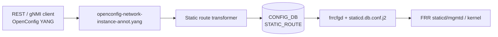

# OpenConfig Model Support for SONiC Static Route Feature

# High Level Design Document
#### Rev 0.1

# Table of Contents
  * [List of Tables](#list-of-tables)
  * [Revision](#revision)
  * [About This Manual](#about-this-manual)
  * [Related Documents](#related-documents)
  * [Scope](#scope)
  * [Definition/Abbreviation](#definitionabbreviation)
  * [1 Feature Overview](#1-feature-overview)
    * [1.1 Requirements](#11-requirements)
      * [1.1.1 Functional Requirements](#111-functional-requirements)
      * [1.1.2 Configuration and Management Requirements](#112-configuration-and-management-requirements)
      * [1.1.3 Scalability Requirements](#113-scalability-requirements)
    * [1.2 Design Overview](#12-design-overview)
      * [1.2.1 Basic Approach](#121-basic-approach)
      * [1.2.2 Container](#122-container)
  * [2 Functionality](#2-functionality)
      * [2.1 Target Deployment Use Cases](#21-target-deployment-use-cases)
  * [3 Design](#3-design)
    * [3.1 Overview](#31-overview)
      * [3.1.1 SONiC Feature YANG and CONFIG_DB](#311-sonic-feature-yang-and-config_db)
      * [3.1.2 OpenConfig Modules](#312-openconfig-modules)
      * [3.1.3 UMF Translation (REST/gNMI to CONFIG_DB)](#313-umf-translation-restgnmi-to-config_db)
      * [3.1.4 FRR Programming (frrcfgd and Templates)](#314-frr-programming-frrcfgd-and-templates)
      * [3.1.5 OpenConfig Extensions](#315-openconfig-extensions)
      * [3.1.6 Mapping Table and Unit Tests](#316-mapping-table-and-unit-tests)
    * [3.2 DB Changes](#32-db-changes)
      * [3.2.1 CONFIG DB](#321-config-db)
      * [3.2.2 APP DB](#322-app-db)
      * [3.2.3 STATE DB](#323-state-db)
      * [3.2.4 ASIC DB](#324-asic-db)
      * [3.2.5 COUNTER DB](#325-counter-db)
  * [4 OpenConfig to SONiC Mapping Table](#4-openconfig-to-sonic-mapping-table)
    * [4.1 Network Instance (VRF Key)](#41-network-instance-vrf-key)
    * [4.2 Static Routes Container](#42-static-routes-container)
    * [4.3 Static Route Entry](#43-static-route-entry)
    * [4.4 Static Route Prefix (config/state)](#44-static-route-prefix-configstate)
    * [4.5 Next-hop Entry](#45-next-hop-entry)
    * [4.6 Next-hop Leaves (config/state)](#46-next-hop-leaves-configstate)
    * [4.7 Interface Reference](#47-interface-reference)
    * [4.8 BFD Enable](#48-bfd-enable)
  * [5 User Interface](#5-user-interface)
    * [5.1 Data Models](#51-data-models)
    * [5.2 REST API Support](#52-rest-api-support)
      * [5.2.1 GET](#521-get)
      * [5.2.2 PUT](#522-put)
      * [5.2.3 POST](#523-post)
      * [5.2.4 PATCH](#524-patch)
      * [5.2.5 DELETE](#525-delete)
    * [5.3 gNMI Support](#53-gnmi-support)
      * [5.3.1 GET](#531-get)
      * [5.3.2 SET](#532-set)
      * [5.3.3 DELETE](#533-delete)
      * [5.3.4 SUBSCRIBE](#534-subscribe)
  * [6 Error Handling](#6-error-handling)
  * [7 Unit Test Cases](#7-unit-test-cases)
    * [7.1 Functional Test Cases](#71-functional-test-cases)
    * [7.2 Negative Test Cases](#72-negative-test-cases)

# List of Tables
[Table 1: Abbreviations](#table-1-abbreviations)

[Table 2: Translation Flow Layers](#table-2-translation-flow-layers)

[Table 3: Next-hop Index Derivation](#table-3-next-hop-index-derivation)

OpenConfig to SONiC mapping tables: [Section 4](#4-openconfig-to-sonic-mapping-table)

# Revision
| Rev | Date | Author | Change Description |
|:---:|:-----------:|:---------------------:|-----------------------------------|
| 0.1 | 12/02/2025 | Raja Kushwah, Anukul Verma | Initial version |

# About this Manual
This document provides general information about the OpenConfig configuration and management of static routes in SONiC corresponding to the openconfig-network-instance.yang module (static routes under protocols/protocol/static-routes). It describes how OpenConfig models are translated to SONiC CONFIG_DB entries and FRR staticd/mgmtd configuration, and how operational state is returned over REST and gNMI.

Static routes are configured under:
/network-instances/network-instance/protocols/protocol[identifier=STATIC][name=DEFAULT]/static-routes

# Related Documents
| Document | Description |
|----------|-------------|
| Management Framework.md | UMF architecture (REST, gNMI, translib, transformers) |
| Openconfig_Network_Instance.md | Network-instance (VRF) container; static protocol entry overview |
| Openconfig_BGP.md | BGP route redistribution |

# Scope
- This document describes the high level design of OpenConfig **Static Route** configuration and operational retrieval in SONiC.
- **In scope:** REST and gNMI — Get, Set (POST/PUT/PATCH), Delete, and Subscribe on supported Static Route YANG paths.
- **Out of scope:** SONiC KLISH CLI and native SONiC CLI for static routes; `STATIC_ROUTE_TEMPLATE_LIST` (SONiC-only template table).
- OpenConfig xpath root:
  `/network-instances/network-instance/protocols/protocol[identifier=STATIC][name=DEFAULT]/static-routes`
- Supported attributes in OpenConfig YANG tree (reflecting current UMF implementation):

```
module: openconfig-network-instance
        (+ openconfig-local-routing-network-instance,
           openconfig-network-instance-ext)
+--rw network-instances
   +--rw network-instance* [name]
      +--rw name -> ../config/name
      +--rw protocols
         +--rw protocol* [identifier STATIC][name DEFAULT]
            +--rw static-routes
               +--rw static* [prefix]
                  +--rw prefix -> ../config/prefix
                  +--rw config
                  |  +--rw prefix?                    oc-inet:ip-prefix
                  +--ro state
                  |  +--ro prefix?                    oc-inet:ip-prefix
                  +--rw next-hops
                     +--rw next-hop* [index]
                        +--rw index -> ../config/index
                        +--rw config
                        |  +--rw index?                 string
                        |  +--rw next-hop?              union (IP | LOCAL_LINK | DROP)
                        |  +--rw preference?            uint32
                        |  +--rw oc-loc-rt-netinst:nh-network-instance?   leafref
                        |  +--rw oc-network-instance-ext:tag?               openconfig-policy-types:tag-type
                        |  +--rw oc-network-instance-ext:track-id?          string
                        +--ro state
                        |  +--ro index?                 string
                        |  +--ro next-hop?              union (IP | LOCAL_LINK | DROP)
                        |  +--ro preference?            uint32
                        |  +--ro oc-loc-rt-netinst:nh-network-instance?   leafref
                        |  +--ro oc-network-instance-ext:tag?               openconfig-policy-types:tag-type
                        |  +--ro oc-network-instance-ext:track-id?          string
                        +--rw interface-ref
                        |  +--rw config
                        |  |  +--rw interface?          -> /oc-if:interfaces/interface/name
                        |  |  +--rw subinterface?       uint32
                        |  +--ro state
                        |     +--ro interface?          -> /oc-if:interfaces/interface/name
                        |     +--ro subinterface?       uint32
                        +--rw enable-bfd
                           +--rw config
                           |  +--rw enabled?            boolean
                           +--ro state
                              +--ro enabled?            boolean
```

Extension leaves are documented in [Section 3.1.5 OpenConfig Extensions](#315-openconfig-extensions).

# Definition/Abbreviation
### Table 1: Abbreviations

| **Term** | **Definition** |
|--------------------------|-------------------------------------|
| YANG | Yet Another Next Generation: modular language representing data structures in an XML tree format |
| REST | REpresentative State Transfer |
| gNMI | gRPC Network Management Interface |
| UMF | Unified Management Framework (`sonic-mgmt-common`) |
| BFD | Bidirectional Forwarding Detection |
| VRF | Virtual Routing and Forwarding |
| Track | Reachability track object (CONFIG_DB field `apm`) |
| FRR | Free Range Routing (staticd/mgmtd) |

# 1 Feature Overview
## 1.1 Requirements
### 1.1.1 Functional Requirements
1. Expose SONiC static route configuration through standard OpenConfig YANG models under the network-instance protocol tree.
2. Support configuration and operational retrieval of Static Route attributes under the OpenConfig static-routes YANG tree (see Scope and Section 4).
3. Support IPv4 and IPv6 static routes with multiple ECMP next-hops per prefix.
4. Allow BFD enable on IP next-hops only.
5. Provide REST Get, Post, Put, Patch, and Delete, and gNMI Get, Set, and Subscribe on all mapped static-route paths.

### 1.1.2 Configuration and Management Requirements
Static routes are configured and queried only through REST and gNMI via the Unified Management Framework (UMF). KLISH and native SONiC CLI are out of scope for this document. Unsupported operations return an error through existing UMF error handling; no new management interfaces are introduced.

### 1.1.3 Scalability Requirements
Static route scale follows the existing CONFIG_DB `STATIC_ROUTE` schema and platform limits for route prefixes and next-hops per prefix.

## 1.2 Design Overview
### 1.2.1 Basic Approach
SONiC already programs static routes from CONFIG_DB into FRR staticd/mgmtd through **frrcfgd** and boot-time Jinja2 templates. This feature adds a northbound OpenConfig view: REST/gNMI clients configure OpenConfig YANG; UMF transformers translate requests into existing CONFIG_DB `STATIC_ROUTE` rows; frrcfgd applies configuration to FRR from CONFIG_DB changes.

### 1.2.2 Container
Implementation changes are in **sonic-mgmt-common** (REST server in the Management Framework container and gNMI server in the gnmi container: annotations, transformers) and **sonic-frr-mgmt-framework** (frrcfgd runtime mapping and `staticd.db.conf.j2` boot template).

# 2 Functionality
## 2.1 Target Deployment Use Cases
All northbound clients configure and query static routes using OpenConfig YANG over REST or gNMI.

1. **REST clients** — GET, POST, PUT, PATCH, and DELETE on Static Route RESTCONF paths under a network instance. Orchestration systems are one example.
2. **gNMI clients** — Capabilities, Get, Set (update/delete), and Subscribe (stream) on Static Route gNMI paths. Controllers and telemetry consumers are examples.

# 3 Design
## 3.1 Overview
This HLD follows Management Framework.md. The design covers: SONiC feature YANG, OpenConfig modules, UMF translation, CONFIG_DB, FRR programming, mapping tables (Section 4), and unit tests (Section 7).

### 3.1.1 SONiC Feature YANG and CONFIG_DB
SONiC defines the southbound schema in `sonic-static-route.yang`:

| Item | Detail |
|------|--------|
| CONFIG_DB table | `STATIC_ROUTE` |
| Key | `{vrf}\|{prefix}` |
| List container | `STATIC_ROUTE_LIST` — leaves: `vrf_name`, `prefix`, `nexthop`, `ifname`, `bfd`, `distance`, `tag`, `nexthop-vrf`, `blackhole`, `apm` |
| Out of scope | `STATIC_ROUTE_TEMPLATE_LIST` (SONiC CLI / template feature only) |

OpenConfig clients never write CONFIG_DB directly; UMF transformers populate `STATIC_ROUTE` from OpenConfig payloads. A CONFIG_DB example is in [§3.2.1](#321-config-db).

### 3.1.2 OpenConfig Modules
| Module | Source | Role for static routes |
|--------|--------|------------------------|
| [openconfig-network-instance.yang](https://github.com/openconfig/public/blob/master/release/models/network-instance/openconfig-network-instance.yang) | openconfig/public | Base `static-routes/static` tree: `prefix`, next-hop union, `preference`, `interface-ref`, BFD container |
| [openconfig-local-routing-network-instance.yang](https://github.com/openconfig/public/blob/master/release/models/local-routing/openconfig-local-routing-network-instance.yang) | openconfig/public | Augments `nh-network-instance` on next-hop `config`/`state` (prefix `oc-loc-rt-netinst`) |
| openconfig-network-instance-ext.yang | sonic-mgmt-common | Per-nexthop `tag`, `track-id` (prefix `oc-network-instance-ext`) |
| openconfig-network-instance-annot.yang | sonic-mgmt-common | XPath to CONFIG_DB and operational state bindings |
| openconfig-network-instance-deviation.yang | sonic-mgmt-common | `not-supported` deviations for unsupported base OC leaves |

### 3.1.3 UMF Translation (REST/gNMI to CONFIG_DB)
OpenConfig SET/GET/SUBSCRIBE requests are handled by translib and the **transformer** common app. Annotation YANG defines xpath-to-DB bindings; the static route transformer performs protocol validation, key composition, ECMP CSV alignment, and Subscribe path mapping.


*Figure: Management Framework architecture ([Management Framework.md](https://github.com/sonic-net/SONiC/blob/master/doc/mgmt/Management%20Framework.md)).*

#### Table 2: Translation Flow Layers

| Layer | Artifact | Role |
|-------|----------|------|
| **1. SONiC feature YANG** | `sonic-static-route.yang` | CONFIG_DB `STATIC_ROUTE` schema |
| **2. OpenConfig modules** | `openconfig-network-instance.yang`, `openconfig-local-routing-network-instance.yang`, `openconfig-network-instance-ext.yang` | Northbound client model |
| **3. UMF annotations** | `openconfig-network-instance-annot.yang` | XPath → table/field/transformer binding |
| **4. UMF transformers** | Static route transformer | YangToDb / DbToYang / Subscribe for static routes |
| **5. CONFIG_DB** | `STATIC_ROUTE` | Runtime configuration store |
| **6. FRR** | `frrcfgd.py` + `staticd.db.conf.j2` | Programs FRR staticd/mgmtd |



Per-nexthop leaves (`next-hop`, `interface-ref`, `nh-network-instance`, `preference`, `tag`, `track-id`, `enable-bfd/enabled`) are handled by the next-hop subtree transformer.

### 3.1.4 FRR Programming (frrcfgd and Templates)
CONFIG_DB `STATIC_ROUTE` changes are consumed by **frrcfgd**, which programs FRR staticd/mgmtd at runtime. Boot-time configuration is rendered from the Jinja2 template into `staticd.conf`.


*Figure: Unified FRR management framework ([SONiC Unified FRR Mgmt Interface HLD](https://github.com/sonic-net/SONiC/blob/master/doc/mgmt/SONiC_Design_Doc_Unified_FRR_Mgmt_Interface.md)) — static routes follow the same CONFIG_DB → frrcfgd → FRR path as BGP.*

Leaf `track-id` (CONFIG_DB `apm`) is **not** pushed to FRR staticd/mgmtd; it is consumed by the SONiC reachability-track subsystem.

### 3.1.5 OpenConfig Extensions
SONiC augments base OpenConfig static route next-hop `config`/`state` using `openconfig-network-instance-ext.yang` (`grouping static-route-nexthop-ext-config`).

| Property | Value |
|----------|-------|
| Module | `openconfig-network-instance-ext.yang` |
| Prefix | `oc-network-instance-ext` |
| Namespace | `http://openconfig.net/yang/network-instance/sonic/extension` |

These extensions are upstreamed in the OpenConfig community with [PR #1536](https://github.com/openconfig/public/pull/1536).

Extension leaf DB mappings are documented in [Section 4](#4-openconfig-to-sonic-mapping-table) only.

| OpenConfig YANG Node | Data type | Notes |
|----------------------|-----------|-------|
| **static-routes/static/next-hops/next-hop/config** | | |
| tag | openconfig-policy-types:tag-type | YANG allows decimal or hex (e.g. `3` or `"0x10"`). Transformer accepts **uint32 only**, range **1..4294967295**; hex and `0` are rejected |
| track-id | string | |
| **static-routes/static/next-hops/next-hop/state** | | |
| tag | openconfig-policy-types:tag-type | Same as config; GET returns decimal uint32 |
| track-id | string | |

### 3.1.6 Mapping Table and Unit Tests
- **OpenConfig → SONiC mapping:** [Section 4](#4-openconfig-to-sonic-mapping-table) — xpath-to-CONFIG_DB mapping.
- **REST/gNMI examples:** [Section 5](#5-user-interface).
- **Unit tests:** [Section 7](#7-unit-test-cases).

## 3.2 DB Changes
OpenConfig Static Routes use the existing CONFIG_DB `STATIC_ROUTE` table. No new CONFIG_DB, APP_DB, STATE_DB, ASIC_DB, or COUNTER_DB tables are added.

### 3.2.1 CONFIG DB
Example:
```
STATIC_ROUTE|default|172.16.1.0/24
  nexthop:     192.168.1.1,0.0.0.0
  ifname:      Ethernet0,Null0
  nexthop-vrf: default,
  bfd:         true,false
  distance:    10,0
  tag:         100,
  apm:         tcpprobe1,
```

For DROP on an IPv6 prefix, CONFIG_DB stores `nexthop=::` and `ifname=Null0`. OpenConfig represents blackhole as `next-hop=DROP`.

### 3.2.2 APP DB
No APP DB tables are used for static route configuration.

### 3.2.3 STATE DB
No STATE DB tables are used for static route configuration.

### 3.2.4 ASIC DB
No ASIC DB tables are used for static route configuration.

### 3.2.5 COUNTER DB
No COUNTER DB tables are used for static route configuration.

# 4 OpenConfig to SONiC Mapping Table
**CONFIG_DB table:** `STATIC_ROUTE`  
**Key pattern:** `{vrf}|{prefix}` (e.g. `default|172.16.0.0/24`)

**Conventions:**
- Each subsection maps one OpenConfig container or list. Paths are shown as an indented tree; placeholders: `<vrf>`, `<prefix>`, `<index>`.
- **Extension** — `Yes` on extension leaves; blank on base OpenConfig leaves. Extension definitions are in [§3.1.5](#315-openconfig-extensions).
- **`nh-network-instance`** — YANG prefix `oc-loc-rt-netinst:` (from `openconfig-local-routing-network-instance` augment).
- Where `config` and `state` share the same mapping, both are covered in one table; operational `state` is returned on GET from CONFIG_DB.
- Next-hop list key `index` derivation: [Table 3](#table-3-next-hop-index-derivation).

## 4.1 Network Instance (VRF Key)
**OpenConfig path:**
```
/network-instances/network-instance[name=<vrf>]
```
| OpenConfig leaf | Extension | DB Name | Table:Field | Notes |
|-----------------|-----------|---------|-------------|-------|
| name | | CONFIG_DB | STATIC_ROUTE:key `{vrf}` | VRF name: `default`, `mgmt`, or user-defined VRF (e.g. `Vrf1`, `Vrf-RED`) |

## 4.2 Static Routes Container
**OpenConfig path:**
```
/network-instances/network-instance[name=<vrf>]
     protocols/protocol[identifier=STATIC][name=DEFAULT]
          static-routes
```
| OpenConfig node | Extension | DB Name | Table:Field | Notes |
|-----------------|-----------|---------|-------------|-------|
| static-routes | | — | — | Only under `protocol[identifier=STATIC][name=DEFAULT]` |

## 4.3 Static Route Entry
**OpenConfig path:**
```
/network-instances/network-instance[name=<vrf>]
     protocols/protocol[identifier=STATIC][name=DEFAULT]
          static-routes/static[prefix=<prefix>]
```
| OpenConfig leaf | Extension | DB Name | Table:Field | Notes |
|-----------------|-----------|---------|-------------|-------|
| prefix (list key) | | CONFIG_DB | STATIC_ROUTE:key `{prefix}` | Normalized CIDR; at least one next-hop required on SET |

## 4.4 Static Route Prefix (config/state)
**OpenConfig path:**
```
/network-instances/network-instance[name=<vrf>]
     protocols/protocol[identifier=STATIC][name=DEFAULT]
          static-routes/static[prefix=<prefix>]
               config
               state
```
| OpenConfig leaf | Extension | DB Name | Table:Field | Notes |
|-----------------|-----------|---------|-------------|-------|
| prefix | | CONFIG_DB | STATIC_ROUTE:prefix (key component) | Normalized CIDR |

## 4.5 Next-hop Entry
**OpenConfig path:**
```
/network-instances/network-instance[name=<vrf>]
     protocols/protocol[identifier=STATIC][name=DEFAULT]
          static-routes/static[prefix=<prefix>]
               next-hops/next-hop[index=<index>]
```
| OpenConfig leaf | Extension | DB Name | Table:Field | Notes |
|-----------------|-----------|---------|-------------|-------|
| index (list key) | | Derived | list key | See [Table 3](#table-3-next-hop-index-derivation). Multiple next-hops (ECMP) supported |

## 4.6 Next-hop Leaves (config/state)
**OpenConfig path:**
```
/network-instances/network-instance[name=<vrf>]
     protocols/protocol[identifier=STATIC][name=DEFAULT]
          static-routes/static[prefix=<prefix>]
               next-hops/next-hop[index=<index>]
                    config
                    state
```
| OpenConfig leaf | Extension | DB Name | Table:Field | Notes |
|-----------------|-----------|---------|-------------|-------|
| next-hop | | CONFIG_DB | STATIC_ROUTE:nexthop | Union: IP address, `LOCAL_LINK`, or `DROP`. IP: stored as-is in CSV. `LOCAL_LINK`: IPv4 → `0.0.0.0`, IPv6 → `::` (requires `interface-ref`). `DROP`: IPv4 → `0.0.0.0`, IPv6 → `::`, with `ifname=Null0`; no `interface-ref`. GET reverses DB encoding to the OpenConfig union |
| nh-network-instance | | CONFIG_DB | STATIC_ROUTE:nexthop-vrf | `mgmt` requires management VRF enabled |
| preference | | CONFIG_DB | STATIC_ROUTE:distance | |
| tag | Yes | CONFIG_DB | STATIC_ROUTE:tag | YANG type `openconfig-policy-types:tag-type`; only uint32 **1..4294967295** supported (hex and `0` rejected) |
| track-id | Yes | CONFIG_DB | STATIC_ROUTE:apm | |

## 4.7 Interface Reference
**OpenConfig path:**
```
/network-instances/network-instance[name=<vrf>]
     protocols/protocol[identifier=STATIC][name=DEFAULT]
          static-routes/static[prefix=<prefix>]
               next-hops/next-hop[index=<index>]
                    interface-ref/config
                    interface-ref/state
```
| OpenConfig leaf | Extension | DB Name | Table:Field | Notes |
|-----------------|-----------|---------|-------------|-------|
| interface | | CONFIG_DB | STATIC_ROUTE:ifname | Required for `LOCAL_LINK` |
| subinterface | | CONFIG_DB | STATIC_ROUTE:ifname | Use subinterface leaf; do not embed in interface name |

## 4.8 BFD Enable
**OpenConfig path:**
```
/network-instances/network-instance[name=<vrf>]
     protocols/protocol[identifier=STATIC][name=DEFAULT]
          static-routes/static[prefix=<prefix>]
               next-hops/next-hop[index=<index>]
                    enable-bfd/config
                    enable-bfd/state
```
| OpenConfig leaf | Extension | DB Name | Table:Field | Notes |
|-----------------|-----------|---------|-------------|-------|
| enabled | | CONFIG_DB | STATIC_ROUTE:bfd | IP next-hops only |

#### Table 3: Next-hop Index Derivation

| Next-hop type | OpenConfig `config/next-hop` | OpenConfig list key `index` |
|---------------|------------------------------|----------------------------|
| IP only | `{ip}` | `{ip}` |
| DROP / blackhole | `DROP` | `DROP` |
| Interface only (LOCAL_LINK) | `LOCAL_LINK` | `LOCAL_LINK+{interface}` |
| LOCAL_LINK + subinterface | `LOCAL_LINK` | `LOCAL_LINK+{interface}.{subif}` |
| IP + interface | `{ip}` | `{ip}+{interface}` |
| IP + interface + subinterface | `{ip}` | `{ip}+{interface}.{subif}` |

# 5 User Interface
## 5.1 Data Models
| Model | Source | Purpose |
|-------|--------|---------|
| sonic-static-route.yang | sonic-yang-models | SONiC CONFIG_DB schema |
| [openconfig-network-instance.yang](https://github.com/openconfig/public/blob/master/release/models/network-instance/openconfig-network-instance.yang) | openconfig/public | Base static route container |
| [openconfig-local-routing-network-instance.yang](https://github.com/openconfig/public/blob/master/release/models/local-routing/openconfig-local-routing-network-instance.yang) | openconfig/public | `nh-network-instance` augment |
| openconfig-network-instance-ext.yang | sonic-mgmt-common | Per-nexthop `tag`, `track-id` |
| openconfig-network-instance-annot.yang | sonic-mgmt-common | XPath to CONFIG_DB and operational state bindings |
| openconfig-network-instance-deviation.yang | sonic-mgmt-common | `not-supported` deviations for unsupported OC leaves |

## 5.2 REST API Support
Examples below use paths and payloads validated by unit tests. RESTCONF URL encoding uses `=` separators; gNMI uses bracket notation (see §5.3).

### 5.2.1 GET
Supported at leaf and container level.

```
curl -X GET -k "https://<device>/restconf/data/openconfig-network-instance:network-instances/network-instance=default/protocols/protocol=STATIC,DEFAULT/static-routes/static=172.16.0.0/24" -H "accept: application/yang-data+json"
```

```
curl -X GET -k "https://<device>/restconf/data/openconfig-network-instance:network-instances/network-instance=default/protocols/protocol=STATIC,DEFAULT/static-routes/static=16.2.3.4/32" -H "accept: application/yang-data+json"
```

### 5.2.2 PUT
PUT performs REPLACE on the static route next-hop list.

```
curl -X PUT -k "https://<device>/restconf/data/openconfig-network-instance:network-instances/network-instance=default/protocols/protocol=STATIC,DEFAULT/static-routes/static=172.16.0.0/24" \
  -H "Content-Type: application/yang-data+json" \
  -d '{"openconfig-network-instance:static":[{"prefix":"172.16.0.0/24","config":{"prefix":"172.16.0.0/24"},"next-hops":{"next-hop":[{"index":"192.168.1.10","config":{"index":"192.168.1.10","next-hop":"192.168.1.10"}}]}}]}'
```

### 5.2.3 POST
POST merges next-hops into an existing static route (or creates the prefix entry).

POST — IP next-hop:

```
curl -X POST -k "https://<device>/restconf/data/openconfig-network-instance:network-instances/network-instance=default/protocols/protocol=STATIC,DEFAULT/static-routes" \
  -H "Content-Type: application/yang-data+json" \
  -d '{"openconfig-network-instance:static":[{"prefix":"172.16.0.0/24","config":{"prefix":"172.16.0.0/24"},"next-hops":{"next-hop":[{"index":"192.168.1.1","config":{"index":"192.168.1.1","next-hop":"192.168.1.1"}}]}}]}'
```

POST — DROP (blackhole) next-hop:

```
curl -X POST -k "https://<device>/restconf/data/openconfig-network-instance:network-instances/network-instance=default/protocols/protocol=STATIC,DEFAULT/static-routes" \
  -H "Content-Type: application/yang-data+json" \
  -d '{"openconfig-network-instance:static":[{"prefix":"10.0.0.0/8","config":{"prefix":"10.0.0.0/8"},"next-hops":{"next-hop":[{"index":"DROP","config":{"index":"DROP","next-hop":"DROP"}}]}}]}'
```

POST — ECMP next-hops:

```
curl -X POST -k "https://<device>/restconf/data/openconfig-network-instance:network-instances/network-instance=default/protocols/protocol=STATIC,DEFAULT/static-routes" \
  -H "Content-Type: application/yang-data+json" \
  -d '{"openconfig-network-instance:static":[{"prefix":"16.2.3.4/32","config":{"prefix":"16.2.3.4/32"},"next-hops":{"next-hop":[{"index":"10.212.10.6","config":{"index":"10.212.10.6","next-hop":"10.212.10.6","preference":10,"tag":3,"track-id":"tcpprobe1"}},{"index":"10.212.20.6","config":{"index":"10.212.20.6","next-hop":"10.212.20.6","preference":20,"tag":4,"track-id":"tcpprobe2"}}]}}]}'
```

### 5.2.4 PATCH
Supported at leaf level.

PATCH next-hop IP:

```
curl -X PATCH -k "https://<device>/restconf/data/openconfig-network-instance:network-instances/network-instance=default/protocols/protocol=STATIC,DEFAULT/static-routes/static=172.16.0.0/24/next-hops/next-hop=192.168.1.1/config/next-hop" \
  -H "Content-Type: application/yang-data+json" \
  -d '{"openconfig-network-instance:next-hop":"192.168.1.2"}'
```

PATCH LOCAL_LINK next-hop (target the next-hop list entry, not `.../config` alone):

```
curl -X PATCH -k "https://<device>/restconf/data/openconfig-network-instance:network-instances/network-instance=default/protocols/protocol=STATIC,DEFAULT/static-routes/static=192.168.1.0/24/next-hops/next-hop=LOCAL_LINK+Ethernet0" \
  -H "Content-Type: application/yang-data+json" \
  -d '{"openconfig-network-instance:next-hop":{"index":"LOCAL_LINK+Ethernet0","config":{"index":"LOCAL_LINK+Ethernet0","next-hop":"LOCAL_LINK"},"interface-ref":{"config":{"interface":"Ethernet0"}}}}'
```

PATCH enable BFD on IP next-hop (leaf level):

```
curl -X PATCH -k "https://<device>/restconf/data/openconfig-network-instance:network-instances/network-instance=default/protocols/protocol=STATIC,DEFAULT/static-routes/static=51.3.0.0/16/next-hops/next-hop=10.1.1.1/enable-bfd/config/enabled" \
  -H "Content-Type: application/yang-data+json" \
  -d '{"openconfig-network-instance:enabled":true}'
```

### 5.2.5 DELETE
Supported at leaf, next-hop, and prefix levels.

DELETE one next-hop:

```
curl -X DELETE -k "https://<device>/restconf/data/openconfig-network-instance:network-instances/network-instance=default/protocols/protocol=STATIC,DEFAULT/static-routes/static=172.16.1.0/24/next-hops/next-hop=192.168.1.1" \
  -H "accept: */*"
```

DELETE BFD configuration on a next-hop:

```
curl -X DELETE -k "https://<device>/restconf/data/openconfig-network-instance:network-instances/network-instance=default/protocols/protocol=STATIC,DEFAULT/static-routes/static=51.3.0.0/16/next-hops/next-hop=10.1.1.1/enable-bfd" \
  -H "accept: */*"
```

DELETE entire static route prefix:

```
curl -X DELETE -k "https://<device>/restconf/data/openconfig-network-instance:network-instances/network-instance=default/protocols/protocol=STATIC,DEFAULT/static-routes/static=172.16.0.0/24"
```

## 5.3 gNMI Support
gNMI paths match the xpath form used in unit tests (`network-instance[name=…]`, `protocol[identifier=STATIC][name=DEFAULT]`).

### 5.3.1 GET
```
gnmic -a <device>:<port> --insecure get \
  --path "/openconfig-network-instance:network-instances/network-instance[name=default]/protocols/protocol[identifier=STATIC][name=DEFAULT]/static-routes/static[prefix=172.16.0.0/24]"
```

```
gnmic -a <device>:<port> --insecure get \
  --path "/openconfig-network-instance:network-instances/network-instance[name=default]/protocols/protocol[identifier=STATIC][name=DEFAULT]/static-routes/static[prefix=16.2.3.4/32]"
```

### 5.3.2 SET
Create static route with DROP next-hop:

```
gnmic -a <device>:<port> --insecure set \
  --update-path "/openconfig-network-instance:network-instances/network-instance[name=default]/protocols/protocol[identifier=STATIC][name=DEFAULT]/static-routes/static[prefix=10.0.0.0/8]" \
  --update-value '{
  "openconfig-network-instance:static": [{
    "prefix": "10.0.0.0/8",
    "config": {"prefix": "10.0.0.0/8"},
    "next-hops": {"next-hop": [{
      "index": "DROP",
      "config": {"index": "DROP", "next-hop": "DROP"}
    }]}
  }]
}'
```

Create static route with ECMP next-hops:

```
gnmic -a <device>:<port> --insecure set \
  --update-path "/openconfig-network-instance:network-instances/network-instance[name=default]/protocols/protocol[identifier=STATIC][name=DEFAULT]/static-routes" \
  --update-value '{
  "openconfig-network-instance:static": [{
    "prefix": "16.2.3.4/32",
    "config": {"prefix": "16.2.3.4/32"},
    "next-hops": {"next-hop": [
      {
        "index": "10.212.10.6",
        "config": {
          "index": "10.212.10.6",
          "next-hop": "10.212.10.6",
          "preference": 10,
          "openconfig-network-instance-ext:tag": 3,
          "openconfig-network-instance-ext:track-id": "tcpprobe1"
        }
      },
      {
        "index": "10.212.20.6",
        "config": {
          "index": "10.212.20.6",
          "next-hop": "10.212.20.6",
          "preference": 20,
          "openconfig-network-instance-ext:tag": 4,
          "openconfig-network-instance-ext:track-id": "tcpprobe2"
        }
      }
    ]}
  }]
}'
```

### 5.3.3 DELETE
```
gnmic -a <device>:<port> --insecure set \
  --delete "/openconfig-network-instance:network-instances/network-instance[name=default]/protocols/protocol[identifier=STATIC][name=DEFAULT]/static-routes/static[prefix=172.16.0.0/24]"
```

### 5.3.4 SUBSCRIBE
Supported on static route prefix `config` and `next-hops` subtrees. CONFIG_DB field changes on `STATIC_ROUTE` (including `distance`, `tag`, `apm`) are mapped back to the corresponding OpenConfig paths.

```
gnmic -a <device>:<port> --insecure subscribe \
  --path "/openconfig-network-instance:network-instances/network-instance[name=default]/protocols/protocol[identifier=STATIC][name=DEFAULT]/static-routes/static[prefix=172.16.0.0/24]/config" \
  --mode stream
```

```
gnmic -a <device>:<port> --insecure subscribe \
  --path "/openconfig-network-instance:network-instances/network-instance[name=default]/protocols/protocol[identifier=STATIC][name=DEFAULT]/static-routes/static[prefix=172.16.0.0/24]/next-hops" \
  --mode stream
```

# 6 Error Handling
Invalid configurations and unsupported operations return an error. Examples:
- Non-`STATIC`/`DEFAULT` protocol instance under static routes
- Invalid or non-normalized prefix
- Invalid next-hop IP or interface reference
- BFD on DROP/LOCAL_LINK where not allowed
- Unsupported OC leaves marked `not-supported` in deviation/annotation YANG

# 7 Unit Test Cases
Section 7 summarizes generic functional and negative scenarios for REST and gNMI paths under the static-route subtree.

## 7.1 Functional Test Cases

**Basic CRUD**

1. POST create static route with IP, LOCAL_LINK, and DROP next-hops (IPv4 and IPv6).
2. GET at prefix, next-hop, and leaf levels; verify CONFIG_DB round-trip.
3. PUT REPLACE replaces the full next-hop list for a prefix.
4. POST merge adds next-hops to an existing prefix without removing survivors.
5. PATCH update next-hop IP, interface-ref, and LOCAL_LINK entry (target list entry, not config-only path).
6. DELETE entire static route prefix removes the CONFIG_DB row.

**Next-hop types and index derivation**

- IP-only, IP+interface, IP+interface+subinterface, LOCAL_LINK, LOCAL_LINK+subinterface, and DROP — correct list key `index` on SET and GET.
- IPv4 LOCAL_LINK/DROP use `nexthop=0.0.0.0`; IPv6 use `nexthop=::`; DROP uses `ifname=Null0`.
- GET converts DB encoding back to OpenConfig `LOCAL_LINK` / `DROP` union values.

**ECMP**

- Multiple next-hops per prefix with aligned CSV fields in CONFIG_DB.
- DELETE one next-hop from a multi-nexthop route; surviving next-hops and CSV alignment preserved.
- PUT REPLACE with mixed IP and DROP next-hops; distance field has no spurious trailing comma.

**VRF and network-instance**

- Static routes under non-default network-instance (VRF key in CONFIG_DB).
- `nh-network-instance` values: omitted (empty `nexthop-vrf`), `default`, user-defined VRF names (e.g. `Vrf1`, `Vrf-RED`), and `mgmt` (with management VRF enabled).
- GET returns `nh-network-instance` on both config and state.

**BFD**

- Enable BFD on IP next-hop; verify `bfd=true` in CONFIG_DB.
- PATCH disable BFD on existing next-hop.

**Extended per-nexthop leaves**

- POST/PATCH/GET `preference`, `tag`, and `track-id` on one or more ECMP next-hops.
- PATCH `preference` on non-existent nexthop index fails.
- DELETE config leaf `preference` clears `distance`; DELETE `state/preference` fails.
- PATCH `preference=0` clears stale `distance` column (SONiC default admin distance).
- POST explicit `preference=1` persists as `distance=1` in CONFIG_DB.

**Subscribe and protocol GET**

- gNMI Subscribe on static route prefix `config` and `next-hops` subtrees.
- GET on `protocol[identifier=STATIC]` returns static-route subtree only (other protocol containers excluded).

## 7.2 Negative Test Cases

**Validation**

1. Non-normalized prefix rejected.
2. Invalid next-hop IP address rejected.
3. Non-existent interface or subinterface reference rejected.
4. Next-hop `index` not matching derived format rejected.
5. DROP or LOCAL_LINK with `interface-ref` where not allowed rejected.
6. Subinterface without parent interface, or subinterface index `0`, rejected.
7. Interface name containing `.subif` in the interface leaf rejected (must use subinterface leaf).
8. `tag` hex-string (e.g. `"0x10"`) and `tag=0` rejected; only decimal uint32 in range 1..4294967295 accepted.

**BFD and VRF**

- BFD enable on DROP or LOCAL_LINK rejected (POST, PUT REPLACE, and PATCH).
- Interface bound to a different VRF than the route/`nh-network-instance` rejected (unless co-configured in same SET).
- `nh-network-instance=mgmt` rejected when management VRF is not enabled.

**Unsupported leaf rejection tests**

- Route-level `set-tag`, `description`; next-hop `metric`, `recurse`, `next-network-instance`; BFD timing parameters — rejected via deviation/annotation YANG.
