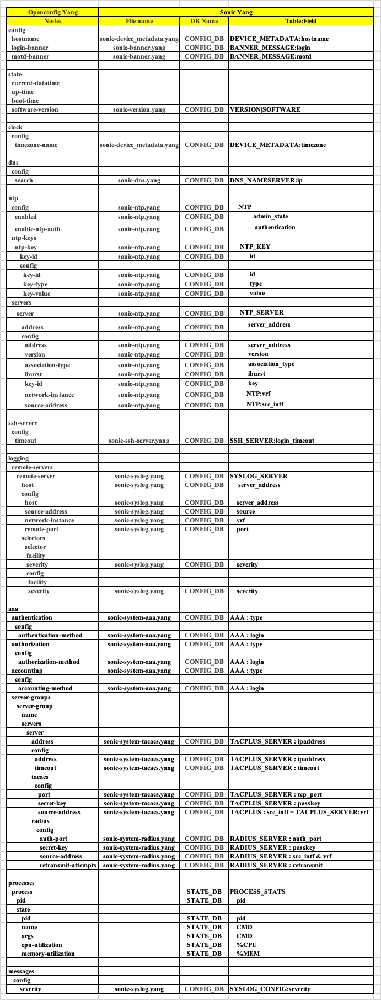

# OpenConfig support for System features

# High Level Design Document
#### Rev 0.1

# Table of Contents
  * [List of Tables](#list-of-tables)
  * [Revision](#revision)
  * [About This Manual](#about-this-manual)
  * [Scope](#scope)
  * [Definition/Abbreviation](#definitionabbreviation)
  * [1 Feature Overview](#1-feature-overview)
    * [1.1 Requirements](#11-requirements)
      * [1.1.1 Functional Requirements](#111-functional-requirements)
      * [1.1.2 Configuration and Management Requirements](#112-configuration-and-management-requirements)
      * [1.1.3 Scalability Requirements](#113-scalability-requirements)
    * [1.2 Design Overview](#12-design-overview)
      * [1.2.1 Basic Approach](#121-basic-approach)
      * [1.2.2 Container](#122-container)
  * [2 Functionality](#2-functionality)
      * [2.1 Target Deployment Use Cases](#21-target-deployment-use-cases)
  * [3 Design](#3-design)
    * [3.1 Overview](#31-overview)
    * [3.2 DB Changes](#32-db-changes)
      * [3.2.1 CONFIG DB](#321-config-db)
      * [3.2.2 APP DB](#322-app-db)
      * [3.2.3 STATE DB](#323-state-db)
      * [3.2.4 ASIC DB](#324-asic-db)
      * [3.2.5 COUNTER DB](#325-counter-db)
    * [3.3 User Interface](#33-user-interface)
      * [3.3.1 Data Models](#331-data-models)
      * [3.3.2 REST API Support](#332-rest-api-support)
      * [3.3.3 gNMI Support](#333-gnmi-support)
  * [4 Flow Diagrams](#4-flow-diagrams)
  * [5 Error Handling](#5-error-handling)
  * [6 Unit Test Cases](#6-unit-test-cases)
    * [6.1 Functional Test Cases](#61-functional-test-cases)
    * [6.2 Negative Test Cases](#62-negative-test-cases)

# List of Tables
[Table 1: Abbreviations](#table-1-abbreviations)

# Revision
| Rev |     Date    |       Author          | Change Description                |
|:---:|:-----------:|:---------------------:|-----------------------------------|
| 0.1 | 06/21/2024  | Anukul Verma | Initial version                   |

# About this Manual
This document provides general information about the OpenConfig configuration/management of System features in SONiC corresponding to openconfig-system.yang module and its sub-modules.

# Scope
- This document describes the high level design of OpenConfig configuration/management of System features via gNMI/REST in SONiC.
- This does not cover the SONiC KLISH CLI.
- Openconfig-system.yang version 2.1.0 - latest openconfig yang repo version is considered.
- Supported attributes in OpenConfig YANG tree:
```
module: openconfig-system
  +--rw system
     +--rw config
     |  +--rw hostname?       oc-inet:domain-name
     |  +--rw login-banner?   string
     |  +--rw motd-banner?    string
     +--ro state
     |  +--ro current-datetime?               oc-yang:date-and-time
     |  +--ro up-time?                        oc-types:timeticks64
     |  +--ro boot-time?                      oc-types:timeticks64
     |  +--ro software-version?               string
     |  +--ro last-configuration-timestamp?   oc-types:timeticks64
     +--ro mount-points
     |  +--ro mount-point* [name]
     |     +--ro name     -> ../state/name
     |     +--ro state
     |        +--ro name?                string
     |        +--ro size?                uint64
     |        +--ro available?           uint64
     |        +--ro type?                string
     +--rw aaa
     |  +--rw authentication
     |  |  +--rw config
     |  |  |  +--rw authentication-method*   union
     |  |  +--rw users
     |  |     +--rw user* [username]
     |  |        +--rw username    -> ../config/username
     |  |        +--rw config
     |  |        |  +--rw username?                                              string
     |  |        +--ro state
     |  |           +--ro username?                                              string
     |  |           +--ro oc-gnsi-credz:password-version?                        version
     |  |           +--ro oc-gnsi-credz:password-created-on?                     created-on
     |  |           +--ro oc-gnsi-credz:authorized-principals-list-version?      version
     |  |           +--ro oc-gnsi-credz:authorized-principals-list-created-on?   created-on
     |  |           +--ro oc-gnsi-credz:authorized-keys-list-version?            version
     |  |           +--ro oc-gnsi-credz:authorized-keys-list-created-on?         created-on
     |  +--rw authorization
     |  |  +--rw config
     |  |  |  +--rw authorization-method*   union
     |  |  +--ro state
     |  |  |  +--ro oc-gnsi-authz:grpc-authz-policy-version?      version
     |  |  |  +--ro oc-gnsi-authz:grpc-authz-policy-created-on?   created-on
     |  +--rw accounting
     |  |  +--rw config
     |  |  |  +--rw accounting-method*   union
     |  +--rw server-groups
     |     +--rw server-group* [name]
     |        +--rw name       -> ../config/name
     |        +--rw config
     |        |  +--rw name?   string
     |        |  +--rw type?   identityref
     |        +--ro state
     |        |  +--ro name?   string
     |        |  +--ro type?   identityref
     |        +--rw servers
     |           +--rw server* [address]
     |              +--rw address    -> ../config/address
     |              +--rw config
     |              |  +--rw name?      string
     |              |  +--rw address?   oc-inet:ip-address
     |              |  +--rw timeout?   uint16
     |              +--rw tacacs
     |              |  +--rw config
     |              |  |  +--rw port?                oc-inet:port-number
     |              |  |  +--rw secret-key?          oc-types:routing-password
     |              |  |  +--rw source-address?      oc-inet:ip-address
     |              +--rw radius
     |                 +--rw config
     |                 |  +--rw auth-port?             oc-inet:port-number
     |                 |  +--rw secret-key?            oc-types:routing-password
     |                 |  +--rw source-address?        oc-inet:ip-address
     |                 |  +--rw retransmit-attempts?   uint8
     +--ro alarms
     |  +--ro alarm* [id]
     |     +--ro id        -> ../state/id
     |     +--ro config
     |     +--ro state
     |        +--ro id?             string
     |        +--ro resource?       string
     |        +--ro text?           string
     |        +--ro time-created?   oc-types:timeticks64
     |        +--ro severity?       identityref
     |        +--ro type-id?        union
     +--rw logging
     |  +--rw remote-servers
     |  |  +--rw remote-server* [host]
     |  |     +--rw host         -> ../config/host
     |  |     +--rw config
     |  |     |  +--rw host?               oc-inet:host
     |  |     |  +--rw source-address?     oc-inet:ip-address
     |  |     |  +--rw network-instance?   oc-ni:network-instance-ref
     |  |     |  +--rw remote-port?        oc-inet:port-number
     |  |     +--rw selectors
     |  |        +--rw selector* [facility severity]
     |  |           +--rw facility    -> ../config/facility
     |  |           +--rw severity    -> ../config/severity
     |  |           +--rw config
     |  |           |  +--rw facility?   identityref
     |  |           |  +--rw severity?   syslog-severity
     +--rw processes
     |  +--ro process* [pid]
     |     +--ro pid      -> ../state/pid
     |     +--ro state
     |        +--ro pid?                  uint64
     |        +--ro name?                 string
     |        +--ro args*                 string
     |        +--ro cpu-utilization?      oc-types:percentage
     |        +--ro memory-utilization?   oc-types:percentage
     +--rw messages
     |  +--rw config
     |  |  +--rw severity?   oc-log:syslog-severity
     +--rw ssh-server
     |  +--rw config
     |  |  +--rw timeout?            uint16
     |  +--ro state
     |     +--ro oc-gnsi-credz:active-trusted-user-ca-keys-version?      version
     |     +--ro oc-gnsi-credz:active-trusted-user-ca-keys-created-on?   created-on
     |     +--ro oc-gnsi-credz:counters
     |        +--ro oc-gnsi-credz:access-rejects?       oc-yang:counter64
     |        +--ro oc-gnsi-credz:last-access-reject?   oc-types:timeticks64
     |        +--ro oc-gnsi-credz:access-accepts?       oc-yang:counter64
     |        +--ro oc-gnsi-credz:last-access-accept?   oc-types:timeticks64
     +--rw clock
     |  +--rw config
     |  |  +--rw timezone-name?   timezone-name-type
     +--ro cpus
     |  +--ro cpu* [index]
     |     +--ro index    -> ../state/index
     |     +--ro state
     |        +--ro index?                union
     |        +--ro total
     +--rw dns
     |  +--rw config
     |  |  +--rw search*   oc-inet:domain-name
     +--rw memory
     |  +--rw config
     |  +--ro state
     |     +--ro counters
     |     |  +--ro correctable-ecc-errors?     uint64
     |     |  +--ro uncorrectable-ecc-errors?   uint64
     |     +--ro physical?   uint64
     |     +--ro used?       uint64
     |     +--ro free?       uint64
     +--rw ntp
     |  +--rw config
     |  |  +--rw enabled?           boolean
     |  |  +--rw enable-ntp-auth?   boolean
     |  +--rw ntp-keys
     |  |  +--rw ntp-key* [key-id]
     |  |     +--rw key-id    -> ../config/key-id
     |  |     +--rw config
     |  |     |  +--rw key-id?      uint16
     |  |     |  +--rw key-type?    identityref
     |  |     |  +--rw key-value?   string
     |  +--rw servers
     |     +--rw server* [address]
     |        +--rw address    -> ../config/address
     |        +--rw config
     |        |  +--rw address?            oc-inet:host
     |        |  +--rw version?            uint8
     |        |  +--rw association-type?   enumeration
     |        |  +--rw iburst?             boolean
     |        |  +--rw key-id?      ->    ../../../ntp-keys/ntp-key/key-id
     |        |  +--rw network-instance?   oc-ni:network-instance-ref
     |        |  +--rw source-address?     oc-inet:ip-address
     +--rw oc-sys-grpc:grpc-servers
     |  +--rw oc-sys-grpc:grpc-server* [name]
     |     +--rw oc-sys-grpc:name                            -> ../config/name
     |     +--rw oc-sys-grpc:config
     |     |  +--rw oc-sys-grpc:name?                       string
     |     +--ro oc-sys-grpc:state
     |     |  +--ro oc-sys-grpc:name?                                              string
     |     |  +--ro oc-gnsi-certz:certificate-version?                             version
     |     |  +--ro oc-gnsi-certz:certificate-created-on?                          created-on
     |     |  +--ro oc-gnsi-certz:ca-trust-bundle-version?                         version
     |     |  +--ro oc-gnsi-certz:ca-trust-bundle-created-on?                      created-on
     |     |  +--ro oc-gnsi-certz:certificate-revocation-list-bundle-version?      version
     |     |  +--ro oc-gnsi-certz:certificate-revocation-list-bundle-created-on?   created-on
     |     +--ro oc-sys-grpc:connections
     |     |  +--ro oc-sys-grpc:connection* [address port]
     |     |     +--ro oc-sys-grpc:address    -> ../state/address
     |     |     +--ro oc-sys-grpc:port       -> ../state/port
     |     |     +--ro oc-sys-grpc:state
     |     |        +--ro oc-sys-grpc:address?    oc-inet:ip-address
     |     |        +--ro oc-sys-grpc:port?       oc-inet:port-number
     |     |        +--ro oc-sys-grpc:counters
     |     |           +--ro oc-sys-grpc:bytes-sent?        oc-yang:counter64
     |     |           +--ro oc-sys-grpc:packets-sent?      oc-yang:counter64
     |     |           +--ro oc-sys-grpc:data-send-error?   oc-yang:counter64
     |     +--ro oc-gnsi-pathz:gnmi-pathz-policy-counters
     |     |  +--ro oc-gnsi-pathz:paths
     |     |     +--ro oc-gnsi-pathz:path* [name]
     |     |        +--ro oc-gnsi-pathz:name     -> ../state/name
     |     |        +--ro oc-gnsi-pathz:state
     |     |           +--ro oc-gnsi-pathz:name?     string
     |     |           +--ro oc-gnsi-pathz:reads
     |     |           |  +--ro oc-gnsi-pathz:access-rejects?       oc-yang:counter64
     |     |           |  +--ro oc-gnsi-pathz:last-access-reject?   oc-types:timeticks64
     |     |           |  +--ro oc-gnsi-pathz:access-accepts?       oc-yang:counter64
     |     |           |  +--ro oc-gnsi-pathz:last-access-accept?   oc-types:timeticks64
     |     |           +--ro oc-gnsi-pathz:writes
     |     |              +--ro oc-gnsi-pathz:access-rejects?       oc-yang:counter64
     |     |              +--ro oc-gnsi-pathz:last-access-reject?   oc-types:timeticks64
     |     |              +--ro oc-gnsi-pathz:access-accepts?       oc-yang:counter64
     |     |              +--ro oc-gnsi-pathz:last-access-accept?   oc-types:timeticks64
     |     +--ro oc-gnsi-authz:authz-policy-counters
     |        +--ro oc-gnsi-authz:rpcs
     |           +--ro oc-gnsi-authz:rpc* [name]
     |              +--ro oc-gnsi-authz:name     -> ../state/name
     |              +--ro oc-gnsi-authz:state
     |                 +--ro oc-gnsi-authz:name?                 string
     |                 +--ro oc-gnsi-authz:access-rejects?       oc-yang:counter64
     |                 +--ro oc-gnsi-authz:last-access-reject?   oc-types:timeticks64
     |                 +--ro oc-gnsi-authz:access-accepts?       oc-yang:counter64
     |                 +--ro oc-gnsi-authz:last-access-accept?   oc-types:timeticks64
     +--ro gnmi-pathz-policies
     | +--ro policies
     |    +--ro policy* [instance]
     |       +--ro instance    -> ../state/instance
     |       +--ro state
     |          +--ro instance?     enumeration
     |          +--ro version?      version
     |          +--ro created-on?   created-on
```

# Definition/Abbreviation
### Table 1: Abbreviations

| **Term**                 | **Definition**                         |
|--------------------------|-------------------------------------|
| YANG                     | Yet Another Next Generation: modular language representing data structures in an XML tree format        |
| gNMI                     | gRPC Network Management Interface: used to retrieve or manipulate the state of a device via telemetry or configuration data         |

# 1 Feature Overview
## 1.1 Requirements
### 1.1.1 Functional Requirements
1. Provide support for OpenConfig System YANG models.
2. Implement transformer support for Openconfig system model to have following supports:  
    Configure/Set System attributes.  
    Get System attributes.  
    Delete System attributes.   
    Subscribe System attributes for telemetry.
3. Add support for following System features:
    * hostname
    * motd & login banner
    * current-datetime
    * boot-time & up-time
    * software-version
    * timezone
    * last-configuration-timestamp
    * dns
    * ntp
    * ssh-server
    * logging
    * aaa
    * processes
    * messages
    * alarms
    * mount-points
    * memory
    * cpus
    * grpc-servers
    * gnmi-pathz-policies

### 1.1.2 Configuration and Management Requirements
The System configuration/management can be done via REST and gNMI. The implementation will return an error if configuration is not allowed due to misconfiguration or un-supported node is accessed.

### 1.1.3 Scalability Requirements
NA

## 1.2 Design Overview
### 1.2.1 Basic Approach
SONiC already supports framework for Get, Patch and Delete via REST and gNMI. This feature adds support for OpenConfig based YANG models using transformer based implementation for System features.

### 1.2.2 Container
The code changes for this feature are part of *Management Framework* container which includes the REST server and *gnmi* container for gNMI support in *sonic-mgmt-common* repository.

# 2 Functionality
## 2.1 Target Deployment Use Cases
1. REST client through which the user can perform POST, PUT, PATCH, DELETE, GET operations on the supported YANG paths.
2. gNMI client with support for capabilities, get, set and subscribe based on the supported YANG models.

# 3 Design
## 3.1 Overview
This HLD design is in line with the [https://github.com/sonic-net/SONiC/blob/master/doc/mgmt/Management%20Framework.md]

## 3.2 DB Changes
### 3.2.1 CONFIG DB
There are no changes to CONFIG DB schema definition.  
For software-version, new table will be added, namely VERSIONS|SOFTWARE.

### 3.2.2 APP DB
There are no changes to APP DB schema definition.

### 3.2.3 STATE DB
There are no changes to STATE DB schema definition.  
New tables will be added along with support for some paths. These are:
- AUTHZ_TABLE|*
- CREDENTIALS|AUTHZ_POLICY
- CREDENTIALS|CERT
- CREDENTIALS|PATHZ_POLICY
- CREDENTIALS|SSH_ACCOUNT
- CREDENTIALS|SSH_HOST
- COMPONENT_STATE_TABLE|*
- HOST_STATS|CONFIG
- PATHZ_TABLE|*

### 3.2.4 ASIC DB
There are no changes to ASIC DB schema definition.

### 3.2.5 COUNTER DB
There are no changes to COUNTER DB schema definition.

## 3.3 User Interface
### 3.3.1 Data Models
Openconfig-system.yang (revision 2.1.0) and its submodules will be used as user interfacing models.  
We are updating openconfig-system yang version (0.7.0) in sonic with latest available openconfig version (revision 2.1.0), to have all the latest changes from community.  
Community PR [https://github.com/sonic-net/sonic-mgmt-common/pull/147]  
   * In this PR openconfig-system.yang and its submodules are updated to latest version available
   * Reference to openconfig-network-instance model is commented, as this module is yet to be supported in SONiC

Main changes in the latest openconfig versions are:
 * Feature wise major changes -
    * system/state -> up-time, software-version, last-configuration-timestamp nodes are added.
    * ntp -> source-address moved to per server list from global container. Also network-instance is included per server. NTP Key reference is added in server.
    * grpc-server -> Restructured completely, multiple server provision is added.
    * logging -> For remote-server, network-instance support is added. Files & VTY containers are added newly.
    * memory -> used and free leaves are added.
    * process -> uptime node is removed.

 * New features added in latest version -
    * license
    * mac-address
    * hashing
    * bootz
    * control-plane-traffic (copp)
    * resource utilization

### 3.3.2 REST API Support
#### 3.3.2.1 GET
Supported

#### 3.3.2.2 SET
Supported

#### 3.3.2.3 DELETE
Supported

### 3.3.3 gNMI Support
#### 3.3.3.1 GET
Supported

Sample GET output for system/state container:
```
gnmic -a <ip:port> -u <user> -p <passwd> get --path "/openconfig-system:system"
[
 {
  "source": "<ip:port>",
  "timestamp": 1712673160649745928,
  "time": "2024-04-09T20:02:40.649745928+05:30",
  "updates": [
   {
    "Path": "openconfig-system:system",
    "values": {
      "openconfig-system:system": {
          "state": {
            "boot-time": "1712672712",
            "current-datetime": "2024-04-09T14:32:40Z+00:00"
          }
        }
    }
   }
  ]
 }
]

```

#### 3.3.3.2 SET
Supported

Sample SET logs for system/config/hostname node:
```
gnmi_set -target_addr <ip:port> -update /openconfig-system:system/config/hostname:@./hostname-value.json -xpath_target OC-YANG
/openconfig-system:system/config/hostname
@./hostname-value.json
== setRequest:
prefix: <
  target: "OC-YANG"
>
update: <
  path: <
    origin: "openconfig-system"
    elem: <
      name: "system"
    >
    elem: <
      name: "config"
    >
    elem: <
      name: "hostname"
    >
  >
  val: <
    json_ietf_val: "{\"hostname\": \"mytest-hostname\"}"
  >
>

== setResponse:
prefix: <
  target: "OC-YANG"
>
response: <
  path: <
    origin: "openconfig-system"
    elem: <
      name: "openconfig-system:system"
    >
    elem: <
      name: "config"
    >
    elem: <
      name: "hostname"
    >
  >
  op: UPDATE
>
```

#### 3.3.3.3 DELETE
Supported

Sample delete logs on system/config/hostname node   
```
gnmi_set -target_addr <ip:port> -delete /openconfig-system:system/config/hostname -xpath_target OC-YANG
== setRequest:
prefix: <
  target: "OC-YANG"
>
delete: <
  origin: "openconfig-system"
  elem: <
    name: "system"
  >
  elem: <
    name: "config"
  >
  elem: <
    name: "hostname"
  >
>

== setResponse:
prefix: <
  target: "OC-YANG"
>
response: <
  path: <
    origin: "openconfig-system"
    elem: <
      name: "openconfig-system:system"
    >
    elem: <
      name: "config"
    >
    elem: <
      name: "hostname"
    >
  >
  op: DELETE
>
```

#### 3.3.3.4 SUBSCRIBE
Supported

Sample telemetry logs with ON-CHANGE mode on system/config/hostname node   
```
gnmic -a <ip>:<port> -u <> -p <> sub --path "/openconfig-system:system/config/hostname" --target OC-YANG --stream-mode on-change

{
  "source": "<ip>:<port>",
  "subscription-name": "default-1726297999",
  "timestamp": 1726298048063798519,
  "time": "2024-09-14T12:44:08.063798519+05:30",
  "prefix": "openconfig-system:system/config",
  "target": "OC-YANG",
  "updates": [
    {
      "Path": "hostname",
      "values": {
        "hostname": "test-hostname"
      }
    }
  ]
}
```

Sample telemetry logs with SAMPLE mode on system/config/hostname node   
```
gnmic -a <ip>:<port> -u <> -p <> sub --path "/openconfig-system:system/config/hostname" --target OC-YANG  --stream-mode sample 
{
  "source": "<ip>:<port>",
  "subscription-name": "default-1726298785",
  "timestamp": 1726298785374727009,
  "time": "2024-09-14T12:56:25.374727009+05:30",
  "prefix": "openconfig-system:system/config",
  "target": "OC-YANG",
  "updates": [
    {
      "Path": "hostname",
      "values": {
        "hostname": "test-hostname-1"
      }
    }
  ]
}

{
  "source": "<ip>:<port>",
  "subscription-name": "default-1726298785",
  "timestamp": 1726298805381331766,
  "time": "2024-09-14T12:56:45.381331766+05:30",
  "prefix": "openconfig-system:system/config",
  "target": "OC-YANG",
  "updates": [
    {
      "Path": "hostname",
      "values": {
        "hostname": "test-hostname-1"
      }
    }
  ]
}
```
Sample telemetry logs with ON-CHANGE mode on system/logging/remote-servers/remote-server[host=<>]/config/remote-port node   
```
gnmic -a <ip>:<port> -u <> -p <> sub --path "/openconfig-system:system/logging/remote-servers/remote-server[host=3.3.2.1]/config/remote-port" --target OC-YANG --stream-mode on-change

{
  "source": "<ip>:<port>",
  "subscription-name": "default-1726301236",
  "timestamp": 1726301236435511374,
  "time": "2024-09-14T13:37:16.435511374+05:30",
  "prefix": "openconfig-system:system/logging/remote-servers/remote-server[host=3.3.2.1]/config",
  "target": "OC-YANG",
  "updates": [
    {
      "Path": "remote-port",
      "values": {
        "remote-port": 4444
      }
    }
  ]
}
{
  "source": "<ip>:<port>",
  "subscription-name": "default-1726301236",
  "timestamp": 1726301246166992112,
  "time": "2024-09-14T13:37:26.166992112+05:30",
  "prefix": "openconfig-system:system/logging/remote-servers/remote-server[host=3.3.2.1]/config",
  "target": "OC-YANG",
  "updates": [
    {
      "Path": "remote-port",
      "values": {
        "remote-port": 3333
      }
    }
  ]
}
```
Example list of xpaths which can be used for subscription  
```
"/openconfig-system:system/config/hostname"
"/openconfig-system:system/config/motd-banner"
"/openconfig-system:system/config/login-banner"
"/openconfig-system:system/state/software-version"
"/openconfig-system:system/logging/remote-servers/remote-server[host=<>]/config/remote-port"
"/openconfig-system:system/messages/config"
"/openconfig-system:system/ssh-server/config"
/openconfig-system:system/clock/config"
"/openconfig-system:system/processes/process[pid=<>]"
"/openconfig-system:system/dns/config"
"/openconfig-system:system/ntp/config"
"openconfig-system:system/ntp/ntp-keys/ntp-key[key-id=<>]/config"
"/openconfig-system:system/ntp/servers/server[address=<>]/config"
```

# 4 Flow Diagrams
Mapping attributes between OpenConfig YANG and SONiC YANG:


Translation Notes:  
1. current-datetime, up-time & boot-time nodes are directly fetched from system using syscall.
2. system/dns/config/search : Deletion of individual value is not supported currently.
3. system/ntp -  
   i. Server version - Only 3 and 4 are supported in SONiC  
   ii. Server association-type - Only SERVER & POOL are supported in SONiC  
   iii. Key-type - Only MD5 is supported as per Openconfig  
   iv. Server network-instanse & source-address - Only a single value is supported across servers, as SONiC support these nodes in global table, not per server.  
   v. Server source-address - SONiC has src_intf support instead of source-address in NTP configurations. Translib will fetch src_intf for given address.  
                              So user must configure IP on Ports properly, before NTP configuration.  
4. logging & messages severity - EMERGENCY, ALERT & CRITICAL, all these three are translated to SONiC critical level
5. logging facility - Only ALL is supported currently

# 5 Error Handling
Invalid configurations/operations will report an error.

# 6 Unit Test cases
## 6.1 Functional Test Cases
Operations:  
gNMI - (Create/Update/Delete/Replace/Get/Subscribe)  
REST - POST/PATCH/DELETE/PUT/GET  
1. Verify that operations supported for gNMI/REST works fine for hostname.
1. Verify that operations supported for gNMI/REST works fine for last-configuration-timestamp.
2. Verify that operations supported for gNMI/REST works fine for clock/timezone-name.
3. Verify that operations supported for gNMI/REST works fine for DNS nameserver.
4. Verify that operations supported for gNMI/REST works fine for NTP nodes.
5. Verify that operations supported for gNMI/REST works fine for ssh-server nodes.
6. Verify that operations supported for gNMI/REST works fine for logging and messages nodes.
7. Verify that operations supported for gNMI/REST works fine for AAA (TACACS & RADIUS) nodes.
8. Verify that operations supported for gNMI/REST works fine for login & motd banners.
9. Verify that operations supported for gNMI/REST works fine for up-time, boot-time, current-datetime & software-version.
10. Verify that operations supported for gNMI/REST works fine for processes nodes.
11. Verify that operations supported for gNMI/REST works fine for alarms nodes.
12. Verify that operations supported for gNMI/REST works fine for mount-points nodes.
13. Verify that operations supported for gNMI/REST works fine for memory nodes.
14. Verify that operations supported for gNMI/REST works fine for cpus nodes.
15. Verify that operations supported for gNMI/REST works fine for grpc-servers nodes.
16. Verify that operations supported for gNMI/REST works fine for gnmi-pathz-policies nodes.

## 6.2 Negative Test Cases
1. Verify that any operation on unsupported nodes give a proper error.
2. Verify that invalid hostname configuration is not allowed.
3. Verify that invalid DNS nameserver configuration is not allowed.
4. Verify that invalid timezone-name is not allowed.
5. Verify that invalid NTP source address returns proper error.
6. Verify that AAA server source-address accepts only valid IP.
7. Verify that GET on processes with non-existing pid returns an empty data.
8. Verify that GET on alarms with non-existing alarm-id returns an empty data.
9. Verify that GET on mount-points with non-existing mount-point returns an empty data.
10. Verify that GET on cpus with non-existing cpu returns an empty data.
11. Verify that GET on grpc-servers with non-existing grpc-server returns an empty data.
12. Verify that GET on grpc-servers/connections with non-existing address:port returns an empty data.
13. Verify that GET on grpc-servers/gnmi-pathz-policy-counters with non-existing path returns an empty data.
14. Verify that GET on grpc-servers/authz-policy-counters with non-existing rpc returns an empty data.
15. Verify that GET on gnmi-pathz-policies with non-existing instance returns an empty data.
