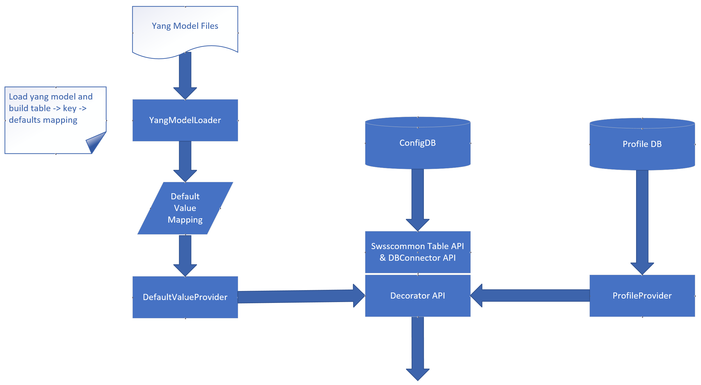

# ConfigDB default value from Yang model

## Table of Contents

# About this Manual
This document provides a detailed description on the new features for:
 - Get default value from Yang model.
 - swss-common API support read default value from config DB.

## SONiC memory issue solved by this feature.
 - Potential risk: Yang model default value conflict with hardcoded value:
    - Default value hardcoded in source code.
    - Yang model default value not used.
 - SONiC utilities not support get default value.

# 1 Functional Requirement
## 1.1 swss-common return default value from Yang model
 - Return default value is optional.
   - Application can read config without default value, also can read config with default value.
 - Backward compatibility with existed code and applications.

# 2 Design
 - Design diagram:

## 2.1 Considerations
### How to get default value

|                                                              | Pros                                              | Cons                                                         |
| ------------------------------------------------------------ | ------------------------------------------------- | ------------------------------------------------------------ |
| Get default value from Yang model in read API.               | Redis config DB keeps no change.                  | 3 MB memory per-process because need load Yang model and reference libyang. 0.05 second to load yang model. |
| Write default value to default value DB when write config DB. | Better read performance, Less memory consumption. | Need add new Redis DB for default value.                     |

### API compatibility

|                                        | Pros                                                         | Cons                                                         |
| -------------------------------------- | ------------------------------------------------------------ | ------------------------------------------------------------ |
| Existed read API return default value. | Less code change, all app will get default value automatically. | There are hardcoded default value may different with Yang model, new default value from config DB may cause code bug. |
| Existed read API keeps no change.      | When update existed code, can cleanup code to remove hard coded default value. | All apps need code update.                                   |

## 2.2 Load yang model
 - YangModelLoader class
   - load table name to default value mapping to memory.
 - DefaultValueProvider class
   - Find default value information by table name and config DB key
   - Merge default value to API result.

## 2.3 Other code change
 - Following method will change to get default value from DefaultValueProvider
   - ConfigDBPipeConnector_Native::_get_config(DBConnector& client, RedisTransactioner& pipe, map<string, map<string, map<string, string>>>& data, int cursor, bool withDefaultValue)
   - ConfigDBConnector_Native::get_config(bool withDefaultValue)
   - ConfigDBConnector_Native::get_table(string table, bool withDefaultValue)
   - DBConnector::hgetall(const std::string &key, OutputIterator result, bool withDefaultValue)
   - Table::get(const string &key, vector<FieldValueTuple> &values)

## 2.4 API change

 - All existed API keep no change.
 - Add new API with 1 new parameter 'withDefaultValue'
   - Example:
     - Current API:
       - ConfiDBConnector::get_table(std::string table)
     - New API:
       - ConfiDBConnector::get_table(std::string table, bool **withDefaultValue**)

## 2.5 Other solutions

|                                                              | Pros                                                         | Cons                                                         |
| ------------------------------------------------------------ | ------------------------------------------------------------ | ------------------------------------------------------------ |
| 1. All existed APIs change to return default value. 2. Add new API to get 'real' data from config DB, which not have default value. | Less code change, all app will get default value automatically. | 1. There are hardcoded default value in many different place, the default value of those code may different with default value from Yang model, so new default value from config DB may cause code bug, this is a potential risk. 2. 3 MB memory per-process because need load Yang model. 3. 0.05 second to load yang model |
| 1. Write API change: when write data to config DB, also write default value to 'Default_value_DB'. 2. Read API change: read default value from 'Default_value_DB' and merge with config DB result. | 1. Less memory consumption and better performance when only call read API: read API no need to load yang model. 2. Less code change, all app will get default value automatically. | Hardcoded default value code still need cleanup.             |

# 3 Error handling
 - Load yang model: throw exception when found yang model data issue.
 - swss-common API: if not found Yang model schema data for a given table name, write warning message to syslog.

# 4 Serviceability and Debug
 - Debug version will write debug log to syslog.

# 6 Unit Test
 - All new code will 100% covered by gtest test case.
 - Add E2E test case for all new APIs.

# 7 Changed API list
   - ConfiDBConnector
     - get_entry(std::string table, std::string key, bool withDefaultValue)
     - get_table(std::string table, bool withDefaultValue)
     - get_config(bool withDefaultValue)
     - listen(self, init_data_handler=None, with_default_value=False)
   - ConfigDBPipeConnecto
     - get_config(bool withDefaultValue)
   - DBConnector
     - hget(const string &key, const string &field, bool withDefaultValue)
     - hgetall(const std::string &key, bool withDefaultValue)
     - hgetall(const std::string &key, OutputIterator result, bool withDefaultValue)
   - DBInterface
     - get(const std::string& dbName, const std::string& hash, const std::string& key, bool withDefaultValue, bool blocking)
     - get_all(const std::string& dbName, const std::string& hash, bool withDefaultValue, bool blocking)
   - RedisClient
     - get(const std::string &key, const std::string &field, bool withDefaultValue)
     - hgetall(const std::string &key, bool withDefaultValue)
   - SonicV2Connector
     - get(const std::string& db_name, const std::string& _hash, const std::string& key, bool withDefaultValue, bool blocking)
     - get_all(const std::string& db_name, const std::string& _hash, bool withDefaultValue, bool blocking)
   - SubscriberStateTable
     - SubscriberStateTable(DBConnector *db, const string &tableName, bool withDefaultValue, int popBatchSize, int pri)
   - Table
     - get(const string &key, vector<FieldValueTuple> &values, bool withDefaultValue)
     - getContent(vector<KeyOpFieldsValuesTuple> &tuples, bool withDefaultValue)

# 8 References
## SONiC YANG MODEL GUIDELINES
https://github.com/Azure/SONiC/blob/master/doc/mgmt/SONiC_YANG_Model_Guidelines.md
