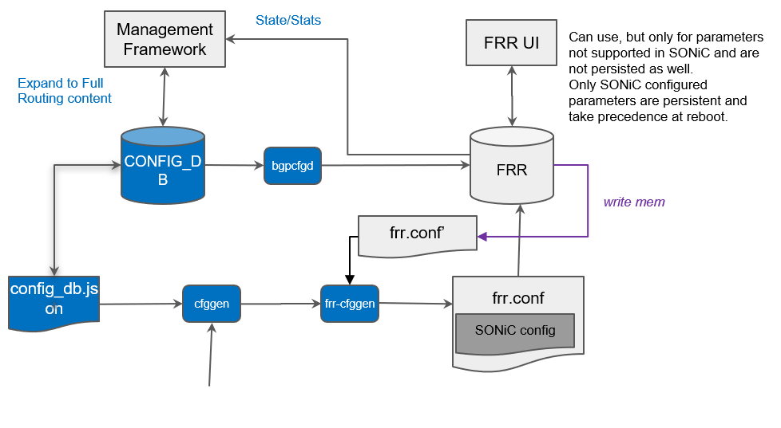
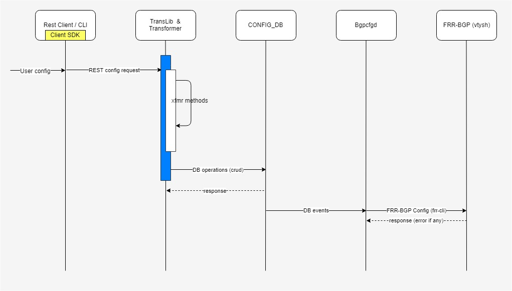
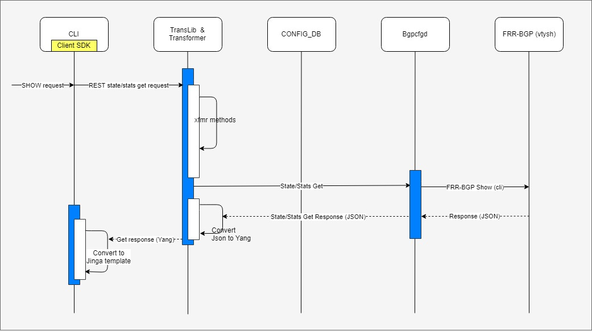
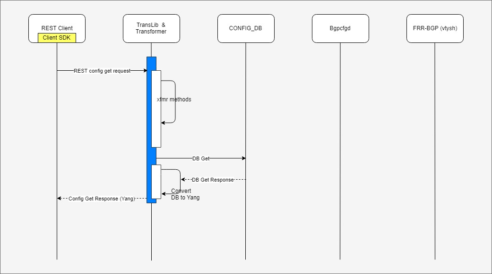
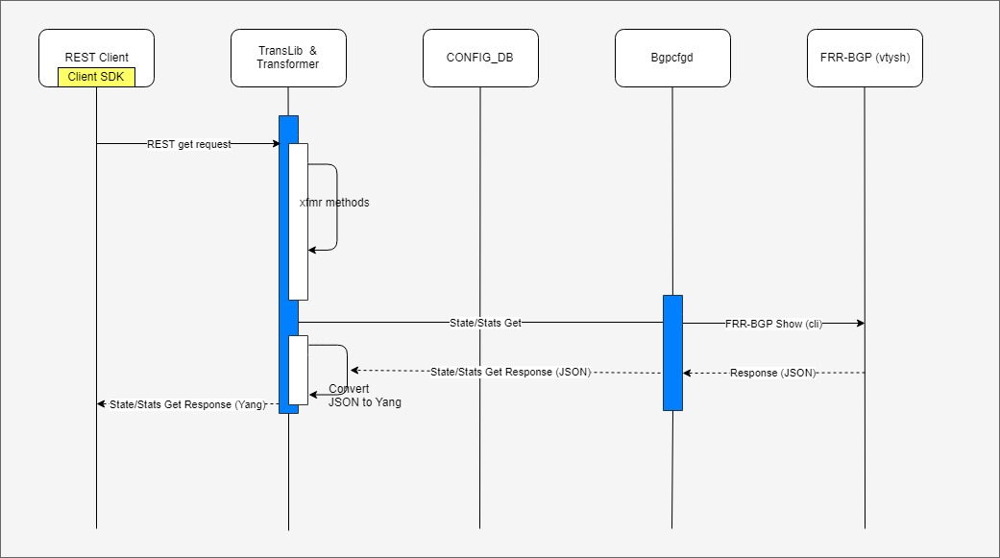

# SONiC FRR-BGP Extended Unified Configuration Management Framework
## High Level Design Document
### Rev 0.4

## Table of Contents
  * [List of Tables](#list-of-tables)
  * [Revision](#revision)
  * [About This Manual](#about-this-manual)
  * [Scope](#scope)
  * [Definition/Abbreviation](#definitionabbreviation)
  * [Table 1: Abbreviations](#table-1-abbreviations)
  * [1 Feature Overview](#1-feature-overview)
      * [1.1 Requirements](#11-requirements)
        * [1.1.1 Functional Requirements](#111-functional-requirements)
        * [1.1.2 Configuration and Management Requirements](#112-configuration-and-management-requirements)
        * [1.1.3 Scalability Requirements](#113-scalability-requirements)
        * [1.1.4 Warm Boot Requirements](#114-warmboot-requirements)
      * [1.2 Design Overview](#12-design-overview)
          * [1.2.1 Basic Approach](#121-basic-approach)
          * [1.2.2 Container](#122-container)
  * [2 Functionality](#2-functionality)
  * [3 Design](#3-design)
    * [3.1 Overview](#31-overview)
    * [3.2 DB Changes](#32-db-changes)
    * [3.3 SwSS Design](#33-swss-design)
    * [3.4 SyncD](#34-syncd)
    * [3.5 SAI](#35-sai)
    * [3.6 User Interface](#36-user-interface)
      * [3.6.1 Data Models](#361-data-models)
      * [3.6.2 CLI](#362-cli)
          * [3.6.2.1 Configuration Commands](#3621-configuration-command)
          * [3.6.2.2 Show Commands](#3622-show-command)
          * [3.6.2.3 Debug Commands](#3623-debug-command)
          * [3.6.2.4 IS-CLI Compliance](#3624-is-cli-compliance)
      * [3.6.3 REST API Support](#363-rest-api-support)
  * [4 Flow Diagrams](#4-flow-diagrams)
    * [4.1 Configuration Sequence](#41-configuration-sequence)
    * [4.2 CLI Show Command Sequence](#42-cli-show-command-sequence)
      * [4.2.1 CLI Show Sequence - config only](#421-cli-show-sequence-config-only)
      * [4.2.2 CLI Show Sequence - State/Statistics](#422-cli-show-sequence-state-statistics)
    * [4.3 REST Get Sequence](#43-rest-get-sequence)
      * [4.3.1 REST Get Sequence - config only](#431-rest-get-sequence-config-only)
      * [4.3.2 REST Get Sequence - State/Statistics](#432-rest-get-sequence-state-statistics)
  * [5 Error Handling](#6-error-handling)
  * [6 Serviceability and Debug](#7-serviceability-and-debug)
  * [7 Warm Boot Support](#8-warm-boot-support)
  * [8 Scalability](#9-scalability)
  * [9 Unit Test](#10-unit-test)
  * [APPENDIX](#APPENDIX)


## List of Tables
[Table 1: Abbreviations](#table-1-abbreviations)

## Revision
| Rev |     Date    |       Author       | Change Description                |
|:---:|:-----------:|:------------------:|-----------------------------------|
| 0.1 | 09/25/2019  | Karthikeyan Arumugam | Initial version                 |
| 0.2 | 10/30/2019  | Venkatesan Mahalingam | Config DB schema changes |
| 0.3 | 11/20/2019  | Venkatesan Mahalingam | Added various fields in config DB |
| 0.4 | 12/18/2019  | Venkatesan Mahalingam | Addressed the comments on error handling and method of testing |
| 0.5 | 11/29/2021 | Sucheta Mahara | Enable BGP with link local only using v6only|

## About this Manual
This document provides general information about the implementation of Extended Unified Configuration and Management framework support for FRR-BGP feature in SONiC.
## Scope
This document describes the high level design of FRR-BGP Extended Unified Configuration and Management feature.

## Definition/Abbreviation

### Table 1: Abbreviations
| **Term**                 | **Meaning**                         |
|--------------------------|-------------------------------------|
| FRR                      | Free Range Routing Stack            |
| CVL                      | Config Validation Library           |
| VRF                      | Virtual routing forwarding          |
| RIB                      | Routing Information Base            |
| PBR                      | Policy based routing                |
| NBI                      | North Bound Interface               |


# 1 Feature Overview

This feature extends and provides unified configuration and management capability for FRR-BGP features used in SONiC. This allows the user to configure & manage FRR-BGP using SONiC Management Framework with Open Config data models via REST, gNMI and also provides access via SONiC Management Framework CLI as well.


## 1.1 Requirements


### 1.1.1 Functional Requirements

  1. Extend Unified mode for full FRR-BGP config and management in SONiC
  2. Extend sonic-cfggen, bgpcfgd and integrate with FRR-BGP for features supported in SONiC
  3. Support for retrieval of FRR-BGP state and statistics information
  4. For backward compatibility retain access to FRR UI (vtysh) for managing features that are NOT in conflict with SONiC features

### 1.1.2 Configuration and Management Requirements

1. Support Open Config data models for BGP config and Management
2. Provide IS-CLI/gNMI/REST support for config and management of FRR-BGP features used in SONIC
3. Enhance with Custom YANG models for features used in BGP that are not supported via Open Config data model
4. Define ABNF schema for BGP features used in SONiC

### 1.1.3 Scalability Requirements
N/A

### 1.1.4 Warm Boot Requirements
As state and statistics information is retrieved from FRR-BGP on demand there is no Warm Boot specific requirements for this feature.

## 1.2 Design Overview
SONiC FRR-BGP Extended Unified config and management capability makes use of Management framework to implement the backend and transformer methods to support Open Config data models for BGP and route policy feature. The backend converts the incoming request to Redis ABNF schema format and writes the configuration to Redis DB. Then from DB events, bgpcfgd will configure FRR-BGP using FRR CLI commands.
It also uses management framework's transformer methods to do syntactic and semantic validation of the requests using ABNF JSON before writing them into the Redis DB.

### 1.2.1 Basic Approach

* This enhancement takes comprehensive approach to support BGP features used in SONiC:
	* Standard based YANG models and custom YANG models
	* Open API spec
	* Industry standard CLI
	* Config Validation
* REST server, gNMI server, Transformer methods - all in Go
* Marshalling and unmarshalling using YGOT
* Redis updated using CAS(Check-and-Set) trans. (No locking, No rollback)
* Config Validation by using YANG model from ABNF schema

### 1.2.2 Container

There will be changes in following containers,
* sonic-mgmt-framework
* sonic-frr

### 1.2.3 SAI Overview
N/A - software feature


# 2 Functionality
## 2.1 Target Deployment Use Cases
Configure and manage FRR-BGP via gNMI, REST and CLI interfaces using SONiC Management Framework.

## 2.2 Functional Description
Provide GNMI and REST support for config get/set, state get and statistics get,  CLI config and show commands for FRR-BGP features used in SONiC.


# 3 Design
## 3.1 Overview
The extended unified config and management framework for FRR-BGP in SONiC is represented in below diagram.



1. Transformer common app owns the Open config data models related to BGP (which means no separate app module required for handling BGP open-config and augmented YANG objects).

2. Provide annotations for required objects so that transformer core and common app will take care of handling them.

3. Provide transformer methods as per the annotations defined to take care of model specific logics and validations.

4. Define SONiC YANG and Redis ABNF schema for the supported Open Config BGP models & objects.

5. KLISH CLI and REST clients provide extensive BGP configurations and hence there should not be any need for BGP configurations via vtysh.

6. In bgpcfgd register for Redis DB events for the BGP and other related objects, so as to translate the Redis DB events to FRR-BGP CLI commands to configure FRR-BGP, similarly, separate config daemons can be present to configure individual features like OSPF, BFD..etc

7. Update /usr/share/sonic/templates/bgpd.conf.j2 template for new FRR-BGP configurations supported in SONiC which will be used by sonic-cfggen to generate /etc/frr/bgpd.conf file.

## 3.2 DB Changes
Following section describes the changes to DB.

### 3.2.1 CONFIG DB

Added new tables to configure following information:

  * BGP router & address family configurations
  * BGP neighbor & address family configurations
  * BGP peer group & address family configurations
  * BGP listen prefix configuration for peer group
  * Route map configurations
  * Route redistribute configurations
  * Route policy sets (prefix list/community/ext-community/as-path/neighbor-set/tag-set configurations

Enhanced following table to configure additional attributes:

  * BGP Neighbor table

#### 3.2.1.1 BGP_GLOBALS
```JSON
;Defines BGP globals table
;
;Status: stable

key                                  = BGP_GLOBALS|vrf ;
vrf                                  = 1\*15VCHAR ; VRF name
local_asn                            = 1*10DIGIT ; Local ASN for the BGP instance
router_id                            = \*IPv4prefix ; Router ID IPv4 address
load_balance_mp_relax                = "true" / "false" ;
grace_restart                        = "true" / "false" ;
always_compare_med                   = "true" / "false" ;
load_balance_mp_relax                = "true" / "false" ;
graceful_restart_enable              = "true" / "false" ;
gr_restart_time                      = 1*4DIGIT ; {1..3600 };
gr_stale_routes_time                 = 1*4DIGIT ; {1..3600 };
ebgp_route_distance                  = 1*2DIGIT ; {1..255 };
ibgp_route_distance                  = 1*2DIGIT ; {1..255 };
external_compare_router_id           = "true" / "false" ;
ignore_as_path_length                = "true" / "false" ;
log_nbr_state_changes                = "true" / "false" ;
rr_cluster_id                        = 1*64VCHAR ; Route reflector cluster id
rr_allow_out_policy                  = "true" / "false" ; Router reflector allow outbound Policy
disable_ebgp_connected_rt_check      = "true" / "false" ;
fast_external_failover               = "true" / "false" ;
network_import_check                 = "true" / "false" ;
graceful_shutdown                    = "true" / "false" ;
route_flap_dampen                    = "true" / "false" ;
route_flap_dampen_half_life          = 1*2DIGIT; {1..45}
route_flap_dampen_reuse_threshold    = 1*5DIGIT; {1..20000}
route_flap_dampen_suppress_threshold = 1*5DIGIT; {1..20000}
route_flap_dampen_max_suppress       = 1*3DIGIT; {1..255}
rr_clnt_to_clnt_reflection           = "true" / "false" ;
max_dynamic_neighbors                = 1*4DIGIT; {1..5000}
read_quanta                          = 1*2DIGIT; {1..10} Indicates how many packets to read from peer socket per I/O cycle
write_quanta                         = 1*2DIGIT; {1..10} Indicates how many packets to write to peer socket per run
coalesce_time                        = 1*10DIGIT; Subgroup coalesce timer value in milli-sec
route_map_process_delay              = 1*3DIGIT; { 0..600}
deterministic_med                    = "true" / "false" ;
med_confed                           = "true" / "false" ; Compare MED among confederation paths when set to true
med_missing_as_worst                 = "true" / "false" ; Treat missing MED as the least preferred one when set to true
compare_confed_as_path               = "true" / "false" ; Compare path lengths including confederation sets & sequences in selecting a route
as_path_mp_as_set                    = "true" / "false" ; Generate an AS_SET
default_ipv4_unicast                 = "true" / "false" ; Activate ipv4-unicast for a peer by default
default_local_preference             = "true" / "false" ; Configure default local preference value
default_show_hostname                = "true" / "false" ; Show hostname in BGP dumps
default_shutdown                     = "true" / "false" ; Apply administrative shutdown to newly configured peers
default_subgroup_pkt_queue_max       = 1*2DIGIT; {20..100} Configure subgroup packet queue max
max_med_time                         = 1*5DIGIT; {5..86400} Time (seconds) period for max-med
max_med_val                          = 1*10DIGIT; Max MED value to be used
max_delay                            = 1*4DIGIT; {0..3600} Maximum delay for best path calculation
establish_wait                       = 1*5DIGIT; {Maximum delay for updates}
```
#### 3.2.1.2 BGP_GLOBALS_AF
```JSON
;Defines BGP Address family table
;
;Status: stable

key                       = BGP_GLOBALS_AF|vrf|af_name ;
vrf                       = 1\*15VCHAR ; VRF name
af_name                   = "ipv4_unicast" / "ipv6_unicast" / "l2vpn_evpn"  ; address family
max_ebgp_paths            = 1*3DIGIT ; {1..256}
max_ibgp_paths            = 1*3DIGIT ; {1..256}
aggregate_prefix          = IPv4Prefix / IPv6prefix ;
aggregate_as_set          = "true" / "false" ;
aggregate_summary_only    = "true" / "false" ;
network_prefix            = IPv4Prefix / IPv6prefix ;
network_policy            = 1*64VCHAR ;
network_backdoor          = "true" / "false" ;
route_download_filter     = 1*64VCHAR ;
ebgp_route_distance       = 1*3DIGIT; { 1.255}
ibgp_route_distance       = 1*3DIGIT; { 1.255}
ibgp_equal_cluster_length = "true" / "false" ;

```

#### 3.2.1.3 BGP_LISTEN_PREFIX
```JSON
;Defines BGP Listen Prefix table
;
;Status: stable

key             = BGP_GLOBALS_LISTEN_PREFIX|vrf|IPprefix ;
vrf             = 1\*15VCHAR ; VRF name
IPprefix        = IPv4Prefix / IPv6prefix ;
peer_group_name = 1*64VCHAR ; Peer group this listen prefix is associated with
```

#### 3.2.1.4 BGP_NEIGHBOR

```JSON
;Defines BGP neighbor table
;
;Status: stable

key                                = BGP_NEIGHBOR|vrf|neighbor_ip ;
vrf                                = 1\*15VCHAR ; VRF name
neighbor                           = IPv4Prefix / IPv6prefix Ethernet / PortChannel / Vlan ;
local_asn                          = 1*10DIGIT ; Local ASN for the BGP neighbor
name                               = 1*64VCHAR ; BGP neighbor description
asn                                = 1*10DIGIT; Remote ASN value
ebgp_multihop                      = "true" / "false" ; Allow EBGP neighbors not on directly connected networks
ebgp_multihop_ttl                  = 1*3DIGIT ; {1..255} EBGP multihop count
auth_password                      = STRING ; Set a password
enabled                            = "true" / "false" ; Neighbor admin status
keepalive_intvl                    = 1*4DIGIT ; {1..3600} keepalive interval
hold_time                          = 1*4DIGIT ; {1..3600}  hold time
local_address                      = IPprefix ; local IP address
peer_group_name                    = 1*64VCHAR ; peer group name
peer_type                          = "internal" / "external" Internal/External BGP peer
conn_retry                         = 1*5DIGIT ; {1..65535} Connection retry timer
min_adv_interval                   = 1*3DIGIT ; {1..600} Minimum interval between sending BGP routing updates
passive_mode                       = "true" / "false" ; Don't send open messages
capability_ext_nexthop             = "true" / "false" ; Advertise extended next-hop capability
disable_ebgp_connected_route_check = "true" / "false" ; one-hop away EBGP peer using loopback address
enforce_first_as                   = "true" / "false" ; Enforce the first AS for EBGP route
solo_peer                          = "true" / "false" ; Solo peer - part of its own update group
ttl_security_hops                  = 1*3DIGIT ; {1.254} BGP ttl-security parameters
bfd                                = "true" / "false" ; Enable BFD support
capability-dynamic                 = "true" / "false" ; Advertise dynamic capability
dont-negotiate-capability          = "true" / "false" ; Do not perform capability negotiation
enforce-multihop                   = "true" / "false" ; Allow EBGP neighbors not on directly connected networks
override-capability                = "true" / "false" ; Override capability negotiation result
peer-port                          = 1*5DIGIT ; {0..65535} Neighbor's BGP port
shutdown-message                   = "true" / "false" ; Add a shutdown message
strict-capability-match            = "true" / "false" ; Strict capability negotiation match
v6only                             = "true" / "false" ; Establish BGP session with Link local only.

```
#### 3.2.1.5 BGP_NEIGHBOR_AF
```JSON
;Defines BGP Neighbor table at an address family level
;
;Status: stable

key                            = BGP_NEIGHBOR_AF|vrf|neighbor_ip|af_name ;
vrf                            = 1\*15VCHAR ; VRF name
neighbor_ip                    = IPv4Prefix / IPv6prefix ;
af_name                        = "ipv4_unicast" / "ipv6_unicast" / "l2vpn_evpn"  ; address family
enabled                        = "true" / "false" ; Neighbor admin status
send_default_route             = "true" / "false" ;
default_rmap                   = 1*64VCHAR ; Filter sending default routes bsaed on this route map.    
max_prefix_limit               = 1*10DIGIT; Maximum number of prefixes to accept from this peer
max_prefix_warning_only        = "true" / "false" ; Only give warning message when limit is exceeded
max_prefix_warning_threshold   = 1*3DIGIT; Threshold value (%) at which to generate a warning msg
max_prefix_restart_interval    = 1*5DIGIT; Restart bgp connection after limit is exceeded
route_map_in                   = 1*64VCHAR ; Apply route map on incoming routes from neighbor
route_map_out                  = 1*64VCHAR ; Apply route map on outgoing routes to neighbor
soft_reconfiguration_in        = "true" / "false" ; Per neighbor soft reconfiguration
unsuppress_map_name            = 1*64VCHAR ; Route-map to selectively un-suppress suppressed routes        
route_reflector_client         = "true" / "false" ; Configure a neighbor as Route Reflector client
weight                         = 1*5DIGIT ; {0..65535} Set default weight for routes from this neighbor
as_override                    = "true" / "false" ;  Override ASNs in outbound updates if aspath equals remote-as
send_community                 = "standard" / "extended" / "both" / "none" ; Send Community attribute to this neighbor
add_path_tx_all                = "true" / "false" ;
add_path_tx_bestpath           = "true" / "false" ;
unchanged_as_path              = "true" / "false" ;
unchanged_med                  = "true" / "false" ;
unchanged_nexthop              = "true" / "false" ;      
filter_list_name               = 1*64VCHAR ;
filter_list_direction          = "inbound" / "outbound";
nexthop_self_enabled           = "true" / "false" ;
nexthop_self_force             = "true" / "false" ;       
prefix_list_name               = 1*64VCHAR ;
prefix_list_direction          = "inbound" / "outbound";
remove_private_as_enabled      = "true" / "false" ;
replace_private_as             = "true" / "false" ;
remove_private_as_all          = "true" / "false" ;  
allow_as_count                 = 1*3DIGIT ;  Number of occurences of AS number
allow_asin                     = "true" / "false" ;  Accept as-path with my AS present in it
allow_as_origin                = "true" / "false" ; Only accept my AS in the as-path if the route was originated in my AS
capability_orf_send            = "true" / "false" ; Capability to receive the outbound route filtering from this neighbor
capability_orf_receive         = "true" / "false" ; Capability to send the outbound route filtering to this neighbor
capability_orf_both            = "true" / "false" ; Capability to send and receive the outbound route filtering to/from this neighbor
route-server-client            = "true" / "false" ; Configure a neighbor as Route Server client
```

#### 3.2.1.6 BGP_PEER_GROUP
The existing BGP_PEER_RANGE (peer group) table does not have vrf-name as the key (but added as the field in the table as per VRF HLD) but FRR and open config models have the peer-group under VRF context, so, the new table BGP_PEER_GROUP has been introduced for configurations from management framework (This is not a backward compatible change, expecting the user to migrate to this table in the near future).

```JSON
;Defines BGP peer group table
;
;Status: stable

key                                = BGP_PEER_GROUP|vrf|pgrp_name ;
vrf                                = 1\*15VCHAR ; VRF name
pgrp_name                          = 1*64VCHAR ; alias name for the peer group , must be unique
local_asn                          = 1*10DIGIT ; Local ASN for the BGP neighbor
name                               = 1*64VCHAR ; BGP neighbor description
asn                                = 1*10DIGIT; Remote ASN value
ebgp_multihop                      = "true" / "false" ; Allow EBGP neighbors not on directly connected networks
ebgp_multihop_ttl                  = 1*3DIGIT ; {1..255} EBGP multihop count
auth_password                      = STRING ; Set a password
enabled                            = "true" / "false" ; Neighbor admin status
keepalive_intvl                    = 1*4DIGIT ; {1..3600} keepalive interval
hold_time                          = 1*4DIGIT ; {1..3600}  hold time
local_address                      = IPprefix ; local IP address
peer_group_name                    = 1*64VCHAR ; peer group name
peer_type                          = "internal" / "external" Internal/External BGP peer
conn_retry                         = 1*5DIGIT ; {1..65535} Connection retry timer
min_adv_interval                   = 1*3DIGIT ; {1..600} Minimum interval between sending BGP routing updates
passive_mode                       = "true" / "false" ; Don't send open messages
capability_ext_nexthop             = "true" / "false" ; Advertise extended next-hop capability
disable_ebgp_connected_route_check = "true" / "false" ; one-hop away EBGP peer using loopback address
enforce_first_as                   = "true" / "false" ; Enforce the first AS for EBGP route
solo_peer                          = "true" / "false" ; Solo peer - part of its own update group
ttl_security_hops                  = 1*3DIGIT ; {1.254} BGP ttl-security parameters
bfd                                = "true" / "false" ; Enable BFD support
capability-dynamic                 = "true" / "false" ; Advertise dynamic capability
dont-negotiate-capability          = "true" / "false" ; Do not perform capability negotiation
enforce-multihop                   = "true" / "false" ; Allow EBGP neighbors not on directly connected networks
override-capability                = "true" / "false" ; Override capability negotiation result
peer-port                          = 1*5DIGIT ; {0..65535} Neighbor's BGP port
shutdown-message                   = "true" / "false" ; Add a shutdown message
strict-capability-match            = "true" / "false" ; Strict capability negotiation match
```
#### 3.2.1.7 BGP_PEER_GROUP_AF

```JSON
;Defines BGP per address family peer group table
;
;Status: stable

key                            = BGP_PEER_GROUP_AF|vrf|pgrp_name|af_name" ;
vrf                            = 1\*15VCHAR ; VRF name
af_name                        = "ipv4_unicast" / "ipv6_unicast" / "l2vpn_evpn"  ; address family
pgrp_name                      = 1*64VCHAR ; alias name for the peer group template, must be unique
af_name                        = "ipv4_unicast" / "ipv6_unicast" / "l2vpn_evpn"  ; address family
enabled                        = "true" / "false" ; Neighbor admin status
send_default_route             = "true" / "false" ;
default_rmap                   = 1*64VCHAR ; Filter sending default routes bsaed on this route map.    
max_prefix_limit               = 1*10DIGIT; Maximum number of prefixes to accept from this peer
max_prefix_warning_only        = "true" / "false" ; Only give warning message when limit is exceeded
max_prefix_warning_threshold   = 1*3DIGIT; Threshold value (%) at which to generate a warning msg
max_prefix_restart_interval    = 1*5DIGIT; Restart bgp connection after limit is exceeded
route_map_in                   = 1*64VCHAR ; Apply route map on incoming routes from neighbor
route_map_out                  = 1*64VCHAR ; Apply route map on outgoing routes to neighbor
soft_reconfiguration_in        = "true" / "false" ; Per neighbor soft reconfiguration
unsuppress_map_name            = 1*64VCHAR ; Route-map to selectively un-suppress suppressed routes        
route_reflector_client         = "true" / "false" ; Configure a neighbor as Route Reflector client
weight                         = 1*5DIGIT ; {0..65535} Set default weight for routes from this neighbor
as_override                    = "true" / "false" ;  Override ASNs in outbound updates if aspath equals remote-as
send_community                 = "standard" / "extended" / "both" / "none" ; Send Community attribute to this neighbor
add_path_tx_all                = "true" / "false" ;
add_path_tx_bestpath           = "true" / "false" ;
unchanged_as_path              = "true" / "false" ;
unchanged_med                  = "true" / "false" ;
unchanged_nexthop              = "true" / "false" ;      
filter_list_name               = 1*64VCHAR ;
filter_list_direction          = "inbound" / "outbound";
nexthop_self_enabled           = "true" / "false" ;
nexthop_self_force             = "true" / "false" ;       
prefix_list_name               = 1*64VCHAR ;
prefix_list_direction          = "inbound" / "outbound";
remove_private_as_enabled      = "true" / "false" ;
replace_private_as             = "true" / "false" ;
remove_private_as_all          = "true" / "false" ;  
allow_as_count                 = 1*3DIGIT ;  Number of occurences of AS number
allow_asin                     = "true" / "false" ;  Accept as-path with my AS present in it
allow_as_origin                = "true" / "false" ; Only accept my AS in the as-path if the route was originated in my AS
capability_orf_send            = "true" / "false" ; Capability to receive the outbound route filtering from this neighbor
capability_orf_receive         = "true" / "false" ; Capability to send the outbound route filtering to this neighbor
capability_orf_both            = "true" / "false" ; Capability to send and receive the outbound route filtering to/from this neighbor
route-server-client            = "true" / "false" ; Configure a neighbor as Route Server client
```
#### 3.2.1.8 ROUTE_MAP
```JSON
;Defines route map table
;
;Status: stable

key                      = ROUTE_MAP|route_map_name|stmt_name ;
route_map_name           = 1*64VCHAR ; route map name
stmt_name                = 1*64VCHAR ; statment name
route_operation          = "ACCEPT" / "REJECT"
match_interface          = 1*64VCHAR ; Match interface name
match_prefix_set         = 1*64VCHAR ; Match prefix sets
match_med                = 1*10DIGIT ; Match metric of route
match_origin             = 1*64VCHAR ; Match BGP origin code
match_local_pref         = 1*64VCHAR ; Match local-preference of route
match_community          = 1*64VCHAR ; Match BGP community list
match_ext_community      = 1*64VCHAR ; Match BGP/VPN extended community list
match_as_path            = 1*64VCHAR ; Match BGP AS path list
call_route_map           = 1*64VCHAR ; Jump to another Route-Map after match+set

set_origin               = 1*64VCHAR ; Set BGP origin code
set_local_pref           = 1*64VCHAR ; Set BGP local preference path attribute
set_next_hop             = 1*64VCHAR ; Set IP address of next hop
set_med                  = 1*64VCHAR ; Set Metric value for destination routing protocol
set_repeat_asn           = 1*3DIGIT  ; NO of times the set_asn number to be repeated
set_asn                  = 1*10DIGIT ; Set ASN number
set_community_inline     = 1*64VCHAR ; Set BGP community attribute inline
set_community_ref        = 1*64VCHAR ; Refer BGP community attribute from community table
set_ext_community_inline = 1*64VCHAR ; Set BGP extended community attribute inline
set_ext_community_ref    = 1*64VCHAR ; Refer BGP extended community attribute from extended community table
```
#### 3.2.1.8 ROUTE_REDISTRIBUTE
```JSON
;Defines route redistribution table
;
;Status: stable

key                      = ROUTE_REDISTRIBUTE|vrf|src_protocol|dst_protocol|addr_family ;
vrf                      = 1\*15VCHAR ; VRF name
src_protocol             = "connected" / "static" / "ospf" / "ospf3"
dst_protocol             = "bgp"
addr_family              = "ipv4" / "ipv6"   
route_map                = 1*64VCHAR ; route map filter to apply for redistribution
```

### 3.2.1.9 IP_PREFIX_SET
```JSON
;Defines prefix set table
;
;Status: stable

key           = IP_PREFIX_SET:name          ; prefix_set_name must be unique
name          = 1*255VCHAR ; community set name  
mode          = "IPv4"/"IPv6" ; mode of prefix set.

````
#### 3.2.1.9.1 IP_PREFIX
```JSON
;Defines prefix table
;
;Status: stable
key              = IP_PREFIX:set_name:ip_prefix:masklength_range; an instance of this key will be repeated for each prefix
                                                             ;  an instance of this key/value pair will be repeated for each prefix
set_name         = 1*255VCHAR ; community set name                                                             
ip_prefix        = IPv4prefix / IPv6prefix   ; prefix, example 1.1.1.1/32              
masklength_range = 1*255VCHAR                ; exact or (masklength_range..low-masklength_range_high). example 8..16 or exact
```
### 3.2.1.10 BGP_COMMUNITY_SET
```JSON
;Defines community table
;
;Status: stable
key              = BGP_COMMUNITY_SET|name  ; name must be unique
set_type          = "STANDARD"/"EXPANDED"
match_action      = "ANY/ALL"
community_member = string list ; community member list
                               ; Acceptable List of communities as ("AA:NN","local-AS", "no-advertise", "no-export" | regex)

````
### 3.2.1.11 BGP_EXT_COMMUNITY_SET
```JSON
;Defines extended community table
;
;Status: stable
key               = BGP_EXT_COMMUNITY_SET|name          ; name must be unique
set_type          = "STANDARD"/"EXPANDED"
match_action      = "ANY/ALL"
community_member = string list; community member list
                              ; Acceptable List of communities as ("route-target/route-origin:AA:NN" or "IP_Address" or regex)
````
### 3.2.1.12 BGP_AS_PATH_SET
```JSON
;Defines extended community table
;
;Status: stable
key           = AS_PATH_SET|name          ; name must be unique

as_path_member = string list; AS path list
                            ;Acceptable List of as paths "string, string"
````

### 3.2.2 APP DB
N/A

### 3.2.3 STATE DB
No changes to State DB, State and statistics information will be retrieved directly from FRR-BGP.

### 3.2.4 ASIC DB
N/A

### 3.2.5 COUNTER DB
N/A

## 3.3 Switch State Service Design

### 3.3.1 Orchestration Agent
No changes to Orch agent.

### 3.3.2 Other Process

#### 3.3.2.1 FRR Template Changes

FRR template must be enhanced to contain FRR-BGP related configuration that are supported via FRR-BGP extended unified (Config DB is propagated to FRR config at startup) with non-integrated mode (FRR configuration is saved in individual files: “bgpd.conf”, “zebra.conf” and ospfd.conf....etc) config management framework.

On startup, sonic-cfggen will use "/usr/share/sonic/templates/bgpd.conf.j2" to generate "/etc/frr/bgpd.conf".

## 3.4 SyncD
No changes to SyncD

## 3.5 SAI
No changes to SAI APIs.

## 3.6 User Interface
### 3.6.1 Data Models
List of  Open-config YANG models required for FRR-BGP Unified Configuration and Management are,

    1) openconfig-network-instance.yang

    2) openconfig-routing-policy.yang

BGP and "routing policy" related augmented and not-supported fields are available in openconfig-bgp-ext.yang and openconfig-routing-policy-ext.yang files respectively.
Supported YANG containers:
```
module: openconfig-network-instance
    +--rw network-instances
       +--rw network-instance* [name]
          +--rw table-connections
          |    ...
          +--rw protocols
             +--rw protocol* [identifier name]     
                +--rw bgp
                   +--rw global
                   |  |   ...
                   |  +--rw afi-safis
                   |     +--rw afi-safi* [afi-safi-name]
                   |        ...
                   +--rw neighbors
                   |  +--rw neighbor* [neighbor-address]
                   |     |   ...
                   |     +--rw afi-safis
                   |        +--rw afi-safi* [afi-safi-name]
                   |             ...   
                   +--rw peer-groups
                   |  +---rw peer-group* [peer-group-name]
                   |      |  ...
                   |      +--rw afi-safis
                   |         +--rw afi-safi* [afi-safi-name]
                   |                ...            
                   +--ro rib
                      +--ro afi-safis
                             ...

module: openconfig-routing-policy
    +--rw routing-policy
       +--rw defined-sets
       |     ...
       +--rw policy-definitions
          +--rw policy-definition* [name]
                ...                                             

```
### 3.6.2 CLI
  1. For all configuration commands, the CLI request is converted to a corresponding REST client SDK request based on the Open Config data model that was generated by the Swagger generator, and is given to the REST server.

  2. From there on it will follow the same path as a REST config request for create, update and delete operations.

  3. The Swagger generated REST server handles all the REST requests from the client SDK and invokes a common handler for all the create, update, replace, delete and get operations along with path and payload. This common handler converts all the requests into Transformer arguments and invokes the corresponding Transformer APIs.

  4. For show commands, the CLI request is converted to a corresponding REST client SDK get request based on Open Config data model's config or state object on a case by case basis.

  5. For show commands that requires retrieval of the data that doesn't contain any state information (information only based on the configuration), the backend callback will fetch the data from CONFIG_DB.

  6. For show commands that requires retrieval of state or statistics information the backend, managemnt framework executes the FRR CLI using "docker exec bgp vtysh -c <cmds>" to fetch the data in JSON format from FRR-BGP.

  7. At transformer the JSON output (retrived from FRR BGP) is converted back to corresponding open config objects and returned to the caller.

  8. For CLI show, the output returned in object format is then translated back to CLI Jinga template for output display in CLI.


#### 3.6.2.1 Configuration Commands

##### 3.6.2.1.1 BGP Router mode commands

|Command Description |CLI Command      |
|:-----------------|:---------------|
|Enable BGP routing instance |sonic(config)# router bgp \<local_asn> [vrf \<vrf_name>] |
|Override configured BGP router-id |sonic(config-router-bgp)# router-id \<IPv4> |
|Configure default best path selection |sonic(config-router-bgp)# bestpath {as-path { confed \| ignore \| multipath-relax \[as-set] \| med { confed \| missing-as-worst } } |
|Configure graceful restart capability params |sonic(config-router-bgp)# graceful-restart preserve-fw-state <br> sonic(config-router-bgp)# graceful-restart restart-time <1-3600> <br> sonic(config-router-bgp)# graceful-restart stalepath-time <1-3600>|
|Configure BGP IPv4/IPv6 neighbor |sonic(config-router-bgp)# neighbor { \<IP\> \| \<intf> } |
|Configure BGP peer group |sonic(config-router-bgp)# peer-group \<peer-group-name\>|
|Enter address family command mode|sonic(config-router-bgp)# address-family { ipv4 unicast \| ipv6 unicast \| l2vpn evpn} |
| Subgroup coalesce timer | sonic(config-router-bgp)# coalesce-time \<timer-val> |
| How many packets to read from peer socket per I/O cycle | sonic(config-router-bgp)# read-quanta \<val> |
| How many packets to write to peer socket per run | sonic(config-router-bgp)# write-quanta \<val> |
| Configure client to client route reflection | sonic(config-router-bgp)# client-to-client reflection |
| Configure Route-Reflector Cluster-id | sonic(config-router-bgp)# cluster-id { <32-bit-val> \| <A.B.C.D> } |
| Log neighbor up/down and reset reason(default) | sonic(config-router-bgp)# log-neighbor-changes |
| Pick the best-MED path among paths advertised from the neighboring AS | sonic(config-router-bgp)# deterministic-med |
| Enable route-flap dampening | sonic(config-router-bgp)# dampening \<half-time> \<reuse-time> \<supp-route-time>  |
| Disable checking if nexthop is connected on ebgp sessions | sonic(config-router-bgp)# disable-ebgp-connected-route-check |
| Graceful shutdown parameters | sonic(config-router-bgp)# graceful-shutdown |
| Configure BGP defaults | sonic(config-router-bgp)# bgp listen \{ limit \<val> \| range \<IP-prefix> } |
| Advertise routes with max-med | sonic(config-router-bgp)# max-med on-startup [\<time>] [\<max-med-val>] |
| Configure BGP defaults | sonic(config-router-bgp)# default { ipv4-unicast \|  local-preference \<val> \| show-hostname \| shutdown \| subgroup-pkt-queue-max \<val> }|
| Immediately reset session if a link to a directly connected external peer goes down | sonic(config-router-bgp)# fast-external-failover |
| Check BGP network route exists in IGP | sonic(config-router-bgp)# network import-check |
| Time in secs to wait before processing route-map changes | sonic(config-router-bgp)# route-map delay-timer \<val> |
| Allow modifications made by out route-map | sonic(config-router-bgp)# route-reflector allow-outbound-policy |
| Force initial delay for best-path and updates | sonic(config-router-bgp)# update-delay [\<best-path>] [\<update>]

##### 3.6.2.1.2 BGP Router Address family mode commands
|Command Description|CLI Command      |
|:-----------------|:---------------|
|Configure route redistribution policy|sonic(config-router-bgp-af)# redistribute { static \| connected } [route-map \<route-map-name\>]
| BGP table to RIB route download filter | sonic(config-router-bgp-af)# table-map \<route-map> |
| Forward packets over multiple paths | sonic(config-router-bgp-af)# maximum-paths { ebgp \<val> \| ibgp \<val> [equal-cluster-length] } |
| Specify a network to announce via BGP | sonic(config-router-bgp-af)# network \<prefix> [backdoor] [route-map \<map-name>] |
| Configure BGP aggregate entries | sonic(config-router-bgp-af)# aggregate-address \<prefix> [as-set] [summary-only] |
| Define an administrative distance | sonic(config-router-bgp-af)# distance bgp \<external-distance> \<internal-distance>|


##### 3.6.2.1.3 BGP Neighbor mode commands
|Command Description |CLI Command      |
|:-----------------|:---------------|
|Configure neighbor description|sonic(config-router-bgp-neighbor)#description \<string\>|
|Configure EBGP neighbors hop count |sonic(config-router-bgp-neighbor)#ebgp-multihop \<hop-count\>|
|Configure a BGP neighbor ASN|sonic(config-router-bgp-neighbor)#remote-as { \<ASN\> \| internal \| external }|
|Administratively bring down a neighbor|sonic(config-router-bgp-neighbor)# shutdown|
|Configure BGP neighbor timers|sonic(config-router-bgp-neighbor)#timers [\<keepalive-time\>] [\<hold-time\>] [connect \<val>]|
|Configure source of routing updates|sonic(config-router-bgp-neighbor)#update-source \<IP-addr\>|
|Specify the peer-group to inherit for this neighbor|sonic(config-router-bgp-neighbor)#peer-group \<peer-group\>|
|Specify address family for a BGP neighbor|sonic(config-router-bgp-neighbor)#address-family {ipv4 \| ipv6} unicast <br> sonic(config-router-bgp-neighbor)# address-family l2vpn evpn <br> |
|Minimum interval between sending BGP routing updates |sonic(config-router-bgp-neighbor)# advertisement-interval \<val>|
| Enables BFD support |sonic(config-router-bgp-neighbor)# bfd |
| Advertise capability to the peer |sonic(config-router-bgp-neighbor)# capability { dynamic \| extended-nexthop } |
| one-hop away EBGP peer using loopback address|sonic(config-router-bgp-neighbor)# disable-connected-check |
| Do not perform capability negotiation |sonic(config-router-bgp-neighbor)# dont-capability-negotiate |
| Enforce the first AS for EBGP routes  |sonic(config-router-bgp-neighbor)#  enforce-first-as |
| Enforce EBGP neighbors perform multihop |sonic(config-router-bgp-neighbor)# enforce-multihop |
| Specify a local-as number |sonic(config-router-bgp-neighbor)# local-as \<val> |
| Override capability negotiation result |sonic(config-router-bgp-neighbor)# override-capability |
| Don't send open messages to this neighbor |sonic(config-router-bgp-neighbor)# passive |
| Set a password |sonic(config-router-bgp-neighbor)# password \<val> |
| Neighbor's BGP port |sonic(config-router-bgp-neighbor)# port \<val> |
| Administratively shut down this neighbor |sonic(config-router-bgp-neighbor)# shutdown [message] |
| Solo peer - part of its own update group |sonic(config-router-bgp-neighbor)# solo |
| Strict capability negotiation match |sonic(config-router-bgp-neighbor)# strict-capability-match |
| |sonic(config-router-bgp-neighbor)# ttl-security hops \<val>  |
| Enable v6only for BGP neighbor interface|sonic(config-router-bgp-neighbor)# v6only |

##### 3.6.2.1.4 BGP Neighbor Address family mode commands
|Command Description |CLI Command    |
|:-----------------|:---------------|
|Activate a BGP neighor for a specific address family|sonic(config-router-bgp-neighbor-af)#activate|
|Config as-path acceptance with own ASN|sonic(config-router-bgp-neighbor-af)#allowas-in \<AS occurrence count\> [origin] |
|Specify route policy map to neighbor mapping|sonic(config-router-bgp-neighbor-af)#route-map \<name\> {in \| out} |
| Use addpath to advertise all paths to a neighbor |sonic(config-router-bgp-neighbor-af)# addpath-tx-all-paths |
| Use addpath to advertise the bestpath per each neighboring AS |sonic(config-router-bgp-neighbor-af)# addpath-tx-bestpath-per-AS |
| Override ASNs in outbound updates if aspath equals remote-as |sonic(config-router-bgp-neighbor-af)# as-override |
| BGP attribute is propagated unchanged to this neighbor |sonic(config-router-bgp-neighbor-af)# attribute-unchanged {as-path \| med \| next-hop}  |
| Advertise capability to the peer |sonic(config-router-bgp-neighbor-af)# capability capability orf prefix-list {send \| receive \| both} |
| Originate default route to this neighbor |sonic(config-router-bgp-neighbor-af)# default-originate [route-map \<route-map]  |
| Establish BGP filters |sonic(config-router-bgp-neighbor-af)# filter-list \<list> { in \| out} |
| Disable the next hop calculation for this neighbor |sonic(config-router-bgp-neighbor-af)# next-hop-self [force] |
| Filter updates to/from this neighbor |sonic(config-router-bgp-neighbor-af)# prefix-list \<list> { in \| out }|
| Remove private ASNs in outbound updates |sonic(config-router-bgp-neighbor-af)# remove-private-AS [all] [replace-AS] |
| Configure a neighbor as Route Reflector client |sonic(config-router-bgp-neighbor-af)# route-reflector-client |
| Configure a neighbor as Route Server client |sonic(config-router-bgp-neighbor-af)# route-server-client |
| Send Community attribute to this neighbor |sonic(config-router-bgp-neighbor-af)# send-community { standard \| extended \| both}|
| Per neighbor soft reconfiguration |sonic(config-router-bgp-neighbor-af)# soft-reconfiguration inbound |
| Route-map to selectively unsuppress suppressed routes |sonic(config-router-bgp-neighbor-af)# unsuppress-map \<map>|
| Set default weight for routes from this neighbor |sonic(config-router-bgp-neighbor-af)# weight \<val> |
| Maximum number of prefixes to accept from this peer | sonic(config-router-bgp-neighbor-af)# maximum-prefix \<max-prefix-val> {\<threshold-val> \| warning-only \| restart \<val>} |

##### 3.6.2.1.5 BGP Peer Group mode commands
|Command Description|CLI Command      |
|:-----------------|:---------------|
|Configure BGP peer group's description|sonic(config-router-bgp-pg)#description \<string\>|
|Configure EBGP neighbors hop count |sonic(config-router-bgp-pg)#ebgp-multihop \<hop-count\>|
|Configure a BGP neighbor ASN|sonic(config-router-bgp-pg)#remote-as { \<ASN\> \| internal \| external }|
|Administratively bring down a neighbor|sonic(config-router-bgp-pg)# shutdown|
|Configure BGP neighbor timers|sonic(config-router-bgp-pg)#timers [\<keepalive-time\>] [\<hold-time\>] [connect \<val>]|
|Configure source of routing updates|sonic(config-router-bgp-pg)#update-source \<IP-addr\>|
|Specify the peer-group to inherit for this neighbor|sonic(config-router-bgp-pg)#peer-group \<peer-group\>|
|Specify address family for a BGP neighbor|sonic(config-router-bgp-pg)#address-family {ipv4 \| ipv6} unicast <br> sonic(config-router-bgp-neighbor)# address-family l2vpn evpn <br> |
|Minimum interval between sending BGP routing updates |sonic(config-router-bgp-pg)# advertisement-interval \<val>|
| Enables BFD support |sonic(config-router-bgp-pg)# bfd |
| Advertise capability to the peer |sonic(config-router-bgp-pg)# capability { dynamic \| extended-nexthop } |
| one-hop away EBGP peer using loopback address|sonic(config-router-bgp-pg)# disable-connected-check |
| Do not perform capability negotiation |sonic(config-router-bgp-pg)# dont-capability-negotiate |
| Enforce the first AS for EBGP routes  |sonic(config-router-bgp-pg)#  enforce-first-as |
| Enforce EBGP neighbors perform multihop |sonic(config-router-bgp-pg)# enforce-multihop |
| Specify a local-as number |sonic(config-router-bgp-pg)# local-as \<val> |
| Override capability negotiation result |sonic(config-router-bgp-pg)# override-capability |
| Don't send open messages to this neighbor |sonic(config-router-bgp-pg)# passive |
| Set a password |sonic(config-router-bgp-pg)# password \<val> |
| Neighbor's BGP port |sonic(config-router-bgp-pg)# port \<val> |
| Administratively shut down this neighbor |sonic(config-router-bgp-pg)# shutdown [message] |
| Solo peer - part of its own update group |sonic(config-router-bgp-pg)# solo |
| Strict capability negotiation match |sonic(config-router-bgp-pg)# strict-capability-match |
| |sonic(config-router-bgp-pg)# ttl-security hops \<val>  |

##### 3.6.2.1.6 BGP Peer Group Address family mode commands
|Command Description|CLI Command      |
|:-----------------|:---------------|
|Activate BGP peer group at an address family level|sonic(config-router-bgp-pg-af)#  activate|
|Config as-path acceptance with own ASN|sonic(config-router-bgp-pg-af)#allowas-in \<AS occurrence count\> [origin] |
|Specify route policy map to neighbor mapping|sonic(config-router-bgp-pg-af)#route-map \<name\> {in \| out} |
| Use addpath to advertise all paths to a neighbor |sonic(config-router-bgp-pg-af)# addpath-tx-all-paths |
| Use addpath to advertise the bestpath per each neighboring AS |sonic(config-router-bgp-pg-af)# addpath-tx-bestpath-per-AS |
| Override ASNs in outbound updates if aspath equals remote-as |sonic(config-router-bgp-pg-af)# as-override |
| BGP attribute is propagated unchanged to this neighbor |sonic(config-router-bgp-pg-af)# attribute-unchanged {as-path \| med \| next-hop}  |
| Advertise capability to the peer |sonic(config-router-bgp-pg-af)# capability capability orf prefix-list {send \| receive \| both} |
| Originate default route to this neighbor |sonic(config-router-bgp-pg-af)# default-originate [route-map \<route-map]  |
| Establish BGP filters |sonic(config-router-bgp-pg-af)# filter-list \<list> { in \| out} |
| Disable the next hop calculation for this neighbor |sonic(config-router-bgp-pg-af)# next-hop-self [force] |
| Filter updates to/from this neighbor |sonic(config-router-bgp-pg-af)# prefix-list \<list> { in \| out }|
| Remove private ASNs in outbound updates |sonic(config-router-bgp-pg-af)# remove-private-AS [all] [replace-AS] |
| Configure a neighbor as Route Reflector client |sonic(config-router-bgp-pg-af)# route-reflector-client |
| Configure a neighbor as Route Server client |sonic(config-router-bgp-pg-af)# route-server-client |
| Send Community attribute to this neighbor |sonic(config-router-bgp-pg-af)# send-community { standard \| extended \| both}|
| Per neighbor soft reconfiguration |sonic(config-router-bgp-pg-af)# soft-reconfiguration inbound |
| Route-map to selectively unsuppress suppressed routes |sonic(config-router-bgp-pg-af)# unsuppress-map \<map>|
| Set default weight for routes from this neighbor |sonic(config-router-bgp-pg-af)# weight \<val> |
| Maximum number of prefixes to accept from this peer | sonic(config-router-bgp-pg-af)# maximum-prefix \<max-prefix-val> {\<threshold-val> \| warning-only \| restart \<val>} |

##### 3.6.2.1.7 Routing policy defined-sets commands
|Command Description|CLI Command      |
|:-----------------|:---------------|
|Configure an IPv4 prefix list|sonic(config)# ip prefix-list <name> <ipv4-prefix> [ge min-prefix-length] [le max-prefix-length]|
|Configure an IPv6 prefix list|sonic(config)# ipv6 prefix-list <name> <ipv6-prefix> [ge min-prefix-length] [le max-prefix-length]|
|Configure a BGP standard community entry|sonic(config)#bgp community-list standard <name> {AA:NN  Community number in AA:NN format (where AA and NN are (0-65535)) or local-AS\|no-advertise\|no-export} {any/all}|
|Configure a BGP expanded community entry|sonic(config)# bgp community-list expanded <name>  {LINE  An ordered list as a regular-expression}|
|Configure a BGP standard extended community entry|sonic (config)# bgp extcommunity-list standard <name> { AA:NN  Extended community attribute in 'rt aa:nn_or_IPaddr:nn' OR 'soo aa:nn_or_IPaddr:nn' format} {any/all}|
|Configure a BGP expanded extended community entry|sonic(config)# bgp extcommunity-list expanded <name> {LINE  An ordered list as a regular-expression}|
|Configure a BGP autonomous system path|sonic(config)#bgp as-path-list <aspath-list-name> regex {REGEX-LINE } regular-expression (1234567890_(^\|[, {}() ]\|$)) to match the BGP AS paths |

##### 3.6.2.1.8 Routing policy commands
|Command Description|CLI Command      |
|:-----------------|:---------------|
|Configure routing policy match criteria and associated actions|sonic(config)#route-map \<map-name\> { permit \| deny } \<sequence-number\> |
|Configure routing policy match criteria|sonic(config-route-map)# match as-path \<list\> <br> sonic(config-route-map)# match community \<list\> <br> sonic(config-route-map)# match ext-community \<list\> <br> sonic(config-route-map)# match interface \<intf-name\> <br> sonic(config-route-map)# match ip address prefix-list \<name\> <br> sonic(config-route-map)# match ipv6 address prefix-list \<name\> <br> sonic(config-route-map)# match metric \<val\> <br> sonic(config-route-map)# match route-type { internal \| external } <br> sonic(config-route-map)# match origin { egp \| igp \| incomplete } <br> sonic(config-route-map)# tag \<value\> <br> sonic(config-route-map)# match local-preference \<val> <br> sonic(config-route-map)# match peer \<IP> <br> sonic(config-route-map)# match ip next-hop prefix-list \<name> <br> sonic(config-route-map)# call \<route-map> <br> sonic(config-route-map)# match source-protocol { bgp \| ospf \| ospf3 \| static \| connected } |
|Configure routing policy actions|sonic(config-route-map)# set as-path prepend \<list\> <br> sonic(config-route-map)# set comm-list \<name\> { add \| del } <br> sonic(config-route-map)# set community \<options\> <br> sonic(config-route-map)# set ext-community <br> sonic(config-route-map)# set ip next-hop \<val> <br> sonic(config-route-map)# set ipv6 next-hop \<val> <br> sonic(config-route-map)# set local-preference \<val\> <br> sonic(config-route-map)# set origin { igp \| egp \| incomplete } <br> sonic(config-route-map)# set tag \<value\> |


#### 3.6.2.2 Show Commands
|Command Description|CLI Command      |
|:------------------|:-----------------|
|Display BGP routes information | show bgp {ipv4 unicast \| ipv6 unicast} [vrf vrf-name] |

```
sonic# show bgp ipv4 unicast
BGP routing table information for VRF default
Router identifier 20.0.0.1, local AS number 100
Route status codes: * - valid, > - active, e - ECMP
Origin codes: i - IGP, e - EGP, ? - incomplete
AS Path Attributes: Or-ID - Originator ID, C-LST - Cluster List, LL Nexthop - Link Local Nexthop

        Network        Next Hop     Metric     LocPref     Weight     Path
* >    3.0.0.1/32     1.1.1.2        0          100         0          300 i
*      3.0.0.1/32     1.0.0.2        0          100         0          200 ?
* >    3.0.0.2/32     1.1.1.2        0          100         0          300 i
*      3.0.0.2/32     1.0.0.2        0          100         0          200 ?
* >    3.0.0.3/32     1.1.1.2        0          100         0          300 i
```
|Command Description|CLI Command      |
|:------------------|:-----------------|
|Display summary of all BGP neighbors information |show bgp {ipv4 unicast \| ipv6 unicast} [vrf vrf-name] summary|

```
sonic#show bgp ipv4 unicast summary
BGP summary information for VRF default
Router identifier 20.0.0.1, local AS number 100
  Neighbor         V  AS           MsgRcvd   MsgSent  InQ OutQ  Up/Down  State   PfxRcd PfxAcc
  10.1.0.100       4  200           1075      1083    0    0    00:04:04 Connect
  10.2.0.101       4  200           1079      1088    0    0    00:04:14 Connect
sonic#
```
|Command Description|CLI Command      |
|:------------------|:-----------------|
|Display BGP specific route information| show bgp {ipv4 unicast \| ipv6 unicast} \<prefix>|

```
Router# show bgp ipv4 unicast 30.0.0.0/24

BGP routing table entry for 30.0.0.0/24, version 35
Paths: (3 available, best #2, table default)
Multipath: eBGP
Flag: 0x860
  Advertised to update-groups:
     1
  200
    50.0.0.1 from 50.0.0.1 (20.0.0.1)
      Origin incomplete, localpref 100, valid, external, backup/repair
      Only allowed to recurse through connected route
  200
    60.0.0.1 from 60.0.0.1 (20.0.0.1)
      Origin incomplete, localpref 100, weight 100, valid, external, best
      Only allowed to recurse through connected route
  200
    70.0.0.1 from 70.0.0.1 (40.0.0.1)
      Origin incomplete, localpref 100, valid, external,
      Only allowed to recurse through connected route
```
|Command Description|CLI Command      |
|:------------------|:-----------------|
|Display BGP neighbor information | show bgp {ipv4 unicast \| ipv6 unicast} [vrf \<name>]  neighbors [\<nbr-ip>] |

```
```
|Command Description|CLI Command      |
|:------------------|:-----------------|
| Display BGP neighbor received/advertised routes | show bgp {ipv4 unicast \| ipv6 unicast} [vrf \<name>] neighbors \<nbr-ip> { received-routes \| advertised-routes }|

```
sonic#show bgp ipv4 unicast neighbors 10.3.0.103 advertised-routes
BGP routing table information for VRF default
Router identifier 10.0.0.102, local AS number 64500
Route status codes: s - suppressed, * - valid, > - active, # - not installed, E - ECMP head, e - ECMP
                    S - Stale, c - Contributing to ECMP, b - backup, L - labeled-unicast
Origin codes: i - IGP, e - EGP, ? - incomplete
AS Path Attributes: Or-ID - Originator ID, C-LST - Cluster List, LL Nexthop - Link Local Nexthop

         Network                Next Hop            Metric  LocPref Weight  Path
* >     10.1.0.0/24            10.3.0.102            -       100     -       i
* >     10.2.0.0/24            10.3.0.102            -       100     -       i
* >     10.3.0.0/24            10.3.0.102            -       100     -       i
* >     10.100.0.0/24          10.1.0.100            200     100     -       64496 i
* >     10.100.1.0/24          10.1.0.100            -       100     -       64496 64497 65536 i
* >     10.100.2.0/24          10.1.0.100            42      100     -       64496 ?
* >     10.101.0.0/24          10.2.0.101            -       100     -       64510 i
* >     10.101.1.0/24          10.2.0.101            -       100     -       64510 i
* >     10.101.2.0/24          10.2.0.101            -       100     -       64510 i
sonic#

```
|Command Description|CLI Command      |
|:------------------|:-----------------|
| Display peer-group information | show bgp all [vrf vrf-name] peer-group [\<pg-name>]|

```
sonic#show bgp all peer-group
BGP peer-group is EXTERNAL
  BGP version 4
  Static peer-group members:
    VRF default:
      10.1.0.100, state: Connect
        Negotiated MP Capabilities:
            IPv4 Unicast: No
            IPv6 Unicast: No
      10.2.0.101, state: Connect
        Negotiated MP Capabilities:
            IPv4 Unicast: No
            IPv6 Unicast: No

BGP peer-group is INTERNAL
  BGP version 4
  Listen-range subnets:
    VRF default:
      10.3.0.0/24, remote AS 64500
  Dynamic peer-group members:
    VRF default:
sonic#

```
|Command Description|CLI Command      |
|:------------------|:-----------------|
| Display route map information | show route-map |

```
sonic# show route-map
Route map map1:
   permit, sequence 10
    Match clauses:
    Set clauses:
      local preference 10
    Call clauses:
    Actions:
      Exit routemap
Route map map2:
   permit, sequence 2
    Match clauses:
      med 10
    Set clauses:
    Call clauses:
    Actions:
      Exit routemap
sonic#
```
|Command Description|CLI Command      |
|:------------------|:-----------------|
| Display IPv4 prefix list information | show ip prefix-list |

```
sonic# show ip prefix-list
IP prefix list pref1:
     permit 20.0.0.0/8
sonic#
```
|Command Description|CLI Command      |
|:------------------|:-----------------|
| Display IPv6 prefix list information | show ipv6 prefix-list |

```
sonic# show ipv6 prefix-list
IPv6 prefix list pref2:
     permit 2222::/64 ge 65 le 65
     permit 2223::/64 ge 65 le 128
sonic#
```
|Command Description|CLI Command      |
|:------------------|:-----------------|
| Display BGP community list information | show bgp community-list |

```
sonic# show bgp community-list
Standard community list com1:  match: ANY
     local-AS
Expanded community list com2:   match: ANY
     Extended1
sonic#
```
|Command Description|CLI Command      |
|:------------------|:-----------------|
| Display BGP extended community list information | show bgp ext-community-list |

```
sonic# show bgp ext-community-list
Standard extended community list extcom1:  match: ANY
     rt:2:2
Expanded extended community list extcom2:  match: ANY
     extcom
sonic#
```

|Command Description|CLI Command      |
|:------------------|:-----------------|
| Display BGP AS-Path list information | show bgp as-path-access-list |

```
sonic# show bgp as-path-access-list
AS path list aspath1:
   members: 1:1+
sonic#
```


#### 3.6.2.3 Debug Commands
N/A

#### 3.6.2.4 IS-CLI Compliance
NA
### 3.6.3 REST API Support
Various REST operations (POST/PUT/PATCH/GET/DELETE) are supported for the BGP and route map configurations.
# 4 Flow Diagrams

## 4.1 Configuration Sequence



## 4.2 CLI Show Command Sequence

### 4.2.1 CLI Show Sequence - Config information


### 4.2.2 CLI Show Sequence - State/Statistics


## 4.3 REST Get Sequence

### 4.3.1 REST Get Sequence - Config information


### 4.3.2 REST Get Sequence - State/Statistics


# 5 Error Handling

The complete validation of BGP parameters is performed in the SONiC management framework based on open config BGP/Routing policy YANGs and against corresponding SONiC YANGs. Appropriate error code is returned for invalid configurations or on failures due to a dependency from management framework and bgpcfgd modules and the same is logged into the syslog, it is not expected for bgpcfgd (FRR CLI command execution) to return validation errors. However, such errors are logged into syslog for debugging purposes.

# 6 Serviceability and Debug

  1. Tables added to CONFIG_DB for FRR-BGP unified management are accessible via table dump.
  2. Syslog messages are added at appropriate places to help trace a failure.
  3. Leverages existing debug mechanism & framework if any.

# 7 Warm Boot Support

This enhancement to FRR-BGP Unified management framework does not disrupt data plane traffic during warmboot. No special handling required for warmboot.

# 8 Scalability

# 9 Unit Test
Testing of the configuration changes is manual and BGP configurations present in CONFIG_DB are converted to FRR configurations using config gen utility with help of Jinja template.

## 9.1 Test case for v6only:
When v6 is enabled on an BGP neighbor (interface), BGP session is establised on link local address only and not the IP address specified for the interface.

Test CASE 1 : Configure BGP neighbor.

|Command Executed | Result /Notes     |
|:------------------|:-----------------|
|sonic(config-router-bgp)# exit| |
|sonic(config)# interface Ethernet 0||
|sonic(config)# ipv6 enable||
|sonic(conf-if-Ethernet0)# no shutdown| |
|sonic(conf-if-Ethernet0)# ip address 1.1.1.2/30|The netmask is 30 or 31 |
|sonic(conf-if-Ethernet0)# exit| |
|sonic(config)# router bgp 101| |
|sonic(config-router-bgp)# neighbor interface Ethernet 0| |
|sonic(config-router-bgp-neighbor)# address-family ipv4 unicast| |
|sonic(config-router-bgp-neighbor-af)# activate| |
|sonic(config-router-bgp-neighbor-af)# exit| |
|sonic(config-router-bgp-neighbor)# remote-as external||
|sonic(config-router-bgp-neighbor)# do show bgp ipv4 unicast neighbors|BGP session is establised on IPV4|

TEST CASE 2

|Command Executed | Result      |
|:------------------|:-----------------|
|sonic(config-router-bgp-neighbor)# v6only| BGP session is re-established on Link local|


TEST CASE 3

|Command Executed | Result      |
|:------------------|:-----------------|
|sonic(config-router-bgp-neighbor)# no v6only| BGP Session is re-established on IPV4|

v6only can be set with REST/gnmi.

Example rest URI:-
/restconf/data/openconfig-network-instance:network-instances/network-instance=default/protocols/protocol=BGP,bgp/bgp/neighbors/neighbor=Ethernet0/config/openconfig-bgp-ext:v6only
# 10 Appendix
