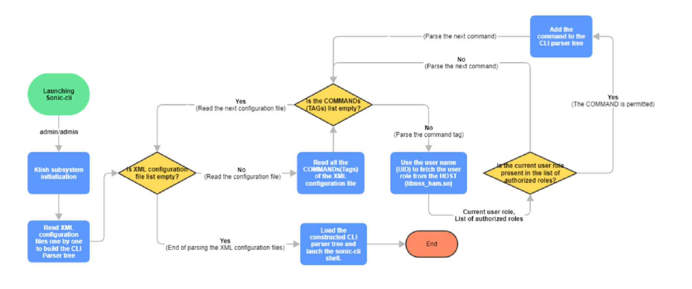

# Feature Name
HAMD and RBAC Enhancements

# High Level Design Document
# Table of Contents

<!-- TOC depthFrom:1 depthTo:6 withLinks:1 updateOnSave:1 orderedList:0 -->

- [Feature Name](#feature-name)
- [High Level Design Document](#high-level-design-document)
- [Table of Contents](#table-of-contents)
- [List of Tables](#list-of-tables)
- [List of Figures](#list-of-figures)
- [Revision](#revision)
- [About this Manual](#about-this-manual)
- [Definition/Abbreviation](#definitionabbreviation)
- [1 Feature Overview](#1-feature-overview)
	- [HAM enhancements overview](#ham-enhancements-overview)
	- [RBAC enhancements overview](#rbac-enhancements-overview)
	- [1.1 Target Deployment Use Cases](#11-target-deployment-use-cases)
	- [1.2 Requirements](#12-requirements)
		- [1.2.1 HAMD Requirements](#121-hamd-requirements)
		- [1.2.2 RBAC Requirements](#122-rbac-requirements)
	- [1.3 Design Overview](#13-design-overview)
		- [1.3.1 Basic Approach](#131-basic-approach)
			- [1.3.1.1 HAM Overview](#1311-ham-overview)
			- [1.3.1.2 RBAC Overview](#1312-rbac-overview)
		- [1.3.2 Container](#132-container)
		- [1.3.3 SAI Overview](#133-sai-overview)
- [2 Functionality](#2-functionality)
	- [2.1 Radius functionality](#21-radius-functionality)
	- [2.2 Tacacs functionality](#22-tacacs-functionality)
- [3 Design](#3-design)
	- [3.1 HAM Design Overview](#31-ham-design-overview)
	- [3.2 RBAC CLI design Overview](#32-rbac-cli-design-overview)
		- [3.2.1 Pruning unauthorized commands](#321-pruning-unauthorized-commands)
	- [3.3 RBAC REST / gNMI design Overview](#33-rbac-restgnmi-design-overview)
		- [3.3.1 RBAC RestAPI/gNMI Datastucture](#331-rbac-restapignmi-datastucture)
		- [3.3.1.1 RBAC REST/GNMI Validation](#3311-rbac-restgnmi-validation)
	- [3.4 Service and Docker Management](#34-service-and-docker-management)
	- [3.5 Packet Handling](#35-packet-handling)
	- [3.6 DB Changes](#36-db-changes)
		- [3.6.1 CONFIG DB](#361-config-db)
		- [3.6.2 APP DB](#362-app-db)
		- [3.6.3 STATE DB](#363-state-db)
		- [3.6.4 ASIC DB](#364-asic-db)
		- [3.6.5 COUNTER DB](#365-counter-db)
		- [3.6.6 ERROR DB](#366-error-db)
		- [3.6.7 USER DB](#367-user-db)
	- [3.7 Switch State Service Design](#37-switch-state-service-design)
		- [3.7.1 Orchestration Agent](#371-orchestration-agent)
		- [3.7.2 Other Processes](#372-other-processes)
	- [3.8 SyncD](#38-syncd)
	- [3.9 SAI](#39-sai)
	- [3.10 User Interface](#310-user-interface)
		- [3.10.1 Data Models](#3101-data-models)
		- [3.10.2 CLI](#3102-cli)
			- [3.10.2.1 Configuration Commands](#31021-configuration-commands)
			- [3.10.2.2 Show Commands](#31022-show-commands)
			- [3.10.2.3 Exec Commands](#31023-exec-commands)
		- [3.10.3 REST API Support](#3103-rest-api-support)
		- [3.10.4 gNMI Support](#3104-gnmi-support)
	- [3.11 Warm Boot Support](#311-warm-boot-support)
	- [3.12 Upgrade and Downgrade Considerations](#312-upgrade-and-downgrade-considerations)
	- [3.13 Resource Needs](#313-resource-needs)
- [4 Flow Diagrams](#4-flow-diagrams)
- [5 Implementation guide lines](#5-implementation-guide-lines)
	- [5.1 CLI New feature Implementation](#51-cli-new-feature-implementation)
	- [5.2 RBAC New feature Implementation](#52-rbac-new-feature-implementation)
- [6 Error Handling](#6-error-handling)
	- [6.1 REST Error Handling](#61-rest-error-handling)
	- [6.2 gNMI Error Handling](#62-gnmi-error-handling)
	- [6.3 CLI Error Handling](#63-cli-error-handling)
- [7 Serviceability and Debug](#7-serviceability-and-debug)
	- [7.1 Execution of unauthorized commands](#71-execution-of-unauthorized-commands)
- [8 Scalability](#8-scalability)
- [9 Platform](#-platform)
- [10 Security and Threat Model](#10-security-and-threat-model)
- [11 Limitations](#11-limitations)
- [12 Unit Test](#12-unit-test)
- [13 Internal Design Information](#13-internal-design-information)
	- [13.1 RBAC Code changes](#131-rbac-code-changes)
		- [13.1.1 Klish code changes](#1311-klish-code-changes)
		- [13.1.2 REST/gNMI code changes](#1312-restgnmi-code-changes)
	- [13.2 HAMD code changes](#132-hamd-code-changes)
	- [13.3 Radius code changes](#133-radius-code-changes)
	- [13.4 Tacacs code changes](#134-tacacs-code-changes)
	- [13.5 IS-CLI Compliance](#135-is-cli-compliance)
	- [13.6 SONiC Packaging](#136-sonic-packaging)
	- [13.7 Broadcom Silicon Considerations](#137-broadcom-silicon-considerations)
	- [13.8 Design Alternatives](#138-design-alternatives)
	- [13.9 Release Matrix](#139-release-matrix)

<!-- /TOC -->

# List of Tables
[Table 1: Abbreviations](#table-1-abbreviations)

[Table 2: RBAC roles and linux groups](#table-2-rbac-roles-and-linux-groups)

[Table 3: CLI commands and their access roles](#table-3-cli-commands-and-their-access-roles)

[Table 4: Upgrade scenario](#table-4-upgrade-scenario)

[Table 5: Downgrade scenario](#table-5-downgrade-scenario)

[Table 6: Sonic-cli launch time optimization](#table-6-sonic-cli-launch-time-optimization)

[Table 7: HAMD Test cases](#table-7-hamd-test-cases)

[Table 8: RBAC CLI Test cases](#table-8-rbac-cli-test-cases)

[Table 9: RBAC REST/GNMI Test cases](#table-9-rbac-restgnmi-test-cases)

# List of Figures
[Figure 1: HAM Design](#figure-1-ham-design)

[Figure 2: RBAC CLI Design](#figure-2-rbac-cli-design)

[Figure 3: RBAC REST/GNMI Design](#figure-3-rbac-restgnmi-design)

[Figure 4: RBAC REST/GNMI Datastructure](#figure-4-rbac-restgnmi-datastructure)

# Revision
| Rev |     Date    |       Author                  | Change Description                |
|-----|-------------|-------------------------------|-----------------------------------|
| 0.1 | 07/13/2022  |  Senthil Nathan               | Initial version                   |
|     |             |  Soundharya Ramanathan        |                                   |
|     |             |  Selvakumar Balu              |                                   |

# About this Manual
This document provides comprehensive functional and design information about the HAMD and RBAC enhancement feature implementation in SONiC.

# Definition/Abbreviation
### Table 1: Abbreviations
| **Term**  | ***Meaning***                                                     |
|-----------|-------------------------------------------------------------------|
| RBAC      | Role-Based Access Control                                         |
| AAA       | Authentication, Authorization, Accounting                         |
| CLI       | Command-Line Interface                                            |
| REST      | REpresentational State Transfer                                   |
| gNMI      | gRPC Network Management Interface                                 |
| NBI       | North-bound Interface (CLI, REST, and gNMI)                       |
| HAM       | Host Account Manager                                              |
| NSS       | Name Service Switch                                               |
| SAC       | System Assigned Credentials (A User ID and a Primary Group ID     |
| RADIUS    | Remote Authentication Dial-in User Service                        |
| TACACS+   | Terminal Access Controller Access-Control System                  |

# 1 Feature Overview
## HAM enhancements overview
The HAM module, which is an integral component of sonic-mgmt-framework repository, provides user account management related services. The services can be used by any other module/application of SONiC. Hence, it will be separated out from the sonic-mgmt-frame repository (src/sonic-mgmt-framework/ham) and moved under the src folder - (../src/sonic-ham).

In addition to that, the following enhancements would be done.
- HAMd must update the user account information in the USER_DB. 
- There must be a provision to associate more than one role to a user.

## RBAC enhancements overview
SONiC supports two default roles, Admin (sysAdmin) and operator (NetOperator). The purpose of roles is to share privilege, security, and access among a group of users.

Two more new roles need to be supported :
- secAdmin (Security Admin)
- netAdmin (Network Admin)

The existing RBAC feature must be enhanced to support the new roles.

## 1.1 Target Deployment Use Cases
- HAMD and RBAC enhancements is done in order to create user accounts and provide them with the desired level of roles/access to the target system.
- For FedGov certification, SecAdmin user role must be supported.
- Peeling out HAM from mgmt-framework repo will result in considerable time reduction when compiling the telemetry repo.
  This is because peeling out HAM results in breaking the dependancy between HAM and mgmt-framework modules, eventually resulting in independant mgmt-framework and telemetry docker compilations.

## 1.2 Requirements
### 1.2.1 HAMD and Remote user Requirements
1.	HAM module must be separated from the sonic-mgmt-framework repository and must be moved to the "src" directory (/dell_sonic_share/sonic-buildimage/src/).
2.	HAMd must subscribe to the user account-related configuration notifications from the CONFIG-DB. 
    The user account information from the CONFIG-DB must be stored in the USER_DB(User Account information table).
    -	RBAC feature uses the User Account information table (USER_DB) to fetch the user account information.
    - HAMd handles only the local user accounts.
3.	TACACS module must store the remote user account information in the USER_DB (User Account information table). 
4.	RADIUS module must store the remote user account information in the USER_DB (User Account information table).
5.	The following new user roles must be supported.
    -	secadmin  
    -	netadmin
6.	TACACS and RADIUS modules must be enhanced to support these new user roles – secadmin and netadmin.
7.	TACACS and RADIUS server’s configuration file must support a new attribute for the defining the remote user's group name as an alternate to the existing privilege-level attribute.
8.  TACACS and RADIUS modules of SONiC must be enhanced to parse the new attribute and take the appropriate action.
9.	“username” command must be enhanced such a way that a user shall be allowed to map with more than one user role.
    -	For example: username < user_name> password < password> role admin, sysadmin
    -	This is applicable only to local users
    -	For remote users (TACACS and RADIUS), this will be supported in the future releases.
10. Software upgrade must work seamlessly.

### 1.2.2 RBAC Requirements

1.	The following new user roles must be supported.
    -	secadmin  
    -	netadmin
2.	RBAC feature must be supported for both local and remote users.
3.	RBAC feature must be supported for all NBIs (North bound interfaces) – CLI, Rest, gNMI and etc.,
4.	Software upgrade must work seamlessly.

Note : Dynamic RBAC and custom user roles are slated for future release.

## 1.3 Design Overview
### 1.3.1 Basic Approach

This is a software implementation of the HAMD and RBAC enhancement. 

#### 1.3.1.1 HAM Overview

HAM module contains the following :
1. HAMd - A daemon process that handles user account management-related configurations to be done in the Linux kernel.
2. hamctl - A Linux kernel application that can be launched from a Linux shell. This can be used to check the functionality of the HAMd process.
3. libnss_ham - A library that enables a container to avail the services offerec by the HAMd process.
4. libnss_sac - A library that assigns a User ID and a Primary Group ID to remote users (RADIUS/TACACS+).
Both the modules (RADIUS and TACACS) use their own mechanism to program the user account information in the Linux kernel.

#### 1.3.1.2 RBAC Overview

The RBAC feature provides a control for access and authorization. Users are granted permission based on defined Roles. SONiC supports two roles, Admin and Operator. Admin users are allowed to access all commands/features in the system whereas operator users can only execute show commands and a limited set of other read-write operations pertaining to the user account scope.

Two new roles, secAdmin and netAdmin,  must be supported. The following table captures the complete set of authorization privileges associated with each role.

### Table 2: RBAC roles and linux groups
| **Roles**  			 | **Operations**                                                     		    | **Linux groups**  	 | **Default shell** | 
|----------------------- |----------------------------------------------------------------------------- |----------------------- |------------------ |
| admin (SysAdmin)	 | Users with admin privileges must be allowed to access all commands - configuration/show/debug/copy and etc. They must be granted read, write and execute permissions to all YANG xPATHs. Admin users must be allowed to access the Linux system shell. | admin, sudo, docker, adm, redis | Linux Bash shell |
| operator (Network Operator) | Users must be allowed to execute only show commands. They must be granted read, write and execute permissions to all YANG xPATHs.Read-only permissions to all YANG xpaths. For certain objects, read-write access would be granted. For example, copying a file from the user home directory to a file server and vice-versa is permitted. Users must not be allowed to login into the Linux system shell. | operator, docker | sonic-cli |
| secAdmin (security admin) | Users with secAdmin privileges must be allowed to access all security-related commands in the system.(configuration/show/debug/copy and etc.,) Read/Write/Execute permissions to the relevant YANG xpaths. For example, a secAdmin user must be allowed to access the commands related to aaa, authentication, radius server, ssh-server, TACACS server, CoPP, username and etc., And also the user must be allowed to access system-level information like login statistics, log information and etc., | secadmin, docker, redis | sonic-cli |
| netAdmin (network admin) | Users with netAdmin privileges must be allowed to access the configuration commands/features that manage traffic flowing through the switch, such as routing protocols, route-map, bfd, qos, PFC, Session monitoring, SFLOW,  SFLOW, ACLs, interfaces, and etc. | netadmin, docker, redis | sonic-cli |

### 1.3.2 Container

 - No new containers are introduced for this feature. 
 - Both sonic-mgmt-framework container (Rest) and sonic-telemetry container (gNMI) use translib library. So the required RBAC functionality would be implemented in the translib module (sonic-mgmt-common).
	- When a REST query is received in mgmt-framework container, the URI is used to fetch the details from the RBAC Trie Tree and proceed further.
	- When a gNMI GET/SET query is received in telemetry container, the URI is used to fetch the details from the RBAC Trie Tree and proceed further.

### 1.3.3 SAI Overview

No new or existing SAI services are required

# 2 Functionality

This feature is applicable to all north-bound interfaces like CLI/gNMI/RestAPI. So the RBAC feature must be implemented by a module that is common to all NBIs. Both sonic-mgmt-framework and telemetry containers use translib for writing/reading the configurations into/from the CONFIG DB. Hence, the RBAC feature would be implemented in the translib module.

Both sonic-mgmt-framework (Rest) and sonic-telemetry(gNMI) use translib library. So the required RBAC functionality would be implemented in the translib module (sonic-mgmt-common).

The following table captures the CLI commands/xPATHS and their access privileges to be granted to various roles.
Note: If a command is applicable to all roles then the tag "access" must not be used.  The absence of the tag "access" means that the command is applicable to all.

### Table 3: CLI commands and their access roles

| **Feature name**  	 | **Filename**     | **View/configuration-mode**  	 | **Command**     | **Role** |
|----------------------- |------------------|------------------------------- |---------------- |--------- |
| Audit-log | audit.xml | enable-view | show audit-log |	admin,  secadmin | 
| | | | clear audit-log | admin,  secadmin |
| Authentication/Authorization/Accounting | Authentication.xml | enable-view | show authentication [ rest / telemetry ] |	admin,  netadmin |
| | | configure-view | authentication rest/telemetry | admin,  netadmin |
| | authmgr.xml | 	enable-view | show authentication clients/interface/authentication-history | admin, netadmin |
| | | 	enable-view | show mab ...	| admin, secadmin, netadmin |
| | | | show dot1x detail ...	| admin, secadmin, netadmin |
| | | | clear authentication ... |	admin, netadmin |
| | | configure-view  |	authentication [monitor /  rest / telemetry]	 | admin, netadmin |
| | | | mab request format ... |	admin, netadmin |
| | | | dot1x system-auth-control |	admin, netadmin |
| | | configure-if-view	 | authentication ... |	admin, netadmin |
| | | | mab auth-type	 | admin, netadmin |
| | | | dot1x pae	| admin, netadmin |
| | aaa.xml	| enable-view |	show aaa	| admin, secadmin, netadmin |
| | | configure-view	| aaa [authentication / authorization / name-service] |	admin, secadmin |
| | radius.xml |	enable-view	| show radius-server |	admin, secadmin, netadmin |
| | | | clear radius-server	| admin, secadmin |
| | | configure-view |	radius-server ...	| admin, secadmin |
| | tacacs.xml	| enable-view | show tacacs-server	| admin, secadmin, netadmin | 
| | | configure-view	| tacacs-server ... |	admin, secadmin | 
| | ldap.xml	| configure-view	| ldap-server ...	| admin, secadmin | 
| | show_ldap.xml	| enable-view	| show ldap-server	| admin, secadmin, netadmin | 
| key	| key.xml	| enable-view |	show config-key | 	admin, secadmin |
| | | configure-view	| key ...	| admin, secadmin |
| Infra CLIs |	infra_cli.xml	| enable-view | reboot/warm-reboot/fast-reboot | admin, secadmin, netadmin |
| | | | logger | admin, secadmin |
| | | | show clock | admin, secadmin, netadmin, operator |
| | | | show uptime | admin, secadmin, netadmin, operator |
| | | | show reboot-cause | admin, secadmin, netadmin |
| | | | show users | admin, secadmin, netadmin, operator |
| | enable_mode.xml |	enable-view	| no	| admin, secadmin, netadmin |
| | | | exit	| admin, secadmin, netadmin, operator |
| | | | configure/configure terminal	| admin, secadmin, netadmin |
| | | | debug/debug shell	| admin |
| | | | show 	| admin, secadmin, netadmin, operator |
| | | | show running-configuration	| admin, secadmin, netadmin |
| | | | clear |	admin, secadmin, netadmin |
| | | | renew dhcp-lease	| admin, secadmin |
| | | | terminal/terminal length |	admin, secadmin, netadmin, operator |
| | debugsh.xml	| debugsh-view | NA	| Changes not required. (admin - debug shell) |
| | platform.xml	| enable-view	| show platform ...	| admin, secadmin, netadmin, operator |
| | logging.xml	| enable-view	| clear logging	| admin, secadmin |
| | | | show logging ...	| admin, secadmin, netadmin |
| | | configure-view	| logging server ...	| admin, secadmin |
| | | | no logging server ... |	admin, secadmin |
| | in_memory_logging.xml	| enable-view	| show in-memory-logging	| admin, secadmin, netadmin |
| system-level commands	| system.xml |	enable-view	| show system ... |	admin, sysadmin, netadmin, operator |
| | | | show users ....	| admin, secadmin, netadmin, operator |
| | | configure-view |	username ...	| admin |
| | hostname.xml	| |  [no] hostname 	| admin, secadmin |
| | show_version.xml |	enable-view	| show version	| admin, secdmin, netadmin, operator |
| swss log	| swsslog.xml	| enable-view	| show swsslog-configuration |	admin |
| | | configure-view	| swsslog loglevel ....	| admin |
| configuration modes	| configure_mode.xml	| configure-view	| mac ..	| admin, netadmin |
| | | | ip ... |	admin, sysadmin, netadmin |
| | | | ipv6	| admin, sysadmin, netadmin |
| Drop counters	| dropcounters.xml	| enable-view | show dropcounters [ options ] | admin, secadmin, netadmin, operator |
| | | | show running-configuration dropcounters | admin, secadmin, netadmin |
| | | configure-view |  [ no ] dropcounters [ options] and all its subcommand | admin, netadmin |
| qos | qos_scheduler.xml |	configure-view	| [no] qos scheduler-policy | admin, netadmin |
| | | enable-view	| show qos scheduler-policy | admin, netadmin, secadmin, operator |
| | qos_interface.xml	| configure-if-view | queue < id> wred-policy ...	| admin, netadmin |
| | | | scheduler-policy ...	| admin, netadmin |
| | | | qos-map ...	| admin, netadmin |
| | | | priority-flow-control ... |	admin, netadmin |
| | | enable-view	| show qos interface | admin, netadmin, secadmin, operator |
| | qos_buffer.xml	| enable-view	| show [buffer / buffer-pool] / show buffer profile / show buffer interface	| admin, netadmin, secadmin, operator |
| | | configure-view |	buffer .... |	admin, netadmin |
| | | configure-if-view | buffer ...	| admin, netadmin |
| | wred.xml	| enable-view |	show qos wred-policy	| admin, netadmin, secadmin, operator |
| | | configure-view	| qos wred-policy	| admin, netadmin |
| | | configure-wred-view	| show configuration	| admin, netadmin |
| | | | all commands : green/red , ecn	| admin, netadmin |
| | qos_pfc.xml	| enable-view	| show priority-flow-control ...	| admin, netadmin, secadmin, operator |
| | | configure-view	| priority-flow-control ...	| admin, netadmin |
| | qos_counter.xml	| enable-view	| show queue ...	| admin, netadmin, secadmin, operator |
| | | | show priority-group ... | admin, netadmin, secadmin, operator |
| | qos_clear_counter.xml |	enable-view	| clear queue ... |	admin, netadmin |
| | copp.xml	| enable-view |	show copp ...	| admin, netadmin, secadmin, operator |
| | | configure-view	| copp-action ...	| admin, netadmin |
| | | copp-action-view	| all commands	| admin, netadmin |
| flow based services |	flow_based_services.xml |	enable-view	| show policy-map ...	| admin, netadmin, operator |
| | | | show class-map ...	| admin, netadmin, operator |
| | | | show service-policy ...	| admin, netadmin, operator |
| | | | show running-configuration class-map	| admin, netadmin |
| | | | show running-configuration policy-map	| admin, netadmin |
| | | | clear counters service-policy ...	| admin, netadmin |
| | | | show pbf ...	| admin, netadmin |
| | | configure-view |	policy-map ... 	| admin, netadmin |
| | | | class-map ...	| admin, netadmin |
| | | | pbf ...	| admin, netadmin |
| | | configure-policy-view/configure-acl-classifier-view/configure-fields-classifier-view/configure-copp-classifier-view/configure-qos-flow-view/configure-monitoring-flow-view/configure-forwarding-flow-view/configure-copp-flow-view/configure-acl-copp-flow-view | 	all commands	| admin, netadmin |
| | | configure-pbf-ip-nh-grp-view/configure-pbf-ipv6-nh-grp-view/configure-pbf-ip-repl-grp-view/configure-pbf-ipv6-repl-grp-view	 | all commands	| admin, netadmin |
| | flow_based_services_macro.xml	| configure-if-view/configure-subif-view/configure-lag-view/configure-vlan-view/configure-vty-view/configure-subif-view/configu-if-CPU-view	| service-policy ...	| admin, netadmin |
| fnetwork policy |	network_policy.xml	| configure-view |	network-policy .... |	admin, netadmin |
| | | configure-network-policy-view	| all commands	| admin, netadmin |
| | watermark.xml	| enable-view	| show watermark ... | admin, netadmin, secadmin, operator |
| | | configure-view	| watermark ... | admin, netadmin |
| Image related commands/tpcm | image.xml	| enable-view	| image install/remove/set-default |	admin |
| | | | show image ...	| admin, netadmin, secadmin, operator |
| | tpcm.xml	| enable-view	| show tpcm	| admin |
| | | | tpcm install |	admin |
| Route-map |	route_map.xml	| enable-view	| show route-map	| admin, netadmin |
| | | enable-view |	show running-configuration route-map	| admin, netadmin |
| | | configure-view	| route-map ...	| admin, netadmin |
| | route_match.xml |	configure-route-map-view	| route-map ...	| NOT REQUIRED: Restriction would be applied at the parent node level. |
| ip prefix	| ip_prefix.xml	| enable-view	| show ip prefix-list	| admin, netadmin, operator |
| | | | show ipv6 prefix-list	| admin, netadmin, operator |
| | | | show running-configuration ip prefix-list	| admin, netadmin |
| | | | show running-configuration ipv6 prefix-list	 | admin, netadmin |
| | | configure-view	| ip prefix-list 	| admin, netadmin |
| | | | ipv6 prefix-list	| admin, netadmin |
| DHCP	| dhcp_snooping.xml	| enable-view	| show ip/ipv6 dhcp snooping	| admin, netadmin, secadmin, operator |
| | | | clear ip/ipv6 dhcp snooping	| admin, netadmin |
| | | configure-view	| ip/ipv6 dhcp snooping	| admin, netadmin |
| | | | ip/ipv6 source ...	| admin, netadmin |
| | | configure-if-view	| ip/ipv6 dhcp snooping	| admin, netadmin |
| | ipv6.xml	| show ipv6 dhcp-relay	| admin, netadmin, secadmin, operator |
| | | |  clear ipv6 dhcp-relay	| admin, netadmin |
| | ipv4.xml	| show ip dhcp-relay	| admin, netadmin, secadmin, operator |
| | | | clear ip dhcp-relay	| admin, netadmin |
| | dhcp_relay_macro.xml |	configure-if-view	| ip/ipv6 dhcp-relay	| admin, netadmin |
| | mgmt_dhcp.xml	| enable-view |	renew dhcp-lease | interface Management ...	| admin, netadmin |
| dns |	dns.xml	| enable-view	| show hosts	| admin, netadmin, secadmin, operator |
| | | configure-view | 	ip name-server ...	| admin, netadmin |
| bgp	| bgp.xml | enable view	| show running-configuration bgp	| admin, netadmin |
| | | | show bgp ipv4/ipv6 ...	| admin, netadmin, operator |
| | | | clear bgp ...	| admin, netadmin |
| | | configure-view	| router bgp ... |	admin, netadmin |
| | | configure-router-bgp-view/configure-router-bgp-nbr-view/configure-router-bgp-template-view 	| all commands	| admin, netadmin |
| | bgp_af_ipv4.xml	| configure-router-bgp-ipv4-view/configure-router-bgp-nbr-ipv4-view/configure-router-bgp-template-ipv4-view	 | all commands	| admin, netadmin |
| | bgp_af_ipv6.xml	| configure-router-bgp-ipv6-view/configure-router-bgp-nbr-ipv6-view/configure-router-bgp-template-ipv6-view	 | all commands	| admin, netadmin |
| | bgp_af_l2vpn.xml	 | configure-router-bgp-l2vpn-view/configure-router-bgp-nbr-l2vpn-view/configure-router-bgp-template-l2vpn-view	| all commands	 | admin, netadmin |
| | | enable-view	| show bgp l2vpn	| admin, netadmin, operator |
| | | | clear bgp l2vpn	| admin, netadmin | 
| | bgp_af_l2vpn_vni.xml | 	configure-router-bgp-l2vpn-vni-view	| all commands | 	admin, netadmin |
| | | enable-view	| show bgp l2vpn vni | 	admin, netadmin, operator |
| | ipv6.xml	| enable-view	| show ipv6 route bgp	 | admin, netadmin, operator |
| | ipv4.xml	| enable-view	| show ip route bgp	| admin, netadmin, operator |
| | ospf.xml	| configure-router-ospf-view	| redistribute bgp ...	| admin, netadmin |
| | bgp_extcommunity_sets.xml	| configure-view | 	bgp ext-community-list	| admin, netadmin |
| | | enable-view	| show bgp ext-community-list	| admin, netadmin,  operator |
| | bgp_community_sets.xml	| configure-view	| bgp [as-path / community ]	| admin, netadmin |
| | | enable-view	| show bgp [community-list / as-path]	| admin, netadmin, operator |
| | | | show running-configuration bpg [as-path / community / ext-community list]	| admin, netadmin, secadmin |
| | bgp_extcommunity_sets.xml	| configure-view | 	bgp [as-path / community / ext-community list] | 	admin, netadmin |
| | | | router bgp ...|	admin, netadmin |
| | warm_restart.xml |	configure-view	| warm-restart bgp ...	| admin, netadmin |
| OSPF	| ospf.xml	| enable-view	| clear ip ospf	admin, netadmin |
| | | | show ip ospf ...	| admin, netadmin,  operator |
| | | | show running-configuration ospf  ...	| admin, netadmin, secadmin |
| | | configure-view	| router ospf | admin, netadmin |
| | | configure-router-ospf-view	| all ospf commands	| admin, netadmin |
| | | configure-if-view/configure-lag-view/configure-vlan-view/configure-lo-view/configure-subif-view | all ospf commands |  admin, netadmin |
| | ospf_macro.xml	| ip ospf ...	| admin, netadmin |
| ECMP	| loadshare.xml	| enable-view	| show ip load-share	| admin, netadmin,  operator |
| | | configure-view	| ip load-share	| admin, netadmin |
| Anycast gateway	| sag.xml	| enable-view	| show ip static-anycast-gateway	| admin, netadmin,  operator |
| | | | show ipv6 static-anycast-gateway	| admin, netadmin,  operator |
| | | configure-vlan-view/configure-subif-view |	ip anycast-address < address>	| admin, netadmin |
| | | | ipv6 anycast-address < address>	| admin, netadmin |
| | | configure-view	| ip anycast-mac-address < mac-address>	| admin, netadmin |
| | | | ip anycast-address enable	| admin, netadmin |
| | | | ipv6 anycast-address enable	| admin, netadmin |
| ptp	| ptp.xml	| enable-view	| show ptp ...	| admin, netadmin |
| | | configure-view	| ptp ...	| admin, netadmin |
| ntp	| ntp.xml	| enable-view	| show ntp ...	| admin, netadmin |
| | | configure-view	| ntp ...	| admin, netadmin |
| snmp	| snmp.xml	| enable-view | 	clear snmp counters	| admin, secadmin |
| | | | show snmp	| admin, secadmin |
| | | | show snmp-server ...	| admin, secadmin |
| | | configure-view	| snmp-server ...	| admin, secadmin |
| telemetry and monitoring	| telemetry.xml	| enable-view	| show tam ...	| admin, netadmin |
| | | | clear counters tam |	admin, netadmin |
| | | | show running-configuration tam	| admin, netadmin |
| | | configure-view/configure-tam-view/configure-tam-ifa-view |	all commands |	admin, netadmin |
| | | configure-if-view	| flow-group ...	| admin, netadmin |
| counters	| counters.xml	| configure-view	| counters rif	| admin, netadmin |
| traceroute |	traceroute.xml |	enable-view	| traceroute ...	| admin, secadmin, netadmin, operator |
| | | | traceroute6 ... |	admin, secadmin, netadmin, operator |
| ping	| ping.xml |	enable-view	| ping ...	| admin, secadmin, netadmin, operator |
| | | enable-view	| ping6	| admin, secadmin, netadmin, operator |
| mclag	| mclag.xml	| configure-view	| mclag domain ...	| admin, netadmin |
| | | | mclag gateway-mac	| admin, netadmin |
| | | configure-mclag-view | 	all commands	| admin, netadmin |
| | | enable-view	| show mclag ...	| admin, netadmin, operator |
| | | | show running-configuration mc-lag	| admin, netadmin |
| Unidirectional link failure and detection	| udld.xml	| enable-view	| show udld ...	| admin, netadmin |
| | | configure-view |	udld  ...	| admin, netadmin |
| | | configure-if-view	| udld ...	| admin, netadmin |
| igmp	| igmp.xml	| enable-view |	show ip igmp ... |	admin, netadmin, secadmin, operator |
| | | | clear ip igmp ... |	admin, netadmin |
| | igmp_snooping.xml	| enable-view	| show ip igmp snooping .... |	admin, netadmin, secadmin, operator |
| | | configure-vlan-view	| ip igmp snooping ....	| admin, netamin |
| pim	| pim.xml	| enable-view	| show ip pim .... |	admin, netadmin, secadmin, operator |
| | | | clear ip pim 	| admin, netadmin |
| | | configure-view	| ip pim ....	| admin, netadmin |
| | pim_macro.xml	| configure-if-view/configure-subif-view/configure-lag-view/configure-vlan-view	| ip pim ...	| admin, netadmin |
| Multicast routing	| mroute.xml	| | show ip mroute ..	| admin, netadmin, operator | 
| | | | clear ip mroute..	| admin, netadmin |
| lldp |	lldp.xml |	enable-view	| show lldp ...	| admin, netadmin, operator |
| | | configure-view	| lldp ...	| admin, netadmin |
| | | configure-if-view	| lldp ...	| admin, netadmin |
| | | | network-policy ...	| admin, netadmin |
| stp	| stp.xml	| enable-view	| show spanning-tree  ...	| admin, netadmin, operator |
| | | | clear spanning-tree |	admin, netadmin |
| | | | show running-configuration spanning-tree	| admin, netadmin |
| | | configure-view |	spanning-tree ...	| admin, netadmin |
| | | configure-if-view/configure-if-lag-view	| spanning-tree	| admin, netadmin |
| | | configure-mst-view	| all configurations |	admin, netadmin |
| | stp_macro.xml |	| spanning-tree	| admin, netadmin |
| vrrp |	vrrp.xml	| enable-view	| show vrrp ...	| admin, netadmin, operator|
| | | | show vrrp6 ...	| admin, netadmin, operator |
| | | configure-if-view/configure-lag-view/configure-vlan-view/configure-subif-view |	vrrp ...	| admin, netadmin |
| | | configure-vrrp-ipv4-view/configure-vrrp-ipv6-view	| all commands	| admin, netadmin |
| storm-control	| storm-control.xml	| enable-view |	show storm-control ... |	admin, netadmin, operator |
| | | configure-if-view	| storm-control ... |	admin, netadmin |
| | | configure-if-range-view	| storm-control ...	| admin, netadmin |
| port-security	| pms.xml	| enable-view	| show port-security ...	| admin, netadmin |
| | pms_macro.xml	| configure-if-view/configure-lag-view	| port-security ... 	| admin, netadmin |
| VxLAN	| vxlan.xml	| enable-view	| show vxlan ... |	admin, netadmin |
| | | | show running-configuration interface vxlan	| admin, netadmin |
| | | | clear counters vxlan	| admin, netadmin |
| | | configure-view |	interface vxlan	| admin, netadmin |
| | | configure-vxlan-view	| all commands	| admin, netadmin |
| evpn	| show_evpn.xml |	enable-view	| show evpn ... |	admin, netadmin |
| IPv4 address and neighbor (ARP) |	ipv4-neighbors.xml	| enable-view	| show IP arp ...	| admin, secadmin, netadmin, operator|
| | | | clear IP arp	| admin, netadmin |
| | | configure-view	| IP arp timeout	| admin, netadmin |
| | ipv4.xml	| enable-view	| show ip interface	| admin, netadmin, operator |
| | | | show ip route	| admin, netadmin, operator |
| | | | show ip dhcp-relay	| admin, secadmin, netadmin, operator |
| | | | clear ip dhcp-relay	| admin, netadmin |
| | | configure-view	| ip nht	| admin, netadmin |
| | | configure-if-view/configure-vlan-view/configure-lag-view/configure-subif-view	| ip address ...	| admin, netadmin |
| | | | ip arp	| admin, netadmin |
| | | | ip igmp ....	| admin, netadmin |
| | | configure-if-mgmt-view	| ip address ... |	admin, netadmin |
| | | configure-lo-view	| ip address	| admin, netadmin |
| | | configure-if-range-view/configure-po-range-view |	no ip ... |	admin, netadmin |
| IPv6 address/Neighbors	| ipv6-neighbors.xml | enable-view	| show ipv6 neighbors	| admin, secadmin, netadmin, operator |
| | | | clear ipv6 neighbors	| admin, netadmin |
| | | configure-view |	ipv6 nd	| admin, netadmin |
| | ipv6.xml |	enable-view	| show ipv6 interface	| admin, netadmin, operator |
| | | | show ipv6 route	| admin, netadmin, operator |
| | | configure-view	| ipv6 nht	| admin, netadmin |
| | | configure-if-view	| ipv6 address .. |	admin, netadmin |
| | | configure-if-mgmt-view/configure-lag-view/configure-vlan-view/configure-lo-view	| ipv6 address ... | admin, netadmin |
| | | configure-if-range-view/configure-vlan-range-view/configure-po-range-view/configure-subif-view | no ipv6 .. | admin, netadmin |
| ip unnumbered	| ip_unnumbered_macro.xml |	configure-view	| ip unnumbered ...	| admin, netadmin |
| ip helper |	ip-helper.xml	| enable-view	| show ip forward-protocol |	admin, secadmin, netadmin, operator |
| | | | show ip helper-address ...	| admin, secadmin, netadmin, operator |
| | | | clear ip helper-address ...	| admin, netadmin |
| | | configure-view	| ip forward-protocol ...	| admin, netadmin |
| | ip_helper_macro.xml |	configure-if-view	| ip helper-address ...	| admin, netadmin |
| static route	| route_static.xml	| configure-view	| ip route ...	| admin, netadmin |
| | | | ipv6 route ... |	admin, netadmin |
| ip sla	| ipsla.xml	| configure-view	| ip sla .. |	admin, netadmin |
| | | enable-view	| show ip sla	| admin, netadmin |
| | | | clear ip sla ...	| admin, netadmin |
| vrf |	vrf.xml	| enable-view	| show ip vrf ...	| admin, netadmin, operator |
| | | | show running-configuration vrf	| admin, secadmin, netadmin |
| | | configure-view	| ip vrf mgmt	| admin, netadmin |
| | | | ip vrf vrf_name ...	| admin, netadmin |
| | | | ipv6 vrf vrf_name ...	| admin, netadmin |
| | vrf_macro.xml	| configure-if-view/configure-subif-view/configure-if-range-view/configure-lag-view/configure-po-range-view/configure-vlan-view/configure-vlan-range-view/configure-lo-view	| Ip vrf forwarding... |	admin, netadmin |
| | ssh_vrf.xml	| enable-view	| show ssh-server vrf all	| admin, secadmin, netadmin, operator |
| | | configure-view	| ssh-server vrf ...	| admin, secadmin |
| nat	| nat.xml |	enable-view	| clear nat ...	| admin, netadmin |
| | | | show running-configuration nat	| admin, netadmin |
| | | configure-view |	nat ...	| admin, netadmin |
| | | configure-nat-view |	all commands	| admin, netadmin |
| | nat_zone.xml	| configure-if-view/configure-lo-view/configure-vlan-view/configure-lag-view	| nat-zone ....	| admin, netadmin |
| sflow	| sflow.xml	| enable-view	| show sflow ...	| admin, secadmin, netadmin, operator |
| | | configure-view	| sflow ... |	admin, netadmin |
| | interface.xml	| configure-if-view	| sflow ... |	admin, netadmin |
| mirroring	| mirror.xml	| enable-view	| show mirror-session	| admin, secadmin, netadmin, operator |
| | | | show running-configuration mirror-session |	admin, netadmin |
| | | configure-view	| mirror-session ...	| admin, netadmin |
| | | configure-mirror-view	| all commands	| admin, netadmin |
| MAC management |	mac.xml	| enable-view	| show mac .. |	admin, netadmin, operator |
| | | | clear mac ...	| admin, netadmin |
| | | configure-view	| mac address-table ...	| admin, netadmin |
| ACL	| acl.xml	| enable-view	| show access-group	| admin, netadmin, operator |
| | | | show mac access-group	| admin, netadmin, operator |
| | | | show ip access-group	| admin, netadmin, operator |
| | | | show ipv6 access-group	| admin, netadmin, operator | 
| | | | show mac access-lists	| admin, netadmin, operator |
| | | | show ip access-lists	| admin, netadmin, operator |
| | | | show ipv6 access-lists	| admin, netadmin, operator |
| | | | show object-groups	| admin, netadmin, operator |
| | | | clear mac access-list	| admin, netadmin |
| | | | clear ip access-list	| admin, netadmin |
| | | | clear ipv6 access-list	| admin, netadmin |
| | | | show running-configuration mac access-list	| admin, netadmin |
| | | | show running-configuration ip access-list	| admin, netadmin |
| | | | show running-configuration ipv6 access-list	| admin, netadmin |
| | | configure-view	| mac access-list	| admin, netadmin |
| | | | ip access-list	| admin, netadmin |
| | | | ipv6 access-list |	admin, netadmin |
| | | | mac access-group ... 	| admin, netadmin |
| | | | ip access-group ...	| admin, netadmin |
| | | | ipv6 access-group ...	| admin, netadmin |
| | | configure-mac-acl-view/configure-ip-acl-view/configure-ipv6-acl-view	| all commands	| admin, netadmin |
| | acl_binding.xml	| configure-if-view/configure-subif-view/configure-lag-view/configure-vlan-view	| all commands	| admin, netadmin |
| | acl_macro.xml |	NA	| NA	| change are not required |
| interface-specific |	interface.xml	| enable-view	| show running-configuration interface	| admin, netadmin |
| | | | show running-configuration vlan	| admin, netadmin |
| | | | show interface	| admin, netadmin, operator |
| | | | show interface drop-counters	| admin, netadmin, operator |
| | | | show interface transceiver	| admin, netadmin, operator |
| | | | show vlan |	admin, netadmin, operator |
| | | | show neighbor-suppress-status	| admin, netadmin, operator |
| | | | show PortChannel	| admin, netadmin, operator |
| | | configure-view	| interface ....	| admin, netadmin |
| | | configure-if-view/configure-lo-view/configure-vlan-view/configure-lag-view	| all commands	| admin, netadmin |
| | interface_macro.xml	| | all commands ..	| admin, netadmin |
| subinterface	| subinterface.xml	| enable-view |	show subinterfaces / show subinterfaces status / show running-configuration subinterface	| admin, netadmin, secadmin |
| | | configure-subif-view	| encapsulation .. / all commands ..	| admin, netadmin |
| Interface breakout	| dynamic_port_breakout.xml	| enable-view |	show interface breakout	| admin, netadmin |
| | | configure-view	| interface breakout ....	| admin, netadmin |
| counters	| clear_counters.xml	| enable-view	| clear counters ....	| admin, netadmin |
| portchannel |	portchannel.xml	| enable-view	| portchannel graceful-shutdown	| admin, netadmin |
| vlan	| vlan.xml	| enable-view	| show system vlan	| admin, netadmin, operator |
| | | configure-view	| system vlan |	admin, netadmin |
| events	| event.xml	| enable-view	| show events ..	| admin, netadmin, operator |
| | | | show alarm ...	| admin, netadmin, operator |
| | | | alarm acknowledge	| admin, netadmin |
| event profile |	evprofile.xml	| enable-view |	show event profile	| admin, netadmin, operator |
| | | | event profile ... |	admin, netadmin |
| hardware	| hardware.xml	| configure-view	| hardware ...	| admin, netadmin |
| | | enable-view	| show running-configuration hardware ...	| admin, netadmin |
| | | | hardware tcam enforce ...	| admin, netadmin |
| | | | show hardware tcam ... |	admin, netadmin |
| line_vty	| line_vty.xml	| configure-view	| line vty 	| admin, netadmin |
| | | enable-view	| show running-configuration line |	admin, netadmin, secadmin |
| poe |	poe.xml	| configure-view	| poe ...	|admin, netadmin |
| | | enable-view	| show poe ...	| admin, netadmin |
| | | | poe reset	| admin, netadmin |
| | | | clear poe	| admin, netadmin |
| | | configure-if-view	| poe ...	| admin, netadmin |
| | | configure-if-range-view	| poe ...	| admin, netadmin |
| default_port	| default_port.xml | configure-view	| default interface ....	| admin, netadmin |
| Switch profiles	| config_profiles.xml	| enable-view	| show switch-profiles	| admin, netadmin, operator |
| | | configure-view	| factory default profile ...	| admin, netadmin | 
| switch resource	| switch_resource.xml	| enable-view	| show switch-resource ...	| admin, netadmin, operator |
| | | configure-view	| switch-resource	| admin, netadmin |
| | | configure-switch-resource-view	| all commands	| admin, netadmin |
| Switch resource threshold violations	| threshold.xml	| enable-view	| show threshold ..	| admin, netadmin, operator |
| | | | show buffer_pool |	admin, netadmin, operator |
| | | | show device  ... |	admin, netadmin, operator |
| | | | clear threshold	| admin, netadmin |
| | | | clear buffer_pool |	admin, netadmin |
| | | configure-view	| threshold buffer-pool	 | admin, netadmin |
| | | | threshold device ...	| admin, netadmin |
| | | configure-if-view	| threshold ...	| admin, netadmin |
| | | configure-if-CPU-view |	threshold queue ...	| admin, netadmin |
| switch configuration management |	config_mgmt.xml	| enable-view |	write memory	| admin, netadmin, secadmin |
| | | | write erase ...	| admin, netadmin, secadmin |
| clock	| clock.xml |	configure-view	| clock timezone ...	| admin, netadmin, secadmin |
| | | | show clock	| admin, netadmin, secadmin, operator |
|file management  (The required logic is implemented by the backend)	| file_mgmt.xml	| enable-view |	dir	| admin, netadmin, secadmin, operator |
| | | | ls	| admin, netadmin, secadmin, operator |
| | | | copy ...	| admin, netadmin, secadmin, operator |
| | | | delete	| admin, netadmin, secadmin, operator |
| error disable	| errdisable.xml	| enable-view	| show errdisable ...	| admin, netadmin, secadmin, operator |
| | | configure-view |	errdisable recovery ...	| admin, netadmin, secadmin |
| kernel core files	| kdump.xml	| configure-view	| kdump ...	| admin |
| | | enable-view |	show kdump ...	| admin, netadmin, secadmin, operator |
| core dump	| coredump.xml	| enable-view	| show core ...	| admin, netadmin, secadmin, operator |
| | | configure-view |	core enable	| admin |
| tech support	| techsupport_export.xml	| enable-view	| show techsupport-export |	admin, netadmin, secadmin, operator |
| | | configure-view |	techsupport-export  .... |	admin |
| led	| locator_led.xml	| enable-view |	show locator-led |	admin, netadmin, operator |
| | | | locator-led chassis ...	| admin |
| port locator	| port_locator.xml	| enable-view	| interface port-locator ... |	admin |
| | | | show interface port-locator	| admin, netadmin, operator |
| Port Media FEC	| port_media_fec.xml	| configure-view	| interface media-fec ... |	admin |
| port groups	| port_group.xml |	enable-view	| show port-group	| admin, netadmin, secadmin, operator |
| | | configure-view |	port-group .... |	admin, netadmin |
| cable diagnostics |	test.xml	| enable-view |	show cable-diagnostics	| admin, netadmin, secadmin, operator |
| | | | test cable-diagnostics	| admin, netadmin |
| transceiver diags	| transceiver-diag.xml	| config-view	| interface transceiver ...	| admin, netadmin |
| warm restart |	warm_restart.xml |	enable-view	| show warm-restart ...	| admin, netadmin, secadmin, operator |
| | | configure-view	| warm-restart ...	| admin, netadmin |
| alias |	alias.xml	| enable-view	| show interface-naming	| admin, netadmin, secadmin, operator |
| | | configure-view	| interface-naming standard 	| admin, netadmin |
| link state tracking	| link_track.xml	| enable-view |	showlink state track ...	| admin, netadmin, secadmin, operator |
| | | | show running-configuration link state tracking |	admin, netadmin, secadmin |
| | | configure-view |	link state track ... |	admin, netadmin |
| | | configure-link-state-track-view	| all commands	| admin, netadmin |
| | link_tracking_macro.xml	| configure-if-view/configure-lag-view/configure-vlan-view/configure-subif-view | 	link state track ...	| admin, netadmin |
| Consistency check	| consistency_check.xml |	enable-view	| show consistency-check ...	| admin, netadmin, secadmin, operator |
| | | | consistency-check ...	| admin, netadmin |
| histogram	| histogram.xml	| enable-view	| show histogram ...	| admin, netadmin, secadmin, operator |
| ZTP	| ztp.xml	| enable-view	| show ztp-status |	admin, netadmin, secadmin, operator |
| | | configure-view	| ztp enable	| admin, netadmin |
| database 	| databse.xml	| enable-view	| show database map	| admin, netadmin, secadmin, operator |
| System CRM	| system-crm.xml	| enable-view	| show crm 	| admin, netadmin, secadmin, operator |
| | | configure-view |	crm ...	| admin, netadmin |

## 2.1 Radius functionality
Radius supports the attribute: 'Management-Privilege-Level'.
It carries a integer value (1 to 15) which defines the privilege level that is remote user is authorized.
Management-Privilege-Level has been enhanced to support the two new roles : secadmin and netadmin.

The Management-Privilege-Level VSA (PW_MANAGEMENT_PRIVILEGE_LEVEL) has been added as a part of the recent RFC-5607.
It has been already implemented in SONiC. 

< user name>    Cleartext-Password := "force10"

Management-Privilege-Level = [1 to 15]

- Management-Privilege-Level = 15 => admin
	- Supplementary groups : "admin,adm,redis,sudo,docker"

- Management-Privilege-Level = 1 => operator
	- Supplementary groups : "operator,docker"

- Management-Privilege-Level = 14 => netadmin
	- Supplementary groups : "netadmin,redis,docker"

- Management-Privilege-Level = 13 => secadmin
	- Supplementary groups : "secadmin,redis,docker"

1 <= MPL <= 12 has been assigned with operator role by default.

## 2.2 Tacacs functionality

Tacacs+ supports the attribute: 'priv-level', which defines the privilege level that is remote user is authorized.
Users with priv-lvl attribute can be created as follows :

user = < username> {

	default service = permit
	pap = cleartext dellforce10
	service = exec {
		priv-lvl = [1 to 15]
	}
}

- User priv-lvl = 15 => admin
	- Supplementary groups : "admin,adm,redis,sudo,docker"

- User priv-lvl = 1 => operator
	- Supplementary groups : "operator,docker"

- User priv-lvl = 14 => netadmin
	- Supplementary groups : "netadmin,redis,docker"

- User priv-lvl = 13 => secadmin
	- Supplementary groups : "secadmin,redis,docker"

1 <= priv-lvl<= 12 has been assigned with operator role by default.

# 3 Design
## 3.1 HAM Design Overview

The following diagram captures the current implementation of the command "username < username> password < password> role < role>". There will not be any changes in the following design.

### Figure 1: HAM Design

   

  __HAM Design__

## 3.2 RBAC CLI design Overview

- When the sonic-cli shell is launched, the user's role would be used to prune the unauthorized commands from the CLI parser tree.
- Klish uses the XML configuration files to get the required information for each command.
	1. List of authorized roles
	2. operation type
- The following diagram explains how a CLI parser tree is constructed for a user based on his role.

### Figure 2: RBAC CLI Design

   

  __RBAC CLI Design__

### 3.2.1 Pruning unauthorized commands

- The COMMAND tag of KLISH supports a field called "access". This field would contain a list of Linux groups to grant access to.  Instead of Linux groups, the field would contain a list of "Roles (admin/operator/sysAdmin/netAdmin)" to grant access to.

       <COMMAND name="configure" access="admin:sysadmin" help="Enter configuration mode" />     
  
- Though the "access" field of the COMMAND tag is used to define the list of roles, the real function(call_back_function) that controls permissions would be set by the HOOK tag.

			<HOOK name="access" builtin="call_back_function"></HOOK> 

- While parsing each command, the call_back_function takes the following arguments : 
	1. A handle to the sonic-cli shell - This is used to identify the user (User ID) that launched the sonic-cli.
		-The call_back_function uses the User ID to fetch the user's role from the host using libnss_ham lib.
	2. The list of roles having access permission to the command.
		- If the user's role is present in the list then the user would be allowed to access the command. 
		- If the user's role is not present then the command would be pruned from the CLI parser tree.

## 3.3 RBAC REST / gNMI design Overview

Both sonic-mgmt-framework (Rest) and sonic-telemetry(gNMI) use translib library. So the required RBAC functionality would be implemented in the translib module (sonic-mgmt-common).

The whole design is captured in the following diagram,

### Figure 3: RBAC REST/GNMI Design
   
   

  __RBAC REST/GNMI Design__

- Since CLI uses RestAPI, the RBAC logic depicted in the above diagram would be applicable to CLI as well.
- REST/gNMI requests would carry the following info,
	1. Username/User ID
	2. XPATH,
	3. Operation type (Read/write/delete)

- Translib maintains a data structure that contains the following information,
	1. key: XPATH
	2. value:
		- List of tuples.
			- Each tuple is represented by : {Role, list of permitted operations}.

- For authorized commands, translib would continue updating the CONFIG DB.
- For unauthorized commands, an appropriate error message would be returned.
- The rules to validate the REST/gNMI query is stored in a Trie datastructure in cache. 
- The trie datastructure is created with the content from sonic-extension:user-role-priv in annotation yang files.

### 3.3.1 RBAC RestAPI/gNMI Datastucture

### Figure 4: RBAC REST/GNMI Datastructure
   

  __RBAC REST/GNMI Datastructure__

- Trie Data structure is used in RBAC. 
- A X-path is split into xpathTokens and stored in seperate nodes along with the role,oper and access details. 
- For example: Xpath is "/open-config/bgp/neighbor".
  Then the "/open-config" is stored in the first node, "/bgp" is stored in the second node and then "/neighbor" is stored the third node along with the Role, operation and access information. Please Refer TrieNode table in the above diagram.
- The TrieValue table from the above diagram has the Role, Operator and access information.
	- Roles supported : admin, operator, secadmin and netadmin.
	- Operations supported : Read, Write and RPC.
	- Access types supported : Permit, Deny, PermitAll and Denyall.

#### 3.3.1.1 RBAC REST/GNMI Validation

- When a REST/GNMI query is executed, the rest query will be received in the REST/GNMI server.
- Once the query is received, the credentials are validated. 
- After validating the credentials, the roles for the username is fetched from the USER_TABLE in Redis USER_DB. 
- Then the Userole, OperationType and REST/GNMI query XPATH is given to the Validation function to do a trie search. 
- Using the Trie search with the xpath as input, the exact trieNode is found. 
- Then the userrole and operation is searched in the trieNode to get the access type.
  Example: Admin role and write operation are searched in the node. If the values are present in the node, then the access type is returned (Permit or Deny).
  - If the access type is permit, then the REST query is permitted further. 
  - Otherwise, the Query is failed and returned as "User is not authorized" error message.

### 3.4 Service and Docker Management

The existing HAM (User Account management service) is enhanced to support two more additional roles.
Functionality wise, no other service/containers will be impacted.

### 3.5 Packet Handling
NA

## 3.6 DB Changes

### 3.6.1 CONFIG DB
NA

### 3.6.2 APP DB
NA

### 3.6.3 STATE DB
NA

### 3.6.4 ASIC DB
NA

### 3.6.5 COUNTER DB
NA

### 3.6.6 ERROR DB
NA

### 3.6.7 USER DB
- A new USER DB is defined in SONiC in order to store user information in the Redis database.
- A new table would be added in the USER DB to store the user account information : USER_TABLE

user (key) : Username is a string.

tenant (key) : The tenancy to which the user belongs to. It is a string.

usertype: This is a enumeration of 'local' and 'remote' corresponding to the type of the user.

role: The role of the user. This is a comma-separated list of strings. 

## 3.7 Switch State Service Design
### 3.7.1 Orchestration Agent
N/A

### 3.7.2 Other Processes
N/A

## 3.8 SyncD
N/A

## 3.9 SAI
N/A

## 3.10 User Interface

1.	All XML files under src/sonic-mgmt-framework/CLI/clitree/cli-xml must be updated with the "access" attribute which needs to be added in the command tag .
2. 	For each xpath that corresponds to a CLI, an annotation yang must be created or updated with the sonic-extension:user-role-priv as mentioned in the above section.

Note : Both the above changes are applicable to new CLIs to be developed as part of 4.1 release and future releases.

### 3.10.1 Data Models
A new container would be added in the the yang file - sonic-system-aaa.yang  
(src/sonic-mgmt-common/models/yang/sonic/sonic-system-aaa.yang)

        container USER_TABLE {
            sonic-ext:db-name "USER_DB";
            sonic-ext:key-delim "|";
            list USER_TABLE_LIST {
                key "user tenant";

                leaf user {
                    type string {
                        pattern '[a-z_][a-z0-9_-]*[$]';
                        length 1..31;
                    }
                    description "Assigned username for a user.";
                }

                leaf tenant {
                    type string;
                    description "The tenancy to which the user belongs.";
                }

                leaf-list role {
                    type string;
                    description "Role(s) assigned to a user. Permissions granted
                        to the user will be based on the roles assigned.";
                }

                leaf usertype {
                    type enumeration {
                        enum local;
                        enum remote;
                    }
                    description "Flag to identify the user type.";
                }
            }
        } // End of container USER_TABLE

 
### 3.10.2 CLI
1. "username <> <> .." has been enhanced to create new user roles
 - secadmin and netadmin
2. The command has also been enhanced to map more then one role to a user 

#### 3.10.2.1 Configuration Commands
NA

#### 3.10.2.2 Show Commands
NA

#### 3.10.2.3 Exec Commands
NA

### 3.10.3 REST API Support
REST NBI can be used to create users with the following two new roles :
- secadmin and netadmin

### 3.10.4 gNMI Support
gNMI NBI can be used to create users with the following two new roles :
- secadmin and netadmin

## 3.11 Warm Boot Support
NA

## 3.12 Upgrade and Downgrade Considerations

### Table 4: Upgrade scenario

| **S.no** | **Case** | **4.0 image**     | **4.1 image**   | **Compatible** |
|--------- |--------- |------------------ |---------------- | -------------- |
| 1 | User account with existing user roles	| No entry in USER_DB | Entry added in USER_DB on receiving notification from config_DB | Yes |
| 2 | Remote user with admin/operator roles | No entry in USER_DB | Entry added in USER_DB when remote user logs-in | Yes |
| | | Remote user will be created with basic supplementary groups only. But local users have additional groups. | Additional groups (like sonic local user) will be added when remote user logs-in | Yes |

### Table 5: Downgrade scenario

| **S.no** | **Case** | **4.1 image**     | **4.0 image**   | **Compatible** |
|--------- |----------|------------------ |---------------- | -------------- |
| 1 | User account with existing user roles | Entry present in USER_DB | Subscription code is not present in HAMD - Hence no entry will be added in the USER_DB | Yes |
| 2 | User account with new roles added in 4.1 | Entry present in USER_DB | Subscription code is not present in HAMD - Hence no entry will be added in the USER_DB | Yes |
| | | User account entry in linux kernel | The entry would be persisted by the post script | Yes |
| | | New groups will be added as a part of the feature | The new groups will be retained and users with the new groups will also be retained. The new roles will not work. The user will behave like an operator. | Yes |
| 3 | User account with more than one role (support added in 4.1 ) | Entry present in USER_DB | Subscription code is not present in HAMD - Hence no entry will be added in the USER_DB | Yes |
| | | User account entry in linux kernel | The entry would be persisted by the post script | Yes |
| 4 | Remote user accounts | Entry present in USER_DB | Radius/Tacacs modules will not write the user details into the USER_DB | Yes |
| | | New groups will be added as a part of the feature | The new groups will be removed when the remote user logs-in. No functionality issue | Yes |
| 5 | Pruning the CLI tree | CLI tree will be pruned for both local and remote users | The CLI tree will not be pruned. All the commands will be visible. But when unauthorized commands are executed, the below error will be thrown : "%Error: Client is not authorized to perform this operation" | Yes |

## 3.13 Resource Needs
1. Complexity of the Trie Tree functions (insertion/deletion/find) will be O(log(n))

# 4 Flow Diagrams
Refer to section 3. 

# 5 Implementation guide lines

## 5.1 CLI New feature Implementation
All the commands in XML files under src/sonic-mgmt-framework/CLI/clitree/cli-xml must be updated with the access tag.
The access field of each XML COMMAND tag must be updated with the appropriate RBAC information.
For example,

    <COMMAND name="configure terminal" access="admin:netadmin"
        help="Configure from the terminal"
        view="configure-view">

## 5.2 RBAC New feature Implementation
A new extension statement “user-role-priv” is added to specify the RBAC information.
For all the annotation yangs, the newly defined extension statement should be added along with the other existing extension statements.

For example,

	deviation /oc-wmr:warm-restart/oc-wmr:config/oc-wmr:enable {
	    deviate add {
		sonic-ext:table-name "WARM_RESTART_ENABLE";
		sonic-ext:key-transformer "wmr_config_en_key_xfmr";
		sonic-ext:field-name "enable";
		sonic-ext:user-role-priv "read: admin, netadmin,  secadmin, !operator;  write: admin, netadmin; rpc: admin";
        }
	}

# 6 Error Handling
## 6.1 REST Error Handling
The REST server returns standard HTTP errors when authentication fails or if the user tries to access a forbidden resource or perform an unauthorized activity.
	"Client is not authorized to perform this operation"

## 6.2 gNMI Error Handling
The gNMI server returns standard gRPC errors when authentication fails.
	"Client is not authorized to perform this operation"

## 6.3 CLI Error Handling
 For CLI, the below error message will be returned when unauthorized commands are issued by the user.
	"% Error: Invalid input detected at "^" marker."

# 7 Serviceability and Debug
## 7.1 Execution of unauthorized commands
- For REST and gNMI, translib logs an error message in the rest_server log, when unauthorized commands are executed.
	Aug 01 17:24:37.528338+00:00 2022      21 authorize.go:101] User selva not allowed for write in xpath /openconfig-warm-restart:warm-restart/config/enable
	Aug 01 17:24:37.528357+00:00 2022      21 handler.go:96] [REST-1] Translib error tlerr.AuthorizationError - User is unauthorized for Update Operation

- For CLI, the below error message will be returned when unauthorized commands are issued by the user.
	% Error: Invalid input detected at "^" marker.

# 8 Scalability
NA

# 9 Platform
NA (platform agnostic)

# 10 Security and Threat Model
NA

## 10.1 Certificates, secrets, keys, and passwords
NA

# 11 Limitations
1. The RBAC feature will not be supported in CLICK mode and FRR vtysh.
    - Non-admin users like netadmin/secadmin/operator will not be allowed to access CLICK mode and FRR vtysh.

2. Non-admin users have a slight delay in sonic-cli launch time compared to admin users.
    - Admin users have complete access to all commands and hence don't have to go-through the checks, which results in zero delay.

### Table 6: Sonic-cli launch time optimization
| **S.no** | **User role**     | **sonic-cli Launch time (in seconds)**   |
|--------- |------------------ |----------------------------------------- |
| 1 |	admin | 	1 |
| 2	| operator	| 1.5 |
| 3	| secadmin	| 1.5 |
| 4	| netadmin	| 1.5 |

Note : sonic-cli launch time is directly proportional to the num of Xpaths the user has access to [Exception is admin user].

# 12 Unit Test

### Table 7: HAMD Test cases

| **S.no** | **Testcase**     | **Test description**   | **Expected behavior**    
|--------- |------------------|----------------------- |--------------------------
| 1	| CLI - user add command	| Create a user with username, password and role using CLI command. Verify that the same user is written into kernel (local linux DB), config_DB (only role and username) and USER_DB.	| User should be created. The user details should be updated in all the three DBs. 
| 2	| CLI - user mod command (role change)	| Modify an existing user by allotting a different role using CLI command. Verify that the changes are reflected in the kernel (local linux DB), config_DB (only role and username) and USER_DB. |	User role should be modified. The user details should be updated in all the three DBs.	
| 3	| CLI - user mod command (password change)	| Modify an existing user by changing the password using CLI command. Verify that the changes are reflected in the kernel (local linux DB) . |	User password should be modified. The user details should be updated in linux kernel.
| 4 |	CLI - login with the user newly created	| Login with the recently created CLI user credentials. Ensure successful login.	| The user should be able to login successfully. Check for the launch prompt also --> linux shell or sonic-cli  based on the type of user role assigned	
| 5 |	CLI - support for multiple roles	| Create CLI users with multiple comma separated roles. Ensure the same is reflected in the kernel (local linux DB), config_DB (only role and username) and USER_DB. | The multiple user roles should be reflected in all the three DBs.	
| 6 |	CLI - user delete command	| Delete a user using CLI command and verify the same.	| The deleted user should be erased from all the three DBs.	
| 7	| REST - user add command	| Create a user with username, password and role using REST curl command. Verify that the same user is written into the kernel (local linux DB), config_DB (only role and username) and USER_DB.	| User should be created. The user details should be updated in all the three DBs.	
| 8 |	REST - user mod command (role change)	| Modify an existing user by allotting a different role using REST curl command. Verify that the changes are reflected in the kernel (local linux DB), config_DB (only role and username) and USER_DB.	| User role should be modified. The user details should be updated in all the three DBs.
| 9 |	REST - user mod command (password change) |	Modify an existing user by changing using REST curl command. Verify that the changes are reflected in the kernel (local linux DB).	| User password should be modified. The user details should be updated in linux kernel.	
| 10 |	REST - login with the user newly created	| Login with the recently created REST curl user credentials. Ensure successful login.	| The user should be able to login successfully. Check for the launch prompt also --> linux shell or sonic-cli based on the type of user role assigned	
| 11 |	REST - support for multiple roles	| Create REST users with multiple comma separated roles. Ensure the same is reflected in the kernel (local linux DB), config_DB (only role and username) and USER_DB.	| The multiple user roles should be reflected in all the three DBs.	|
| 12 |	REST - user delete command	| Delete a user using REST and verify the same. 	| The deleted user should be erased from all the three DBs.	
| 13 |	GNMI - user add command	 | Create a user with username, password and role using GNMI command. Verify that the same user is written into the kernel (local linux DB), config_DB (only role and username) and USER_DB	| User should be created. The user details should be updated in all the three DBs.	
| 14 |	GNMI - user mod command (role change)	| Modify an existing user by allotting a different role using GNMI command. Verify that the changes are reflected in the kernel (local linux DB), config_DB (only role and username) and USER_DB.	| User role should be modified. The user details should be updated in all the three DBs.	
| 15 |	GNMI - user mod command (password change) |	Modify an existing user by changing using GNMI command. Verify that the changes are reflected in the kernel (local linux DB).	| User password should be modified. The user details should be updated in the linux kernel.	
|16 |	GNMI - login with the user newly created	| Login with the recently created GNMI user credentials. | Ensure successful login.	The user should be able to login successfully. Check for the launch prompt also --> linux shell or sonic-cli  based on the type of user role assigned	
| 17 |	GNMI - support for multiple roles	| Create GNMI users with multiple comma separated roles . Ensure the same is reflected in kernel (local linux DB), config_DB (only role and username) and USER_DB.	| The multiple user roles should be reflected in all the three DBs.	
| 18 | GNMI - user delete command	| Delete a user using GNMI and verify the same.	| The deleted user should be erased from all the three DBs.	
| 19 | Deleting a user who has logged in |	Login using a newly created user. Then delete the same user using "userdel <>" command. | Verify that deletion fails and throws an error.	
| 20 | HAMD process halted and CLI is spawned	| Halt the HAMD process using GDB. Then try to launch sonic-cli. | sonic-cli should not be launched. Instead, it should take a long time and then throw an error message. 
| 21 | HAMD process is killed and CLI is spawned	| Kill/Stop the HAMD process. Launch sonic-cli. | sonic-cli should not be launched. Instead, it should throw an error message
| 22 | Stop the HAMD process and check for subsequent CLI commands	| Launch sonic-cli. Ensure CLI commands are working fine. Kill/Stop the HAMD process. Now check the behavior of show/config commands.	| show commands should throw an error (rendering alone does not happen). Config commands should work seamlessly.	
| 23 | CLI is spawned and then HAMD process is halted. | Then CLI user add command is called sonic-cli is launched. Then halt the HAMD process using GDB. Now try to create a new user using CLI 'username ....' command. | The CLI command should hang since HAMD is not available. The command should get executed after HAMD comes up
| 24 | Remote users - Radius/Tacacs authentication	| Login with the correct username and password (same as what is saved in the remote server)	| Remote users should be able to login successfully.	
| 25 | Creating users with invalid role names |	Create users via any NBI. Give inappropriate role names. | The NBI should be capable of rejecting and throwing error.	
| 26 |	Creating users with supplementary groups as role names	| Create users via any NBI. Give supplementary groups as role names. | The NBI should be capable of rejecting and throwing error.	
| 27 |	Save & reload cases	| Write memory and reboot the switch. |	Ensure that local user data is not lost from any of the DB. Remote users which were written in the USER_DB should be lost but login should work seamlessly. Post login, remote users should be re-written into USER_DB
| 28 |	Radius users with different MPL values	| Assign multiple MPL values (1 to 15) and ensure appropriate login. |	Admin user should be added to admin, redis, sudo, docker, adm groups and have full admin privileges. Netadmin users should be added to netadmin, docker, redis groups. Secadmin users should be added to secadmin, docker, redis groups. Operator users should be added to docker, operator groups.	
| 29 |	Radius users with different group/role names | Assign different values to the newly added : Management-Policy-Id  VSA (admin/operator/netadmin/secadmin)| Admin user should be added to admin, redis, sudo, docker, adm groups and have full admin priviledges. Netadmin users should be added to netadmin, docker, redis groups. Secadmin users should be added to secadmin, docker, redis groups. Operator users should be added to docker, operator groups.	
| 30 |	Radius users with invalid user group	| Assign invalid user group to a remote radius user defined in the server |	User should not be able to login. Error should be thrown since the user group is not appropriate.	
| 31 |	Radius users with both MPL and group-name attributes	| In the radius server, add both the attributes (Management-Privilege-Level and Management-Policy-Id) and restart the server |	Error should be thrown and server process should be in "failed" state. This is because only one attribute can be assigned to a user	
| 32 |	Tacacs+ users with different priv-lvl values	| Assign priv-lvl (1 to 15) and ensure appropriate login.| Admin user should be added to admin, redis, sudo, docker, adm groups and have full admin priviledges. Operator users should be added to docker, operator groups.

### Table 8: RBAC CLI Test cases

| **S.no** | **Testcase**     | **Test description**   | 
|--------- |------------------|----------------------- |
| 1 | 	Admin user - authorized CLI commands	| Verify the commands that an admin user will be allowed to access. Ensure that the unauthorized commands are being denied.	|
| 2	| Operator user - authorized CLI commands	| Verify the commands that an operator user will be allowed to access. Ensure that the unauthorized commands are being denied.	|
| 3	| Secadmin user - authorized CLI commands	| Verify the commands that a secadmin user will be allowed to access. Ensure that the unauthorized commands are being denied.	|
| 4 |	Netadmin user - authorized CLI commands	| Verify the commands that a netadmin user will be allowed to access. Ensure that the unauthorized commands are being denied.	|
| 5 |	Remote user	| Verify the type of role given to Radius/Tacacs user & the authorized commands for those users	|
| 6 | 	Save & reload cases	| Ensure that for a particular user, the same set of commands are being authorized/denied after save & reload scenario.	|
| 7 |	Different type of interfaces	| Check the user access allowed/denied for the different type of interfaces	|
| 8 |	Interfaces - with and without fanout	| Check the user access allowed/denied for the different type of interfaces, with and without fanout	|
| 9 |	File mgmt commands	| Verify that the new RBAC implementation does not modify the existing file mgmt commands, which have RBAC enforced in the backend.	|
| 10 |	Restart HAMD	| restart HAMD and verify RBAC works	|
| 11 |	Restart mgmt-framework / telemetry containers	| Restart the containers and ensure that RBAC works	|
| 12 |	Default and non-default VRFs	| Check the correct authorization for default/non-default VRF commands	|
| 13 |	Config tree pruned	| Ensure that the config tree is pruned for non-admin users (to display only the allowed CLIs)	|
| 14 |	Time taken for launching sonic-cli	| Since RBAC access tags will be loaded upfront (when starting the sonic-cli), check the time taken for launching the sonic-cli [ for admin and non-admin users ]	|

### Table 9: RBAC REST/GNMI Test cases

| **S.no** | **Testcase**     | **Test description**   | **Expected behavior** | 
|--------- |------------------|----------------------- |---------------------- |
| 1 |	The User does not have any role stored in the DB	| User does not have any Usergroup but trying to access a Xpath. | Ensure that (by default) deny will be returned for that user |
| 2 |	User has a Valid role and trying to access a Xpath	| A ValidGroup exist and say, it has access to Read the XPATH | The user must be permitted to Access the XPATH for reading. |	
| 3 |	Valid user and accessing different actions	| A ValidGroup exist and the group is having access to only Read the XPATH. But the user is trying to access XPATH for Operations other than reading. | Verify that deny will be returned for all operations other than read |
| 4 |	DB with pre-defined permit and deny as * for other operations	| The Xpath is mentioned in the permit list and Deny has *.  | The user must be permitted for the xpaths mentioned in the permit list whereas deny all other operations and all other xpaths |
| 5 |	DB with pre-defined deny and permit as * for other operations	| The Xpath is mentioned in the Deny list and permit has *.  | The user must be denied the xpaths mentioned in the deny list whereas permit all other operations and all other xpaths |
| 6 |	Exact match in permit and deny	| A XPATH is exactly matching the Permit as well as Deny list (negative test case). 	| Same xpath in both permit list as well as deny list means deny should should take preference |
| 7 |	No Exact match in permit. No deny list exist. | LPM should be checked | If return value is permit, then only permit, else deny by default. If LPM has no return value, then again the user needs to be denied | 
| 8 |	No Exact match in the xpath with the nodes and LPM has permit. |	DB is having /bgp and bgp/neighbor/remoteId. xpath is /bgp/neighbor. | Refer to the parent node value.	|
| 9 |	Permit exist but deny does not exist in rule. | DB is having /bgp and bgp/neighbor/remoteId. xpath is /bgp/neighbor. Then the parent node value can be refered. | Refer to the root node value  	|
| 10 |	Check for some other role which is not in the DS.	| Secadmin is permitted for a Xpath in DB. But xpath search is happening for netadmin | Exact match is there, return value is sent, but role is not matching, so access will be denied. This is because permit list is only present and deny list is not there. First xpath match will be checked,  then read/write match will be checked, lastly check the role and then return the permit/deny |
| 11 | Deny * and permit exact. |	For secadmin if xpath or root parent have permit in DB. Search is for secadmin with the xpath. The user must deny the xpaths mentioned in the deny list whereas permit all other operations and all other xpaths |
| 12 |	Non authorized user trying another user action | A user is permitted for read only in DB. But the user is trying for write access |  Operation is different as well as the role is also different, hence deny the user. |
| 13 |	Authorized user trying another user action | A user is permitted for read only in DB. But the user is trying for write access |  Operation is different but the role is same, still deny the user. |
| 14 |	Admin should access all actions	| admin user should have acesss for all actions like read, write, rpc | Ensure admin user has complete access |
| 15 |	Deny from root or parent |	If the deny in DB is having /bgp/neighbor/ and the search is for /bgp/neighbor/remoteAS. | This should be denied because the parent is not permitted. When there is no exact match, refer to parent and if parent node has deny, then return as deny itself. |
| 16 |	Validate Permitall | 	When the permit alone exists and deny does not exist for an Operation for an userrole. | Like admin usecase, permit  as * and no deny list at all, hence permitall case |

# 13 Internal Design Information

The code changes done as a part of this feature are captured below.

## 13.1  RBAC Code changes
The RBAC code is logically split into Klish change and Rest/Gnmi changes. 

### 13.1.1  Klish code changes
Klish/CLI involves the following major changes:
- A new API "mgmt_clish_user_access" is added, which is an access function that verifies the allowed group names configured in the 'access' attribute of the COMMAND tags in XML against the groupname of the user.
	- It checks the role of the users against the roles present in the group-mapping file and returns permitted/non-permitted.
	- Depending on the return value, the user will be allowed/not allowed to access a particular command. 
	- A cache is also implemented in this API in order to optimize the sonic-cli launch time for users.
- Access tags have been added in all the clish XMLs for each and every COMMAND tag, depending on whether the user is permitted or not. The details have been captured in the Section 2 of this document.
- All the XMLs will be loaded upfront when launching the sonic-cli.
	- For every access tag present in the COMMAND, the 'mgmt_clish_user_access' API will be called and the commands will be validated for the user logged-in.

### 13.1.2  REST/gNMI code changes

- The Translib library uses a tree to enforce RBAC.
- The transformer component of the translib module reads all annotation yangs and populates the tree.

- REST and GNMI have common code present in sonic-mgmt-common repo. They are copied to the Telemetry and Mgmt-framework dockers. 
- The code changes for RBAC is added in the common code in sonic-mgmt-common. 
- For REST or GNMI, there is a function "isAuthorizedForSet" which already exists. This function currently allows all SET operations only for admin roles and denies for Operator role. 
- Similarly, the function "isAuthorizedForGet" is called for GET operation too. 

- A new function is to be created and called from the "isAuthorizedForSet()" and "isAuthorizedForGet()" to validate whether the particular xpath is authorized or not. 
- The information required for this validation function is xpath, username/role and the operation type.
- The details like xpath to role-mapping are required for the validation function. 
- So, the xpath to role-mapping is created from the annotation yang using sonic-ext:user-role-priv extension statement.

- A new sonic-ext:user-role-priv extension statement is created. The value for the user-role-priv should be added as a string within double quotes. The syntax format of the string is mentioned below.
- This sonic-ext:user-role-priv can be added to any level in a URI or xpath, ie., this sonic-ext:user-role-priv can be added at container level or leaf level.

Syntax: 
deviation /openconfig-module/openconfig-container[/openconfig-leaf] {

deviate add {
sonic-ext:user-role-priv "Operation1: role1, role2,  !role3; Operation2: role1, Role2";
}
}

- The Operation1 and Operation2 are the operations like read or write.
- Role1, Role2 and Role3 are the rolenames like netadmin, secadmin and operator.
- The ! denotes that the role is denied for the xpath. If ! is not mentioned, then the role is permited for the xpath.  
- Permit and Deny are the accessTypes. 

Example: 
deviation /open-config/bgp/neighbor {

deviate add {
sonic-ext:user-role-priv "read: admin, netadmin,  secadmin, !operator;  write: admin, netadmin; rpc: admin";
}
}

- This information is read and stored in a trie datastructure to make the search operation easy while validating the xpath to role. 
- The Trie is created with the key as xpath. 
- The xpath is split into string tokens (Separator as /) and stored in each node in the trie. 
	For example:  If the xpath is "/open-config/bgp/neighbor", then the "/open-config" is stored in a node and "/bgp" is stored in second node and then "/neighbor" is stored in third node. So, after creating the nodes, the role, operationtype and accesstype is stored in the last node as key value pair. In this case, the role, Operation and accesstype are stored in the "/neighbor" node with the Role and Operationtype as key and Accesstype as value. 

- Similarly, all the rules are inserted into the trie data stucture. 
- When a GET/SET query is received, the newly created validate function is called. 
- In the validate function, the xpath is used to search in the trie to find the exact trie node. 
- Once the trie node is found, the accesstype is searched from the node with the key as role and opertype. 
	In this example, consider a REST query with xpath as "/open-config/bgp/neighbor" for RPC operation for role netadmin. The trie search will happen in the trie datastructure with key as xpath.  The trie search will give the node "/neighbor" as result. Then, the role and opertype is used as another key in the node to get the accesstype. If the accesstype is "permit", then the particular query is authorized. Otherwise, the operation is denied with the message "Client is not authorized to perform this operation". 

Note: By default, the admin role has Write access to all xpaths and Operator role has Read permission to all xpaths (except few security xpaths).

## 13.2 HAMD code changes
The following major changes have been done in the HAMD module.

1. Removed the "ham" code from the mgmt-framework repo and added as a separate repo under sonic-buildimage.
2. Made changes to the rules file of the affected repos, Makefile/debian of mgmt-framework repo, sonic_debian_extension file, slave.mk, etc to incorporate the peeling of HAM module.
3. Added support for multiple roles - hamd_accounts.cpp has been modified to support these "CSV's"
4. The local users will be written into the USER_DB. They will be re-written after a save & reload of the switch too. Added hamd_db.cpp & hamd_redis.cpp files for this purpose. 
5. HAMD will listen to the config_DB notification during startup and write the local users into the USER_DB, when the user details get flushed from USER_DB after a save & reload scenario.
6. Two more additional roles have been added to the group-mapping file : secadmin & netadmin (along with their supplementary roles)
7. SAC module of the HAM does not have any significance currently. Hence the SAC module is neither compiled nor packaged as a separate debian.

## 13.3 Radius code changes
In the radius repo, the following have been modified: 

1. libnss-radius :
	- In this section, the group name is read from the environment variable and the corresponding MPL is set, in order to enforce the group name sent from the Radius server.
	- Added support for the two new roles : secadmin and netadmin
	- Corrected the supplementary groups of the existing roles : admin and operator.
	- The remote users will be written into the USER_DB from the Radius module itself.
	- Code for writing into the USER_DB has been added => db.cpp
	- Changes in the Makefile and related files to compile C and C++ code together have been added.
	- Code changes for restoring the DB entry (when the user logs in) after a save & reload is also added.
	- swsscommon has been added as dependent module for the Radius code compilation (for writing remote users into USER_DB).
	- Rules file of the radius repo has been modified for the same purpose.

## 13.4 Tacacs code changes
In the tacacs repo, the following have been modified:

1. nss_tacplus.cpp :
	- Added support for the two new roles : secadmin and netadmin
	- Corrected the supplementary groups of the existing groups : admin and operator.
	- The remote users will be written into the USER_DB from the Tacacs module itself.
	- Code for writing into the USER_DB has been added => db.cpp
	- Changes in the Makefile and related files to compile C and C++ code together have been added.
	- Code changes for restoring the DB entry (when the user logs in) after a save & reload is also added.
	- swsscommon has been added as dependent module for the Tacacs code compilation (for writing remote users into USER_DB).
	- Rules file of the tacacs repo has been modified for the same purpose.
	- Patch has been created with the above mentioned changes.

## 13.5 IS-CLI Compliance
NA

## 13.6 SONiC Packaging
NA

## 13.7 Broadcom Silicon Considerations
NA

## 13.8 Design Alternatives
NA

## 13.9 Release Matrix
Dell release - 4.1
