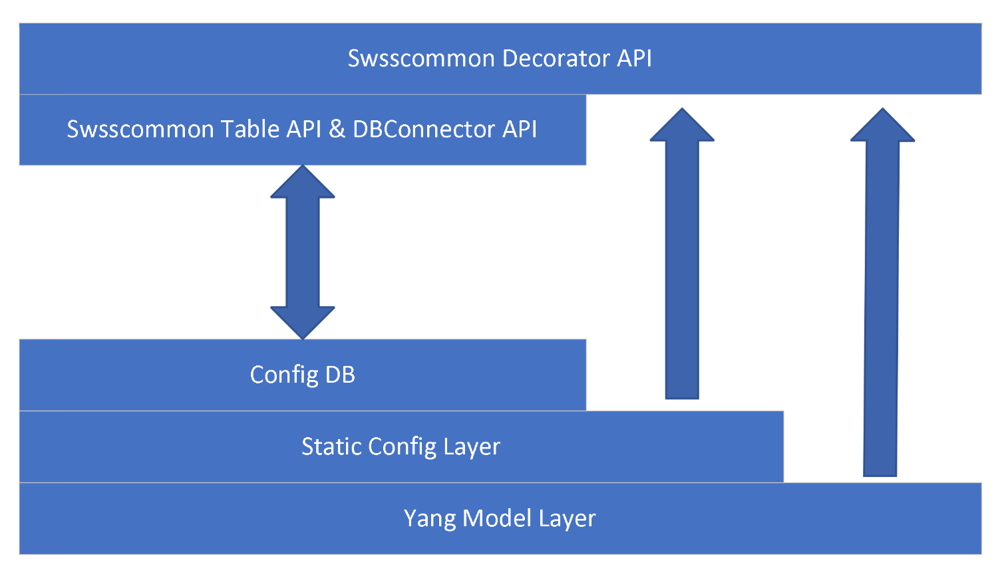
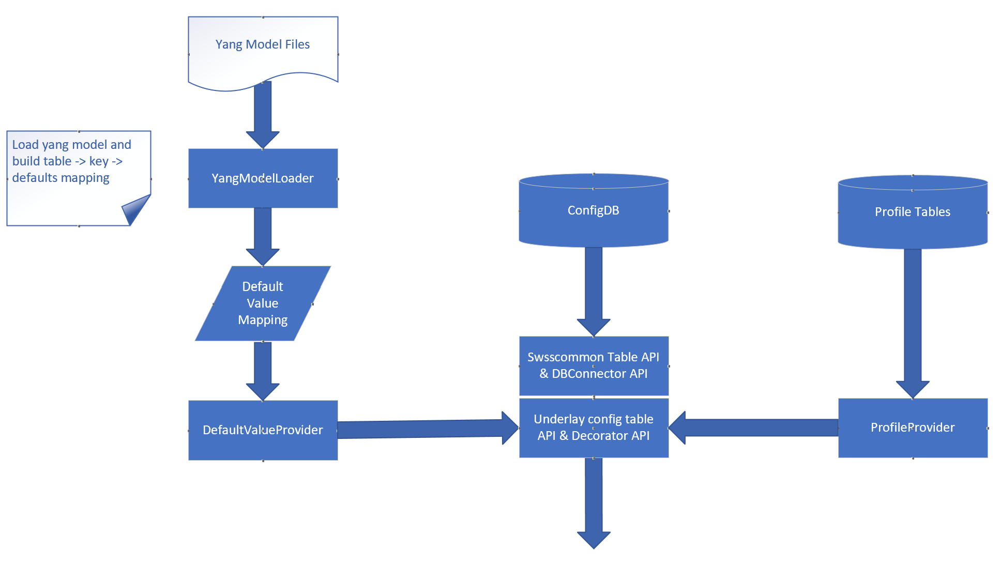

# Multiple overlay ConfigDB

## Table of Contents
- [Table of Contents](#table-of-contents)
- [About this Manual](#about-this-manual)
    + [SONiC issue solved by this feature](#sonic-issue-solved-by-this-feature)
- [1 Functional Requirement](#1-functional-requirement)
    + [1.1 swss-common return default value from Yang model overlay](#1-1-swss-common-return-default-value-from-yang-model-overlay)
    + [1.2 swss-common return static config from static config overlay](#1-1-swss-common-return-static-config-from-static-config-overlay)
- [2 Design](#2-design)
    + [2.1 Considerations](#2-1-considerations)
    + [2.2 New class](#2-2-new-class)
    + [2.3 Other code change](#2-3-other-code-change)
    + [2.4 Code example](#2-4-code-example)
    + [2.5 Other solutions](#2-5-other-solutions)
- [3 Error handling](#3-error-handling)
- [4 Serviceability and Debug](#4-serviceability-and-debug)
- [5 Unit Test](#5-unit-test)
- [6 Migration steps](#6-migration-steps)
    + [6.1 Phase 1](#6-1-phase-1)
    + [6.2 Phase 1](#6-2-Phase-2)
- [7 References](#7-references)


# About this Manual
This document provides a detailed description on the new features for:
 - Overlay Config DB.
 - Yang model default value overlay.
 - Static config overlay.
 - swss-common API change.

## SONiC issue solved by this feature
 - Static config data can modify by user, for example:
    - Static config are:
     - generated by minigraph and templates.
     - configuration should not be modify by user, but use can overwrite it.
    - Buffer profile are static data render by J2 templates, related with hardware and cable length.
    - User config mixed with static buffer profile, user can modify buffer profile, but can't revert user change to default config.
 - Potential risk, Yang model default value conflict with hardcoded value:
    - Default value hardcoded in source code.
    - Yang model default value not used.
 - SONiC utilities not support get default value:
   - Vender OS have different show command:
     - show running: return user config which not include default value.
     - show running all: return all config with default value.
   - Currently SONiC only support 'show running'

# 1 Functional Requirement
## 1.1 swss-common return default value from Yang model overlay
 - Return default value is optional.
   - Application can read config without default value, also can read config with default value.
 - Backward compatibility with existed code and applications.

## 1.2 swss-common return static config from static config overlay
 - Static buffer config stored in static config tables.
 - Return static config is optional.
   - Application can decide read config with static config or not.
 - Backward compatibility with existed code and applications.
   - For backward compatibility when initialize buffer config from graph, config will be write to both config tables and static config tables.
   - After code migrate to use static buffer config, static config will only write to static config tables.

# 2 Design
 - Layered config DB design diagram:



 - API design diagram:



## 2.1 Considerations
### How to get default value

|                                                              | Pros                                              | Cons                                                         |
| ------------------------------------------------------------ | ------------------------------------------------- | ------------------------------------------------------------ |
| Get default value from Yang model in read API.               | Redis config DB keeps no change.                  | 3 MB memory per-process because need load Yang model and reference libyang.<br>50ms to load yang model.<br>8ms to read default value 10000 times. |
| Write default value to default value DB when write config DB. | Better read performance, Less memory consumption. | Need add new Redis DB for default value.                     |

### How to get static config
 - Static config will stored in a new redis database 'STATIC_CONFIG_DB'
 - Static config DB will have exactly schema with config DB.
 - Data will read form static config DB with swsscommon API.
### API compatibility

|                                        | Pros                                                         | Cons                                                         |
| -------------------------------------- | ------------------------------------------------------------ | ------------------------------------------------------------ |
| Change API to return default value and static config. | Less code change, all app will get default value and static config automatically. | For default value, there are hardcoded default value may different with Yang model, new default value from config DB may cause code bug. |
| Existed API keeps no change.      | When update existed code, can cleanup code to remove hard coded default value. | All apps need code update.                                   |

### Current design:
   - Existed read API keeps no change. 
   - Add decorator API to return default value and static config data.

## 2.2 New class
 - YangModelLoader class
   - load table name to default value mapping to memory.

 - DefaultValueProvider class
   - Find default value information by table name and config DB key
   - Merge default value to API result.

 - StaticConfigProvider class
   - Read static config from static config DB.
   - Merge static config to API result.

 - OverlayConfigDBConnectorDecorator python class
 - OverlayConfigTable c++ class
 - OverlaySubscriberStateTable c++ class

## 2.3 Other code change
 - Add new methods to TableEntryEnumerable  interface:
   - virtual bool hget(const std::string &key, const std::string &field, std::string &value) = 0;
   
## 2.4 Code example
 - Connector decorator:
```
    from swsscommon.swsscommon import SonicV2Connector, ConfigDBConnector, OverlayConfigDBConnectorDecorator

    conn = ConfigDBConnector()
    decorator = OverlayConfigDBConnectorDecorator(conn)
    decorator.connect()
    decorator.get_table("VLAN_INTERFACE")
    decorator.get_entry("VLAN_INTERFACE", "Vlan1000")
    decorator.get_config()
```
 - OverlayConfigTable:
```
    from swsscommon.swsscommon import DBConnector, Table, OverlayConfigTable 

    db = DBConnector("CONFIG_DB", 0)
    # table = Table(db, 'VLAN_INTERFACE')
    table = OverlayConfigTable(db, 'VLAN_INTERFACE')
    table.get("Vlan1000")
```

## 2.5 Other solutions for Yang model default value

|                                                              | Pros                                                         | Cons                                                         |
| ------------------------------------------------------------ | ------------------------------------------------------------ | ------------------------------------------------------------ |
| 1. All existed APIs change to return default value.<br>2. Add new API to get 'real' data from config DB, which not have default value. | Less code change, all app will get default value automatically. | 1. There are hardcoded default value in many different place, the default value of those code may different with default value from Yang model, so new default value from config DB may cause code bug, this is a potential risk.<br/>2. 3 MB memory per-process because need load Yang model.<br/>3. 0.05 second to load yang model |
| 1. Write API change: when write data to config DB, also write default value to 'Default_value_DB'.<br/>2. Read API change: read default value from 'Default_value_DB' and merge with config DB result. | 1. Less memory consumption and better performance when only call read API: read API no need to load yang model.<br/>2. Less code change, all app will get default value automatically. | Hardcoded default value code still need cleanup.             |


# 3 Error handling
 - Load yang model: throw exception when found yang model data issue.
 - swss-common API: if not found Yang model schema data for a given table name, write warning message to syslog.

# 4 Serviceability and Debug
 - Debug version will write debug log to syslog.

# 5 Unit Test
 - All new code will 100% covered by gtest test case.
 - Add E2E test case for all new APIs.

# 6 Migration steps
## 6.1 Phase 1
 - swss common API change:
   - support read default value.
   - support static config value.

 - buffer config generate code change:
   - sonic-cfggen change to support generate static config to STATIC_CONFIG_DB.
   - sonic-util change to support generate static config when load minigraph.
   - for backward compatibility, config tables still generate to CONFIG_DB.

## 6.1 Phase 2
 - Find out all projects need update by code scan:
   - Any project using swsssdk.
   - Any project using swss common c++ lib.
   - Any project using swss common python lib.

 - Involve project owner to migrate to new API.
   - If project still using swsssdk, then switch to swsscommon with new API.
   - When migrate to new API, also clean up hardcoded default values.
   - Fix code in buffer manager for a special case for dynamic buffer profile.

 - Buffer manager change to use static config.
   - After this, sonic-cfggen and sonic-util change to not generate static config to CONFIG_DB.

# 7 References
## SONiC YANG MODEL GUIDELINES
https://github.com/Azure/SONiC/blob/master/doc/mgmt/SONiC_YANG_Model_Guidelines.md
