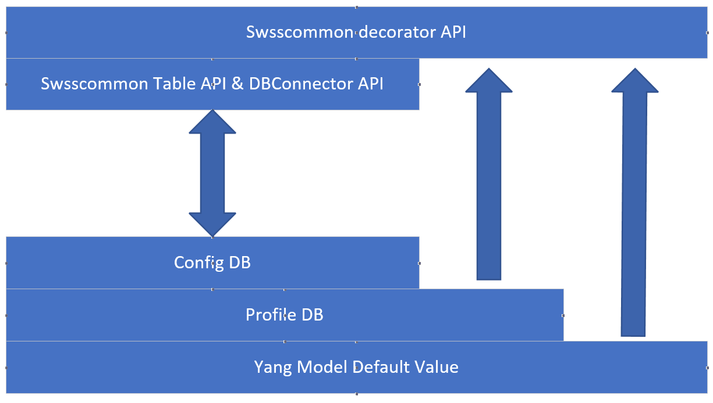

# Underlay ConfigDB with Yang Default Values and SONiC Image Default Profiles

## Table of Contents

- [Table of Contents](#table-of-contents)
- [About this Manual](#about-this-manual)
  + [Terminologies](#terminologies)
  + [Problem Statement](#problem-statement)
- [1 Functional Requirement](#1-functional-requirement)
  + [1.1 swss-common return default value from Yang model underlay](#1-1-swss-common-return-default-value-from-yang-model-underlay)
  + [1.2 swss-common return static config from static config underlay](#1-1-swss-common-return-static-config-from-static-config-underlay)
- [2 Design](#2-design)
  + [2.1 Considerations](#2-1-considerations)
  + [2.2 Other solutions](#2-2-other-solutions)
  + [2.3 New class](#2-3-new-class)
  + [2.4 Other code change](#2-4-other-code-change)
  + [2.5 Database Schema](#2-5-database-schema)
  + [2.6 Code example](#2-6-code-example)
- [3 Reboot](#3-reboot)
- [4 Error handling](#4-error-handling)
- [5 Serviceability and Debug](#5-serviceability-and-debug)
- [6 Unit Test](#6-unit-test)
- [7 Migration steps](#7-migration-steps)
  + [6.1 Phase 1](#7-1-phase-1)
  + [6.2 Phase 1](#7-2-Phase-2)
- [8 References](#8-references)

# About this Manual

This document provides a detailed description on the new features for:

- Underlay Config DB.
- Yang model default value underlay.
- Profile underlay.
- swss-common API change.

## Terminologies
- Yang model:
  - The Yang model define a hierarchical data structure.
  - SONiC Define config DB schema with Yang model, please refer to [SONiC YANG MODEL GUIDELINES](#7-1-sonic-yang-model-guidelines)

- Default value:
  - Yang model support define default value for configuration items.
  - For example, default value for nat_zone:
  ```
				leaf nat_zone {
					description "NAT Zone for the vlan interface";
					type uint8 {
						range "0..3" {
							error-message "Invalid nat zone for the vlan interface.";
							error-app-tag nat-zone-invalid;
						}
					}
                                        default "0";
				}
  ```

- J2 template:
  - SONiC using Jinja2 template generate configuration files during deply minigraph.
  - For example, buffer config are rendered by J2 template:
  ```



    "BUFFER_POOL": {
        "ingress_lossless_pool": {
            "size": "26531072",
            "type": "ingress",
            "mode": "dynamic",
            "xoff": "6291456"
        },
        "egress_lossless_pool": {
            "size": "32822528",
            "type": "egress",
            "mode": "static"
        }
    },
    
    ......
    

  ```

- Static config:
  - Static config is part of OS image, should upgrade with OS upgrade.
  - Static config are suggested values based on expirence.
  - User can overwrite static config.


## Problem Statement

- SONiC still using old default value and config from j2 template after OS upgrade:
  - Following config may update after OS upgrade:
    - Default value: defined in yang model.
    - Static config: defined in j2 template.
  - Currently all config stored in config DB, so above configs can't be update after OS upgrade.
- Potential risk, Yang model default value conflict with hardcoded value:
  - Default value hardcoded in source code.
  - Yang model default value does not be used.
- SONiC utilities not support get user config and all config:
  - Vender OS have different show command:
    - show running: only return user config.
    - show running all: return user config, default value from yang model, and config from j2 template.
  - Currently SONiC only support 'show running'

# 1 Functional Requirement

## 1.1 swss-common return default value from Yang model underlay

- Return default value is optional.
  - Application can read config without default value, also can read config with default value.
- Backward compatibility with existing code and applications.

## 1.2 swss-common return static config from profile underlay

- Static buffer config stored in static config tables.
- Return static config is optional.
  - Application can decide read config with static config or not:
    - When application read static config:
      - If user overwrite the static config, user config will be return.
      - If user not overwrite the static config, static config will be return.
      - If user 'delete' the static config, will return nothing.
    - When application not read static config, API will only return user config.
      - If user overwrite the static config, user config will be return.
      - If user not overwrite the static config, will return nothing.
      - If user 'delete' the static config, then there also will no user config exist, will return nothing.

- Backward compatibility with existing code and applications.
  - For backward compatibility when initialize buffer config from minigraph, config will be write to both config tables and static config tables.
  - After code migrate to use static buffer config, static config will only write to static config tables.
  - Static config support delete/revert operation:
    - In some user scenario, user need delete a static config, and also may add config back later.
    - For delete operation, data in static config table will not be delete, profile underlay use PROFILE_DELETE table to handle delete/revert:
      - When delete a static config item, profile underlay will add the item key to PROFILE_DELETE table.
      - When read static config, any key in PROFILE_DELETE will not exist in result.
      - When user set deleted item back, the item key will be remove from PROFILE_DELETE table.
      - For example:
        - BUFFER_POOL table are static config:
    ```
    "BUFFER_POOL": {
        "ingress_lossless_pool": {
            "size": "26531072",
            "type": "ingress",
            "mode": "dynamic",
            "xoff": "6291456"
        },
        "egress_lossless_pool": {
            "size": "32822528",
            "type": "egress",
            "mode": "static"
        }
    }
  ```
        - On mellanox devices, when set buffer mode to 'dynamic' mode, buffer manager will use swsscommon API to delete buffer pool to reclam unused buffer resource.
        - When delete a static config item 'ingress_lossless_pool', the key of this item will be write to PROFILE_DELETE table. and swsscommon read API will not return this item anymore.
        - Revert operation: when user set buffer mode back, buffer manager will write the deleted item back, when this happen, the key of the item will be remove from PROFILE_DELETE table. and swsscommon read API will return this item.

# 2 Design

- Underlay config DB design diagram:



- API design diagram:


## 2.1 Considerations

### Current design:

- Existing read API keeps no change. 
- Add decorator API to return default value and static config data.
- Load static config as lazy as possible.

### How to get default value

|                                                               | Pros                                              | Cons                                                                                                                                              |
| ------------------------------------------------------------- | ------------------------------------------------- | ------------------------------------------------------------------------------------------------------------------------------------------------- |
| Get default value from Yang model in read API.                | Redis config DB keeps no change.                  | 3 MB memory per-process because need load Yang model and reference libyang.<br>50ms to load yang model.<br>8ms to read default value 10000 times. |
| Write default value to default value DB when write config DB. | Better read performance, Less memory consumption. | Need add new Redis DB for default value.                                                                                                          |

### How to get static config

- Static config will stored in a new redis database 'PROFILE_DB', database index is 15.
- Static config DB tables will have exactly same name and schema with config DB tables.
- Data will read form static config DB with swsscommon API.
- Static config DB will save and persist for warm-reboot and fast-reboot.

### API compatibility

|                                                       | Pros                                                                              | Cons                                                                                                                                     |
| ----------------------------------------------------- | --------------------------------------------------------------------------------- | ---------------------------------------------------------------------------------------------------------------------------------------- |
| Change API to return default value and static config. | Less code change, all app will get default value and static config automatically. | For default value, there are hardcoded default value may different with Yang model, new default value from config DB may cause code bug. |
| Existing API keeps no change.                          | When update existing code, can cleanup code to remove hard coded default value.    | All apps need code update.                                                                                                               |

## 2.2 Other solutions for Yang model default value

|                                                                                                                                                                                                        | Pros                                                                                                                                                                                   | Cons                                                                                                                                                                                                                                                                                                                                 |
| ------------------------------------------------------------------------------------------------------------------------------------------------------------------------------------------------------ | -------------------------------------------------------------------------------------------------------------------------------------------------------------------------------------- | ------------------------------------------------------------------------------------------------------------------------------------------------------------------------------------------------------------------------------------------------------------------------------------------------------------------------------------ |
| 1. All existing APIs change to return default value.<br>2. Add new API to get 'real' data from config DB, which not have default value.                                                                 | Less code change, all app will get default value automatically.                                                                                                                        | 1. There are hardcoded default value in many different place, the default value of those code may different with default value from Yang model, so new default value from config DB may cause code bug, this is a potential risk.<br/>2. 3 MB memory per-process because need load Yang model.<br/>3. 0.05 second to load yang model |
| 1. Write API change: when write data to config DB, also write default value to 'Default_value_DB'.<br/>2. Read API change: read default value from 'Default_value_DB' and merge with config DB result. | 1. Less memory consumption and better performance when only call read API: read API no need to load yang model.<br/>2. Less code change, all app will get default value automatically. | Hardcoded default value code still need cleanup.                                                                                                                                                                                                                                                                                     |

## 2.3 New class

- YangModelLoader class
  
  - load table name to default value mapping to memory.

- DefaultValueProvider class
  
  - Find default value information by table name and config DB key
  - Merge default value to API result.

- StaticConfigProvider class
  
  - Read static config from static config DB.
  - Merge static config to API result.

- YangDefaultUnderlay python class

- UnderlayTable c++ class

- UnderlaySubscriberStateTable c++ class

## 2.4 Other code change

- Add new methods to TableEntryEnumerable  interface:
  - virtual bool hget(const std::string &key, const std::string &field, std::string &value) = 0;

## 2.5 Database Schema

- All static config table will have exactly same schema with existing ConfigDB tables.
  - BUFFER_POOL
  - BUFFER_PROFILE

- PROFILE_DELETE Table:

  ```
  ; Key
  itemkey              = 1*256VCHAR          ; Deleted profile item key.
  ```

## 2.6 Code example

- Connector underlay:
  
  ```
   from swsscommon.swsscommon import SonicV2Connector, ConfigDBConnector, YangDefaultUnderlay
  
   conn = ConfigDBConnector()
   underlay = YangDefaultUnderlay(conn)
   underlay.connect()
   underlay.get_table("VLAN_INTERFACE")
   underlay.get_entry("VLAN_INTERFACE", "Vlan1000")
   underlay.get_config()
  ```

- UnderlayTable:
  
  ```
   from swsscommon.swsscommon import DBConnector, Table, UnderlayTable 
  
   db = DBConnector("CONFIG_DB", 0)
   # Still can use Table to read user config:
   # table = Table(db, 'VLAN_INTERFACE')
   # Use UnderlayTable to read default value, static config and use config:
   table = UnderlayTable(db, 'VLAN_INTERFACE')
   table.get("Vlan1000")
  ```

# 3 Reboot
- Profile DB follow same life cycle with config DB.

## 3.1 Warn-reboot/fast-reboot
- Profile DB will save and persist during warn-reboot and fast-reboot.

## 3.1 Cold-reboot
- Profile DB will follow same process with config DB to handle cold-reboot.

## 3.2 Schema upgrade and DB migration
- Profile DB will follow same process with config DB to handle schema upgrade and DB migration.

## 3.3 OS upgrade
- static_db will re-initialize with J2 templates after OS upgrade.

# 4 Error handling

- Load yang model: throw exception when found yang model data issue.
- swss-common API: if not found Yang model schema data for a given table name, write warning message to syslog.

# 5 Serviceability and Debug

- Debug version will write debug log to syslog.

# 6 Unit Test

- All new code will 100% covered by gtest or pytest test case.

# 7 Migration steps

## 7.1 Phase 1

- swss common API change:
  
  - support Yang model default value.
  - support static config value.

- Static config DB code change:
  
  - sonic-cfggen change to support generate static config to PROFILE_DB.
  - sonic-util change to support generate static config when load minigraph.
  - for backward compatibility, config tables still generate to CONFIG_DB.
  - for warm-reboot/fast-reboot, save and persist static config DB.

## 7.2 Phase 2

- Find out all projects need update by code scan:
  
  - Any project using swsssdk.
  - Any project using swss common c++ lib.
  - Any project using swss common python lib.

- Involve project owner to migrate to new API.
  
  - If project still using swsssdk, then switch to swsscommon with new API.
  - When migrate to new API, also clean up hardcoded default values.
  - Fix code in buffer manager for a special case for dynamic buffer profile.

- Buffer manager change to use static config.
  
  - After this, sonic-cfggen and sonic-util change to not generate static config to CONFIG_DB.

# 8 References

## SONiC YANG MODEL GUIDELINES

https://github.com/Azure/SONiC/blob/master/doc/mgmt/SONiC_YANG_Model_Guidelines.md
