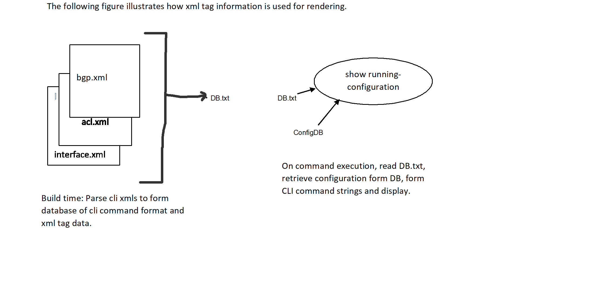

## **SONiC Management Framework CLI 'Show Running Configuration'**


#### High Level Design Document

**Rev 0.1**

#### Table of Contents

-   [[List of Tables]](#list-of-tables)

-   [[Revision]](#revision)

-   [[About This Manual]](#about-this-manual)

-   [[Scope]](#scope)

-   [[Definition/Abbreviation]](#definitionabbreviation)

#### List of Tables

[[Table 1: Abbreviations]](#table-1-abbreviations)

#### About this Manual

This document covers the functional requirements and high level design of the new feature to support "show running-configuration" command.  This also guides developers on how to use this new infrastructure to include their feature in "show running-configuration" command output.


#### Scope

The scope of this document is limited to the functionality described in the
requirements section. It applies to the Klish CLI supported through the SONiC Management framework and limited to the configuration found in CONFIG_DB.

#### Definition/Abbreviation

CLI view : The CLI command mode is referred as a view.


#### 1 Feature Overview

This feature provides an infrastructure for apps to add
their current system configuration to the output of the "show
running-configuration" command. This command is available at the exec
level on the SONiC management framework Klish CLI.

#### 1.1 Functional requirements

The 'show running-configuration' command will display the  configuration done
through the CLI interface and which is stored on the system.

For this command to show the entire running configuration of the system,
all apps should support configuration through Klish CLI interface.

Any configuration done using gNMI or REST or other management
interface which is stored in CONFIG_DB and has a corresponding Klish CLI
command will be displayed as part of this new command.

The order of commands displayed in the "show running-configuration" will be
in accordance to the order of dependency between CLI views. 

If configuration default values are stored in CONFIG_DB, they will be shown as
part of "show running-configuration".

The infrastructure will provide functionality to filter and display
the configuration based on the CLI views.

The infrastructure automates as much of the show running-config output generation as possible from the developer-provided information. Where more developer work is required, an easy-to-use plug-in infrastructure is provided.

It will support pagination options no-more, except, find and grep.


#### 1.1.2 Future release

It should be possible to pipe the output to a file or script, and to be able to copy this on/off box.

The command output can be copied and pasted to be used as
configuration on another SONiC Klish CLI session of the same or another
system and should arrive at the same running configuration as the source session.

The output should appear in show techsupport.
 

#### 1.2 Restrictions

Apps should not use this infrastructure to add configuration to 'show running-configuration' command for which there does not exist a CLI Klish command.

System state information should not be added to this command.


#### 1.3 Command syntax

###### 1.3.1 show running-configuration

An exec level command to display the current configuration of the
system.

Example:

sonic\#\>show running-configuration  
interface Vlan 5  
\!  
interface PortChannel 5 min-links 3 mode active  
\!  
interface Ethernet0  
&nbsp; no shutdown  
&nbsp; mtu 5000  
&nbsp; nat-zone 2  
&nbsp; ip address 10.11.203.35/8  
\!  
interface Ethernet4  
&nbsp; no shutdown  
&nbsp; mtu 5000  
&nbsp; switchport access vlan 5  
&nbsp; switchport trunk allowed vlan 6  
\!  
router bgp 11 vrf VrfBlack  
&nbsp; listen range 8.8.8.0/24 peer-group PG1  
\!  
router bgp 5 vrf VrfBlue  
&nbsp; router-id 6.6.6.6  
&nbsp; graceful-restart enable  
&nbsp; graceful-restart preserve-fw-state  
&nbsp; graceful-restart restart-time 500  
&nbsp; graceful-restart stalepath-time 600  

###### 1.3.2 show configuration

This command displays the configuration pertaining to the view at
which it is executed.

Example:

sonic(conf)\# interface PortChannel 5  
sonic(conf-if-po5)\#show configuration  
no shutdown  
mtu 5000  
switchport access vlan 5  
switchport trunk allowed vlan 6  

#### 2. Design

The design approach is to automate the rendering of the "show
running-configuration" command. The CLI developer does not
have to write a separate Jinja template for this purpose. However, for
some cases automation is not entirely possible due to way the config data is
stored in DB, or if the CLI command format cannot be rendered by this new automated infra.

For these exceptions two approaches are provided to the developer:

a.  Developer to provide a Python callback function. The infra will call this
    function with the required DB tables and keys. The
    function will return a list of commands. This list will be
    incorporated into the final command output.
    A single command or an entire CLI view can be rendered using a callback.
    For single commands it is preferred to use Python callback for performance.
    For an entire CLI view, which contains a large set of commands, a rendering Jinja
    template can be used.

b.  Developer to provide a Python callback which will retrieve
    data and render. It can retrieve data from DB using any
    interface and run it through its template. It will return the list
    of commands to the infra to be displayed in the final output.

The automation infra retrieves data from DB using the REST
interface and sonic YANG model. The developer of CLI has to provide 
the DB table and attribute information in the CLI XML tags related to
every command which it wishes to be displayed in the "show running
configuration" command output. New XML tags are introduced to provide this information.

Applications are required to provide the following information in the
respective config XML using the newly introduced XML tags.

-   sonic-yang table and attributes corresponding to the command
    parameters.

-   Table keys needed to access correct table records on transitioning
    to nested CLI views.

-   For some commands, a direct mapping to DB table attribute does
    not exist. In this case, a separate rendering Python callback or template(Jinja) is
    required. For e.g., switchport trunk allowed Vlans, bgp neighbor etc.

##### 2.1 **New XML tags**
```

1. Attribute        view_keys
  
  Syntax            Multiple keys delimited by ",".
                    Key, value separated by "=".
                    Wildcard key value denoted by "*".
                    Keys for mulitple views separated by "|".
                    
  Example           view_keys="vrf=*"
                    view_keys="vrfname=sonic-bgp-global:sonic-bgp-global/BGP_GLOBALS/BGP_GLOBALS_LIST/vr_name, afi-safi=ipv4_unicast,ip_prfx=*"
                    view_keys="ifname=*|vlaname=*"
                    
  Attribute to XML  COMMAND                
  element  

  Explanation       The tag is required when switching to a chid CLI view. The keys are for all the sonic YANG tables accessed in the new child view.
                    This is added to the COMMAND statement.
                    For e.g.
                    sonic(config-router-bgp)# address-family ipv4 unicast
                    sonic(config-router-bgp-af)#
                    Here the child view is config-router-bgp-ipv4. 
                    In the child view, tables BGP_GLOBALS_AF_LIST, BGP_GLOBALS_AF_AGGREGATE_ADDR_LIST are accessed.
  
                    Keys : view_keys= "vrfname =sonic-bgp-global:sonic-bgp-global/BGP_GLOBALS/BGP_GLOBALS_LIST/vrf_name,afi-safi=ipv4_unicast, ip_prfx=*"
                    The vrfname is populated from parent view table, hence the entire table path is specified.
                    afi-safi is given with exact value and ip_prfx is wildcard. BGP_GLOBALS_AF_AGGREGATE_ADDR_LIST table 
                    has 2 keys, vrf_name and ip_prfx. All prefixes with vrf_name=vrfname are displayed.
                    
                    If a command is denoted by flag "SEP_CLI", where a switch statement has params which transition to different child views, then view_keys are assigned in the order of the params.
  
  
2. Attribute        view_tables
    
  Syntax            Multiple sonic YANG tables separated by  ";".
                    The table name has to specify all its keys.
                    Tables for mulitple views separated by "|"
                    
  Example           view_tables= "sonic-bgp-global:sonic-bgp-global/BGP_GLOBALS_AF/BGP_GLOBALS_AF_LIST/vrf_name={vrfname},afi_safi={afi-safi}"
  
  Attribute to XML  COMMAND
  element
  
  Explanation       This tag lists the sonic YANG tables accessed in the child view with its keys.
                    This is added to the COMMAND statement.
                    The key value variable inside parenthese '{}' have to match the key variables in tag "view_keys".
                    For e.g The variable name 'vrfname' for key 'vrf_name' in "view_tables" is the same as variable 'vrfname' in "view_keys".
                    The first table must be the primary table of the view.                                |
                    If a "view_template" attribute is specified in the same command, then all the tables in the view have to be listed here,
                    otherwise only the primary table.
                    For e.g.,  sonic(config-router-bgp)# neighbor 5.5.5.5
                               sonic(config-router-bgp-nbr)#
                               
                    view_tables="sonic-bgp-neighbor:sonic-bgp-neighbor/BGP_NEIGHBOR/BGP_NEIGHBOR_LIST/vrf_name={vrfname},neighbor={neighbor}"  
                    
                    If a command is denoted by flag "SEP_CLI", in which a switch statement has params which transition to different child views, then view_tables are assigned in the order of the params.
   
3. Attribute        dbpath

  Syntax            Path to sonic YANG table attribute with '/'.
                    If exact value of parameter is to be matched then 'param=value'.
                    
  Example           dbpath="sonic-bgp-global:sonic-bgp-global/BGP_GLOBALS/BGP_GLOBALS_LIST/gr_restart/time
                    dbpath="sonic-bgp-global:sonic-bgp-global/BGP_GLOBALS/BGP_GLOBALS_LIST/always_compare_med=true
                    
  Attribute to XML  COMMAND, PARAM
  element
  
  Explanation       This tag is to map the command or param to the corresponding attribute in DB.
                    If the CLI rendering requires some transformation, or if it uses a PTYPE then a Python callback will be needed for the command. In this case, dbpath is not relevant.


4.  Attribute       command_tables

  Syntax            Multiple sonic YANG tables separate by ";".
                    Tables have to specify all its keys.
                     
  Example           command_tables="sonic-bgp-peergroup:sonic-bgp-peergroup/BGP_GLOBALS_LISTEN_PREFIX/BGP_GLOBALS_LISTEN_PREFIX_LIST/vrf_name={vrf-name},ip_prefix={ip_prfx}"
  
  Attribute to XML  COMMAND
  element
  
  Explanation       This tag specifies the primary table for the command if it is different then view table. The keys are used from tag 'view_keys'.
                    If attributes from more than one table are referenced in the COMMAND (other than the primary table of the view),
                    then this command has to be rendered using command_render_cb.
                    
5. Attribute        command_keys
   
  Syntax            Multiple sonic YANG table keys separated by ','.
                    This is optional, only required if a specific record is to be retrieved from command tables.    
                    
  Example           
  
 Attribute to XML   COMMAND
 element
  
 Explanation        Specifies the keys for the command tables. The keys are required if the specific record is to be accessed for the command.  
 
 Example            command_keys="instance=GLOBAL"

6.  Attribute       render_command_cb
                    
  Syntax            String
                      
  Example           render_command_cb = 'bgp_confederation '
                      
  Attribute to XML  COMMAND
  element
                      
  Explanation       In case where the CLI COMMAND or PARAM does not have direct mapping to a table attribute in the DB, the CLI developer has the option to form the
                    command in a Python callback. The developer has to map this tag value to a callback name.
                    The mapping is to be provided in file CLI/acioner/show_config_data.py
                    In most cases, the command rendering is short and can be done efficiently in Python. 
                    A Jinja template has overhead of loading which increases linearly with file size.
                    For command rendering it is recommended to implement it in Python. 


7.  Attribute       render_view_cb

  Syntax            String
  
  Example           render_view_cb = 'bgp_neighbor'
  
  Attribute to XML  COMMAND
  element
  
  Explanation       This tag is to be set if an an enitre CLI view is to be rendered using a Jinja template or a Python callback. 
                    Inernally developer has to map this tag value to a Jinja template or a callback name. 
                    The mapping is to be provided in file CLI/acioner/show_config_data.py
                    

                  
8. Attribute        db_flag

  Syntax            Multiple flags can be defined with ‘|’ acting as separator.
                    
  Example           db_flag = SEP_CLI
  
  Attribute to XML  COMMAND, PARAM 
  element                     
  
  Explanation       Flags currently defined are

                    SEP_CLI - Flag to be used in COMMAND and PARAM tag. Generally there will be one DB entry per command.
                    The SEP_CLI flag is used to split the command and generate multiple entries for the same command.
                    The flag should the placed in the COMMAND tag that needs special handling and also in the PARAM of type switch,
                    so that each tree under the switch node will be generated as separate entry.
                    If a command is denoted by flag "SEP_CLI", where a switch statement has params which contain  different views, then view_tables are assigned in the order of the params.
                    All switch params options have to switch to a different child view.
                    
9. Attribute        data_and_render_cb
   
  Syntax            STRING
   
  Example           data_and_rernder_cb="acl_rules"
   
  Attribute to XML  COMMAND
  element
  
  Explanation       This callback will be implemented by the CLI developer. It will have to retrive data from DB and render it.
                    It will return a list of commands separated by a delimiter ';'. 
                    The tag to internal callback mapping has to be added in file CLI/acioner/show_config_data.pys

   
```
The following link illustrates how the XML tag information
is used for rendering.



#### 2.2 Container

This feature is implemented within the Management Framework container.

#### 3 User Guide

Following excerpts from bgp.xml show the new XML tag usage for different CLI formats.

###### 3.1 Command with switch to a new view (configure-router-bgp-view)
```
<COMMAND name="router bgp" help="Border Gateway protocol (BGP)" view="configure-router-bgp-view" viewid="instance=${as-num-dot};vrf-name=${vrf-name}"  view_keys="vrf_name=*, ip_prfx=*" view_tables="sonic-bgp-global:sonic-bgp-global/BGP_GLOBALS/BGP_GLOBALS_LISTEN/vrf_name={vrf-name}">
  <PARAM name="as-num-dot" help="Autonomous system number" ptype="RANGE_1_4294967295" dbpath="sonic-bgp-global:sonic-bgp-global/BGP_GLOBALS/BGP_GLOBALS_LISTEN/local_asn">
    <PARAM name="vrf" help="VRF Instance" ptype="SUBCOMMAND" mode="subcommand" optional="true">
      <PARAM name="vrf-name" help="Name of VRF (Max size 15, prefixed by Vrf)" ptype="STRING_15" default="default"  dbpath="sonic-bgp-global:sonic-bgp-global/BGP_GLOBALS/BGP_GLOBALS_LISTEN/vrf_name"/>
    </PARAM>
  </PARAM>
</COMMAND>
```


###### 3.2 Command with tag attribute 'render_command_cb'

The attribute value of param "neighbor' is a string in DB which is either an ip-address or an interface format. Hence using a template for
rendering. Based on the name prefix, different command formats have to formed. 
If name is Vlan20 then 'neighbor interface Vlan 20, if 5.5.5.5 then 'neighbor 5.5.5.5'. Since no direct mapping, developer has to provide the command via callback function.

```
<COMMAND name="neighbor" help="Specify a neighbor router" view="configure-router-bgp-nbr-view" viewid="nbr-addr=${ip}${Ethernet}${PortChannel}${Vlan};vrf-name=${vrf-name}" render_command_cb="router_bgp_neighbor" view_keys="vrf-name=sonic-bgp-global:sonic-bgp-global/BGP_GLOBALS/BGP_GLOBALS_LISTEN/vrf_name,neighbor=*" view_tables="sonic-bgp-neighbor:sonic-bgp-neighbor/BGP_NEIGHBOR/BGP_NEIGHBOR_LIST/vrf_name={vrf-name},neighbor={neighbor}" dbpath="sonic-bgp-neighbor:sonic-bgp-neighbor/BGP_NEIGHBOR_LIST/neighbor">
   <PARAM name="nbopt" help="neighbor router" mode="switch" ptype="SUBCOMMAND">
     <PARAM name="ip" help="Neighbor router" ptype="IPV4V6_ADDR"/>
     <PARAM name="interface" help="Interface name" mode="subcommand" ptype="SUBCOMMAND">
       <PARAM name="iftype" help="interface type" mode="switch" ptype="SUBCOMMAND">
         <PARAM name="Ethernet" help="Ethernet interface" ptype="PHY_INTERFACE" mode="subcommand"/>
         <PARAM name="PortChannel" help="PortChannel interface" ptype="PO_INTERFACE" mode="subcommand"/>
         <PARAM name="Vlan" help="Vlan interface" ptype="VLAN_INTERFACE" mode="subcommand"/>
       </PARAM>
     </PARAM>
   </PARAM>
 </COMMAND>
```

###### 3.3  Command with direct mapping into DB attributes

```
<COMMAND name="timers" help="Adjust routing timers">
  <PARAM name="keepalive-intvl" help="Keepalive interval (default=60)" ptype="RANGE_1_3600" dbpath="sonic-bgp-global:sonic-bgp-global/BGP_GLOBALS/BGP_GLOBALS_LIST/keepalive">
    <PARAM name="hold-time" help="Holdtime (default=180)" ptype="RANGE_1_3600" dbpath="sonic-bgp-global:sonic-bgp-global/BGP_GLOBALS/BGP_GLOBALS_LIST/holdtime"/>
  </PARAM>
</COMMAND>
```

###### 3.4  Switch statement
```
<COMMAND name="max-med" help="Advertise routes with max-med">
  <PARAM name="maxmedopts" help="MAX_MED admin or startup" mode="switch" ptype="SUBCOMMAND">
    <PARAM name="on-startup" help="Effective on a startup" ptype="SUBCOMMAND" mode="subcommand">
      <PARAM name="stime" help="Time (seconds) period for max-med" ptype="RANGE_5_86400" dbpath="sonic-bgp-global:sonic-bgp-global/BGP_GLOBALS/BGP_GLOBALS_LIST/max_med_time">
        <PARAM name="maxmedval" help="Max MED value to be used" ptype="RANGE_0_4294967295" optional="true" dbpath="sonic-bgp-global:sonic-bgp-global/BGP_GLOBALS/BGP_GLOBALS_LIST/max_med_val"/>
      </PARAM>
    </PARAM>
    <PARAM name="administrative" help="Administratively applied,  for an indefinite period" ptype="SUBCOMMAND" mode="subcommand" dbpath="sonic-bgp-global:sonic-bgp-global/BGP_GLOBALS/BGP_GLOBALS_LIST/max_med_admin=true">
        <PARAM name="maxmedval" help="Max MED value to be used" ptype="RANGE_0_4294967295" optional="true" dbpath="sonic-bgp-global:sonic-bgp-global/BGP_GLOBALS/BGP_GLOBALS_LIST/max_med_admin_val"/>
    </PARAM>
  </PARAM>
</COMMAND>
```

###### 3.5  Command mapped to a table other than the primary view table.

This command is in the config-if-view with primary view table PORT_LIST. The key from XML tag 'view_keys="name=*"'
is used here. i.e., interface_name={name}

```

<COMMAND name="threshold priority-group"
   help="Configure priority-group thresholds" ptype="SUBCOMMAND" mode="subcommand" command_tables="sonic-threshold:sonic-threshold/THRESHOLD_TABLE/THRESHOLD_TABLE_LIST/buffer={buffer},threshold_buffer_type={threshold},interface_name={name},buffer_index_per_port={port}" dbpath="sonic-threshold:sonic-threshold/THRESHOLD_TABLE/THRESHOLD_TABLE_LIST/buffer=priority-group">
  <PARAM name="PG-Index"
    help="PG Index value"
    ptype="RANGE_0_7"
    dbpath="sonic-threshold:sonic-threshold/THRESHOLD_TABLE/THRESHOLD_TABLE_LIST/buffer_index_per_port">
  </PARAM>
  <PARAM
    name="threshold_buffer_type"
    help="choose from shared, headroom."
    mode="switch"
    ptype="SUBCOMMAND">
              <PARAM
                     name="headroom"
                     help="choose headroom as threshold buffer type"
                     ptype="SUBCOMMAND"
                     mode="subcommand"
                     dbpath="sonic-threshold:sonic-threshold/THRESHOLD_TABLE/THRESHOLD_TABLE_LIST/threshold_buffer_type=headroom">
  </PARAM>
  <PARAM
                     name="shared"
                     help="choose shared as threshold buffer type"
                     ptype="SUBCOMMAND"
                     mode="subcommand"
                     dbpath="sonic-threshold:sonic-threshold/THRESHOLD_TABLE/THRESHOLD_TABLE_LIST/threshold_buffer_type=shared">
  </PARAM>
  </PARAM>
  <PARAM
         name="threshold_value"
         help="Threshold value"
         ptype="PERCENT_1"
         dbpath="sonic-threshold:sonic-threshold/THRESHOLD_TABLE/THRESHOLD_TABLE_LIST/threshold">
              </PARAM>
    <ACTION builtin="clish_pyobj">sonic_cli_threshold patch_sonic_threshold_sonic_threshold_threshold_table_threshold_table_list_threshold ${__full_line} ${iface}</ACTION>
              
```

###### 3.8  Command in a view, with view table (primary table) not present.
The view 'configure-view' does not have a primary table. This is the topmost view.
Commands under this view map to different tables. If XML tag 'command_keys' is not specified or 
keys are spcified with wildcard, then all the entries in the table are rendered.
In the following example command "ip vrf", all entries of the VRF table are shown.


```
<COMMAND
    name="ip vrf"
    help="VRF instance configuration"
    mode="subcommand"
    ptype="SUBCOMMAND"
    command_tables="sonic-vrf:sonic-vrf/VRF/VRF_LIST/vrf_name={name}"
    >
    <PARAM
      name="vrf-name"
      help="Name of VRF (Max size 15, prefixed by Vrf)"
      ptype="STRING_15"
      dbpath="sonic-vrf:sonic-vrf/VRF/VRF_LIST/vrf_name"
      >
    </PARAM>
    <ACTION
    </ACTION>
  </COMMAND>
```

 In some cases the commands would refer to a particular record in the table. In such case XML tag 'command_keys' has to be specified
 
 ```
 <COMMAND
      name="interface-naming"
      help="Interface naming"
      command_keys="name=localhost"
      command_tables="sonic-device-metadata:sonic-device-metadata/DEVICE_METADATA/DEVICE_METADATA_LIST/name={name}"
      >
      <PARAM 
          name="standard" 
          help="Enable interface naming standard mode" 
          ptype="SUBCOMMAND" 
          mode="subcommand"
          dbpath="sonic-device-metadata:sonic-device-metadata/DEVICE_METADATA/DEVICE_METADATA_LIST/intf_naming_mode=alias"  
          >
      </PARAM>
   <ACTION
   </ACTION>
   </COMMAND>
```

###### 3.7 Multi-view command, Seperate CLI

Here each switch param transition to a different view. PARAM phy-if-name switches to configure-if-view. PARAM vlan-if-name switches to configure-vlan-view. Hence, a SEP_CLI flag is needed. If  a new CLI is developed, it is advised to separate the switch statement into different commands in this scenario for simplicity.

```
<COMMAND name="interface" help="Select an interface" db_flag="SEP_CLI" view_keys="name=*|name=*" view_tables="sonic-port:sonic-port/PORT/PORT_LIST/ifname={name}|sonic-vlan:sonic-vlan/VLAN/VLAN_LIST/name={name}" >
   <PARAM name="if-switch" help="Interface commands" mode="switch" ptype="STRING" db_flag="SEP_CLI" >
      <PARAM name="phy-if-name" help="Physical interface" ptype="PHY_INTERFACE" view="configure-if-view" dbpath="sonic-port:sonic-port/PORT/PORT_LIST/ifname" viewid="iface=${phy-if-name}"/>
      <PARAM name="vlan-if-name" help="Vlan identifier" ptype="VLAN_INTERFACE" view="configure-vlan-view" dbpath="sonic-vlan:sonic-vlan/VLAN/VLAN_LIST/name" viewid="vlan_name=${vlan-if-name}"/>
   </PARAM>
</COMMAND>
```
###### 3.8 Command callback rendering 

The mapping of the value of XML tag 'render_command_cb' to internal Python callback function name is added in file CLI/acioner/show_config_data.py
Following is the callback for command "switchport trunk allowed Vlan [vlan-id]"
The interface VLAN membership is in the table VLAN_MEMBER_LIST. The table has interface and vlan name as keys and tagging mode as the attribute. Since the attributes are not directly mapped to CLI params, a callback is needed to format the command.

```
show_config_interface.py

def show_if_switchport_trunk(render_tables):
    cmd_str = ''
    vlan_lst = ''
    if 'name' in render_tables:
       ifname_key = render_tables['name']
       if 'sonic-vlan:sonic-vlan/VLAN_MEMBER/VLAN_MEMBER_LIST' in render_tables:
           for vlan_member in render_tables['sonic-vlan:sonic-vlan/VLAN_MEMBER/VLAN_MEMBER_LIST']:
              if 'ifname' in vlan_member:
                if ifname_key == vlan_member['ifname'] and vlan_member['tagging_mode']=='tagged':
                   vlan_id = vlan_member['name'].lstrip('Vlan')
                   if vlan_lst: 
                       vlan_lst += ","
                   vlan_lst += vlan_id   
    if vlan_lst:
       cmd_str = 'switchport trunk allowed Vlan ' + vlan_lst

```
###### 3.8 CLI rendering using Jinja template.
Following is an example of Jinja rendering for a single command. This can be extended to include commands for the whole CLI view.

The mapping of XML tag 'render_view_cb' value to internal Jinja callback function name is to be added in file CLI/acioner/show_config_data.py

```
bgp.j2

    
    
        
        
            
            {{- 'neighbor interface Ethernet ' ~ id[1]}}
        
            
            {{- 'neighbor interface Vlan ' ~ id[1]}}
        
            
            {{- 'neighbor interface PortChannel ' ~ id[1]}}
        
            {{- 'neighbor ' ~ neighbor }}
	
    

```

###### 3.6 View level callback plugin (xml_tag: data_and_rernder_cb)
Infra will call the callback with the arguments provided by the XML tags. 
The mapping of XML tag 'data_and_rernder_cb' value to internal callback function name is to be added in file CLI/acioner/show_config_data.py

Notes:
When introducing a new CLI view, it must be added to the view list
in the actioner script (actioner/show_config_data.py). The position of view in the list is critical for correct ordering of commands display. Also, all the child views of the new view must be listed in the right order.

###### 3.7 CLI view based 'show configuration'

'show configuration' command is an application specific requirement. If an application needs to show the configuration at its view level, it has to implement this command in that CLI view. The actioner must call the API provided by the infra to render the configuration.

The API requires the CLI view name and the keys for the view tables as parameters. The keys are available as view-ids in the current CLI view.

API:  
Module: sonic_cli_show_config
Parameters: func_name, cli-view, keys

 
E.g. bgp.xml
Show configuration under configure-router-bgp-view
```
<COMMAND name="show configuration" help="show bgp configuration">
  <ACTION builtin="clish_pyobj">sonic_cli_show_config show_configuration views=configure-router-bgp view_keys="vrf-name=${vrf-name}"" </ACTION>
</COMMAND>
```

Show configuration under configure-router-bgp-nbr-view
```
<COMMAND name="show configuration" help="show bgp nbr configuration">
  <ACTION builtin="clish_pyobj">sonic_cli_show_config show_configuration views=configure-router-bgp-nbr view_keys="vrf-name=${vrf-name} neighbor=${nbr-addr}"" </ACTION>
</COMMAND>  
```

##### 4 Compilation and testing.

1.  Compile mgmt-framework package and install.
2.  Verify the show running-configuration command output. 


#### 5 Unit Test and Automation
Since this an infrastructure, the basic functionality can be validated by taking a module and validating its show running implementation.
For this validation, interface.xml, bgp.xml, vrf.xml and tacacs.xml are to be used for unittests.

1. Configure BGP configuration under configure-router-bgp-view.  
      -Verify 'show run-configuration' output.  
      -Verify 'show configuraitoin' output.  

2. Configure commands under configure-bgp-router-view.  
      -Verify 'show run-configuration' output.  
      -Verify 'show configuraitoin' output.  

3. Configure commands under configure-bgp-router-af-view.  
      -Verify 'show run-configuration' output of views in tests 1,2 & 3.  
      -Verify 'show configuration' output.  
      -Verify pagination options.   

4. Configure commands under configure-bgp-router-af-ipv4-view.  
    -Verify 'show run-configuration' output.  
    -Verify 'show configuration' output.  
            
5. Configure commands under configure-if-view.  
    -Verify 'show run-configuration' output.  
    -Verify 'show configuration' output.  

6. Configure commands under configure-lag-view.  
    -Verify 'show run-configuration' output.  
    -Verify 'show configuration' output.  

7. Configure commands under "ip vrf" under configure-view.  
    -Verify 'show run-configuration' output.  
    
8. Configure commands under "tacacs" under configure-view.  
    -Verify 'show run-configuration' output.  
