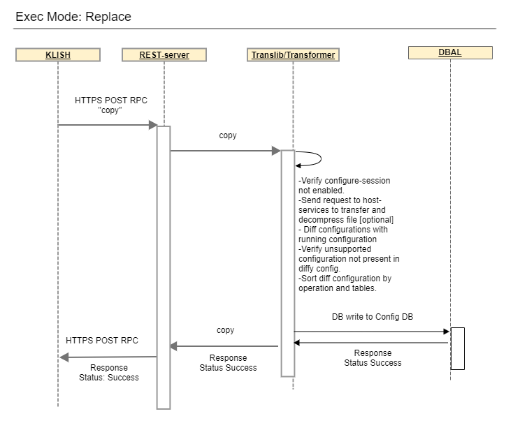
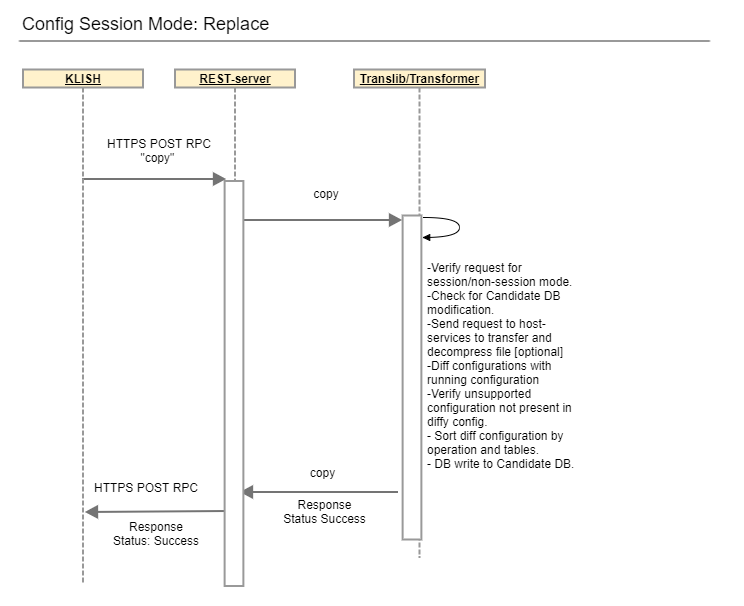
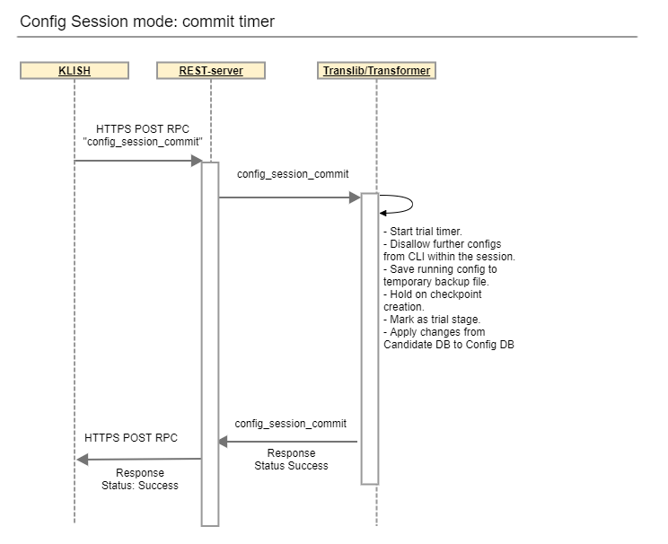
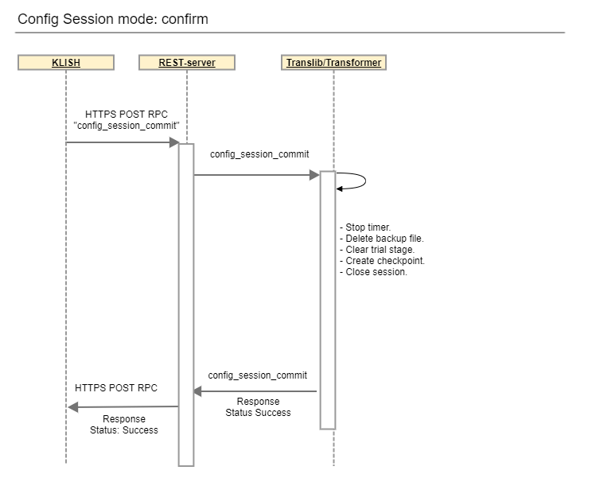

# Feature Name
Configure Replacement and Rollback

# High Level Design Document
# Table of Contents

<!-- TOC depthFrom:1 depthTo:6 withLinks:1 updateOnSave:1 orderedList:0 -->

- [Feature Name](#feature-name)
- [High Level Design Document](#high-level-design-document)
- [Table of Contents](#table-of-contents)
- [List of Tables](#list-of-tables)
- [Revision](#revision)
- [About this Manual](#about-this-manual)
- [Definition/Abbreviation](#definitionabbreviation)
		- [Table 1: Abbreviations](#table-1-abbreviations)
- [1 Feature Overview](#1-feature-overview)
	- [1.1 Target Deployment Use Cases](#11-target-deployment-use-cases)
	- [1.2 Requirements](#12-requirements)
	- [1.3 Design Overview](#13-design-overview)
		- [1.3.1 Basic Approach](#131-basic-approach)
		- [1.3.2 Container](#132-container)
		- [1.3.3 SAI Overview](#133-sai-overview)
- [2 Functionality](#2-functionality)
- [3 Design](#3-design)
	- [3.1 Overview](#31-overview)
		- [3.1.1 Exec mode](#311-exec-mode)
		- [3.1.2 Configure session mode](#312-configure-session-mode)
			- [3.1.2.1 Timer thread](#3121-timer-thread)
	- [3.2 User Interface](#32-user-interface)
		- [3.2.1 Data Models](#321-data-models)
		- [3.2.2 CLI](#322-cli)
			- [3.2.2.1 Exec Mode Commands](#3221-exec-mode-commands)
				- [3.2.2.1.1 Copy Command](#32211-copy-command)
			- [3.2.2.2 Configuration Session Mode Commands](#3222-configuration-session-mode-commands)
				- [3.2.2.2.1 Replace Command](#32221-replace-command)
				- [3.2.2.2.2 commit command](#32222-commit-command)
		- [3.2.3 REST API Support](#323-rest-api-support)
		- [3.2.4 gNMI Support](#324-gnmi-support)
- [4 Flow Diagrams](#4-flow-diagrams)
- [4.1 Exec mode configuration replace command](#41-exec-mode-configuration-replace-command)
- [4.2 Config session mode replace command](#42-config-session-mode-replace-command)
- [4.3 Config Session mode configuration commit timer command](#43-config-session-mode-configuration-commit-timer-command)
- [4.3 Config Session mode configuration commit confirm command](#43-config-session-mode-configuration-commit-confirm-command)
- [5 Error Handling](#5-error-handling)
- [6 Serviceability and Debug](#6-serviceability-and-debug)
- [7 Scalability](#7-scalability)
- [8 Platform](#8-platform)
- [9 Security and Threat Model](#9-security-and-threat-model)
	- [9.1 Certificates, secrets, keys, and passwords](#91-certificates-secrets-keys-and-passwords)
- [10 Limitations](#10-limitations)
- [11 Unit Test](#11-unit-test)
- [12 Customer Use Cases](#12-customer-use-cases)
	- [12.1 TACACS+](#121-tacacs)
	- [12.2 ACL](#122-acl)
	- [12.3 Portchannel](#123-portchannel)
	- [12.4 BGP](#124-bgp)
	- [12.5 DHCP Relay](#125-dhcp-relay)
	- [12.6 NTP](#126-ntp)
	- [12.7 VLAN](#127-vlan)
	- [12.8 VXLAN](#128-vxlan)

<!-- /TOC -->

# List of Tables
[Table 1: Abbreviations](#table-1-Abbreviations)

# Revision
| Rev |     Date    |       Author       | Change Description                |
|:---:|:-----------:|:------------------:|-----------------------------------|
| 0.1 | 08/17/2022|   Kwan Kim           | Initial version                   |
| 0.2 | 08/23/2022|   Karuppiah Dharmaraj| Feature overview, Flow diagram and CLI table   |
| 0.3 | 08/31/2022|   Bhavesh Nisar      | Update                           |  

# About this Manual
This document provides detailed description about the Configure Replacement and Rollback feature implementation.

# Definition/Abbreviation

### Table 1: Abbreviations
| **Term**                 | **Meaning**                        				|
|--------------------------|--------------------------------------------------------------------|
|CLI			   | Command-Line Interface						|
|CONFIG_DB		   | Redis Configuration database (a.k.a. running-configuration)	|
|CRUD 			   | Create, Replace, Update, and Delete				|
|CVL 			   | Config Validation Library						|
|gNMI 			   | gRPC Network Management Interface					|
|gNOI 			   | gRPC Network Operations Interface					|
|NBI 			   | North-bound Interface (CLI, REST, and gNMI)			|
|RESTCONF		   | REpresentational State Transfer Configuration			|
|RPC 			   | Remote Procedure Call						|
|running-<br>configuration | The configuration controlling the device. a.k.a running-datastore,<br>CONFIG_DB	|	
|candidate-<br>configuration|A copy of the running-configuration with the changes requested<br>within a config session. a.k.a. candidate-datastore |


# 1 Feature Overview
The Configuration Replacement and Rollback feature provides the capability to replace the current running configuration, i.e., CONFIG_DB, with a known good configuration file saved in the serialization of DB format, i.e. config_db.json. Currently SONiC utiltity "config reload" or Klish comamnd "copy source-url running-configuration overwrite" is provided to replace configuration, but both methods require some core services restarted. 
This feature is designed to limit the impact to features/services that are being replaced, with minimum service disruption. 

## 1.1 Target Deployment Use Cases

Network automation tools generate intended configs as config_db.json format to "fully" replace the current running with intended configs.


## 1.2 Requirements

**Common**
- Only allowed admin user.
- Config replacement can be requested via CLI, REST and gNMI/gNOI management interfaces. 
- Fail-safe operation - if an error is encountered, an error is reported and it should NOT take any partial config. i.e. transaction aborted without changing CONFIG_DB.
- Sorting, validation support for shallow and deep difference between new and current configuration.
- Config replace operation should be performed with minimum disruption to the device, i.e. no container restart or system reboots expected
- Minimize the traffic impact only on the path of config change without affecting any unmodified config
- Default configuration, e.g. copp_config.json, not to be saved to a serialized DB file should be preserved in the CONFIG_DB across config replacement operation.
- Media format of intended config files can be a raw json, tar compresses, or special format defined in configure session proposal.

**Configure session CLI**
- A new CLI (replace) command to perform configuration replace from configure session mode.
- A "timer" option added to commit command for user to apply the change to CONFIG_DB on trial basis, if a timer gets expired, rollback to the saved backup file.
	+ While CONFIG_DB is in trial stage, config changes are not allowed but read operation still allowed.
- A "confirm" option added to commit command for user to confirm new configuration changes, i.e. move trial to permanent stage.
- When "Kill" is executed
	+ timer will be canceled and running-configuration reverted back to previous configuration state.

**Non configure session CLI**
- A "replace" option added to existing CLI "copy source-url running-configuration" command to perform configuration replacement on exec mode.

**REST/gNMI/gNOI** 
- A new REST POST operation to perform config replacement.
- A new gNMI/gNOI operation to perform config replacement.


## 1.3 Design Overview
### 1.3.1 Basic Approach
The config replace design will leverage the following configure session functionality as well as extend it as specified.

- When a configure session is opened, CONFIG_DB is locked and an unique session token is assigned to the requests from config session to differentiate from non-session based requests. DB writes will be rejected if requests are initiated from REST, gNMI/gNOI including non-configure session CLI.
- A session token is used for creating, viewing checkpoints optionally with label. Non-session based operations will not be using such.
- Commit command for cached candidate datastore is non-modeled CLI-only RPCs. Extension required for configure replace use, e.g. commit timer, commit confirm
- All the changes within a session will be cached to candidate datastore, not to CONFIG_DB until a commit (with or without timer) is issued. Config replace from non configure session mode is to apply changes directly to CONFIG_DB.


When a configure replace resquest is sent from non-configure session or REST, gNMI/gNOI:
- Check if CONFIG_DB is locked. If it is locked, the command is rejected to avoid conflicting configuration state.

When a configure replace request is sent within a configure session:
- When 'replace' command is issued, check if the candidate store is dirtified. If it is dirtified, the command is rejected to avoid conflicting configuration state.
- Since DB writes are targeted to candidate datastore, CLI 'replace' command is followed by commit with/wthout <timer> to apply changes to CONFIG_DB.
- "commit" command without a timer saves the changes to CONFIG_DB. Chekcpoints will be generated by configure session.
- "commit \<timer\>" command saves the changes to CONFIG_DB and put in trial stage until it is confirmed. A temporarty backup file for current config will be saved for rollback. if a timer gets expired without confirm, it will be rolled back to the previous configuration state by internal config replacement with saved backup file. If an error occurred during rollback, it may require manual troubleshooting to fix the problem state.
- "commit confirm" command to confirm new configuration changes that are applied to running-configuration, and move from trial to permanent stage. Chekcpoints will be generated by configure session. 

  
### 1.3.2 Container
No new containers are introduced for this feature. Existing mgmt-framework container is updated.

### 1.3.3 SAI Overview
No new or existing SAI services are required


# 2 Functionality

Following functionalities are provided to support Config Replace and Rollback.
- timer goroutine started by a timer option
- automatic revert to the saved backup configuration if a timer gets expired
- revert back to previous configuration state if "kill config session" is executed
- cancel a timer 
- reject the operation if candidate datastore is dirtified
- action to support both session and session-less
- action to archive CONFIG_DB to the backup configuration for rollback
- modeless rpc "commit" to support timer
- modeless rpc "commit" to to support confirm
- add a rule to rbac to allow only admin user
- add support to retrieve configuration file from remote server and decompress the file if it is in compressed format
- error reporting
- debug utilities

# 3 Design
## 3.1 Overview
A new config replacement componenent on the server will be a key implemenation to orchestrate config replace operation requested by different NBIs. It loads a desired config file specified by a request and compares against CONFIG_DB to generate the diff results tagged with operation, table, keys and fields. The resultant diff data set will be sorted by operation - DELETE, CREATE and REPLACE in this order - as we do for REST/gNMI operation, and subsequently sorted by table orders learnt from CVL to apply the changes as a single transaction to CVL/DB layer.

Currently the ordering for target tables transformed for REST/gNMI path uses CVL api cvlSess.GetOrderedDepTables() to learn table dependency within a given module. But, the diff'ed dataset from a serialized json uses cvlSess.GetDepTables() to learn table dependencies across SONiC yang modules to sort all the tables from diffy operation. 

### 3.1.1 Exec mode
When "copy <source-url> running-configuration replace" is executed from exec mode, CLI sends a REST POST method on "copy" RPC to the server. Unlike configure session mode, the session token is not assigned to the request and the configuration changes will not be cached, but directly committed to CONFIG_DB after going through diffy, sorting, validation process. 

If a configure session is already active, the command will be rejected with a warning "Configure session is in progress." 

If CONFIG_DB is being locked by other configuration commands, it will be also rejected. 

### 3.1.2 Configure session mode
Configure session caches Klish CLI configuration changes into candidate datastore without DB write to CONFIG_DB. Simultaneouly, config changes as a result of config replacement requested within a configure session can be also cached to candidate datastore. This could lead to conflicting configuration state if both changes saved in the candidate datastore.

- to avoid conflicting configuration stage, the config replacement component checks candidate datastore. If a candifdate datasotre is already cached (dirtified), the command will be rejected with a warning "Failed to replace. See instructions to clear candidate configuration."
- no candidate config cached for the session, the "config replace" command can be performed.

#### 3.1.2.1 Timer thread
When the diff data set as a result of config replacement is committed with a timer to CONFIG_DB, a timer thread is started on the server and CONFIG_DB continue to be locked for a given time interval. This is called "trial stage". During this stage, all the subsequent attempts within a session to change configuration will be disallowed. 

CONFIG_DB is unlocked by following events:

- when a confirm commit is requested by client before a timer gets expired.
In this case, CONFIG_DB is unlocked and become ready for READ/WRITE.
- when a timer gets expired or "kill config session" command is executed.
CONFIG_DB is reverted to the previous configuration state (i.e prior to changes made in configuration session)

As a stretch goal, we have to rollback to the previous stage in the case that a server restart while the changes are in trial stage.

## 3.2 User Interface

### 3.2.1 Data Models
Config replace operation is modeled as RPC definition in openconfig-file-mgmt-private for CLI, REST and gNOI client to send the configure replace request to the server. 


```python
module: openconfig-file-mgmt-private
  rpcs:
    +---x dir
    |  +---w input
    |  |  +---w folder-name?   folder-aliases
    |  +--ro output
    |     +--ro status?          int32
    |     +--ro status-detail?   string
    |     +--ro data?            string
    +---x copy
    |  +---w input
    |  |  +---w source?            filename-uri-type
    |  |  +---w destination?       filename-uri-type
    |  |  +---w (operation)?       enumeration: overwrite | replace
    |  +--ro output
    |     +--ro status?          int32
    |     +--ro status-detail?   string
    +---x delete-file
       +---w input
       |  +---w filename?   delete-filepath-type
       +--ro output
          +--ro status?          int32
          +--ro status-detail?   string
```


### 3.2.2 CLI

#### 3.2.2.1 Exec Mode Commands
##### 3.2.2.1.1 Copy Command
| copy command                                            | Copy command to replace running configuration  |
| ------------------------------------------------------- | ------------------------------------------------------------ |
| **Syntax**                                              | copy source-url running-configuration [replace] |
| **Parameters**                                          |
| source-url                                              | config://filename<br>home://filename<br>ftp://[userid[:passwd]@]{hostname \| host-ip}/file-path<br>http[s]://[userid[:passwd]@]{hostname \| host-ip}/file-path<br>scp://[userid[:passwd]@]{hostname \| host-ip}/file-path|
| running-configuration                                   | Current running configuration file |
| replace                                                 | This keyword represents that the configurations in source-url will replace current running configuration  |
| **Default**                                             | Merge |
| **Command mode**                                        | EXEC |
| **Roles**                                               | admin |
| **Example**                                             | Sonic#copy http://inter128.acme.com/sample.json running-configuration replace<br>Sonic# |
| **Support**                                             | 4.1 |

#### 3.2.2.2 Configuration Session Mode Commands
##### 3.2.2.2.1 Replace Command
| replace command                                         | replace command inside configuration session to replace running configuration  |
| ------------------------------------------------------- | ------------------------------------------------------------ |
| **Syntax**                                              | replace source-url  |
| **Parameters**                                          |
| source-url                                              | config://filename<br>home://filename<br>ftp://[userid[:passwd]@]{hostname \| host-ip}/file-path<br>http[s]://[userid[:passwd]@]{hostname \| host-ip}/file-path<br>scp://[userid[:passwd]@]{hostname \| host-ip}/file-path|
| **Default**                                             |  |
| **Command mode**                                        | Config-s |
| **Roles**                                               | admin |
| **Example**                                             | Sonic(config-s)#replace http://inter128.acme.com/sample.json<br>Sonic(config-s)# |
| **Support**                                             | 4.1 |
##### 3.2.2.2.2 commit command
| commit command                                          | commit command inside configuration session to kick start the timer or confirm the configuration changes |
| ------------------------------------------------------- | ------------------------------------------------------------ |
| **Syntax**                                              | commit [label \<LABEL\>] [time seconds] \| [confirm]  |
| **Parameters**                                          |
| confirm						  | To make the configuration changes permanent in running-configuration |
| time   						  | 30 .. 3600 seconds for which the configuration changes kept in running-configuration as trial stage |
| label   						  | commit label string, upto 72 characters |
| **Default**                                             | None |
| **Command mode**                                        | Config-s |
| **Roles**                                               | admin |
| **Example**                                             | Sonic(config-s)#commit time 120<br>Sonic(config-s)#commit confirm |
| **Support**                                             | 4.1 |
Note: "commit" will be implemented by Broadcom. time and confirm options will be added to "commit" command
### 3.2.3 REST API Support
Regular RPC operation can be sent from REST. The server side implementation should be the same as exce mode CLI.

### 3.2.4 gNMI Support


# 4 Flow Diagrams
# 4.1 Exec mode configuration replace command

	
 __Figure 1: Exec mode configuration replace__

# 4.2 Config session mode replace command

	
 __Figure 2: Config session mode replace__
# 4.3 Config Session mode configuration commit timer command
  

 __Figure 3: Config Session mode commit time__  
Extend config session commit rpc for:   
- Commit with no timeout value functions as default commit operation of configuration session.  
- Handle commit confirm timer.  
- On timer expiry,   
	- Revert to the backup configuration. 
	- Delete backup config file.
	- Unmark trial stage.
	- Close config session.  
	  

# 4.3 Config Session mode configuration commit confirm command
  

 __Figure 4: Config Session mode commit confirm__  
Extend config session commit rpc for:  
- Delete backup config file.  
- Unmark trial stage.	
- Close config session.  
	

# 5 Error Handling
- Primary Encryption cannot be replaced using config replace key config-key password-encrypt and
no key config-key password-encrypt commands trigger re-encryption of keys in backends and much more. 
If Primary Encryption related commands are Created/Modified/Deleted through config replace,
Error will be thrown
	
- User management commands cannot be replaced using config replace username and no username commands 
directly configure local users on linux. If User management commands are Created/Modified/Deleted through config replace,
Error will be thrown
	
- Break out of physical ports cannot be supported. If Break out related commands are Created/Modified/Deleted 
through config replace, Error will be thrown 

# 6 Serviceability and Debug


# 7 Scalability


# 8 Platform


# 9 Security and Threat Model


## 9.1 Certificates, secrets, keys, and passwords


# 10 Limitations

# 11 Unit Test

# 12 Customer Use Cases  
The following uses cases are verified as part of POC.

## 12.1 TACACS+
- Configure multiple tacacs server from exec mode using config replace.
- Unconfigure a tacacs server from exec mode using config replace.
- Configure multiple tacacs server from config session mode using replace and commit.
- Unconfigure a tacacs server from config session mode using replace and commit.
- Verify the functionality of tacacs after each configure/unconfigure scenario.

## 12.2 ACL
- Configure access-list with multiple permit/deny statements from exec mode using config replace.
- Unconfigure permit/deny statements from exec mode using config replace.
- Configure access-list with multiple permit/deny statements from config session mode using replace and commit.
- Unconfigure permit/deny statements from config session mode using replace and commit.
- Verify the functionality of access-lists after each configure/unconfigure scenario.

## 12.3 Portchannel
- Add interface members to the portchannel from exec mode using config replace.
- Delete one or some of the members from the portchannel from exec mode using config replace.
- Add interface members to the portchannel from config session mode using replace and commit.
- Delete one or some of the members from the portchannel from config session mode using replace and commit.
- Verify the members are added and deleted successfully to/from the portchannel and traffic disruption should be negligible due to portchannel re-hashing.

## 12.4 BGP
- Configure BGP and neighbors from exec mode using config replace.
- Delete one or some of the BGP neighbors from exec mode using config replace.
- Configure BGP and neighbors from config session mode using replace and commit.
- Delete one or some of the BGP neighbors from config session mode using replace and commit.
- Verify the BGP neighbors are added and deleted successfully.

## 12.5 DHCP Relay
- Configure DHCP relay using ip helper-address from exec mode using config replace.
- Delete the DHCP relay from exec mode using config replace.
- Configure DHCP relay using ip helper-address from config session mode using replace and commit.
- Delete the DHCP relay from config session mode using replace and commit.
- Verify the DHCP relay functionality after adding the helper-address. 

## 12.6 NTP
- Configure one or more NTP servers from exec mode using config replace.
- Delete one or some of the NTP servers from exec mode using config replace.
- Configure one or more NTP servers from config session mode using replace and commit.
- Delete one or some of the NTP servers from config session mode using replace and commit.
- Verify the NTP servers are associated and deleted successfully.

## 12.7 VLAN
- Configure one or more VLANs and add members from exec mode using config replace.
- Delete a VLAN and move the members to another VLAN using config replace.
- Configure one or more VLANs and add members from config session mode using replace and commit.
- Delete a VLAN and move the members to another VLAN from config session mode using replace and commit.
- Verify the functionality associated with VLAN like BGP neighbors, traffic works after moving the members from one VLAN to another. 
- Traffic disruption is expected while deleting the VLAN and moving the members to another VLAN.

## 12.8 VXLAN
- Create VxLAN with VTEP and VNI to VLAN mapping from exec mode using config replace.
- Delete a VxLAN and change VNI to VLAN mapping to another VxLAN using config replace.
- Create VxLAN with VTEP and VNI to VLAN mapping from config session mode using replace and commit.
- Delete a VxLAN and change VNI to VLAN mapping to another VxLAN from config session mode using replace and commit.
- Traffic disruption is expected while deleting the VxLAN and moving the VNI to VLAN mapping to another VxLAN.
