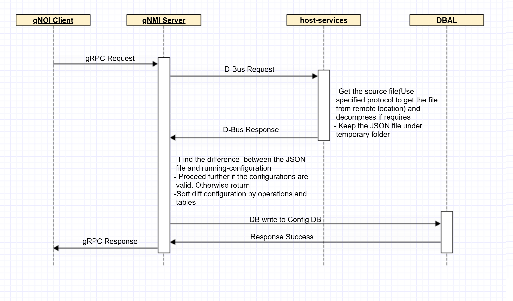

# Config Replace Operation in gNOI <!-- omit in toc -->

## Table of Content <!-- omit in toc --> 
- [Revision](#revision)
- [Scope](#scope)
- [Definitions/Abbreviations](#abbreviations)
- [1 Overview](#1-overview)
- [2 Requirements](#2-requirements)
  - [2.1 Functional Requirements](#21-functional-requirements)
  - [2.2 CLI Requirements](#22-cli-requirements)
- [3 Architecture Design](#3-architecture-design)
- [4 High level design](#4-high-level-design)
- [5 SAI API](#5-sai-api)
- [6 Configuration and management](#6-configuration-and-management)
  - [6.1 Manifest (if the feature is an Application Extension)](#61-manifest-(if-the-feature-is-an-application-extension))
  - [6.2 CLI/YANG model Enhancements](#62-cli/yang-model-enhancements)
  - [6.3 Config DB Enhancements](#63-config-db-enhancements)
- [7 Warmboot and Fastboot Design Impact](#7-warmboot-and-fastboot-design-impact)
- [8 Memory Consumption](#8-memory-consumption)
- [9 Restrictions/Limitations](#9-restrictions/limitations)
- [10 Testing Requirements/Design](#10-testing-requirements/design)
  - [10.1 Unit Test cases](#101-unit-test-cases)
  - [10.2 System Test cases](#102-system-test-cases)
- [11 Open/Action items - if any](#11-open/action-items---if-any)
 
## Revision

| Rev | Date       | Author | Change Description |
| --- | ---------- | ------ | ------------------ |
| 0.1 | 03/21/2025 | Karuppiah Dharmaraj | Initial version    |


## Scope

This document outlines the high-level design of supporting Configuration Replacement via gNOI
Initially, Replacement of sFlow and Interface configurations via gNOI will be supported as part of the feature

## Definitions/Abbreviations

### Table 1: Abbreviations
| **Term**                 | **Meaning**                        				|
|--------------------------|--------------------------------------------------------------------|
|CONFIG_DB		   | Redis Configuration database (a.k.a. running-configuration)	|
|CVL 			   | Config Validation Library						|
|DBAL			   | DataBase Abstration Layer						|
|FTP			   | File Transfer Protocol						|
|gNMI			   | gRPC Network Management Interface					|
|gNOI 			   | gRPC Network Operations Interface					|
|HTTP			   | Hyper Text Transfer Protocol					|
|JSON                      | JavaScript Object Notation                                         |
|running-<br>configuration | The configuration controlling the device. a.k.a running-datastore,<br>CONFIG_DB	|
|SCP			   | Secure Copy Protocol								|
|startup-<br>configuration | The configuration that is loaded when the device boots up,<br>typically stored in a persistent datastore |
|USB			   | Universal Serial Bus								|


### 1. Overview 

The Configuration Replacement feature provides the capability to replace the current running configuration, i.e., CONFIG_DB, with a known good configuration file saved in the serialization of DB format, i.e. config_db.json. 
This feature is designed to limit the impact to features/services that are being replaced, with minimum service disruption. 

### 2. Requirements
#### Phase 1: 
- Add YANG constraints and custom validation callbacks in SONIC yang specific to the features
- Config replacement can be requested via gNOI management interfaces. 
- Fail-safe operation - if an error is encountered, an error is reported and it should NOT take any partial config. i.e. transaction aborted without changing CONFIG_DB.
- A syslog message will be generated in case of an error, including the table and attribute information causing the error.
- Copying files to and from local directories and remote locations

  | **Source**                 | **Destination**                        				|
  |--------------------------|--------------------------------------------------------------------|
  |config:<br>coredump:<br>ftp:<br>home:<br>http:<br>log:<br>running-configuration<br>scp:<br>startup-configuration<br>tech-support:<br>usb:<br>	   |config:<br>ftp:<br>home:<br>http:<br>running-configuration<br>scp:<br>startup-configuration<br>usb:<br>	|
- Sorting, validation support for shallow and deep difference between new and current configuration.
- Config replace operation should be performed with minimum disruption to the device, i.e. no container restart or system reboots expected.
- Default configuration, e.g. copp_config.json, not to be saved to a serialized DB file should be preserved in the CONFIG_DB across config replacement operation.
- Media format of intended config files can be a raw json, tar compresses
- A new gNOI operation to perform config replacement.
- CVL enforces YANG model constraints by libyang
  
#### Phase 2: Focus on the infrastructure part as defined below
- Support all sonic yangs imported from sonic-mgmt-yang and implement custom validation where required

### 3. Architecture Design 
There are no changes to the current SONiC Architecture.

### 4. High-Level Design 
A new config replacement component provided by sonic-mgmt-common will be a key implemenation to orchestrate config replace operation requested. host-services module is responsible for getting the JSON file for configuration replacement. It will use below file transfer protocols to get the file from remote location.
* SCP
* FTP
* HTTP

Otherwise, It will get the file from below local space
* config (/etc/sonic)
* home (home directory of respective user)
* USB

If the input file is in compressed format(.tar), It will decompress the file to get the JSON format file. JSON file will be kept under temporary directory.
Config Replacement component loads a desired config file from the temporary directory and compares against CONFIG_DB to generate the diff results tagged with operation, table, keys and fields. The resultant diff data set will be sorted by operation - DELETE, CREATE and UPDATE in this order, and subsequently sorted by table orders learnt from CVL to apply the changes as a single transaction to CVL/DB layer. Just before updating the CONFIG_DB, CVL libyang makes sure that when and must constraints are validated. Additional ad-hoc validation will be done if CVL custom validation callbacks are mentioned in sonic-yang file

The ordering for target tables requested for gNOI path is ensured by table dependencies within a YANG module and across SONiC YANG modules to sort all tables during the diff operation.
		
The below diagram explains the sequence when configuration replacement is executed

	
 __Figure 1: Configuration Replace__

### 5. SAI API 
No change in SAI API.

### 6. Configuration and management 

#### 6.1. Manifest (if the feature is an Application Extension)
None

#### 6.2. CLI/YANG model Enhancements 

```python
module: openconfig-file-mgmt-private

  rpcs:
    +---x copy
       +---w input
       |  +---w source?            filename-uri-type
       |  +---w destination?       filename-uri-type
       |  +---w (operation)?       enumeration
       +--ro output
          +--ro status?          int32
          +--ro status-detail?   string
```
```python
YANG file: openconfig-file-mgmt-private.yang
    typedef filename-uri-type {
    	type union {
            type enumeration {
            	enum "running-configuration";
            	enum "startup-configuration";
            }
            type string {
            	pattern "((config|coredump|home|tech-support|ftp|http|scp|log):.*)";
            }
    	}
    }
    rpc copy {
        description
            "This procedure is used to copy a file from an external server to the switch, or from the switch to an external server.";
        input {
            leaf source {
                type filename-uri-type;
                description "Provide the filename in URI format for the source file.";
            }

            leaf destination {
                type filename-uri-type;
                description "Provide the filename in URI format for the destination file.";
            }

            leaf copy-config-option {
               description
                  "The copy config options applicable only when destination is running-configuration";
               type enumeration {
                  enum MERGE {
                     description
                        "The new configuration is merged to the running, i.e. 'config load'";
                  }
                  enum OVERWRITE {
                     description
                        "The new configuration is imported after all the services stop/restart, i.e. 'config reload'";
                  }
                  enum REPLACE {
                     description
                        "The new configuration replace the current running without the services stop/restart";
                  }
               }
            }
        }

        output {
            leaf status {
                type int32;
                description "The status of the operation execution request.";
            }
            leaf status-detail {
                type string;
                description "The detailed status of the operation execution request.";
            }
        }
    }
```
#### 6.3. Config DB Enhancements  
No Config DB enhancement is done for this feature	

### 7. Warmboot and Fastboot Design Impact  
This feature doesnt impact warmboot/fastboot. 

### 8. Memory Consumption
No memory consumption is expected when the feature is used

### 9. Restrictions/Limitations  
Config Replacement won't be supported in click-cli

### 10. Testing Requirements/Design  
None

#### 10.1. Unit Test cases  
|               **Test Cases**            |
| ---------------------------------------|
|Verify the new confgiuration sflow enable, sample-rate, sample-rate using gNOI configuration replace|
|Verify the modification of the configuration for sFlow enablement and sample rate using gNOI configuration replace|
|Verify the unconfiguration for sFlow enablement and sample rate using gNOI configuration replace|
|Verify the new Vlan creation, assignment of IPv4 address using gNOI configuration replace|
|Verify the modification of the IPv4 address on Vlan interface using gNOI configuration replace|
|Verify the unconfiguration of the Vlan using gNOI configuration replace|
|Verify copying a file from a remote location to home: via SCP using gNOI|
|Verify copying a file from a remote location to config: via FTP using gNOI|
|Verify copying a file from a remote location to startup-configuration via HTTP using gNOI|
|Verify copying a file from coredump: to a remote location via SCP using gNOI|
|Verify copying a file from log: to a remote location via FTP using gNOI|
|Verify copying a file from techsupport: to a remote location via HTTP using gNOI|

#### 10.2. System Test cases
None

### 11. Open/Action items - if any 
None
	
