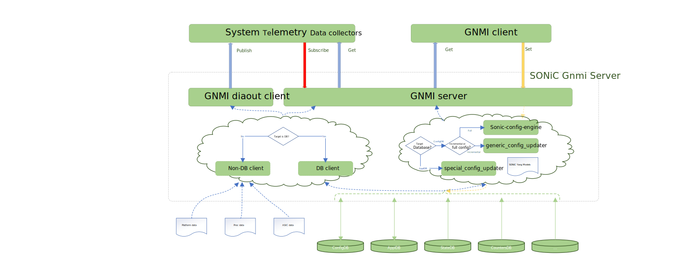

# SONiC GNMI Server Interface Design

# High Level Design Document

#### Rev 0.1

# Table of Contents
- [Table of Contents](#table-of-contents)
- [List of Tables](#list-of-tables)
- [Revision](#revision)
- [About this Document](#about-this-document)
- [Scope](#scope)
- [Definition/Abbreviation](#definitionabbreviation)
- [1 Feature Overview](#1-feature-overview)
  * [1.1 Requirements](#11-requirements)
  * [1.2 Design Overview](#12-design-overview)
- [2 Error Handling](#2-error-handling)
- [3 Serviceability and Debug](#3-serviceability-and-debug)
- [4 Unit Tests](#4-unit-tests)
  * [4.1 Unit Tests for Capabilities RPC](#41-unit-tests-for-capabilities-rpc)
  * [4.2 Unit Tests for Get RPC](#42-unit-tests-for-get-rpc)
  * [4.3 Unit Tests for Set RPC](#43-unit-tests-for-set-rpc)

# List of Tables
[Table 1: Abbreviations](#table-1-abbreviations)

[Table 2: Mapping Operations](#table-2-mapping-operations)

[Table 3: Translate Example](#table-3-translate-example)

# Revision

| Rev | Date        | Author             | Change Description  |
|:---:|:-----------:|:------------------:|---------------------|
| 0.1  | 05/05/2022 | Gang Lv    | Initial version     |

# About this Document
This document provides a detailed description on the strategy to implement the SONiC GNMI Server Interface.

# Scope
This document describes the high level design of SONiC GNMI Server Interface. 

This document provides minor implementation details about the proposed solutions.

# Definition/Abbreviation

### Table 1: Abbreviations
| **Term** | **Meaning**                |
| -------- | -------------------------- |
| gRPC     | A modern open-source high performance Remote Procedure Call (RPC) framework that can run in any environment |
| gNMI     | gRPC Network Management Interface, used to retrieve or manipulate the state of a device via telemetry or configuration data |
| gNOI     | gRPC Network Operations Interface |
| JSON     | JavaScript Object Notation |
| Yang     | Yet Another Next Generation, it is a modular language representing data structures in an XML tree format |
| Generic Config Updater | SONiC configuration generic update and rollback feature |
| ConfigDB | Configuration Database |
| ApplDB | Application Database |

# 1 Feature Overview

SONiC should provide a gNMI/gNOI server interface where the client can communicate with SONiC (server) through the interface using their respective gRPC libraries based on ConfigDB/ApplDB/StateDB/CountersDB schema or SONiC Yang schema.

To understand the requirements, we need to go over current SONiC management components:

* SONIC CLI commands

1. Users could use SONiC CLI command "show runningconfig all" to read current configuration. 
    - The blue arrow indicates this process.
2. User could use SONiC CLI command "config apply-patch" to incrementally update configurations systematically and validate target configuration using SONiC Yang models. With generic_config_updater, all operations in a 'config apply-patch' command are processed in a single transaction that will either succeed or fail as a whole.
    - "config apply-patch" supports ConfigDB, and Yang models.
    - The green arrow indicates this process, and dotted arrow indicates Yang validation.
3. SONiC CLI commands can use "config reload" to erase original and fully reload configurations from a file and validate target configuration using SONiC Yang models.
    - "config reload" already support input in ConfigDB schema or in yang models schema.
    - The yellow arrow indicates this process, and dotted arrow indicates Yang validation.

And we have the possibility to improve generic_config_updater performance.

* SONIC Restapi

sonic-restapi is a docker container running in SONiC, which exposes HTTPS endpoints to perform dynamic configuration including config VNET routes.
One challenge of sonic-restapi is to provide a general config schema. Currently its API is designed case by case.

sonic-restapi will be replaced by gNMI interface in the future.

* SONiC system telemetry services

sonic-telemetry provides gNMI/gNOI server interface. And sonic-telemetry provides only telemetry via gRPC, and the gap is configuration.

We will update sonic-telemetry to support configuration.

## 1.1 Requirements

### 1.1.1 Phase 1 Requirements
* Set and get RPCs must be supported. Customer will use get RPC to retrieve configurations including FRR and VNET route, and use set RPC to apply new configurations.
* SetRequest message must support to incrementally update configuration and fully update configurations.
* Data models can be SONiC Yang models or CONFIG_DB schema.
* Ability to read different DBs - ApplDB, ConfigDB, StateDB, CountersDB etc.
* Ability to write different DBs - ApplDB, ConfigDB.
* Configurations must be verified using YANG models even it is in CONFIG_DB schema.
* Need to configure huge VNET route entries to ApplDB, with high speed.
* Configurations for ConfigDB must be persisted after a device restart.
* Need to support multi-ASIC platform.
* Ability to support bulk set-get operations.
* Must follow gnmi-specification.
    * All changes to the state of the target that are included in an individual SetRequest message are considered part of a transaction.
    * Within an individual transaction (SetRequest) the order of operations is 'delete', 'replace', 'update'.
    * If a single path is in multiple operations in one SetRequest (i.e., within 'update' or 'replace'), then the state of the target MUST reflect the application of all the operations in order, even if they overwrite each other.
    * The session between the client and server MUST be encrypted using TLS.
    * New connections are mutually authenticated.

### 1.1.2 Phase 2 Requirements
* Support authentication and authorization with TACACS+ server.
* Upgrade operation will be provided with GNOI.

## 1.2	Design Overview

We will update sonic-telemetry to support configuration in the same container.

And there will be a config files for disable/enable telemetry/new-gnmi feature.

### 1.2.1 Basic Approach

#### 1.2.1.1 Transaction

* Rollback

Generic_config_updater provides rollback mechanism, and we can use it to implement transaction for CONIFG_DB.

Currently we do not support rollback for ApplDB, therefore VNET route will be an exception for rollback. Client could make decision based on SetResponse and use more SetRequest(s) to achieve rollback behavior.

* Set

Since a single SetRequest will be treated as a transaction, gNMI server does not support parallel write operations. We will put the SetRequests in a queue and serve them with a single worker.

* Get

Every set RPC will create a checkpoint of running configuration before any modification and remove this checkpoint after all the modifications.

Get RPC during write period should use checkpoint, and normally Get RPC will directly fetch ConfigDB.

#### 1.2.1.2 Yang Validation

For ConfigDB, and input is SONiC Yang models schema, sonic-config-engine and generic_config_updater will run Yang validation.

For ConfigDB, and input is ConfigDB schema, generic_config_updater will run Yang validation. And sonic-config-engine does not run Yang validation today if input is in config_db schema, and it will run Yang validation in future release.

For ApplDB, we will create Yang models based on requirement. Today we only need to config VNET routes in ApplDB. We will leverage Yang validation or implement specialized validation logic for optimal performance.

#### 1.2.1.3 Data Schema

The ultimate goal is to use SONiC Yang models for configuration, and we also need to support ConfigDB schema and ApplDB schema:

* We will follow OpenConfig specification to use origin field to support mixed schema.

* And we use the first element to specify the target database.

A single request cannot have both SONiC YANG paths and ConfigDB/ApplDB schema paths. 

1. Stage 1: SONiC DB Schema

At stage 1, we will only support SONiC DB schema.

- If origin is ‘sonic_db’ or NULL, and target is ‘CONFIG_DB’, SetRequest and GetRequest will use CONFIG_DB schema, and sonic_config_engine or generic_config_engine will be invoked.
- If origin is ‘sonic_db’ or NULL, and target is ‘APPL_DB’, and table name is "VNET_ROUTE_TABLE", SetRequest and GetRequest will be used to access VNET route entry, and special_config_updater will be invoked.

2. Stage 2: SONiC Yang Schema

At stage 2, we will support SONiC Yang schema.

* If origin is ‘sonic_yang’ and target is ‘APPL_DB’, request will use SONiC Yang models schema, and special_config_updater will be invoked.
* If origin is ‘sonic_yang’ and target is 'CONFIG_DB' or NULL, request will use SONiC Yang models schema, and sonic_config_engine or generic_config_engine will be invoked.

Assume running-config to be:

    {
        "DEVICE_NEIGHBOR": {
            "Ethernet8": {
              "name": "Servers1",
                "port": "eth0"
            },
            "Ethernet96": {
                "name": "Servers23",
                "port": "eth0"
            },
        },
    }

And then perform the actions below:
* replace port under Ethernet8 with eth1
* remove Ethernet96

The steps would be:
1. Get the running configuration

With CONFIG_DB schema:

    ++++++++ Sending get request: ++++++++
    path {
        elem {name: "CONFIG_DB"} elem {name: "DEVICE_NEIGHBOR"}
    }
    encoding: JSON_IETF
    ++++++++ Recevied get response: ++++++++
    notification {
        update {
            path {
                origin: "sonic_db"
                elem {name: "CONFIG_DB"} elem {name: "DEVICE_NEIGHBOR"} elem {name: "Ethernet8"}
            }
            val {
                json_ietf_val: "{\"name\": \"Servers1\",\"port\": \"eth0\"}"
            }
        }
        update {
            path {
                origin: "sonic_db"
                elem {name: "CONFIG_DB"} elem {name: "DEVICE_NEIGHBOR"} elem {name: "Ethernet96"}
            }
            val {
                json_ietf_val: "{\"name\": \"Servers23\",\"port\": \"eth0\"}"
            }
        }
    }

With CONFIG_YANG schema:

    ++++++++ Sending get request: ++++++++
    path {
        origin: "sonic_yang"
        elem {name: "CONFIG_DB"} elem {name: "sonic-device_neighbor:sonic-device_neighbor"}
    }
    encoding: JSON_IETF
    ++++++++ Recevied get response: ++++++++
    notification {
        update {
            path {
                origin: "sonic_yang"
                elem {name: "CONFIG_DB"} elem {name: "sonic-device_neighbor:sonic-device_neighbor"} elem {name: "sonic-device_neighbor:DEVICE_NEIGHBOR"} elem {name: "DEVICE_NEIGHBOR_LIST" key {key: "name" value: "Ethernet8"}}
            }
            val {
                json_ietf_val: "{\"name\": \"Servers1\",\"port\": \"eth0\"}"
            }
        }
        update {
            path {
                origin: "sonic_yang"
                elem {name: "CONFIG_DB"} elem {name: "sonic-device_neighbor:sonic-device_neighbor"} elem {name: "sonic-device_neighbor:DEVICE_NEIGHBOR"} elem {name: "DEVICE_NEIGHBOR_LIST" key {key: "name" value: "Ethernet96"}}
            }
            val {
                json_ietf_val: "{\"name\": \"Servers23\",\"port\": \"eth0\"}"
            }
        }
    }

2. Apply the new configuration

With CONFIG_DB schema:

    ++++++++ Sending set request: ++++++++
    replace {
        path {
            origin: "sonic_db"
            elem {name: "CONFIG_DB"} elem {name: "DEVICE_NEIGHBOR"}  elem {name: "Ethernet96"}
        }
    }
    replace {
        path {
            origin: "sonic_db"
            elem {name: "CONFIG_DB"} elem {name: "DEVICE_NEIGHBOR"} elem {name: "Ethernet8"} elem {name: "port"}
        }
        val {
            json_ietf_val: "eth1"
        }
    }
    ++++++++ Recevied set response: ++++++++
    response {
        path {
            origin: "sonic_db"
            elem {name: "CONFIG_DB"} elem {name: "DEVICE_NEIGHBOR"} elem {name: "Ethernet96"}
        }
        op: REPLACE
    }
    response {
        path {
            origin: "sonic_db"
            elem {name: "CONFIG_DB"} elem {name: "DEVICE_NEIGHBOR"} elem {name: "Ethernet8"} elem {name: "port"}
        }
        op: REPLACE
    }

With CONFIG_YANG schema:

    ++++++++ Sending set request: ++++++++
    replace {
        path {
            origin: "sonic_yang"
            elem {name: "CONFIG_DB"} elem {name: "sonic-device_neighbor:sonic-device_neighbor"} elem {name: "sonic-device_neighbor:DEVICE_NEIGHBOR"} elem {name: "DEVICE_NEIGHBOR_LIST" key {key: "name" value: "Ethernet96"}}
        }
    }
    replace {
        path {
            origin: "sonic_yang"
            elem {name: "CONFIG_DB"} elem {name: "sonic-device_neighbor:sonic-device_neighbor"} elem {name: "sonic-device_neighbor:DEVICE_NEIGHBOR"} elem {name: "DEVICE_NEIGHBOR_LIST" key {key: "name" value: "Ethernet8"}} elem {name: "port"}
        }
        val {
            json_ietf_val: "eth1"
        }
    }
    ++++++++ Recevied set response: ++++++++
    response {
        path {
            origin: "sonic_yang"
            elem {name: "CONFIG_DB"} elem {name: "sonic-device_neighbor:sonic-device_neighbor"} elem {name: "sonic-device_neighbor:DEVICE_NEIGHBOR"} elem {name: "DEVICE_NEIGHBOR_LIST" key {key: "name" value: "Ethernet96"}}
        }
        op: REPLACE
    }
    response {
        path {
            origin: "sonic_yang"
            elem {name: "CONFIG_DB"} elem {name: "sonic-device_neighbor:sonic-device_neighbor"} elem {name: "sonic-device_neighbor:DEVICE_NEIGHBOR"} elem {name: "DEVICE_NEIGHBOR_LIST" key {key: "name" value: "Ethernet8"}} elem {name: "port"}
        }
        op: REPLACE
    }

#### 1.2.1.4 Incremental Configurations

For incremental configurations, SetRequest can use all kinds of operations, for example, 'replace' operations, 'update' operations and 'delete' operations. And generic_config_updater can guarantee the outcome is correct.

Generic_config_updater is used for incrementally update configurations, and it has two related API:
1. replace, input format is ConfigDB schema.
2. apply-patch, input format is JsonPatch.

SetRequest syntax is not the same as JsonPatch. For example, 'replace' operation can be used to delete a node and update a node, please refer to gnmi specification.

We can translate most of the SetRequest operations directly:

### Table 2: Mapping Operations
| SetRequest Operation | Description | JsonPatch Operation |
|  ----  | ----  | ---- |
| Delete | Where a path is contained within the delete field of the SetRequest message, it should be removed from the target's data tree. | Remove |
| Update | If a particular path-value is specified in the client-supplied data, it is replaced with the client-specified value.  If the path specified does not exist, the target MUST create the data tree element and populate it with the data in the Update message. | Add |
| Replace (delete) | If a particular path-value is NOT specified in the client-supplied data and the path does not have a specified default value in the corresponding schema, it should be deleted. | Remove |
| Replace (update) | If a particular path-value is specified in the client-supplied data, it is replaced with the client-specified value. If the path specified does not exist, the target MUST create the data tree element and populate it with the data in the Update message. | Add |

Below table provides an example to translate from SetRequest to JsonPatch.

### Table 3: Translate Example
| SetRequest Format | JsonPatch Format |
|  ----  | ----  |
| replace { &ensp;path { &ensp;&ensp;elem {name: "CONFIG_DB"} elem {name: "DEVICE_NEIGHBOR"} elem {name: "Ethernet96"} &ensp;} } replace { &ensp;path { &ensp;&ensp;elem {name: "CONFIG_DB"} elem {name: "DEVICE_NEIGHBOR"} elem {name: "Ethernet8"} elem {name: "port"} &ensp;} &ensp;val { json_ietf_val: "eth1" } } | [ &ensp;{ &ensp;&ensp;"op": "remove", "path": "/DEVICE_NEIGHBOR/Ethernet96"},  &ensp;&ensp;{ "op": "add", "path": "/DEVICE_NEIGHBOR/Ethernet8/port", "value": "eth1"} ] |

#### 1.2.1.5 Full Configurations

For full configurations, SetRequest will use one 'delete' operation and one 'update' operation with the root node, and sonic-config-engine is used for fully update configurations.

SetRequest message will be:

    ++++++++ Sending set request: ++++++++
    delete {
        path { origin: "sonic_db" }
    }
    update {
        path { origin: "sonic_db" }
        val {
            json_ietf_val: "{\"DEVICE_NEIGHBOR/Ethernet8/name\":\"Servers1\", \"DEVICE_NEIGHBOR/Ethernet8/port\":\"eth0\", \"DEVICE_NEIGHBOR/Ethernet96/name\":\"Servers23\", \"DEVICE_NEIGHBOR/Ethernet96/port\":\"eth0\", ...}"
        }
    }
    ++++++++ Recevied set response: ++++++++
    response {
        path { origin: "sonic_db" }
        op: DELETE
    }
    response {
        path { origin: "sonic_db" }
        op: UPDATE
    }

#### 1.2.1.6 Configuration Persistence

All successful changes for ConfigDB made through the gNMI SET RPC will be saved to /etc/sonic/config_db.json.

If the target database is not ConfigDB, we can't guarantee persisitence.

#### 1.2.1.7 Heartbeat and Reprogram

For full system reboot, client has to reprogram ApplDB. If the gnmi container restarts, client doesn't need to reprogram.

We propose to use Capabilities RPC as heartbeat to detect reboot, and we will expose reset status.

After reboot, client should check reset status to decide if needs to reprogram.

#### 1.2.1.8 Authentication
sonic-telemetry provides three authentication mechanisms, and we will keep the same mechanism:
* Password: Like HTTP Basic auth, you pass the username and password in the gRPC metadata
* JWT: JSON Web Tokens standard. First you authenticate with username/password and then receive a JWT token. After you send the token in the gRPC metadata.
* User Certificate: Use a valid client certificate with the username embedded in the CN field. The certificate is for authentication, the username is for authorization.

sonic-restapi uses one authentication mechanism:
* In the authentication of client certificate, after the certificate chain is validated by TLS, it will further check if the common name of the end-entity certificate is in the trusted common name list of the server config.

#### 1.2.1.9 ACL
The new GNMI server interface will use CONFIG_DB schema and SONiC Yang Models for ACL configuration.

#### 1.2.1.10 Data Protection

For ApplDB, gNMI clients can write table directly. We need to specify which table can be changed, which one can not.

We will create new Yang models for ApplDB, if gNMI set request modifies a table without Yang models, this set request should be rejected. And we can also use "config false" tag, please refer to [link](https://datatracker.ietf.org/doc/html/rfc7950#section-4.2.3).

#### 1.2.1.11 Docker to Host communication
'config apply-patch' and 'config reload' are designed to run on host, and it's difficult to support them in container:
1. These commands will update redis database and restart container, when they restart gnmi, bgp, syncd and swss, the ongoing gnmi operation will be broken.
2. 'config reload' will stop service at first, run some other operations, and then restart service. If we run this command in container, it will be broken at the stop service step.
3. These commands will execute some host scripts and use systemctl to restart service, it will be dangerous to support these operations in container.
The solution is to add host services for 'config apply-patch' and 'config reload' on host, and gNMI server uses dbus method to invoke these services to update configuration

##### 1.2.1.11.1 Incremental Configurations

For incremental configuration, 'config apply-patch' should not restart gNMI, bgp, synd and swss.

##### 1.2.1.11.2 Full Configurations

For full configuration, there’re 2 possible solutions: 
* gNMI server needs to send response at first, and then invoke 'config reload'.

* Use gNMI request and gNOI request together to implement full configuration update.

The full configuration request will be overwritten by subsequent full configuration request or incremental configuration request.

#### 1.2.1.12 Backward Compatibility

SONiC telemetry is using prefix target to identify target database, and we will add a new target to support mixed schema.

    enum Target {
      option allow_alias = true;
      APPL_DB         = 0;
      ASIC_DB         = 1;
      COUNTERS_DB     = 2;
      LOGLEVEL_DB     = 3;
      CONFIG_DB       = 4;
      // PFC_WD_DB shares the the same db number with FLEX_COUNTER_DB
      PFC_WD_DB       = 5;
      FLEX_COUNTER_DB = 5;
      STATE_DB        = 6;
      // For none-DB data
      OTHERS          = 100;
      // For mixed schema
      MIXED_SCHEMA    = 101;
    }

### 1.2.2 Container

All the introduced features will be part of the sonic-telemetry package installed in sonic-telemetry container.

# 2 Error Handling
supervisord will autorestart gnmi service if it exits after it has successfully started up.

# 3 Serviceability and Debug
All requests logs are stored in syslog.

# 4 Unit Tests

## 4.1 Unit Tests for Capabilities RPC

| Test Case | Description |
| ---- | ---- |
| 1 | Get capability. |

## 4.2 Unit Tests for Get RPC

| Test Case | Description |
| ---- | ---- |
| 1 | Get from CONFIG_DB with SONiC DB schema. |
| 2 | Get from APPL_DB with SONiC DB schema. |
| 3 | Get from CONFIG_DB with SONiC Yang schema. |
| 4 | Get from APPL_DB with SONiC Yang schema. |

## 4.3 Unit Tests for Set RPC

| Test Case | Description |
| ---- | ---- |
| 1 | Delete operation with SONiC DB schema to remove table in CONFIG_DB. |
| 2 | Delete operation with SONiC DB schema to remove table in APPL_DB. |
| 3 | Update operation with SONiC DB schema to create table in CONFIG_DB. |
| 4 | Update operation with SONiC DB schema to create table in APPL_DB. |
| 5 | Update operation with SONiC DB schema to update table in CONFIG_DB. |
| 6 | Update operation with SONiC DB schema to update table in APPL_DB. |
| 7 | Replace operation with SONiC DB schema to remove table in CONFIG_DB. |
| 8 | Replace operation with SONiC DB schema to remove table in APPL_DB. |
| 9 | Replace operation with SONiC DB schema to create table in CONFIG_DB. |
| 10 | Replace operation with SONiC DB schema to create table in APPL_DB. |
| 11 | Replace operation with SONiC DB schema to update table in CONFIG_DB. |
| 12 | Replace operation with SONiC DB schema to update table in APPL_DB. |
| 13 | Verify invalid path with SONiC DB schema in CONFIG_DB. |
| 14 | Verify invalid path with SONiC DB schema in APPL_DB. |
| 15 | Verify full configuration update with SONIC DB schema. |
| 16 | Delete operation with SONiC Yang schema to remove table in CONFIG_DB. |
| 17 | Delete operation with SONiC Yang schema to remove table in APPL_DB. |
| 18 | Update operation with SONiC Yang schema to create table in CONFIG_DB. |
| 19 | Update operation with SONiC Yang schema to create table in APPL_DB. |
| 20 | Update operation with SONiC Yang schema to update table in CONFIG_DB. |
| 21 | Update operation with SONiC Yang schema to update table in APPL_DB. |
| 22 | Replace operation with SONiC Yang schema to remove table in CONFIG_DB. |
| 23 | Replace operation with SONiC Yang schema to remove table in APPL_DB. |
| 24 | Replace operation with SONiC Yang schema to create table in CONFIG_DB. |
| 25 | Replace operation with SONiC Yang schema to create table in APPL_DB. |
| 26 | Replace operation with SONiC Yang schema to update table in CONFIG_DB. |
| 27 | Replace operation with SONiC Yang schema to update table in APPL_DB. |
| 28 | Verify invalid path with SONiC Yang schema in CONFIG_DB. |
| 29 | Verify invalid path with SONiC Yang schema in APPL_DB. |
| 30 | Verify full configuration update with SONIC Yang schema. |

