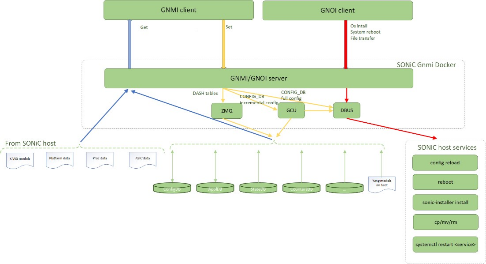
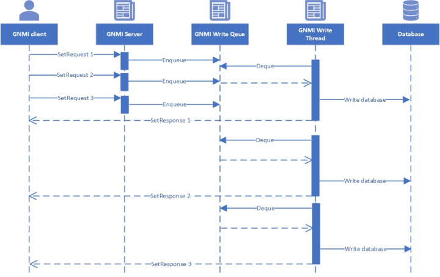
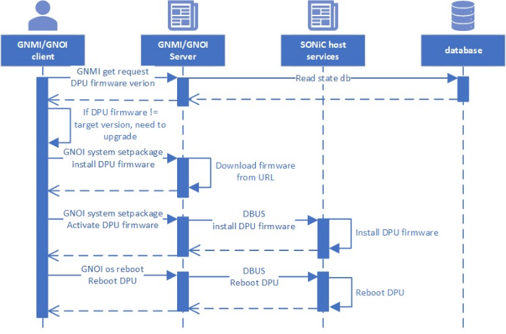
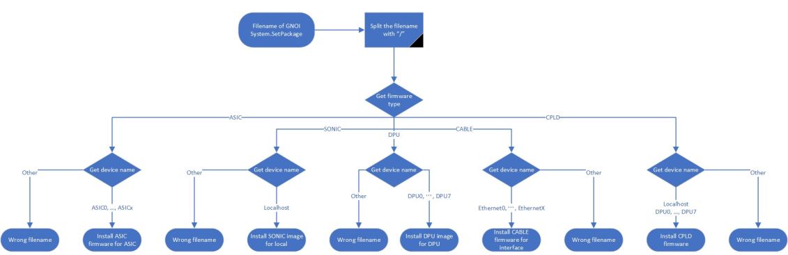

# SONiC GNOI Server Interface Design

# High Level Design Document

#### Rev 0.1

# Table of Contents
- [Table of Contents](#table-of-contents)
- [Revision](#revision)
- [About this Document](#about-this-document)
- [Definition/Abbreviation](#definitionabbreviation)
- [Background](#background)
- [Scope](#scope)
- [1 Project Goal Summary](#1-project-goal-summary)
- [2 Requirements](#2-requirements)
- [3 Architecture Design](#3-architecture-design)
- [4 High Level Design](#4-high-level-design)
- [5 Typical Scenarios](#5-typical-scenarios)
- [6 Testing](#6-testing)


# Revision

| Rev | Date        | Author             | Change Description  |
|:---:|:-----------:|:------------------:|---------------------|
| 0.1  | 03/27/2024 | Isabel Li    | Initial version     |

# About this Document
This document provides a detailed description on the strategy to implement the SONiC GNOI Server Interface.

# Definition/Abbreviation
| **Term** | **Meaning**                |
| -------- | -------------------------- |
| API      | Application Programming Interface |
| CLI      | Command Line Interface |
| gRPC     | A modern open-source high performance Remote Procedure Call (RPC) framework that can run in any environment |
| gNMI     | gRPC Network Management Interface, used to retrieve or manipulate the state of a device via telemetry or configuration data |
| gNOI     | gRPC Network Operations Interface |
| NE       | Network Engineers |

# Background
Software for Open Networking in the Cloud (SONiC) is an open source network operating system (NOS) based on Linux that runs on switches from multiple vendors and ASICs. SONiC offers a full suite of network functionality, like BGP and RDMA, that has been production-hardened in the data centers of some of the largest cloud service providers. 

Currently, most SONiC operation and configuration management requires directly using CLI on the device. This document proposes the addition of gNOI API to SONiC to modernize SONiC operation management. 

# Scope
This document describes the high level design of SONiC gNOI Server Interface. 

GNOI support comes as a natural extension to preexisting gNMI support. GNOI RPCs are exposed on the same port as the gNMI server. For more information regarding gNMI, please refer to the [gNMI HLD](https://github.com/ganglyu/SONiC/blob/012afe049a707da87ac258c8aca5c501172d0f33/doc/mgmt/gnmi/SONiC_GNMI_Server_Interface_Design.md).

## 1 Project Goal Summary
Network engineers (NE) currently rely on command line interfaces (CLI) to operate SONiC devices. We plan to replace CLI by GNOI API, which will help minimize network engineers’ manual touches on SONiC devices.

We plan to use GNOI API to replace the most common NE CLI used for SONiC operation management. These APIs can sit behind a website frontend that NEs interact with directly, which enables NEs to execute common tasks with a simple webpage interaction. This saves time and reduces errors.

## 2 Requirements

Support for commonly used SONiC operation management CLI
* sudo sonic_installer install
* sudo reboot
* sudo systemctl restart <service>

Support for commonly used Linux system management CLI
* mv
* cp
* rm

Support for other commonly used SONiC operations
* cert installation
* firmware upgrade

## 3 Architecture Design

All the introduced features are part of the sonic-telemetry package installed in sonic-telemetry container.

The GNOI/GNMI server uses [DBUS](https://github.com/sonic-net/SONiC/blob/master/doc/mgmt/Docker%20to%20Host%20communication.md) to communicate with the SONiC host services, which are responsible for executing various commands on the device. Some of these commands are "config reload", "reboot", "sonic-installer install", "cp", "mv", and "rm". 




## 4 High Level Design

### 4.1. GNOI RPC API
We need to implement these GNOI APIs to support SONiC operations. 

#### OS.Activate
We can use this API to select the image which will be used after reboot.

Arguments: OS version string to be activated after reboot, Boolean flag to determine whether the reboot process should be initiated immediately after changing the OS version string
```
rpc Activate(ActivateRequest) returns (ActivateResponse);

message ActivateRequest {
  // The version that is required to be activated and optionally immediattely
  // booted.
  string version = 1;
  // For dual Supervisors setting this flag instructs the Target to perform the
  // action on the Standby Supervisor.
  bool standby_supervisor = 2;
  // If set to 'False' the Target will initiate the reboot process immediatelly
  // after changing the next bootable OS version.
  // If set to 'True' a separate action to reboot the Target and start using
  // the activated OS version is required. This action CAN be executing
  // the gNOI.system.Reboot() RPC.
  bool no_reboot = 3;
}

message ActivateResponse {
  oneof response {
    ActivateOK activate_ok = 1;
    ActivateError activate_error = 2;
  }
}

```
#### OS.Verify
We can use this API to verify the running OS version.

Arguments: None
```
rpc Verify(VerifyRequest) returns (VerifyResponse);

message VerifyRequest {
}

message VerifyResponse {
  // The OS version currently running.  This string should match OC path 
  // /system/state/software-version
  string version = 1;
  // Informational message describing fail details of the last boot. This MUST
  // be set when a newly transferred OS fails to boot and the system falls back
  // to the previously running OS version. It MUST be cleared whenever the
  // systems successfully boots the activated OS version.
  string activation_fail_message = 2;

  VerifyStandby verify_standby = 3;
  // Dual Supervisor Targets that require the Install/Activate/Verify process 
  // executed once per supervisor reply with individual_supervisor_install set 
  // to true
  bool individual_supervisor_install = 4;
}
```

#### File.Get
We can use this API to get a file from SONiC device.

Arguments: absolute path string to an existing remote file
```
rpc Get(GetRequest) returns (stream GetResponse) {}

message GetRequest {
  string remote_file = 1;
}

message GetResponse {
  oneof response {
    bytes contents = 1;
    gnoi.types.HashType hash = 2; // hash of the file.
  }
}
```

#### File.Put
We can use this API to put a file to SONiC device. Since File API is verify powerful, we will check client role. Only read-write clients can upload files.

Arguments: absolute path string on target where file should be written, file permissions, contents to be written to target 

```
rpc Put(stream PutRequest) returns (PutResponse) {}

message PutRequest {
  message Details {
    string remote_file = 1;
    // Permissions are represented as the octal format of standard UNIX
    // file permissions.
    // ex. 775: user read/write/execute, group read/write/execute,
    // global read/execute.
    uint32 permissions = 2;
  }
  oneof request {
    Details open = 1;
    bytes contents = 2;
    gnoi.types.HashType hash = 3; // hash of the file.
  }
}

message PutResponse {
}
```

#### File.Stat
We can use this API to get file size, permission etc.

Arguments: path string for which we want to retrieve file(s) info
```
rpc Stat(StatRequest) returns (StatResponse) {}

message StatRequest {
  string path = 1;
}

message StatResponse {
  repeated StatInfo stats = 1;
}
```

#### File.Remove
We can use this API to remove a file from SONiC device. We will check client role, only read-write clients can remove file.

Arguments: path string of file to be removed from target
```
rpc Remove(RemoveRequest) returns (RemoveResponse) {}

// A RemoveRequest specifies a file to be removed from the target.
message RemoveRequest {
  string remote_file = 1;
}

message RemoveResponse {
}
```

#### FactoryReset.Start
We can use this API to clean up all the configurations and decommission device.

Arguments: Booleans to instruct target to rollback to original OS version, zero fill persistent storage state data, and retain certificates
```
rpc Start(StartRequest) returns (StartResponse);

message StartRequest {
  // Instructs the Target to rollback the OS to the same version as it shipped
  // from factory.
  bool factory_os = 1;
  // Instructs the Target to zero fill persistent storage state data.
  bool zero_fill = 2;
  // Instructs the Target to retain certificates
  bool retain_certs = 3;
}

message StartResponse {
  oneof response {
    // Reset will be executed.
    ResetSuccess reset_success = 1;
    // Reset will not be executed.
    ResetError reset_error = 2;
  }
}
```

#### CertificateManagement.Install
We can use this API to install bootstrap certificate.

Arguments: parameters to generate and store new certificates
```
rpc Install(stream InstallCertificateRequest)
    returns (stream InstallCertificateResponse);
// Request messages to install new certificates on the target.

message InstallCertificateRequest {
  // Request Messages.
  oneof install_request {
    GenerateCSRRequest generate_csr = 1;
    LoadCertificateRequest load_certificate = 2;
  }
}

// Response Messages from the target for the InstallCertificateRequest.
message InstallCertificateResponse {
  // Response messages.
  oneof install_response {
    GenerateCSRResponse generated_csr = 1;
    LoadCertificateResponse load_certificate = 2;
  }
}
```

#### System.SetPackage
We can use this API to download an image or package from remote and install this image or package, and we can also use this API to send image from GNOI client to SONiC device.

Arguments: destination path and filename of the package, version of the package, Boolean to indicate whether the package should be made active after receipt on the device, package contents, hash of file contents
```
rpc SetPackage(stream SetPackageRequest) returns (SetPackageResponse) {}

message SetPackageRequest {
  oneof request {
    Package package = 1;
    bytes contents = 2;
    types.HashType hash = 3;    // Verification hash of data.
  }
}

message SetPackageResponse {
}
```

#### System.Reboot
We can use this API to support warm reboot and cold reboot, and restart individual services.

Arguments: type of reboot (cold, warm, etc.), delay before issuing reboot, string describing reason for reboot, option to force reboot if sanity checks fail
```
rpc Reboot(RebootRequest) returns (RebootResponse) {}

message RebootRequest {
  RebootMethod method = 1;
  // Delay in nanoseconds before issuing reboot.
  uint64 delay = 2;
  // Informational reason for the reboot.
  string message = 3;
  // Optional sub-components to reboot.
  repeated types.Path subcomponents = 4;
  // Force reboot if sanity checks fail. (ex. uncommited configuration)
  bool force = 5;
}

message RebootResponse {
}
```
For SONiC cold reboot, we can use COLD method.
For SONiC warm reboot, we can use WARM method.
For SONiC fast reboot, we can use NSF method.
For SONiC config reload, we can use reserved method.

#### System.KillProcess
We can use this API to kill an OS process, and optionally restart.

Arguments: process ID of process to be killed, name of process to be killed, termination signal sent to process (SIGNAL_TERM, SIGNAL_KILL, etc.)
```
rpc KillProcess(KillProcessRequest) returns (KillProcessResponse) {}

message KillProcessRequest {
  // Process ID of the process to be killed.
  uint32 pid = 1;
  // Name of the process to be killed.
  string name = 2;
  // Termination signal sent to the process.
  enum Signal {
    SIGNAL_UNSPECIFIED = 0;  // Invalid default.
    SIGNAL_TERM = 1;         // Terminate the process gracefully.
    SIGNAL_KILL = 2;         // Terminate the process immediately.
    SIGNAL_HUP = 3;          // Reload the process configuration.
    // Terminate the process immediately and dump a core file.
    SIGNAL_ABRT = 4;
  }

  Signal signal = 3;
  // Whether the process should be restarted after termination.
  // This value is ignored when the termination signal is SIGHUP.
  bool restart = 4;
}

message KillProcessResponse {
}
```

#### Containerz.StartContainer
We can use this API to start a SONiC container. Note: a new API needs to be added to support non-containerized service restarts

Arguments: image tag, image name of container to start
```
rpc StartContainer(StartContainerRequest) returns (StartContainerResponse) {}

message StartContainerRequest {
  // The name and tag of the container to start.
  string image_name = 1;
  string tag = 2;
  string cmd = 3;

  // Optional. The name to give the running container. If none is specified,
  // the target should assign one.
  string instance_name = 4;
  message Port {
    uint32 internal = 1;
    uint32 external = 2;
  }

  // List of internal ports to expose outside the container.
  repeated Port ports = 5;

  // Environment to set in the container.
  map<string, string> environment = 6;

  // List of volumes that should be attached to the container.
  repeated Volume volumes = 7;

  // Other container properties will be added as it becomes necessary.
}

message StartContainerResponse {
  oneof response {
    StartOK start_ok = 1;
    StartError start_error = 2;
  }
}

```

#### Containerz.StopContainer
We can use this API to stop or restart a SONiC container.

Arguments: container name, bool force to determine whether the process should be forcibly killed, bool restart to determine if the service should be started immediately after stopping it
```
rpc StopContainer(StopContainerRequest) returns (StopContainerResponse) {}

message StopContainerRequest {
  string instance_name = 1;

  // If force is set, the target should attempt to forcibly kill the container.
  bool force = 2;

  // If restart is set, the target should start the container immediately
  // after stopping it.
  bool restart = 3;
}

message StopContainerResponse {
  enum Code {
    // An unspecified error. The details field should provide more information.
    UNSPECIFIED = 0;

    // Container is busy.
    BUSY = 1;

    // Instance was not found on the target.
    NOT_FOUND = 2;

    // The container was removed.
    SUCCESS = 3;
  }

  Code code = 1;
  string details = 2;
}
```

#### Containerz.Deploy
We can use this API to set a new container image on the target

Arguments: container image name, tag, remote download URL or image file content
```
rpc Deploy(stream DeployRequest) returns (stream DeployResponse) {}

message DeployRequest {
  oneof request {
    ImageTransfer image_transfer = 1;
    bytes content = 2;
    ImageTransferEnd image_transfer_end = 3;
  }
}

message DeployResponse {
  oneof response {
    ImageTransferReady image_transfer_ready = 1;
    ImageTransferProgress image_transfer_progress = 2;
    ImageTransferSuccess image_transfer_success = 3;
    google.rpc.Status image_transfer_error = 4;
  }
}
```

#### Containerz.RemoveContainer
We can use this API to remove an unused container image

Arguments: container image name to be removed, container tag to be removed, force boolean
```
rpc RemoveContainer(RemoveContainerRequest) returns (RemoveContainerResponse) {}

message RemoveContainerRequest {
  // The container image name to be removed.
  string name = 1;

  // The container tag to be removed.
  string tag = 2;

  // If force is set, the target should attempt to forcibly remove the
  // container.
  bool force = 3;
}

message RemoveContainerResponse {
  enum Code {
    // An unspecified error. Must use the detail value to describe the issue.
    UNSPECIFIED = 0;

    // Indicates the image was not found in the remote location.
    NOT_FOUND = 1;

    // Indicates that a container using this image is running.
    RUNNING = 2;

    // The container image was successfully removed.
    SUCCESS = 3;
  }

  Code code = 1;
  string detail = 2;
}
```

Additionally, some [private SONiC APIs](https://github.com/sonic-net/sonic-gnmi/blob/master/proto/gnoi/sonic_gnoi.proto#L11) have been defined: 
```
service SonicService {
  rpc ShowTechsupport (TechsupportRequest) returns (TechsupportResponse) {}
  rpc CopyConfig(CopyConfigRequest) returns (CopyConfigResponse) {}
  rpc ImageInstall(ImageInstallRequest) returns (ImageInstallResponse) {}
  rpc ImageRemove(ImageRemoveRequest) returns (ImageRemoveResponse) {}
  rpc ImageDefault(ImageDefaultRequest) returns (ImageDefaultResponse) {}
}
```
We plan to add support for ShowTechsupport. We also plan to add APIs to support additional use cases:
* #### Start Process
GNOI System.proto defines only KillProcess, which can optionally restart a process. There is not yet an API specific to starting a process.

### 4.2. Authentication

GNMI already supports three authentication mechanisms that are naturally extended to gNOI:
* Basic Authentication - Requires passing of username and password in the gRPC metadata via the username and password keys.
* JSON Web Tokens (JWT) - Requires initial authentication via either basic or certificate authentication using the gNOI Authenticate RPC, afterwhich a token is recieved that can be used with future requests to avoid further authentication. The JWT token is sent in the metadata of the gRPC requests with the access_token key.
* Certificate - A valid client certificate is used with the username embedded in the certificate CN field. This allows the requests to be authenticaed against the CA certificate and the username can be used for authorization.

A GNOI/GNMI server needs to validate the user role before executing any operation. Depending on the user role, the server may allow or deny different types of operations. For example, some users can only run read-only operations, such as get or subscribe, while some users can run read-write operations, such as set or reboot. 

We plan to use CNAME in client certificates to determine user roles. The benefit of this is that there's no dependency on an external service, and GNOI client does not need to provide username and password.
* CNAME is ro.gnmi.sonic.gbl for read-only user
* CNAME is rw.gnmi.sonic.gbl for read-write user.


### 4.3. Parallel Operations
The GNOI/GNMI server accepts concurrent requests. Parallel reads and sequential writes are permitted. 

The GNOI/GNMI server does not support parallel write operations. GNOI/GNMI write requests are placed in a queue and served with a single worker.


### 4.4. Docker to Host Communication
Some commands are designed to run on the host, such as `systemctl restart <service>`, `config apply-patch` and `config reload`. For several reasons, it is difficult to support these operations in a container:
1. These commands update redis database and may restart a container. When they restart gnmi, bgp, syncd, or swss, the ongoing gNOI operation will be broken.
2. 'config reload' will stop services, run some other operations, and then restart services. If we run this command in a container, it will break at the stop service step.
3. These commands will execute some host scripts and use systemctl to restart service, so it would be dangerous to support these operations in a container.
The solution is to add host services for `config apply-patch` and `config reload` on the host. GNOI/GNMI server can then use dbus method to invoke these host services.

## 5 Typical Scenarios
### 5.1. Upgrade DPU Firmware


We need the below steps to upgrade DPU firmware:

* GNMI Get
Read current DPU firmware. If it's not golden firmware, we need to ugprade.
* GNOI System.SetPackage
The SetPackage API downloads DPU firmware from remote host to local filesystem. Filename is used to specify DPU firmware and DPU id, and firmware is not activated by default. The below chart shows possible firmware types and proposed filenames that will be supported by System.SetPackage. This example is for SONiC image running on DPU; the relevant row is the second row, marked with filename SONiC/DPU0/default. 

| Filename                | Version    | Activate | Firmware type              | Proposed file location                               |
|-------------------------|------------|----------|----------------------------|-----------------------------------------------------|
| SONiC/localhost/default | 20230531.10| False    | SONiC image                | /tmp/sonic-20230531.10.bin                          |
| SONiC/DPU0/default      | 20230531.10| False    | SONiC image to run on DPU0 | /usr/share/sonic/dpu/dpu-sonic-20230531.10.bin     |
| DPU/DPU0/default        | 20230531.10| False    | DPU firmware for DPU0      | /usr/share/sonic/dpu/dpu-20230531.10.bin           |
| CABLE/Ethernet0/default | 1.1        | False    | Cable firmware for Ethernet0| /usr/share/sonic/firmware/cable-1.1.bin            |
| ASIC/ASIC0/default      | 1.0        | False    | ASIC firmware for ASIC0    | /usr/share/sonic/asic/asic-1.0.bin                  |
| CPLD/localhost/default  | 1.0        | False    | CPLD firmware for localhost| /usr/share/sonic/cpld/cpld-1.0.bin                 |
| CPLD/DPU0/default       | 1.0        | False    | CPLD firmware for DPU0     | /usr/share/sonic/dpu/cpld/cpld-1.0.bin             |

GNOI API will use the below rules for Filename in System.SetPackage. Each part of filename is split by slash.
1.	The first part is type, it can be SONIC, DPU, CABLE, CPLD and ASIC, we might support other types like CPU microcode.
2.	The second part is device name, it can be DPU0 for DPU, and it can be Ethernet0 or ASIC0-Ethernet1 for cable. It’s possible to have embedded device name, for example, DPU0/Ethernet0.
3.	The last part is default for now, we will use this part for future extension.



* GNOI System.SetPackage
We will use the same GNOI API to activate existing DPU firmware and reboot DPU, activate is True and remote_download is empty for activate operation.

```
// Package defines a single package file to be placed on the target.
message Package {
  // Destination path and filename of the package.
  string filename = 1;
  // Version of the package. (vendor internal name)
  string version = 4;
  // Indicates that the package should be made active after receipt on
  // the device. For system image packages, the new image is expected to
  // be active after a reboot.
  bool activate = 5;
  // Details for the device to download the package from a remote location.
  common.RemoteDownload remote_download = 6;
}

// SetPackageRequest will place the package onto the target and optionally mark
// it as the next bootable image. The initial message must be a package
// message containing the filename and information about the file. Following the
// initial message the contents are then streamed in maximum 64k chunks. The
// final message must be a hash message contains the hash of the file contents.
message SetPackageRequest {
  oneof request {
    Package package = 1;
    bytes contents = 2;
    types.HashType hash = 3;    // Verification hash of data.
  }
}

message SetPackageResponse {
}
```
Note: The OS.Activate API is not suitable for our use case, because it does not have a field to specify the subcomponent that we want to activate.

* GNOI System.Reboot
We can use System.Reboot API to reboot one or more DPU, and the RebootRequest has a subcomponents field that allows us to specify which DPU we want to reboot.
```
message RebootRequest {
  RebootMethod method = 1;
  // Delay in nanoseconds before issuing reboot.
  uint64 delay = 2;
  // Informational reason for the reboot.
  string message = 3;
  // Optional sub-components to reboot.
  repeated types.Path subcomponents = 4;
  // Force reboot if sanity checks fail. (ex. uncommited configuration)
  bool force = 5;
}
message Path {
  string origin = 2;                              // Label to disambiguate path.
  repeated PathElem elem = 3;                     // Elements of the path.
}
message PathElem {
  string name = 1;                    // The name of the element in the path.
  map<string, string> key = 2;        // Map of key (attribute) name to value.
}
```

### 5.2. Upgrade Cable Firmware
We need the below steps to upgrade cable firmware:
* GNMI Get
Read current cable firmware for port from StateDB. If not golden firmware, we need to upgrade.

* GNOI System.SetPackage
Download cable firmware from remote to host file system, file name is used to specify cable firmware and port, and firmware is not activated by default

* GNOI System.SetPackage
We will use the same GNOI API to activate existing cable firmware, activate is True and remote_download is empty for activate operation.


## 6 Testing
(WIP, detailed list pending)
### 6.1. Unit Testing
| Test Case | Description |
| ---- | ---- |
| 1 | UT for OS.Activate |
| 2 | UT for OS.Verify |
| 3 | UT for File.Get |
| 4 | UT for File.Put |
| 5 | UT for File.Stat |
| 6 | UT for File.Remove |
| 7 | UT for FactoryReset.Start |
| 8 | UT for CertificateManagement.Install |
| 9 | UT for System.SetPackage |
| 10 | UT for System.Reboot |
| 11 | UT for Containerz.StartContainer |
| 12 | UT for Containerz.StopContainer |
| 13 | UT for Containerz.Deploy |
| 14 | UT for Containerz.RemoveContainer |
| 15 | UT for System.KillProcess |
| 16 | UT for dbus client initialization |
| 17 | UT for dbus config reload API call |
| 18 | UT for dbus service restart API call |


### 6.2. E2E Testing
E2E tests will be added to [sonic-mgmt](https://github.com/sonic-net/sonic-mgmt.git)
| Test Case | Description |
| ---- | ---- |
| 1 | E2E test for OS.Activate |
| 2 | E2E test for OS.Verify |
| 3 | E2E test for File.Get |
| 4 | E2E test for File.Put |
| 5 | E2E test for File.Stat |
| 6 | E2E test for File.Remove |
| 7 | E2E test for FactoryReset.Start |
| 8 | E2E test for CertificateManagement.Install |
| 9 | E2E test for System.SetPackage |
| 10 | E2E test for System.Reboot |
| 11 | E2E test for Containerz.StartContainer |
| 12 | E2E test for Containerz.StopContainer |
| 13 | E2E test for Containerz.Deploy |
| 14 | E2E test for Containerz.RemoveContainer |
| 15 | E2E test for System.KillProcess |
| 16 | E2E test to verify that required gNOI/gNMI parameters are in ConfigDB (certs, port) |