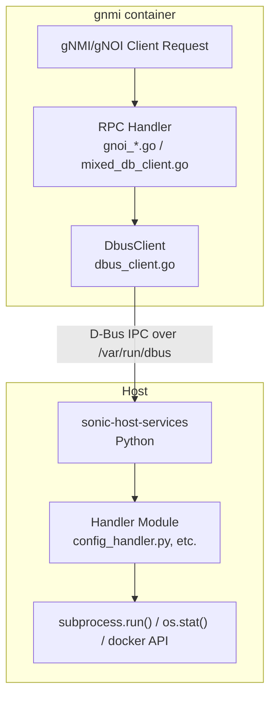
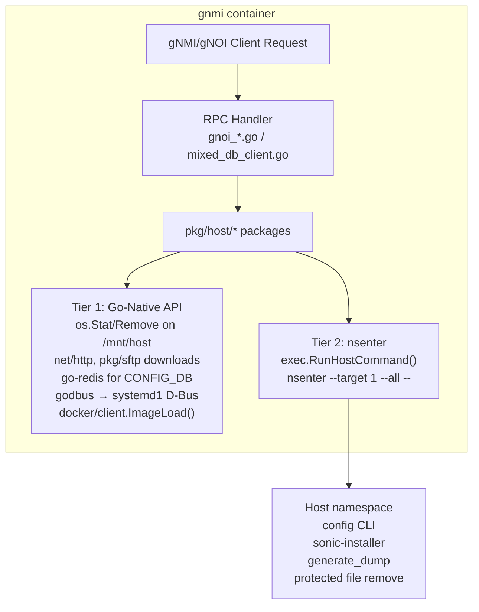

# Eliminate D-Bus Host Service Dependency from sonic-gnmi

# High Level Design Document

#### Rev 0.1

## Table of Contents
- [Table of Contents](#table-of-contents)
- [Revision](#revision)
- [Scope](#scope)
- [Definitions/Abbreviations](#definitionsabbreviations)
- [Overview](#overview)
- [Requirements](#requirements)
- [Architecture Design](#architecture-design)
- [High-Level Design](#high-level-design)
  - [Tier 1: Go-Native API Replacement](#tier-1-go-native-api-replacement)
  - [Tier 2: nsenter for SONiC CLI Tools](#tier-2-nsenter-for-sonic-cli-tools)
  - [Implementation Architecture](#implementation-architecture)
  - [Migration Strategy](#migration-strategy)
  - [Container Configuration Changes](#container-configuration-changes)
- [SAI API](#sai-api)
- [Warmboot and Fastboot Design Impact](#warmboot-and-fastboot-design-impact)
- [Restrictions/Limitations](#restrictionslimitations)
- [Testing Requirements/Design](#testing-requirementsdesign)
- [Open/Action Items](#openaction-items)

### Revision

| Rev  | Rev Date   | Author(s)          | Change Description |
|------|------------|--------------------|--------------------|
| v0.1 | 03/13/2026 | Dawei Huang        | Initial version    |

## Scope

This document describes the high level design for eliminating the D-Bus dependency between the sonic-gnmi container and the sonic-host-services process. Today, sonic-gnmi delegates 23 operations to sonic-host-services through D-Bus IPC. This design replaces that indirection with a two-tier approach: Go-native API calls (including Docker Go SDK) for operations that can be expressed as Go library calls, and `nsenter` host command execution for SONiC-specific CLI tools that are impractical to reimplement.

This design supersedes the Docker to Host D-Bus communication path described in the [Docker to Host communication HLD](https://github.com/sonic-net/SONiC/blob/master/doc/mgmt/Docker%20to%20Host%20communication.md) as it pertains to the gnmi container. Other containers that use D-Bus to host-services are not affected.

## Definitions/Abbreviations

| Term | Meaning |
|---|---|
| D-Bus | Desktop Bus — Linux IPC mechanism used for container-to-host communication |
| gNMI | gRPC Network Management Interface |
| gNOI | gRPC Network Operations Interface |
| nsenter | Linux utility to enter namespaces of another process |
| GCU | Generic Config Updater — SONiC config patching framework |
| FE | Frontend (gNMI/gNOI server handler in sonic-gnmi) |
| BE | Backend (operation execution layer) |

## Overview

The current SONiC architecture uses D-Bus as an IPC mechanism between the gnmi container and sonic-host-services running on the host. The gnmi container's gNMI Set and gNOI RPC handlers invoke D-Bus methods on `org.SONiC.HostService.*` interfaces, which are handled by Python modules in sonic-host-services that then execute the actual operations (shell commands, Redis writes, file I/O, etc.).

This indirection is unnecessary because:

1. **The gnmi container already has host-level access.** It runs with `--pid=host`, `SYS_ADMIN`, `SYS_PTRACE`, `SYS_BOOT`, `DAC_OVERRIDE`, unconfined AppArmor/seccomp, and the host filesystem mounted at `/mnt/host`. It already uses `nsenter` for gNOI reboot and show commands.

2. **D-Bus adds complexity without security benefit.** The container can already execute any host command via `nsenter --target 1`. The D-Bus path through host-services is a middleman that adds IPC latency, a failure domain (host-services must be running), and debugging complexity.

3. **sonic-host-services is single-threaded and blocks on subprocesses.** The service runs a GLib main loop (`GObject.MainLoop`) with `dbus-python` bindings. D-Bus method handlers execute synchronously on the main loop — a long-running `subprocess.run()` (e.g., `sonic-installer install`, `generate_dump`, `config apply-patch`) blocks the entire service, preventing all other D-Bus method calls from being dispatched until it completes. Only `reboot` and `gnoi_reset` spawn background threads; the remaining 10 modules (including all config, image, file, and debug operations) block the main loop directly. This means a single slow operation (image install can take minutes) stalls all concurrent gNMI/gNOI requests that route through host-services.

4. **KubeSonic portability.** In KubeSonic deployments, the gnmi container is shipped independently and may run against older host OS versions where sonic-host-services has a different (or missing) set of D-Bus modules. Operations that depend on host-services D-Bus interfaces will silently lose support. Eliminating the dependency allows the gnmi container to be self-contained and version-independent.

5. **Many operations can use Go-native APIs.** Instead of D-Bus → Python → `subprocess.run("systemctl restart ...")`, the gnmi container can call the systemd D-Bus interface directly via the already-present `godbus/dbus/v5` library. Similarly for file I/O, HTTP downloads, and Redis access.

## Requirements

### Functional Requirements

- All 23 D-Bus operations currently used by sonic-gnmi must continue to function with identical behavior after migration.
- New implementations live in domain packages under `pkg/host/`. Each gRPC handler is migrated independently, replacing `sonic_service_client` calls directly.
- Whitelists currently enforced by sonic-host-services (allowed systemd services, Docker containers/images) must be ported to Go and enforced identically.

### Non-Functional Requirements

- No additional container privileges beyond what is already granted (the existing capabilities are sufficient).
- The gnmi container must not depend on sonic-host-services being running for any of its operations.
- Error messages returned to gNMI/gNOI clients must remain equivalent.

## Architecture Design

### Current Architecture (D-Bus)



### Proposed Architecture (Direct)



The key architectural change is removing the sonic-host-services process as an intermediary. The gnmi container directly performs operations using the access it already has.

## High-Level Design

### Tier 1: Go-Native API Replacement

These 14 operations are replaced with pure Go implementations — no subprocess, no nsenter. This is the cleanest tier: type-safe, no output parsing, no process spawning.

#### 1.1 Systemd Service Control

**Current path:** D-Bus → host-services → `subprocess.run(["systemctl", "restart", service])` → systemd

**New path:** `godbus/dbus/v5` → `org.freedesktop.systemd1.Manager.RestartUnit()` directly

The gnmi container already has `/var/run/dbus` mounted rw. The systemd D-Bus interface (`org.freedesktop.systemd1`) is accessible on the same system bus. Instead of routing through host-services as a proxy, we call systemd directly.

```go
// pkg/host/systemd/systemd.go
func (m *Manager) RestartUnit(service string) error {
    if !allowedServices[service] {
        return fmt.Errorf("service %q not in whitelist", service)
    }
    obj := m.conn.Object("org.freedesktop.systemd1",
        "/org/freedesktop/systemd1")
    // Reset failed state first (mirrors host-services behavior)
    obj.Call("org.freedesktop.systemd1.Manager.ResetFailedUnit", 0,
        service+".service")
    call := obj.Call("org.freedesktop.systemd1.Manager.RestartUnit", 0,
        service+".service", "replace")
    return call.Err
}
```

**Whitelist** (ported from `host_modules/systemd_service.py`):
```go
var allowedSystemdServices = map[string]bool{
    "snmp": true, "swss": true, "dhcp_relay": true, "radv": true,
    "restapi": true, "lldp": true, "sshd": true, "pmon": true,
    "rsyslog": true, "telemetry": true,
}
```

| Operation | D-Bus Method | Go Replacement |
|---|---|---|
| RestartService | `systemd.restart_service` | `systemd1.Manager.RestartUnit` via godbus |
| StopService | `systemd.stop_service` | `systemd1.Manager.StopUnit` via godbus |

#### 1.2 File Operations

**Current path:** D-Bus → host-services → Python `os.stat()` / `os.remove()` / `paramiko`

**New path:** Go `os` package on `/mnt/host` paths, Go `net/http` and `pkg/sftp` for downloads

The host filesystem is mounted at `/mnt/host` (read-only), with `/tmp` and `/var/tmp` mounted read-write. File stat operations can read from `/mnt/host` directly. File removal and downloads target writable paths.

```go
// pkg/host/file/file.go
func Stat(path string) (map[string]string, error) {
    hostPath := filepath.Join("/mnt/host", path)
    info, err := os.Stat(hostPath)
    if err != nil {
        return nil, err
    }
    return map[string]string{
        "last_modified": fmt.Sprintf("%d", info.ModTime().UnixNano()),
        "permissions":   fmt.Sprintf("%o", info.Mode().Perm()),
        "size":          fmt.Sprintf("%d", info.Size()),
    }, nil
}
```

For SFTP/SCP downloads, the `golang.org/x/crypto/ssh` package (already in go.mod) combined with `github.com/pkg/sftp` (to be added) provides a native Go implementation.

| Operation | D-Bus Method | Go Replacement |
|---|---|---|
| GetFileStat | `file.get_file_stat` | `os.Stat()` on `/mnt/host` path |
| RemoveFile | `file.remove` | `os.Remove()` on writable paths; nsenter fallback for others |
| DownloadFile (HTTP) | `file.download` | `net/http` client with streaming write |
| DownloadFile (SFTP) | `file.download` | `x/crypto/ssh` + `pkg/sftp` |
| DownloadImage | `image_service.download` | `net/http` client |
| Checksum | `image_service.checksum` | `crypto/sha256` / `crypto/sha512` |

#### 1.3 Config Save and Checkpoint Operations

**Current path:** D-Bus → host-services → `subprocess.run(["config", "save"])` → `sonic-cfggen -d --print-data > /etc/sonic/config_db.json`

**New path:** `go-redis/v9` reads CONFIG_DB → JSON serialization → file write

The `config save` operation ultimately reads all keys from CONFIG_DB (Redis DB 4) and writes them as JSON to a file. The `go-redis/v9` client (already in go.mod) can perform this directly. Checkpoint create/delete are the same pattern — dump CONFIG_DB to a JSON file, or delete the file.

| Operation | D-Bus Method | Go Replacement |
|---|---|---|
| ConfigSave | `config.save` | `go-redis` CONFIG_DB dump → JSON → file write |
| CreateCheckPoint | `gcu.create_checkpoint` | `go-redis` CONFIG_DB dump → JSON → checkpoint file |
| DeleteCheckPoint | `gcu.delete_checkpoint` | `os.Remove()` checkpoint file |

#### 1.4 Health Operations

| Operation | D-Bus Method | Go Replacement |
|---|---|---|
| HealthzCheck | `debug_info.check` | Return constant `"Artifact ready"` — no host access needed |
| HealthzAck | `debug_info.ack` | `os.Remove("/mnt/host/tmp/dump/" + artifact)` |

#### 1.5 Docker Image Load

**Current path:** D-Bus → host-services → `subprocess.run(["docker", "load", "-i", path])`

**New path:** Docker Go SDK `client.ImageLoad()` via `/var/run/docker.sock`

This is a Go SDK call — same pattern as godbus for systemd or go-redis for CONFIG_DB. The only infrastructure prerequisite is mounting `/var/run/docker.sock` into the container, which is a one-line change in `docker-gnmi.mk` and a marginal privilege increase given the container's existing access level.

```go
// pkg/host/image/docker.go
func LoadDocker(imagePath string, cli *docker.Client) error {
    f, err := os.Open(filepath.Join("/mnt/host", imagePath))
    if err != nil {
        return err
    }
    defer f.Close()
    resp, err := cli.ImageLoad(context.Background(), f, true)
    if err != nil {
        return err
    }
    defer resp.Body.Close()
    io.Copy(io.Discard, resp.Body)
    return nil
}
```

| Operation | D-Bus Method | Go Replacement |
|---|---|---|
| LoadDockerImage | `docker_service.load` | `docker/client.ImageLoad()` via Docker Go SDK |

### Tier 2: nsenter for SONiC CLI Tools

These 9 operations wrap complex SONiC-specific Python tooling (config CLI, sonic-installer, generate_dump) that would be impractical and risky to reimplement in Go, or require host namespace access for protected file operations. The operations are executed via `exec.RunHostCommand()`, which is already used in production by gNOI reboot and show commands.

`RunHostCommand()` (defined in `pkg/exec/command.go`) enters all host namespaces via nsenter:
```
nsenter --target 1 --pid --mount --uts --ipc --net -- <command>
```

#### 2.1 Configuration CLI Operations

These operations require the full `config` CLI toolchain which involves YANG validation, GenericUpdater orchestration, CONFIG_DB flush/reload, service restart coordination, and database migration.

| Operation | D-Bus Method | nsenter Command |
|---|---|---|
| ConfigReload | `config.reload` | `config reload -y [file]` |
| ConfigReplace | `gcu.replace_db` | `config replace <file>` |
| ApplyPatchDb | `gcu.apply_patch_db` | `config apply-patch -f CONFIGDB <file>` |
| ApplyPatchYang | `gcu.apply_patch_yang` | `config apply-patch <file>` |

```go
// pkg/host/config/reload.go
func (s *Service) Reload(fileName string) error {
    args := []string{"reload", "-y"}
    if fileName != "" {
        args = append(args, fileName)
    }
    result, err := s.hostExec.RunHostCommand(ctx, "config", args,
        &exec.Options{Timeout: 120 * time.Second})
    if err != nil {
        return err
    }
    if result.ExitCode != 0 {
        return fmt.Errorf("config reload failed (exit %d): %s",
            result.ExitCode, result.Stderr)
    }
    return nil
}
```

#### 2.2 Image Management Operations

These operations require `sonic-installer` which handles bootloader detection (GRUB/UBOOT), squashfs extraction, GRUB config generation, package migration, and secure boot verification.

| Operation | D-Bus Method | nsenter Command |
|---|---|---|
| InstallImage | `image_service.install` | `sonic-installer install -y <path>` |
| ListImages | `image_service.list_images` | `sonic-installer list` |
| SetNextBoot | `image_service.set_next_boot` | `sonic-installer set-next-boot <image>` |

#### 2.3 Debug Collection

| Operation | D-Bus Method | nsenter Command |
|---|---|---|
| HealthzCollect | `debug_info.collect` | `generate_dump` or custom collection commands |

#### 2.4 Protected File Remove

File removal on paths that are not writable from within the container (i.e., outside `/tmp` and `/var/tmp`) requires nsenter to execute `rm` in the host namespace.

| Operation | D-Bus Method | nsenter Command |
|---|---|---|
| RemoveFile (protected) | `file.remove` | `rm <path>` via nsenter fallback |

### Implementation Architecture

#### Package Structure

Instead of a monolithic `Service` interface with 23 methods in `sonic_service_client/`, the new implementation uses domain-specific packages under `pkg/host/`. Each package has a small, focused API — idiomatic Go.

```
pkg/host/
├── systemd/      # Service restart/stop via godbus → systemd1
├── file/         # Stat, Remove, Download (HTTP/SFTP)
├── config/       # Save (go-redis), Reload/Replace/ApplyPatch (nsenter)
├── checkpoint/   # Create (go-redis), Delete (os.Remove)
├── image/        # Download (net/http), Install/List/SetNextBoot (nsenter), LoadDocker (Docker SDK)
├── health/       # Check, Ack (inline), Collect (nsenter)
└── reset/        # FactoryReset (unimplemented stub)
```

Each package exposes functions or a small struct — not a 23-method interface. For example:

```go
// pkg/host/systemd/systemd.go
package systemd

type Manager struct {
    conn *dbus.Conn
}

func New() (*Manager, error) { ... }
func (m *Manager) RestartUnit(service string) error { ... }
func (m *Manager) StopUnit(service string) error { ... }
func (m *Manager) Close() error { ... }
```

```go
// pkg/host/file/file.go
package file

func Stat(path string) (map[string]string, error) { ... }
func Remove(path string) error { ... }
func Download(url, dest, protocol string, creds *Credentials) error { ... }
```

#### Per-Handler Migration

Each gRPC handler file is migrated independently. The handler switches from `ssc.NewDbusClient()` to the appropriate `pkg/host/*` package. No feature flag — the migration is the commit.

Before:
```go
// gnmi_server/gnoi_system.go
import ssc "github.com/sonic-net/sonic-gnmi/sonic_service_client"

func KillOrRestartProcess(restart bool, serviceName string) error {
    sc, err := ssc.NewDbusClient()
    if err != nil { return err }
    defer sc.Close()
    if restart {
        return sc.RestartService(serviceName)
    }
    return sc.StopService(serviceName)
}
```

After:
```go
// gnmi_server/gnoi_system.go
import "github.com/sonic-net/sonic-gnmi/pkg/host/systemd"

func KillOrRestartProcess(restart bool, serviceName string) error {
    mgr, err := systemd.New()
    if err != nil { return err }
    defer mgr.Close()
    if restart {
        return mgr.RestartUnit(serviceName)
    }
    return mgr.StopUnit(serviceName)
}
```

#### Handler → Package Mapping

| Handler File | `pkg/host/*` Package(s) | Operations |
|---|---|---|
| `gnmi_server/gnoi_system.go` | `systemd` | Restart, Stop |
| `gnmi_server/gnoi_file.go` | `file` | Stat, Remove, Download |
| `gnmi_server/gnoi_os.go` | `image` | Download, Install, List, SetNextBoot, InstallOS |
| `gnmi_server/gnoi_healthz.go` | `health` | Check, Ack, Collect |
| `gnmi_server/gnoi_reset.go` | `reset` | FactoryReset (stub) |
| `gnmi_server/gnoi_containerz.go` | `image` | LoadDocker |
| `sonic_data_client/mixed_db_client.go` | `config`, `checkpoint` | Save, Reload, Replace, ApplyPatch, CreateCheckpoint, DeleteCheckpoint |
| `gnmi_server/server.go` | `config`, `systemd` | Save, Restart |

### Migration Strategy

Migration proceeds per-gRPC handler. Each handler is switched from `ssc.NewDbusClient()` to the appropriate `pkg/host/*` package in a single commit. No feature flag — the old code path is replaced directly.

**Phase 1** — Tier 1 packages + handler migration (Go-native, lowest risk):
- Create `pkg/host/` packages: `systemd`, `file`, `health`, `config` (save only), `checkpoint`, `image` (download + docker load)
- Mount `/var/run/docker.sock` in container config
- Migrate handlers one by one, replacing `ssc.NewDbusClient()` calls
- Unit tests with mocks per package

**Phase 2** — Tier 2 operations + remaining handler migration (nsenter):
- Add nsenter-based operations to `config` (reload, replace, apply-patch), `image` (install, list, set-next-boot), `health` (collect)
- Protected file remove via nsenter fallback in `file`
- Port whitelists from Python to Go constants
- Migrate remaining handler call sites

**Phase 3** — Cleanup:
- Remove `sonic_service_client/` package entirely
- Remove D-Bus socket mount from `docker-gnmi.mk`
- Remove sonic-host-services dependency from gnmi container

### Container Configuration Changes

Changes to `rules/docker-gnmi.mk`:

```makefile
# Add (Phase 1):
$(DOCKER_GNMI)_RUN_OPT += -v /var/run/docker.sock:/var/run/docker.sock:rw

# Remove (Phase 3, after full migration):
# $(DOCKER_GNMI)_RUN_OPT += -v /var/run/dbus:/var/run/dbus:rw
```

Note: The D-Bus mount can be removed only after Phase 1 systemd operations are validated to work correctly through the systemd D-Bus interface (which uses the same `/var/run/dbus` socket). If systemd operations are routed directly, the D-Bus mount is still needed for the systemd1 interface — only the host-services D-Bus dependency is removed.

### Go Dependencies

| Library | Status | Purpose |
|---|---|---|
| `github.com/godbus/dbus/v5` | Already present | systemd D-Bus interface |
| `github.com/redis/go-redis/v9` | Already present | CONFIG_DB read for save/checkpoint |
| `golang.org/x/crypto` | Already present | SSH client for SFTP/SCP |
| `github.com/pkg/sftp` | To add | SFTP file transfer |
| `github.com/docker/docker` | To add | Docker SDK for image load |

## SAI API

No change in SAI API.

## Warmboot and Fastboot Design Impact

No impact on warm/fast boot behavior. The operations performed are identical — only the IPC mechanism changes. The nsenter path executes the same host commands (`config reload`, `sonic-installer`, etc.) that sonic-host-services runs today.

Note: During warm boot, the gnmi container follows the existing warm-boot-aware startup sequence. The direct client does not change this behavior.

## Restrictions/Limitations

1. **D-Bus mount still needed for systemd:** The Tier 1 systemd operations communicate with systemd via its D-Bus interface on the system bus. The `/var/run/dbus` mount remains needed for this purpose (but not for sonic-host-services).

2. **nsenter requires --pid=host:** Tier 2 operations depend on the container having `--pid=host` to nsenter into PID 1. This is already configured.

3. **Docker SDK requires docker.sock mount:** The Tier 1 Docker load operation requires mounting `/var/run/docker.sock`. This grants the container full Docker daemon access, which is an accepted trade-off given the container's existing privilege level.

4. **Config save via go-redis:** The Go-native config save implementation must produce output identical to `sonic-cfggen -d --print-data`. The JSON key ordering and formatting must match to avoid spurious config diffs.

## Testing Requirements/Design

### Unit Tests

- Each `pkg/host/*` package tested independently with mock dependencies (mock D-Bus connection, mock Redis, mock `HostExecutor`).
- Whitelist enforcement tests for systemd services.
- Path translation tests for file operations (`/path` → `/mnt/host/path`).
- Error propagation tests for nsenter failures (non-zero exit codes, timeouts).

### Integration Tests

- End-to-end gNOI RPC tests with migrated handlers:
  - System.Reboot (already uses nsenter — baseline)
  - File.Stat, File.Remove
  - OS.Install, OS.Activate, OS.Verify
  - Healthz.Get, Healthz.Acknowledge
- gNMI Set tests with migrated handlers:
  - CONFIG_DB incremental update (apply-patch)
  - CONFIG_DB full replace
  - Config save after set

### Regression Tests

- All existing sonic-mgmt test cases for gNMI/gNOI must pass after each handler migration.
- Verify sonic-host-services is not required to be running for migrated handlers.

## Open/Action Items

| Item | Description | Status |
|---|---|---|
| Config save parity | Verify go-redis CONFIG_DB dump produces identical JSON to `sonic-cfggen -d --print-data` | Open |
| systemd D-Bus permissions | Verify gnmi container's D-Bus policy allows calling `org.freedesktop.systemd1` directly | Open |
| Docker socket security | Evaluate if Docker socket mount needs additional access controls | Open |
| Other D-Bus consumers | Audit if any other process depends on gnmi → host-services D-Bus path | Open |
| Whitelist sync | Determine process for keeping Go whitelists in sync with host-services Python whitelists during transition | Open |
