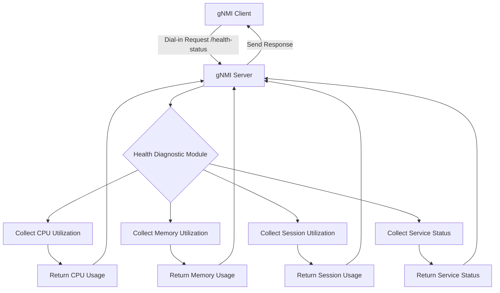
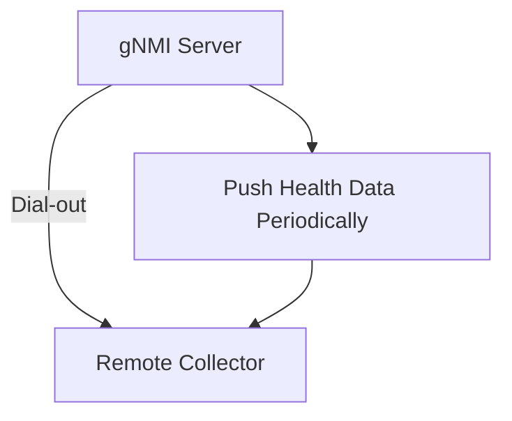

# High-Level Design (HLD) for Health Diagnostic Module in SONiC gNMI Server

## Overview
The purpose of this design is to add a health diagnostic module to the SONiC gNMI server. The module will provide system health metrics, such as CPU utilization, memory utilization, and network health, allowing monitoring through the gNMI interface. The design supports both **Dial-in** and **Dial-out** modes of gNMI operation.

## Assumption

- Phase1: Collecting gNMI server
- Phase2: Collection ? container
- ...

## Requirements
- **Health Metrics to Collect:**
  - CPU Utilization (%)
  - Memory Utilization (%)
  - Active gNMI sessions
  - Network interface health (up/down status)
  - To be enriched...
  
- **YANG Model Support:**
  - The gNMI server should expose health diagnostics through the YANG model.

- **gNMI Integration:**
  - The health data must be available as part of the gNMI `Get` RPC for **Dial-in** mode.
  - For **Dial-out** mode, the gNMI server will push health diagnostics to a remote collector based on a periodic schedule.

- **Performance Considerations:**
  - The health checks should be lightweight and should not negatively impact gNMI server performance.

## Modes of Operation

### 1. Dial-in Mode
In Dial-in mode, the client makes a request to the gNMI server for health diagnostics. The server gathers the requested metrics and responds to the client with the data.

### 2. Dial-out Mode
In Dial-out mode, the gNMI server is configured to automatically push health metrics to a remote system (collector) periodically or upon specific events. The push interval and collector addresses are configurable.

## Design Components

### 1. Health Diagnostic Module
The health diagnostic module is responsible for gathering metrics related to system resource usage and the health of network interfaces.

#### Module Structure
- `GetHealthInfo()`: A function to gather health metrics including CPU and memory usage.
- `GetCPUUtilization()`: Function for calculating CPU utilization.
- `GetSessionUtilization()`: A function to gather session utilization.
- `GetServiceStatus()`: Function for collecting Service Status.
- `YANG Model`: Extends the existing gNMI YANG model to include a new path for the health diagnostics.

```go
package health

type HealthInfo struct {
    CPUUtilization    float64
    MemoryUtilization float64
}

type Status int

const (
    Unknown Status = iota
    Up
    Down
)

func (s Status) String() string {
    switch s {
    case Up:
        return "Up"
    case Down:
        return "Down"
    default:
        return "Unknown"
    }
}

func GetStatus() Status {
    return Pending
}

func GetHealthInfo() HealthInfo {
    // Memory stats collection
    var memStats runtime.MemStats
    runtime.ReadMemStats(&memStats)

    return HealthInfo{
        CPUUtilization:    GetCPUUtilization(),
        MemoryUtilization: float64(memStats.Alloc) / float64(memStats.TotalAlloc),
        SessionUtilization:    GetSessionStatistics(),
        ServiceStatus: GetStatus(),
    }
}
```

### 2. YANG Model Extension
The YANG model is extended to include paths for health diagnostics (`cpu-utilization`, `memory-utilization`, `session-utilization`, `service-status`).

```yang
module sonic-health {
    namespace "http://github.com/sonic-net/sonic-gnmi/health";
    prefix "sh";

    container health-status {
        leaf cpu-utilization {
            type decimal64 { fraction-digits 2; }
            description "Percentage of CPU utilization";
        }
        leaf memory-utilization {
            type decimal64 { fraction-digits 2; }
            description "Percentage of memory utilization";
        }
        leaf session-utilization {
            type int32 {
                range "0..35000";
            }
            description "In house session utilization";
        }
        leaf service-status {
            type enumeration {
                enum up;
                enum down;
            }
            default up;
            description "Service Status";
        }
    }
}
```

### 3. gNMI Server Integration
#### 3.1 Dial-in Mode
The `Get` RPC is extended to support health diagnostic requests. When the `/health-status` path is requested, the health metrics are returned to the client.

```go
func (s *Server) Get(ctx context.Context, req *gnmi.GetRequest) (*gnmi.GetResponse, error) {
    // Existing Get functionality here

    for _, path := range req.Path {
        if path == "/health-status" {
            healthInfo := health.GetHealthInfo()
            return &gnmi.GetResponse{
                Notification: []*gnmi.Notification{
                    &gnmi.Notification{
                        Update: []*gnmi.Update{
                            &gnmi.Update{
                                Path: &gnmi.Path{Element: []string{"cpu-utilization"}},
                                Val:  &gnmi.TypedValue{Value: &gnmi.TypedValue_DecimalVal{DecimalVal: healthInfo.CPUUtilization}},
                            },
                            &gnmi.Update{
                                Path: &gnmi.Path{Element: []string{"memory-utilization"}},
                                Val:  &gnmi.TypedValue{Value: &gnmi.TypedValue_DecimalVal{DecimalVal: healthInfo.MemoryUtilization}},
                            },
                        },
                    },
                },
            }, nil
        }
    }

    // Existing code
    return &gnmi.GetResponse{}, nil
}
```

#### 3.2 Dial-out Mode
In Dial-out mode, the server periodically pushes health diagnostics to a remote collector. The push interval and destination are configurable.

```go
func (s *Server) PushHealthData() {
    for {
        time.Sleep(time.Duration(s.pushInterval) * time.Second)
        healthInfo := health.GetHealthInfo()
        s.pushToCollector(healthInfo)
    }
}

func (s *Server) pushToCollector(healthInfo HealthInfo) {
    // Logic to push health metrics to remote collector
}
```

### 4. Testing and Validation
Unit tests will be written to validate the functionality of the health diagnostics module in both **Dial-in** and **Dial-out** modes. These tests will ensure that health data is correctly returned in response to client requests in Dial-in mode and successfully pushed to remote collectors in Dial-out mode.

## Flowchart
The following diagram illustrates the flow of how the health diagnostic module integrates with the gNMI server in both **Dial-in** and **Dial-out** modes:

### Dial-in


### Dial-out


## Conclusion
This high-level design outlines the addition of a health diagnostic module to the SONiC gNMI server, supporting both Dial-in and Dial-out modes. The design is lightweight, modular, and allows for easy extension to gather additional health metrics. It integrates seamlessly into the gNMI interface, enabling clients to monitor the health of the server in real time and allowing automatic push of health metrics to remote collectors in Dial-out mode.
