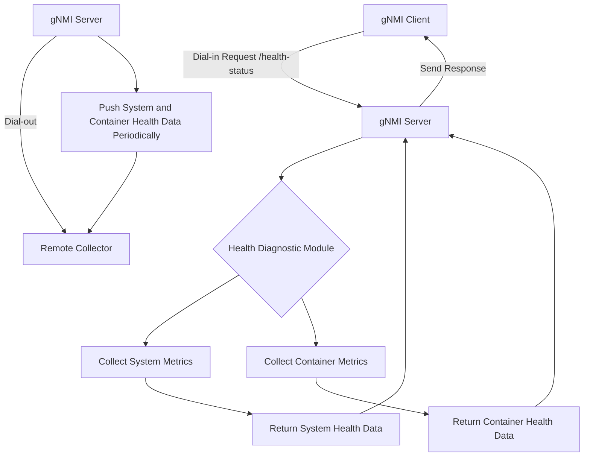

# High-Level Design (HLD) for Health Diagnostic Module in SONiC gNMI Server

## Overview
The purpose of this design is to add a health diagnostic module to the SONiC gNMI server. The module will provide system health metrics, such as CPU utilization, memory utilization, and network health, allowing monitoring through the gNMI interface. The design supports both **Dial-in** and **Dial-out** modes of gNMI operation.

## Assumption

- Phase1: Collecting gNMI server
- Phase2: Collection ? container
- ...

## Requirements
- **Health Metrics to Collect:**
  - System-level:
    - CPU Utilization (%)
    - Memory Utilization (%)
    - Active gNMI sessions
    - Network interface health (up/down status)
  
  - Container-level:
    - Container CPU utilization
    - Container memory usage
    - Disk I/O
    - Network I/O
    - Container status (running, exited, restarting, etc.)
    - Uptime (how long the container has been running)
  
- **YANG Model Support:**
  - The gNMI server should expose health diagnostics through the YANG model.
  - YANG paths should support both system-level and container-level metrics.

- **gNMI Integration:**
  - The health data must be available as part of the gNMI `Get` RPC for **Dial-in** mode.
  - For **Dial-out** mode, the gNMI server will push health diagnostics (both system and container) to a remote collector based on a periodic schedule.

- **Performance Considerations:**
  - The health checks should be lightweight and should not negatively impact gNMI server performance.

## Modes of Operation

### 1. Dial-in Mode
In Dial-in mode, the client makes a request to the gNMI server for health diagnostics. The server gathers the requested metrics (both system-level and container-level) and responds to the client with the data.

### 2. Dial-out Mode
In Dial-out mode, the gNMI server is configured to automatically push health metrics (system and container) to a remote system (collector) periodically or upon specific events. The push interval and collector addresses are configurable.

## Design Components

### 1. Health Diagnostic Module
The health diagnostic module is responsible for gathering both system-level and container-specific metrics related to system resource usage and the health of network interfaces and containers.

#### Module Structure
- `GetHealthInfo()`: A function to gather system-level health metrics including CPU and memory usage.
- `GetContainerHealth()`: A function to gather container-level metrics (container CPU, memory, network I/O, disk I/O, status, and uptime).

```go
package health

type ContainerHealthInfo struct {
    ContainerID      string
    CPUUtilization   float64
    MemoryUsage      float64
    NetworkIO        float64
    DiskIO           float64
    Status           string
    Uptime           int64
}

func GetContainerHealth() ([]ContainerHealthInfo, error) {
    // Example logic to gather container health metrics (using Docker or containerd APIs)
}
```

### 2. YANG Model Extension
We will extend the YANG model to support both system-level and container-level health metrics.

```yang
module sonic-health {
    namespace "http://github.com/sonic-net/sonic-gnmi/health";
    prefix "sh";

    container system-health-status {
        leaf cpu-utilization {
            type decimal64 { fraction-digits 2; }
            description "System CPU utilization";
        }

        leaf memory-utilization {
            type decimal64 { fraction-digits 2; }
            description "System memory utilization";
        }
    }

    container container-health-status {
        list container {
            key "container-id";

            leaf container-id {
                type string;
                description "ID of the container";
            }

            leaf cpu-utilization {
                type decimal64 { fraction-digits 2; }
                description "Percentage of CPU utilization for the container";
            }

            leaf memory-usage {
                type decimal64 { fraction-digits 2; }
                description "Memory usage for the container";
            }

            leaf network-io {
                type decimal64 { fraction-digits 2; }
                description "Network I/O for the container";
            }

            leaf disk-io {
                type decimal64 { fraction-digits 2; }
                description "Disk I/O for the container";
            }

            leaf status {
                type string;
                description "Container status (running, stopped, etc.)";
            }

            leaf uptime {
                type int64;
                description "Uptime of the container in seconds";
            }
        }
    }
}
```

### 3. gNMI Server Integration

#### 3.1 Dial-in Mode
The `Get` RPC will support paths to retrieve both system and container health diagnostics.

```go
func (s *Server) Get(ctx context.Context, req *gnmi.GetRequest) (*gnmi.GetResponse, error) {
    for _, path := range req.Path {
        if path == "/container-health-status" {
            containerHealthInfo, err := health.GetContainerHealth()
            if err != nil {
                return nil, err
            }
            // Construct the GetResponse for container health data
        }
    }

    return &gnmi.GetResponse{}, nil
}
```

#### 3.2 Dial-out Mode
The gNMI server will periodically push both system and container health diagnostics to a remote collector.

```go
func (s *Server) PushHealthData() {
    for {
        time.Sleep(time.Duration(s.pushInterval) * time.Second)
        healthInfo, err := health.GetContainerHealth()
        if err != nil {
            continue
        }
        s.pushToCollector(healthInfo)
    }
}
```

### 4. Testing and Validation
The extended testing will include:
- Validation of both system and container health data.
- Simulated container crashes or restarts to verify health diagnostics behavior.
- Testing resource limits and error conditions for container health monitoring.

## Flowchart
The following diagram illustrates the extended flow for both system and container health diagnostics in **Dial-in** and **Dial-out** modes:



## Conclusion
This high-level design extends the gNMI health diagnostic module to cover both system and container health diagnostics. The design ensures comprehensive health monitoring and supports both **Dial-in** and **Dial-out** modes, providing real-time health information to clients and remote collectors.
