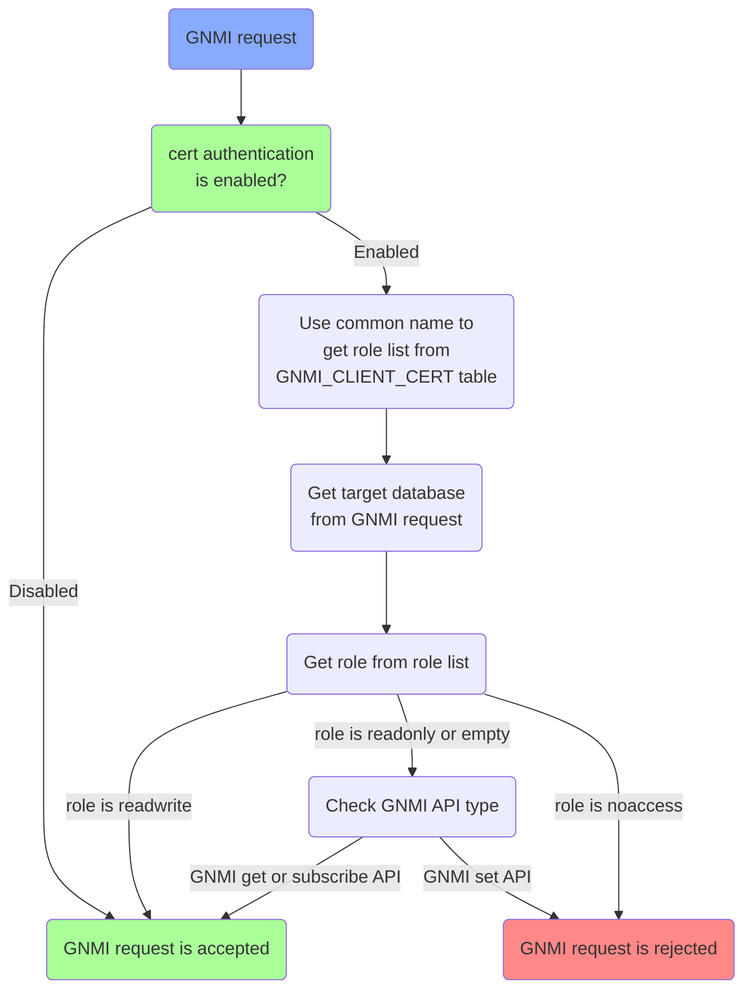

# gNMI Service Role Enforcement

# High Level Design Document

#### Rev 0.1

# Table of Contents
- [Table of Contents](#table-of-contents)
- [List of Tables](#list-of-tables)
- [Revision](#revision)
- [About this Document](#about-this-document)
- [Scope](#scope)
- [Definition/Abbreviation](#definitionabbreviation)
- [1 Overview](#1-overview)
- [2 Design](#2-design)
- [3 Test Plan](#3-test-plan)

# List of Tables
[Table 1: Abbreviations](#table-1-abbreviations)

[Table 2: Role Access](#table-2-role-access)

[Table 3: GNMI API Permission](#table-3-gnmi-api-permission)

# Revision

| Rev | Date        | Author             | Change Description  |
|:---:|:-----------:|:------------------:|---------------------|
| 0.1  | 04/23/2025 | Gang Lv    | Initial version     |

# About this Document
This document provides a detailed description on the strategy to implement the gNMI Service Role Enforcement.

# Scope
This document describes the high level design of gNMI Service Role Enforcement. 

This document provides minor implementation details about the proposed solutions.

# Definition/Abbreviation

### Table 1: Abbreviations
| **Term** | **Meaning**                |
| -------- | -------------------------- |
| gRPC     | A modern open-source high performance Remote Procedure Call (RPC) framework that can run in any environment |
| gNMI     | gRPC Network Management Interface, used to retrieve or manipulate the state of a device via telemetry or configuration data |
| gNOI     | gRPC Network Operations Interface |
| JSON     | JavaScript Object Notation |
| Yang     | Yet Another Next Generation, it is a modular language representing data structures in an XML tree format |
| ConfigDB | Configuration Database |
| ApplDB | Application Database |

# 1. Overview

At present, GNMI services process requests without verifying certificate identities, which could enable users to obtain write access without authorization. 

The plan is to enhance the security of GNMI services by utilizing the common name in the certificate and identifying the role linked with this common name. The role will be restricted from invoking GNMI APIs. 

Consider the GNMI API for config_db as an example:

### Table 2: Role Access
| **Role** | **GNMI set for config_db**  | **GNMI get for config_db**  | **GNMI subscribe for config_db**  |
| -------- | -------------------------- | -------------------------- | -------------------------- |
| gnmi_config_db_readwrite | Allowed | Allowed | Allowed |
| gnmi_config_db_readonly | Banned | Allowed | Allowed |
| gnmi_config_db_noaccess | Banned | Banned | Banned |
| empty     | Banned | Allowed | Allowed |

# 2. Design

## 2.1. Workflow

GNMI services will perform additional authentication using the common name in the certificates. The role list associated with this common name will be determined from config_db, and role can be either target+readwrite, target+ readonly, target+noaccess. If no configuration exists for this common name, the GNMI request will be denied. Furthermore, if the assigned role does not include readwrite permissions, any GNMI request involving a write API will be denied. Likewise, if the assigned role is noaccess, all GNMI requests will be rejected. 



## 2.2. GNMI Permission

### Table 3: GNMI API Permission
| **API** | **Permission**  |
| -------- | -------------- |
| GNMI Set API          | Write |
| GNMI Get API          | Read  |
| GNMI Subscribe API    | Read  |
| GNMI Capabilities API | Read  |

## 2.3. Configuration Change

We have added a new field in the GNMI table. We will utilize this user_auth field to enable certificate authentication. 

```
container gnmi {
    leaf client_auth {
        type boolean;
        description "Flag for requiring client auth.";
    }
    leaf log_level {
        type uint8 {
            range 0..100;
        }
        description "Log level for gnmi.";
    }
    leaf port {
        type inet:port-number;
        description "Port gnmi runs on.";
    }
    leaf save_on_set {
        type boolean;
        description "Flag for enabling save on set.";
    }
    leaf enable_crl {
        type boolean;
        description "Flag for enable certificate revocation list.";
    }
    leaf crl_expire_duration {
        type uint32;
        description "Certificate revocation list cache expire duration.";
    }
    leaf user_auth {
        type string {
            pattern 'password|jwt|cert';
        }
        description "GNMI service user authorization type.";
    }
}
```

The GNMI_CLIENT_CERT table was established to associate common names with specific roles. It is necessary to retrieve the client's common name and assign the corresponding role list. For instance, the role list may include `gnmi_config_db_readwrite`, `gnmi_state_db_readonly` and `gnoi_noaccess`. 

```
container GNMI_CLIENT_CERT {
    description "GNMI client cert list";
    list GNMI_CLIENT_CERT_LIST {
        key "cert_cname";
        leaf cert_cname {
            type string;
            description "client cert common name";
            }
        leaf-list role {
            type string;
            min-elements 1;
            description "role of client cert common name";
        }
    }
}
```

## 3. Test Plan

* GNMI set request with empty role
* GNMI set request with readonly role
* GNMI set request with readwrite role
* GNMI set request with noaccess role
* GNMI get request with empty role
* GNMI get request with readonly role
* GNMI get request with readwrite role
* GNMI get request with noaccess role
* GNMI subscribe request with empty role
* GNMI subscribe request with readonly role
* GNMI subscribe request with readwrite role
* GNMI subscribe request with noaccess role
* GNMI capabilities request with empty role
* GNMI capabilities request with readonly role
* GNMI capabilities request with readwrite role
* GNMI capabilities request with noaccess role
