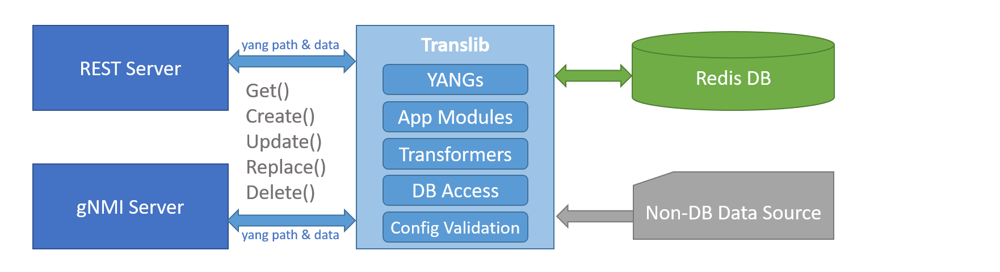

# gNMI Subscription for YANG Data

This document describes the high level design for SONiC Telemetry service and Translib infrastructure
to support gNMI subscriptions and wildcard paths for YANG defined paths.

## Table of Contents

- [1 Feature Overview](#1-feature-overview)
  - [1.1 Introduction](#11-introduction)
  - [1.2 Requirements](#12-requirements)
    - [1.2.1 ON_CHANGE subscription for eligible paths](#121-on_change-subscription-for-eligible-paths)
    - [1.2.2 SAMPLE subscription for all paths](#122-sample-subscription-for-all-paths)
    - [1.2.3 TARGET_DEFINED subscription for all paths](#123-target_defined-subscription-for-all-paths)
    - [1.2.4 POLL and ONCE subscriptions](#124-poll-and-once-subscriptions)
    - [1.2.5 Support Wildcard Keys](#125-support-wildcard-keys)
    - [1.2.6 Scalar encoding for telemetry updates](#126-scalar-encoding-for-telemetry-updates)
    - [1.2.7 Co-exist with existing gNMI server functionality](#127-co-exist-with-existing-gnmi-server-functionality)
  - [1.3 Translib Overview](#13-translib-overview)
  - [1.4 References](#14-references)
- [2 High Level Design](#2-high-level-design)
  - [2.1 Role of Framework and App Components](#21-role-of-framework-and-app-components)
  - [2.2 Identifying YANG Based Subscriptions](#22-identifying-yang-based-subscriptions)
  - [2.3 Manage Subscription RPC Lifecycle](#23-manage-subscription-rpc-lifecycle)
  - [2.4 Streaming Data from Translib](#24-streaming-data-from-translib)
  - [2.5 Collecting Subscription Preferences for YANG Paths](#25-collecting-subscription-preferences-for-yang-paths)
  - [2.6 Collecting YANG Path to DB Mappings](#26-collecting-yang-path-to-db-mappings)
  - [2.7 Subscribe Session](#27-subscribe-session)
  - [2.8 Handling ON_CHANGE](#28-handling-on_change)
    - [2.8.1 Basic Approach](#281-basic-approach)
    - [2.8.2 Translib Subscribe() API](#282-translib-subscribe-api)
    - [2.8.3 DB key to YANG Path mapping](#283-db-key-to-yang-path-mapping)
    - [2.8.4 OnChange Cache](#284-onchange-cache)
    - [2.8.5 Sending Notifications](#285-sending-notifications)
    - [2.8.6 Notification Timestamp](#286-notification-timestamp)
  - [2.9 Handling SAMPLE](#29-handling-sample)
    - [2.9.1 Basic Approach](#291-basic-approach)
    - [2.9.2 Translib Stream() API](#292-translib-stream-api)
    - [2.9.3 YGOT Cache](#293-ygot-cache)
    - [2.9.4 Notification Timestamp](#294-notification-timestamp)
  - [2.10 Handling TARGET_DEFINED](#210-handling-target_defined)
  - [2.11 Handling ONCE](#211-handling-once)
  - [2.12 Handling POLL](#212-handling-poll)
  - [2.13 Scalar Encoding](#213-scalar-encoding)
  - [2.14 Handling YANG Paths without Module Prefix](#214-handling-yang-paths-without-module-prefix)
  - [2.15 Wildcard Keys for Non-DB paths](#215-wildcard-keys-for-non-db-paths)
- [3 Design Details](#3-design-details)
  - [3.1 Translib APIs](#31-translib-apis)
    - [3.1.1 SubscribeSession](#311-subscribesession)
    - [3.1.2 IsSubscribeSupported](#312-issubscribesupported)
    - [3.1.3 Subscribe](#313-subscribe)
    - [3.1.4 Stream](#314-stream)
  - [3.2 App Interface](#32-app-interface)
    - [3.2.1 translateSubscribe](#321-translatesubscribe)
    - [3.2.2 processSubscribe](#322-processsubscribe)
    - [3.2.3 ProcessOnChange](#323-processonchange)
  - [3.3 CommonApp module](#33-commonapp-module)
    - [3.3.1 CommonApp's TranslateSubscribe](#331-commonapps-translatesubscribe)
    - [3.3.2 CommonApp's ProcessSubscribe](#332-commonapps-processsubscribe)
  - [3.4 Transformer](#34-transformer)
    - [3.4.1 Subtree Subscribe transformer](#341-subtree-subscribe-transformer)
    - [3.4.2 Path transformer](#342-path-transformer)
    - [3.4.3 Key transformer](#343-key-transformer)
    - [3.4.4 Table transformer](#344-table-transformer)
  - [3.5 Path validator](#35-path-validator)
- [4 User Interface](#4-user-interface)
- [5 Serviceability and Debug](#5-serviceability-and-debug)
  - [5.1 Finding Subscription Preferences for a YANG Path](#51-finding-subscription-preferences-for-a-yang-path)
- [6 Scale Considerations](#6-scale-considerations)
- [7 Limitations](#7-limitations)
- [8 Unit Tests](#8-unit-tests)

## Revision History

| Rev | Date        |       Author       | Change Description                                                            |
|-----|-------------|--------------------|-------------------------------------------------------------------------------|
| 0.1 | 03/02/2023  | Sachin Holla       | Initial draft                                                                 |
| 0.2 | 03/14/2023  | Balachandar Mani   | Added the CommonApp's interface, Transformer and Path validator details |

## Definition and Abbreviation

| **Term**       | **Meaning**                         |
|----------------|-------------------------------------|
| gNMI           | gRPC Network Management Interface   |
| gRPC           | gRPC Remote Procedure Call (it is a recursive acronym!!)   |
| RPC            | Remote Procedure Call.. In this document it mostly refers to the operations defined by gNMI specification |
| YGOT           | [YANG Go Tools](https://github.com/openconfig/ygot); a Golang library to process YANG data |

## 1 Feature Overview

### 1.1 Introduction

SONiC Telemetry service suports gNMI Get, Set and Subscribe RPCs for DB paths and sonic-yang based paths.
It also suppots Get and Set for OpenConfig and IETF yang based paths that are part of **sonic-mgmt-common** repository.
This design document describes proposed enhancements to support gNMI Subscribe RPC for such YANG paths.

### 1.2 Requirements

#### 1.2.1 ON_CHANGE subscription for eligible paths

Infrastructure should support ON_CHANGE subscription for YANG paths based on redis keyspace notifications.
It should provide APIs for apps to specify ON_CHANGE unsupported paths.
An `INVALID_ARGUMENT` status should be returned if the target path or any of its descendent paths do not support ON_CHANGE.

#### 1.2.2 SAMPLE subscription for all paths

Infrastructure should support SAMPLE subscription for all YANG paths.
It should provide APIs for apps to indicate minimum `sample_interval` supported for the path.
An `INVALID_ARGUMENT` status should be returned if the minimum `sample_interval` of target path or any of its descendent paths is more than the requested `sample_interval`.

#### 1.2.3 TARGET_DEFINED subscription for all paths

Infrastructure should support TARGET_DEFINED subscription for all YANG paths.
Subscribe request should be treated as ON_CHANGE or SAMPLE based on the app's preferences for the target path.
It should split into multiple requests if the target path supports ON_CHANGE
but some of its descendent paths do not.

#### 1.2.4 POLL and ONCE subscriptions

Infrastructure should support POLL and ONCE subscriptions for all YANG paths.

#### 1.2.5 Support Wildcard Keys

Infrastructure should support wild cards in **path key** for all subscription modes.
Example: `/openconfig-interfaces:interfaces/interface[name=*]/config`.
Path can contain any number of wildcard key values.
Apps should be allowed to indicate wildcard unsupported paths.
An `INVALID_ARGUMENT` status should be returned if wildcard key cannot be supported for the target path.

Wildcard in path element (like `/interfaces/*/config` or `/interfaces/.../config`) is a stretch goal.

#### 1.2.6 Scalar encoding for telemetry updates

All telemetry updates should be encoded as gNMI scalar types.
Each update entry should be a {leaf path, scalar value} pair.
Scalar type encoding is explained in gNMI specification [section 2.2.3](https://github.com/openconfig/reference/blob/master/rpc/gnmi/gnmi-specification.md#223-node-values).

#### 1.2.7 Co-exist with existing gNMI server functionality

Proposed enhancements should not affect any of the existing functionalities of the SONiC Telemetry Service.

### 1.3 Translib Overview

Translib is a golang library for reading and writing YANG model based data to redis DB or non-DB data source.
Applications would plugin the YANG models and their translation code into the translib.
These application components are called *app modules*.
Northbound API servers, like REST/gNMI servers, can call translib functions likes `Get()`, `Create()`, `Delete()` to process the request they received.
Translib then invokes corresponding app modules to translate the YANG and and perform actual read/write operations.
Following diagram provides a very high level summary;
[Management Framework HLD](../Management%20Framework.md) contains more details.



Translib will be enhanced to provide new functions for supporting subscription.
There will be new requirements on app modules for providing additional details to translib to handle subscription.
gNMI server will be enhanced to identify the Subscribe requests for translib YANG paths and use the new translib functions to service it.

### 1.4 References

SONiC Management Framework<br>
https://github.com/sonic-net/SONiC/blob/master/doc/mgmt/Management%20Framework.md

SONiC GRPC Telemetry<br>
https://github.com/sonic-net/SONiC/blob/master/doc/system-telemetry/grpc_telemetry.md

SONiC gNMI Server Interface Design<br>
https://github.com/sonic-net/SONiC/blob/master/doc/mgmt/gnmi/SONiC_GNMI_Server_Interface_Design.md

gNMI Specification<br>
https://github.com/openconfig/reference/blob/master/rpc/gnmi/gnmi-specification.md

gNMI Protobuf Definition<br>
https://github.com/openconfig/gnmi/blob/master/proto/gnmi/gnmi.proto

## 2 High Level Design

### 2.1 Role of Framework and App Components

- gNMI server will manage subscribe RPC life cycle, timers, validations, response encoding.

- Translib will provide APIs to monitor and retrieve subscribed YANG data.
  Following new translib APIs will be implemented:
  - `IsSubscribeSupported()` to return subscription preferences for given paths.
  - `Stream()` to return current data for given paths through a queue
  - `Subscribe()` to handles ON_CHANGE subscriptions.
    It starts monitoring the mapped DB key patterns using redis PSUBSCRIBE operations.
    Subsequent changes to the DB will be stream asynchronously using a queue.

- App modules are only required to provide YANG path to DB entry mappings and vice-versa.

- App modules should implement app interface function `translateSubscribe()` to provide
  YANG path to DB/non-DB mappings.
  - Should include mappings for given YANG node and all its child nodes
  - Should handle wildcard keys in the yang paths.
  - Mapped DB key can have a redis wildcard pattern.
  - One YANG path can have multiple DB/non-DB mappings.

- App modules can also return subscription preferences in `translateSubscribe()` response.
  Translib will assume default values if app did not specify the preferences.
  Preferences includes:
  - Whether ON_CHANGE enabled
  - Minimum SAMPLE interval.
  - Preferred subscription mode during TARGET_DEFINED

- Transformer common_app will discover the mappings and preferences from the annotations.
  Subtree transformers should implement `Subscribe_xxx()` callback function to specify
  the mappings and preferences.
  Table and key transformers should handle wildcard paths.

- App modules should implement `processSubscribe()` app interface function to resolve YANG keys for a DB entry.
  This is required to get a specific YANG path from a wildcard path template.

- Transformer common_app will automatically support this for simple cases.
  Apps should implement a *path transformer* to handle special cases --
  subtree transformer or when there is no one-to-one mapping of YANG key to DB key.

### 2.2 Identifying YANG Based Subscriptions

Today the gNMI server supports subscription based on SONiC specific "DB paths" and "virtual paths"
as described in the [GRPC Telemetry HLD](../../system-telemetry/grpc_telemetry.md).
It uses the request `target` value to identify type of the subscribe paths.
A subscribe request will be rejected if `target` was not specified.

This is not in sync with the [gNMI specification](https://github.com/openconfig/reference/blob/master/rpc/gnmi/gnmi-specification.md#2221-path-target).
`target` is optional and is supposed to be an opaque data for the server.
However, the current behavior will not be removed completely for the sake of backward compatibility.
The request `target` will be made optional.
Request will be processed as described in [GRPC Telemetry HLD](../../system-telemetry/grpc_telemetry.md)
if the `target` is specified and matches one of the reserved keywords listed in that HLD.
If `target` is not specified or not one of the reserved ones, the subscribe path will be treated as tarnslib YANG path.

### 2.3 Manage Subscription RPC Lifecycle

Existing subscription RPC management code will be re-used as is.
Subscription RPCs, except ONCE, will be active until client cancels it or an error is encountered in translib.
RPC will not survive the switch reboot or telemetry service/process restart events.

### 2.4 Streaming Data from Translib

Unlike Get, translib will be returning multiple responses while processing the subscribe request.
To handle this, the gNMI server would pass a queue to translib and wait for the response on it.
Translib will push response objects or the error info to that queue as a `SubscribeResponse` object.
It contains following information:

- Event timestamp
- Path and YGOT object containing updated values
- List of deleted paths
- *SyncComplete* flag indicating all current values have been streamed out.
- *IsTerminated* flag indicating that translib encountered an error and stopped processing the subscription.

gNMI server will dequeue the `SubscribeResponse`, prepare a gNMI notification message and stream it back to the client.
If *IsTerminated* flag is set, gNMI server will end the subscription with an error status.

### 2.5 Collecting Subscription Preferences for YANG Paths

gNMI server would collect the subscription preferences for the requested YANG paths
by calling the translib API `IsSubscribeSupported()`.
It returns following preferences for each requested path:

- Whether ON_CHANGE supported
- Minimum sample interval
- Preferred stream mode to be used for TARGET_DEFINED

gNMI server would reject the subscription with `INVALID_ARGUMENT` status if:

- `IsSubscribeSupported()` returned an error, indicating invalid path or app is not ready to handle subscription
- ON_CHANGE subscription is requested but path does not support ON_CHANGE
- Requested `sample_interval` is less than the minimum sample interval for the path

These validations will be performed for each path in the subscribe request.
If success, the gNMI server would call translib `Stream()` and `Subscribe()` APIs to process the subscription --
discussed in subsequent sections.

### 2.6 Collecting YANG Path to DB Mappings

Translib collects YANG path to DB mappings when `IsSubscribeSupported()` is called.
Translib invokes app module's `translateSubscribe()` function to collect DB mappings for a path.
It should return array of notificationAppInfo objects containing following data:

- Path to mapped YANG node.
  Should be same as request path or one of its descendent paths.
- Mapped DB index, table name, DB key pattern
- DB field name to YANG leaf subpath mappings.
- Whether ON_CHANGE supported
- Minimum SAMPLE interval
- Preferred subscription mode for TARGET_DEFINED

Mapping should be returned even if the YANG node does not map to a DB entry.
The DB index should set to unknown db to indicate the non-DB mapping.

In many scenarios, few child paths of a YANG path may be mapped to a different table.
Additional `notificationAppInfo` objects should be should be created for such sub-paths.

An example with a simplified openconfig-interfaces YANG model:

```text
module: openconfig-interfaces
  +--rw interfaces
     +--rw interface*       ==> CONFIG_DB:PORT
        +--rw name
        +--rw config
        |  +--rw enabled
        +--ro state         ==> APPL_DB:PORT_TABLE
        |  +--ro enabled
        |  +--ro oper-status
```

| **YANG Path**                         | **DB mappings**                         |
|---------------------------------------|-----------------------------------------|
| /interfaces/interface[name=\*]         | {CONFIG_DB, PORT, \*, {admin_status=config/enabled}}<br> {APPL_DB, PORT_TABLE, \*, {admin_status=state/enabled, oper_status=state/oper-status}} |
| /interfaces/interface[name=Ethernet0]/config  | {CONFIG_DB, PORT, Ethernet0, {admin_status=enabled}} |
| /interfaces/interface[name=\*]/state/oper-status  | {APPL_DB, PORT_TABLE, \*, {oper_status=oper-status}} |
| /interfaces/interface[name=Ethernet0]/config      | {CONFIG_DB, PORT, Ethernet0, {admin_status=enabled}} |

There is also a possibility of leaf path getting mapped to multiple DB tables.
E.g, real life `/interfaces/interface[name=*]` will map to (CONFIG_DB, PORT, \*, {...}), (CONFIG_DB, PORTCHANNEL, \*, {...}) and so on.

### 2.7 Subscribe Session

ON_CHANGE and SAMPLE are long running subscriptions; they will be active till the gNMI client closes the RPC.
Translib will need the subscription preferences and DB mappings at multiple stages.
To avoid calling app module's `translateSubscribe()` multiple times, translib caches these translated path info
in a `SubscribeSession` object.
gNMI server should create a `SubscribeSession` when a subscription RPC is started and keep passing it to all the translib APIs invoked for processing that RPC.
This enables translib to re-use the DB mappings collected during `IsSubscribeSupport()` in subsequent `Stream()` and `Subscribe()` calls.
Contents of `SubscribeSession` are opaque to the gNMI server.
The session must be closed while existing the RPC to cleanup the cached information.

### 2.8 Handling ON_CHANGE

#### 2.8.1 Basic Approach

Translib relies on redis keyspace notifications to support ON_CHANGE subscription for the YANG data.
gNMI Server uses translib `Subscribe()` API to starts the ON_CHANGE subscription for given YANG paths.
It starts monitoring all the redis keys mapped to given path and its sub-paths using redis PSUBSCRIBE operation.
Redis notifies translib when any of the monitored DB entries are updated/deleted.
Translib will translate this back to YANG data, prepare a `SubscribeResponse` object and
send it to the gNMI server over the response queue.
gNMI server will dequeue the `SubscribeResponse`, prepare a gNMI notification message and send it back to the client.
Following sequence diagram indicates overall flow of ON_CHANGE processing.


#### 2.8.2 Translib `Subscribe()` API

The `Subscribe()` API manages redis subscriptions and notifications for given YANG paths.
It expects following information from gNMI server:

- YANG paths
- A queue for sending back responses
- A *channel* object that signals subscription cancellation
- Subscribe Session object

DB mappings cached in `SubscribeSession` will be used to compute all corresponding redis key patterns.
Translib will start monitoring those redis keys using PSUBSCRIBE operation.
Notification handler will run in a separate goroutine.

gNMI Subscribe PRC requires server to stream current data values before it could send incremental updates.
To send the current data, translib will collect all existing redis keys using SCAN operation on the mapped redis key patterns.
These keys will be translated to YANG paths as described in section [2.8.3](#283-db-key-to-yang-path-mapping).
App Module's `processGet()` will be invoked for each such YANG paths and each YANg data will be pushed to the response queue one-by-one.
This approach tends to result in Translib sending stream of smaller chunks of data.
A `SubscribeResponse` with SyncComplete=true is pushed to the queue after data chunks are pushed.

Once the initial data responses are complete, the `Subscribe()` function ends.
But the notification handler will continue to run until gNMI servers sends a cancel signal (through the cannel it passed to the `Subscribe()` function) or a redis PubSub read fails.

#### 2.8.3 DB key to YANG Path mapping

If the subscribed path had wildcard keys, those wildcards need to be resolved in the response YANG paths.
Translib will use App Module's `processSubscribe()` function to achieve this.
This is inverse of YANG path to DB key mapping ([2.6](#26-collecting-yang-path-to-db-mappings)).
Following information will be passed to the `processSubscribe()` function:

- Original path containing wildcards
- Actual DB entry info -- redis key and its values.

App module should return the YANG path by filling all the wildcard keys of the input path.

#### 2.8.4 OnChange Cache

Not all keyspace notifications should be treated a valid notifications.
Translib may be interested in only few fields of a table depending on the subscribed YANG paths.
Redis only notifies which key was modified, but does not indicate which fields were modified.
Hence, translib maintains a cache of all the DB entries it is monitoring.
This cache is initialized while sending initial updates from `Subscribe()` function.
Later when a redis keyspace notification is received, translib reads latest entry value from DB for that key
and compares with the cache to identify modified fields.
Cache is also updated with the new value in this process.
Notification will be ignored if none of the subscribed fields are changed.
This helps to suppress noises close to the source.

In some cases, a DB entry may get changed multiple times in quick succession.
It could even be created/deleted in quick succession, repeatedly.
Since redis keyspace notifications are asynchronous, there may be a delay between db update and translib processing it.
That db entry might have been modified multiple times by the time translib reads the entry from the db (because redis does not indicate changed values in keyspace notification).
Those individual changes will also be notified to translib later, which will be redundant (since translib already sent out notification based on latest value).
OnChange cache will be also be used to suppress such redundant updates.
Following table lists how translib re-interprets the redis keyspace notification based on current db value and cache value:

| Redis event | Entry exists in Cache | Entry exists in DB | Cache Action  | Effective event | Comments |
|-------------|-----------------------|--------------------|---------------|-----------------|----------|
| hset/hdel   | No  | No  | None              | Ignore          | Entry was created and deleted in quick succession. We cannot process them since we lost the values already. |
|             | No  | Yes | Add to cache      | Key create      |   |
|             | Yes | No  | None              | Ignore          | Update follwed by delete in quick succession. We have already lost the updated value. Hence nothing to be done here. There will be a *del* event next which will send delete notification. |
|             | Yes | Yes | Update cache      | Entry update    |   |
| del         | No  | No  | None              | Ignore          | Entry was added and deleted in quick succession. We skip delete since we would have already skipped the create. |
|             | No  | Yes | None              | Ignore          | Should not happen. |
|             | Yes | No  | Remove from cache | Key delete      |   |
|             | Yes | Yes | Remove from cache | Key delete      | Entry was deleted and created back in quick succession. We send delete notification now. There will be a *hset* event next, which processes create event |

Each subscribe session will have its own cache.
It will be destroyed when the session is closed (i.e, when Subscribe RPC ends).

#### 2.8.5 Sending Notifications

Translib notification handler will calculate the modified DB fields by comparing the latest DB entry with the OnChange cache entry.
Notification is ignored if there are no changes relevant to current subscribe paths.
Redis key create/delete and create/update/delete of any of the fields peresent in the DB mapping are considered processed further.
A `SubscribeResponse` object will be constructed as listed below:

| DB change type      | SubscribeResponse contents                                         |
|---------------------|--------------------------------------------------------------------|
| Key delete          | DeletedPath = subscribed path                                      |
| Key create          | UpdateValue = `processGet()` output of subscribed YANG path        |
| Field delete        | DeletedPath = subscribed path + mapped relative path of that field |
| Field create/update | UpdateValue = `processGet()` output of subscribed path + mapped relative path of that field |

If subscriber path had wildcard keys, they will be resolved by calling app module's `processSubscribe()` function.

gNMI server will dequeue the `SubscribeResponse`, prepare a gNMI notification message and stream it to the client.

App module functions normally load the DB entry to construct the YANG data.
Translib would have already loaded the same entry as part of cache diff computation.
A special DB Access object will be passed to app module's `processSubscribe()` and `processGet()` functions, which returns the values from OnChange cache.
This avoids multiple DB reads of a same key as part of one notification handling.

#### 2.8.6 Notification Timestamp

Time at which the notification handler receives the keyspace notification event from the redis will used as notification timestamp.

### 2.9 Handling SAMPLE

#### 2.9.1 Basic Approach

SAMPLE subscription will be handled similar to ON_CHANGE's initial data sync.
But there will not be any redis subscriptions and DB cache.
New `Stream()` API will be introduced in translib for SAMPLE handling.
gNMI server will manage the sample timer and invoke the `Stream()` function on every timer tick.
Following sequence diagram describes the overall flow.


#### 2.9.2 Translib `Stream()` API

The `Stream()` will returns current data snapshot for specified YANG paths.
This will be similar to the `Subscribe()` API, but without redis subscription and notification handler.
Unlike `Get()`, `Stream()` will not coalesce all YANG data into one big blob.
Instead it streams smaller chunks (YGOT object) through the response queue.

If the subscribe path is not mapped to any DB table (non-DB data) and does not have wildcard keys, then
`Stream()` will fallback to `Get()`.

#### 2.9.3 YGOT Cache

To detect deleted resources, gNMI server will maintain previous iteration's snapshot in a {path, YGOT object} cache.
Current iteration's data is compared against this cache to identify deleted objects or attributes.
Cache will be updated wih the current values at the end of each iteration.
YGOT `ygot.Diff()` like logic can be used to compare two YGOT objects.
We observed performance issues with `ygot.Diff()` API, hence it will not be used directly.

gNMI client can set `suppress_redundant` flag in the request to avoid receiving duplicate updates at every sample interval.
Server should not send an update for a leaf unless its value is modified since last update.
YGOT snapshot cache will also be used to resolve attributes updated/deleted since last notification.

YGOT based diff can be heavier and slower compared to DB entry based cache, like the one used for ON_CHANGE.
However such cache cannot be used for non-DB data.
SAMPLE subscription must be supported for every YANG path, irrespective of whether it maps to a DB entry or not.
YGOT snapshot cache approach is chosen to keep the implementation simple.
A mixed approach (DB entry cache in translib for DB data and YGOT cache in gNMI server for non-DB data) can be considered in future releases if we run into performance issues with YGOT cache.

#### 2.9.4 Notification Timestamp

SONiC database does not maintain last updated timestamp for DB fields or even keys.
Translib cannot determine the actual timestamp for the data.
Hence it will always use the timestamp at which `Stream()` read the DB entry as notification timestamp.

### 2.10 Handling TARGET_DEFINED

TARGET_DEFINED subscription flow is similar to that of ON_CHANGE and SAMPLE.
Preferred subscription mode for the path is discovered from the metadata returned by `IsSubscribeSupported()` API.
ON_CHANGE or SAMPLE subscriptions are created based on these preferences.

- If the subscribe path and its descendent nodes prefer ON_CHANGE, then the request is treated as an ON_CHANGE subscription request.
- If the subscribe path prefers SAMPLE, then the request is treated as a SAMPLE subscription request.
- If the subscribe path prefers ON_CHANGE but few of its descendent nodes prefer SAMPLE,
  then the request is treated as multiple requests internally.
  Server starts SAMPLE subscription for the descendent nodes that prefer SAMPLE.
  An ON_CHANGE subscription will be created for rest of the nodes.

Few examples with a simplified openconfig-interfaces YANG model:

```text
module: openconfig-interfaces
  +--rw interfaces
     +--rw interface*
        +--rw name
        +--rw config        ==> CONFIG_DB:PORT
        |  +--rw enabled
        +--ro state         ==> APPL_DB:PORT_TABLE
        |  +--ro enabled
        |  +--ro oper-status
        |  +--ro counters   ==> COUNTERS_DB:COUNTERS (on_change not supported)
        |  |  +--ro in-octets
```

Here container /interfaces/interface/state/counters maps to COUNTERS_DB and does not support ON_CHANGE.
Other nodes support ON_CHANGE.
Below table lists the gNMI server's behavior for different combinations of subscription modes and paths.

| **Mode**       | **Subscribe Path**                       | **Result** |
|----------------|------------------------------------------|------------|
| TARGET_DEFINED | /interfaces/interface[name=\*]           | SAMPLE for /interfaces/interface[name=\*]/state/counters;<br>ON_CHANGE for other paths |
| TARGET_DEFINED | /interfaces/interface[name=\*]/config    | ON_CHANGE |
| TARGET_DEFINED | /interfaces/interface[name=\*]/state     | SAMPLE for /interfaces/interface[name=\*]/state/counters;<br>ON_CHANGE for other paths |
| TARGET_DEFINED | /interfaces/interface[name=\*]/state/enabled         | ON_CHANGE  |
| TARGET_DEFINED | /interfaces/interface[name=\*]/state/counters        | SAMPLE     |
| ON_CHANGE      | /interfaces/interface[name=\*]           | error (counters does not support ON_CHANGE) |
| ON_CHANGE      | /interfaces/interface[name=\*]/config    | ON_CHANGE |
| ON_CHANGE      | /interfaces/interface[name=\*]/state     | error (counters does not support ON_CHANGE) |
| ON_CHANGE      | /interfaces/interface[name=\*]/state/enabled         | ON_CHANGE  |
| SAMPLE         | /interfaces/interface[name=\*]           | SAMPLE    |
| SAMPLE         | /interfaces/interface[name=\*]/config    | SAMPLE    |
| SAMPLE         | /interfaces/interface[name=\*]/state     | SAMPLE    |

Following sequence diagram describes the overall flow.


Detailed flow of `Subscribe()` and `Stream()` APIs are not shown for the sake simplicity.
Please refer to previous sections for details.

### 2.11 Handling ONCE

ONCE subscription also uses `Stream()` API, but does not create a YGOT cache.
RPC is closed after sending all updates for the current data.
Following sequence diagram describes the overall flow.


### 2.12 Handling POLL

POLL subscription is handled similar to ONCE subscription.
Every poll message will use `Stream()` API to notify current data to the client.
There will not be any timer or YGOT cache.

### 2.13 Scalar Encoding

Translib `SubscribeResponse` always returns updated values as a YGOT object.
It can have one or multiple attribute set.
gNMI server will use `ygot.TogNMINotifications()` function to serialize this YGOT object directly into gNMI notification messages having scalar encoded update values.

Both `Subscribe()` and `Stream()` APIs will use app module's `processGet()` function to retrieve YANG data.
Current implementation of `processGet()` always returns YANG data in RFC7951 JSON format.
These will be enhanced to return either RFC7951 or YGOT depending on a *output format* argument.
Default value will be RFC7951 for backward compatibility.
`Subscribe()` and `Stream()` will pass the *output format* as YGOT.

### 2.14 Handling YANG Paths without Module Prefix

Translib and app modules always expect fully qualified YANG paths to be provided.
But gNMI specification allows clients to omit module prefixes in YANG paths.
gNMI server will be enhanced to transform such unqualified YANG paths into fully qualified YANG paths
before passing them to `IsSubscribeSupported()` or `Subscribe()` or `Stream()` APIs.
We can use schema information from YGOT to add the missing prefixes.
Subscribe RPC will be rejected if path transformation fails for any reason.

Similar path transformation can be done for Get and Set RPCs also.

### 2.15 Wildcard Keys for Non-DB paths

SAMPLE, POLL and ONCE subscriptions are supported for non-DB data only if the subscribe path
does not contain wildcards.
Translib `Stream()` API current data is through the existing `Get()` flow.
Wildcard paths cannot be passed to these functions due to limitations in the YGOT.

An alterante approach is to extend app module's `processSubscribe()` scope to return all specific paths of a wildcard path.
However this will not be practical for the app modules if non-DB data source does not provide APIs to retrive object keys (equivalent of redis KEYS or SCAN).
There is no standard "non-DB data access" layer in translib today.
Hence the current design does not support wildcard paths for non-DB data.
Future releases can enhance this based on how non-DB data access evolves in translib.

## 3 Design Details

### 3.1 Translib APIs

#### 3.1.1 SubscribeSession

`SubscribeSession` object is used to share the YANG path to DB mappings across translib APIs.
gNMI server should create a new `SubscribeSession` instance for each subscribe RPC by calling `NewSubscribeSession()` and keep passing it to the other APIs it calls.
Translib APIs will read/write the context info from that object.
gNMI server must close the session before ending the subscribe RPC.

```go
// NewSubscribeSession creates a new SubscribeSession object.
// Caller MUST close the session before exiting the rpc.
func NewSubscribeSession() *SubscribeSession

// Close the subscribe session and release all caches held.
func (ss *SubscribeSession) Close()

// SubscribeSession is used to share session data between subscription
// related APIs - IsSubscribeSupported, Subscribe and Stream.
type SubscribeSession struct {
    ID string
    // cache
}
```

#### 3.1.2 IsSubscribeSupported

`IsSubscribeSupported()` API checks whether subscription can be supported for set of {path, subscription mode} values.
If yes, it also returns the subscription preferences for those paths as `IsSubscribeResponse` objects.
Each `IsSubscribeResponse` holds the preferences for one path.
For TARGET_DEFINED mode, it can return multiple `IsSubscribeResponse` for a path if it supports ON_CHANGE but some of its child paths do not.
API signature:

```go
func IsSubscribeSupported(req IsSubscribeRequest) ([]*IsSubscribeResponse, error)

type IsSubscribeRequest struct {
    Paths         []IsSubscribePath
    Session       *SubscribeSession
    // client info for authetication & accounting
}

type IsSubscribePath struct {
    ID   uint32           // Path ID for correlating with IsSubscribeResponse
    Path string           // Subscribe path
    Mode NotificationType // Requested subscribe mode
}

type IsSubscribeResponse struct {
    ID                  uint32 // Path ID
    Path                string
    IsSubPath           bool // Subpath of the requested path
    IsOnChangeSupported bool
    IsWildcardSupported bool // true if wildcard keys are supported in the path
    MinInterval         int
    Err                 error
    PreferredType       NotificationType
}

type NotificationType int

const (
    TargetDefined NotificationType = iota
    Sample
    OnChange
)
```

#### 3.1.3 Subscribe

`Subscribe()` API is used to handle ON_CHANGE subscription as explained in section [2.8.2](#282-translib-subscribe-api).
API signature:

```go
func Subscribe(r SubscribeRequest) error

// SubscribeRequest holds the request data for Subscribe and Stream APIs.
type SubscribeRequest struct {
    Paths         []string              // Subscribe paths
    Q             *queue.PriorityQueue  // Queue or streaming SubscribeResponse 
    Stop          chan struct{}         // To signal rpc cancellation to Translib
    Session       *SubscribeSession
    // Client info for authentication & accounting
}

type SubscribeResponse struct {
    Timestamp    int64          // Event timestamp
    Path         string         // Path prefix - container or list node
    Update       ygot.GoStruct  // GoStruct for the Path, containing updated values 
    Delete       []string       // Deleted paths - relative to Path
    SyncComplete bool           // Current values have been streamed
    IsTerminated bool           // Translib hit an error and stopped
}
```

#### 3.1.4 Stream

`Stream()` API is used to retrieve data for SAMPLE, POLL and ONCE subscriptions.
Unlike `Get()`, this function can return smaller chunks of data.
Each chunk (YGOT object) is packed in a `SubscribeResponse` object and pushed to the response queue passed by the caller.
Pushes a `SubscribeResponse` with SyncComplete=true after data are pushed.
API signature:

```go
func Stream(req SubscribeRequest) error
```

### 3.2 App Interface

#### 3.2.1 translateSubscribe

All app modules must provide YANG path to DB mapping by implementing the `translateSubscribe()` function.
Subscription cannot be supported for a path if no mapping is provided or an error is returned.
One path can be mapped to multiple tables (e.g, /interfaces can map to PORT, PORTCHANNEL, LOOPBACK etc).
If any child paths map to a different table, such child mappings also must be provided in ON_CHANGE mode.
A mapping should be returned with nil table & key values if the map maps to a non-DB resource.
Following code snippet shows the function signature and its input and output structs.

```go
type appInterface interface {
    //....
    translateSubscribe(req *translateSubRequest) (*translateSubResponse, error)
}

// translateSubRequest is the input for translateSubscribe callback
type translateSubRequest struct {
    ctxID   interface{}      // request id for logging
    path    string           // subscribe path
    mode    NotificationType // requested notification type
    recurse bool             // whether mappings for child paths are required
    dbs     [db.MaxDB]*db.DB // DB access objects for querying, if needed
}

// translateSubResponse is the output returned by app modules
// from translateSubscribe callback.
type translateSubResponse struct {
    // ntfAppInfoTrgt includes the notificationAppInfo mappings for top level tables
    // corresponding to the subscribe path. At least one mapping should be present.
    ntfAppInfoTrgt []*notificationAppInfo
    // ntfAppInfoTrgtChlds includes notificationAppInfo mappings for the child paths
    // if they map to a different table.
    ntfAppInfoTrgtChlds []*notificationAppInfo
}

// notificationAppInfo contains DB mapping details for for a given path.
// One notificationAppInfo object can include details for one db table.
// One subscribe path can map to multiple notificationAppInfo.
type notificationAppInfo struct {
    // path to which the key maps to. Can include wildcard keys.
    // Should match request path -- should not point to any node outside
    // the yang segment of request path.
    path *gnmi.Path
    // database index for the DB key represented by this notificationAppInfo.
    // Should be db.MaxDB for non-DB data provider cases.
    dbno db.DBNum
    // table name. Should be nil for non-DB case.
    table *db.TableSpec
    // key components without table name prefix. Can include wildcards.
    // Should be nil for non-DB case.
    key *db.Key
    // keyGroupComps holds component indices that uniquely identify the path.
    // Required only when the db entry represents leaf-list instances.
    keyGroupComps []int
    // dbFieldYangPathMap is the mapping of db entry field to the yang
    // field (leaf/leaf-list) for the input path.
    dbFldYgPathInfoList []*dbFldYgPathInfo
    // handlerFunc is the custom on_change event handler callback.
    // Apps can implement their own diff & translate logic in this callback.
    handlerFunc apis.ProcessOnChange
    // deleteAction indicates how entry delete be handled for this path.
    // Required only when db entry represents partial data for the path,
    // or to workaround out of order deletes due to backend limitations.
    deleteAction apis.DeleteActionType
    // fldScanPattern indicates the scan type is based on field names and
    // also the pattern to match the field names in the given table
    fieldScanPattern string
    // isOnChangeSupported indicates if on-change notification is
    // supported for the input path. Table and key mappings should
    // be filled even if on-change is not supported.
    isOnChangeSupported bool
    // mInterval indicates the minimum sample interval supported for
    // the input path. 0 (default value) indicate system default interval.
    mInterval int
    // pType indicates the preferred notification type for the input
    // path. Used when gNMI client subscribes with "TARGET_DEFINED" mode.
    pType NotificationType
    // opaque data can be used to store context information to assist
    // future key-to-path translations. This is an optional data item.
    // Apps can store any context information based on their logic.
    // Translib passes this back to the processSubscribe function when
    // it detects changes to the DB entry for current key or key pattern.
    opaque interface{}
}
```

#### 3.2.2 processSubscribe

New `processSubscribe()` function will be introduced in appInterface to translate DB key/entry to a yang path.
Every app must implement this function.
Translib uses it for resolving wild card keys in paths using the DB key.
App must return an error if it does not support subscription for the specified paths
or the input DB entry info is not valid.
Following code snippet shows the function signature and its input and output structs.

```go
type appInterface interface {
    //...
    processSubscribe(req *processSubRequest) (processSubResponse, error)
}

// processSubRequest is the input for app module's processSubscribe function.
// It includes a path template (with wildcards) and one db entry info that needs to
// be mapped to the path.
type processSubRequest struct {
    ctxID interface{}     // context id for logging
    path  *gnmi.Path      // path template to be filled -- contains wildcards
    dbno  db.DBNum        // db entry info to be used for filling path template
    table *db.TableSpec
    key   *db.Key
    entry *db.Value       // updated or deleted db entry. DO NOT MODIFY
    dbs [db.MaxDB]*db.DB  // DB access objects for querying additional data, if needed
    opaque interface{}    // if app had set an opaque data in translateSubscribe
}

// processSubResponse is the output data structure of processSubscribe
// function. Includes the path with wildcards resolved. Translib validates
// if this path matches the template in processSubRequest.
type processSubResponse struct {
    path *gnmi.Path // path with wildcards resolved
}
```

#### 3.2.3 ProcessOnChange

If notification generation logic described at section [2.8.5](#285-sending-notifications)
is not suffice for any table, app module can plugin their own a custom notification generator callback function.
It should be set in the `handlerFunc` field of the `notificationAppInfo` instance returned by `translateSubscribe()`.
Translib will manage the OnChange cache for the table entries and monitor for changes to the db entry.
But when any change is detected, tranlib will invoke the app module's callback, passing the old and new versions of that entry.
App should compare the entries and resolve notification data (deleted paths and updated values).
Following code snippet indicates the callback function signature and input and output structs.

```go
// ProcessOnChange is a callback function to generate notification messages
// from a DB entry change data. Apps can implement their own diff & notify logic
// and register it as the handler for changes to specific tables.
// This callback receives a NotificationContext object containing change details
// of one DB entry and a NotificationSender interface to push translated messages.
type ProcessOnChange func(*NotificationContext, NotificationSender)

// NotificationContext contains the subscribed path and details of a DB entry
// change that may result in a notification message.
type NotificationContext struct {
    Path      *gnmi.Path    // subscribe path, can include wildcards
    Db        *db.DB        // db in which the entry was modified
    Table     *db.TableSpec // table for the modified entry
    Key       *db.Key       // key for modified entry
    EntryDiff               // diff info for modified entry
    AllDb     [db.MaxDB]*db.DB
    Opaque    interface{} // app specific opaque data
}

// EntryDiff holds diff of two versions of a single db entry.
// It contains both old & new db.Value objects and list changed field names.
// Dummy "NULL" fields are ignored; array field names will have "@" suffix.
type EntryDiff struct {
    OldValue      db.Value // value before change; empty during entry create
    NewValue      db.Value // changed db value; empty during entry delete
    EntryCreated  bool     // true if entry being created
    EntryDeleted  bool     // true if entry being deleted
    CreatedFields []string // fields added during entry update
    UpdatedFields []string // fields modified during entry update
    DeletedFields []string // fields deleted during entry update
}

// NotificationSender provides methods to send notification message to
// the clients. Translib subscribe infra implements this interface.
type NotificationSender interface {
    Send(*Notification) // Send a notification message to clients
}

// Notification is a message containing deleted and updated values
// for a yang path.
type Notification struct {
    // Path is an absolute gnmi path of the changed yang container
    // or list instance. MUST NOT be a leaf path.
    Path string
    // Delete is the list of deleted subpaths (relative to Path).
    // Should contain one empty string if the Path itself was deleted.
    // Can be a nil or empty list if there are no delete paths.
    Delete []string
    // Update holds all the updated values (new+modified) within the Path.
    // MUST be the YGOT struct corresponding to the Path.
    // Can be nil if there are no updated values; or specified as UpdatePaths.
    Update ygot.ValidatedGoStruct
    // UpdatePaths holds the list of updated subpaths (relative to Path).
    // Nil/empty if there are no updates or specified as Update ygot value.
    // Update and UpdatePaths MUST NOT overlap to prevent duplicate notifications.
    UpdatePaths []string
}
```

### 3.3 CommonApp module

The CommonApp is a default app that handles the GET/SET/Subscribe requests for the YANG modules unless an app module is registered to Translib.
Please refer to [Management Framework HLD](https://github.com/sonic-net/SONiC/blob/master/doc/mgmt/Management%20Framework.md) for more details.

#### 3.3.1 CommonApp's TranslateSubscribe

The `TranslateSubscribe` interface will be implemented in the CommonApp to generically handle any given request path
to find the DB information and preferences mapped for this path.
This function will traverse the given request path to find and call the annotated key, table, and subscribe transformer
accordingly to translate the YANG key into DB table key, and discover the DB number, table name, key components, and fields for its
target node and all of its child nodes.

#### 3.3.2 CommonApp's ProcessSubscribe

The `ProcessSubscribe` interface will be implemented in the CommonApp to generically handle any given path
to resolve YANG keys for a given DB entry.
To resolve YANG keys, this function will traverse the given path to find and call its corresponding key, table, and path transformers.
If there is no mapped transformer for the given path, then the given DB table key will be used as it is to resolve the YANG keys.

### 3.4 Transformer

#### 3.4.1 Subtree Subscribe transformer

For the subtree annotated YANG path, `SubTreeXfmrSubscribe' transformer callback function should
handle the given path and all of its child node paths underneath and return the mapped DB number, table name,
key components, and fields for the target node of the path and all of its child node path accordingly.

```go
// SubTreeXfmrSubscribe type is defined to use for handling subscribe(translateSubscribe & processSubscribe)
// subtree transformer function definition.
type SubTreeXfmrSubscribe func(inParams XfmrSubscInParams) (XfmrSubscOutParams, error)

// XfmrSubscInParams to represent the subscribe request info for the subtree path
type XfmrSubscInParams struct {
  uri       string              // path of the subtree
  dbs       [db.MaxDB]*db.DB    // DB structure pointers
  subscProc SubscProcType       // type of the subscription request
}

// XfmrSubscOutParams to represent the mapped DB info., and notification preferences
type XfmrSubscOutParams struct {
  dbDataMap    RedisDbSubscribeMap  // DB data map
  secDbDataMap RedisDbYgNodeMap     // to map the DB table for leaf or leaf-list node, if this table is different from its parent node's (container/list) table
  onChange     OnchangeMode         // to enable or disable the ON_CHANGE mode
  nOpts        *notificationOpts    // to mention the sample interval, and its type
  isVirtualTbl bool                 // to specify if the DB tale is present or not
}

// to map the DB number, table, key, field names to the leaf/leaf-list nodes of the yang path
type RedisDbSubscribeMap = map[db.DBNum]map[string]map[string]map[string]string

// to map the DB number, table, key, field names / processOnchange callback function to the particular leaf/leaf-list node of the yang path
// if the rest of the leaf/leaf-list nodes of the same container/list is mapped to different DB table
type RedisDbYgNodeMap = map[db.DBNum]map[string]map[string]interface{}

// notificationOpts to define sample interval time and notification preference type
type notificationOpts struct {
  mInterval int              // sample subscription interval time
  pType     NotificationType // to specify the notification preference types such as TARGET_DEFINED(default value), SAMPLE, ON_CHANGE.
}
```

#### 3.4.2 Path transformer

A new transformer annotation `sonic-ext:path-transformer <transformer-name>` will be defined to specify the path transformer name
to handle special cases --- subtree transformer or when there is no one-to-one mapping of YANG key to DB key.

A transformer callback function with name as specified in annotation must be defined in the transformer package inside the translib.
This transformer function will convert the given DB table key into YANG keys of all the list nodes present in the given YANG path and fill
these converted YANG keys in the given URI path by replacing the wildcard (*).

```go
// PathXfmrDbToYangFunc converts the given DB table key into the YANG key for all the list node in the given path.
type PathXfmrDbToYangFunc func(params XfmrDbToYgPathParams) error

// XfmrDbToYgPathParams represents the input parameter of the path transformer callback function
type XfmrDbToYgPathParams struct {
    yangPath      *gnmi.Path        // current path which needs to be resolved
    subscribePath *gnmi.Path        // user input subscribe path
    ygSchemaPath  string            // current yg schema path
    tblName       string            // table name
    tblKeyComp    []string          // table key comp
    tblEntry      *db.Value         // updated or deleted db entry value
    dbNum         db.DBNum          // DB number
    dbs           [db.MaxDB]*db.DB  // DB structure pointers
    db            *db.DB            // DB pointer
    ygPathKeys    map[string]string // to keep translated yang keys as values for each yang key leaf node
}
```

#### 3.4.3 Key transformer

YangToDb key transformer function should handle the wildcard (*) as a valid key present in the given YANG URI path,
and return the translated mapped DB table key with wildcard.

#### 3.4.4 Table transformer

Table transformer function should handle wildcard (*) in the YANG URI path to accept the wildcard as a valid key and return the
mapped table names based on the given path.

### 3.5 Path validator

To validate the syntax of the path element and its module prefix present in the given gNMI path against the YANG model.
It can also add the missing valid module prefixes, and wild card keys to the path based on the input options.
This validator will be used in the gNMI server to validate the path request.

```go
// NewPathValidator creates the pathValidator struct which will be used to validate the gNMI path.
// PathValidatorOpt options can be AppendModulePrefix, and AddWildcardKeys.
func NewPathValidator(opts ...PathValidatorOpt) *pathValidator

// To Validate the given gNMI path and also adds the missing module prefix, wild card keys in the given gnmi path
// based on the given PathValidatorOpt while creating the path validator.
func (*pathValidator) Validate(gPath *gnmi.Path) error

type pathValidator struct {
	gPath        *gnmi.Path             // gNMI path
	rootObj      *ocbinds.Device        // ygot root object of the YANG model
	sField       *reflect.StructField   // ygot struct field
	sValIntf     interface{}            // ygot struct field's value
	parentIntf   interface{}            // parent ygot struct
	opts         []PathValidatorOpt     // path validator options
	parentSchema *yang.Entry            // YANG schema of the parent node
	err          error                  // error information
}
```

## 4 User Interface

No CLIs and YANGs will be added or modified.

## 5 Serviceability and Debug

### 5.1 Finding Subscription Preferences for a YANG Path

Subscription preferences for every YANG path is determined by individual application.
It will be either hardcoded in the app module or transformer code or indicated in the transformer annotation files.
gNMI clients will not be aware of these details.
A new gRPC *GetSubscribePreferences* will be introduced for gNMI clients to discover subscribe capabilities
and preferences for a YANG path.
This will be defined in a new service `Debug`, in a new protobuf file `sonic_debug.proto`.
More RPCs to get/set server debug information can be added here in future.
Following is the draft proto file.

```protobuf
service Debug {
  // Get subscription capability info for specific paths and their subpaths.
  rpc GetSubscribePreferences(SubscribePreferencesReq) returns (stream SubscribePreference);
}

enum Bool {
  NOTSET = 0;
  TRUE   = 1;
  FALSE  = 2;
}

// Request message for GetSubscribePreferences RPC
message SubscribePreferencesReq {
  repeated string path = 1;     // Yang paths as gNMI path strings
  bool include_subpaths = 2;    // Get preferences for all subpaths also
  Bool on_change_supported = 3; // Filter by on_change supported/unsupported
}

// SubscribePreference holds subscription preference information for a path.
message SubscribePreference {
  string path = 1;                // A yang path, in gNMI path string syntax
  bool on_change_supported = 2;   // Whether on_change supported
  bool on_change_preferred = 3;   // Whether target_defined maps to on_change
  bool wildcard_supported = 4;    // Whether wildcard keys supported
  uint64 min_sample_interval = 5; // Minimum sample interval, in nanoseconds
}
```

## 6 Scale Considerations

SAMPLE, ON_CHANGE, TARGET_DEFINED are long running subscriptions and they maintain a data cache per session.
Cache size is not deterministic; it depends on number of clients and the subscribed paths.
E.g, If clients subscribe for specific leaf nodes (like `/interfaces/interface[name=*]/state/oper-status`), the cache would hold only that leaf related data (or DB entry in case of ON_CHANGE).
But if clients subscribe for top level YANG containers/lists (like `/interfaces/interface[name=*]`) the cache would hold information for the entire data tree.
This can lead to high memory consumption in telemetry service there were too many subscriptions.
We are considering throttling subscriptions based on the current cache size.
gNMI server can close a subscribe RPC with `RESOURCE_EXHAUSTED` status if the subscription cache exceeds a certain threshold.
This will be implemented in a future release.

Another possible memory optimization is to have a shared OnChange cache for all subscriptions.
However this requires translib to PSUBSCRIBE for all keys.
Every db change will be notified to translib, which will have to check whether any of the subscribe session is interested in that change.
Can result in high CPU consumption in the telemetry service.

CPU consumption can also increase if the DB entries monitored through ON_CHANGE subscriptions change frequently.
E,g. interface counters.
Applications should disable ON_CHANGE for such YANG paths.

## 7 Limitations

- ON_CHANGE can be supported for YANG nodes that are mapped to DB tables only
- Wildcard keys in subscribe paths can be supported for YANG nodes that are mapped to DB tables only
- Subscribe not supported for paths with wildcard element names.
  Only wildcard keys are allowed.
- Cannot produce accurate notification timestamps

## 8 Unit Tests

Following unit test cases require app code changes to handle subscription.
Test YANGs will be used to simulate these conditions.
Each test will cover value create/update/delete cases wherever possible.

ON_CHANGE test cases:

- ON_CHANGE subscription for top level container path
- ON_CHANGE subscription for list node with wildcard key
- ON_CHANGE subscription for list node with specific key
- ON_CHANGE subscription for list node with specific, but non-existing key
- ON_CHANGE subscription for nested list node with wildcard key
- ON_CHANGE subscription for nested list node with specific key
- ON_CHANGE subscription for top level leaf nodes (without any keys)
- ON_CHANGE subscription for container inside a list
- ON_CHANGE subscription for leaf node inside a list, with an initial value
- ON_CHANGE subscription for leaf node inside a list, value does not exits
- ON_CHANGE subscription for leaf-list node inside a list; with leaf-list mapped to a DB field
- ON_CHANGE subscription for leaf-list node inside a list; with leaf-list mapped to its own DB entry
- ON_CHANGE subscription for an unsupported path - for non-transformer app
- ON_CHANGE subscription for an unsupported path - marked through transformer annotation
- ON_CHANGE subscription for an unsupported path - marked through subtree transformer code
- ON_CHANGE subscription for a non-DB path
- ON_CHANGE subscription with unknown path
- ON_CHANGE subscription with `updates_only` set to true

SAMPLE subscription test cases:

- SAMPLE subscription for top level container path
- SAMPLE subscription for list node with wildcard key
- SAMPLE subscription for list node with specific key
- SAMPLE subscription for nested list node with wildcard key
- SAMPLE subscription for nested list node with specific key
- SAMPLE subscription for top level leaf nodes (without any keys)
- SAMPLE subscription for container inside a list
- SAMPLE subscription for leaf node inside a list
- SAMPLE subscription for leaf-list node inside a list; with leaf-list mapped to a DB field
- SAMPLE subscription for leaf-list node inside a list; with leaf-list mapped to its own DB entry
- SAMPLE subscription for a non-DB path, with wildcard keys
- SAMPLE subscription for a non-DB path, without wildcard keys
- SAMPLE subscription with unknown path
- SAMPLE subscription with sample_interval less than min interval supported by YANG
- SAMPLE subscription with `suppress_redundant` set to true
- SAMPLE subscription with `updates_only` set to true.
- Both ON_CHANGE and SAMPLE subscriptions in a single request.

TARGET_DEFINED subscription test cases:

- TARGET_DEFINED for a node that prefers ON_CHANGE
- TARGET_DEFINED for a node that prefers SAMPLE -- preference set through transformer annotation
- TARGET_DEFINED for a node that prefers SAMPLE -- preference set through subtree transformer
- TARGET_DEFINED for a node that prefers SAMPLE -- for non-transformer app
- TARGET_DEFINED for a node that prefers ON_CHANGE, but a child node prefers SAMPLE -- preference set through transformer annotation
- TARGET_DEFINED for a node that prefers ON_CHANGE, but a child node prefers SAMPLE -- preference set through subtree transformer
- TARGET_DEFINED for a node that prefers ON_CHANGE, but a child node prefers SAMPLE -- for non-transformer app
- TARGET_DEFINED for non-DB path
- TARGET_DEFINED for unknown path

ONCE subscription test cases:

- ONCE subscription for top level container path
- ONCE subscription for list node with wildcard key
- ONCE subscription for list node with specific key
- ONCE subscription for top level leaf nodes (without any keys)
- ONCE subscription for container inside a list
- ONCE subscription for leaf node inside a list
- ONCE subscription for leaf-list node inside a list; with leaf-list mapped to a DB field
- ONCE subscription for a non-DB path, with wildcard keys
- ONCE subscription for a non-DB path, without wildcard keys
- ONCE subscription with unknown path

GetSubscribePreferences gRPC:

- Get preferences for a container path that supports ON_CHANGE and all its subpaths also support ON_CHANGE
- Get preferences for a container path that supports ON_CHANGE but some of its child paths do not
- Get preferences for a path that do not support ON_CHANGE
- Get preferences for a leaf path (with and without ON_CHANGE support)
- Get preferences for multiple paths
- Get preferences with include_subpaths=true
- Get preferences with on_change_supported filter (both TRUE and FALSE)
- Get preferences for a non-db path
- Get preferences without wildcard keys and without module prefixes
- Check error response for an invalid path
- Send request and close the client stream immediately (manual verification of server logs)
- Send request and close the channel immediately (manual verification of server logs)
