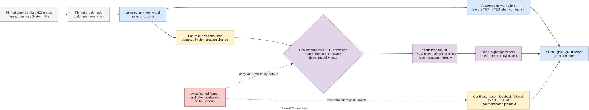

# In-Box gNOI Python Client and Local Access Model

## Table of Contents

- [1. Revision](#1-revision)
- [2. Scope](#2-scope)
- [3. Definitions and Abbreviations](#3-definitions-and-abbreviations)
- [4. Overview](#4-overview)
- [5. Requirements](#5-requirements)
- [6. Architecture Design](#6-architecture-design)
- [7. High-Level Design](#7-high-level-design)
- [8. SAI API](#8-sai-api)
- [9. Configuration and Management](#9-configuration-and-management)
- [10. Warmboot and Fastboot Design Impact](#10-warmboot-and-fastboot-design-impact)
- [11. Memory Consumption](#11-memory-consumption)
- [12. Restrictions and Limitations](#12-restrictions-and-limitations)
- [13. Testing Requirements and Design](#13-testing-requirements-and-design)
- [14. Open and Action Items](#14-open-and-action-items)

## 1. Revision

| Revision | Date | Author | Description |
|----------|------|--------|-------------|
| 0.1 | 2026-08-02 | Dawei Huang | Initial design |

## 2. Scope

This document describes the Python gNOI client package distributed by SONiC and
the security policy for access from SONiC containers to the local gNMI/gNOI
server Unix domain socket (UDS).

The document covers:

- reproducible generation and packaging of Python stubs for the OpenConfig gNOI
  System and File services;
- distribution of the `sonic_grpc` import package through the existing
  `sonic-py-common` wheel;
- secure TCP, insecure test TCP, and UDS transports;
- the privilege granted by mounting `/var/run/gnmi` into a container; and
- admission and removal policy for the container UDS allow-list.

The gNOI server, RPC semantics, authentication, authorization, and host-service
backends are defined by the existing [System API HLD](gnoi_system_hld.md),
[File and Factory Reset API HLD](gnoi_file_factory_reset_hld.md),
[OS API HLD](gnoi_os_hld.md), and
[SONiC gNMI server interface design](SONiC_GNMI_Server_Interface_Design.md).
This document does not redefine those interfaces.

## 3. Definitions and Abbreviations

| Term | Definition |
|------|------------|
| gNMI | gRPC Network Management Interface |
| gNOI | gRPC Network Operations Interface |
| mTLS | Mutual Transport Layer Security |
| RPC | Remote Procedure Call |
| UDS | Unix domain socket |

## 4. Overview

The `sonic_grpc` package provides a typed Python client for SONiC test automation
to invoke gNOI services. Future in-box components can use the same package after
their transport access and threat model are reviewed. The client consists of a
context-managed gRPC channel wrapper, generated System and File service modules,
and test doubles. It is an importable library, not a daemon.

The package and local socket are separate capabilities:

- Installing `sonic_grpc` lets Python code construct gNOI requests and clients.
- Mounting `/var/run/gnmi` lets a container connect to the local gNMI/gNOI
  server at `unix:///var/run/gnmi/gnmi.sock`.

Package availability does not justify socket access. UDS mount access is denied
by default and must be granted only to a named runtime consumer with a reviewed
RPC set and threat model. This policy does not replace review of other local
transports, including host-loopback TCP.



## 5. Requirements

1. A clean build must generate all required Python protobuf and gRPC modules
   from version-pinned, checked-in, checksum-recorded proto inputs.
2. Generated modules and declared `grpcio`/`protobuf` runtime requirements must
   be compatible.
3. Wheel installation must not run code generation.
4. Source and source-distribution builds must be self-contained with respect to
   proto inputs.
5. The package must support caller-supplied channel credentials for secure TCP,
   insecure TCP for controlled tests and local helpers, and UDS for approved
   in-box clients.
6. UDS access must be denied to containers without a concrete runtime consumer.
7. Every UDS allow-list entry must identify an owner, call site, required RPCs,
   and security review.
8. Adding the package or a new service stub must not implicitly expand the UDS
   allow-list.
9. Builds using Python earlier than 3.9 or an armhf-family target must keep the
   existing `sonic-py-common` contents without `sonic_grpc`.
10. The client and server proto revisions must remain wire-compatible for every
    RPC used by a supported consumer.

## 6. Architecture Design

The design adds no service, database, or SAI component. It reuses these existing
SONiC boundaries:

- `sonic-py-common` owns the Python package and its build hook.
- SONiC wheel propagation installs `sonic-py-common` into supported host and
  Python runtime images.
- Focused image pipelines initialize `sonic-py-swsssdk` and its
  `redis-dump-load` dependency for the `sonic-py-common` wheel, plus
  `sonic-swss-common` for the wheel's native build dependency.
- Installer targets depend on `docker_image_ctl.j2` because that template is
  copied into the host image and later renders container launch scripts. A
  container-access policy change must therefore invalidate installer builds.
- The `gnmi` container owns `/var/run/gnmi` and creates `gnmi.sock` with a
  read-write bind mount.
- Explicit container definitions control which other containers see the UDS
  directory.

The implementation spans these repositories:

| Repository | Responsibility |
|------------|----------------|
| `sonic-buildimage` | Package inputs, generation, wheel distribution, image dependencies, and container mounts |
| `SONiC` | Architecture and access-policy documentation |
| `sonic-gnmi` | Server implementation; unchanged by the client package |
| `sonic-mgmt` | Native test consumers; separate from in-box container access |

## 7. High-Level Design

### 7.1. Package Boundary

The `sonic_grpc` import namespace is part of the existing `sonic-py-common`
distribution. It is not a separately versioned wheel. This reuses the existing
host and runtime-image propagation path while keeping imports independent:

```python
from sonic_grpc.gnoi import GnoiClient, file_pb2, system_pb2
```

The package contains:

- `GnoiClient`, which owns one gRPC channel and exposes System and File stubs;
- generated modules for `types`, `common`, `system`, and `file`; and
- `FakeGnoiServer` test helpers.

Adding another gNOI service requires adding its pinned proto closure, generated
modules, runtime compatibility tests, and service property. It does not grant
any container access to the local server.

### 7.2. Reproducible Generation

The package stores the exact OpenConfig gNOI v0.4.0 proto inputs, upstream
license, commit provenance, and SHA-256 digests. The recorded digests provide
provenance but are not revalidated by the build hook. `grpcio-tools==1.66.2`
generates the Python modules during the wheel build and must be available from
the build environment. The build rewrites Python imports and class module
identities into `sonic_grpc.gnoi` while preserving the upstream protobuf
descriptor filenames.

The wheel contains generated Python modules. Proto inputs and provenance remain
in the source distribution so a source build does not depend on another source
repository for protos. Build-cache dependencies include the proto inputs,
generator, package metadata, and build hook.

The runtime requirements are:

- `grpcio>=1.66.2`; and
- `protobuf>=5.29.6,<8`.

### 7.3. Platform and Python Gating

The SONiC build includes `sonic_grpc` when its package-build interpreter is
Python 3.9 or later and the target is not armhf. `armhf`, `armv6*`, `armv7*`,
and `armv8l` are treated as the same unsupported runtime family. Other SONiC
builds still produce `sonic-py-common` without the `sonic_grpc` packages or
runtime dependencies. The resulting `py3-none-any` wheel does not encode this
target gate in wheel metadata and must not be reused on an excluded target.

The build does not probe package-index wheel availability. Before adding a new
package-build interpreter or target architecture, maintainers must verify that
the pinned generator and declared runtime dependencies support it.

### 7.4. Client Transports

`GnoiClient` selects a gRPC channel based on the supplied credentials:

| Transport | Target example | Credentials | Intended use |
|-----------|----------------|-------------|--------------|
| Insecure TCP | `localhost:50051` | None | Unit tests and controlled local helpers |
| Secure TCP | `switch:50052` | `grpc.ChannelCredentials` | Network communication; mTLS requires CA, client key, client certificate, and server enforcement |
| UDS | `unix:///var/run/gnmi/gnmi.sock` | None | Approved in-box clients |

When callers omit credentials, `GnoiClient` creates an insecure channel for any
TCP target; it does not enforce a loopback-only target. Production consumers
must supply credentials for network communication and must not construct an
insecure channel to a network-reachable endpoint.

When certificate configuration is absent, the SONiC `gnmi-native.sh` startup
path can expose plaintext gRPC on `127.0.0.1:8080`. Containers that share the
host network namespace can reach that listener. In this fallback, `--noTLS`
leaves normal user authentication disabled, so registered RPCs are available
over unauthenticated plaintext loopback TCP, subject to global server policy
and handler checks. The UDS allow-list does not control this path. A consumer
security review must assess both UDS and reachable loopback TCP paths.

UDS does not use TLS.

### 7.5. UDS Security Model

The `gnmi` container owns the socket directory and receives the existing
read-write mount. The server creates `gnmi.sock` with mode `0660`, skips normal
application user authentication for Unix peers, and registers the same enabled
gNMI, gNOI, and gNSI services on TCP and UDS.

The server can install a global gRPC authorization policy for both TCP and UDS.
The default `gnmi-native.sh` startup path does not enable this policy, and UDS
peers do not provide a per-container application identity. A global policy can
restrict methods but cannot express a different RPC allow-list for each
container sharing the socket.

At `sonic-gnmi` commit `698e2eadc85bc992a690bc95e3c48f8cac298d18`,
[`server.go`](https://github.com/sonic-net/sonic-gnmi/blob/698e2eadc85bc992a690bc95e3c48f8cac298d18/gnmi_server/server.go)
implements service registration, UDS listener setup, and the `authenticate`
function's UDS authentication bypass.

Consequently, a container that can connect to the UDS receives every registered
local RPC capability permitted by global server policy and handler checks. An
allow-list review may record the intended RPC set, but the server does not
enforce that set per container. Enforceable per-consumer least privilege would
require an identity-bearing interceptor or proxy, or a restricted socket.

A future consumer change may propose a read-only bind mount:

```text
-v /var/run/gnmi:/var/run/gnmi:ro
```

The `:ro` option protects against accidental directory writes. It does not
prevent `connect(2)` to `gnmi.sock` and does not limit supported RPCs. It is not
a security boundary against a compromised container whose capabilities or
security profile permit mount-namespace manipulation, including configurations
with `SYS_ADMIN`, an unconfined AppArmor profile, or `--privileged`. A
compromised allow-listed container can therefore become a path to every enabled
UDS operation, including device reboot or file modification.

The UDS mount is a security-sensitive capability grant, not ordinary package
plumbing.

### 7.6. Allow-List Policy

The default is no UDS mount. A change that adds or retains an allow-list entry
must include all of the following:

1. a concrete runtime call site in the same change or a linked implementation
   change;
2. the owning component and maintainer;
3. the exact gNOI service and RPC methods required;
4. why TCP with mTLS or an existing narrower interface is unsuitable;
5. failure, timeout, and retry behavior;
6. tests proving both the intended operation and absence of access from a
   representative non-allow-listed container; and
7. security review of the consumer's externally reachable interfaces and
   privilege level, including whether it can bypass a read-only bind mount; and
8. assessment of any host-loopback TCP listener reachable from the container,
   including its authentication configuration.

An allow-list entry must be removed when its final runtime consumer is removed.
A package dependency, possible future use, or test-only import is insufficient
justification for the mount.

### 7.7. Default UDS Access State

The deny-by-default UDS access state is:

| Container | Mount | Runtime client | Required disposition |
|-----------|-------|----------------|----------------------|
| `gnmi` | Read-write | Server owner | Retain owner mount |
| `swss` | None | None | Add only with a concrete consumer satisfying section 7.6 |
| `syncd` | None | None | Add only with a concrete consumer satisfying section 7.6 |
| `pmon` | None | None | Add only with a concrete consumer satisfying section 7.6 |

This table records access separately from package installation. Runtime images
may contain `sonic_grpc` without receiving the socket mount.

### 7.8. Serviceability and Debug

The library does not add a process, log, counter, or health state. Consumers are
responsible for bounded RPC deadlines and for logging operation name, target,
gRPC status, and elapsed time without logging credentials or sensitive payloads.
Consumers must close channels deterministically.

### 7.9. Scalability and Performance

Code generation occurs only during package build. Importing the package and
creating channels occur only when a consumer runs. The design adds no polling,
background thread, or RPC to an idle image.

## 8. SAI API

No SAI API change is required. The client package does not communicate with SAI
directly.

## 9. Configuration and Management

### 9.1. Manifest

This is a built-in SONiC library, not a SONiC Application Extension. No manifest
is required.

### 9.2. CLI and YANG Model Enhancements

No CLI or YANG model change is required.

### 9.3. Config DB Enhancements

No Config DB schema change is required.

### 9.4. Database Changes

No APP_DB, ASIC_DB, COUNTERS_DB, LOGLEVEL_DB, CONFIG_DB, or STATE_DB change is
required.

## 10. Warmboot and Fastboot Design Impact

The package adds no operation to the warmboot or fastboot path. No consumer is
started and no RPC is issued merely because the package or mount is present.
There is no expected control-plane or data-plane downtime impact.

Image construction performs package generation, installation, and import
checks. These are build-time operations and do not add CPU work, sleeps, I/O, or
network access to the device boot-critical chain.

### 10.1. Warmboot and Fastboot Performance Impact

- The library adds no stall, sleep, I/O operation, RPC, or daemon to the boot
  critical chain.
- No CPU-heavy runtime processing is added when the library is unused. Jinja
  rendering and protobuf generation occur during image construction.
- Runtime dependency changes affect image contents but do not add startup work
  by themselves.
- There is no service to delay or reorder.
- Expected warmboot and fastboot control-plane and data-plane downtime
  degradation is zero; no optimization is required.

## 11. Memory Consumption

The wheel and its Python runtime dependencies consume image storage. There is no
resident memory cost until a process imports the package. A consumer incurs the
normal gRPC channel and generated-descriptor memory cost; no unbounded growth is
introduced by the library itself.

## 12. Restrictions and Limitations

- The package includes only System and File generated modules.
- SONiC builds omit the package on Python earlier than 3.9 and on the armhf
  family. A supported-build wheel must not be reused on those targets.
- UDS transport provides no TLS identity. Namespace exposure is part of its
  authorization boundary.
- UDS application user authentication is bypassed. A process that can connect
  can invoke every registered RPC permitted by global server policy and handler
  checks; there is no enforced per-container RPC policy.
- Removing a UDS mount does not block host-loopback TCP from a host-network
  container when the certificate-less loopback listener is active.
- `GnoiClient` does not reject a non-loopback insecure TCP target. Production
  consumers must provide channel credentials for network communication.
- The client does not add server-side RPC support or bypass server validation.
- The library does not provide a central retry policy; consumers must use
  bounded deadlines and operation-appropriate retry behavior.

## 13. Testing Requirements and Design

### 13.1. Package Test Cases

Package tests cover:

- deterministic generation of all expected modules;
- descriptor names and rewritten Python module identities;
- imports at declared minimum runtime versions and supported newer versions;
- source-distribution-to-wheel builds;
- exclusion on unsupported Python and armhf aliases;
- insecure TCP and secure-channel selection, caller-supplied channel
  credentials, and UDS target handling;
- channel lifecycle and service-stub guards; and
- fake-server success and error behavior.

The client ships OpenConfig gNOI v0.4.0 modules, while `sonic-gnmi` commit
`698e2eadc85bc992a690bc95e3c48f8cac298d18` uses gNOI v0.3.0. Tests for
supported consumers must cover the service paths and message fields they use
whenever either proto revision changes.

### 13.2. Image Test Cases

Image validation covers:

- importing `sonic_grpc` after installation in supported host and Python runtime
  images;
- importing from `docker-sonic-mgmt` for native test execution;
- unchanged image construction for unsupported Python and armhf targets.

### 13.3. Consumer Admission Test Cases

A change that adds a runtime consumer must cover:

- secure TCP communication with caller-supplied mTLS credentials for a network
  consumer;
- connecting from each approved in-box consumer to `gnmi.sock` with a bounded
  read-only RPC such as `System.Time`;
- confirming a representative non-allow-listed container cannot access the UDS;
- checking whether the same container can reach a host-loopback TCP listener and
  verifying the configured authentication outcome; and
- deadline and error handling for every operation the consumer invokes.

Warmboot and fastboot regression tests remain unchanged because this design adds
no runtime service or boot-time operation.

## 14. Open and Action Items

None.
